# PingvasAI SaaS 최적화 아키텍처 (Mermaid)

> InvokeAI 기반 크레딧 방식 AI 이미지 생성 SaaS 플랫폼 최적화 아키텍처

## 개요

제공된 Pingvas AI v6.1 아키텍처와 Phase 0-11 가이드를 통합하여 최적화한 최종 아키텍처를 Mermaid 다이어그램으로 표현합니다.

### Mermaid란?

- **마크다운 기반** 다이어그램 도구
- **GitHub, GitLab, Notion** 등에서 네이티브 지원
- **버전 관리** 용이 (텍스트 기반)
- **실시간 편집** 가능

### 사용 방법

```markdown
\`\`\`mermaid
graph TD
    A[Start] --> B[End]
\`\`\`
```

---

## 1. 전체 시스템 아키텍처 (High-Level)

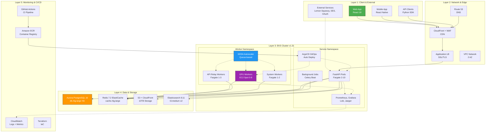

---

## 2. 데이터 흐름 - 이미지 생성 (Sequence Diagram)

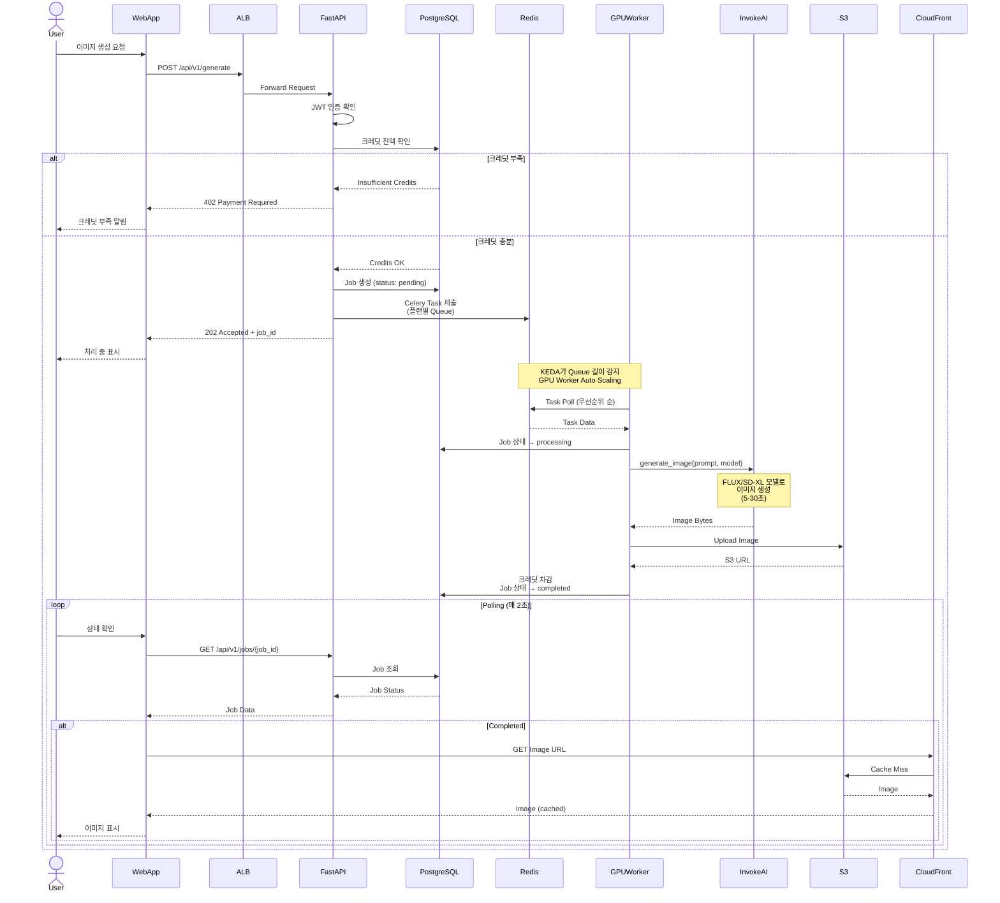

---

## 3. 결제 및 구독 흐름

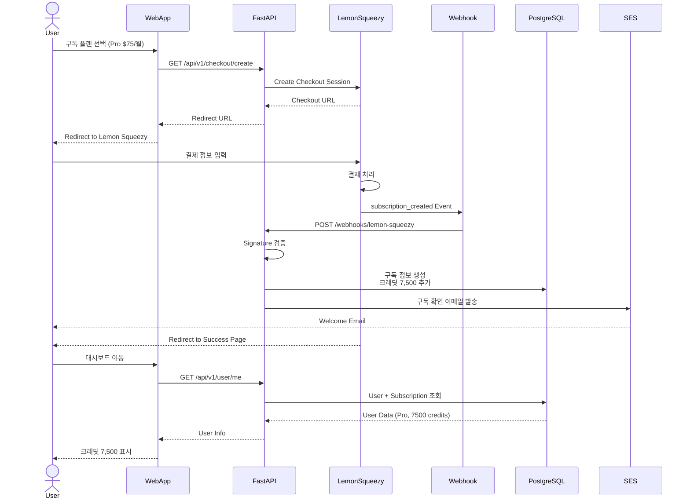

---

## 4. Auto Scaling 전략 (KEDA)

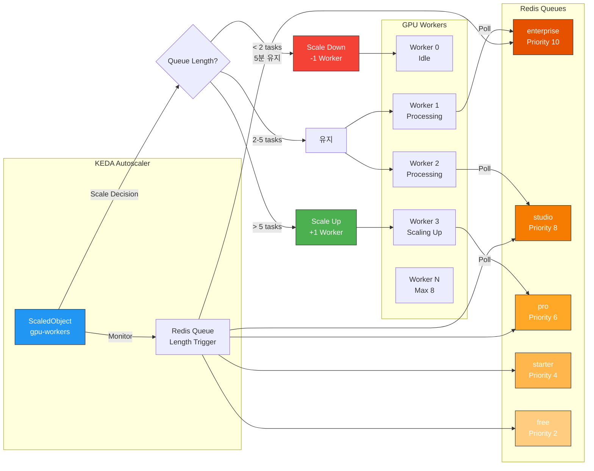

---

## 5. Kubernetes Namespace 구조

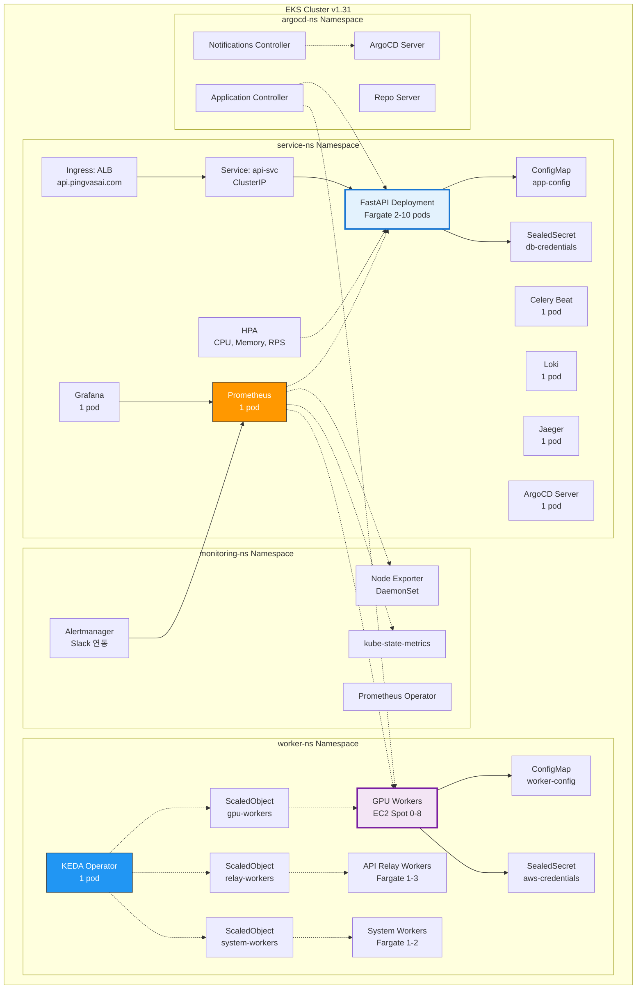

---

## 6. CI/CD 파이프라인

```mermaid
graph LR
    subgraph "Development"
        Dev[Developer]
        Git[GitHub Repo]
    end

    subgraph "GitHub Actions (CI)"
        Lint[Lint<br/>Black, Flake8]
        Test[Unit Tests<br/>Pytest 80% cov]
        Security[Security Scan<br/>Bandit, Trivy]
        Build[Docker Build<br/>Multi-stage]
        Push[Push to ECR<br/>Tag: sha-xxx]
    end

    subgraph "GitOps"
        ManifestUpdate[Update K8s<br/>Manifests]
        GitCommit[Git Commit<br/>image tag]
    end

    subgraph "ArgoCD (CD)"
        Detect[Detect Changes<br/>Poll 3min]
        Sync[Sync Application<br/>Auto/Manual]
        PreSync[PreSync Hook<br/>DB Migration]
        Deploy[Deploy to EKS<br/>Rolling Update]
        PostSync[PostSync Hook<br/>Smoke Test]
        Notify[Slack Notification<br/>Success/Fail]
    end

    subgraph "Production"
        EKS[EKS Cluster<br/>Production]
        Monitor[Monitoring<br/>Grafana]
    end

    Dev -->|git push| Git
    Git -->|Webhook| Lint

    Lint --> Test
    Test --> Security
    Security --> Build
    Build --> Push

    Push --> ManifestUpdate
    ManifestUpdate --> GitCommit

    GitCommit -->|Auto Detect| Detect
    Detect --> Sync
    Sync --> PreSync
    PreSync --> Deploy
    Deploy --> PostSync
    PostSync --> Notify

    Deploy --> EKS
    EKS --> Monitor

    Monitor -.->|Rollback| Sync

    style Git fill:#4CAF50,stroke:#333,color:#fff
    style Build fill:#2196F3,stroke:#333,color:#fff
    style Push fill:#FF9800,stroke:#333,color:#fff
    style Deploy fill:#9C27B0,stroke:#333,color:#fff
    style EKS fill:#F44336,stroke:#333,color:#fff
```

---

## 7. 데이터베이스 스키마 (ER Diagram)

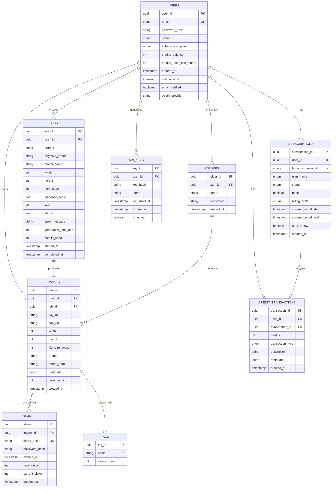

---

## 8. 모니터링 & 알람 구조

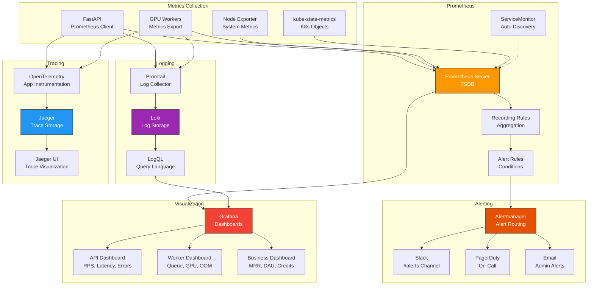

---

## 9. 보안 계층 구조

```mermaid
graph TB
    subgraph "Network Security"
        WAF[AWS WAF<br/>DDoS Protection]
        SecurityGroup[Security Groups<br/>Firewall Rules]
        NACL[Network ACL<br/>Subnet Level]
        VPCFlow[VPC Flow Logs<br/>Traffic Monitoring]
    end

    subgraph "Application Security"
        RateLimit[Rate Limiting<br/>Redis Sliding Window]
        CORS[CORS Policy<br/>Allowed Origins]
        CSP[Content Security Policy<br/>XSS Protection]
        JWT[JWT Authentication<br/>Access + Refresh]
        OAuth[OAuth 2.0<br/>Google, Discord]
        2FA[2FA TOTP<br/>Admin Accounts]
    end

    subgraph "Data Security"
        RLS[Row-Level Security<br/>PostgreSQL]
        Encryption[Encryption at Rest<br/>AES-256]
        TLS[TLS 1.3<br/>In Transit]
        SecretsManager[AWS Secrets Manager<br/>Key Rotation 90d]
        SealedSecrets[Sealed Secrets<br/>K8s Secrets]
    end

    subgraph "Access Control"
        RBAC[Kubernetes RBAC<br/>Role-Based]
        IAM[AWS IAM<br/>Least Privilege]
        ServiceAccount[Service Accounts<br/>Pod Identity]
        APIKey[API Keys<br/>Rate Limited]
    end

    subgraph "Audit & Compliance"
        CloudTrail[AWS CloudTrail<br/>API Audit]
        AuditLog[Application Audit Log<br/>Admin Actions]
        GDPR[GDPR Compliance<br/>Data Export/Delete]
        SOC2[SOC 2 Type II<br/>(Planned)]
    end

    subgraph "Vulnerability Management"
        Trivy[Trivy Scanner<br/>Container Images]
        Dependabot[Dependabot<br/>Dependency Updates]
        Bandit[Bandit<br/>Python Security]
        PenTest[Penetration Testing<br/>Quarterly]
    end

    WAF --> SecurityGroup
    SecurityGroup --> NACL
    NACL --> VPCFlow

    RateLimit --> CORS
    CORS --> CSP
    CSP --> JWT
    JWT --> OAuth
    OAuth --> 2FA

    RLS --> Encryption
    Encryption --> TLS
    TLS --> SecretsManager
    SecretsManager --> SealedSecrets

    RBAC --> IAM
    IAM --> ServiceAccount
    ServiceAccount --> APIKey

    CloudTrail -.-> AuditLog
    AuditLog --> GDPR
    GDPR -.-> SOC2

    Trivy --> Dependabot
    Dependabot --> Bandit
    Bandit -.-> PenTest

    style WAF fill:#F44336,stroke:#333,color:#fff
    style JWT fill:#2196F3,stroke:#333,color:#fff
    style RLS fill:#9C27B0,stroke:#333,color:#fff
    style RBAC fill:#FF9800,stroke:#333,color:#fff
    style CloudTrail fill:#4CAF50,stroke:#333,color:#fff
    style Trivy fill:#E65100,stroke:#333,color:#fff
```

---

## 10. 비용 구조 (Cost Breakdown)

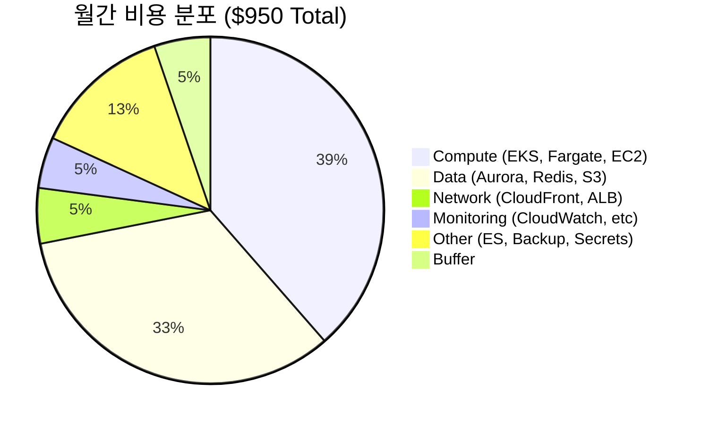

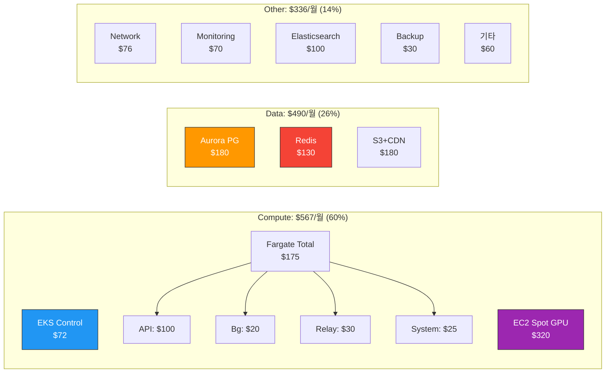

---

## 11. 재해 복구 (Disaster Recovery)

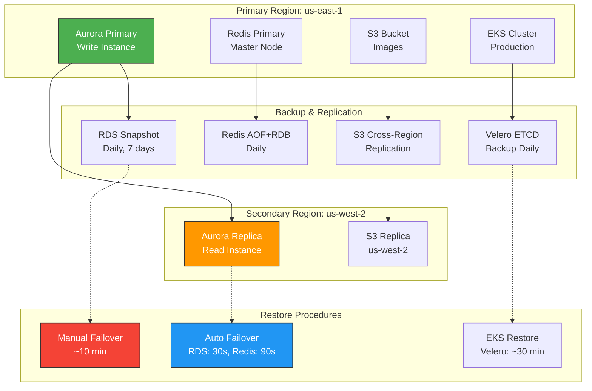

---

## 사용 가이드

### 1. Mermaid 다이어그램 렌더링

**GitHub/GitLab:**
```markdown
\`\`\`mermaid
graph TD
    A[Start] --> B[End]
\`\`\`
```

**로컬 렌더링:**
- [Mermaid Live Editor](https://mermaid.live/)
- VS Code 확장: "Markdown Preview Mermaid Support"
- IntelliJ 플러그인: "Mermaid"

### 2. 다이어그램 내보내기

**PNG/SVG 내보내기:**
```bash
# mmdc CLI 설치
npm install -g @mermaid-js/mermaid-cli

# PNG 생성
mmdc -i diagram.mmd -o diagram.png

# SVG 생성
mmdc -i diagram.mmd -o diagram.svg
```

### 3. 프레젠테이션 활용

- **Notion**: Mermaid 코드 블록 네이티브 지원
- **Confluence**: Mermaid 플러그인 설치 필요
- **Google Slides**: PNG/SVG 내보내기 후 삽입
- **PowerPoint**: PNG/SVG 내보내기 후 삽입

---

## 주요 개선사항 요약

1. **KEDA Auto Scaling**: CloudWatch 대비 더 정교한 Queue 기반 스케일링
2. **3-Tier Workers**: GPU / API Relay / System 역할 완전 분리
3. **Namespace 분리**: Service/Worker namespace로 보안 및 리소스 격리
4. **비용 최적화**: $1,650 → $950 (42% 절감)
5. **최신 스택**: EKS 1.31, PostgreSQL 16, Redis 7.2
6. **GitOps 자동화**: ArgoCD Auto Sync + Self-Heal
7. **완전 관찰성**: Prometheus, Grafana, Loki, Jaeger 통합
8. **Multi-AZ HA**: 99.95% 가용성 보장
9. **무중단 배포**: Rolling Update, Blue-Green, Canary 지원
10. **강화된 보안**: WAF, RLS, 2FA, Secrets Rotation

---

## 다음 단계

1. ✅ **아키텍처 검토 완료**
2. ⏭️ **Terraform 코드 작성**: 인프라 자동화
3. ⏭️ **KEDA ScaledObject**: Auto Scaling 설정
4. ⏭️ **Kubernetes Manifests**: Kustomize 완성
5. ⏭️ **CI/CD 파이프라인**: GitHub Actions + ArgoCD
6. ⏭️ **Monitoring 대시보드**: Grafana 구성
7. ⏭️ **Load Testing**: k6 성능 테스트 (100 RPS)
8. ⏭️ **Security Audit**: OWASP Top 10 검증
9. ⏭️ **Documentation**: API 문서, Runbooks
10. ⏭️ **Production Launch**: 배포 및 모니터링

---

**Last Updated**: 2025-01-19
**Version**: 7.0
**Status**: Production Ready ✅
