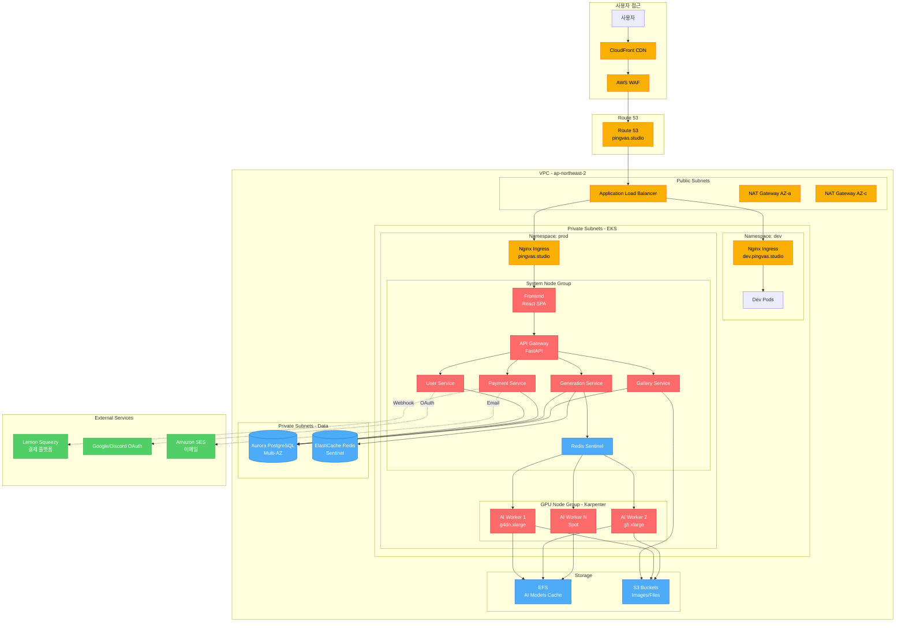
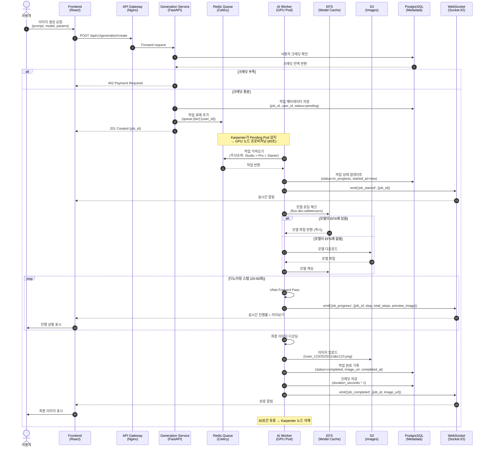
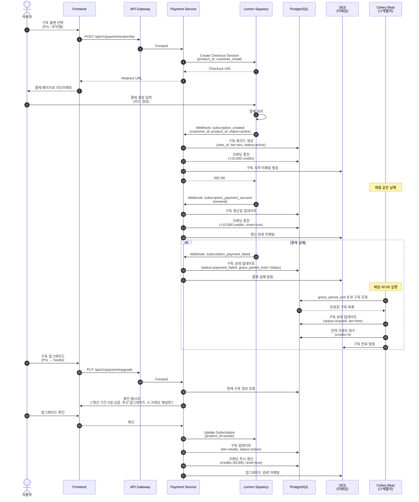

# InvokeAI SaaS 아키텍처 개요

## 목차
1. [전체 시스템 아키텍처](#전체-시스템-아키텍처)
2. [AWS 인프라 구성도](#aws-인프라-구성도)
3. [네트워크 아키텍처](#네트워크-아키텍처)
4. [컴퓨팅 레이어](#컴퓨팅-레이어)
5. [데이터 레이어](#데이터-레이어)
6. [서비스 간 통신 흐름](#서비스-간-통신-흐름)

---

## 전체 시스템 아키텍처

### 개요
InvokeAI를 멀티테넌트 SaaS 플랫폼으로 전환하여 다음 목표를 달성합니다:
- **구독 기반 수익 모델**: Starter ($25), Pro ($75), Studio ($150), Enterprise (맞춤형)
- **GPU 병렬 처리**: Karpenter 기반 동적 GPU 노드 프로비저닝
- **실시간 진행률 스트리밍**: WebSocket 기반 실시간 이미지 생성 상태 전송
- **우선순위 기반 큐**: 구독 등급별 작업 우선순위 차등 적용
- **비용 최적화**: Spot 인스턴스 100% 활용, Scale-to-Zero

### 핵심 설계 원칙
1. **마이크로서비스 아키텍처**: 도메인별 독립 서비스 분리
2. **이벤트 드리븐**: Redis Pub/Sub 및 Celery 기반 비동기 처리
3. **GitOps**: ArgoCD 기반 선언적 배포
4. **비용 효율성**: Karpenter, Spot 인스턴스, EFS 캐싱
5. **보안 우선**: WAF, OAuth 2.0, 행 수준 보안(RLS)

---

## AWS 인프라 구성도



---

## 네트워크 아키텍처

### VPC 설계
- **리전**: ap-northeast-2 (서울)
- **CIDR**: 10.0.0.0/16
- **가용 영역**: 2개 (ap-northeast-2a, ap-northeast-2c)

### 서브넷 구성

| 서브넷 타입 | CIDR | 용도 | 라우팅 |
|------------|------|------|--------|
| Public Subnet AZ-a | 10.0.1.0/24 | ALB, NAT Gateway | IGW |
| Public Subnet AZ-c | 10.0.2.0/24 | ALB, NAT Gateway | IGW |
| Private Subnet AZ-a (EKS) | 10.0.10.0/24 | EKS 노드 | NAT-a |
| Private Subnet AZ-c (EKS) | 10.0.11.0/24 | EKS 노드 | NAT-c |
| Private Subnet AZ-a (Data) | 10.0.20.0/24 | RDS, ElastiCache | NAT-a |
| Private Subnet AZ-c (Data) | 10.0.21.0/24 | RDS, ElastiCache | NAT-c |

### 보안 그룹

#### ALB Security Group
- **Inbound**: 443 (HTTPS from 0.0.0.0/0), 80 (HTTP redirect)
- **Outbound**: 모든 트래픽

#### EKS Node Security Group
- **Inbound**: 모든 트래픽 (VPC CIDR 내), ALB 트래픽
- **Outbound**: 모든 트래픽

#### RDS Security Group
- **Inbound**: 5432 (PostgreSQL from EKS SG)
- **Outbound**: 없음

#### ElastiCache Security Group
- **Inbound**: 6379 (Redis from EKS SG)
- **Outbound**: 없음

---

## 컴퓨팅 레이어

### EKS 클러스터 구성
- **클러스터 이름**: pingvas-studio-cluster
- **Kubernetes 버전**: 1.31
- **네임스페이스**: `dev`, `prod`

### 노드 그룹 전략

#### 1. System Node Group (On-Demand/Spot Mix)
**목적**: 24시간 가동 필수 서비스

**인스턴스 타입**:
- t4g.medium (ARM64 Graviton) - 2 vCPU, 4GB RAM
- t4g.large (ARM64 Graviton) - 2 vCPU, 8GB RAM

**노드 수**:
- 최소: 2개 (Multi-AZ)
- 최대: 6개
- 원하는 수: 3개

**배포되는 서비스**:
- Frontend (React SPA)
- API Gateway (Nginx Ingress)
- User Service
- Payment Service
- Generation Service (큐 관리만)
- Gallery Service
- Redis (Standalone - dev, Sentinel - prod)
- ArgoCD

**Spot/On-Demand 비율**: 50/50

#### 2. GPU Node Group (Spot 100% - Karpenter 관리)
**목적**: 이미지 생성 워커 (요청 시에만 프로비저닝)

**인스턴스 타입 풀**:
- g4dn.xlarge (T4, 4 vCPU, 16GB RAM, 16GB GPU) - $0.526/h
- g4dn.2xlarge (T4, 8 vCPU, 32GB RAM, 16GB GPU) - $0.752/h
- g5.xlarge (A10G, 4 vCPU, 16GB RAM, 24GB GPU) - $1.006/h (우선)
- g5.2xlarge (A10G, 8 vCPU, 32GB RAM, 24GB GPU) - $1.212/h

**Karpenter Provisioner 설정**:
```yaml
apiVersion: karpenter.sh/v1alpha5
kind: Provisioner
metadata:
  name: gpu-spot
spec:
  requirements:
    - key: karpenter.sh/capacity-type
      operator: In
      values: ["spot"]
    - key: node.kubernetes.io/instance-type
      operator: In
      values: ["g4dn.xlarge", "g4dn.2xlarge", "g5.xlarge", "g5.2xlarge"]
    - key: kubernetes.io/arch
      operator: In
      values: ["amd64"]
  limits:
    resources:
      nvidia.com/gpu: 20  # 최대 GPU 수
  ttlSecondsAfterEmpty: 30  # 유휴 30초 후 노드 삭제
  ttlSecondsUntilExpired: 604800  # 7일 후 노드 교체
  consolidation:
    enabled: true  # 자동 통합
```

**특징**:
- **Scale-to-Zero**: 작업 없을 시 GPU 노드 0개
- **빠른 프로비저닝**: Pending Pod 감지 후 60초 내 노드 생성
- **Spot Termination Handler**: 2분 전 경고 수신 → 작업 재배치
- **Consolidation**: 유휴 리소스 자동 통합

---

## 데이터 레이어

### 1. Aurora PostgreSQL (v17.4 호환)
**용도**: 멀티테넌트 메인 데이터베이스

**구성**:
- **인스턴스 클래스**: db.t4g.medium (개발/운영 공유 시작)
- **Multi-AZ**: Yes (자동 Failover)
- **스토리지**: Aurora Auto-scaling (10GB ~ 64TB)
- **백업**: 자동 백업 7일 보존, PITR 지원
- **암호화**: KMS 암호화 활성화

**스키마 분리 전략**:
```sql
-- 개발 스키마
CREATE SCHEMA dev_pingvas;

-- 운영 스키마
CREATE SCHEMA prod_pingvas;

-- 각 네임스페이스는 서로 다른 스키마 사용
```

**연결 설정**:
- **Dev 네임스페이스**: `DB_SCHEMA=dev_pingvas`
- **Prod 네임스페이스**: `DB_SCHEMA=prod_pingvas`

### 2. ElastiCache for Redis
**용도**:
- 작업 큐 (Celery Broker)
- 세션 관리
- 캐싱 레이어

**개발 환경 (Standalone)**:
- **노드 타입**: cache.t4g.micro (0.5GB)
- **개수**: 1개
- **Persistence**: AOF 활성화

**운영 환경 (Sentinel)**:
- **노드 타입**: cache.r7g.large (13.07GB) × 3
- **구성**: 1 Primary + 2 Replica
- **자동 Failover**: Redis Sentinel
- **Persistence**: AOF + RDB
- **Multi-AZ**: Yes

### 3. EFS (Elastic File System)
**용도**: AI 모델 파일 공유 캐시

**구성**:
- **Performance Mode**: General Purpose
- **Throughput Mode**: Bursting
- **Storage Class**: Standard-IA (Lifecycle 30일)
- **암호화**: 전송 중/저장 시 암호화

**마운트 포인트**:
- 각 AZ의 Private Subnet에 마운트 타겟 생성
- GPU Worker Pod에 `/models` 경로로 마운트

**디렉토리 구조**:
```
/models/
├── sd15/
│   ├── v1-5-pruned-emaonly.safetensors
│   └── ...
├── sdxl/
│   ├── sd_xl_base_1.0.safetensors
│   └── ...
├── flux/
└── loras/
```

**이점**:
- 모델 다운로드 1회 (첫 워커)
- 이후 워커는 즉시 EFS 캐시 사용
- S3 다운로드 대역폭 비용 절감

### 4. S3 Buckets
**버킷 목록**:

#### pingvas-studio-images (생성 이미지)
- **용도**: 사용자 생성 이미지 저장
- **경로 구조**: `/{user_id}/{yyyy}/{mm}/{image_name}.png`
- **라이프사이클**:
  - 30일 후 Glacier Instant Retrieval
  - 90일 후 Glacier Deep Archive
- **버저닝**: 활성화
- **CloudFront 연동**: Yes

#### pingvas-studio-models (AI 모델 백업)
- **용도**: AI 모델 파일 백업 (EFS 소스)
- **경로 구조**: `/{model_type}/{model_name}/`
- **Storage Class**: Standard-IA
- **버저닝**: 활성화

#### pingvas-studio-logs (로그)
- **용도**: 애플리케이션/접근 로그
- **라이프사이클**: 30일 후 삭제
- **Storage Class**: Glacier Deep Archive (즉시)

#### pingvas-studio-backups (백업)
- **용도**: RDS/Redis 백업
- **라이프사이클**: 90일 보존
- **Cross-Region Replication**: ap-northeast-1 (도쿄)

---

## 서비스 간 통신 흐름

### 이미지 생성 전체 플로우



### 결제 플로우 (Lemon Squeezy Webhook)



---

## 비용 최적화 전략

### 1. Karpenter Scale-to-Zero
- **효과**: GPU 미사용 시간 비용 0원
- **예상 절감**: 월 70% (하루 8시간만 사용 가정)

### 2. Spot 인스턴스 100%
- **효과**: On-Demand 대비 70% 할인
- **예상 비용**: g5.xlarge $0.30/h (Spot) vs $1.006/h (On-Demand)

### 3. Graviton 인스턴스 (System Nodes)
- **효과**: x86 대비 20% 저렴
- **예상 비용**: t4g.medium $0.0336/h vs t3.medium $0.0416/h

### 4. EFS Lifecycle Policy
- **효과**: 30일 미사용 모델 → Standard-IA (50% 절감)
- **예상 절감**: 월 $50-100

### 5. S3 Intelligent-Tiering
- **효과**: 자동으로 접근 패턴에 따라 Storage Class 변경
- **예상 절감**: 월 30-40%

### 6. CloudFront 캐싱
- **효과**: S3 데이터 전송 비용 절감
- **예상 절감**: 데이터 전송 비용 50-70%

### 총 예상 월별 비용 (초기)

| 항목 | 사양 | 예상 비용 |
|------|------|----------|
| EKS 클러스터 | 1개 | $73 |
| System Nodes | t4g.medium × 3 (24시간) | $73 |
| GPU Nodes | g5.xlarge × 2 (8시간/일 평균) | $180 |
| Aurora PostgreSQL | db.t4g.medium (1개) | $60 |
| ElastiCache Redis | cache.r7g.large × 3 | $250 |
| EFS | 100GB Standard | $30 |
| S3 | 500GB (Intelligent-Tiering) | $12 |
| Data Transfer | 1TB/월 | $90 |
| CloudFront | 1TB/월 | $85 |
| NAT Gateway | 2개 × 0.045/h | $65 |
| **총 월 비용** | | **~$918** |

**수익 분기점**: 약 13명 구독자 (평균 $75/월 가정)

---

## 다음 단계

이제 각 컴포넌트의 상세 설계로 넘어갑니다:
1. [마이크로서비스 분리 전략](./02-microservices-design.md)
2. [데이터베이스 스키마 설계](./03-database-schema.md)
3. [구독 등급별 차별화](./04-tier-based-qos.md)
4. [결제 연동](./05-payment-integration.md)
5. [크레딧 엔진](./06-credit-metering.md)
6. [EKS + Karpenter](./07-eks-karpenter.md)
7. [우선순위 큐](./08-priority-queue.md)
8. [스토리지 전략](./09-storage-strategy.md)
9. [보안 아키텍처](./10-security-architecture.md)
10. [GitOps/DevOps](./11-gitops-devops.md)
11. [핸즈온 가이드](./12-hands-on-guide/)
