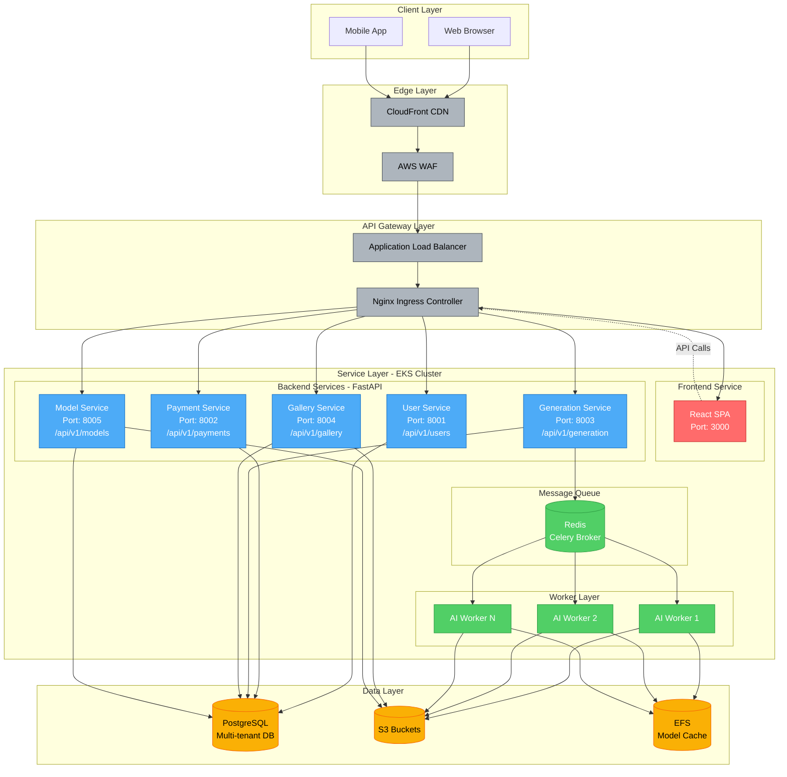

# 마이크로서비스 분리 전략 및 API Gateway 설계

## 목차
1. [서비스 분리 원칙](#서비스-분리-원칙)
2. [마이크로서비스 아키텍처](#마이크로서비스-아키텍처)
3. [API Gateway 설계](#api-gateway-설계)
4. [각 서비스 상세 설계](#각-서비스-상세-설계)
5. [서비스 간 통신 패턴](#서비스-간-통신-패턴)
6. [배포 전략](#배포-전략)

---

## 서비스 분리 원칙

### 도메인 주도 설계 (DDD)
InvokeAI 오픈소스를 다음 도메인으로 분리합니다:

| 도메인 | 책임 | 기존 InvokeAI 매핑 |
|--------|------|---------------------|
| **User** | 사용자 관리, 인증, 프로필 | ❌ 없음 (신규) |
| **Payment** | 구독, 결제, 크레딧 | ❌ 없음 (신규) |
| **Generation** | 이미지 생성 요청, 큐 관리 | ✅ `session_queue`, `invocations` |
| **Gallery** | 이미지 메타데이터, 보드 | ✅ `images`, `boards` |
| **Model** | 모델 관리, 다운로드 | ✅ `model_manager`, `download_queue` |

### 분리 기준
1. **단일 책임 원칙**: 각 서비스는 하나의 비즈니스 도메인만 담당
2. **데이터 소유권**: 각 서비스는 자신의 데이터베이스 테이블을 소유
3. **독립 배포**: 서비스 간 의존성 최소화하여 독립적 배포 가능
4. **팀 조직**: 서비스별로 팀 할당 가능한 크기

---

## 마이크로서비스 아키텍처



---

## API Gateway 설계

### Nginx Ingress Controller 설정

#### 전체 라우팅 규칙

```yaml
apiVersion: networking.k8s.io/v1
kind: Ingress
metadata:
  name: pingvas-studio-ingress
  namespace: prod
  annotations:
    # SSL/TLS
    cert-manager.io/cluster-issuer: "letsencrypt-prod"

    # CORS
    nginx.ingress.kubernetes.io/enable-cors: "true"
    nginx.ingress.kubernetes.io/cors-allow-origin: "https://pingvas.studio, https://www.pingvas.studio"
    nginx.ingress.kubernetes.io/cors-allow-methods: "GET, POST, PUT, DELETE, PATCH, OPTIONS"
    nginx.ingress.kubernetes.io/cors-allow-credentials: "true"

    # Rate Limiting (사용자별)
    nginx.ingress.kubernetes.io/limit-rps: "100"
    nginx.ingress.kubernetes.io/limit-burst-multiplier: "5"

    # WebSocket 지원
    nginx.ingress.kubernetes.io/proxy-read-timeout: "3600"
    nginx.ingress.kubernetes.io/proxy-send-timeout: "3600"
    nginx.ingress.kubernetes.io/websocket-services: "generation-service"

    # 업로드 크기 제한
    nginx.ingress.kubernetes.io/proxy-body-size: "100m"

    # 보안 헤더
    nginx.ingress.kubernetes.io/configuration-snippet: |
      more_set_headers "X-Frame-Options: DENY";
      more_set_headers "X-Content-Type-Options: nosniff";
      more_set_headers "X-XSS-Protection: 1; mode=block";
      more_set_headers "Referrer-Policy: strict-origin-when-cross-origin";

spec:
  ingressClassName: nginx
  tls:
    - hosts:
        - pingvas.studio
        - www.pingvas.studio
      secretName: pingvas-studio-tls

  rules:
    - host: pingvas.studio
      http:
        paths:
          # Frontend SPA
          - path: /
            pathType: Prefix
            backend:
              service:
                name: frontend-service
                port:
                  number: 3000

          # User Service
          - path: /api/v1/users
            pathType: Prefix
            backend:
              service:
                name: user-service
                port:
                  number: 8001

          - path: /api/v1/auth
            pathType: Prefix
            backend:
              service:
                name: user-service
                port:
                  number: 8001

          # Payment Service
          - path: /api/v1/payments
            pathType: Prefix
            backend:
              service:
                name: payment-service
                port:
                  number: 8002

          - path: /api/v1/subscriptions
            pathType: Prefix
            backend:
              service:
                name: payment-service
                port:
                  number: 8002

          - path: /api/v1/credits
            pathType: Prefix
            backend:
              service:
                name: payment-service
                port:
                  number: 8002

          # Generation Service
          - path: /api/v1/generation
            pathType: Prefix
            backend:
              service:
                name: generation-service
                port:
                  number: 8003

          - path: /ws/socket.io
            pathType: Prefix
            backend:
              service:
                name: generation-service
                port:
                  number: 8003

          # Gallery Service
          - path: /api/v1/gallery
            pathType: Prefix
            backend:
              service:
                name: gallery-service
                port:
                  number: 8004

          - path: /api/v1/boards
            pathType: Prefix
            backend:
              service:
                name: gallery-service
                port:
                  number: 8004

          - path: /api/v1/images
            pathType: Prefix
            backend:
              service:
                name: gallery-service
                port:
                  number: 8004

          # Model Service
          - path: /api/v1/models
            pathType: Prefix
            backend:
              service:
                name: model-service
                port:
                  number: 8005
```

### 인증 미들웨어

모든 보호된 엔드포인트는 JWT 토큰 검증을 거칩니다:

```python
# common/middleware/auth.py
from fastapi import Request, HTTPException, status
from fastapi.security import HTTPBearer, HTTPAuthorizationCredentials
import jwt
from datetime import datetime, timedelta

security = HTTPBearer()

async def verify_token(credentials: HTTPAuthorizationCredentials = Depends(security)):
    token = credentials.credentials
    try:
        payload = jwt.decode(
            token,
            settings.JWT_SECRET_KEY,
            algorithms=[settings.JWT_ALGORITHM]
        )
        user_id: str = payload.get("sub")
        if user_id is None:
            raise HTTPException(
                status_code=status.HTTP_401_UNAUTHORIZED,
                detail="Invalid authentication credentials"
            )
        return payload
    except jwt.ExpiredSignatureError:
        raise HTTPException(
            status_code=status.HTTP_401_UNAUTHORIZED,
            detail="Token has expired"
        )
    except jwt.JWTError:
        raise HTTPException(
            status_code=status.HTTP_401_UNAUTHORIZED,
            detail="Could not validate credentials"
        )
```

---

## 각 서비스 상세 설계

### 1. User Service (포트 8001)

**책임**:
- 사용자 회원가입/로그인
- OAuth 2.0 (Google, Discord) 통합
- 프로필 관리
- JWT 토큰 발급/갱신

**기술 스택**:
- FastAPI
- SQLAlchemy (PostgreSQL ORM)
- Authlib (OAuth 클라이언트)
- PassLib (비밀번호 해싱)
- PyJWT

**API 엔드포인트**:

```python
# services/user/main.py
from fastapi import FastAPI, Depends, HTTPException
from sqlalchemy.orm import Session

app = FastAPI(title="User Service", version="1.0.0")

# 회원가입
@app.post("/api/v1/users/register", response_model=UserResponse)
async def register(user: UserCreate, db: Session = Depends(get_db)):
    """
    이메일/비밀번호 회원가입
    """
    # 1. 이메일 중복 체크
    existing = db.query(User).filter(User.email == user.email).first()
    if existing:
        raise HTTPException(status_code=400, detail="Email already registered")

    # 2. 비밀번호 해싱
    hashed_password = hash_password(user.password)

    # 3. 사용자 생성
    db_user = User(
        email=user.email,
        password_hash=hashed_password,
        display_name=user.display_name,
        tier="free",  # 기본 등급
        created_at=datetime.utcnow()
    )
    db.add(db_user)
    db.commit()
    db.refresh(db_user)

    return db_user

# 로그인
@app.post("/api/v1/auth/login", response_model=TokenResponse)
async def login(credentials: LoginRequest, db: Session = Depends(get_db)):
    """
    이메일/비밀번호 로그인
    """
    user = db.query(User).filter(User.email == credentials.email).first()
    if not user or not verify_password(credentials.password, user.password_hash):
        raise HTTPException(status_code=401, detail="Invalid credentials")

    # JWT 토큰 생성
    access_token = create_access_token(data={"sub": str(user.id), "tier": user.tier})
    refresh_token = create_refresh_token(data={"sub": str(user.id)})

    return {
        "access_token": access_token,
        "refresh_token": refresh_token,
        "token_type": "bearer"
    }

# OAuth Google 콜백
@app.get("/api/v1/auth/google/callback")
async def google_callback(code: str, db: Session = Depends(get_db)):
    """
    Google OAuth 콜백 핸들러
    """
    # 1. Google에서 토큰 교환
    token = await oauth.google.authorize_access_token(code)

    # 2. 사용자 정보 가져오기
    user_info = await oauth.google.parse_id_token(token)
    email = user_info["email"]

    # 3. 기존 사용자 확인 또는 생성
    user = db.query(User).filter(User.email == email).first()
    if not user:
        user = User(
            email=email,
            display_name=user_info.get("name"),
            avatar_url=user_info.get("picture"),
            oauth_provider="google",
            oauth_id=user_info["sub"],
            tier="free"
        )
        db.add(user)
        db.commit()
        db.refresh(user)

    # 4. JWT 발급
    access_token = create_access_token(data={"sub": str(user.id), "tier": user.tier})

    return RedirectResponse(f"https://pingvas.studio/?token={access_token}")

# 프로필 조회
@app.get("/api/v1/users/me", response_model=UserResponse)
async def get_current_user(
    current_user: dict = Depends(verify_token),
    db: Session = Depends(get_db)
):
    user = db.query(User).filter(User.id == current_user["sub"]).first()
    return user

# 프로필 업데이트
@app.patch("/api/v1/users/me", response_model=UserResponse)
async def update_profile(
    updates: UserUpdate,
    current_user: dict = Depends(verify_token),
    db: Session = Depends(get_db)
):
    user = db.query(User).filter(User.id == current_user["sub"]).first()

    for field, value in updates.dict(exclude_unset=True).items():
        setattr(user, field, value)

    user.updated_at = datetime.utcnow()
    db.commit()
    db.refresh(user)

    return user
```

**데이터 모델**:

```python
# services/user/models.py
from sqlalchemy import Column, String, DateTime, Enum
from sqlalchemy.dialects.postgresql import UUID
import uuid
import enum

class OAuthProvider(str, enum.Enum):
    GOOGLE = "google"
    DISCORD = "discord"
    EMAIL = "email"

class User(Base):
    __tablename__ = "users"

    id = Column(UUID(as_uuid=True), primary_key=True, default=uuid.uuid4)
    email = Column(String(255), unique=True, nullable=False, index=True)
    password_hash = Column(String(255), nullable=True)  # OAuth는 null
    display_name = Column(String(100))
    avatar_url = Column(String(500))

    # OAuth
    oauth_provider = Column(Enum(OAuthProvider), default=OAuthProvider.EMAIL)
    oauth_id = Column(String(255))

    # 구독 정보 (Payment Service에서 업데이트)
    tier = Column(String(20), default="free")  # free, starter, pro, studio, enterprise

    # 타임스탬프
    created_at = Column(DateTime, nullable=False)
    updated_at = Column(DateTime)
    last_login_at = Column(DateTime)
```

---

### 2. Payment Service (포트 8002)

**책임**:
- Lemon Squeezy 구독 관리
- Webhook 처리
- 크레딧 관리
- 구독 업그레이드/다운그레이드

**API 엔드포인트**:

```python
# services/payment/main.py
from fastapi import FastAPI, Request, BackgroundTasks
import hmac
import hashlib

app = FastAPI(title="Payment Service")

# 구독 체크아웃 세션 생성
@app.post("/api/v1/payments/checkout")
async def create_checkout_session(
    plan: SubscriptionPlan,
    current_user: dict = Depends(verify_token),
    db: Session = Depends(get_db)
):
    """
    Lemon Squeezy 체크아웃 세션 생성
    """
    # Lemon Squeezy API 호출
    response = await lemon_squeezy_client.create_checkout(
        product_id=plan.product_id,
        customer_email=current_user["email"],
        custom_data={
            "user_id": current_user["sub"],
            "tier": plan.tier
        }
    )

    return {"checkout_url": response["data"]["attributes"]["url"]}

# Lemon Squeezy Webhook
@app.post("/api/v1/payments/webhook")
async def lemon_squeezy_webhook(
    request: Request,
    background_tasks: BackgroundTasks,
    db: Session = Depends(get_db)
):
    """
    Lemon Squeezy Webhook 핸들러
    """
    # 1. 서명 검증
    signature = request.headers.get("X-Signature")
    body = await request.body()

    if not verify_webhook_signature(body, signature):
        raise HTTPException(status_code=401, detail="Invalid signature")

    # 2. 이벤트 처리
    payload = await request.json()
    event_type = payload["meta"]["event_name"]

    if event_type == "subscription_created":
        background_tasks.add_task(handle_subscription_created, payload, db)
    elif event_type == "subscription_updated":
        background_tasks.add_task(handle_subscription_updated, payload, db)
    elif event_type == "subscription_payment_success":
        background_tasks.add_task(handle_payment_success, payload, db)
    elif event_type == "subscription_payment_failed":
        background_tasks.add_task(handle_payment_failed, payload, db)
    elif event_type == "subscription_cancelled":
        background_tasks.add_task(handle_subscription_cancelled, payload, db)

    return {"status": "ok"}

# 구독 생성 핸들러
async def handle_subscription_created(payload: dict, db: Session):
    data = payload["data"]["attributes"]
    user_id = data["custom_data"]["user_id"]
    tier = data["custom_data"]["tier"]

    # 1. 구독 레코드 생성
    subscription = Subscription(
        user_id=user_id,
        lemon_squeezy_id=payload["data"]["id"],
        tier=tier,
        status="active",
        current_period_start=data["renews_at"],
        current_period_end=data["renews_at"],
    )
    db.add(subscription)

    # 2. 사용자 등급 업데이트
    user = db.query(User).filter(User.id == user_id).first()
    user.tier = tier

    # 3. 초기 크레딧 지급
    credits = get_credits_for_tier(tier)
    credit_balance = CreditBalance(
        user_id=user_id,
        balance=credits,
        granted_at=datetime.utcnow()
    )
    db.add(credit_balance)

    db.commit()

    # 4. 이메일 발송
    await send_subscription_welcome_email(user.email, tier)

# 크레딧 잔액 조회
@app.get("/api/v1/credits/balance")
async def get_credit_balance(
    current_user: dict = Depends(verify_token),
    db: Session = Depends(get_db)
):
    balance = db.query(CreditBalance).filter(
        CreditBalance.user_id == current_user["sub"]
    ).first()

    return {"balance": balance.balance if balance else 0}
```

**데이터 모델**:

```python
# services/payment/models.py
class Subscription(Base):
    __tablename__ = "subscriptions"

    id = Column(UUID(as_uuid=True), primary_key=True, default=uuid.uuid4)
    user_id = Column(UUID(as_uuid=True), nullable=False, index=True)
    lemon_squeezy_id = Column(String(255), unique=True, index=True)

    tier = Column(String(20), nullable=False)  # starter, pro, studio, enterprise
    status = Column(String(20), nullable=False)  # active, past_due, cancelled, expired

    current_period_start = Column(DateTime)
    current_period_end = Column(DateTime)
    grace_period_end = Column(DateTime)

    created_at = Column(DateTime)
    updated_at = Column(DateTime)
    cancelled_at = Column(DateTime)

class CreditBalance(Base):
    __tablename__ = "credit_balances"

    id = Column(UUID(as_uuid=True), primary_key=True, default=uuid.uuid4)
    user_id = Column(UUID(as_uuid=True), unique=True, nullable=False, index=True)
    balance = Column(Integer, default=0, nullable=False)

    last_granted_at = Column(DateTime)
    updated_at = Column(DateTime)

class CreditTransaction(Base):
    __tablename__ = "credit_transactions"

    id = Column(UUID(as_uuid=True), primary_key=True, default=uuid.uuid4)
    user_id = Column(UUID(as_uuid=True), nullable=False, index=True)

    amount = Column(Integer, nullable=False)  # 양수: 충전, 음수: 차감
    type = Column(String(50), nullable=False)  # subscription_grant, generation_usage, api_usage

    job_id = Column(UUID(as_uuid=True))  # 이미지 생성 작업 ID (optional)
    description = Column(String(500))

    created_at = Column(DateTime, nullable=False, index=True)
```

---

### 3. Generation Service (포트 8003)

**책임**:
- 이미지 생성 요청 접수
- 작업 큐 관리
- WebSocket 실시간 진행률 전송
- 워크플로우 실행

**API 엔드포인트**:

```python
# services/generation/main.py
from fastapi import FastAPI, WebSocket
from celery import Celery
import socketio

app = FastAPI(title="Generation Service")
sio = socketio.AsyncServer(async_mode="asgi", cors_allowed_origins="*")
socket_app = socketio.ASGIApp(sio, app)

# Celery 초기화
celery_app = Celery("generation", broker=settings.REDIS_URL)

# 이미지 생성 요청
@app.post("/api/v1/generation/create", response_model=JobResponse)
async def create_generation_job(
    request: GenerationRequest,
    current_user: dict = Depends(verify_token),
    db: Session = Depends(get_db)
):
    """
    이미지 생성 작업 생성
    """
    # 1. 크레딧 확인 (Payment Service 호출)
    credits_response = await payment_service_client.get("/api/v1/credits/balance",
        headers={"Authorization": f"Bearer {current_user['token']}"})

    if credits_response["balance"] < 100:  # 최소 크레딧 요구량
        raise HTTPException(status_code=402, detail="Insufficient credits")

    # 2. 작업 메타데이터 DB 저장
    job = GenerationJob(
        id=uuid.uuid4(),
        user_id=current_user["sub"],
        tier=current_user["tier"],
        status="pending",
        prompt=request.prompt,
        negative_prompt=request.negative_prompt,
        model=request.model,
        width=request.width,
        height=request.height,
        steps=request.steps,
        cfg_scale=request.cfg_scale,
        seed=request.seed,
        created_at=datetime.utcnow()
    )
    db.add(job)
    db.commit()

    # 3. Celery 큐에 작업 추가 (우선순위 기반)
    queue_name = f"queue:{current_user['tier']}"
    celery_app.send_task(
        "tasks.generate_image",
        args=[str(job.id)],
        queue=queue_name,
        priority=get_priority_for_tier(current_user['tier'])
    )

    return job

# WebSocket 연결
@sio.on("connect")
async def handle_connect(sid, environ, auth):
    # JWT 검증
    token = auth.get("token")
    try:
        payload = verify_token_sync(token)
        await sio.save_session(sid, {"user_id": payload["sub"]})
        print(f"Client {sid} connected")
    except:
        return False

# 작업 진행 상황 구독
@sio.on("subscribe_job")
async def handle_subscribe_job(sid, data):
    job_id = data["job_id"]
    await sio.enter_room(sid, job_id)

# 진행 상황 브로드캐스트 (Worker에서 호출)
async def broadcast_job_progress(job_id: str, progress_data: dict):
    await sio.emit("job_progress", progress_data, room=job_id)

# 작업 완료 브로드캐스트
async def broadcast_job_completed(job_id: str, result_data: dict):
    await sio.emit("job_completed", result_data, room=job_id)
```

---

### 4. Gallery Service (포트 8004)

**책임**:
- 생성된 이미지 메타데이터 관리
- 보드(컬렉션) 관리
- 이미지 공유 기능

**API 엔드포인트**:

```python
# services/gallery/main.py
@app.get("/api/v1/gallery/images", response_model=PaginatedImageResponse)
async def list_images(
    page: int = 1,
    per_page: int = 50,
    board_id: Optional[str] = None,
    current_user: dict = Depends(verify_token),
    db: Session = Depends(get_db)
):
    """
    사용자의 이미지 목록 조회 (페이지네이션)
    """
    query = db.query(Image).filter(Image.user_id == current_user["sub"])

    if board_id:
        query = query.filter(Image.board_id == board_id)

    total = query.count()
    images = query.order_by(Image.created_at.desc())\
        .offset((page - 1) * per_page)\
        .limit(per_page)\
        .all()

    return {
        "items": images,
        "total": total,
        "page": page,
        "per_page": per_page,
        "pages": (total + per_page - 1) // per_page
    }

@app.post("/api/v1/gallery/boards", response_model=BoardResponse)
async def create_board(
    board: BoardCreate,
    current_user: dict = Depends(verify_token),
    db: Session = Depends(get_db)
):
    db_board = Board(
        id=uuid.uuid4(),
        user_id=current_user["sub"],
        name=board.name,
        description=board.description,
        created_at=datetime.utcnow()
    )
    db.add(db_board)
    db.commit()
    return db_board
```

---

### 5. Model Service (포트 8005)

**책임**:
- AI 모델 메타데이터 관리
- 모델 다운로드/업로드
- 커스텀 LoRA 관리 (Studio 플랜 이상)

**API 엔드포인트**:

```python
# services/model/main.py
@app.get("/api/v1/models", response_model=List[ModelResponse])
async def list_models(
    model_type: Optional[str] = None,
    current_user: dict = Depends(verify_token),
    db: Session = Depends(get_db)
):
    """
    사용 가능한 모델 목록 조회 (티어별 필터링)
    """
    query = db.query(AIModel).filter(AIModel.is_active == True)

    # 티어별 모델 접근 제한
    if current_user["tier"] == "starter":
        # Starter는 SD 1.5만 가능
        query = query.filter(AIModel.base_model == "sd15")
    elif current_user["tier"] == "pro":
        # Pro는 SD 1.5, SDXL, FLUX 가능
        query = query.filter(AIModel.base_model.in_(["sd15", "sdxl", "flux"]))
    # Studio, Enterprise는 모든 모델 접근 가능

    if model_type:
        query = query.filter(AIModel.type == model_type)

    models = query.all()
    return models
```

---

## 서비스 간 통신 패턴

### 1. 동기 통신 (HTTP/gRPC)
- User Service ← Payment Service: 사용자 정보 조회
- Generation Service → Payment Service: 크레딧 확인/차감

### 2. 비동기 통신 (Message Queue)
- Generation Service → AI Workers: 작업 큐 (Redis/Celery)

### 3. 이벤트 드리븐 (Pub/Sub)
- Payment Service → User Service: 구독 변경 이벤트
- Generation Service → Gallery Service: 이미지 생성 완료 이벤트

### 4. 공유 데이터베이스 (Anti-pattern, 제한적 사용)
- 모든 서비스 → PostgreSQL: 각자의 스키마/테이블만 접근

---

## 배포 전략

### Kubernetes Deployment 예시

```yaml
# services/generation/k8s/deployment.yaml
apiVersion: apps/v1
kind: Deployment
metadata:
  name: generation-service
  namespace: prod
spec:
  replicas: 3
  selector:
    matchLabels:
      app: generation-service
  template:
    metadata:
      labels:
        app: generation-service
    spec:
      containers:
        - name: generation-service
          image: ghcr.io/pinksea-ai/generation-service:latest
          ports:
            - containerPort: 8003
          env:
            - name: DB_HOST
              valueFrom:
                secretKeyRef:
                  name: db-credentials
                  key: host
            - name: REDIS_URL
              valueFrom:
                configMapKeyRef:
                  name: redis-config
                  key: url
          resources:
            requests:
              cpu: "500m"
              memory: "512Mi"
            limits:
              cpu: "1000m"
              memory: "1Gi"
          livenessProbe:
            httpGet:
              path: /health
              port: 8003
            initialDelaySeconds: 30
            periodSeconds: 10
          readinessProbe:
            httpGet:
              path: /ready
              port: 8003
            initialDelaySeconds: 10
            periodSeconds: 5
```

---

## 다음 단계

이제 데이터베이스 스키마 상세 설계로 넘어갑니다:
- [데이터베이스 스키마 설계](./03-database-schema.md)
