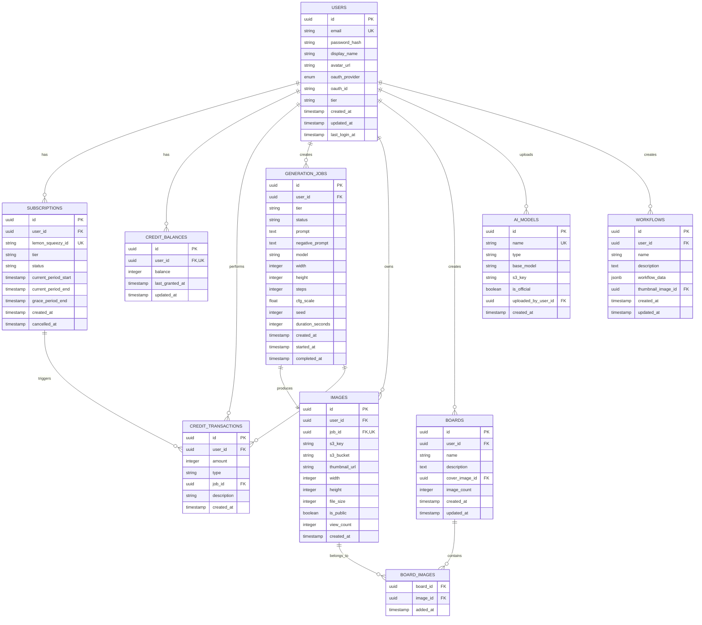

# 데이터베이스 스키마 설계 (PostgreSQL + Redis)

## 목차
1. [전체 스키마 개요](#전체-스키마-개요)
2. [PostgreSQL 스키마](#postgresql-스키마)
3. [Redis 데이터 구조](#redis-데이터-구조)
4. [마이그레이션 전략](#마이그레이션-전략)
5. [인덱싱 전략](#인덱싱-전략)
6. [보안 및 권한](#보안-및-권한)

---

## 전체 스키마 개요

### 스키마 분리 전략 (개발/운영)

```sql
-- 개발 스키마
CREATE SCHEMA dev_pingvas;

-- 운영 스키마
CREATE SCHEMA prod_pingvas;

-- 공통 스키마 (Extension 등)
CREATE SCHEMA extensions;
```

### 테이블 관계도 (Entity Relationship Diagram)



---

## PostgreSQL 스키마

### 1. users 테이블

```sql
CREATE TABLE prod_pingvas.users (
    id UUID PRIMARY KEY DEFAULT gen_random_uuid(),
    email VARCHAR(255) NOT NULL UNIQUE,
    password_hash VARCHAR(255),  -- NULL for OAuth users
    display_name VARCHAR(100),
    avatar_url VARCHAR(500),

    -- OAuth
    oauth_provider VARCHAR(20) DEFAULT 'email' CHECK (oauth_provider IN ('email', 'google', 'discord')),
    oauth_id VARCHAR(255),

    -- Subscription tier (denormalized for quick access)
    tier VARCHAR(20) DEFAULT 'free' CHECK (tier IN ('free', 'starter', 'pro', 'studio', 'enterprise')),

    -- Timestamps
    created_at TIMESTAMPTZ NOT NULL DEFAULT NOW(),
    updated_at TIMESTAMPTZ,
    last_login_at TIMESTAMPTZ,

    CONSTRAINT unique_oauth UNIQUE (oauth_provider, oauth_id)
);

CREATE INDEX idx_users_email ON prod_pingvas.users(email);
CREATE INDEX idx_users_oauth ON prod_pingvas.users(oauth_provider, oauth_id) WHERE oauth_provider != 'email';
CREATE INDEX idx_users_tier ON prod_pingvas.users(tier);

COMMENT ON TABLE prod_pingvas.users IS '사용자 계정 정보';
COMMENT ON COLUMN prod_pingvas.users.tier IS '현재 구독 등급 (denormalized)';
```

### 2. subscriptions 테이블

```sql
CREATE TABLE prod_pingvas.subscriptions (
    id UUID PRIMARY KEY DEFAULT gen_random_uuid(),
    user_id UUID NOT NULL REFERENCES prod_pingvas.users(id) ON DELETE CASCADE,
    lemon_squeezy_id VARCHAR(255) UNIQUE NOT NULL,

    -- Subscription details
    tier VARCHAR(20) NOT NULL CHECK (tier IN ('starter', 'pro', 'studio', 'enterprise')),
    status VARCHAR(20) NOT NULL CHECK (status IN ('active', 'past_due', 'cancelled', 'expired')),
    billing_cycle VARCHAR(10) CHECK (billing_cycle IN ('monthly', 'yearly')),

    -- Periods
    current_period_start TIMESTAMPTZ NOT NULL,
    current_period_end TIMESTAMPTZ NOT NULL,
    grace_period_end TIMESTAMPTZ,  -- 결제 실패 시 유예 기간

    -- Timestamps
    created_at TIMESTAMPTZ NOT NULL DEFAULT NOW(),
    updated_at TIMESTAMPTZ,
    cancelled_at TIMESTAMPTZ,

    CONSTRAINT one_active_subscription_per_user
        EXCLUDE USING gist (user_id WITH =)
        WHERE (status = 'active')
);

CREATE INDEX idx_subscriptions_user_id ON prod_pingvas.subscriptions(user_id);
CREATE INDEX idx_subscriptions_status ON prod_pingvas.subscriptions(status);
CREATE INDEX idx_subscriptions_lemon_squeezy_id ON prod_pingvas.subscriptions(lemon_squeezy_id);
CREATE INDEX idx_subscriptions_grace_period ON prod_pingvas.subscriptions(grace_period_end)
    WHERE status = 'past_due' AND grace_period_end IS NOT NULL;

COMMENT ON TABLE prod_pingvas.subscriptions IS 'Lemon Squeezy 구독 정보';
COMMENT ON CONSTRAINT one_active_subscription_per_user ON prod_pingvas.subscriptions IS '사용자당 하나의 활성 구독만 허용';
```

### 3. credit_balances 테이블

```sql
CREATE TABLE prod_pingvas.credit_balances (
    id UUID PRIMARY KEY DEFAULT gen_random_uuid(),
    user_id UUID NOT NULL UNIQUE REFERENCES prod_pingvas.users(id) ON DELETE CASCADE,
    balance INTEGER NOT NULL DEFAULT 0 CHECK (balance >= 0),

    -- Timestamps
    last_granted_at TIMESTAMPTZ,  -- 마지막 크레딧 지급 시간
    updated_at TIMESTAMPTZ DEFAULT NOW()
);

CREATE UNIQUE INDEX idx_credit_balances_user_id ON prod_pingvas.credit_balances(user_id);

COMMENT ON TABLE prod_pingvas.credit_balances IS '사용자별 크레딧 잔액';
COMMENT ON COLUMN prod_pingvas.credit_balances.balance IS '현재 크레딧 잔액 (1 credit = 1초 GPU 사용)';
```

### 4. credit_transactions 테이블

```sql
CREATE TABLE prod_pingvas.credit_transactions (
    id UUID PRIMARY KEY DEFAULT gen_random_uuid(),
    user_id UUID NOT NULL REFERENCES prod_pingvas.users(id) ON DELETE CASCADE,

    -- Transaction details
    amount INTEGER NOT NULL,  -- 양수: 충전, 음수: 차감
    type VARCHAR(50) NOT NULL CHECK (type IN (
        'subscription_grant',      -- 구독 갱신 시 지급
        'subscription_upgrade',    -- 구독 업그레이드 시 추가 지급
        'admin_adjustment',        -- 관리자 수동 조정
        'generation_usage',        -- 이미지 생성 사용
        'api_usage'                -- 외부 API 사용 (Nano-Banana)
    )),

    -- References
    job_id UUID REFERENCES prod_pingvas.generation_jobs(id) ON DELETE SET NULL,
    subscription_id UUID REFERENCES prod_pingvas.subscriptions(id) ON DELETE SET NULL,

    description TEXT,
    balance_after INTEGER NOT NULL,  -- 트랜잭션 후 잔액 (스냅샷)

    created_at TIMESTAMPTZ NOT NULL DEFAULT NOW()
);

CREATE INDEX idx_credit_transactions_user_id ON prod_pingvas.credit_transactions(user_id);
CREATE INDEX idx_credit_transactions_created_at ON prod_pingvas.credit_transactions(created_at DESC);
CREATE INDEX idx_credit_transactions_type ON prod_pingvas.credit_transactions(type);
CREATE INDEX idx_credit_transactions_job_id ON prod_pingvas.credit_transactions(job_id) WHERE job_id IS NOT NULL;

COMMENT ON TABLE prod_pingvas.credit_transactions IS '크레딧 거래 내역 (불변 로그)';
COMMENT ON COLUMN prod_pingvas.credit_transactions.balance_after IS '트랜잭션 후 잔액 스냅샷 (감사용)';
```

### 5. generation_jobs 테이블

```sql
CREATE TABLE prod_pingvas.generation_jobs (
    id UUID PRIMARY KEY DEFAULT gen_random_uuid(),
    user_id UUID NOT NULL REFERENCES prod_pingvas.users(id) ON DELETE CASCADE,

    -- Priority queue info
    tier VARCHAR(20) NOT NULL,  -- 생성 시점의 티어 (denormalized)
    priority INTEGER NOT NULL DEFAULT 0,  -- 자동 계산: enterprise=100, studio=75, pro=50, starter=25

    -- Job status
    status VARCHAR(20) NOT NULL DEFAULT 'pending' CHECK (status IN (
        'pending', 'queued', 'in_progress', 'completed', 'failed', 'cancelled'
    )),
    error_message TEXT,

    -- Generation parameters
    prompt TEXT NOT NULL,
    negative_prompt TEXT,
    model VARCHAR(100) NOT NULL,
    width INTEGER NOT NULL CHECK (width > 0 AND width <= 2048),
    height INTEGER NOT NULL CHECK (height > 0 AND height <= 2048),
    steps INTEGER NOT NULL DEFAULT 20 CHECK (steps > 0 AND steps <= 150),
    cfg_scale NUMERIC(4,2) DEFAULT 7.5 CHECK (cfg_scale >= 1 AND cfg_scale <= 20),
    seed BIGINT DEFAULT -1,  -- -1 = random
    sampler VARCHAR(50) DEFAULT 'euler_a',

    -- Advanced parameters (JSON for flexibility)
    advanced_params JSONB,  -- ControlNet, IP-Adapter, LoRA 등

    -- Resource usage
    duration_seconds INTEGER,  -- 실제 GPU 사용 시간
    credits_consumed INTEGER,  -- 소비된 크레딧

    -- Timestamps
    created_at TIMESTAMPTZ NOT NULL DEFAULT NOW(),
    queued_at TIMESTAMPTZ,
    started_at TIMESTAMPTZ,
    completed_at TIMESTAMPTZ
);

CREATE INDEX idx_generation_jobs_user_id ON prod_pingvas.generation_jobs(user_id);
CREATE INDEX idx_generation_jobs_status ON prod_pingvas.generation_jobs(status);
CREATE INDEX idx_generation_jobs_created_at ON prod_pingvas.generation_jobs(created_at DESC);
CREATE INDEX idx_generation_jobs_tier_priority ON prod_pingvas.generation_jobs(tier, priority DESC) WHERE status = 'pending';

COMMENT ON TABLE prod_pingvas.generation_jobs IS '이미지 생성 작업 (큐 및 이력)';
COMMENT ON COLUMN prod_pingvas.generation_jobs.priority IS '큐 우선순위 (높을수록 먼저 처리)';
COMMENT ON COLUMN prod_pingvas.generation_jobs.duration_seconds IS '실제 GPU 사용 시간 (초)';
```

### 6. images 테이블

```sql
CREATE TABLE prod_pingvas.images (
    id UUID PRIMARY KEY DEFAULT gen_random_uuid(),
    user_id UUID NOT NULL REFERENCES prod_pingvas.users(id) ON DELETE CASCADE,
    job_id UUID UNIQUE REFERENCES prod_pingvas.generation_jobs(id) ON DELETE SET NULL,

    -- S3 storage
    s3_bucket VARCHAR(100) NOT NULL,
    s3_key VARCHAR(500) NOT NULL,
    thumbnail_url VARCHAR(500),

    -- Image metadata
    width INTEGER NOT NULL,
    height INTEGER NOT NULL,
    file_size BIGINT NOT NULL,  -- bytes
    format VARCHAR(10) DEFAULT 'png' CHECK (format IN ('png', 'jpg', 'webp')),

    -- Sharing & visibility
    is_public BOOLEAN DEFAULT FALSE,
    share_token VARCHAR(64) UNIQUE,  -- 공유 링크용 토큰
    view_count INTEGER DEFAULT 0,

    -- Metadata from generation
    metadata JSONB,  -- prompt, model, parameters 등 (검색용)

    created_at TIMESTAMPTZ NOT NULL DEFAULT NOW()
);

CREATE INDEX idx_images_user_id ON prod_pingvas.images(user_id);
CREATE INDEX idx_images_job_id ON prod_pingvas.images(job_id) WHERE job_id IS NOT NULL;
CREATE INDEX idx_images_created_at ON prod_pingvas.images(created_at DESC);
CREATE INDEX idx_images_is_public ON prod_pingvas.images(is_public) WHERE is_public = TRUE;
CREATE INDEX idx_images_share_token ON prod_pingvas.images(share_token) WHERE share_token IS NOT NULL;
CREATE INDEX idx_images_metadata_gin ON prod_pingvas.images USING gin(metadata);  -- JSONB 검색

COMMENT ON TABLE prod_pingvas.images IS '생성된 이미지 메타데이터';
COMMENT ON COLUMN prod_pingvas.images.share_token IS '공개 공유 링크용 난수 토큰';
```

### 7. boards 테이블

```sql
CREATE TABLE prod_pingvas.boards (
    id UUID PRIMARY KEY DEFAULT gen_random_uuid(),
    user_id UUID NOT NULL REFERENCES prod_pingvas.users(id) ON DELETE CASCADE,

    name VARCHAR(100) NOT NULL,
    description TEXT,
    cover_image_id UUID REFERENCES prod_pingvas.images(id) ON DELETE SET NULL,

    -- Statistics (denormalized)
    image_count INTEGER DEFAULT 0,

    created_at TIMESTAMPTZ NOT NULL DEFAULT NOW(),
    updated_at TIMESTAMPTZ,

    CONSTRAINT unique_board_name_per_user UNIQUE (user_id, name)
);

CREATE INDEX idx_boards_user_id ON prod_pingvas.boards(user_id);
CREATE INDEX idx_boards_created_at ON prod_pingvas.boards(created_at DESC);

COMMENT ON TABLE prod_pingvas.boards IS '이미지 보드 (컬렉션)';
```

### 8. board_images 테이블 (Many-to-Many)

```sql
CREATE TABLE prod_pingvas.board_images (
    board_id UUID NOT NULL REFERENCES prod_pingvas.boards(id) ON DELETE CASCADE,
    image_id UUID NOT NULL REFERENCES prod_pingvas.images(id) ON DELETE CASCADE,

    added_at TIMESTAMPTZ NOT NULL DEFAULT NOW(),

    PRIMARY KEY (board_id, image_id)
);

CREATE INDEX idx_board_images_board_id ON prod_pingvas.board_images(board_id);
CREATE INDEX idx_board_images_image_id ON prod_pingvas.board_images(image_id);
CREATE INDEX idx_board_images_added_at ON prod_pingvas.board_images(added_at DESC);

COMMENT ON TABLE prod_pingvas.board_images IS '보드-이미지 다대다 관계';
```

### 9. ai_models 테이블

```sql
CREATE TABLE prod_pingvas.ai_models (
    id UUID PRIMARY KEY DEFAULT gen_random_uuid(),
    name VARCHAR(200) NOT NULL UNIQUE,

    -- Model classification
    type VARCHAR(50) NOT NULL CHECK (type IN (
        'main', 'lora', 'controlnet', 'vae', 'embedding', 'upscaler'
    )),
    base_model VARCHAR(50) CHECK (base_model IN ('sd15', 'sd21', 'sdxl', 'flux')),

    -- Storage
    s3_bucket VARCHAR(100),
    s3_key VARCHAR(500),
    file_size BIGINT,
    sha256_hash VARCHAR(64),

    -- Access control
    is_official BOOLEAN DEFAULT FALSE,  -- 공식 모델 여부
    min_tier VARCHAR(20) DEFAULT 'starter' CHECK (min_tier IN ('starter', 'pro', 'studio', 'enterprise')),
    uploaded_by_user_id UUID REFERENCES prod_pingvas.users(id) ON DELETE SET NULL,

    -- Metadata
    description TEXT,
    tags TEXT[],  -- Array of tags
    thumbnail_url VARCHAR(500),
    download_count INTEGER DEFAULT 0,

    is_active BOOLEAN DEFAULT TRUE,
    created_at TIMESTAMPTZ NOT NULL DEFAULT NOW(),
    updated_at TIMESTAMPTZ
);

CREATE INDEX idx_ai_models_type ON prod_pingvas.ai_models(type);
CREATE INDEX idx_ai_models_base_model ON prod_pingvas.ai_models(base_model);
CREATE INDEX idx_ai_models_is_official ON prod_pingvas.ai_models(is_official) WHERE is_official = TRUE;
CREATE INDEX idx_ai_models_uploaded_by ON prod_pingvas.ai_models(uploaded_by_user_id) WHERE uploaded_by_user_id IS NOT NULL;
CREATE INDEX idx_ai_models_tags_gin ON prod_pingvas.ai_models USING gin(tags);

COMMENT ON TABLE prod_pingvas.ai_models IS 'AI 모델 메타데이터 (Diffusion, LoRA 등)';
COMMENT ON COLUMN prod_pingvas.ai_models.min_tier IS '이 모델 사용에 필요한 최소 구독 등급';
```

### 10. workflows 테이블

```sql
CREATE TABLE prod_pingvas.workflows (
    id UUID PRIMARY KEY DEFAULT gen_random_uuid(),
    user_id UUID NOT NULL REFERENCES prod_pingvas.users(id) ON DELETE CASCADE,

    name VARCHAR(200) NOT NULL,
    description TEXT,
    workflow_data JSONB NOT NULL,  -- 전체 workflow 그래프

    -- Metadata
    thumbnail_image_id UUID REFERENCES prod_pingvas.images(id) ON DELETE SET NULL,
    tags TEXT[],
    is_public BOOLEAN DEFAULT FALSE,
    use_count INTEGER DEFAULT 0,

    created_at TIMESTAMPTZ NOT NULL DEFAULT NOW(),
    updated_at TIMESTAMPTZ,

    CONSTRAINT unique_workflow_name_per_user UNIQUE (user_id, name)
);

CREATE INDEX idx_workflows_user_id ON prod_pingvas.workflows(user_id);
CREATE INDEX idx_workflows_is_public ON prod_pingvas.workflows(is_public) WHERE is_public = TRUE;
CREATE INDEX idx_workflows_tags_gin ON prod_pingvas.workflows USING gin(tags);
CREATE INDEX idx_workflows_data_gin ON prod_pingvas.workflows USING gin(workflow_data);

COMMENT ON TABLE prod_pingvas.workflows IS '저장된 워크플로우';
```

---

## Redis 데이터 구조

### 1. Celery 작업 큐 (Priority-based)

```
# 큐 이름 규칙: queue:{tier}
queue:enterprise  (Priority 100)
queue:studio      (Priority 75)
queue:pro         (Priority 50)
queue:starter     (Priority 25)
queue:free        (Priority 10)

# 각 큐는 Redis List로 구현
LPUSH queue:studio '{"task_id": "abc123", "job_id": "uuid", "user_id": "uuid"}'
BRPOP queue:studio 0  # Worker가 blocking pop
```

### 2. 작업 결과 캐시

```
# 작업 진행 상태
job:{job_id}:status = "in_progress" | "completed" | "failed"
job:{job_id}:progress = {"step": 15, "total_steps": 20, "preview_url": "..."}

# TTL: 1시간
SETEX job:abc123:status 3600 "in_progress"
SETEX job:abc123:progress 3600 '{"step": 15, "total_steps": 20}'
```

### 3. 사용자 세션

```
# JWT 블랙리스트 (로그아웃 시)
session:blacklist:{token_jti}
# TTL: 토큰 만료 시간까지

# 사용자 온라인 상태
user:{user_id}:online = "true"
# TTL: 5분 (heartbeat 갱신)
```

### 4. 속도 제한 (Rate Limiting)

```
# 사용자별 API 요청 제한
ratelimit:user:{user_id}:generation = 10  # 10분당 요청 횟수
# TTL: 10분

# IP별 요청 제한 (DDoS 방지)
ratelimit:ip:{ip_address}:api = 100  # 1분당 요청 횟수
# TTL: 1분
```

### 5. 모델 캐시 상태 (EFS 동기화)

```
# 어떤 모델이 EFS에 캐시되어 있는지 추적
model:cache:flux-dev = "true"
model:cache:sdxl-base = "true"
# TTL: 7일 (사용되지 않으면 삭제)

# 모델 다운로드 잠금 (중복 다운로드 방지)
model:download:lock:flux-dev = "worker-pod-123"
# TTL: 10분
```

---

## 마이그레이션 전략

### Alembic 설정 (SQLAlchemy Migrations)

```python
# alembic/env.py
from alembic import context
from sqlalchemy import engine_from_config, pool
from app.database import Base
from app.models import *  # 모든 모델 import

target_metadata = Base.metadata

def run_migrations_online():
    connectable = engine_from_config(
        config.get_section(config.config_ini_section),
        prefix="sqlalchemy.",
        poolclass=pool.NullPool,
    )

    with connectable.connect() as connection:
        # 스키마 설정 (dev 또는 prod)
        schema = os.getenv("DB_SCHEMA", "prod_pingvas")

        context.configure(
            connection=connection,
            target_metadata=target_metadata,
            version_table_schema=schema,
            include_schemas=True,
            compare_type=True
        )

        with context.begin_transaction():
            context.run_migrations()
```

### 마이그레이션 생성

```bash
# 자동 마이그레이션 생성
alembic revision --autogenerate -m "Add credit_transactions table"

# 마이그레이션 적용
alembic upgrade head

# 롤백
alembic downgrade -1
```

### 제로 다운타임 마이그레이션 패턴

#### 1. 컬럼 추가 (Backward Compatible)
```sql
-- Migration 001: 새 컬럼 추가 (NULL 허용)
ALTER TABLE prod_pingvas.users ADD COLUMN phone_number VARCHAR(20);

-- Migration 002: 데이터 채우기
UPDATE prod_pingvas.users SET phone_number = ...;

-- Migration 003: NOT NULL 제약 추가
ALTER TABLE prod_pingvas.users ALTER COLUMN phone_number SET NOT NULL;
```

#### 2. 컬럼 이름 변경 (Expand-Contract Pattern)
```sql
-- Migration 001: 새 컬럼 추가 + 트리거로 동기화
ALTER TABLE prod_pingvas.users ADD COLUMN display_name_new VARCHAR(100);

CREATE FUNCTION sync_display_name() RETURNS TRIGGER AS $$
BEGIN
    NEW.display_name_new = NEW.display_name;
    RETURN NEW;
END;
$$ LANGUAGE plpgsql;

CREATE TRIGGER users_display_name_sync
BEFORE INSERT OR UPDATE ON prod_pingvas.users
FOR EACH ROW EXECUTE FUNCTION sync_display_name();

-- (애플리케이션 코드 배포: 두 컬럼 모두 읽기/쓰기)

-- Migration 002: 기존 컬럼 삭제
DROP TRIGGER users_display_name_sync ON prod_pingvas.users;
DROP FUNCTION sync_display_name();
ALTER TABLE prod_pingvas.users DROP COLUMN display_name;
ALTER TABLE prod_pingvas.users RENAME COLUMN display_name_new TO display_name;
```

---

## 인덱싱 전략

### 1. B-Tree 인덱스 (기본)
- Primary Key, Foreign Key
- 범위 검색 (>, <, BETWEEN)
- 정렬 (ORDER BY)

### 2. GIN 인덱스 (Generalized Inverted Index)
- JSONB 컬럼 검색
- Array 컬럼 검색 (tags)

```sql
CREATE INDEX idx_images_metadata_gin ON prod_pingvas.images USING gin(metadata);

-- 쿼리 예시
SELECT * FROM prod_pingvas.images WHERE metadata @> '{"model": "flux-dev"}';
```

### 3. Partial 인덱스
- 조건부 인덱스 (WHERE 절)
- 인덱스 크기 감소

```sql
CREATE INDEX idx_images_public ON prod_pingvas.images(is_public)
WHERE is_public = TRUE;
```

### 4. Composite 인덱스
- 다중 컬럼 검색

```sql
CREATE INDEX idx_generation_jobs_user_status
ON prod_pingvas.generation_jobs(user_id, status, created_at DESC);

-- 쿼리 예시
SELECT * FROM prod_pingvas.generation_jobs
WHERE user_id = 'uuid' AND status = 'completed'
ORDER BY created_at DESC;
```

### 인덱스 모니터링

```sql
-- 사용되지 않는 인덱스 찾기
SELECT schemaname, tablename, indexname, idx_scan
FROM pg_stat_user_indexes
WHERE schemaname = 'prod_pingvas' AND idx_scan = 0
ORDER BY pg_relation_size(indexrelid) DESC;

-- 테이블 크기 및 인덱스 크기
SELECT
    tablename,
    pg_size_pretty(pg_total_relation_size(schemaname||'.'||tablename)) AS total_size,
    pg_size_pretty(pg_relation_size(schemaname||'.'||tablename)) AS table_size,
    pg_size_pretty(pg_indexes_size(schemaname||'.'||tablename)) AS indexes_size
FROM pg_tables
WHERE schemaname = 'prod_pingvas'
ORDER BY pg_total_relation_size(schemaname||'.'||tablename) DESC;
```

---

## 보안 및 권한

### 1. Row-Level Security (RLS)

사용자는 자신의 데이터만 접근 가능:

```sql
-- RLS 활성화
ALTER TABLE prod_pingvas.images ENABLE ROW LEVEL SECURITY;

-- 정책: 사용자는 자신의 이미지만 조회
CREATE POLICY images_select_own ON prod_pingvas.images
FOR SELECT
USING (user_id = current_setting('app.current_user_id')::UUID);

-- 정책: 공개 이미지는 누구나 조회
CREATE POLICY images_select_public ON prod_pingvas.images
FOR SELECT
USING (is_public = TRUE);

-- 정책: 사용자는 자신의 이미지만 삭제
CREATE POLICY images_delete_own ON prod_pingvas.images
FOR DELETE
USING (user_id = current_setting('app.current_user_id')::UUID);
```

### 2. 애플리케이션 레벨 권한

```python
# services/common/database.py
from sqlalchemy import event
from sqlalchemy.engine import Engine

@event.listens_for(Engine, "connect")
def set_user_context(dbapi_conn, connection_record):
    """
    각 연결마다 current_user_id 설정 (RLS 적용)
    """
    cursor = dbapi_conn.cursor()
    user_id = g.get("user_id")  # Flask g 또는 FastAPI Request State
    if user_id:
        cursor.execute(f"SET app.current_user_id = '{user_id}'")
    cursor.close()
```

### 3. 데이터베이스 사용자 권한

```sql
-- 읽기 전용 사용자 (분석/모니터링용)
CREATE ROLE readonly_user LOGIN PASSWORD 'secure_password';
GRANT CONNECT ON DATABASE pingvas_db TO readonly_user;
GRANT USAGE ON SCHEMA prod_pingvas TO readonly_user;
GRANT SELECT ON ALL TABLES IN SCHEMA prod_pingvas TO readonly_user;

-- 애플리케이션 사용자 (서비스용)
CREATE ROLE app_user LOGIN PASSWORD 'secure_password';
GRANT CONNECT ON DATABASE pingvas_db TO app_user;
GRANT USAGE, CREATE ON SCHEMA prod_pingvas TO app_user;
GRANT SELECT, INSERT, UPDATE, DELETE ON ALL TABLES IN SCHEMA prod_pingvas TO app_user;
GRANT USAGE ON ALL SEQUENCES IN SCHEMA prod_pingvas TO app_user;
```

### 4. 암호화

#### At-Rest Encryption
- Aurora PostgreSQL: KMS 키로 자동 암호화
- S3: SSE-S3 또는 SSE-KMS

#### In-Transit Encryption
- PostgreSQL: SSL/TLS 강제

```python
# database.py
engine = create_engine(
    DATABASE_URL,
    connect_args={
        "sslmode": "require",
        "sslrootcert": "/path/to/ca-cert.pem"
    }
)
```

#### Application-Level Encryption (민감 데이터)
- Password hashing: Argon2

```python
from argon2 import PasswordHasher

ph = PasswordHasher()
hash = ph.hash("password123")
ph.verify(hash, "password123")  # True or raises exception
```

---

## 성능 최적화

### 1. Connection Pooling

```python
# SQLAlchemy
engine = create_engine(
    DATABASE_URL,
    pool_size=20,              # 기본 연결 수
    max_overflow=10,           # 추가 연결 수
    pool_pre_ping=True,        # 연결 유효성 검사
    pool_recycle=3600          # 1시간마다 재생성
)
```

### 2. Query Optimization

```sql
-- EXPLAIN ANALYZE로 쿼리 분석
EXPLAIN ANALYZE
SELECT * FROM prod_pingvas.generation_jobs
WHERE user_id = 'uuid' AND status = 'completed'
ORDER BY created_at DESC
LIMIT 50;

-- 실행 계획 확인
-- Seq Scan → Index Scan 전환 필요 시 인덱스 추가
```

### 3. Materialized Views (통계용)

```sql
-- 사용자별 통계 (일 1회 갱신)
CREATE MATERIALIZED VIEW prod_pingvas.user_stats AS
SELECT
    u.id AS user_id,
    u.tier,
    COUNT(DISTINCT g.id) AS total_generations,
    COUNT(DISTINCT i.id) AS total_images,
    COALESCE(SUM(g.credits_consumed), 0) AS total_credits_used
FROM prod_pingvas.users u
LEFT JOIN prod_pingvas.generation_jobs g ON u.id = g.user_id
LEFT JOIN prod_pingvas.images i ON u.id = i.user_id
GROUP BY u.id;

CREATE UNIQUE INDEX idx_user_stats_user_id ON prod_pingvas.user_stats(user_id);

-- 갱신 (Celery Beat 스케줄러)
REFRESH MATERIALIZED VIEW CONCURRENTLY prod_pingvas.user_stats;
```

---

## 다음 단계

이제 구독 등급별 차별화 처리로 넘어갑니다:
- [구독 등급별 차별화 (Tier-based QoS)](./04-tier-based-qos.md)
