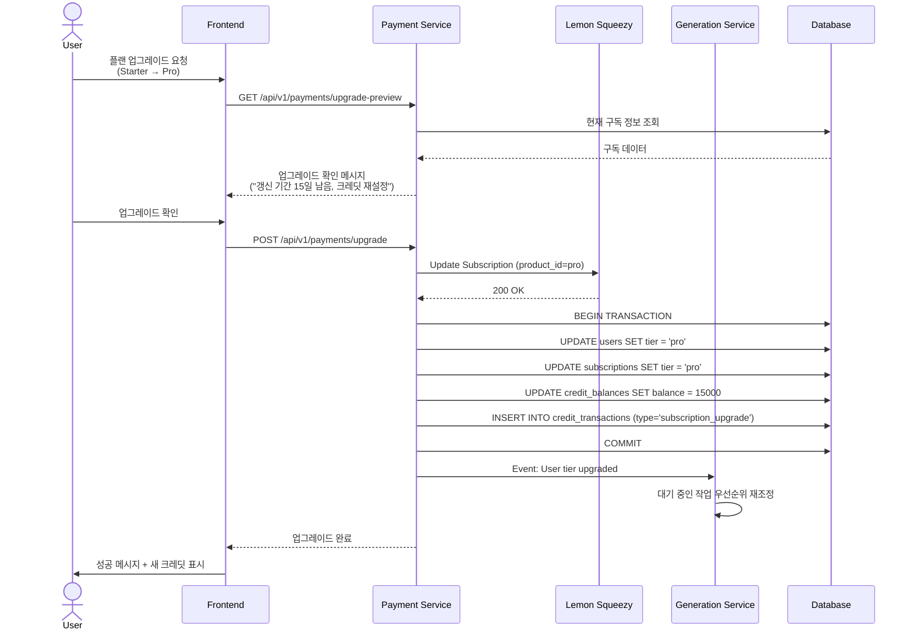

# 구독 등급별 차별화 처리 (Tier-based QoS)

## 목차
1. [구독 플랜 정의](#구독-플랜-정의)
2. [우선순위 큐 설계](#우선순위-큐-설계)
3. [기능 제한 (Feature Gating)](#기능-제한-feature-gating)
4. [리소스 할당 전략](#리소스-할당-전략)
5. [구현 예제](#구현-예제)

---

## 구독 플랜 정의

### 플랜 비교표

| 기능 | Free | Starter | Pro | Studio | Enterprise |
|------|------|---------|-----|--------|------------|
| **월 요금** | $0 | $25 | $75 | $150 | 맞춤형 |
| **월간 크레딧** | 500 | 5,000 | 15,000 | 30,000 | 협의 |
| **스토리지** | 1GB | 20GB | 100GB | 200GB | 협의 |
| **동시 생성 큐** | 1개 | 1개 | 1개 | 3개 | 무제한 |
| **큐 우선순위** | 10 | 25 | 50 | 75 | 100 |
| **사용 가능 모델** | SD 1.5 | SD 1.5, SDXL | SD 1.5, SDXL, FLUX | 전체 + LoRA 학습 | 전체 + 전용 인프라 |
| **외부 API (Nano-Banana)** | ❌ | ❌ | ✅ | ✅ | ✅ |
| **커스텀 LoRA 학습** | ❌ | ❌ | ❌ | ✅ | ✅ |
| **Private Board** | 무제한 | 무제한 | 무제한 | 무제한 | 무제한 |
| **Public Gallery 게시** | 5개/월 | 50개/월 | 무제한 | 무제한 | 무제한 |
| **API Access** | ❌ | ❌ | Rate-limited | Full | Dedicated |
| **지원** | 커뮤니티 | 이메일 | 우선 이메일 | 전담 Slack | SLA + 24/7 |

---

## 우선순위 큐 설계

### Redis + Celery Priority Queue

#### 큐 구조

```python
# config/queue_config.py
from enum import IntEnum

class QueuePriority(IntEnum):
    FREE = 10
    STARTER = 25
    PRO = 50
    STUDIO = 75
    ENTERPRISE = 100

TIER_QUEUE_MAPPING = {
    "free": ("queue:free", QueuePriority.FREE),
    "starter": ("queue:starter", QueuePriority.STARTER),
    "pro": ("queue:pro", QueuePriority.PRO),
    "studio": ("queue:studio", QueuePriority.STUDIO),
    "enterprise": ("queue:enterprise", QueuePriority.ENTERPRISE),
}

# Studio 플랜은 3개 병렬 큐
STUDIO_PARALLEL_QUEUES = 3
```

#### Celery Worker 설정

```python
# services/worker/celeryconfig.py
from kombu import Queue, Exchange

# 기본 Exchange
default_exchange = Exchange('generation', type='direct')

# 큐 정의 (우선순위 내림차순)
task_queues = [
    Queue('queue:enterprise', exchange=default_exchange, routing_key='queue:enterprise', priority=100),
    Queue('queue:studio', exchange=default_exchange, routing_key='queue:studio', priority=75),
    Queue('queue:pro', exchange=default_exchange, routing_key='queue:pro', priority=50),
    Queue('queue:starter', exchange=default_exchange, routing_key='queue:starter', priority=25),
    Queue('queue:free', exchange=default_exchange, routing_key='queue:free', priority=10),
]

# Worker가 우선순위 순서대로 큐를 확인
task_queue_max_priority = 100

# Worker 설정
worker_prefetch_multiplier = 1  # 한 번에 하나씩 가져옴 (공정성)
worker_concurrency = 1  # GPU당 1개 작업 (GPU 메모리 제약)
```

#### 작업 배정 알고리즘

```python
# services/generation/queue_manager.py
from celery import Celery

celery_app = Celery('generation', broker=settings.REDIS_URL)

async def enqueue_generation_job(job_id: str, user_tier: str):
    """
    사용자 티어에 따라 작업을 적절한 큐에 추가
    """
    queue_name, priority = TIER_QUEUE_MAPPING[user_tier]

    # Studio 플랜의 경우 3개 큐에 라운드로빈
    if user_tier == "studio":
        queue_index = get_least_loaded_studio_queue()  # 0, 1, 2
        queue_name = f"queue:studio:{queue_index}"

    # Celery 작업 전송
    celery_app.send_task(
        "tasks.generate_image",
        args=[str(job_id)],
        queue=queue_name,
        priority=priority
    )

    # DB 업데이트
    await db.execute(
        """
        UPDATE generation_jobs
        SET status = 'queued', queued_at = NOW(), priority = :priority
        WHERE id = :job_id
        """,
        {"job_id": job_id, "priority": priority}
    )

def get_least_loaded_studio_queue() -> int:
    """
    Studio 플랜의 3개 큐 중 가장 작업이 적은 큐 선택
    """
    queue_lengths = [
        redis_client.llen("queue:studio:0"),
        redis_client.llen("queue:studio:1"),
        redis_client.llen("queue:studio:2"),
    ]
    return queue_lengths.index(min(queue_lengths))
```

### Worker 큐 소비 패턴

```bash
# Worker 1: 모든 큐 처리 (우선순위 순)
celery -A services.worker.celery_app worker \
    --queues=queue:enterprise,queue:studio:0,queue:studio:1,queue:studio:2,queue:pro,queue:starter,queue:free \
    --concurrency=1 \
    --loglevel=info

# Worker 2: Enterprise 전용 (선택적)
celery -A services.worker.celery_app worker \
    --queues=queue:enterprise \
    --concurrency=1
```

---

## 기능 제한 (Feature Gating)

### 1. 모델 접근 제한

```python
# services/generation/middleware/model_access.py
from fastapi import HTTPException

TIER_MODEL_ACCESS = {
    "free": ["sd15"],
    "starter": ["sd15", "sdxl"],
    "pro": ["sd15", "sdxl", "flux"],
    "studio": ["sd15", "sdxl", "flux", "sd21", "cogview"],
    "enterprise": "*"  # 모든 모델
}

async def check_model_access(user_tier: str, model_name: str):
    """
    사용자 티어에 따라 모델 접근 권한 확인
    """
    allowed_models = TIER_MODEL_ACCESS.get(user_tier, [])

    if allowed_models == "*":
        return True

    # 모델의 base_model 확인
    model = await db_session.query(AIModel).filter(AIModel.name == model_name).first()

    if model.base_model not in allowed_models:
        raise HTTPException(
            status_code=403,
            detail=f"Model '{model_name}' requires {model.min_tier} plan or higher. Your plan: {user_tier}"
        )

    return True
```

### 2. 외부 API 접근 제한

```python
# services/generation/middleware/feature_access.py
TIER_FEATURES = {
    "external_api": ["pro", "studio", "enterprise"],
    "lora_training": ["studio", "enterprise"],
    "api_access": ["pro", "studio", "enterprise"],
    "priority_support": ["studio", "enterprise"],
    "custom_domains": ["enterprise"],
}

def require_feature(feature_name: str):
    """
    데코레이터: 특정 기능에 대한 접근 권한 확인
    """
    def decorator(func):
        async def wrapper(*args, current_user: dict = None, **kwargs):
            user_tier = current_user.get("tier")

            if user_tier not in TIER_FEATURES.get(feature_name, []):
                raise HTTPException(
                    status_code=403,
                    detail=f"Feature '{feature_name}' requires upgrade to {TIER_FEATURES[feature_name][0]} plan"
                )

            return await func(*args, current_user=current_user, **kwargs)
        return wrapper
    return decorator

# 사용 예시
@app.post("/api/v1/generation/nano-banana")
@require_feature("external_api")
async def generate_with_nano_banana(
    request: NanoBananaRequest,
    current_user: dict = Depends(verify_token)
):
    # Pro 이상만 접근 가능
    pass
```

### 3. 스토리지 할당량 확인

```python
# services/gallery/middleware/storage_quota.py
TIER_STORAGE_LIMITS = {
    "free": 1 * 1024 * 1024 * 1024,        # 1 GB
    "starter": 20 * 1024 * 1024 * 1024,    # 20 GB
    "pro": 100 * 1024 * 1024 * 1024,       # 100 GB
    "studio": 200 * 1024 * 1024 * 1024,    # 200 GB
    "enterprise": None  # 무제한
}

async def check_storage_quota(user_id: str, user_tier: str, file_size: int):
    """
    사용자의 스토리지 할당량 확인
    """
    limit = TIER_STORAGE_LIMITS[user_tier]

    if limit is None:  # Enterprise는 무제한
        return True

    # 현재 사용량 계산
    current_usage = await db_session.execute(
        """
        SELECT COALESCE(SUM(file_size), 0) AS total_size
        FROM images
        WHERE user_id = :user_id
        """,
        {"user_id": user_id}
    )
    total_size = current_usage.scalar()

    if total_size + file_size > limit:
        raise HTTPException(
            status_code=507,  # Insufficient Storage
            detail=f"Storage quota exceeded. Used: {total_size / 1024**3:.2f} GB, Limit: {limit / 1024**3:.2f} GB"
        )

    return True
```

---

## 리소스 할당 전략

### 1. GPU 워커 할당

#### Karpenter Node Selector (티어별 노드 격리)

```yaml
# Studio/Enterprise 전용 노드
apiVersion: karpenter.sh/v1alpha5
kind: Provisioner
metadata:
  name: gpu-premium
spec:
  requirements:
    - key: tier
      operator: In
      values: ["studio", "enterprise"]
    - key: karpenter.sh/capacity-type
      operator: In
      values: ["on-demand"]  # 프리미엄 플랜은 On-Demand
    - key: node.kubernetes.io/instance-type
      operator: In
      values: ["g5.xlarge", "g5.2xlarge"]  # 더 좋은 GPU
  taints:
    - key: tier
      value: premium
      effect: NoSchedule

---
# Starter/Pro 플랜용 노드
apiVersion: karpenter.sh/v1alpha5
kind: Provisioner
metadata:
  name: gpu-standard
spec:
  requirements:
    - key: tier
      operator: In
      values: ["starter", "pro"]
    - key: karpenter.sh/capacity-type
      operator: In
      values: ["spot"]  # Spot 인스턴스
    - key: node.kubernetes.io/instance-type
      operator: In
      values: ["g4dn.xlarge", "g4dn.2xlarge"]
```

#### Worker Pod 배치

```yaml
# services/worker/k8s/deployment-studio.yaml
apiVersion: apps/v1
kind: Deployment
metadata:
  name: ai-worker-studio
spec:
  replicas: 0  # Karpenter가 자동 스케일
  template:
    spec:
      nodeSelector:
        tier: premium
      tolerations:
        - key: tier
          operator: Equal
          value: premium
          effect: NoSchedule
      containers:
        - name: worker
          image: ghcr.io/pinksea-ai/ai-worker:latest
          env:
            - name: CELERY_QUEUES
              value: "queue:studio:0,queue:studio:1,queue:studio:2,queue:enterprise"
          resources:
            limits:
              nvidia.com/gpu: 1
              memory: 16Gi
            requests:
              nvidia.com/gpu: 1
              memory: 8Gi
```

### 2. 동시 처리 제한

```python
# services/generation/middleware/concurrency_limit.py
TIER_CONCURRENCY_LIMITS = {
    "free": 1,
    "starter": 1,
    "pro": 1,
    "studio": 3,  # 3개 병렬 큐
    "enterprise": None  # 무제한
}

async def check_concurrent_jobs(user_id: str, user_tier: str):
    """
    사용자의 동시 실행 작업 수 확인
    """
    limit = TIER_CONCURRENCY_LIMITS[user_tier]

    if limit is None:
        return True

    # 현재 실행 중인 작업 수
    active_jobs = await db_session.execute(
        """
        SELECT COUNT(*) FROM generation_jobs
        WHERE user_id = :user_id AND status IN ('pending', 'queued', 'in_progress')
        """,
        {"user_id": user_id}
    )
    count = active_jobs.scalar()

    if count >= limit:
        raise HTTPException(
            status_code=429,
            detail=f"Concurrent job limit reached ({limit}). Please wait for current jobs to complete or upgrade your plan."
        )

    return True
```

### 3. Rate Limiting (API 호출 제한)

```python
# common/middleware/rate_limit.py
from slowapi import Limiter
from slowapi.util import get_remote_address

limiter = Limiter(key_func=get_remote_address)

# 티어별 Rate Limit
TIER_RATE_LIMITS = {
    "free": "10/hour",
    "starter": "60/hour",
    "pro": "300/hour",
    "studio": "1000/hour",
    "enterprise": None  # 무제한
}

def get_rate_limit_for_user(user_tier: str) -> str:
    return TIER_RATE_LIMITS.get(user_tier, "10/hour")

# 사용 예시
@app.post("/api/v1/generation/create")
@limiter.limit(lambda: get_rate_limit_for_user(g.user_tier))
async def create_generation(request: GenerationRequest):
    pass
```

---

## 구현 예제

### 전체 생성 플로우 (티어 기반)

```python
# services/generation/api/generation.py
from fastapi import FastAPI, Depends, HTTPException
from sqlalchemy.orm import Session

app = FastAPI()

@app.post("/api/v1/generation/create", response_model=JobResponse)
async def create_generation_job(
    request: GenerationRequest,
    current_user: dict = Depends(verify_token),
    db: Session = Depends(get_db)
):
    """
    이미지 생성 작업 생성 (티어별 검증 포함)
    """
    user_id = current_user["sub"]
    user_tier = current_user["tier"]

    # 1. 동시 실행 제한 확인
    await check_concurrent_jobs(user_id, user_tier)

    # 2. 모델 접근 권한 확인
    await check_model_access(user_tier, request.model)

    # 3. 크레딧 잔액 확인
    credit_balance = await get_credit_balance(user_id)
    estimated_credits = estimate_credits(request)  # 예상 소비 크레딧

    if credit_balance < estimated_credits:
        raise HTTPException(
            status_code=402,
            detail=f"Insufficient credits. Required: {estimated_credits}, Available: {credit_balance}"
        )

    # 4. 외부 API 사용 시 권한 확인
    if request.use_external_api:
        if user_tier not in TIER_FEATURES["external_api"]:
            raise HTTPException(
                status_code=403,
                detail="External API access requires Pro plan or higher"
            )

    # 5. 작업 생성
    job = GenerationJob(
        id=uuid.uuid4(),
        user_id=user_id,
        tier=user_tier,
        status="pending",
        priority=QueuePriority[user_tier.upper()],
        **request.dict()
    )
    db.add(job)
    db.commit()

    # 6. 큐에 추가
    await enqueue_generation_job(str(job.id), user_tier)

    # 7. WebSocket 룸 생성
    await sio.emit("job_created", {"job_id": str(job.id)}, room=user_id)

    return job

def estimate_credits(request: GenerationRequest) -> int:
    """
    예상 크레딧 소비량 계산
    """
    # 기본 계산: (steps * 0.5초) * 1 credit/초
    base_credits = int(request.steps * 0.5)

    # 해상도에 따른 가중치
    resolution_factor = (request.width * request.height) / (512 * 512)
    adjusted_credits = int(base_credits * resolution_factor)

    # 최소 크레딧
    return max(adjusted_credits, 10)
```

### 큐 우선순위 시각화 (모니터링)

```python
# services/admin/queue_monitor.py
from fastapi import APIRouter

router = APIRouter()

@router.get("/admin/queue/stats")
async def get_queue_stats():
    """
    큐 통계 조회 (Admin 전용)
    """
    stats = {}

    for tier, (queue_name, priority) in TIER_QUEUE_MAPPING.items():
        if tier == "studio":
            # Studio는 3개 큐
            for i in range(3):
                q_name = f"{queue_name}:{i}"
                length = redis_client.llen(q_name)
                stats[q_name] = {
                    "tier": tier,
                    "priority": priority,
                    "queue_length": length,
                    "estimated_wait_time_minutes": length * 2  # 작업당 2분 가정
                }
        else:
            length = redis_client.llen(queue_name)
            stats[queue_name] = {
                "tier": tier,
                "priority": priority,
                "queue_length": length,
                "estimated_wait_time_minutes": length * 2
            }

    # 현재 실행 중인 작업 수
    active_jobs = await db_session.execute(
        "SELECT tier, COUNT(*) FROM generation_jobs WHERE status = 'in_progress' GROUP BY tier"
    )

    for row in active_jobs:
        tier, count = row
        queue_name = TIER_QUEUE_MAPPING[tier][0]
        if queue_name in stats:
            stats[queue_name]["active_jobs"] = count

    return stats
```

---

## 티어 업그레이드 플로우



---

## 다음 단계

이제 Lemon Squeezy 결제 연동으로 넘어갑니다:
- [Lemon Squeezy 결제 연동](./05-payment-integration.md)
