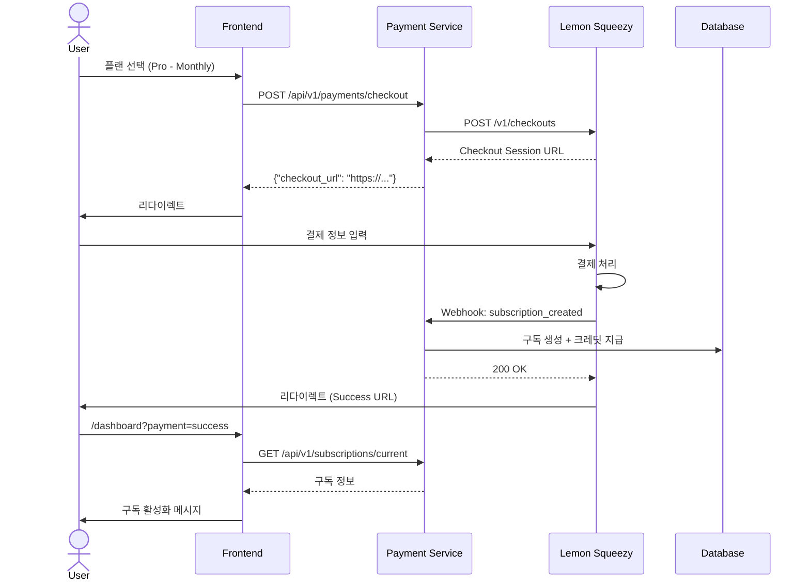

# Lemon Squeezy 결제 연동 및 Webhook 처리

## 목차
1. [Lemon Squeezy 개요](#lemon-squeezy-개요)
2. [상품 설정](#상품-설정)
3. [체크아웃 플로우](#체크아웃-플로우)
4. [Webhook 처리](#webhook-처리)
5. [구독 수명주기 관리](#구독-수명주기-관리)
6. [구현 예제](#구현-예제)

---

## Lemon Squeezy 개요

### 선택 이유
- **Merchant of Record**: 세금, VAT, 환불 자동 처리
- **글로벌 결제**: 135+ 국가 지원
- **간편한 API**: Stripe보다 단순한 통합
- **수수료**: 5% + $0.50 (Stripe와 유사)

### API 인증
```python
import os
import httpx

LEMON_SQUEEZY_API_KEY = os.getenv("LEMON_SQUEEZY_API_KEY")
LEMON_SQUEEZY_STORE_ID = os.getenv("LEMON_SQUEEZY_STORE_ID")

headers = {
    "Authorization": f"Bearer {LEMON_SQUEEZY_API_KEY}",
    "Accept": "application/vnd.api+json",
    "Content-Type": "application/vnd.api+json"
}
```

---

## 상품 설정

### Lemon Squeezy 대시보드에서 상품 생성

#### 1. Starter 플랜
- **Product Name**: Pingvas Studio - Starter Plan
- **Variants**:
  - `starter-monthly`: $25/month
  - `starter-yearly`: $250/year (17% 할인)
- **Trial Period**: 7일
- **Custom Data**: `{"tier": "starter", "credits": 5000, "storage_gb": 20}`

#### 2. Pro 플랜
- **Product Name**: Pingvas Studio - Pro Plan
- **Variants**:
  - `pro-monthly`: $75/month
  - `pro-yearly`: $750/year (17% 할인)
- **Trial Period**: 7일
- **Custom Data**: `{"tier": "pro", "credits": 15000, "storage_gb": 100}`

#### 3. Studio 플랜
- **Product Name**: Pingvas Studio - Studio Plan
- **Variants**:
  - `studio-monthly`: $150/month
  - `studio-yearly`: $1500/year (17% 할인)
- **Trial Period**: 7일
- **Custom Data**: `{"tier": "studio", "credits": 30000, "storage_gb": 200}`

### 환경 변수 설정
```bash
# .env
LEMON_SQUEEZY_API_KEY=your_api_key
LEMON_SQUEEZY_STORE_ID=your_store_id
LEMON_SQUEEZY_WEBHOOK_SECRET=your_webhook_secret

# Product Variant IDs (대시보드에서 확인)
PRODUCT_STARTER_MONTHLY_ID=123456
PRODUCT_STARTER_YEARLY_ID=123457
PRODUCT_PRO_MONTHLY_ID=123458
PRODUCT_PRO_YEARLY_ID=123459
PRODUCT_STUDIO_MONTHLY_ID=123460
PRODUCT_STUDIO_YEARLY_ID=123461
```

---

## 체크아웃 플로우



### API 구현

```python
# services/payment/api/checkout.py
from fastapi import APIRouter, Depends, HTTPException
from pydantic import BaseModel
import httpx

router = APIRouter()

class CheckoutRequest(BaseModel):
    variant_id: str  # starter-monthly, pro-yearly 등
    billing_cycle: str  # "monthly" or "yearly"

@router.post("/api/v1/payments/checkout")
async def create_checkout_session(
    request: CheckoutRequest,
    current_user: dict = Depends(verify_token),
    db: Session = Depends(get_db)
):
    """
    Lemon Squeezy 체크아웃 세션 생성
    """
    # 1. 이미 활성 구독이 있는지 확인
    existing_subscription = db.query(Subscription).filter(
        Subscription.user_id == current_user["sub"],
        Subscription.status == "active"
    ).first()

    if existing_subscription:
        raise HTTPException(
            status_code=400,
            detail="You already have an active subscription. Please cancel it first or use upgrade endpoint."
        )

    # 2. Variant ID 매핑
    product_variant_id = get_product_variant_id(request.variant_id)

    # 3. Lemon Squeezy Checkout 생성
    async with httpx.AsyncClient() as client:
        response = await client.post(
            "https://api.lemonsqueezy.com/v1/checkouts",
            headers=headers,
            json={
                "data": {
                    "type": "checkouts",
                    "attributes": {
                        "checkout_data": {
                            "email": current_user["email"],
                            "name": current_user.get("display_name", ""),
                            "custom": {
                                "user_id": current_user["sub"],
                                "tier": request.variant_id.split("-")[0]  # starter, pro, studio
                            }
                        },
                        "product_options": {
                            "enabled_variants": [product_variant_id],
                            "redirect_url": f"https://pingvas.studio/dashboard?payment=success",
                        },
                        "checkout_options": {
                            "button_color": "#FF6B6B"
                        }
                    },
                    "relationships": {
                        "store": {
                            "data": {
                                "type": "stores",
                                "id": settings.LEMON_SQUEEZY_STORE_ID
                            }
                        },
                        "variant": {
                            "data": {
                                "type": "variants",
                                "id": product_variant_id
                            }
                        }
                    }
                }
            }
        )

    if response.status_code != 201:
        raise HTTPException(status_code=500, detail="Failed to create checkout session")

    checkout_data = response.json()
    checkout_url = checkout_data["data"]["attributes"]["url"]

    return {"checkout_url": checkout_url}

def get_product_variant_id(variant_name: str) -> str:
    """
    Variant 이름을 Lemon Squeezy Product Variant ID로 매핑
    """
    mapping = {
        "starter-monthly": settings.PRODUCT_STARTER_MONTHLY_ID,
        "starter-yearly": settings.PRODUCT_STARTER_YEARLY_ID,
        "pro-monthly": settings.PRODUCT_PRO_MONTHLY_ID,
        "pro-yearly": settings.PRODUCT_PRO_YEARLY_ID,
        "studio-monthly": settings.PRODUCT_STUDIO_MONTHLY_ID,
        "studio-yearly": settings.PRODUCT_STUDIO_YEARLY_ID,
    }
    return mapping.get(variant_name)
```

---

## Webhook 처리

### Webhook 서명 검증

```python
# services/payment/webhooks/verify.py
import hmac
import hashlib

def verify_webhook_signature(raw_body: bytes, signature: str) -> bool:
    """
    Lemon Squeezy Webhook 서명 검증
    """
    expected_signature = hmac.new(
        settings.LEMON_SQUEEZY_WEBHOOK_SECRET.encode(),
        raw_body,
        hashlib.sha256
    ).hexdigest()

    return hmac.compare_digest(expected_signature, signature)
```

### Webhook 엔드포인트

```python
# services/payment/api/webhooks.py
from fastapi import APIRouter, Request, BackgroundTasks, HTTPException
import logging

router = APIRouter()
logger = logging.getLogger(__name__)

@router.post("/api/v1/payments/webhook")
async def lemon_squeezy_webhook(
    request: Request,
    background_tasks: BackgroundTasks,
    db: Session = Depends(get_db)
):
    """
    Lemon Squeezy Webhook 수신
    """
    # 1. 서명 검증
    signature = request.headers.get("X-Signature")
    raw_body = await request.body()

    if not verify_webhook_signature(raw_body, signature):
        logger.error("Invalid webhook signature")
        raise HTTPException(status_code=401, detail="Invalid signature")

    # 2. Payload 파싱
    payload = await request.json()
    event_name = payload["meta"]["event_name"]

    logger.info(f"Received webhook: {event_name}")

    # 3. 이벤트 타입에 따라 핸들러 호출 (백그라운드)
    handlers = {
        "subscription_created": handle_subscription_created,
        "subscription_updated": handle_subscription_updated,
        "subscription_payment_success": handle_payment_success,
        "subscription_payment_failed": handle_payment_failed,
        "subscription_cancelled": handle_subscription_cancelled,
        "subscription_expired": handle_subscription_expired,
        "subscription_paused": handle_subscription_paused,
        "subscription_unpaused": handle_subscription_unpaused,
    }

    handler = handlers.get(event_name)
    if handler:
        background_tasks.add_task(handler, payload, db)
    else:
        logger.warning(f"Unhandled event: {event_name}")

    return {"status": "ok"}
```

### 이벤트 핸들러

```python
# services/payment/webhooks/handlers.py
import logging
from datetime import datetime
from sqlalchemy.orm import Session

logger = logging.getLogger(__name__)

async def handle_subscription_created(payload: dict, db: Session):
    """
    구독 생성 (첫 결제 성공 시)
    """
    data = payload["data"]["attributes"]
    custom_data = data["custom_data"]
    user_id = custom_data["user_id"]
    tier = custom_data["tier"]

    # 1. 구독 레코드 생성
    subscription = Subscription(
        id=uuid.uuid4(),
        user_id=user_id,
        lemon_squeezy_id=str(payload["data"]["id"]),
        tier=tier,
        status="active",
        billing_cycle="monthly" if "monthly" in data["variant_name"] else "yearly",
        current_period_start=datetime.fromisoformat(data["created_at"]),
        current_period_end=datetime.fromisoformat(data["renews_at"]),
        created_at=datetime.utcnow()
    )
    db.add(subscription)

    # 2. 사용자 tier 업데이트
    user = db.query(User).filter(User.id == user_id).first()
    user.tier = tier
    user.updated_at = datetime.utcnow()

    # 3. 초기 크레딧 지급
    credits = get_credits_for_tier(tier)
    credit_balance = CreditBalance(
        user_id=user_id,
        balance=credits,
        last_granted_at=datetime.utcnow()
    )
    db.add(credit_balance)

    # 4. 크레딧 트랜잭션 기록
    transaction = CreditTransaction(
        user_id=user_id,
        amount=credits,
        type="subscription_grant",
        subscription_id=subscription.id,
        description=f"{tier.capitalize()} plan subscription activated",
        balance_after=credits,
        created_at=datetime.utcnow()
    )
    db.add(transaction)

    db.commit()

    # 5. 환영 이메일 발송
    await send_email(
        to=user.email,
        subject="Welcome to Pingvas Studio!",
        template="subscription_welcome.html",
        context={"tier": tier, "credits": credits}
    )

    logger.info(f"Subscription created for user {user_id}, tier: {tier}")

async def handle_payment_success(payload: dict, db: Session):
    """
    구독 갱신 결제 성공
    """
    lemon_squeezy_id = str(payload["data"]["attributes"]["subscription_id"])

    subscription = db.query(Subscription).filter(
        Subscription.lemon_squeezy_id == lemon_squeezy_id
    ).first()

    if not subscription:
        logger.error(f"Subscription not found: {lemon_squeezy_id}")
        return

    # 1. 구독 기간 업데이트
    data = payload["data"]["attributes"]
    subscription.current_period_start = datetime.fromisoformat(data["created_at"])
    subscription.current_period_end = datetime.fromisoformat(data["renews_at"])
    subscription.status = "active"
    subscription.grace_period_end = None
    subscription.updated_at = datetime.utcnow()

    # 2. 크레딧 갱신 (기존 크레딧 리셋)
    credit_balance = db.query(CreditBalance).filter(
        CreditBalance.user_id == subscription.user_id
    ).first()

    new_credits = get_credits_for_tier(subscription.tier)
    old_balance = credit_balance.balance

    credit_balance.balance = new_credits
    credit_balance.last_granted_at = datetime.utcnow()
    credit_balance.updated_at = datetime.utcnow()

    # 3. 크레딧 트랜잭션 기록
    transaction = CreditTransaction(
        user_id=subscription.user_id,
        amount=new_credits - old_balance,  # 차액
        type="subscription_grant",
        subscription_id=subscription.id,
        description=f"Monthly credit renewal ({subscription.tier})",
        balance_after=new_credits,
        created_at=datetime.utcnow()
    )
    db.add(transaction)

    db.commit()

    # 4. 갱신 확인 이메일
    user = db.query(User).filter(User.id == subscription.user_id).first()
    await send_email(
        to=user.email,
        subject="Subscription Renewed - Pingvas Studio",
        template="subscription_renewed.html",
        context={"credits": new_credits, "tier": subscription.tier}
    )

    logger.info(f"Payment success for subscription {lemon_squeezy_id}")

async def handle_payment_failed(payload: dict, db: Session):
    """
    구독 갱신 결제 실패
    """
    lemon_squeezy_id = str(payload["data"]["attributes"]["subscription_id"])

    subscription = db.query(Subscription).filter(
        Subscription.lemon_squeezy_id == lemon_squeezy_id
    ).first()

    if not subscription:
        return

    # 1. 상태를 past_due로 변경
    subscription.status = "past_due"
    # 3일 유예 기간
    subscription.grace_period_end = datetime.utcnow() + timedelta(days=3)
    subscription.updated_at = datetime.utcnow()

    db.commit()

    # 2. 결제 실패 알림 이메일
    user = db.query(User).filter(User.id == subscription.user_id).first()
    await send_email(
        to=user.email,
        subject="Payment Failed - Action Required",
        template="payment_failed.html",
        context={
            "grace_period_days": 3,
            "update_payment_url": "https://pingvas.studio/settings/billing"
        }
    )

    logger.warning(f"Payment failed for subscription {lemon_squeezy_id}")

async def handle_subscription_cancelled(payload: dict, db: Session):
    """
    구독 취소 (사용자 또는 시스템)
    """
    lemon_squeezy_id = str(payload["data"]["id"])

    subscription = db.query(Subscription).filter(
        Subscription.lemon_squeezy_id == lemon_squeezy_id
    ).first()

    if not subscription:
        return

    data = payload["data"]["attributes"]

    # 1. 구독 상태 업데이트
    subscription.status = "cancelled"
    subscription.cancelled_at = datetime.utcnow()
    # 기간 종료일까지는 사용 가능
    subscription.grace_period_end = datetime.fromisoformat(data["ends_at"])
    subscription.updated_at = datetime.utcnow()

    db.commit()

    # 2. 취소 확인 이메일
    user = db.query(User).filter(User.id == subscription.user_id).first()
    await send_email(
        to=user.email,
        subject="Subscription Cancelled",
        template="subscription_cancelled.html",
        context={
            "ends_at": subscription.grace_period_end.strftime("%Y-%m-%d"),
            "reactivate_url": "https://pingvas.studio/settings/billing"
        }
    )

    logger.info(f"Subscription cancelled: {lemon_squeezy_id}")

def get_credits_for_tier(tier: str) -> int:
    """
    티어별 월간 크레딧 반환
    """
    credits_mapping = {
        "starter": 5000,
        "pro": 15000,
        "studio": 30000,
    }
    return credits_mapping.get(tier, 0)
```

---

## 구독 수명주기 관리

### Celery Beat 스케줄러 (만료 처리)

```python
# services/payment/tasks/subscription_tasks.py
from celery import Celery
from celery.schedules import crontab

celery_app = Celery('payment', broker=settings.REDIS_URL)

@celery_app.on_after_finalize.connect
def setup_periodic_tasks(sender, **kwargs):
    # 매일 00:00에 만료 구독 처리
    sender.add_periodic_task(
        crontab(hour=0, minute=0),
        expire_subscriptions.s(),
        name='expire_subscriptions_daily'
    )

@celery_app.task
def expire_subscriptions():
    """
    grace_period_end가 지난 구독 만료 처리
    """
    from datetime import datetime
    from sqlalchemy import create_engine
    from sqlalchemy.orm import sessionmaker

    engine = create_engine(settings.DATABASE_URL)
    Session = sessionmaker(bind=engine)
    db = Session()

    # 1. 만료된 구독 찾기
    expired_subscriptions = db.query(Subscription).filter(
        Subscription.status.in_(["past_due", "cancelled"]),
        Subscription.grace_period_end <= datetime.utcnow()
    ).all()

    for subscription in expired_subscriptions:
        # 2. 상태를 expired로 변경
        subscription.status = "expired"
        subscription.updated_at = datetime.utcnow()

        # 3. 사용자 tier를 free로 강등
        user = db.query(User).filter(User.id == subscription.user_id).first()
        user.tier = "free"
        user.updated_at = datetime.utcnow()

        # 4. 잔여 크레딧 회수
        credit_balance = db.query(CreditBalance).filter(
            CreditBalance.user_id == subscription.user_id
        ).first()

        if credit_balance and credit_balance.balance > 0:
            old_balance = credit_balance.balance
            credit_balance.balance = 500  # Free tier 크레딧
            credit_balance.updated_at = datetime.utcnow()

            # 트랜잭션 기록
            transaction = CreditTransaction(
                user_id=subscription.user_id,
                amount=-(old_balance - 500),
                type="admin_adjustment",
                description="Subscription expired, credits reclaimed",
                balance_after=500,
                created_at=datetime.utcnow()
            )
            db.add(transaction)

        # 5. 만료 알림 이메일
        send_email_sync(
            to=user.email,
            subject="Subscription Expired",
            template="subscription_expired.html"
        )

    db.commit()
    db.close()

    logger.info(f"Expired {len(expired_subscriptions)} subscriptions")
    return len(expired_subscriptions)
```

---

## 구현 예제

### 전체 결제 플로우

```python
# services/payment/main.py
from fastapi import FastAPI
from fastapi.middleware.cors import CORSMiddleware

app = FastAPI(title="Payment Service")

# CORS
app.add_middleware(
    CORSMiddleware,
    allow_origins=["https://pingvas.studio"],
    allow_credentials=True,
    allow_methods=["*"],
    allow_headers=["*"],
)

# 라우터 등록
from .api import checkout, webhooks, subscriptions

app.include_router(checkout.router)
app.include_router(webhooks.router)
app.include_router(subscriptions.router)

@app.get("/health")
async def health_check():
    return {"status": "healthy"}
```

### 구독 조회 API

```python
# services/payment/api/subscriptions.py
@router.get("/api/v1/subscriptions/current", response_model=SubscriptionResponse)
async def get_current_subscription(
    current_user: dict = Depends(verify_token),
    db: Session = Depends(get_db)
):
    """
    현재 사용자의 활성 구독 조회
    """
    subscription = db.query(Subscription).filter(
        Subscription.user_id == current_user["sub"],
        Subscription.status.in_(["active", "past_due", "cancelled"])
    ).first()

    if not subscription:
        raise HTTPException(status_code=404, detail="No active subscription found")

    # 크레딧 잔액 포함
    credit_balance = db.query(CreditBalance).filter(
        CreditBalance.user_id == current_user["sub"]
    ).first()

    return {
        "id": subscription.id,
        "tier": subscription.tier,
        "status": subscription.status,
        "billing_cycle": subscription.billing_cycle,
        "current_period_end": subscription.current_period_end,
        "credits_remaining": credit_balance.balance if credit_balance else 0,
        "cancelled_at": subscription.cancelled_at
    }
```

---

## 다음 단계

이제 크레딧 차감 엔진으로 넘어갑니다:
- [크레딧 차감 엔진 (Metering Engine)](./06-credit-metering.md)
