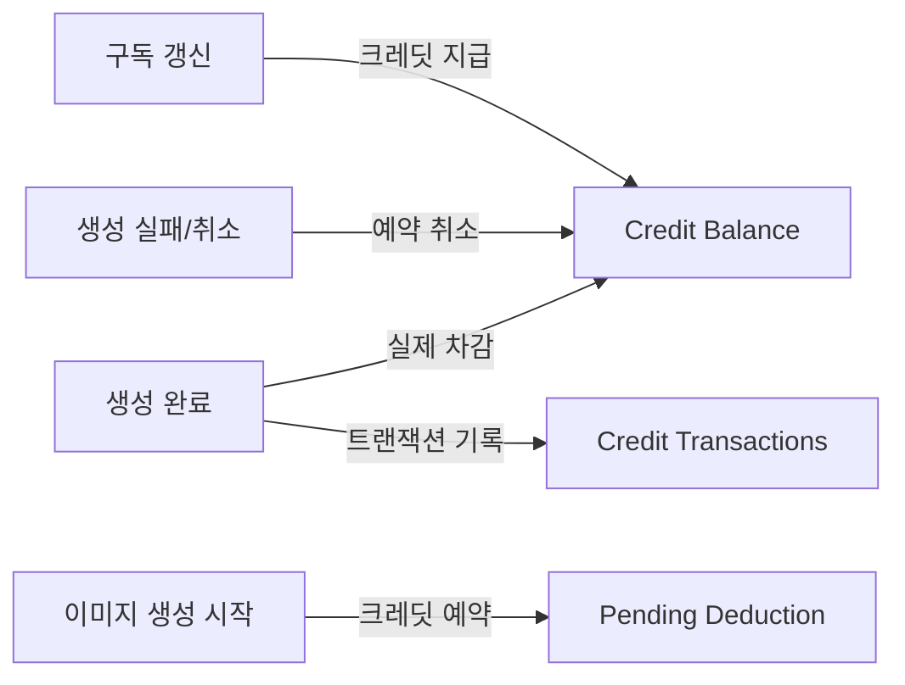

# 크레딧 차감 엔진 (Metering Engine)

## 목차
1. [크레딧 시스템 개요](#크레딧-시스템-개요)
2. [차감 로직](#차감-로직)
3. [원자적 트랜잭션](#원자적-트랜잭션)
4. [사용량 추적](#사용량-추적)
5. [구현 예제](#구현-예제)

---

## 크레딧 시스템 개요

### 크레딧 정책
- **1 Credit = 1초 GPU 사용**
- **Internal GPU**: 실제 소요 시간 기준 차감
- **External API (Nano-Banana)**: 고정 20 Credit/요청

### 크레딧 흐름



---

## 차감 로직

### 1. Internal GPU 차감 (초 단위)

```python
# services/worker/tasks/credit_manager.py
from datetime import datetime

async def deduct_credits_for_generation(job_id: str, db: Session):
    """
    이미지 생성 완료 후 크레딧 차감
    """
    # 1. 작업 정보 조회
    job = db.query(GenerationJob).filter(GenerationJob.id == job_id).first()

    if not job:
        raise ValueError(f"Job {job_id} not found")

    # 2. 소요 시간 계산 (초 단위)
    duration_seconds = int((job.completed_at - job.started_at).total_seconds())

    # 최소 1초 보장
    credits_to_deduct = max(duration_seconds, 1)

    # 3. 크레딧 차감 (원자적 트랜잭션)
    result = await deduct_credits_atomic(
        user_id=job.user_id,
        amount=credits_to_deduct,
        transaction_type="generation_usage",
        job_id=job.id,
        description=f"Image generation: {job.prompt[:50]}..."
    )

    if not result["success"]:
        # 크레딧 부족 (실패 처리)
        job.status = "failed"
        job.error_message = "Insufficient credits"
        db.commit()
        return False

    # 4. 작업 메타데이터 업데이트
    job.duration_seconds = duration_seconds
    job.credits_consumed = credits_to_deduct
    db.commit()

    return True
```

### 2. External API 차감 (고정 20 Credit)

```python
# services/generation/api/external_api.py
@router.post("/api/v1/generation/nano-banana")
@require_feature("external_api")  # Pro 이상만 사용 가능
async def generate_with_nano_banana(
    request: NanoBananaRequest,
    current_user: dict = Depends(verify_token),
    db: Session = Depends(get_db)
):
    """
    Nano-Banana API를 통한 이미지 생성
    """
    EXTERNAL_API_CREDITS = 20

    # 1. 사전 크레딧 차감 (API 호출 전)
    result = await deduct_credits_atomic(
        user_id=current_user["sub"],
        amount=EXTERNAL_API_CREDITS,
        transaction_type="api_usage",
        description=f"Nano-Banana API: {request.prompt[:50]}..."
    )

    if not result["success"]:
        raise HTTPException(
            status_code=402,
            detail=f"Insufficient credits. Required: {EXTERNAL_API_CREDITS}, Available: {result['balance']}"
        )

    # 2. 외부 API 호출
    try:
        response = await nano_banana_client.generate(request.dict())

        # 3. 결과 저장
        image = Image(
            user_id=current_user["sub"],
            s3_key=response["image_url"],
            metadata={"source": "nano-banana", "prompt": request.prompt}
        )
        db.add(image)
        db.commit()

        return {"image_id": image.id, "image_url": response["image_url"]}

    except Exception as e:
        # 4. API 호출 실패 시 크레딧 환불
        await refund_credits(
            user_id=current_user["sub"],
            amount=EXTERNAL_API_CREDITS,
            description="Nano-Banana API call failed, refund issued"
        )
        raise HTTPException(status_code=500, detail=str(e))
```

---

## 원자적 트랜잭션

### PostgreSQL Atomic Decrement

```python
# services/payment/utils/credit_atomic.py
from sqlalchemy import text
from typing import Dict

async def deduct_credits_atomic(
    user_id: str,
    amount: int,
    transaction_type: str,
    job_id: str = None,
    description: str = None
) -> Dict:
    """
    원자적 크레딧 차감 (Race Condition 방지)
    """
    async with db.begin():  # 트랜잭션 시작
        # 1. SELECT FOR UPDATE (행 잠금)
        result = await db.execute(
            text("""
                SELECT balance FROM credit_balances
                WHERE user_id = :user_id
                FOR UPDATE
            """),
            {"user_id": user_id}
        )
        row = result.fetchone()

        if not row:
            # 크레딧 잔액 레코드 없음 (첫 사용자)
            return {"success": False, "balance": 0, "error": "No credit balance found"}

        current_balance = row[0]

        # 2. 잔액 확인
        if current_balance < amount:
            return {
                "success": False,
                "balance": current_balance,
                "error": f"Insufficient credits. Required: {amount}, Available: {current_balance}"
            }

        # 3. 차감 실행 (Atomic UPDATE)
        new_balance = current_balance - amount

        await db.execute(
            text("""
                UPDATE credit_balances
                SET balance = :new_balance, updated_at = NOW()
                WHERE user_id = :user_id
            """),
            {"user_id": user_id, "new_balance": new_balance}
        )

        # 4. 트랜잭션 기록 삽입
        await db.execute(
            text("""
                INSERT INTO credit_transactions
                (id, user_id, amount, type, job_id, description, balance_after, created_at)
                VALUES (gen_random_uuid(), :user_id, :amount, :type, :job_id, :description, :balance_after, NOW())
            """),
            {
                "user_id": user_id,
                "amount": -amount,  # 음수로 저장
                "type": transaction_type,
                "job_id": job_id,
                "description": description,
                "balance_after": new_balance
            }
        )

    # 트랜잭션 커밋 (with 블록 종료 시 자동)
    return {"success": True, "balance": new_balance}

async def refund_credits(
    user_id: str,
    amount: int,
    description: str
) -> Dict:
    """
    크레딧 환불 (실패한 작업 등)
    """
    async with db.begin():
        # 1. 잔액 증가
        result = await db.execute(
            text("""
                UPDATE credit_balances
                SET balance = balance + :amount, updated_at = NOW()
                WHERE user_id = :user_id
                RETURNING balance
            """),
            {"user_id": user_id, "amount": amount}
        )

        new_balance = result.fetchone()[0]

        # 2. 트랜잭션 기록
        await db.execute(
            text("""
                INSERT INTO credit_transactions
                (id, user_id, amount, type, description, balance_after, created_at)
                VALUES (gen_random_uuid(), :user_id, :amount, 'admin_adjustment', :description, :balance_after, NOW())
            """),
            {
                "user_id": user_id,
                "amount": amount,  # 양수
                "description": description,
                "balance_after": new_balance
            }
        )

    return {"success": True, "balance": new_balance}
```

---

## 사용량 추적

### 1. 사용자별 크레딧 사용 통계

```python
# services/payment/api/usage.py
from fastapi import APIRouter
from sqlalchemy import func

router = APIRouter()

@router.get("/api/v1/credits/usage")
async def get_credit_usage(
    current_user: dict = Depends(verify_token),
    db: Session = Depends(get_db),
    period: str = "month"  # "day", "week", "month"
):
    """
    크레딧 사용 통계 조회
    """
    user_id = current_user["sub"]

    # 기간 설정
    if period == "day":
        start_date = datetime.utcnow() - timedelta(days=1)
    elif period == "week":
        start_date = datetime.utcnow() - timedelta(weeks=1)
    else:  # month
        start_date = datetime.utcnow() - timedelta(days=30)

    # 1. 사용 내역 조회
    usage = db.query(
        CreditTransaction.type,
        func.sum(CreditTransaction.amount).label("total_amount"),
        func.count(CreditTransaction.id).label("count")
    ).filter(
        CreditTransaction.user_id == user_id,
        CreditTransaction.created_at >= start_date,
        CreditTransaction.amount < 0  # 차감만 (충전 제외)
    ).group_by(CreditTransaction.type).all()

    # 2. 현재 잔액
    balance = db.query(CreditBalance).filter(
        CreditBalance.user_id == user_id
    ).first()

    return {
        "current_balance": balance.balance if balance else 0,
        "period": period,
        "usage_by_type": [
            {
                "type": row.type,
                "credits_used": abs(row.total_amount),
                "transaction_count": row.count
            }
            for row in usage
        ],
        "total_credits_used": abs(sum(row.total_amount for row in usage))
    }

@router.get("/api/v1/credits/history")
async def get_credit_history(
    current_user: dict = Depends(verify_token),
    db: Session = Depends(get_db),
    page: int = 1,
    per_page: int = 50
):
    """
    크레딧 거래 내역 (페이지네이션)
    """
    user_id = current_user["sub"]

    query = db.query(CreditTransaction).filter(
        CreditTransaction.user_id == user_id
    ).order_by(CreditTransaction.created_at.desc())

    total = query.count()
    transactions = query.offset((page - 1) * per_page).limit(per_page).all()

    return {
        "items": [
            {
                "id": t.id,
                "amount": t.amount,
                "type": t.type,
                "description": t.description,
                "balance_after": t.balance_after,
                "created_at": t.created_at
            }
            for t in transactions
        ],
        "total": total,
        "page": page,
        "per_page": per_page
    }
```

### 2. 예상 크레딧 계산기

```python
# services/generation/utils/credit_estimator.py
def estimate_generation_credits(request: GenerationRequest) -> int:
    """
    이미지 생성 요청에 대한 예상 크레딧 계산
    """
    # 기본 계산: steps * 평균 시간 (0.5초/step)
    base_time = request.steps * 0.5

    # 해상도 가중치
    resolution_factor = (request.width * request.height) / (512 * 512)

    # 모델 가중치
    model_factors = {
        "sd15": 1.0,
        "sdxl": 1.5,
        "flux": 2.0
    }
    model_factor = model_factors.get(request.model, 1.0)

    # ControlNet/IP-Adapter 추가 시간
    addon_factor = 1.0
    if request.controlnet_models:
        addon_factor += 0.3 * len(request.controlnet_models)
    if request.ip_adapter:
        addon_factor += 0.2

    # 최종 예상 크레딧
    estimated_seconds = int(base_time * resolution_factor * model_factor * addon_factor)

    # 최소 10 크레딧
    return max(estimated_seconds, 10)
```

---

## 워커 통합

### 이미지 생성 워커에서 크레딧 차감

```python
# services/worker/tasks/generate_image.py
from celery import Task

class GenerateImageTask(Task):
    def on_failure(self, exc, task_id, args, kwargs, einfo):
        """
        작업 실패 시 크레딧 환불 (이미 차감된 경우)
        """
        job_id = args[0]
        # 환불 로직 (예약된 크레딧 반환)
        pass

@celery_app.task(bind=True, base=GenerateImageTask)
def generate_image(self, job_id: str):
    """
    이미지 생성 워커 태스크
    """
    from sqlalchemy.orm import Session
    from app.database import SessionLocal

    db = SessionLocal()

    try:
        # 1. 작업 정보 조회
        job = db.query(GenerationJob).filter(GenerationJob.id == job_id).first()

        if not job:
            raise ValueError(f"Job {job_id} not found")

        # 2. 크레딧 사전 체크 (시작 전 재확인)
        credit_balance = db.query(CreditBalance).filter(
            CreditBalance.user_id == job.user_id
        ).first()

        estimated_credits = estimate_generation_credits(job)

        if credit_balance.balance < estimated_credits:
            job.status = "failed"
            job.error_message = "Insufficient credits"
            db.commit()
            return

        # 3. 작업 시작
        job.status = "in_progress"
        job.started_at = datetime.utcnow()
        db.commit()

        # WebSocket 알림
        sio_emit("job_started", {"job_id": job_id}, room=str(job.user_id))

        # 4. 실제 이미지 생성 (InvokeAI 로직)
        result = generate_image_with_invokeai(job)

        # 5. 작업 완료
        job.status = "completed"
        job.completed_at = datetime.utcnow()
        job.image_url = result["image_url"]
        db.commit()

        # 6. 크레딧 차감
        await deduct_credits_for_generation(job_id, db)

        # WebSocket 알림
        sio_emit("job_completed", {
            "job_id": job_id,
            "image_url": result["image_url"]
        }, room=str(job.user_id))

    except Exception as e:
        # 실패 처리
        job.status = "failed"
        job.error_message = str(e)
        job.completed_at = datetime.utcnow()
        db.commit()

        sio_emit("job_failed", {
            "job_id": job_id,
            "error": str(e)
        }, room=str(job.user_id))

    finally:
        db.close()
```

---

## 크레딧 부족 시 처리

### 1. 사전 체크 (작업 생성 시)

```python
@router.post("/api/v1/generation/create")
async def create_generation(request: GenerationRequest, current_user: dict):
    # 예상 크레딧 계산
    estimated_credits = estimate_generation_credits(request)

    # 잔액 확인
    balance = await get_credit_balance(current_user["sub"])

    if balance < estimated_credits:
        raise HTTPException(
            status_code=402,
            detail={
                "error": "Insufficient credits",
                "required": estimated_credits,
                "available": balance,
                "upgrade_url": "https://pingvas.studio/pricing"
            }
        )
```

### 2. 실행 중 크레딧 소진 시

```python
# 워커에서 주기적으로 체크
def check_credits_during_generation(job_id: str, user_id: str):
    """
    생성 중간에 크레딧 확인 (긴 작업)
    """
    balance = get_credit_balance_sync(user_id)

    if balance <= 0:
        # 작업 중단
        cancel_job(job_id)
        raise InsufficientCreditsError("Credits depleted during generation")
```

---

## 다음 단계

이제 EKS + Karpenter GPU 오토스케일링으로 넘어갑니다:
- [EKS + Karpenter GPU 오토스케일링](./07-eks-karpenter.md)
