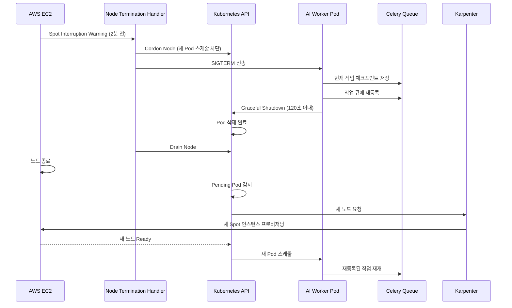

# EKS + Karpenter GPU 오토스케일링 설계

## 목차
1. [Karpenter 개요](#karpenter-개요)
2. [EKS 클러스터 구성](#eks-클러스터-구성)
3. [Karpenter 설치 및 설정](#karpenter-설치-및-설정)
4. [GPU 노드 프로비저닝](#gpu-노드-프로비저닝)
5. [Spot Interruption 처리](#spot-interruption-처리)
6. [모니터링 및 최적화](#모니터링-및-최적화)

---

## Karpenter 개요

### Cluster Autoscaler vs Karpenter

| 특징 | Cluster Autoscaler | Karpenter |
|------|-------------------|-----------|
| **프로비저닝 속도** | 3-5분 | **30-60초** |
| **인스턴스 선택** | 미리 정의된 Node Group | **동적 선택 (Right-Sizing)** |
| **Spot 지원** | 제한적 | **완전 지원** |
| **Consolidation** | 없음 | **자동 노드 통합** |
| **Scale-to-Zero** | 어려움 | **네이티브 지원** |

### Karpenter의 핵심 기능
1. **빠른 스케일업**: Pending Pod 감지 후 60초 내 노드 생성
2. **Right-Sizing**: 요청에 맞는 최적 인스턴스 타입 자동 선택
3. **Spot Fallback**: Spot 불가 시 자동으로 On-Demand로 전환
4. **Consolidation**: 유휴 리소스 자동 통합 (비용 절감)
5. **Expiration**: 노드 자동 교체 (보안 패치)

---

## EKS 클러스터 구성

### Terraform으로 EKS 클러스터 생성

```hcl
# infra/terraform/eks.tf
module "eks" {
  source  = "terraform-aws-modules/eks/aws"
  version = "~> 19.0"

  cluster_name    = "pingvas-studio-cluster"
  cluster_version = "1.31"

  vpc_id     = module.vpc.vpc_id
  subnet_ids = module.vpc.private_subnets

  # Karpenter용 IRSA (IAM Roles for Service Accounts)
  enable_irsa = true

  # 기본 관리형 노드 그룹 (System Nodes)
  eks_managed_node_groups = {
    system = {
      name = "system-nodes"

      instance_types = ["t4g.medium", "t4g.large"]
      capacity_type  = "SPOT"  # 50% Spot, 50% On-Demand

      min_size     = 2
      max_size     = 6
      desired_size = 3

      labels = {
        role = "system"
      }

      taints = []  # System 노드는 taint 없음

      iam_role_additional_policies = {
        AmazonSSMManagedInstanceCore = "arn:aws:iam::aws:policy/AmazonSSMManagedInstanceCore"
      }
    }
  }

  # Karpenter용 태그
  tags = {
    "karpenter.sh/discovery" = "pingvas-studio-cluster"
  }
}

# Karpenter용 IAM Role
module "karpenter_irsa" {
  source  = "terraform-aws-modules/iam/aws//modules/iam-role-for-service-accounts-eks"
  version = "~> 5.0"

  role_name = "karpenter-controller-${module.eks.cluster_name}"

  attach_karpenter_controller_policy = true

  karpenter_controller_cluster_name       = module.eks.cluster_name
  karpenter_controller_node_iam_role_arns = [
    module.eks.eks_managed_node_groups["system"].iam_role_arn
  ]

  oidc_providers = {
    main = {
      provider_arn               = module.eks.oidc_provider_arn
      namespace_service_accounts = ["karpenter:karpenter"]
    }
  }
}

# Karpenter용 Instance Profile
resource "aws_iam_instance_profile" "karpenter" {
  name = "KarpenterNodeInstanceProfile-${module.eks.cluster_name}"
  role = aws_iam_role.karpenter_node.name
}

resource "aws_iam_role" "karpenter_node" {
  name = "KarpenterNodeRole-${module.eks.cluster_name}"

  assume_role_policy = jsonencode({
    Version = "2012-10-17"
    Statement = [{
      Action = "sts:AssumeRole"
      Effect = "Allow"
      Principal = {
        Service = "ec2.amazonaws.com"
      }
    }]
  })
}

resource "aws_iam_role_policy_attachment" "karpenter_node_policies" {
  for_each = toset([
    "arn:aws:iam::aws:policy/AmazonEKSWorkerNodePolicy",
    "arn:aws:iam::aws:policy/AmazonEKS_CNI_Policy",
    "arn:aws:iam::aws:policy/AmazonEC2ContainerRegistryReadOnly",
    "arn:aws:iam::aws:policy/AmazonSSMManagedInstanceCore"
  ])

  role       = aws_iam_role.karpenter_node.name
  policy_arn = each.value
}
```

---

## Karpenter 설치 및 설정

### 1. Helm으로 Karpenter 설치

```bash
# Karpenter 네임스페이스 생성
kubectl create namespace karpenter

# Helm repo 추가
helm repo add karpenter https://charts.karpenter.sh
helm repo update

# Karpenter 설치
helm upgrade --install karpenter karpenter/karpenter \
  --namespace karpenter \
  --create-namespace \
  --set serviceAccount.annotations."eks\.amazonaws\.com/role-arn"=arn:aws:iam::ACCOUNT_ID:role/karpenter-controller-pingvas-studio-cluster \
  --set settings.clusterName=pingvas-studio-cluster \
  --set settings.interruptionQueue=pingvas-studio-cluster \
  --set controller.resources.requests.cpu=1 \
  --set controller.resources.requests.memory=1Gi \
  --set controller.resources.limits.cpu=1 \
  --set controller.resources.limits.memory=1Gi \
  --wait
```

### 2. NodePool 설정 (GPU 노드)

```yaml
# k8s/karpenter/nodepool-gpu.yaml
apiVersion: karpenter.sh/v1beta1
kind: NodePool
metadata:
  name: gpu-spot
spec:
  # 노드 템플릿
  template:
    metadata:
      labels:
        role: gpu-worker
        tier: standard
    spec:
      nodeClassRef:
        name: gpu-ec2-nodeclass

      requirements:
        # Spot 인스턴스만
        - key: karpenter.sh/capacity-type
          operator: In
          values: ["spot"]

        # GPU 인스턴스 타입
        - key: node.kubernetes.io/instance-type
          operator: In
          values:
            - g4dn.xlarge   # $0.526/h - NVIDIA T4 16GB
            - g4dn.2xlarge  # $0.752/h - NVIDIA T4 16GB
            - g5.xlarge     # $1.006/h - NVIDIA A10G 24GB (우선)
            - g5.2xlarge    # $1.212/h - NVIDIA A10G 24GB

        # 아키텍처
        - key: kubernetes.io/arch
          operator: In
          values: ["amd64"]

        # 가용 영역
        - key: topology.kubernetes.io/zone
          operator: In
          values:
            - ap-northeast-2a
            - ap-northeast-2c

      # Taints (GPU 노드는 GPU 요청 Pod만 스케줄)
      taints:
        - key: nvidia.com/gpu
          value: "true"
          effect: NoSchedule

      # 시작 템플릿
      startupTaints:
        - key: node.kubernetes.io/not-ready
          effect: NoSchedule

  # 리소스 제한
  limits:
    cpu: "1000"      # 최대 1000 vCPU
    memory: 4000Gi   # 최대 4000 GiB
    nvidia.com/gpu: "20"  # 최대 20개 GPU

  # 중단 정책
  disruption:
    # 통합 활성화 (유휴 리소스 정리)
    consolidationPolicy: WhenUnderutilized
    consolidateAfter: 30s  # 30초 유휴 시 노드 삭제

    # 만료 정책 (노드 자동 교체)
    expireAfter: 168h  # 7일마다 노드 교체

  # 가중치 (여러 NodePool 간 우선순위)
  weight: 10
---
# Premium GPU NodePool (Studio/Enterprise)
apiVersion: karpenter.sh/v1beta1
kind: NodePool
metadata:
  name: gpu-premium
spec:
  template:
    metadata:
      labels:
        role: gpu-worker
        tier: premium
    spec:
      nodeClassRef:
        name: gpu-ec2-nodeclass

      requirements:
        # On-Demand 인스턴스 (안정성 우선)
        - key: karpenter.sh/capacity-type
          operator: In
          values: ["on-demand"]

        # 더 좋은 GPU
        - key: node.kubernetes.io/instance-type
          operator: In
          values:
            - g5.xlarge
            - g5.2xlarge
            - g5.4xlarge  # NVIDIA A10G x2

        - key: kubernetes.io/arch
          operator: In
          values: ["amd64"]

      taints:
        - key: tier
          value: premium
          effect: NoSchedule

  limits:
    nvidia.com/gpu: "10"

  disruption:
    consolidationPolicy: WhenEmpty
    consolidateAfter: 60s  # 프리미엄은 1분 유지
    expireAfter: 720h  # 30일

  weight: 100  # 높은 우선순위
```

### 3. EC2NodeClass 설정

```yaml
# k8s/karpenter/ec2nodeclass-gpu.yaml
apiVersion: karpenter.k8s.aws/v1beta1
kind: EC2NodeClass
metadata:
  name: gpu-ec2-nodeclass
spec:
  # AMI 자동 선택 (EKS Optimized GPU AMI)
  amiFamily: AL2  # Amazon Linux 2

  # 서브넷 선택 (Karpenter가 자동으로 선택)
  subnetSelectorTerms:
    - tags:
        karpenter.sh/discovery: pingvas-studio-cluster

  # 보안 그룹
  securityGroupSelectorTerms:
    - tags:
        karpenter.sh/discovery: pingvas-studio-cluster

  # IAM Instance Profile
  instanceProfile: KarpenterNodeInstanceProfile-pingvas-studio-cluster

  # 사용자 데이터 (노드 초기화 스크립트)
  userData: |
    #!/bin/bash
    # EFS 마운트
    mkdir -p /mnt/efs/models
    mount -t nfs4 -o nfsvers=4.1,rsize=1048576,wsize=1048576,hard,timeo=600,retrans=2 \
      fs-0123456789abcdef.efs.ap-northeast-2.amazonaws.com:/ /mnt/efs/models

    # Docker 로그 로테이션
    cat > /etc/docker/daemon.json <<EOF
    {
      "log-driver": "json-file",
      "log-opts": {
        "max-size": "10m",
        "max-file": "3"
      }
    }
    EOF

    systemctl restart docker

  # 블록 디바이스 매핑 (루트 볼륨 크기)
  blockDeviceMappings:
    - deviceName: /dev/xvda
      ebs:
        volumeSize: 100Gi  # 100GB (모델 캐싱)
        volumeType: gp3
        iops: 3000
        throughput: 125
        encrypted: true
        deleteOnTermination: true

  # 메타데이터 옵션
  metadataOptions:
    httpEndpoint: enabled
    httpProtocolIPv6: disabled
    httpPutResponseHopLimit: 2
    httpTokens: required  # IMDSv2 강제

  # 태그
  tags:
    Name: karpenter-gpu-node
    Environment: production
    ManagedBy: karpenter
```

---

## GPU 노드 프로비저닝

### Worker Pod 배포 (Karpenter 트리거)

```yaml
# services/worker/k8s/deployment.yaml
apiVersion: apps/v1
kind: Deployment
metadata:
  name: ai-worker
  namespace: prod
spec:
  replicas: 0  # Karpenter가 동적으로 스케일
  selector:
    matchLabels:
      app: ai-worker
  template:
    metadata:
      labels:
        app: ai-worker
    spec:
      # NodeSelector: GPU 노드에만 배치
      nodeSelector:
        role: gpu-worker

      # Toleration: GPU taint 허용
      tolerations:
        - key: nvidia.com/gpu
          operator: Exists
          effect: NoSchedule

      # Volume: EFS 마운트
      volumes:
        - name: models
          persistentVolumeClaim:
            claimName: efs-models-pvc

      containers:
        - name: worker
          image: ghcr.io/pinksea-ai/ai-worker:latest

          # GPU 리소스 요청
          resources:
            requests:
              nvidia.com/gpu: 1
              cpu: "3"
              memory: "12Gi"
            limits:
              nvidia.com/gpu: 1
              cpu: "4"
              memory: "16Gi"

          # 환경 변수
          env:
            - name: CELERY_BROKER
              value: "redis://redis-sentinel:26379/0"
            - name: CELERY_QUEUES
              value: "queue:pro,queue:starter,queue:free"
            - name: CUDA_VISIBLE_DEVICES
              value: "0"

          # Volume Mount
          volumeMounts:
            - name: models
              mountPath: /models
              readOnly: true

          # Liveness Probe
          livenessProbe:
            exec:
              command:
                - celery
                - -A
                - app
                - inspect
                - ping
            initialDelaySeconds: 60
            periodSeconds: 30
            timeoutSeconds: 10
            failureThreshold: 3

          # Readiness Probe
          readinessProbe:
            exec:
              command:
                - celery
                - -A
                - app
                - inspect
                - active
            initialDelaySeconds: 30
            periodSeconds: 10
```

### HPA (Horizontal Pod Autoscaler)

```yaml
# services/worker/k8s/hpa.yaml
apiVersion: autoscaling/v2
kind: HorizontalPodAutoscaler
metadata:
  name: ai-worker-hpa
  namespace: prod
spec:
  scaleTargetRef:
    apiVersion: apps/v1
    kind: Deployment
    name: ai-worker

  minReplicas: 0  # Scale-to-Zero
  maxReplicas: 20

  metrics:
    # Celery 큐 길이 기반 스케일링 (Custom Metric)
    - type: External
      external:
        metric:
          name: celery_queue_length
          selector:
            matchLabels:
              queue_name: "queue:pro"
        target:
          type: AverageValue
          averageValue: "3"  # 큐에 3개 이상 작업 시 스케일업

  behavior:
    scaleDown:
      stabilizationWindowSeconds: 300  # 5분 안정화
      policies:
        - type: Percent
          value: 50
          periodSeconds: 60
    scaleUp:
      stabilizationWindowSeconds: 0  # 즉시 스케일업
      policies:
        - type: Percent
          value: 100
          periodSeconds: 15  # 15초마다 2배 증가
```

---

## Spot Interruption 처리

### AWS Node Termination Handler 설치

```bash
# Helm으로 설치
helm repo add eks https://aws.github.io/eks-charts
helm repo update

helm upgrade --install aws-node-termination-handler \
  --namespace karpenter \
  eks/aws-node-termination-handler \
  --set enableSpotInterruptionDraining=true \
  --set enableScheduledEventDraining=true \
  --set deleteLocalData=true \
  --set podTerminationGracePeriod=120
```

### Spot Interruption 플로우



### Worker Graceful Shutdown

```python
# services/worker/tasks/__init__.py
import signal
import sys

def signal_handler(sig, frame):
    """
    Spot Interruption 시 Graceful Shutdown
    """
    logger.info("Received termination signal, shutting down gracefully...")

    # 현재 실행 중인 작업 체크포인트 저장
    current_job_id = get_current_job_id()
    if current_job_id:
        save_checkpoint(current_job_id)
        logger.info(f"Checkpoint saved for job {current_job_id}")

    # Celery Worker 종료
    celery_app.control.shutdown()

    sys.exit(0)

# SIGTERM 핸들러 등록
signal.signal(signal.SIGTERM, signal_handler)
```

---

## 모니터링 및 최적화

### Prometheus Metrics

```yaml
# k8s/monitoring/servicemonitor-karpenter.yaml
apiVersion: monitoring.coreos.com/v1
kind: ServiceMonitor
metadata:
  name: karpenter
  namespace: karpenter
spec:
  selector:
    matchLabels:
      app.kubernetes.io/name: karpenter
  endpoints:
    - port: http-metrics
      interval: 30s
```

### 주요 메트릭

```promql
# 노드 프로비저닝 시간
histogram_quantile(0.99, sum(rate(karpenter_provisioning_duration_seconds_bucket[5m])) by (le))

# 현재 GPU 노드 수
count(kube_node_labels{label_role="gpu-worker"})

# GPU 사용률
avg(DCGM_FI_DEV_GPU_UTIL) by (node)

# Spot Interruption 횟수
sum(increase(karpenter_interruption_actions_performed_total[1h]))

# 비용 절감
sum(karpenter_node_pool_usage{capacity_type="spot"}) / sum(karpenter_node_pool_usage) * 100
```

### Grafana 대시보드

```json
{
  "dashboard": {
    "title": "Karpenter GPU Autoscaling",
    "panels": [
      {
        "title": "GPU 노드 수",
        "targets": [
          {
            "expr": "count(kube_node_labels{label_role=\"gpu-worker\"})"
          }
        ]
      },
      {
        "title": "Pending Pods",
        "targets": [
          {
            "expr": "sum(kube_pod_status_phase{phase=\"Pending\", namespace=\"prod\"})"
          }
        ]
      },
      {
        "title": "평균 프로비저닝 시간",
        "targets": [
          {
            "expr": "histogram_quantile(0.50, sum(rate(karpenter_provisioning_duration_seconds_bucket[5m])) by (le))"
          }
        ]
      }
    ]
  }
}
```

---

## 비용 최적화 팁

### 1. Consolidation 활성화
```yaml
disruption:
  consolidationPolicy: WhenUnderutilized
  consolidateAfter: 30s
```

### 2. Spot 다양화
여러 인스턴스 타입을 지정하여 Spot 가용성 향상:
```yaml
values:
  - g4dn.xlarge
  - g4dn.2xlarge
  - g5.xlarge
  - g5.2xlarge
```

### 3. TTL 설정
```yaml
expireAfter: 168h  # 7일마다 노드 교체 (최신 AMI)
```

### 4. 예상 비용

| 시나리오 | GPU 사용 시간 | Spot 비용 | 절감 효과 |
|----------|--------------|-----------|----------|
| 24/7 운영 (g5.xlarge) | 720시간 | $724/월 | 0% |
| 8시간/일 (하루 8시간만) | 240시간 | $241/월 | **67%** |
| Scale-to-Zero (요청 시만) | 100시간 | $100/월 | **86%** |

---

## 다음 단계

이제 우선순위 큐 시스템으로 넘어갑니다:
- [우선순위 큐 (Priority Queue) 시스템](./08-priority-queue.md)
