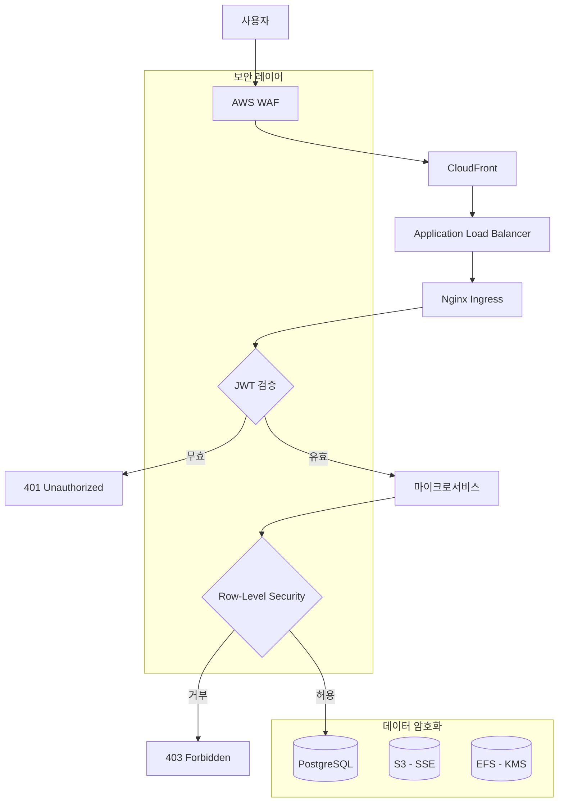

# 보안 아키텍처 (WAF, OAuth, API 인증)

## 목차
1. [보안 레이어 개요](#보안-레이어-개요)
2. [AWS WAF 설정](#aws-waf-설정)
3. [OAuth 2.0 인증](#oauth-20-인증)
4. [JWT 기반 API 인증](#jwt-기반-api-인증)
5. [Row-Level Security](#row-level-security)
6. [비밀 관리](#비밀-관리)
7. [보안 모니터링](#보안-모니터링)

---

## 보안 레이어 개요



---

## AWS WAF 설정

### 1. WAF Web ACL (Terraform)

```hcl
# infra/terraform/waf.tf
resource "aws_wafv2_web_acl" "main" {
  name = "pingvas-studio-waf"
  scope = "CLOUDFRONT"  # CloudFront용

  default_action {
    allow {}
  }

  # Rule 1: Rate Limiting (IP당 요청 수 제한)
  rule {
    name = "RateLimitRule"
    priority = 1

    statement {
      rate_based_statement {
        limit = 2000  # 5분당 2000 요청
        aggregate_key_type = "IP"
      }
    }

    action {
      block {}
    }

    visibility_config {
      sampled_requests_enabled = true
      cloudwatch_metrics_enabled = true
      metric_name = "RateLimitRule"
    }
  }

  # Rule 2: AWS Managed Core Rule Set
  rule {
    name = "AWS-AWSManagedRulesCommonRuleSet"
    priority = 2

    override_action {
      none {}
    }

    statement {
      managed_rule_group_statement {
        vendor_name = "AWS"
        name = "AWSManagedRulesCommonRuleSet"

        # SQL Injection, XSS 등 공통 공격 차단
      }
    }

    visibility_config {
      sampled_requests_enabled = true
      cloudwatch_metrics_enabled = true
      metric_name = "AWSManagedRulesCommonRuleSetMetric"
    }
  }

  # Rule 3: Known Bad Inputs
  rule {
    name = "AWS-AWSManagedRulesKnownBadInputsRuleSet"
    priority = 3

    override_action {
      none {}
    }

    statement {
      managed_rule_group_statement {
        vendor_name = "AWS"
        name = "AWSManagedRulesKnownBadInputsRuleSet"
      }
    }

    visibility_config {
      sampled_requests_enabled = true
      cloudwatch_metrics_enabled = true
      metric_name = "AWSManagedRulesKnownBadInputsRuleSetMetric"
    }
  }

  # Rule 4: IP Reputation List
  rule {
    name = "AWS-AWSManagedRulesAmazonIpReputationList"
    priority = 4

    override_action {
      none {}
    }

    statement {
      managed_rule_group_statement {
        vendor_name = "AWS"
        name = "AWSManagedRulesAmazonIpReputationList"
      }
    }

    visibility_config {
      sampled_requests_enabled = true
      cloudwatch_metrics_enabled = true
      metric_name = "AWSManagedRulesAmazonIpReputationListMetric"
    }
  }

  # Rule 5: Geo Blocking (선택적)
  # rule {
  #   name = "GeoBlockRule"
  #   priority = 5

  #   statement {
  #     geo_match_statement {
  #       country_codes = ["CN", "RU"]  # 중국, 러시아 차단 (선택)
  #     }
  #   }

  #   action {
  #     block {}
  #   }

  #   visibility_config {
  #     sampled_requests_enabled = true
  #     cloudwatch_metrics_enabled = true
  #     metric_name = "GeoBlockRule"
  #   }
  # }

  visibility_config {
    sampled_requests_enabled = true
    cloudwatch_metrics_enabled = true
    metric_name = "pingvas-studio-waf"
  }
}

# WAF를 CloudFront에 연결
resource "aws_wafv2_web_acl_association" "cloudfront" {
  resource_arn = aws_cloudfront_distribution.main.arn
  web_acl_arn = aws_wafv2_web_acl.main.arn
}
```

---

## OAuth 2.0 인증

### 1. Google OAuth 설정

```python
# services/user/auth/oauth_providers.py
from authlib.integrations.starlette_client import OAuth

oauth = OAuth()

oauth.register(
    name="google",
    client_id=settings.GOOGLE_CLIENT_ID,
    client_secret=settings.GOOGLE_CLIENT_SECRET,
    server_metadata_url="https://accounts.google.com/.well-known/openid-configuration",
    client_kwargs={
        "scope": "openid email profile"
    }
)

oauth.register(
    name="discord",
    client_id=settings.DISCORD_CLIENT_ID,
    client_secret=settings.DISCORD_CLIENT_SECRET,
    authorize_url="https://discord.com/api/oauth2/authorize",
    access_token_url="https://discord.com/api/oauth2/token",
    client_kwargs={
        "scope": "identify email"
    }
)
```

### 2. OAuth 콜백 핸들러

```python
# services/user/api/auth.py
from fastapi import APIRouter, Request, HTTPException
from fastapi.responses import RedirectResponse

router = APIRouter()

@router.get("/api/v1/auth/google")
async def google_login(request: Request):
    """
    Google OAuth 로그인 시작
    """
    redirect_uri = request.url_for("google_callback")
    return await oauth.google.authorize_redirect(request, redirect_uri)

@router.get("/api/v1/auth/google/callback")
async def google_callback(request: Request, db: Session = Depends(get_db)):
    """
    Google OAuth 콜백
    """
    try:
        # 1. 토큰 교환
        token = await oauth.google.authorize_access_token(request)

        # 2. 사용자 정보 가져오기
        user_info = token.get("userinfo")

        if not user_info:
            raise HTTPException(status_code=400, detail="Failed to get user info")

        email = user_info["email"]
        name = user_info.get("name", "")
        picture = user_info.get("picture", "")

        # 3. 기존 사용자 확인 또는 생성
        user = db.query(User).filter(User.email == email).first()

        if not user:
            user = User(
                id=uuid.uuid4(),
                email=email,
                display_name=name,
                avatar_url=picture,
                oauth_provider="google",
                oauth_id=user_info["sub"],
                tier="free",
                created_at=datetime.utcnow()
            )
            db.add(user)

            # 초기 크레딧 지급 (Free tier)
            credit_balance = CreditBalance(
                user_id=user.id,
                balance=500
            )
            db.add(credit_balance)

            db.commit()
            db.refresh(user)

        # 4. 로그인 시간 업데이트
        user.last_login_at = datetime.utcnow()
        db.commit()

        # 5. JWT 토큰 생성
        access_token = create_access_token(
            data={
                "sub": str(user.id),
                "email": user.email,
                "tier": user.tier
            }
        )
        refresh_token = create_refresh_token(data={"sub": str(user.id)})

        # 6. Frontend로 리다이렉트
        return RedirectResponse(
            url=f"https://pingvas.studio/auth/callback?token={access_token}&refresh={refresh_token}"
        )

    except Exception as e:
        logger.error(f"OAuth callback error: {str(e)}")
        return RedirectResponse(url=f"https://pingvas.studio/auth/error?message={str(e)}")
```

---

## JWT 기반 API 인증

### 1. JWT 토큰 생성

```python
# services/user/auth/jwt.py
from jose import JWTError, jwt
from datetime import datetime, timedelta
import secrets

SECRET_KEY = settings.JWT_SECRET_KEY
ALGORITHM = "HS256"
ACCESS_TOKEN_EXPIRE_MINUTES = 60  # 1시간
REFRESH_TOKEN_EXPIRE_DAYS = 30  # 30일

def create_access_token(data: dict) -> str:
    """
    Access Token 생성
    """
    to_encode = data.copy()
    expire = datetime.utcnow() + timedelta(minutes=ACCESS_TOKEN_EXPIRE_MINUTES)

    to_encode.update({
        "exp": expire,
        "iat": datetime.utcnow(),
        "jti": secrets.token_urlsafe(16),  # JWT ID (블랙리스트용)
        "type": "access"
    })

    encoded_jwt = jwt.encode(to_encode, SECRET_KEY, algorithm=ALGORITHM)
    return encoded_jwt

def create_refresh_token(data: dict) -> str:
    """
    Refresh Token 생성
    """
    to_encode = data.copy()
    expire = datetime.utcnow() + timedelta(days=REFRESH_TOKEN_EXPIRE_DAYS)

    to_encode.update({
        "exp": expire,
        "iat": datetime.utcnow(),
        "jti": secrets.token_urlsafe(16),
        "type": "refresh"
    })

    encoded_jwt = jwt.encode(to_encode, SECRET_KEY, algorithm=ALGORITHM)
    return encoded_jwt

def verify_token(token: str) -> dict:
    """
    JWT 토큰 검증
    """
    try:
        payload = jwt.decode(token, SECRET_KEY, algorithms=[ALGORITHM])

        # 블랙리스트 확인 (로그아웃된 토큰)
        jti = payload.get("jti")
        if is_token_blacklisted(jti):
            raise JWTError("Token has been revoked")

        return payload

    except jwt.ExpiredSignatureError:
        raise HTTPException(
            status_code=401,
            detail="Token has expired",
            headers={"WWW-Authenticate": "Bearer"}
        )
    except JWTError:
        raise HTTPException(
            status_code=401,
            detail="Could not validate credentials",
            headers={"WWW-Authenticate": "Bearer"}
        )

def is_token_blacklisted(jti: str) -> bool:
    """
    Redis에서 토큰 블랙리스트 확인
    """
    return redis_client.exists(f"token:blacklist:{jti}") == 1
```

### 2. 토큰 갱신 API

```python
# services/user/api/auth.py
@router.post("/api/v1/auth/refresh", response_model=TokenResponse)
async def refresh_access_token(refresh_token: str):
    """
    Refresh Token으로 새 Access Token 발급
    """
    try:
        payload = jwt.decode(refresh_token, SECRET_KEY, algorithms=[ALGORITHM])

        if payload.get("type") != "refresh":
            raise HTTPException(status_code=401, detail="Invalid token type")

        user_id = payload.get("sub")

        # 사용자 정보 조회 (tier 등 최신 정보 반영)
        user = db.query(User).filter(User.id == user_id).first()

        if not user:
            raise HTTPException(status_code=404, detail="User not found")

        # 새 Access Token 발급
        new_access_token = create_access_token(
            data={
                "sub": str(user.id),
                "email": user.email,
                "tier": user.tier
            }
        )

        return {
            "access_token": new_access_token,
            "token_type": "bearer"
        }

    except JWTError:
        raise HTTPException(status_code=401, detail="Invalid refresh token")

@router.post("/api/v1/auth/logout")
async def logout(current_user: dict = Depends(verify_token)):
    """
    로그아웃 (토큰 블랙리스트 추가)
    """
    jti = current_user.get("jti")
    exp = current_user.get("exp")

    # 만료 시간까지 블랙리스트에 추가
    ttl = exp - int(datetime.utcnow().timestamp())

    redis_client.setex(
        f"token:blacklist:{jti}",
        ttl,
        "1"
    )

    return {"message": "Successfully logged out"}
```

---

## Row-Level Security

### PostgreSQL RLS 정책

```sql
-- 1. RLS 활성화
ALTER TABLE images ENABLE ROW LEVEL SECURITY;
ALTER TABLE boards ENABLE ROW LEVEL SECURITY;
ALTER TABLE generation_jobs ENABLE ROW LEVEL SECURITY;

-- 2. 이미지 정책: 자신의 이미지만 조회
CREATE POLICY images_select_own ON images
FOR SELECT
USING (user_id = current_setting('app.current_user_id')::UUID);

-- 3. 이미지 정책: 공개 이미지는 누구나 조회
CREATE POLICY images_select_public ON images
FOR SELECT
USING (is_public = TRUE);

-- 4. 이미지 정책: 자신의 이미지만 삭제
CREATE POLICY images_delete_own ON images
FOR DELETE
USING (user_id = current_setting('app.current_user_id')::UUID);

-- 5. 보드 정책
CREATE POLICY boards_all_own ON boards
FOR ALL
USING (user_id = current_setting('app.current_user_id')::UUID);

-- 6. 생성 작업 정책
CREATE POLICY generation_jobs_all_own ON generation_jobs
FOR ALL
USING (user_id = current_setting('app.current_user_id')::UUID);
```

### 애플리케이션에서 RLS 적용

```python
# common/database.py
from sqlalchemy import event
from sqlalchemy.engine import Engine
from flask import g

@event.listens_for(Engine, "connect")
def set_current_user_id(dbapi_conn, connection_record):
    """
    각 DB 연결마다 현재 사용자 ID 설정 (RLS 적용)
    """
    cursor = dbapi_conn.cursor()

    # Request Context에서 user_id 가져오기
    user_id = g.get("user_id")

    if user_id:
        cursor.execute(f"SET app.current_user_id = '{user_id}'")
    else:
        # 인증되지 않은 요청 (공개 데이터만 접근)
        cursor.execute("SET app.current_user_id = '00000000-0000-0000-0000-000000000000'")

    cursor.close()

# Middleware에서 g.user_id 설정
@app.before_request
def set_user_context():
    token = request.headers.get("Authorization", "").replace("Bearer ", "")

    if token:
        try:
            payload = verify_token(token)
            g.user_id = payload["sub"]
        except:
            g.user_id = None
    else:
        g.user_id = None
```

---

## 비밀 관리

### AWS Secrets Manager (Terraform)

```hcl
# infra/terraform/secrets.tf
resource "aws_secretsmanager_secret" "db_credentials" {
  name = "pingvas-studio/db/credentials"
  description = "PostgreSQL database credentials"
}

resource "aws_secretsmanager_secret_version" "db_credentials" {
  secret_id = aws_secretsmanager_secret.db_credentials.id

  secret_string = jsonencode({
    username = "pingvas_admin"
    password = random_password.db_password.result
    host = aws_db_instance.postgresql.address
    port = 5432
    database = "pingvas_db"
  })
}

resource "random_password" "db_password" {
  length = 32
  special = true
  override_special = "!#$%&*()-_=+[]{}<>:?"
}

# JWT Secret Key
resource "aws_secretsmanager_secret" "jwt_secret" {
  name = "pingvas-studio/jwt/secret-key"
}

resource "aws_secretsmanager_secret_version" "jwt_secret" {
  secret_id = aws_secretsmanager_secret.jwt_secret.id
  secret_string = random_password.jwt_secret.result
}

resource "random_password" "jwt_secret" {
  length = 64
  special = false
}
```

### Kubernetes External Secrets

```yaml
# k8s/secrets/external-secret.yaml
apiVersion: external-secrets.io/v1beta1
kind: ExternalSecret
metadata:
  name: db-credentials
  namespace: prod
spec:
  refreshInterval: 1h
  secretStoreRef:
    name: aws-secrets-manager
    kind: SecretStore

  target:
    name: db-credentials
    creationPolicy: Owner

  data:
    - secretKey: DB_HOST
      remoteRef:
        key: pingvas-studio/db/credentials
        property: host

    - secretKey: DB_PASSWORD
      remoteRef:
        key: pingvas-studio/db/credentials
        property: password

---
apiVersion: external-secrets.io/v1beta1
kind: SecretStore
metadata:
  name: aws-secrets-manager
  namespace: prod
spec:
  provider:
    aws:
      service: SecretsManager
      region: ap-northeast-2
      auth:
        jwt:
          serviceAccountRef:
            name: external-secrets-sa
```

---

## 보안 모니터링

### CloudWatch 알람

```hcl
# infra/terraform/cloudwatch_alarms.tf
resource "aws_cloudwatch_metric_alarm" "waf_blocked_requests" {
  alarm_name = "WAF-HighBlockedRequests"
  comparison_operator = "GreaterThanThreshold"
  evaluation_periods = 2
  metric_name = "BlockedRequests"
  namespace = "AWS/WAFV2"
  period = 300
  statistic = "Sum"
  threshold = 1000  # 5분당 1000 차단 요청

  alarm_actions = [aws_sns_topic.security_alerts.arn]
}

resource "aws_cloudwatch_metric_alarm" "failed_login_attempts" {
  alarm_name = "FailedLoginAttempts"
  comparison_operator = "GreaterThanThreshold"
  evaluation_periods = 1
  metric_name = "FailedLoginAttempts"
  namespace = "PingvasStudio"
  period = 60
  statistic = "Sum"
  threshold = 50  # 1분당 50회 실패

  alarm_actions = [aws_sns_topic.security_alerts.arn]
}
```

---

## 다음 단계

이제 GitOps/DevOps 파이프라인으로 넘어갑니다:
- [GitOps/DevOps 파이프라인 (ArgoCD)](./11-gitops-devops.md)
