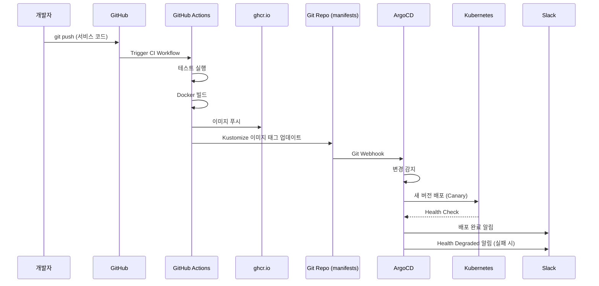

# GitOps/DevOps 파이프라인 (ArgoCD)

## 목차
1. [GitOps 개요](#gitops-개요)
2. [ArgoCD 설치 및 설정](#argocd-설치-및-설정)
3. [CI/CD 파이프라인](#cicd-파이프라인)
4. [환경 분리 전략](#환경-분리-전략)
5. [배포 전략](#배포-전략)
6. [Monitoring](#monitoring)

---

## GitOps 개요

### GitOps 원칙
1. **선언적 구성**: 모든 인프라/애플리케이션 상태를 Git에 선언
2. **버전 관리**: Git이 Single Source of Truth
3. **자동 동기화**: Git 변경 → 자동 배포
4. **자동 복구**: Drift 감지 시 자동 복구

### Git Repository 구조

```
pinksea-ai/invokeai-saas/
├── services/                    # 서비스 소스 코드
│   ├── user-service/
│   ├── payment-service/
│   ├── generation-service/
│   ├── gallery-service/
│   ├── model-service/
│   └── worker/
│
├── k8s/                         # Kubernetes 매니페스트
│   ├── base/                    # Kustomize Base
│   │   ├── user-service/
│   │   ├── payment-service/
│   │   └── ...
│   ├── overlays/
│   │   ├── dev/                 # 개발 환경
│   │   │   └── kustomization.yaml
│   │   └── prod/                # 운영 환경
│   │       └── kustomization.yaml
│   └── infra/
│       ├── argo-cd/
│       ├── karpenter/
│       ├── nginx-ingress/
│       └── external-secrets/
│
├── infra/                       # Terraform
│   └── terraform/
│       ├── eks.tf
│       ├── rds.tf
│       ├── s3.tf
│       └── ...
│
├── .github/
│   └── workflows/
│       ├── ci-user-service.yaml
│       ├── ci-payment-service.yaml
│       └── ...
│
└── README.md
```

---

## ArgoCD 설치 및 설정

### 1. ArgoCD 설치 (Helm)

```bash
# ArgoCD 네임스페이스 생성
kubectl create namespace argocd

# ArgoCD 설치
helm repo add argo https://argoproj.github.io/argo-helm
helm repo update

helm install argocd argo/argo-cd \
  --namespace argocd \
  --set server.service.type=LoadBalancer \
  --set configs.params."server\.insecure"=true \
  --set configs.cm."resource\.compareoptions"="ignoreAggregatedRoles: true" \
  --wait

# Admin 비밀번호 가져오기
kubectl -n argocd get secret argocd-initial-admin-secret \
  -o jsonpath="{.data.password}" | base64 -d
```

### 2. ArgoCD Application (각 마이크로서비스)

```yaml
# k8s/infra/argo-cd/applications/user-service.yaml
apiVersion: argoproj.io/v1alpha1
kind: Application
metadata:
  name: user-service-prod
  namespace: argocd
  finalizers:
    - resources-finalizer.argocd.argoproj.io
spec:
  project: default

  source:
    repoURL: https://github.com/pinksea-ai/invokeai-saas.git
    targetRevision: main
    path: k8s/overlays/prod/user-service

  destination:
    server: https://kubernetes.default.svc
    namespace: prod

  syncPolicy:
    automated:
      prune: true      # 삭제된 리소스 자동 제거
      selfHeal: true   # Drift 감지 시 자동 복구
      allowEmpty: false

    syncOptions:
      - CreateNamespace=true

    retry:
      limit: 5
      backoff:
        duration: 5s
        factor: 2
        maxDuration: 3m
```

### 3. ApplicationSet (모든 서비스 자동 생성)

```yaml
# k8s/infra/argo-cd/applicationsets/services.yaml
apiVersion: argoproj.io/v1alpha1
kind: ApplicationSet
metadata:
  name: microservices
  namespace: argocd
spec:
  generators:
    - list:
        elements:
          - service: user-service
            port: 8001
          - service: payment-service
            port: 8002
          - service: generation-service
            port: 8003
          - service: gallery-service
            port: 8004
          - service: model-service
            port: 8005

  template:
    metadata:
      name: '{{service}}-prod'
    spec:
      project: default
      source:
        repoURL: https://github.com/pinksea-ai/invokeai-saas.git
        targetRevision: main
        path: 'k8s/overlays/prod/{{service}}'
      destination:
        server: https://kubernetes.default.svc
        namespace: prod
      syncPolicy:
        automated:
          prune: true
          selfHeal: true
```

---

## CI/CD 파이프라인

### GitHub Actions Workflow

```yaml
# .github/workflows/ci-user-service.yaml
name: CI - User Service

on:
  push:
    branches: [main, develop]
    paths:
      - 'services/user-service/**'
      - '.github/workflows/ci-user-service.yaml'

env:
  REGISTRY: ghcr.io
  IMAGE_NAME: pinksea-ai/user-service

jobs:
  build-and-push:
    runs-on: ubuntu-latest
    permissions:
      contents: read
      packages: write

    steps:
      - name: Checkout code
        uses: actions/checkout@v4

      - name: Set up Docker Buildx
        uses: docker/setup-buildx-action@v3

      - name: Log in to Container Registry
        uses: docker/login-action@v3
        with:
          registry: ${{ env.REGISTRY }}
          username: ${{ github.actor }}
          password: ${{ secrets.GITHUB_TOKEN }}

      - name: Extract metadata
        id: meta
        uses: docker/metadata-action@v5
        with:
          images: ${{ env.REGISTRY }}/${{ env.IMAGE_NAME }}
          tags: |
            type=ref,event=branch
            type=sha,prefix={{branch}}-
            type=semver,pattern={{version}}

      - name: Build and push Docker image
        uses: docker/build-push-action@v5
        with:
          context: ./services/user-service
          push: true
          tags: ${{ steps.meta.outputs.tags }}
          labels: ${{ steps.meta.outputs.labels }}
          cache-from: type=gha
          cache-to: type=gha,mode=max

      - name: Update Kustomize image tag
        run: |
          cd k8s/overlays/prod/user-service
          kustomize edit set image ${{ env.REGISTRY }}/${{ env.IMAGE_NAME }}=${{ steps.meta.outputs.tags }}

      - name: Commit and push updated manifests
        run: |
          git config user.name "github-actions[bot]"
          git config user.email "github-actions[bot]@users.noreply.github.com"
          git add k8s/overlays/prod/user-service/kustomization.yaml
          git commit -m "Update user-service image to ${{ steps.meta.outputs.tags }}"
          git push
```

---

## 환경 분리 전략

### Kustomize Base

```yaml
# k8s/base/user-service/deployment.yaml
apiVersion: apps/v1
kind: Deployment
metadata:
  name: user-service
spec:
  replicas: 3
  selector:
    matchLabels:
      app: user-service
  template:
    metadata:
      labels:
        app: user-service
    spec:
      containers:
        - name: user-service
          image: ghcr.io/pinksea-ai/user-service:latest
          ports:
            - containerPort: 8001
          env:
            - name: DB_HOST
              valueFrom:
                secretKeyRef:
                  name: db-credentials
                  key: DB_HOST
          resources:
            requests:
              cpu: "500m"
              memory: "512Mi"
            limits:
              cpu: "1000m"
              memory: "1Gi"
```

### Dev Overlay

```yaml
# k8s/overlays/dev/user-service/kustomization.yaml
apiVersion: kustomize.config.k8s.io/v1beta1
kind: Kustomization

namespace: dev

bases:
  - ../../../base/user-service

patchesStrategicMerge:
  - patches/deployment.yaml

replicas:
  - name: user-service
    count: 1  # Dev는 1개만

images:
  - name: ghcr.io/pinksea-ai/user-service
    newTag: develop-abc123  # Dev 브랜치 이미지

configMapGenerator:
  - name: user-service-config
    env: config.env
    behavior: merge

# Patches
# patches/deployment.yaml
apiVersion: apps/v1
kind: Deployment
metadata:
  name: user-service
spec:
  template:
    spec:
      containers:
        - name: user-service
          env:
            - name: ENVIRONMENT
              value: "development"
            - name: DB_SCHEMA
              value: "dev_pingvas"
            - name: LOG_LEVEL
              value: "debug"
```

### Prod Overlay

```yaml
# k8s/overlays/prod/user-service/kustomization.yaml
apiVersion: kustomize.config.k8s.io/v1beta1
kind: Kustomization

namespace: prod

bases:
  - ../../../base/user-service

replicas:
  - name: user-service
    count: 3  # Prod는 3개

images:
  - name: ghcr.io/pinksea-ai/user-service
    newTag: main-def456  # Main 브랜치 이미지

patchesStrategicMerge:
  - patches/deployment.yaml
  - patches/hpa.yaml  # HPA 추가

# patches/deployment.yaml
apiVersion: apps/v1
kind: Deployment
metadata:
  name: user-service
spec:
  template:
    spec:
      containers:
        - name: user-service
          env:
            - name: ENVIRONMENT
              value: "production"
            - name: DB_SCHEMA
              value: "prod_pingvas"
            - name: LOG_LEVEL
              value: "info"
          resources:
            requests:
              cpu: "1000m"
              memory: "1Gi"
            limits:
              cpu: "2000m"
              memory: "2Gi"
```

---

## 배포 전략

### 1. Blue-Green Deployment

```yaml
# k8s/base/user-service/rollout.yaml
apiVersion: argoproj.io/v1alpha1
kind: Rollout
metadata:
  name: user-service
spec:
  replicas: 3
  revisionHistoryLimit: 3
  selector:
    matchLabels:
      app: user-service

  strategy:
    blueGreen:
      activeService: user-service-active
      previewService: user-service-preview
      autoPromotionEnabled: false  # 수동 승인 필요
      scaleDownDelaySeconds: 300   # 5분 후 이전 버전 삭제

  template:
    metadata:
      labels:
        app: user-service
    spec:
      containers:
        - name: user-service
          image: ghcr.io/pinksea-ai/user-service:latest
```

### 2. Canary Deployment

```yaml
# k8s/base/generation-service/rollout.yaml
apiVersion: argoproj.io/v1alpha1
kind: Rollout
metadata:
  name: generation-service
spec:
  replicas: 5
  strategy:
    canary:
      steps:
        - setWeight: 20       # 20% 트래픽
        - pause: {duration: 5m}
        - setWeight: 40       # 40% 트래픽
        - pause: {duration: 5m}
        - setWeight: 60
        - pause: {duration: 5m}
        - setWeight: 80
        - pause: {duration: 5m}

      canaryService: generation-service-canary
      stableService: generation-service-stable

      trafficRouting:
        nginx:
          stableIngress: generation-service-ingress
```

### 3. 배포 승인 (Manual Approval)

```bash
# Rollout 상태 확인
kubectl argo rollouts get rollout user-service -n prod

# Canary 승인 (다음 단계로 진행)
kubectl argo rollouts promote user-service -n prod

# Rollback
kubectl argo rollouts undo user-service -n prod
```

---

## Monitoring

### ArgoCD Notifications

```yaml
# k8s/infra/argo-cd/notifications/config.yaml
apiVersion: v1
kind: ConfigMap
metadata:
  name: argocd-notifications-cm
  namespace: argocd
data:
  service.slack: |
    token: $slack-token

  template.app-deployed: |
    message: |
      Application {{.app.metadata.name}} is now running new version.
      Deployment: {{.app.status.sync.revision}}
    slack:
      attachments: |
        [{
          "title": "{{.app.metadata.name}}",
          "title_link": "{{.context.argocdUrl}}/applications/{{.app.metadata.name}}",
          "color": "good",
          "fields": [{
            "title": "Sync Status",
            "value": "{{.app.status.sync.status}}",
            "short": true
          }, {
            "title": "Health Status",
            "value": "{{.app.status.health.status}}",
            "short": true
          }]
        }]

  trigger.on-deployed: |
    - when: app.status.operationState.phase in ['Succeeded']
      send: [app-deployed]

  trigger.on-health-degraded: |
    - when: app.status.health.status == 'Degraded'
      send: [app-health-degraded]
```

### Prometheus Metrics

```yaml
# k8s/infra/monitoring/servicemonitor-argocd.yaml
apiVersion: monitoring.coreos.com/v1
kind: ServiceMonitor
metadata:
  name: argocd-metrics
  namespace: argocd
spec:
  selector:
    matchLabels:
      app.kubernetes.io/name: argocd-server-metrics
  endpoints:
    - port: metrics
```

---

## 전체 배포 플로우



---

## 로컬 개발 환경

### Skaffold (로컬 K8s 개발)

```yaml
# skaffold.yaml
apiVersion: skaffold/v4beta6
kind: Config
metadata:
  name: pingvas-studio-local

build:
  artifacts:
    - image: user-service
      context: services/user-service
      docker:
        dockerfile: Dockerfile

deploy:
  kubectl:
    manifests:
      - k8s/overlays/dev/user-service/*.yaml

portForward:
  - resourceType: service
    resourceName: user-service
    port: 8001
    localPort: 8001
```

```bash
# 로컬 개발 (자동 리빌드)
skaffold dev

# 디버그 모드
skaffold debug
```

---

## Best Practices

### 1. Git 브랜치 전략
- **main**: Production 환경
- **develop**: Development 환경
- **feature/***: Feature 브랜치

### 2. 이미지 태깅 전략
- `main-{git-sha}`: Production
- `develop-{git-sha}`: Development
- `v1.2.3`: Semantic Versioning (Release)

### 3. Secret 관리
- **절대 Git에 커밋하지 않기**
- External Secrets Operator 사용
- ArgoCD Vault Plugin 활용

### 4. Rollback 계획
- 항상 이전 버전 유지
- Blue-Green으로 즉시 롤백 가능
- Database 마이그레이션은 Backward Compatible하게

---

## 다음 단계

이제 상세한 핸즈온 개발 가이드로 넘어갑니다:
- [Phase별 상세 핸즈온 개발 가이드](./hands-on-guide/README.md)
