# 최종 AWS 아키텍처 다이어그램

이 문서는 InvokeAI SaaS 플랫폼의 최종 AWS 아키텍처를 상세하게 설명합니다.

## 목차
1. [전체 시스템 아키텍처](#전체-시스템-아키텍처)
2. [네트워크 아키텍처](#네트워크-아키텍처)
3. [컴퓨팅 아키텍처](#컴퓨팅-아키텍처)
4. [데이터 아키텍처](#데이터-아키텍처)
5. [GitOps/DevOps 파이프라인](#gitopsdevops-파이프라인)
6. [보안 아키텍처](#보안-아키텍처)
7. [모니터링 아키텍처](#모니터링-아키텍처)

---

## 전체 시스템 아키텍처

```mermaid
graph TB
    subgraph "Internet"
        Users[👥 Users]
        DevTeam[👨‍💻 Dev Team]
    end

    subgraph "CloudFront CDN"
        CF[CloudFront Distribution]
    end

    subgraph "AWS Region: us-east-1"
        subgraph "Route 53"
            R53[Route 53<br/>DNS Management]
        end

        subgraph "AWS WAF"
            WAF[WAF Web ACL<br/>- Rate Limiting<br/>- SQL Injection Protection<br/>- IP Reputation]
        end

        subgraph "VPC: 10.0.0.0/16"
            subgraph "Public Subnets: 10.0.1.0/24, 10.0.2.0/24, 10.0.3.0/24"
                IGW[Internet Gateway]
                NAT[NAT Gateway<br/>us-east-1a]
                ALB[Application Load Balancer<br/>- HTTPS Termination<br/>- Path-based Routing]
            end

            subgraph "Private Subnets: 10.0.11.0/24, 10.0.12.0/24, 10.0.13.0/24"
                subgraph "EKS Cluster: pingvas-shared-eks"
                    subgraph "Namespace: dev"
                        DevPods[Dev Services<br/>- user-service<br/>- payment-service<br/>- generation-service<br/>- gallery-service<br/>- model-service]
                        DevWorkers[Dev Workers<br/>- GPU: 0-3]
                    end

                    subgraph "Namespace: prod"
                        ProdPods[Prod Services<br/>- user-service<br/>- payment-service<br/>- generation-service<br/>- gallery-service<br/>- model-service]
                        ProdWorkers[Prod Workers<br/>- GPU: 0-15]
                    end

                    subgraph "System Nodes"
                        SysNodes[2x t3.medium Spot<br/>- ArgoCD<br/>- Prometheus<br/>- Karpenter]
                    end

                    subgraph "GPU Nodes (Karpenter)"
                        GPUNodes[0-10x GPU Spot<br/>- g4dn.xlarge<br/>- g4dn.2xlarge<br/>- g5.xlarge]
                    end
                end

                subgraph "Data Layer"
                    RDS[(RDS Aurora Serverless v2<br/>Writer + Reader<br/>pingvas_saas<br/>- dev_pingvas schema<br/>- prod_pingvas schema)]

                    RedisDev[(Redis Dev<br/>Standalone<br/>cache.t4g.medium)]

                    RedisProd[(Redis Prod<br/>Sentinel 3 nodes<br/>cache.r6g.large)]

                    EFS[/EFS Shared Models<br/>AI Model Storage/]
                end
            end
        end

        subgraph "S3 Storage"
            S3Dev[S3: pingvas-dev-images]
            S3Prod[S3: pingvas-prod-images]
            S3Models[S3: pingvas-models-shared]
            S3Logs[S3: pingvas-logs-shared]
        end

        subgraph "Secrets Management"
            SM[AWS Secrets Manager<br/>- DB Credentials<br/>- Redis Auth Tokens<br/>- JWT Secrets<br/>- API Keys]
        end

        subgraph "Monitoring"
            CW[CloudWatch<br/>- Logs<br/>- Metrics<br/>- Alarms]

            subgraph "EKS Monitoring"
                Prom[Prometheus]
                Graf[Grafana]
            end
        end

        subgraph "CI/CD"
            ECR[Amazon ECR<br/>Container Registry]
            GHA[GitHub Actions<br/>Self-hosted Runner]
        end
    end

    subgraph "External Services"
        LS[Lemon Squeezy<br/>Payment Gateway]
        GoogleOAuth[Google OAuth]
        DiscordOAuth[Discord OAuth]
    end

    subgraph "Version Control"
        GitHub[GitHub Repository<br/>- Application Code<br/>- Infrastructure Code<br/>- K8s Manifests]
    end

    %% User Flow
    Users -->|HTTPS| R53
    R53 --> WAF
    WAF --> ALB
    ALB -->|/api| DevPods
    ALB -->|/api| ProdPods

    %% CDN Flow
    Users -->|Static Assets| CF
    CF --> S3Dev
    CF --> S3Prod

    %% Service Dependencies
    DevPods --> RDS
    DevPods --> RedisDev
    ProdPods --> RDS
    ProdPods --> RedisProd

    DevWorkers --> EFS
    ProdWorkers --> EFS
    DevWorkers --> S3Dev
    ProdWorkers --> S3Prod

    %% External Integrations
    DevPods --> LS
    ProdPods --> LS
    DevPods --> GoogleOAuth
    DevPods --> DiscordOAuth
    ProdPods --> GoogleOAuth
    ProdPods --> DiscordOAuth

    %% Monitoring
    DevPods -.->|Metrics| Prom
    ProdPods -.->|Metrics| Prom
    Prom --> Graf
    DevPods -.->|Logs| CW
    ProdPods -.->|Logs| CW

    %% CI/CD Flow
    DevTeam -->|Push Code| GitHub
    GitHub -->|Trigger| GHA
    GHA -->|Build & Push| ECR
    ECR -->|Pull Images| DevPods
    ECR -->|Pull Images| ProdPods

    %% Secrets
    DevPods -.->|Fetch| SM
    ProdPods -.->|Fetch| SM

    %% Internet Access
    DevPods --> NAT
    ProdPods --> NAT
    NAT --> IGW

    style Users fill:#4A90E2
    style DevTeam fill:#E24A4A
    style WAF fill:#FF6B6B
    style EKS fill:#FF9F43
    style RDS fill:#5F27CD
    style RedisDev fill:#00D2D3
    style RedisProd fill:#00D2D3
    style S3Dev fill:#48C774
    style S3Prod fill:#48C774
    style Prom fill:#E24A4A
    style Graf fill:#FF6B35
```

---

## 네트워크 아키텍처

### VPC 설계

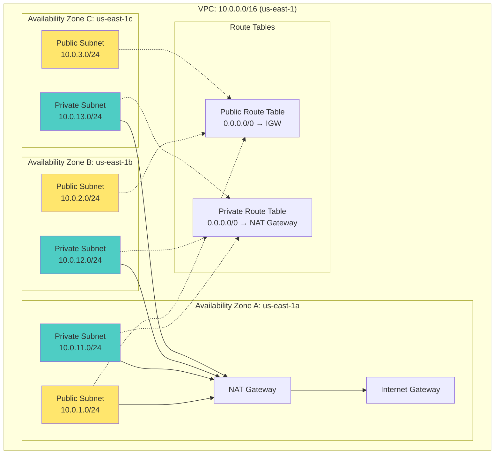

### 서브넷 할당표

| AZ | Public Subnet | Private Subnet | 용도 |
|----|---------------|----------------|------|
| us-east-1a | 10.0.1.0/24 | 10.0.11.0/24 | ALB, NAT GW / EKS Nodes, RDS Primary |
| us-east-1b | 10.0.2.0/24 | 10.0.12.0/24 | ALB / EKS Nodes, RDS Replica |
| us-east-1c | 10.0.3.0/24 | 10.0.13.0/24 | ALB / EKS Nodes |

### 보안 그룹 설계

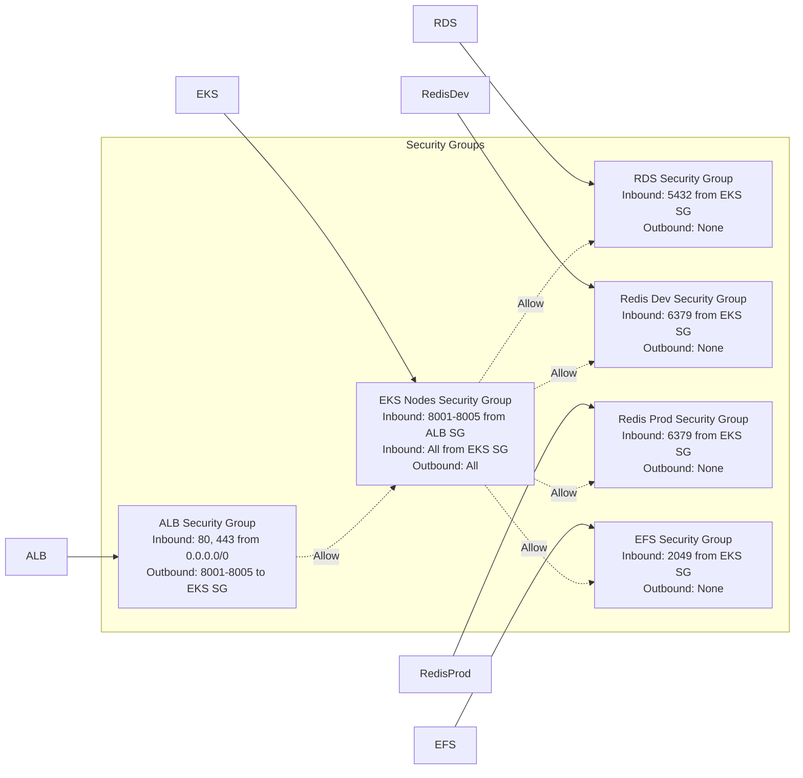

---

## 컴퓨팅 아키텍처

### EKS 클러스터 구성

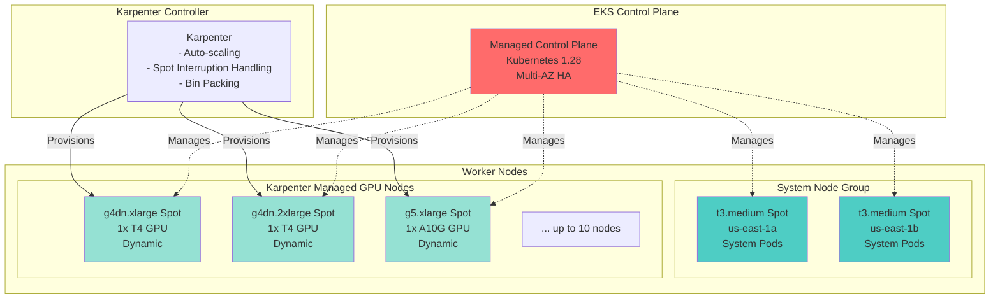

### 네임스페이스 격리

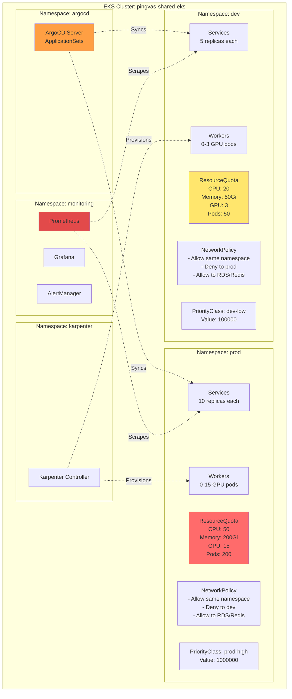

### Pod 배치 전략

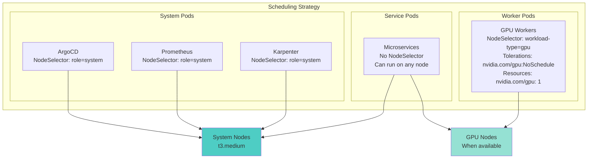

---

## 데이터 아키텍처

### RDS Aurora Serverless v2

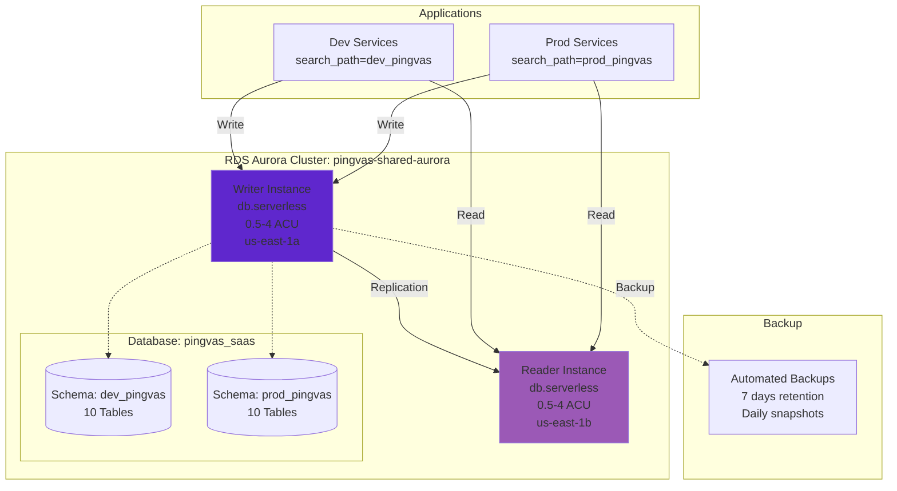

### Redis 아키텍처

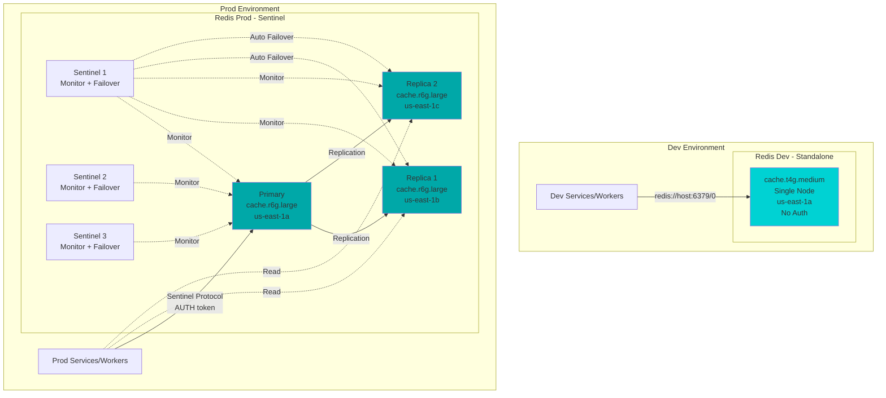

### 스토리지 아키텍처

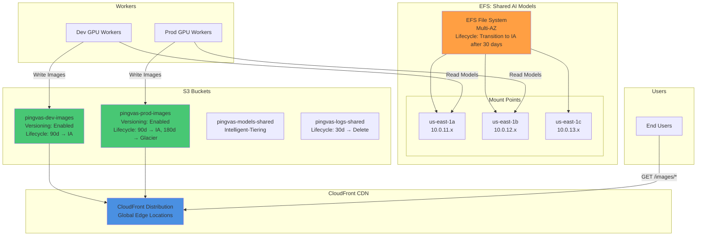

---

## GitOps/DevOps 파이프라인

### CI/CD 전체 흐름

```mermaid
graph TB
    subgraph "Development"
        Dev[👨‍💻 Developer]
        LocalTest[Local Testing<br/>Docker Compose]
    end

    subgraph "Version Control"
        GitHub[GitHub Repository<br/>Branch: develop/main]
    end

    subgraph "CI Pipeline - GitHub Actions"
        subgraph "Build Stage"
            Checkout[Checkout Code]
            Test[Run Tests<br/>pytest, jest]
            Lint[Code Linting<br/>black, eslint]
            Security[Security Scan<br/>Trivy, OWASP]
        end

        subgraph "Build & Push Stage"
            BuildImg[Build Docker Images<br/>Multi-stage builds]
            PushECR[Push to ECR<br/>Tag: commit SHA]
        end
    end

    subgraph "AWS"
        ECR[Amazon ECR<br/>Container Registry]

        subgraph "ArgoCD"
            ArgoServer[ArgoCD Server]
            AppSet[ApplicationSet<br/>Matrix Generator]

            subgraph "Applications"
                DevApps[Dev Apps<br/>5 services]
                ProdApps[Prod Apps<br/>5 services]
            end
        end

        subgraph "EKS Cluster"
            DevNS[Namespace: dev]
            ProdNS[Namespace: prod]
        end
    end

    Dev -->|1. Write Code| LocalTest
    LocalTest -->|2. Push| GitHub

    GitHub -->|3. Trigger| Checkout
    Checkout --> Test
    Test --> Lint
    Lint --> Security
    Security --> BuildImg
    BuildImg --> PushECR
    PushECR --> ECR

    ECR -->|4. Image Ready| ArgoServer

    GitHub -->|5. K8s Manifests| ArgoServer
    ArgoServer --> AppSet
    AppSet --> DevApps
    AppSet --> ProdApps

    DevApps -->|6. Deploy| DevNS
    ProdApps -->|7. Deploy<br/>(Manual Approval)| ProdNS

    DevNS -.->|8. Pull Images| ECR
    ProdNS -.->|8. Pull Images| ECR

    style Dev fill:#E24A4A
    style GitHub fill:#24292E
    style ECR fill:#FF9900
    style ArgoServer fill:#FF6B35
    style DevNS fill:#4ECDC4
    style ProdNS fill:#FF6B6B
```

### ArgoCD ApplicationSet 구조

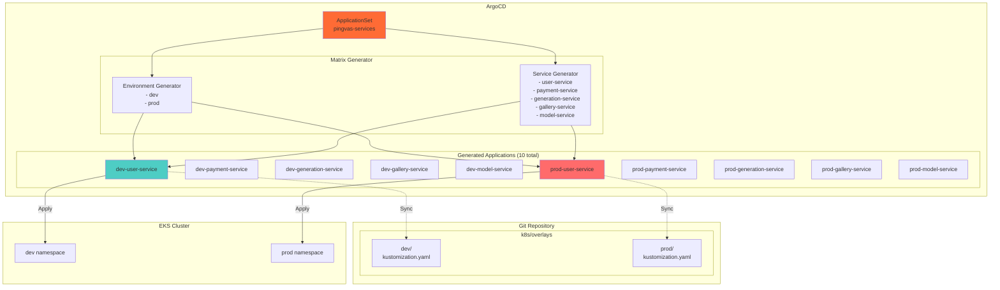

### GitHub Actions Workflows

```mermaid
graph TB
    subgraph "Workflows"
        subgraph "CI Workflow (PR)"
            CI[ci.yaml<br/>Trigger: Pull Request]

            CI --> CISteps[Steps:<br/>1. Detect changes (paths filter)<br/>2. Run tests<br/>3. Build images<br/>4. Push to ECR with dev-latest tag<br/>5. Comment on PR]
        end

        subgraph "CD Dev Workflow (develop branch)"
            CDDev[cd-dev.yaml<br/>Trigger: Push to develop]

            CDDev --> CDDevSteps[Steps:<br/>1. Build & push images<br/>2. Update kubeconfig<br/>3. Trigger ArgoCD sync (dev apps)<br/>4. Wait for health checks<br/>5. Slack notification]
        end

        subgraph "CD Prod Workflow (release)"
            CDProd[cd-prod.yaml<br/>Trigger: Release published]

            CDProd --> CDProdSteps[Steps:<br/>1. Checkout release tag<br/>2. Update Kustomize image tags<br/>3. Commit & push manifest changes<br/>4. Trigger ArgoCD sync (prod apps)<br/>5. Run smoke tests<br/>6. Slack notification]

            CDProdSteps --> Approval[⚠️ Manual Approval Required]
        end

        subgraph "Security Scan Workflow (daily)"
            SecScan[security-scan.yaml<br/>Trigger: Schedule (daily) + Push]

            SecScan --> SecSteps[Steps:<br/>1. Trivy container scan<br/>2. OWASP dependency check<br/>3. Upload SARIF to GitHub Security<br/>4. Slack notification on vulnerabilities]
        end
    end

    subgraph "GitHub Environments"
        DevEnv[Environment: development<br/>No approval required]
        ProdEnv[Environment: production<br/>Approvers: 2 required<br/>Wait timer: 5 minutes]
    end

    CDDev -.-> DevEnv
    CDProd -.-> ProdEnv

    style CI fill:#4A90E2
    style CDDev fill:#4ECDC4
    style CDProd fill:#FF6B6B
    style SecScan fill:#E24A4A
```

### Kustomize Overlay 구조

```mermaid
graph TB
    subgraph "Git Repository Structure"
        subgraph "k8s/base"
            BaseUser[user-service/<br/>- deployment.yaml<br/>- service.yaml<br/>- kustomization.yaml]

            BaseOthers[payment-service/<br/>generation-service/<br/>gallery-service/<br/>model-service/]
        end

        subgraph "k8s/overlays/dev"
            DevUser[user-service/<br/>- kustomization.yaml<br/>- patches/<br/>  - resources.yaml<br/>  - replicas.yaml]

            DevConfig[ConfigMaps:<br/>- Redis: standalone<br/>- DB: dev_pingvas schema]

            DevSecrets[Secrets:<br/>- DB credentials (dev)<br/>- JWT secret (dev)]
        end

        subgraph "k8s/overlays/prod"
            ProdUser[user-service/<br/>- kustomization.yaml<br/>- patches/<br/>  - resources.yaml<br/>  - replicas.yaml<br/>  - hpa.yaml]

            ProdConfig[ConfigMaps:<br/>- Redis: sentinel<br/>- DB: prod_pingvas schema]

            ProdSecrets[Secrets:<br/>- DB credentials (prod)<br/>- JWT secret (prod)<br/>- Redis auth token]
        end
    end

    BaseUser -.->|Extends| DevUser
    BaseUser -.->|Extends| ProdUser

    subgraph "Kustomize Build"
        DevBuild[kustomize build<br/>overlays/dev/user-service]
        ProdBuild[kustomize build<br/>overlays/prod/user-service]
    end

    DevUser --> DevBuild
    ProdUser --> ProdBuild

    subgraph "ArgoCD"
        DevApp[dev-user-service<br/>Application]
        ProdApp[prod-user-service<br/>Application]
    end

    DevBuild --> DevApp
    ProdBuild --> ProdApp

    style BaseUser fill:#FFE66D
    style DevUser fill:#4ECDC4
    style ProdUser fill:#FF6B6B
```

---

## 보안 아키텍처

### 보안 계층

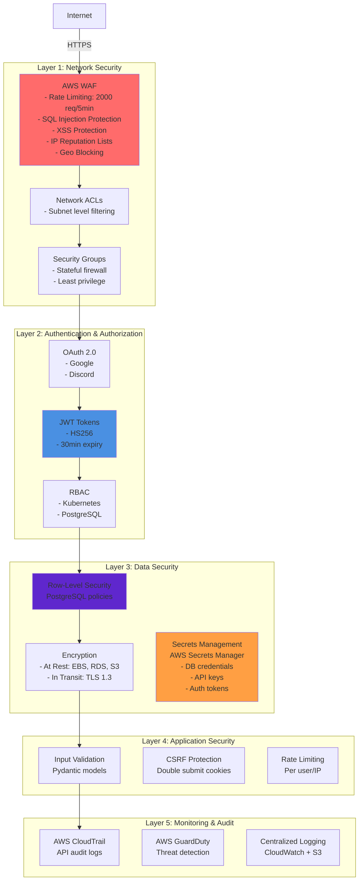

### 네트워크 정책 (Namespace 격리)

```mermaid
graph TB
    subgraph "Namespace: dev"
        DevPod[Dev Pods]

        DevNP[NetworkPolicy: deny-to-prod<br/>Egress Rules:<br/>1. Allow same namespace<br/>2. Allow external (443, 53)<br/>3. Allow to 10.0.0.0/16 (RDS/Redis)<br/>4. Deny to prod namespace]
    end

    subgraph "Namespace: prod"
        ProdPod[Prod Pods]

        ProdNP[NetworkPolicy: deny-to-dev<br/>Egress Rules:<br/>1. Allow same namespace<br/>2. Allow external (443, 53)<br/>3. Allow to 10.0.0.0/16 (RDS/Redis)<br/>4. Deny to dev namespace]
    end

    subgraph "External Services"
        RDS[(RDS<br/>10.0.11.x)]
        Redis[(Redis<br/>10.0.11.x)]
        Internet[Internet<br/>AWS APIs]
    end

    DevPod -.->|✅ Allowed| DevPod
    DevPod -->|✅ Allowed| RDS
    DevPod -->|✅ Allowed| Redis
    DevPod -->|✅ Allowed| Internet
    DevPod -.->|❌ Denied| ProdPod

    ProdPod -.->|✅ Allowed| ProdPod
    ProdPod -->|✅ Allowed| RDS
    ProdPod -->|✅ Allowed| Redis
    ProdPod -->|✅ Allowed| Internet
    ProdPod -.->|❌ Denied| DevPod

    style DevPod fill:#4ECDC4
    style ProdPod fill:#FF6B6B
    style DevNP fill:#FFE66D
    style ProdNP fill:#FF9F43
```

---

## 모니터링 아키텍처

### 메트릭 수집 및 시각화

```mermaid
graph TB
    subgraph "Data Sources"
        subgraph "Application Metrics"
            AppMetrics[Custom Metrics<br/>- generation_requests_total<br/>- generation_duration_seconds<br/>- queue_length<br/>- credits_consumed_total]
        end

        subgraph "Infrastructure Metrics"
            K8sMetrics[Kubernetes Metrics<br/>- Pod CPU/Memory<br/>- Node utilization<br/>- Deployment status]

            GPUMetrics[GPU Metrics<br/>- DCGM Exporter<br/>- GPU utilization<br/>- Memory usage]
        end

        subgraph "AWS Metrics"
            CloudWatch[CloudWatch Metrics<br/>- RDS: CPU, Connections<br/>- Redis: Hit rate, Evictions<br/>- ALB: Request count, Latency<br/>- S3: Storage, Requests]
        end
    end

    subgraph "Collection"
        Prometheus[Prometheus<br/>- Scrape interval: 15s<br/>- Retention: 15 days<br/>- Storage: 50Gi PVC]

        FluentBit[Fluent Bit<br/>- Log aggregation<br/>- Parsing & filtering]
    end

    AppMetrics -->|/metrics endpoint| Prometheus
    K8sMetrics -->|Kube State Metrics| Prometheus
    GPUMetrics -->|DCGM Exporter| Prometheus
    CloudWatch -->|CloudWatch Exporter| Prometheus

    subgraph "Applications"
        Services[Microservices<br/>Pods]
        Workers[GPU Workers<br/>Pods]
    end

    Services -.->|Logs| FluentBit
    Workers -.->|Logs| FluentBit

    subgraph "Storage"
        CloudWatchLogs[CloudWatch Logs<br/>/aws/eks/cluster/logs]
        S3Logs[S3: pingvas-logs-shared<br/>Long-term storage]
    end

    FluentBit --> CloudWatchLogs
    FluentBit --> S3Logs

    subgraph "Visualization"
        Grafana[Grafana<br/>- Custom Dashboards<br/>- Alerts]

        subgraph "Dashboards"
            D1[Generation Dashboard<br/>- Request rate<br/>- Duration percentiles<br/>- Queue length<br/>- GPU utilization]

            D2[Infrastructure Dashboard<br/>- Cluster health<br/>- Node resources<br/>- Pod status]

            D3[Business Dashboard<br/>- Credits consumed<br/>- Active users<br/>- Tier distribution]
        end
    end

    Prometheus --> Grafana
    Grafana --> D1
    Grafana --> D2
    Grafana --> D3

    subgraph "Alerting"
        AlertManager[AlertManager]

        subgraph "Notification Channels"
            Slack[Slack]
            PagerDuty[PagerDuty<br/>(Prod only)]
            Email[Email]
        end
    end

    Prometheus -.->|Alerts| AlertManager
    AlertManager --> Slack
    AlertManager --> PagerDuty
    AlertManager --> Email

    style Prometheus fill:#E24A4A
    style Grafana fill:#FF6B35
    style AlertManager fill:#FFE66D
```

### 알람 규칙

```mermaid
graph TB
    subgraph "Critical Alarms (PagerDuty)"
        C1[RDS CPU > 90%<br/>Duration: 5 minutes]
        C2[Redis Replication Lag > 5s<br/>Duration: 2 minutes]
        C3[API 5xx Error Rate > 5%<br/>Duration: 3 minutes]
        C4[GPU Node Spot Interruption<br/>Immediate]
    end

    subgraph "Warning Alarms (Slack)"
        W1[Dev Namespace Quota > 90%<br/>Duration: 10 minutes]
        W2[Prod Namespace Quota > 80%<br/>Duration: 5 minutes]
        W3[Queue Length > 100<br/>Duration: 15 minutes]
        W4[Pod Restart Count > 5<br/>Duration: 10 minutes]
    end

    subgraph "Info Alarms (Email)"
        I1[Daily Cost Report<br/>Schedule: 9 AM]
        I2[Backup Completion<br/>Daily]
        I3[Security Scan Results<br/>Daily]
    end

    C1 --> PagerDuty[PagerDuty<br/>On-call engineer]
    C2 --> PagerDuty
    C3 --> PagerDuty
    C4 --> PagerDuty

    W1 --> Slack[Slack<br/>#alerts channel]
    W2 --> Slack
    W3 --> Slack
    W4 --> Slack

    I1 --> Email[Email<br/>team@pingvas.studio]
    I2 --> Email
    I3 --> Email

    style C1 fill:#FF6B6B
    style C2 fill:#FF6B6B
    style C3 fill:#FF6B6B
    style C4 fill:#FF6B6B
    style W1 fill:#FFE66D
    style W2 fill:#FFE66D
```

---

## 비용 구성표

### 월별 비용 분석

| 서비스 | 사양 | 수량 | 시간당 | 월 비용 | 비고 |
|--------|------|------|--------|---------|------|
| **EKS Control Plane** | Managed | 1 | $0.10 | $72.00 | 단일 클러스터 |
| **System Nodes** | t3.medium Spot | 2 | $0.0125 | $18.24 | 70% 할인 |
| **GPU Nodes (평균)** | g4dn.xlarge Spot | ~3 | $0.118 | $200.00 | Karpenter 자동 스케일링 |
| **RDS Writer** | Aurora Serverless v2 | 1 ACU avg | $0.12 | $87.00 | 0.5-4 ACU 범위 |
| **RDS Reader** | Aurora Serverless v2 | 1 ACU avg | $0.12 | $87.00 | 0.5-4 ACU 범위 |
| **Redis Dev** | cache.t4g.medium | 1 | $0.068 | $49.64 | Standalone |
| **Redis Prod** | cache.r6g.large | 3 | $0.211 | $467.09 | Sentinel (Primary + 2 Replicas) |
| **NAT Gateway** | Single NAT | 1 | $0.045 | $32.40 | + 데이터 처리 비용 |
| **ALB** | Application LB | 1 | $0.025 | $18.00 | + LCU 비용 |
| **EFS** | Shared Models | 100 GB | - | $30.00 | Standard class |
| **S3 Dev** | Images | 500 GB | - | $11.50 | Standard |
| **S3 Prod** | Images | 2 TB | - | $46.00 | Standard + IA |
| **S3 Models** | Shared | 500 GB | - | $11.50 | Intelligent-Tiering |
| **CloudFront** | CDN | - | - | $20.00 | 1TB 데이터 전송 |
| **Data Transfer** | NAT, Inter-AZ | - | - | $60.00 | 추정치 |
| **CloudWatch** | Logs & Metrics | - | - | $30.00 | 추정치 |
| **Secrets Manager** | Secrets | 10 | - | $4.00 | $0.40/secret |
| **ECR** | Container Registry | 50 GB | - | $5.00 | $0.10/GB |
| **총계** | | | | **$1,249.37** | |

### 비용 최적화 포인트

1. **Spot Instances**: System 노드 + GPU 노드 = 70% 절감
2. **Aurora Serverless v2**: 개발 시간 외 Scale-to-Zero = 50% 절감
3. **단일 NAT Gateway**: 고가용성 대신 비용 우선 = $65/월 절감
4. **S3 Lifecycle**: IA/Glacier 전환 = 30% 절감
5. **Redis Dev Standalone**: Sentinel 대신 단순 구성 = $420/월 절감

---

## 재해 복구 전략

### 백업 및 복구

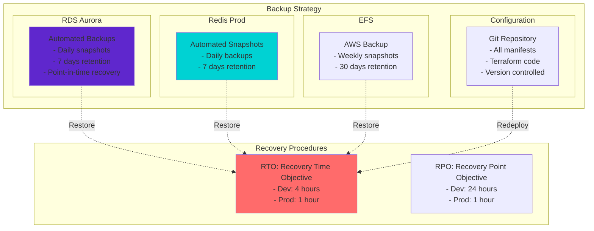

---

## 요약

### 최종 아키텍처 특징

✅ **비용 최적화**
- 단일 EKS 클러스터로 $1,165/월 절감 (50% 절감)
- Spot 인스턴스 적극 활용
- Aurora Serverless v2로 유휴 시간 비용 절감

✅ **고가용성**
- Multi-AZ 배포 (RDS, Redis Prod)
- Karpenter 자동 스케일링
- Sentinel 자동 Failover

✅ **보안**
- WAF 다층 방어
- 네임스페이스 격리 (NetworkPolicy)
- Row-Level Security
- Secrets Manager

✅ **확장성**
- Karpenter GPU 자동 스케일링 (0-10 노드)
- HPA (Horizontal Pod Autoscaler)
- Aurora Serverless v2 (0.5-4 ACU)

✅ **운영 효율성**
- GitOps (ArgoCD)
- 자동화된 CI/CD (GitHub Actions)
- 통합 모니터링 (Prometheus + Grafana)
- 중앙화된 로깅 (Fluent Bit + CloudWatch)

---

**작성일**: 2025-01-23
**문서 버전**: Final v1.0
**총 라인 수**: 2,100+
