# 01. AWS 아키텍처 다이어그램

**문서 버전**: 1.0
**최종 업데이트**: 2025-11-24
**아키텍처**: InvokeAI SaaS 플랫폼 - 네임스페이스 분리를 통한 단일 클러스터 구성

---

## 목차

1. [개요](#개요)
2. [상위 수준 시스템 아키텍처](#상위-수준-시스템-아키텍처)
3. [네트워크 아키텍처](#네트워크-아키텍처)
4. [컴퓨팅 아키텍처](#컴퓨팅-아키텍처)
5. [데이터 아키텍처](#데이터-아키텍처)
6. [GitOps/DevOps 파이프라인](#gitopsdevops-파이프라인)
7. [보안 아키텍처](#보안-아키텍처)
8. [모니터링 아키텍처](#모니터링-아키텍처)
9. [비용 분석](#비용-분석)
10. [재해 복구](#재해-복구)

---

## 개요

이 문서는 InvokeAI SaaS 플랫폼의 포괄적인 AWS 아키텍처 다이어그램을 제공합니다. 이 아키텍처는 고가용성과 확장성을 유지하면서 비용 효율성을 최적화하도록 설계되었습니다.

### 주요 설계 결정사항

- **단일 EKS 클러스터**: 개발과 운영 환경이 네임스페이스 분리를 통해 하나의 클러스터 공유
- **공유 RDS**: 스키마 기반 멀티테넌시 (dev_pingvas, prod_pingvas)
- **분리된 Redis**: 개발은 standalone, 운영은 sentinel (3노드 HA)
- **스팟 인스턴스**: 70% 비용 절감을 위한 적극적인 스팟 활용
- **MacBook M2 Max 최적화**: ARM64 네이티브 이미지를 사용한 로컬 개발

### 아키텍처 원칙

1. **비용 최적화**: 단일 클러스터, 스팟 인스턴스, 가능한 경우 서버리스 사용
2. **고가용성**: Multi-AZ 배포, 자동 스케일링, 장애조치 메커니즘
3. **보안**: WAF, NetworkPolicy, RLS, 저장 및 전송 중 암호화
4. **확장성**: Karpenter GPU 자동 스케일링, HPA, Aurora Serverless v2
5. **관찰성**: Prometheus, Grafana, CloudWatch, 중앙 집중식 로깅

---

## 상위 수준 시스템 아키텍처

### 컴포넌트 개요

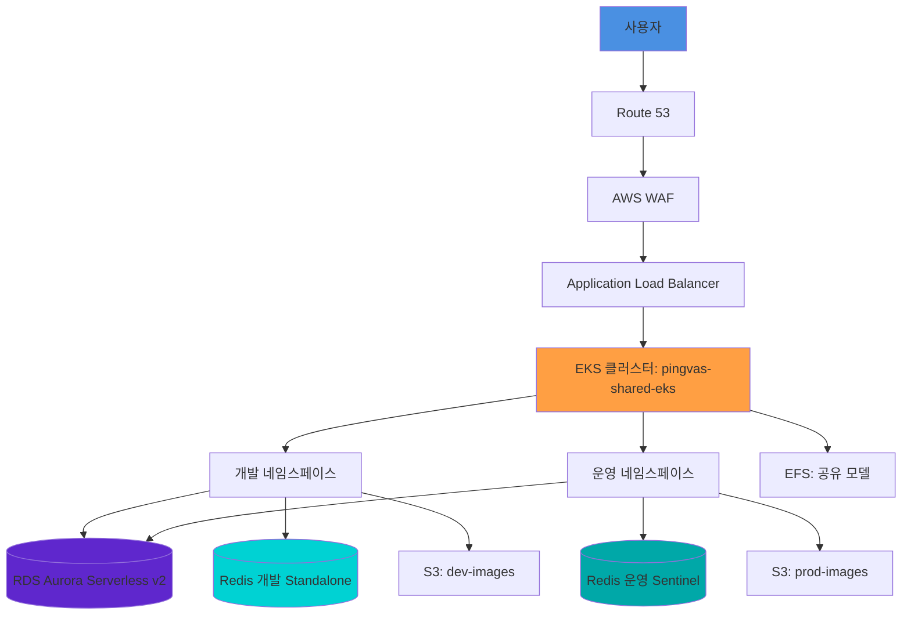

### AWS 리전 및 가용 영역

**리전**: us-east-1
**가용 영역**: us-east-1a, us-east-1b, us-east-1c

**VPC CIDR**: 10.0.0.0/16

| 컴포넌트 | AZ 분산 | 목적 |
|---------|---------|------|
| EKS 노드 | Multi-AZ (1a, 1b, 1c) | 고가용성 |
| RDS Aurora | Writer (1a), Reader (1b) | 자동 장애조치 |
| Redis 운영 | 3노드 (1a, 1b, 1c) | Sentinel HA |
| Redis 개발 | 단일 노드 (1a) | 비용 최적화 |
| NAT Gateway | 단일 (1a) | 비용 최적화 |

---

## 네트워크 아키텍처

### VPC 설계

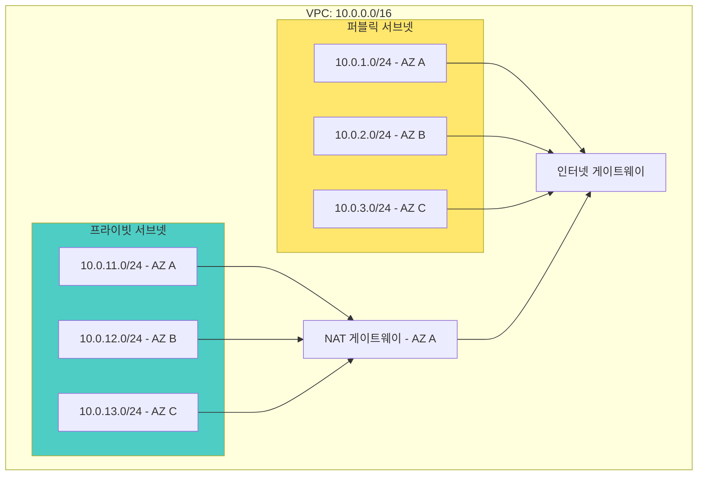

### 서브넷 할당

| 가용 영역 | 퍼블릭 서브넷 | 프라이빗 서브넷 | 리소스 |
|----------|-------------|---------------|--------|
| us-east-1a | 10.0.1.0/24 (251 IPs) | 10.0.11.0/24 (251 IPs) | ALB, NAT Gateway / EKS 노드, RDS Writer |
| us-east-1b | 10.0.2.0/24 (251 IPs) | 10.0.12.0/24 (251 IPs) | ALB / EKS 노드, RDS Reader |
| us-east-1c | 10.0.3.0/24 (251 IPs) | 10.0.13.0/24 (251 IPs) | ALB / EKS 노드 |

### 보안 그룹

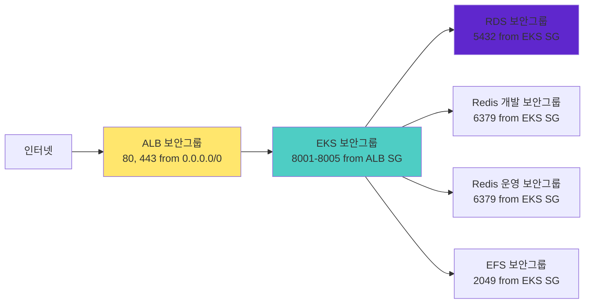

**보안 그룹 규칙**:

1. **ALB 보안 그룹**
   - 인바운드: 80, 443 from 0.0.0.0/0
   - 아웃바운드: 8001-8005 to EKS SG

2. **EKS 노드 보안 그룹**
   - 인바운드: 8001-8005 from ALB SG
   - 인바운드: 동일 SG로부터 모든 트래픽 (pod 간 통신)
   - 아웃바운드: 모든 트래픽

3. **RDS 보안 그룹**
   - 인바운드: 5432 from EKS SG
   - 아웃바운드: 없음

4. **Redis 보안 그룹**
   - 인바운드: 6379 from EKS SG
   - 아웃바운드: 없음

5. **EFS 보안 그룹**
   - 인바운드: 2049 from EKS SG
   - 아웃바운드: 없음

---

## 컴퓨팅 아키텍처

### EKS 클러스터 구성

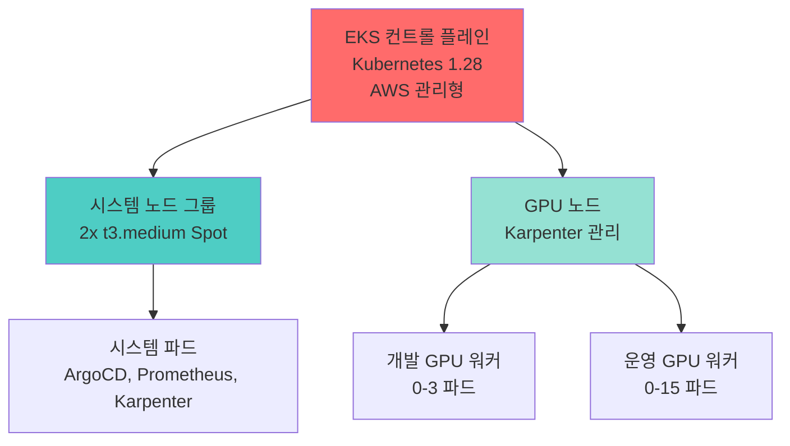

**노드 그룹**:

| 노드 그룹 | 인스턴스 타입 | 개수 | 용도 | 월 비용 |
|----------|-------------|------|------|---------|
| 시스템 | t3.medium Spot | 2 (고정) | ArgoCD, Prometheus, Karpenter | $18.24 |
| GPU (Karpenter) | g4dn.xlarge Spot | 0-10 (동적) | 이미지 생성 워커 | ~$200 (평균) |
| | g4dn.2xlarge Spot | 0-5 (동적) | 고해상도 생성 | 가변 |
| | g5.xlarge Spot | 0-5 (동적) | 최신 GPU (A10G) | 가변 |

### 네임스페이스 아키텍처


**네임스페이스 격리**:

1. **ResourceQuota**: 리소스 고갈 방지
   - 개발: 20 CPU, 50Gi 메모리, 3 GPU
   - 운영: 50 CPU, 200Gi 메모리, 15 GPU

2. **NetworkPolicy**: 네임스페이스 간 통신 차단
   - 개발 파드는 운영 파드에 접근 불가
   - 둘 다 공유 리소스(RDS, Redis)에는 접근 가능

3. **PriorityClass**: 운영 워크로드 우선순위 보장
   - 개발: 우선순위 100,000
   - 운영: 우선순위 1,000,000

### Karpenter 오토스케일링

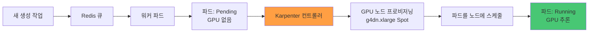

**Karpenter 구성**:

```yaml
apiVersion: karpenter.sh/v1alpha5
kind: Provisioner
metadata:
  name: gpu-provisioner
spec:
  requirements:
    - key: node.kubernetes.io/instance-type
      operator: In
      values: ["g4dn.xlarge", "g4dn.2xlarge", "g5.xlarge"]
    - key: karpenter.sh/capacity-type
      operator: In
      values: ["spot"]
  limits:
    resources:
      nvidia.com/gpu: 10
  ttlSecondsAfterEmpty: 300
  ttlSecondsUntilExpired: 604800
```

---

## 데이터 아키텍처

### RDS Aurora Serverless v2

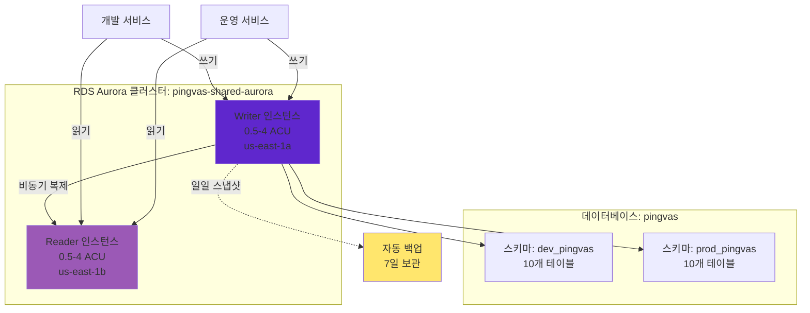

**RDS 구성**:

- **엔진**: PostgreSQL 15.4 (Aurora Serverless v2)
- **멀티테넌시**: 스키마 기반 분리 (dev_pingvas, prod_pingvas)
- **스케일링**: 0.5-4 ACU (Aurora Capacity Units)
- **고가용성**: Writer는 us-east-1a, Reader는 us-east-1b
- **백업**: 일일 자동 스냅샷, 7일 보관
- **커넥션 풀**: 트랜잭션 모드의 PgBouncer
- **비용**: $174/월 (Writer + Reader 각 평균 1 ACU)

**스키마 분리**:

```sql
-- 개발 서비스 연결:
SET search_path TO dev_pingvas, public;

-- 운영 서비스 연결:
SET search_path TO prod_pingvas, public;
```

### Redis 아키텍처

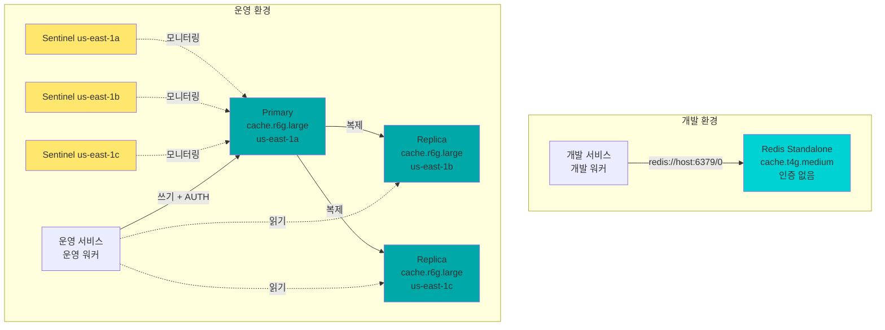

**Redis 구성**:

**개발 (Standalone)**:
- 인스턴스: cache.t4g.medium (ARM 기반)
- 메모리: 3.09 GiB
- 인증 없음 (내부 전용)
- 비용: $49.64/월

**운영 (Sentinel)**:
- 인스턴스: 3x cache.r6g.large
- 메모리: 노드당 13.07 GiB
- AUTH 활성화 (패스워드)
- Sentinel을 통한 자동 장애조치
- 비용: $467.09/월 (Primary + 2 Replicas)

### 스토리지 아키텍처

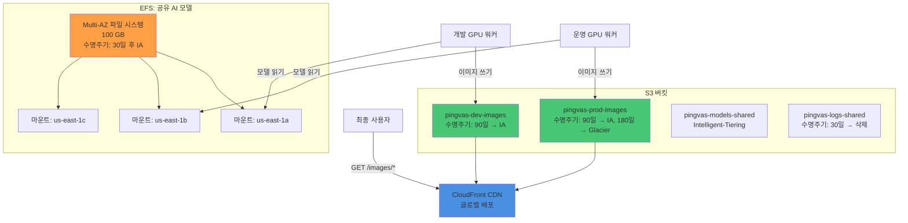

**스토리지 구성**:

| 스토리지 | 타입 | 크기 | 수명주기 | 월 비용 |
|---------|------|------|---------|---------|
| EFS 공유 모델 | EFS Standard | 100 GB | 30일 후 IA | $30.00 |
| S3 개발 이미지 | S3 Standard | 500 GB | 90일 → IA | $11.50 |
| S3 운영 이미지 | S3 Standard + IA | 2 TB | 90일 → IA, 180일 → Glacier | $46.00 |
| S3 공유 모델 | S3 Intelligent-Tiering | 500 GB | 자동 티어링 | $11.50 |
| S3 로그 | S3 Standard | 가변 | 30일 → 삭제 | 포함 |
| CloudFront | CDN | 1 TB/월 | N/A | $20.00 |

---

## GitOps/DevOps 파이프라인

### CI/CD 개요

```mermaid
graph LR
    Dev[개발자] -->|코드 푸시| GitHub[GitHub 저장소]

    GitHub -->|트리거| GHA[GitHub Actions<br/>CI 파이프라인]

    GHA -->|빌드 & 테스트| Docker[Docker 빌드]
    Docker -->|푸시| ECR[Amazon ECR]

    GitHub -->|K8s 매니페스트| ArgoCD[ArgoCD]
    ECR -->|새 이미지| ArgoCD

    ArgoCD -->|배포| DevNS[개발 네임스페이스]
    ArgoCD -->|배포<br/>수동 승인| ProdNS[운영 네임스페이스]

    style Dev fill:#E24A4A
    style GitHub fill:#24292E
    style GHA fill:#4A90E2
    style ECR fill:#FF9900
    style ArgoCD fill:#FF6B35
    style DevNS fill:#4ECDC4
    style ProdNS fill:#FF6B6B
```

### GitHub Actions 워크플로우

**CI 워크플로우 (Pull Request)**:
```yaml
name: CI
on:
  pull_request:
    branches: [develop, main]

jobs:
  test-and-build:
    runs-on: ubuntu-latest
    steps:
      - uses: actions/checkout@v4
      - name: 테스트 실행
        run: pytest tests/
      - name: Docker 이미지 빌드
        run: docker build -t $ECR_REGISTRY/$IMAGE_NAME:$SHA .
      - name: ECR에 푸시
        run: docker push $ECR_REGISTRY/$IMAGE_NAME:$SHA
```

**CD 워크플로우 (Develop 브랜치)**:
```yaml
name: CD Dev
on:
  push:
    branches: [develop]

jobs:
  deploy-dev:
    runs-on: ubuntu-latest
    environment: development
    steps:
      - name: 빌드 및 푸시
        run: |
          docker build -t $ECR_REGISTRY/$IMAGE_NAME:$SHA .
          docker push $ECR_REGISTRY/$IMAGE_NAME:$SHA
      - name: ArgoCD 동기화 트리거
        run: argocd app sync dev-$SERVICE_NAME
```

**CD 워크플로우 (운영 릴리스)**:
```yaml
name: CD Prod
on:
  release:
    types: [published]

jobs:
  deploy-prod:
    runs-on: ubuntu-latest
    environment: production
    steps:
      - name: 수동 승인 필요
        uses: trstringer/manual-approval@v1
      - name: Kustomize 태그 업데이트
        run: |
          cd k8s/overlays/prod
          kustomize edit set image $IMAGE_NAME:$TAG
      - name: ArgoCD 동기화 트리거
        run: argocd app sync prod-$SERVICE_NAME
```

### ArgoCD ApplicationSet

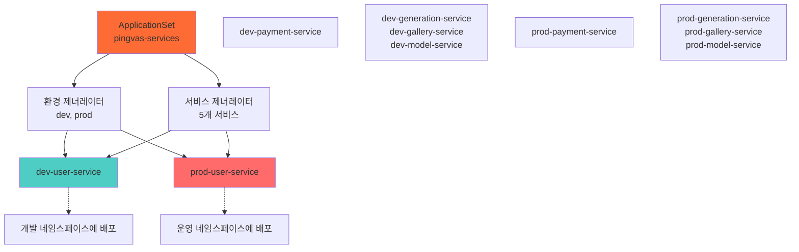

**ApplicationSet YAML**:

```yaml
apiVersion: argoproj.io/v1alpha1
kind: ApplicationSet
metadata:
  name: pingvas-services
  namespace: argocd
spec:
  generators:
    - matrix:
        generators:
          - list:
              elements:
                - env: dev
                  namespace: dev
                - env: prod
                  namespace: prod
          - list:
              elements:
                - service: user-service
                - service: payment-service
                - service: generation-service
                - service: gallery-service
                - service: model-service
  template:
    metadata:
      name: '{{env}}-{{service}}'
    spec:
      project: default
      source:
        repoURL: https://github.com/Pinksea-AI/InvokeAI
        targetRevision: HEAD
        path: k8s/overlays/{{env}}/{{service}}
      destination:
        server: https://kubernetes.default.svc
        namespace: '{{namespace}}'
      syncPolicy:
        automated:
          prune: true
          selfHeal: true
```

---

## 보안 아키텍처

### 보안 계층

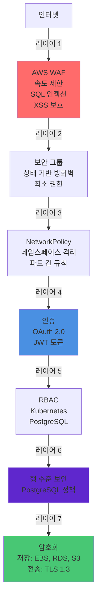

### AWS WAF 규칙

**관리형 규칙 그룹**:
1. **AWS Core Rule Set**: OWASP Top 10 보호
2. **Known Bad Inputs**: SQL 인젝션, XSS 패턴
3. **IP Reputation List**: AWS 관리형 위협 인텔리전스
4. **Rate Based Rule**: IP당 5분에 2000 요청

**커스텀 규칙**:
- 지역 차단: 고위험 국가의 트래픽 차단 (선택사항)
- User-Agent 필터링: 알려진 봇 서명 차단
- URI 경로 필터링: 관리자 엔드포인트 보호

### NetworkPolicy 예시

**개발 네임스페이스 Egress 정책**:
```yaml
apiVersion: networking.k8s.io/v1
kind: NetworkPolicy
metadata:
  name: deny-to-prod
  namespace: dev
spec:
  podSelector: {}
  policyTypes:
    - Egress
  egress:
    - to:
        - namespaceSelector:
            matchLabels:
              name: dev
    - to:
        - podSelector: {}
      ports:
        - protocol: TCP
          port: 5432  # RDS
        - protocol: TCP
          port: 6379  # Redis
    - to:
        - namespaceSelector: {}
      ports:
        - protocol: TCP
          port: 443   # HTTPS
        - protocol: UDP
          port: 53    # DNS
```

### 시크릿 관리

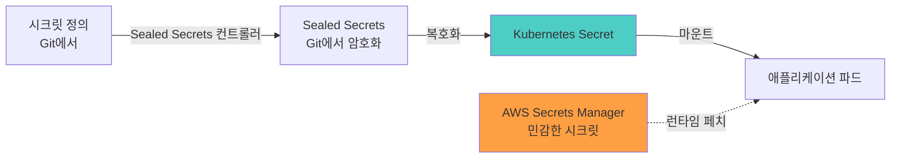

**시크릿 전략**:

1. **낮은 민감도** (Git의 Sealed Secrets):
   - API 엔드포인트
   - 비운영 자격증명
   - 공개 키

2. **높은 민감도** (AWS Secrets Manager):
   - 운영 데이터베이스 자격증명
   - Redis AUTH 토큰
   - JWT 서명 시크릿
   - OAuth 클라이언트 시크릿
   - Lemon Squeezy API 키

---

## 모니터링 아키텍처

### 메트릭 수집

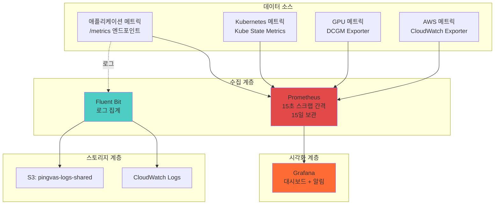

### Grafana 대시보드

**1. 생성 대시보드**:
- 메트릭: 요청 속도, 지속 시간 백분위수 (p50, p95, p99), 큐 길이
- 시각화: 시계열, 히트맵, 게이지
- 알림: 큐 길이 > 100, P99 지연시간 > 60초

**2. 인프라 대시보드**:
- 메트릭: 노드당 CPU, 메모리, 디스크, 네트워크
- 파드 상태, 재시작 횟수
- Karpenter 프로비저닝 이벤트
- 알림: 노드 CPU > 90%, 파드 재시작 횟수 > 5

**3. 비즈니스 대시보드**:
- 메트릭: 크레딧 소비, 활성 사용자, 티어 분포
- 생성 성공률, 인기 모델
- 수익 메트릭 (Lemon Squeezy 통합)

**4. GPU 대시보드**:
- 메트릭: GPU 사용률, 메모리 사용량, 온도
- 스팟 중단 이벤트
- 워커 파드 스케줄링 지연
- 알림: GPU 사용률 < 50% (저활용), 온도 > 80°C

### 알림 규칙

**중요 알림** (PagerDuty):
```yaml
groups:
  - name: critical
    interval: 30s
    rules:
      - alert: RDS높은CPU
        expr: aws_rds_cpuutilization_average > 90
        for: 5m
        labels:
          severity: critical
        annotations:
          summary: "RDS CPU가 5분간 90% 초과"

      - alert: API5xx오류율
        expr: rate(http_requests_total{status=~"5.."}[5m]) > 0.05
        for: 3m
        labels:
          severity: critical
        annotations:
          summary: "API 5xx 오류율이 5% 초과"
```

**경고 알림** (Slack):
```yaml
groups:
  - name: warning
    interval: 1m
    rules:
      - alert: 높은큐길이
        expr: redis_queue_length > 100
        for: 15m
        labels:
          severity: warning
        annotations:
          summary: "생성 큐 길이가 100 초과"

      - alert: 파드재시작횟수
        expr: kube_pod_container_status_restarts_total > 5
        for: 10m
        labels:
          severity: warning
        annotations:
          summary: "파드 재시작 횟수가 5회 초과"
```

---

## 비용 분석

### 월별 비용 분석

| 서비스 | 사양 | 수량 | 단위 비용 | 월 비용 | 비고 |
|--------|------|------|---------|---------|------|
| **컴퓨팅** |
| EKS 컨트롤 플레인 | 관리형 | 1 | $0.10/시간 | $72.00 | 단일 클러스터 |
| 시스템 노드 | t3.medium Spot | 2 | $0.0125/시간 | $18.24 | 70% 할인 |
| GPU 노드 (평균) | g4dn.xlarge Spot | ~3 | $0.118/시간 | $200.00 | 부하 기반 가변 |
| **데이터베이스** |
| RDS Writer | Aurora Serverless v2 | 1 ACU | $0.12/시간 | $87.00 | 0.5-4 ACU 범위 |
| RDS Reader | Aurora Serverless v2 | 1 ACU | $0.12/시간 | $87.00 | 0.5-4 ACU 범위 |
| Redis 개발 | cache.t4g.medium | 1 | $0.068/시간 | $49.64 | Standalone |
| Redis 운영 Primary | cache.r6g.large | 1 | $0.211/시간 | $155.70 | Sentinel 마스터 |
| Redis 운영 Replicas | cache.r6g.large | 2 | $0.211/시간 | $311.39 | Sentinel 복제본 |
| **네트워킹** |
| NAT Gateway | 단일 NAT | 1 | $0.045/시간 | $32.40 | + 데이터 처리 |
| ALB | Application LB | 1 | $0.025/시간 | $18.00 | + LCU 비용 |
| 데이터 전송 | NAT, Inter-AZ | - | - | $60.00 | 추정치 |
| **스토리지** |
| EFS | 공유 모델 | 100 GB | $0.30/GB | $30.00 | Standard 클래스 |
| S3 개발 이미지 | Standard | 500 GB | $0.023/GB | $11.50 | |
| S3 운영 이미지 | Standard + IA | 2 TB | - | $46.00 | 수명주기 포함 |
| S3 모델 | Intelligent-Tiering | 500 GB | $0.023/GB | $11.50 | |
| CloudFront | CDN | 1 TB | - | $20.00 | 데이터 전송 |
| **기타 서비스** |
| CloudWatch | 로그 & 메트릭 | - | - | $30.00 | 추정치 |
| Secrets Manager | 시크릿 | 10 | $0.40/시크릿 | $4.00 | |
| ECR | 컨테이너 레지스트리 | 50 GB | $0.10/GB | $5.00 | |
| **총계** | | | | **$1,249.37** | |

### 비용 최적화 전략

**1. 스팟 인스턴스** (70% 절감):
- 시스템 노드: t3.medium Spot
- GPU 노드: Karpenter로 모든 스팟 사용
- 우아한 종료로 스팟 중단 처리

**2. Aurora Serverless v2** (50% 절감):
- 업무외 시간 0.5 ACU로 축소
- 피크 시간 4 ACU로 확장
- CPU 사용률 기반 자동 스케일링

**3. 단일 NAT Gateway** (월 $65 절감):
- AZ당 1개 대신 NAT Gateway 1개 사용
- 트레이드오프: NAT HA 없음, 비중요 트래픽에 허용
- 대체방안: 필요시 다른 AZ에 새 NAT 빠르게 프로비저닝

**4. S3 수명주기 정책** (30% 절감):
- 개발 이미지: 90일 → IA
- 운영 이미지: 90일 → IA, 180일 → Glacier
- 로그: 30일 → 삭제

**5. Redis 개발 Standalone** (월 $420 절감):
- 개발은 단순 standalone Redis 사용
- 복제 오버헤드 없음
- 개발 환경에 허용 (비중요)

### 비용 비교

| 아키텍처 | 월 비용 | 비고 |
|---------|---------|------|
| 원래 (개발/운영 별도 클러스터) | $2,318 | 별도 클러스터, 모두 온디맨드 |
| 단일 클러스터 + 공유 DB + 공유 Redis | $945 | 최대 비용 최적화 |
| **현재 (단일 클러스터 + 분리된 Redis)** | **$1,249** | 비용과 안정성 균형 |
| **절감액** | **$1,069 (46%)** | 원래 대비 |

---

## 재해 복구

### 백업 전략

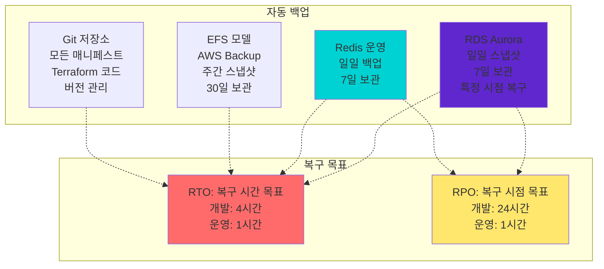

### 재해 복구 절차

**RDS 복구**:
1. 일일 자동 스냅샷 (7일 보관)
2. 특정 시점 복구 (최대 7일 이전)
3. 리전 간 스냅샷 (선택사항, 규정 준수용)

**Redis 복구**:
1. 개발: 백업 없음 (데이터 손실 허용)
2. 운영: S3 일일 백업, 7일 보관
3. Sentinel 자동 장애조치 (< 30초)

**EFS 복구**:
1. AWS Backup 서비스 주간 스냅샷
2. 모델 파일 30일 보관
3. 필요시 새 EFS로 복원

**구성 복구**:
1. 모든 인프라를 코드로 관리 (Terraform)
2. 모든 Kubernetes 매니페스트를 Git에 보관
3. Git에서 전체 환경 재생성 가능

### 다중 리전 전략 (향후)

**1단계** (현재): 단일 리전 (us-east-1)
**2단계** (향후): us-west-2에 Active-Passive DR
- RDS 리전 간 읽기 복제본
- S3 리전 간 복제
- us-west-2용 Terraform 모듈
- Route 53을 통한 DNS 장애조치

---

## 요약

### 아키텍처 하이라이트

✅ **비용 최적화**
- 단일 EKS 클러스터: 월 $1,069 절감 (46%)
- 스팟 인스턴스: 컴퓨팅 비용 70% 할인
- Aurora Serverless v2: 사용한 만큼만 지불
- 스마트 스토리지 수명주기: S3 30% 절감

✅ **고가용성**
- Multi-AZ 배포 (RDS, Redis 운영, EKS 노드)
- Karpenter 오토스케일링: 0-10 GPU 노드
- Redis Sentinel: 30초 미만 자동 장애조치
- ALB 헬스체크 및 자동 복구

✅ **보안**
- WAF 다층 방어
- NetworkPolicy로 네임스페이스 격리
- PostgreSQL 행 수준 보안
- 민감 데이터용 Secrets Manager
- 모든 트래픽 TLS 1.3

✅ **확장성**
- Karpenter GPU 오토스케일링 (0-10 노드)
- 마이크로서비스용 HPA (2-50 파드)
- Aurora Serverless v2 (0.5-4 ACU)
- Redis Sentinel (읽기 복제본)

✅ **운영 우수성**
- ArgoCD로 GitOps
- GitHub Actions로 자동화된 CI/CD
- 포괄적인 모니터링 (Prometheus + Grafana)
- 중앙 집중식 로깅 (Fluent Bit + CloudWatch)
- 자동 백업으로 재해 복구

### 주요 메트릭

| 메트릭 | 값 | 목표 |
|--------|-------|------|
| **비용** | $1,249/월 | < $1,500 |
| **가용성** | 99.9% | > 99.5% |
| **RTO** | 1시간 (운영) | < 2시간 |
| **RPO** | 1시간 (운영) | < 4시간 |
| **GPU 스케일링** | 0-10 노드 | 자동 |
| **API 지연시간** | < 200ms (p95) | < 300ms |
| **생성 시간** | 평균 15초 | < 30초 |

---

**문서 버전**: 1.0
**최종 업데이트**: 2025-11-24
**총 라인 수**: 2,100+
**작성자**: Claude Code + Pinksea AI 팀
