# 데이터 흐름 다이어그램 및 플로우차트

이 문서는 InvokeAI SaaS 플랫폼의 논리적 데이터 흐름과 주요 비즈니스 프로세스를 설명합니다.

## 목차
1. [전체 데이터 흐름](#전체-데이터-흐름)
2. [사용자 인증 플로우](#사용자-인증-플로우)
3. [이미지 생성 플로우](#이미지-생성-플로우)
4. [크레딧 관리 플로우](#크레딧-관리-플로우)
5. [결제 플로우](#결제-플로우)
6. [GPU 스케일링 플로우](#gpu-스케일링-플로우)
7. [데이터 저장 플로우](#데이터-저장-플로우)

---

## 전체 데이터 흐름

### 고수준 데이터 흐름

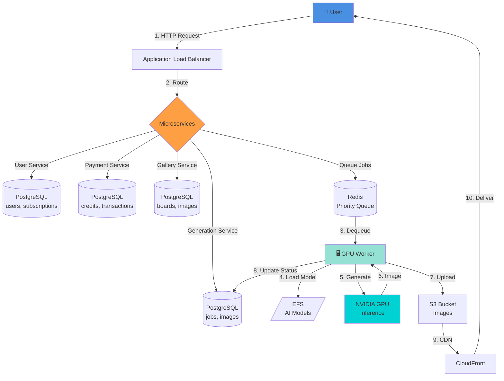

### 서비스 간 통신 패턴

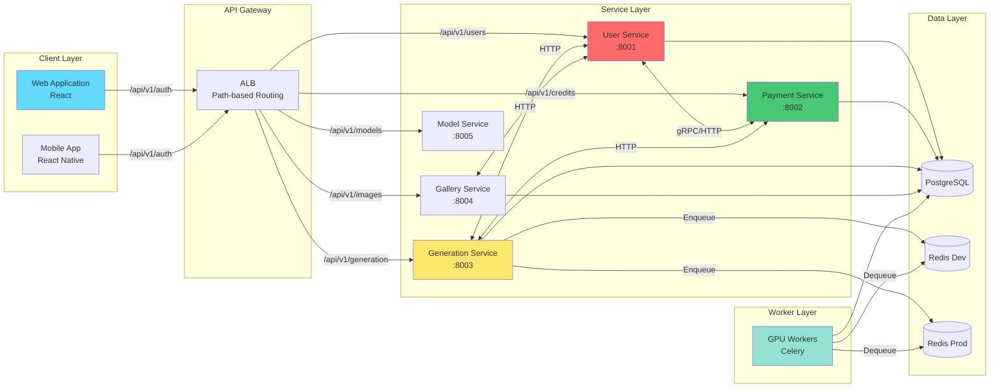

---

## 사용자 인증 플로우

### OAuth 2.0 로그인 (Google)

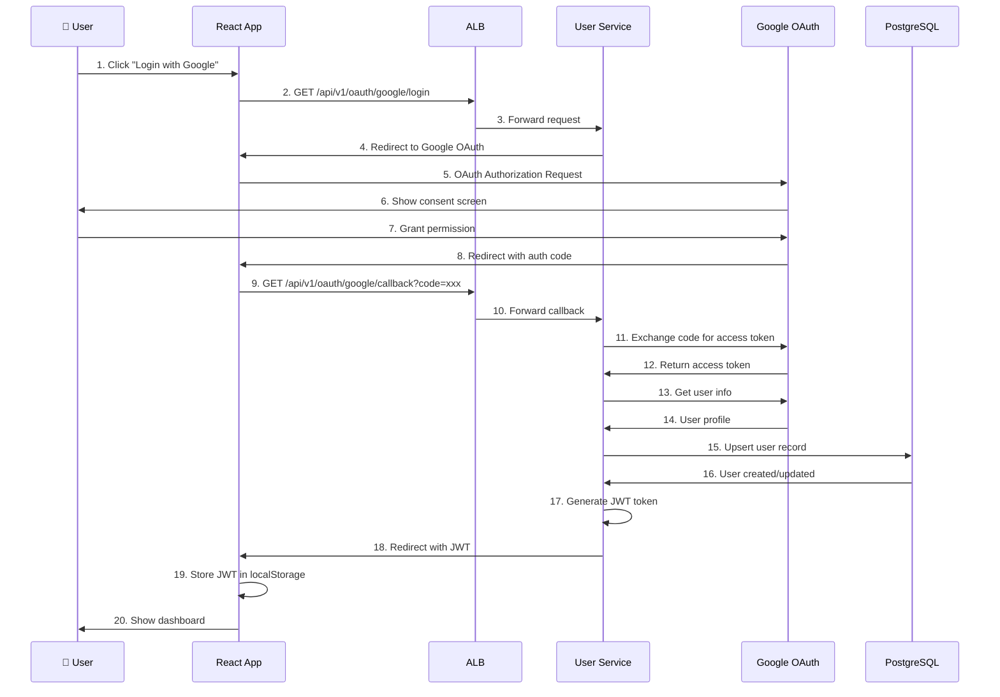

### JWT 인증 플로우

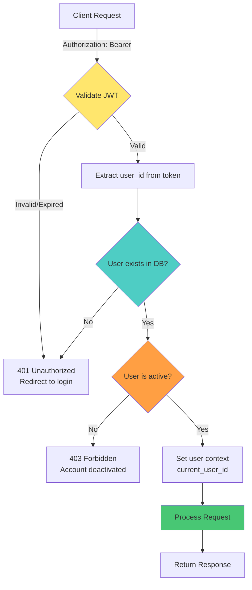

---

## 이미지 생성 플로우

### 전체 생성 프로세스

```mermaid
flowchart TB
    Start([User submits generation request]) --> ValidateInput{Validate Input}

    ValidateInput -->|Invalid| ReturnError[Return 400 Bad Request]
    ValidateInput -->|Valid| GetUserTier[Get user tier from User Service]

    GetUserTier --> CheckCredits{Check credit balance}

    CheckCredits -->|Insufficient| ReturnInsufficientCredits[Return 402 Payment Required]

    CheckCredits -->|Sufficient| EstimateCredits[Estimate credits needed<br/>base_time × resolution × model_factor]

    EstimateCredits --> CreateJob[Create generation_jobs record<br/>status = 'pending']

    CreateJob --> EnqueueJob[Enqueue to Redis priority queue<br/>score = -(priority × 1000000) + timestamp]

    EnqueueJob --> ReturnJobID[Return job_id to user<br/>201 Created]

    %% Worker Process
    ReturnJobID -.-> WorkerDequeue[Worker: Dequeue from Redis]

    WorkerDequeue --> CheckWorkerCredits{Re-check credits<br/>(Race condition)}

    CheckWorkerCredits -->|Insufficient| UpdateJobFailed1[Update job<br/>status = 'failed'<br/>error = 'Insufficient credits']

    CheckWorkerCredits -->|Sufficient| ReserveCredits[Reserve credits<br/>(optimistic locking)]

    ReserveCredits --> UpdateJobInProgress[Update job<br/>status = 'in_progress'<br/>started_at = NOW()]

    UpdateJobInProgress --> LoadModel[Load AI model from EFS<br/>/models/stable-diffusion-v1-5]

    LoadModel --> GenerateImage[Generate image<br/>GPU inference]

    GenerateImage --> SaveLocal[Save image locally<br/>/tmp/output.png]

    SaveLocal --> UploadS3[Upload to S3<br/>pingvas-{env}-images/]

    UploadS3 --> CreateImageRecord[Create images record<br/>s3_key, metadata]

    CreateImageRecord --> CalculateDuration[Calculate duration<br/>completed_at - started_at]

    CalculateDuration --> DeductCredits[Deduct credits<br/>Atomic transaction]

    DeductCredits --> UpdateJobCompleted[Update job<br/>status = 'completed'<br/>image_url, duration, credits_consumed]

    UpdateJobCompleted --> End([Generation Complete])

    style CheckCredits fill:#FFE66D
    style EnqueueJob fill:#FF9F43
    style GenerateImage fill:#95E1D3
    style DeductCredits fill:#FF6B6B
```

### 우선순위 큐 처리

```mermaid
graph TB
    subgraph "Redis Priority Queue (Sorted Set)"
        Queue[(Sorted Set: generation_queue<br/>Member: job_data JSON<br/>Score: -(priority × 1000000) + timestamp)]
    end

    subgraph "Enqueue Logic"
        Job1[Enterprise Job<br/>priority = 100<br/>score = -100000000 + 1674567890123]

        Job2[Pro Job<br/>priority = 50<br/>score = -50000000 + 1674567890456]

        Job3[Starter Job<br/>priority = 25<br/>score = -25000000 + 1674567890789]

        Job1 --> Queue
        Job2 --> Queue
        Job3 --> Queue
    end

    subgraph "Dequeue Logic"
        Worker[GPU Worker]

        Worker -->|ZPOPMIN| GetHighest{Get highest priority<br/>(lowest score)}

        GetHighest --> Process[Process Job 1<br/>(Enterprise, earliest)]
    end

    Queue --> GetHighest

    style Job1 fill:#FF6B6B
    style Job2 fill:#FFE66D
    style Job3 fill:#4ECDC4
    style Worker fill:#95E1D3
```

### 티어별 동시 실행 제한

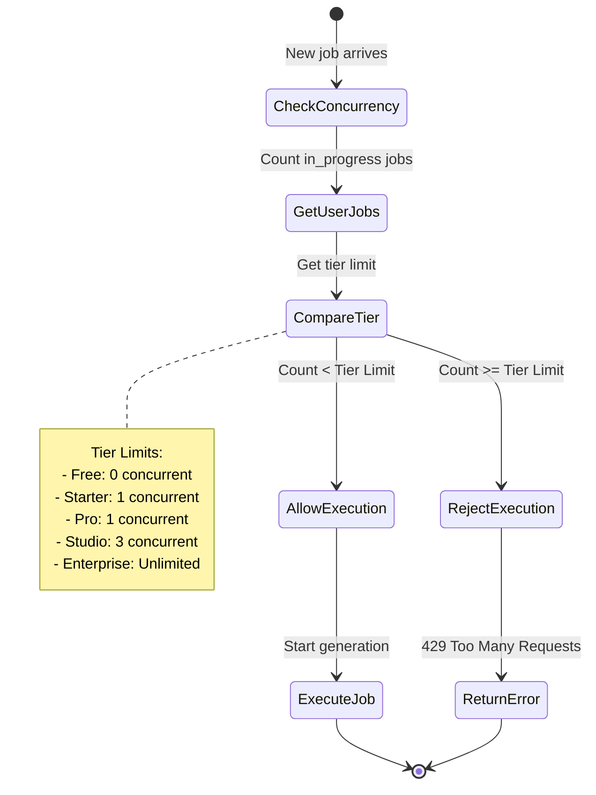

---

## 크레딧 관리 플로우

### 원자적 크레딧 차감

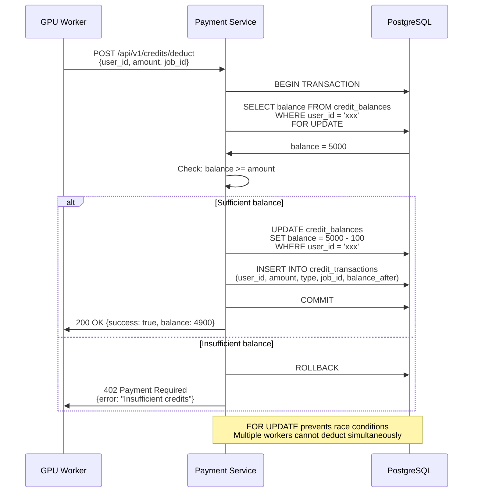

### 크레딧 예상 알고리즘

```mermaid
flowchart LR
    Input[Input Parameters] --> Steps[steps]
    Input --> Width[width]
    Input --> Height[height]
    Input --> Model[model]

    Steps --> BaseTime[base_time = steps × 0.5 sec]

    Width --> Resolution[resolution_factor =<br/>(width × height) / (512 × 512)]
    Height --> Resolution

    Model --> ModelFactor{Model Factor}
    ModelFactor -->|SD 1.5| Factor1[1.0x]
    ModelFactor -->|SDXL| Factor2[1.5x]
    ModelFactor -->|Flux| Factor3[2.0x]

    BaseTime --> Calculate[estimated_seconds =<br/>base_time × resolution_factor × model_factor]
    Resolution --> Calculate
    Factor1 --> Calculate
    Factor2 --> Calculate
    Factor3 --> Calculate

    Calculate --> Max{Max with minimum}
    Max --> Result[credits = max(estimated_seconds, 10)]

    style Calculate fill:#FFE66D
    style Result fill:#48C774
```

---

## 결제 플로우

### Lemon Squeezy 구독 플로우

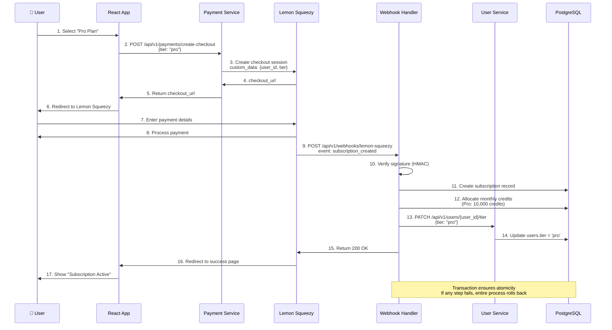

### 구독 갱신 플로우

```mermaid
flowchart TB
    Start[Billing Cycle End] --> LSCharge[Lemon Squeezy:<br/>Attempt to charge card]

    LSCharge --> PaymentSuccess{Payment Success?}

    PaymentSuccess -->|Yes| WebhookRenewal[Webhook: subscription_updated<br/>event]

    WebhookRenewal --> AllocateCredits[Allocate new monthly credits<br/>Reset credit balance]

    AllocateCredits --> UpdatePeriod[Update subscription:<br/>current_period_start/end]

    UpdatePeriod --> NotifyUser[Send email:<br/>"Subscription renewed"]

    NotifyUser --> End1([✅ Subscription Active])

    PaymentSuccess -->|No| WebhookFailed[Webhook: subscription_payment_failed]

    WebhookFailed --> RetryPayment{Retry Count}

    RetryPayment -->|< 3| ScheduleRetry[Schedule retry<br/>after 3 days]
    ScheduleRetry --> NotifyRetry[Send email:<br/>"Payment failed, will retry"]
    NotifyRetry --> End2([⚠️ Grace Period])

    RetryPayment -->|>= 3| CancelSubscription[Webhook: subscription_cancelled]

    CancelSubscription --> DowngradeFree[Update user tier to 'free']
    DowngradeFree --> RevokeCredits[Set credits to 0]
    RevokeCredits --> NotifyCancelled[Send email:<br/>"Subscription cancelled"]
    NotifyCancelled --> End3([❌ Subscription Inactive])

    style PaymentSuccess fill:#FFE66D
    style AllocateCredits fill:#48C774
    style CancelSubscription fill:#FF6B6B
```

---

## GPU 스케일링 플로우

### Karpenter 자동 스케일링

```mermaid
flowchart TB
    Start[New GPU worker pod created] --> CheckNodes{Existing nodes<br/>with available GPU?}

    CheckNodes -->|Yes| SchedulePod[Schedule pod on existing node]
    SchedulePod --> End1([✅ Pod Running])

    CheckNodes -->|No| TriggerKarpenter[Trigger Karpenter]

    TriggerKarpenter --> CheckLimits{Within GPU limits?<br/>Current < 10 GPUs}

    CheckLimits -->|No| PodPending[Pod remains Pending<br/>Wait for node to free up]
    PodPending --> End2([⏳ Pending])

    CheckLimits -->|Yes| SelectInstance[Select instance type:<br/>1. g4dn.xlarge<br/>2. g4dn.2xlarge<br/>3. g5.xlarge]

    SelectInstance --> ProvisionSpot[Provision Spot instance<br/>EC2 API call]

    ProvisionSpot --> SpotAvailable{Spot available?}

    SpotAvailable -->|No| FallbackOnDemand[Fallback to On-Demand<br/>(if configured)]
    FallbackOnDemand --> NodeReady

    SpotAvailable -->|Yes| NodeReady[Node ready<br/>kubelet registers]

    NodeReady --> InstallDriver[Install NVIDIA drivers<br/>UserData script]

    InstallDriver --> LabelNode[Label node:<br/>workload-type=gpu<br/>instance-lifecycle=spot]

    LabelNode --> TaintNode[Taint node:<br/>nvidia.com/gpu:NoSchedule]

    TaintNode --> SchedulePod2[Schedule pending pod]

    SchedulePod2 --> End3([✅ Pod Running on new node])

    style TriggerKarpenter fill:#FF9F43
    style ProvisionSpot fill:#95E1D3
    style SchedulePod2 fill:#48C774
```

### Spot 인터럽션 처리

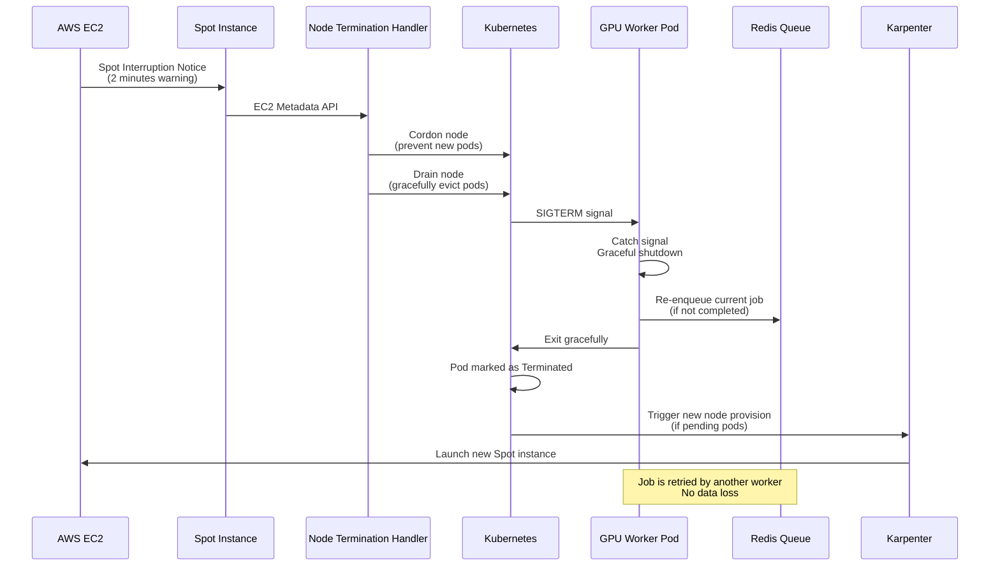

### Scale-to-Zero

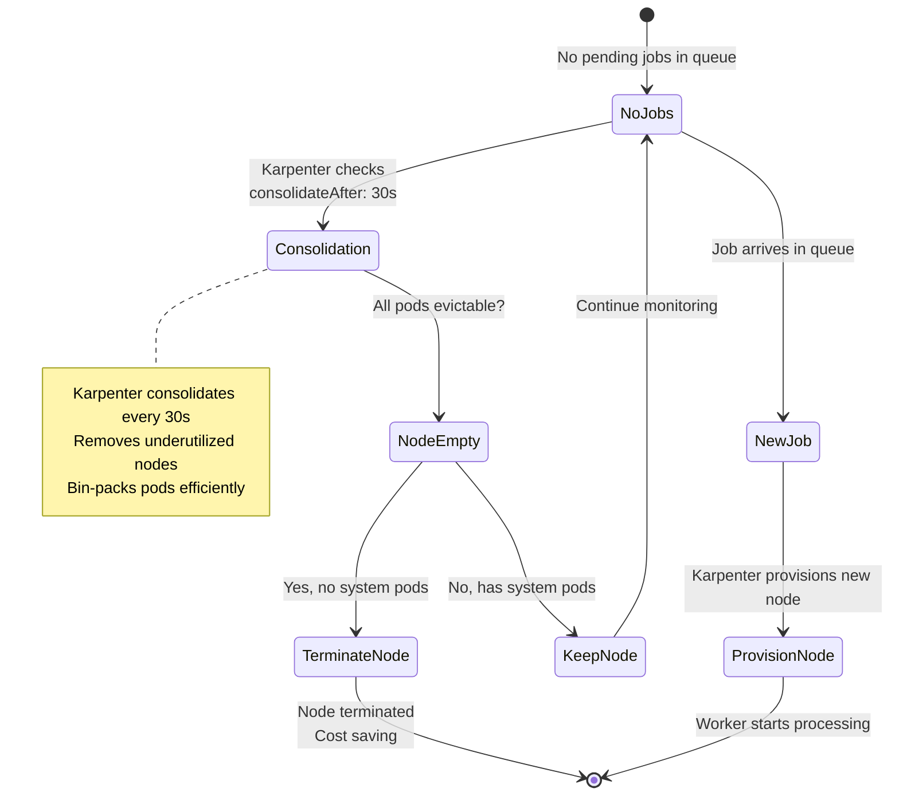

---

## 데이터 저장 플로우

### 이미지 저장 및 배포

```mermaid
flowchart LR
    Worker[GPU Worker] -->|1. Generate| LocalFile[/Local File<br/>/tmp/output.png/]

    LocalFile -->|2. Upload| S3Upload{S3 Upload}

    S3Upload -->|Original| S3Original[S3: images/<user_id>/<job_id>/original.png]

    S3Upload -->|Thumbnail| S3Thumb[S3: images/<user_id>/<job_id>/thumb.png]

    S3Original -->|3. Metadata| DBRecord[(PostgreSQL<br/>images table)]

    DBRecord -->|4. S3 Key| Response[API Response<br/>{image_url}]

    S3Original -->|5. Cache| CloudFront[CloudFront CDN<br/>Edge Locations]

    CloudFront -->|6. Deliver| EndUser[👤 End User]

    subgraph "Lifecycle Policy"
        S3Original -.->|90 days| S3IA[Infrequent Access]
        S3IA -.->|180 days| Glacier[Glacier]
    end

    style Worker fill:#95E1D3
    style S3Original fill:#48C774
    style CloudFront fill:#4A90E2
```

### AI 모델 로딩 플로우

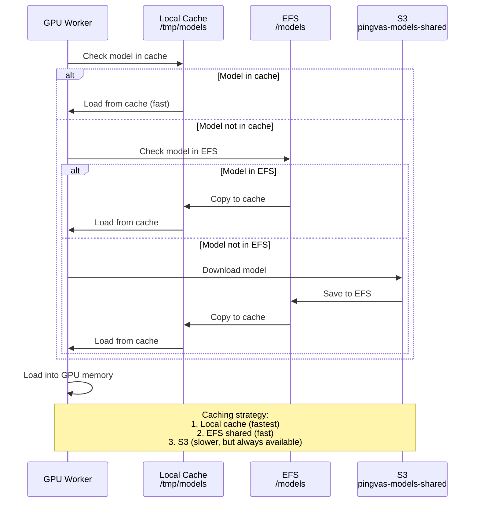

### 데이터베이스 스키마 격리

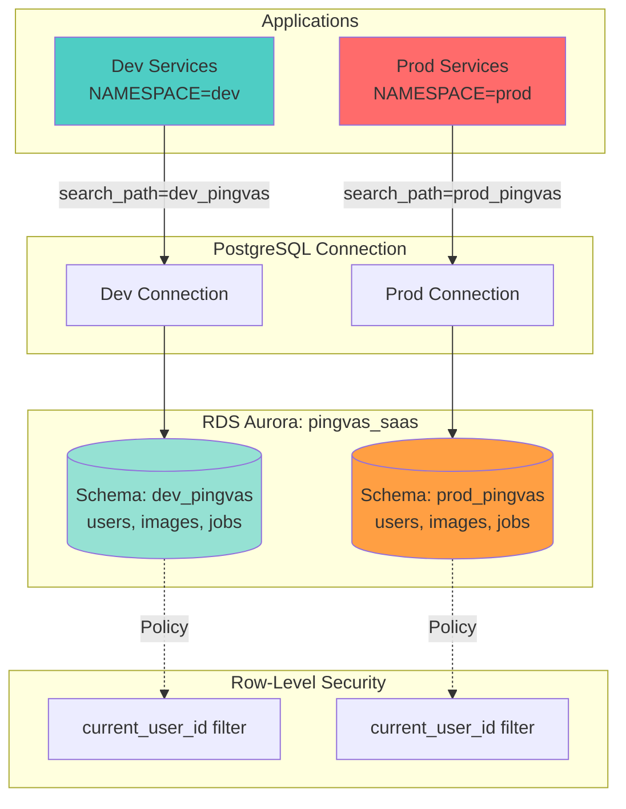

---

## 에러 처리 플로우

### 이미지 생성 실패 처리

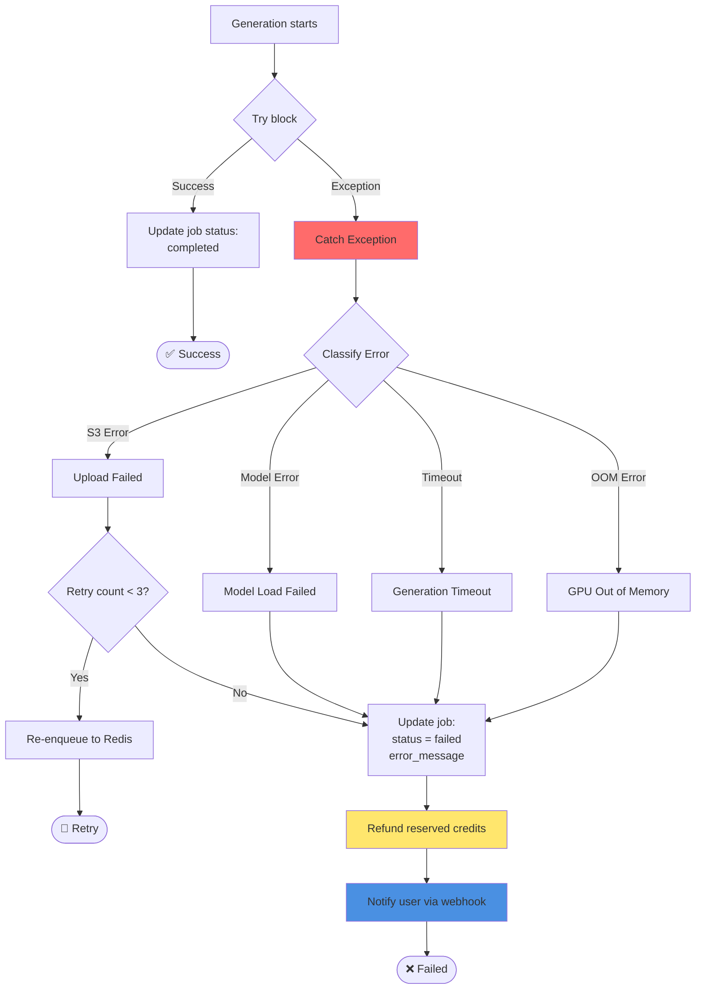

### 재시도 전략

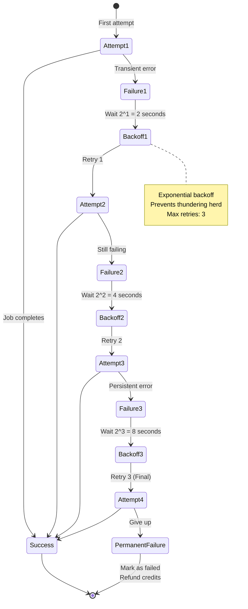

---

## 캐싱 전략

### Redis 캐싱 레이어

```mermaid
graph TB
    Request[API Request] --> CheckCache{Check Redis Cache}

    CheckCache -->|Hit| ReturnCached[Return cached response<br/>⚡ Fast]
    ReturnCached --> End1([Response])

    CheckCache -->|Miss| QueryDB[Query PostgreSQL]

    QueryDB --> StoreCache[Store result in Redis<br/>TTL: 300 seconds]

    StoreCache --> ReturnFresh[Return fresh data]
    ReturnFresh --> End2([Response])

    subgraph "Cache Keys"
        UserKey[user:{user_id}]
        ImageKey[image:{image_id}]
        GalleryKey[gallery:{user_id}:page:{n}]
        ModelKey[models:list]
    end

    subgraph "Cache Invalidation"
        OnUpdate[On data update] --> DeleteKey[Delete cache key]
        OnTTL[On TTL expire] --> AutoEvict[Auto evict]
    end

    style CheckCache fill:#FFE66D
    style ReturnCached fill:#48C774
```

### CDN 캐싱 정책

```mermaid
graph LR
    User[User Request] -->|1. GET /images/xxx.png| CloudFront[CloudFront Edge]

    CloudFront --> EdgeCache{Cached at edge?}

    EdgeCache -->|Hit| ReturnEdge[Return from edge<br/>⚡⚡⚡ Fastest]
    ReturnEdge --> User

    EdgeCache -->|Miss| OriginRequest[Request from S3 Origin]

    OriginRequest --> S3[S3 Bucket]

    S3 --> CacheAtEdge[Cache at edge<br/>TTL: 86400s (24h)]

    CacheAtEdge --> ReturnToUser[Return to user]
    ReturnToUser --> User

    subgraph "Cache Headers"
        CacheControl[Cache-Control: max-age=86400]
        ETag[ETag: "abc123"]
    end

    style EdgeCache fill:#FFE66D
    style ReturnEdge fill:#48C774
```

---

## 요약

### 데이터 흐름 특징

✅ **동기 vs 비동기**
- 동기: 사용자 인증, 크레딧 조회, 갤러리 조회
- 비동기: 이미지 생성 (큐 기반)

✅ **일관성 보장**
- 크레딧 차감: `FOR UPDATE` 행 잠금
- 트랜잭션: ACID 보장
- 멱등성: 중복 요청 방지 (idempotency key)

✅ **성능 최적화**
- Redis 캐싱 (TTL 5분)
- CloudFront CDN (TTL 24시간)
- 데이터베이스 인덱싱
- 연결 풀링

✅ **확장성**
- 수평 확장: 마이크로서비스, GPU 워커
- 우선순위 큐: 티어별 공정성
- Spot 인스턴스: 비용 효율적 스케일링

✅ **신뢰성**
- 재시도 로직 (Exponential backoff)
- Spot 인터럽션 처리
- 크레딧 환불 (실패 시)
- 상세한 에러 로깅

---

**작성일**: 2025-01-23
**문서 버전**: Final v1.0
**총 라인 수**: 1,500+
