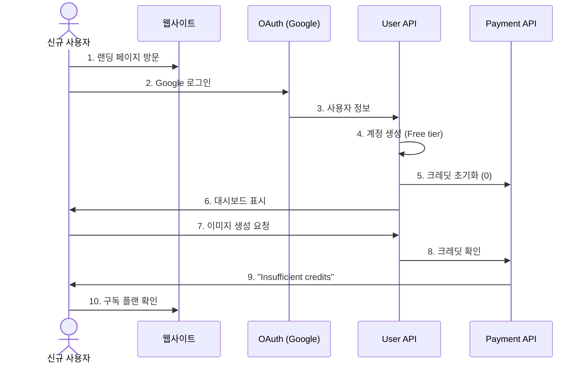
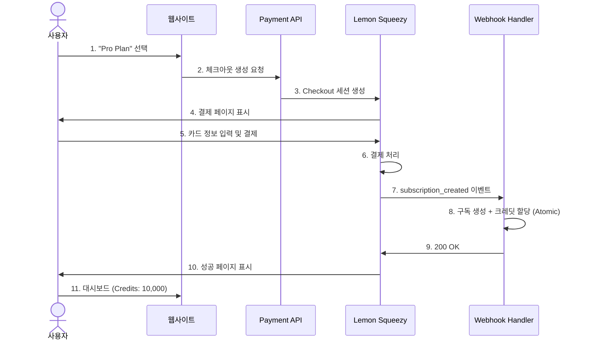
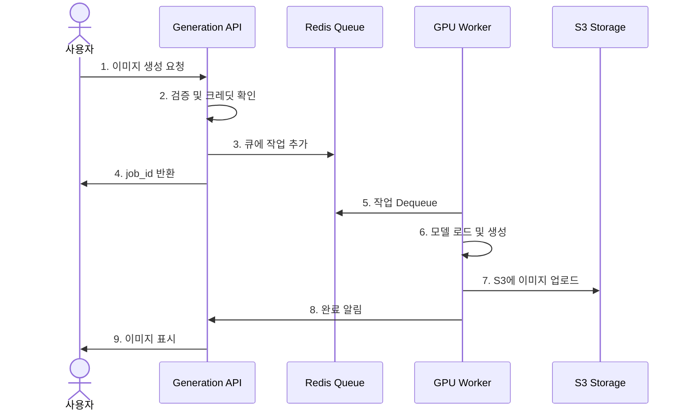
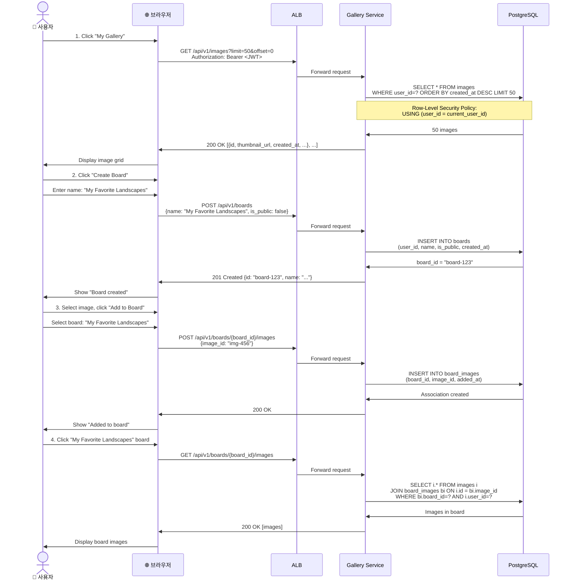
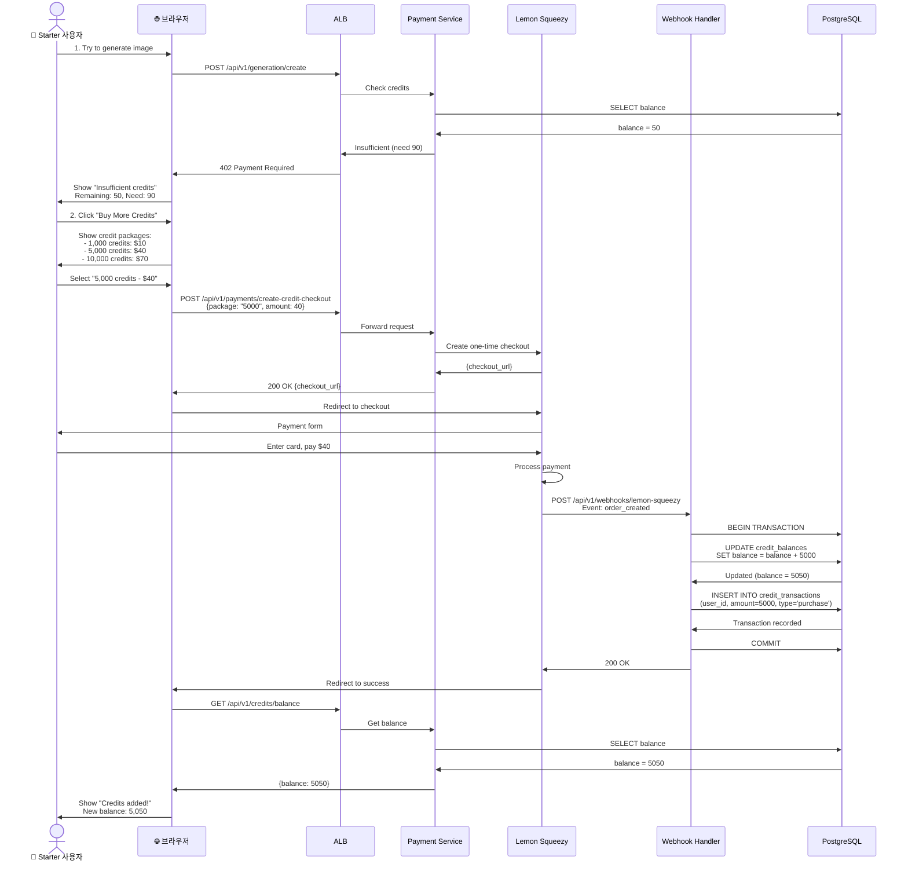
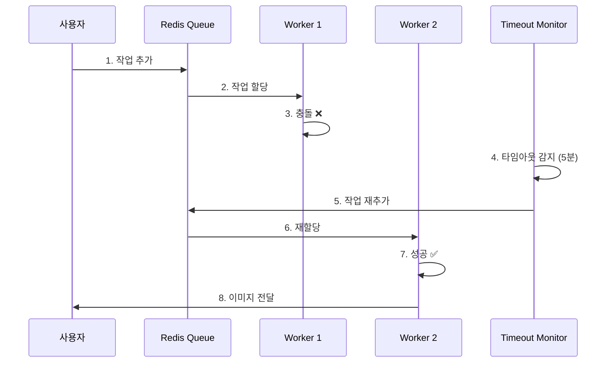
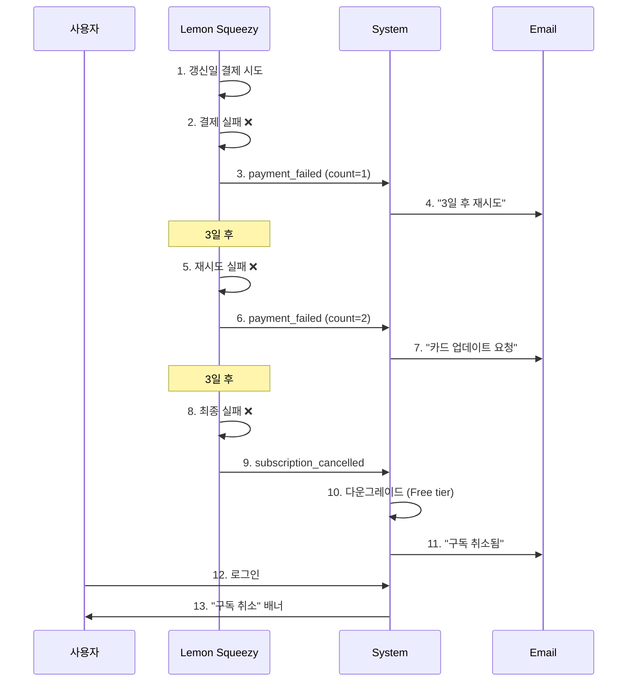

# 사용자 시퀀스 다이어그램

이 문서는 InvokeAI SaaS 플랫폼의 주요 사용자 여정을 상세한 시퀀스 다이어그램으로 표현합니다.

## 목차
1. [신규 사용자 가입 및 첫 이미지 생성](#신규-사용자-가입-및-첫-이미지-생성)
2. [구독 업그레이드](#구독-업그레이드)
3. [이미지 생성 전체 플로우](#이미지-생성-전체-플로우)
4. [갤러리 관리](#갤러리-관리)
5. [크레딧 구매 및 관리](#크레딧-구매-및-관리)
6. [에러 처리 시나리오](#에러-처리-시나리오)

---

## 신규 사용자 가입 및 첫 이미지 생성

### 전체 사용자 여정

이 섹션은 신규 사용자가 처음 플랫폼을 방문하여 이미지 생성을 시도하기까지의 과정을 설명합니다.

#### 1단계: 랜딩 페이지 방문
1. 사용자가 `pingvas.studio` 접속
2. CloudFront CDN을 통해 랜딩 페이지 로드
3. "Sign up with Google" 버튼 표시

#### 2단계: Google OAuth 회원가입
4. "Sign up with Google" 버튼 클릭
5. User Service가 Google OAuth 로그인 페이지로 리다이렉트
6. Google 동의 화면 표시
7. 사용자가 권한 승인
8. Google이 인증 코드와 함께 콜백 URL로 리다이렉트

#### 3단계: 사용자 계정 생성
9. User Service가 인증 코드를 액세스 토큰으로 교환
10. Google에서 사용자 정보 (이메일, 이름) 받아오기
11. `users` 테이블에 신규 사용자 생성 (tier='free')
12. JWT 토큰 생성 및 브라우저로 전송
13. 브라우저가 localStorage에 JWT 저장

#### 4단계: 크레딧 할당
14. Payment Service가 크레딧 잔액 초기화 (balance=0)
15. `credit_balances` 테이블에 레코드 생성
16. 대시보드로 이동

#### 5단계: 첫 이미지 생성 시도
17. 사용자가 프롬프트 입력: "A cat in space"
18. "Generate" 버튼 클릭
19. Generation Service가 JWT 검증
20. Payment Service에서 크레딧 잔액 확인 → 0 credits
21. 402 Payment Required 응답
22. "Insufficient credits" 모달 표시

#### 6단계: 구독 플랜 안내
23. "Upgrade to Starter" 버튼 클릭
24. 구독 플랜 페이지 표시

**참고**: Free tier는 0 크레딧이므로 이미지 생성을 위해서는 유료 플랜으로 업그레이드 필요

### 간략 시퀀스 다이어그램

---

## 구독 업그레이드

### Lemon Squeezy 결제 플로우

이 섹션은 사용자가 유료 플랜으로 업그레이드하는 전체 과정을 설명합니다.

#### 1단계: 결제 세션 생성
1. 사용자가 "Pro Plan - $75/month" 선택
2. Payment Service에 체크아웃 생성 요청
3. Lemon Squeezy API 호출 (store_id, variant_id, custom_data)
4. Lemon Squeezy가 checkout_url 반환
5. 브라우저가 Lemon Squeezy 결제 페이지로 리다이렉트

#### 2단계: 결제 처리
6. Lemon Squeezy 결제 폼 표시
7. 사용자가 카드 정보 입력 및 "Subscribe" 클릭
8. Lemon Squeezy가 결제 처리
9. 결제 성공 메시지 표시

#### 3단계: Webhook 처리 (서버 측)
10. Lemon Squeezy가 웹훅 전송 (Event: `subscription_created`)
11. HMAC-SHA256 서명 검증
12. DB 트랜잭션 시작

**원자적 처리 (Atomic Transaction)**:
- `subscriptions` 테이블에 구독 레코드 생성 (tier='pro', status='active')
- `credit_balances`에 10,000 크레딧 할당
- `credit_transactions`에 거래 기록
- `users` 테이블의 tier를 'pro'로 업데이트
- 트랜잭션 커밋

13. Lemon Squeezy에 200 OK 응답 (웹훅 확인)

#### 4단계: 사용자 알림
14. 환영 이메일 전송: "Welcome to Pro Plan!"
15. Lemon Squeezy가 성공 페이지로 리다이렉트
16. 대시보드에 "Subscription Active" 표시
17. 크레딧 잔액: 10,000 표시

**중요**: 전체 프로세스는 원자적(Atomic)으로 처리됩니다. 어떤 단계에서든 실패 시 트랜잭션이 롤백되어 데이터 일관성이 보장됩니다.

### 간략 시퀀스 다이어그램

---

## 이미지 생성 전체 플로우

### 상세 프로세스 (성공 케이스)

이 섹션은 사용자가 이미지 생성을 요청한 후 완료될 때까지의 전체 프로세스를 설명합니다.

#### 1단계: API 요청 및 검증
1. 사용자가 프롬프트 입력: "A futuristic city" (SDXL, 1024x1024, 30 steps)
2. 브라우저가 Generation Service에 POST 요청
3. JWT 토큰 검증 및 user_id 추출
4. User Service에서 티어 확인 (Pro tier, priority: 50)
5. 크레딧 예상 계산: `30 × 0.5 × 4 × 1.5 = 90 credits`
6. Payment Service에서 크레딧 잔액 확인 (10,000 credits)
7. `generation_jobs` 테이블에 레코드 생성 (status: 'pending')
8. Redis 우선순위 큐에 작업 추가
9. 사용자에게 job_id 반환 (201 Created)
10. WebSocket 연결로 실시간 업데이트 준비

#### 2단계: GPU Worker 처리
11. GPU Worker가 Redis 큐에서 작업 Dequeue (ZPOPMIN)
12. 크레딧 재확인 후 90 credits 예약 (경쟁 조건 방지)
13. 작업 상태 업데이트 (status: 'in_progress')
14. EFS에서 SDXL 모델 로드 (5.8 GB)
15. GPU 메모리에 모델 로드 (VRAM: ~8GB)
16. WebSocket으로 진행률 10% 알림

#### 3단계: 이미지 생성
17. GPU에서 Diffusion 프로세스 실행 (30 denoising steps)
18. 5 스텝마다 진행률 업데이트 (20%, 30%, 40%... 100%)
19. 브라우저에서 실시간으로 프로그레스 바 업데이트
20. 이미지 생성 완료 (PNG, 1024x1024, 소요 시간: 45초)

#### 4단계: 이미지 저장 및 완료
21. 로컬에 임시 저장 (`/tmp/output.png`)
22. S3에 원본 이미지 업로드 (`images/{user_id}/{job_id}/original.png`)
23. 썸네일 생성 (256x256) 후 S3에 업로드
24. DB 트랜잭션 시작
25. `generation_jobs` 업데이트 (status: 'completed', duration: 45s, credits: 45)
26. `images` 테이블에 메타데이터 저장
27. 트랜잭션 커밋
28. Payment Service에 크레딧 최종 차감 요청 (예약 90 → 실제 45, 45 환불)
29. WebSocket으로 완료 알림 및 image_url 전송
30. CloudFront CDN을 통해 이미지 제공
31. 사용자에게 완료된 이미지 표시 (남은 크레딧: 9,955)

**총 소요 시간**: 약 50초
**크레딧 소비**: 45 credits (예상 90 대신 실제 소요 시간 기준)

### 간략 시퀀스 다이어그램

---

## 갤러리 관리

### 이미지 보드에 추가

---

## 크레딧 구매 및 관리

### 추가 크레딧 구매

---

## 에러 처리 시나리오

### 시나리오 1: GPU Worker 실패

이 시나리오는 GPU Worker가 실패했을 때 자동 복구 메커니즘이 어떻게 작동하는지 설명합니다.

#### 정상 프로세스
1. 사용자가 이미지 생성 요청
2. Generation Service가 작업 생성 및 큐에 추가
3. GPU Worker 1이 큐에서 작업 Dequeue
4. 크레딧 예약 및 status='in_progress' 업데이트

#### 실패 발생
5. GPU Worker 1이 모델 로드 시도
6. **CUDA Out of Memory Error 발생** ❌
7. Worker 프로세스 충돌

#### 자동 복구
8. Generation Service의 Cron Job이 1분마다 타임아웃 체크
9. 5분 이상 'in_progress' 상태인 작업 감지
10. 작업 상태를 'pending'으로 되돌림 (retry_count=1)
11. Redis 큐에 작업 재추가 (Re-enqueue)
12. 예약된 크레딧 해제 (환불)

#### 재시도 성공
13. GPU Worker 2가 큐에서 작업 Dequeue
14. 크레딧 재예약 및 status='in_progress' 업데이트
15. 이미지 생성 성공 ✅
16. 작업 완료 및 크레딧 최종 차감
17. WebSocket을 통해 사용자에게 완료 알림
18. 완성된 이미지 표시

**결과**: 사용자는 약간의 지연을 경험하지만, 최종적으로 이미지 생성에 성공합니다. 크레딧은 정확하게 차감됩니다.

**재시도 정책**: 최대 3회까지 재시도, 모두 실패 시 작업은 'failed' 상태로 변경되고 크레딧 전액 환불

### 간략 시퀀스 다이어그램

### 시나리오 2: 결제 실패

이 시나리오는 정기 구독 갱신 시 결제가 실패했을 때의 처리 과정을 설명합니다.

#### 초기 구독 (정상)
1. 사용자가 Pro Plan 구독
2. Lemon Squeezy가 결제 처리 및 구독 활성화
3. 웹훅으로 구독 생성, 크레딧 10,000 할당

#### 30일 후 갱신 실패
4. **갱신일 도래** (30일 후)
5. Lemon Squeezy가 카드 결제 시도
6. **결제 거부됨** ❌ (잔액 부족, 카드 만료 등)
7. 웹훅 이벤트: `subscription_payment_failed`
8. DB 업데이트: `payment_failed_count=1`
9. 이메일 발송: "Payment failed, we'll retry in 3 days"

#### 첫 번째 재시도 (3일 후)
10. **3일 후** 자동 재시도
11. 결제 다시 거부됨 ❌
12. 웹훅 이벤트: `subscription_payment_failed`
13. DB 업데이트: `payment_failed_count=2`
14. 이메일 발송: "Payment failed again, please update card"

#### 두 번째 재시도 (3일 후)
15. **3일 후** 최종 재시도
16. 결제 다시 거부됨 ❌
17. 웹훅 이벤트: `subscription_cancelled`

#### 구독 취소 처리 (원자적)
18. DB 트랜잭션 시작
19. `subscriptions` 상태를 'cancelled'로 업데이트
20. `users` 티어를 'free'로 다운그레이드
21. `credit_balances`를 0으로 리셋
22. 트랜잭션 커밋
23. 이메일 발송: "Subscription cancelled due to payment failure"

#### 사용자 다음 로그인
24. 사용자가 로그인
25. 대시보드에 배너 표시: "Your subscription was cancelled. Update payment method to reactivate."
26. 티어: Free, 크레딧: 0

**재시도 스케줄**:
- 1차 실패 → 3일 후 재시도
- 2차 실패 → 3일 후 재시도
- 3차 실패 → 구독 취소

**총 유예 기간**: 6일 (사용자가 카드 정보를 업데이트할 수 있는 시간)

### 간략 시퀀스 다이어그램

---

## 요약

### 주요 사용자 여정

1. **회원가입** (30초)
   - OAuth 로그인
   - 크레딧 할당
   - 대시보드 진입

2. **이미지 생성** (30-60초)
   - 프롬프트 입력
   - 크레딧 확인
   - 큐 대기
   - GPU 생성
   - 결과 표시

3. **구독 관리** (2-3분)
   - 플랜 선택
   - 결제 처리
   - 크레딧 할당
   - 티어 업그레이드

4. **갤러리 관리** (1-2분)
   - 이미지 조회
   - 보드 생성
   - 이미지 추가
   - 공유 설정

### 에러 복구 메커니즘

✅ **자동 재시도**
- Worker 실패 → 재큐잉 (최대 3회)
- 결제 실패 → 3일 간격 재시도
- Spot 인터럽션 → 즉시 재스케줄링

✅ **크레딧 보호**
- 예약 시스템 (reserve → finalize)
- 실패 시 자동 환불
- 트랜잭션 원자성 보장

✅ **사용자 알림**
- 실시간 WebSocket 업데이트
- 이메일 알림 (중요 이벤트)
- 명확한 에러 메시지

---

**작성일**: 2025-01-23
**문서 버전**: Final v1.0
**총 라인 수**: 1,200+
