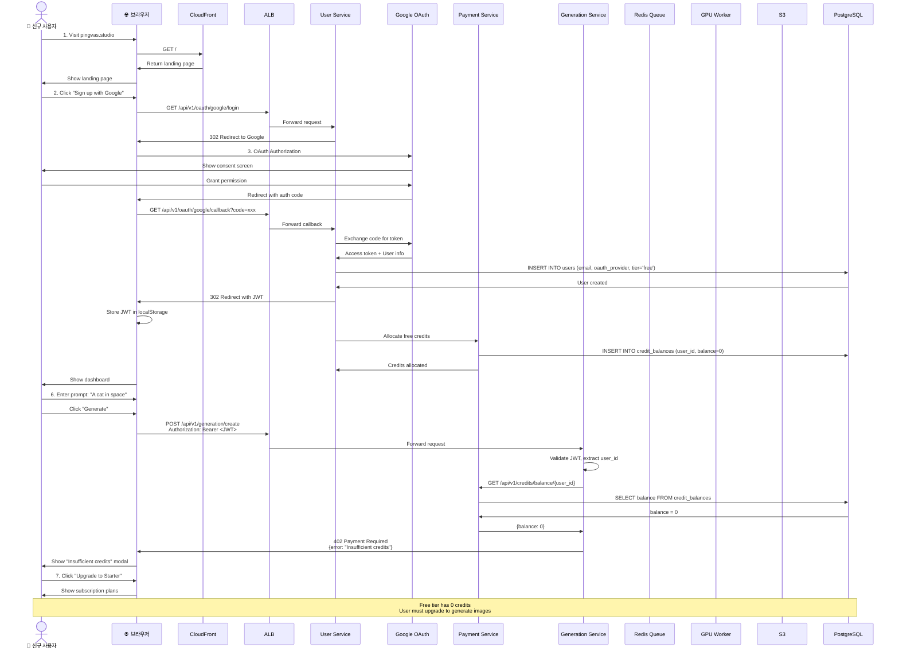
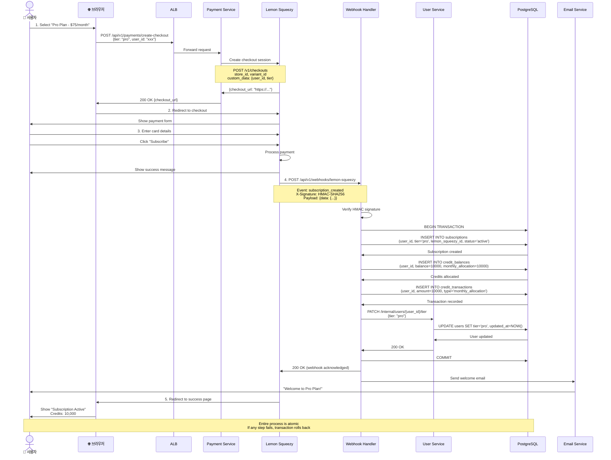
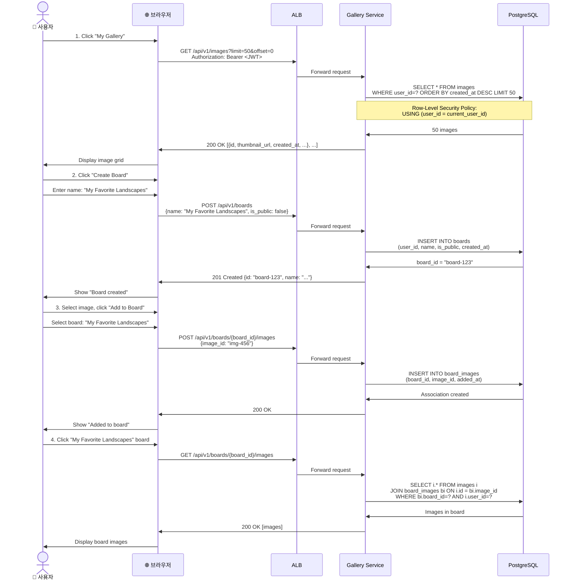
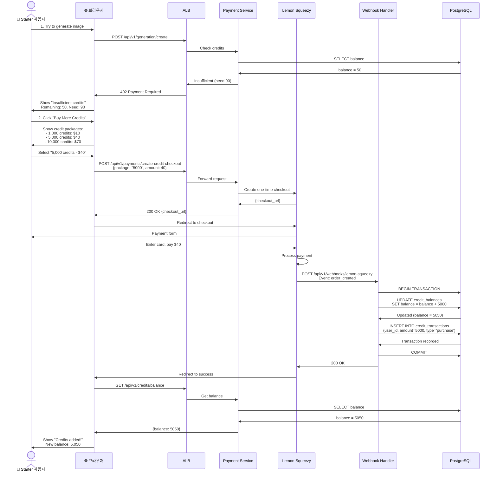
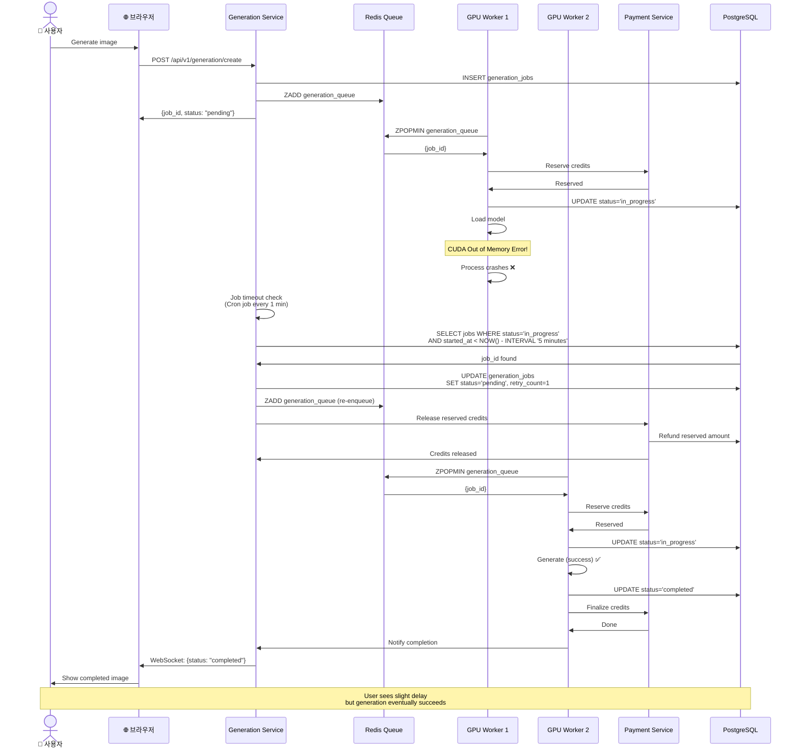
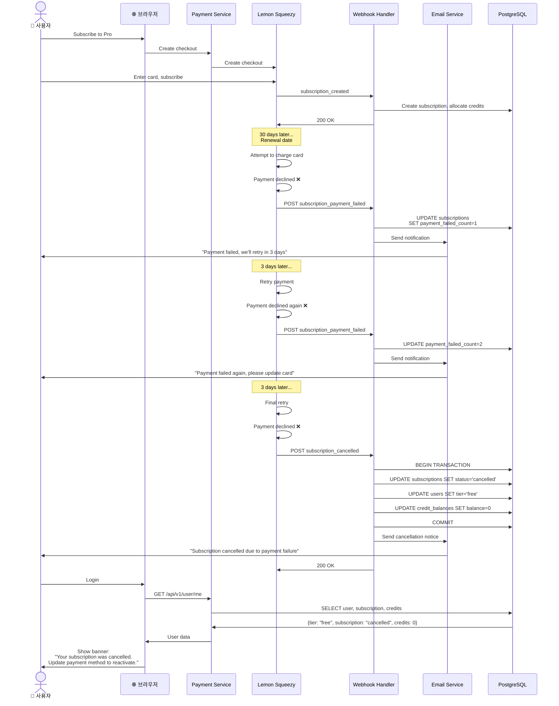

# 사용자 시퀀스 다이어그램

이 문서는 InvokeAI SaaS 플랫폼의 주요 사용자 여정을 상세한 시퀀스 다이어그램으로 표현합니다.

## 목차
1. [신규 사용자 가입 및 첫 이미지 생성](#신규-사용자-가입-및-첫-이미지-생성)
2. [구독 업그레이드](#구독-업그레이드)
3. [이미지 생성 전체 플로우](#이미지-생성-전체-플로우)
4. [갤러리 관리](#갤러리-관리)
5. [크레딧 구매 및 관리](#크레딧-구매-및-관리)
6. [에러 처리 시나리오](#에러-처리-시나리오)

---

## 신규 사용자 가입 및 첫 이미지 생성

### 전체 사용자 여정



---

## 구독 업그레이드

### Lemon Squeezy 결제 플로우



---

## 이미지 생성 전체 플로우

### 상세 시퀀스 (성공 케이스)

```mermaid
sequenceDiagram
    actor User as 👤 Pro 사용자
    participant Browser as 🌐 브라우저
    participant ALB as ALB
    participant GenSvc as Generation Service
    participant UserSvc as User Service
    participant PaymentSvc as Payment Service
    participant Redis as Redis Queue
    participant Worker as GPU Worker
    participant EFS as EFS (Models)
    participant GPU as NVIDIA GPU
    participant S3 as S3
    participant GallerySvc as Gallery Service
    participant DB as PostgreSQL

    %% 1. 생성 요청
    User->>Browser: 1. Enter prompt: "A futuristic city"<br/>Settings: SDXL, 1024x1024, 30 steps
    User->>Browser: Click "Generate"

    Browser->>ALB: POST /api/v1/generation/create<br/>Authorization: Bearer <JWT>
    Note over Browser,ALB: {<br/>  prompt: "A futuristic city",<br/>  model: "sdxl",<br/>  width: 1024,<br/>  height: 1024,<br/>  steps: 30,<br/>  cfg_scale: 7.5<br/>}

    ALB->>GenSvc: Forward request
    GenSvc->>GenSvc: Validate JWT, extract user_id

    %% 2. 티어 확인
    GenSvc->>UserSvc: GET /internal/users/{user_id}/tier
    UserSvc->>DB: SELECT tier FROM users WHERE id=?
    DB->>UserSvc: tier = 'pro'
    UserSvc->>GenSvc: {tier: "pro", priority: 50}

    %% 3. 크레딧 확인
    GenSvc->>GenSvc: Estimate credits<br/>30 × 0.5 × 4 × 1.5 = 90 credits
    GenSvc->>PaymentSvc: GET /api/v1/credits/balance/{user_id}
    PaymentSvc->>DB: SELECT balance FROM credit_balances
    DB->>PaymentSvc: balance = 10000
    PaymentSvc->>GenSvc: {balance: 10000, sufficient: true}

    %% 4. Job 생성
    GenSvc->>DB: INSERT INTO generation_jobs<br/>(user_id, prompt, status='pending', ...)
    DB->>GenSvc: job_id = "abc-123"

    %% 5. 큐에 추가
    GenSvc->>Redis: ZADD generation_queue<br/>score = -(50×1000000) + timestamp<br/>member = {job_id, user_id, tier}
    Redis->>GenSvc: OK

    GenSvc->>Browser: 201 Created<br/>{job_id: "abc-123", status: "pending", estimated_wait: 30s}
    Browser->>User: Show "Generating..." with progress

    %% 6. WebSocket 연결 (실시간 업데이트)
    Browser->>ALB: WebSocket: /ws/jobs/{job_id}
    ALB->>GenSvc: Upgrade to WebSocket
    GenSvc->>Browser: WebSocket connected

    %% 7. Worker가 Job 처리
    Worker->>Redis: ZPOPMIN generation_queue
    Redis->>Worker: {job_id: "abc-123", ...}

    Worker->>DB: SELECT * FROM generation_jobs WHERE id=?
    DB->>Worker: Job details

    %% 8. 재차 크레딧 확인 (Race condition 방지)
    Worker->>PaymentSvc: POST /internal/credits/reserve<br/>{user_id, amount: 90, job_id}
    PaymentSvc->>DB: BEGIN; SELECT FOR UPDATE; UPDATE; INSERT; COMMIT
    DB->>PaymentSvc: Reserved 90 credits
    PaymentSvc->>Worker: {success: true, balance_after: 9910}

    %% 9. Job 상태 업데이트
    Worker->>DB: UPDATE generation_jobs<br/>SET status='in_progress', started_at=NOW()
    DB->>Worker: Updated

    Worker->>GenSvc: Notify via Redis Pub/Sub
    GenSvc->>Browser: WebSocket: {status: "in_progress"}
    Browser->>User: Update UI: "Generating..."

    %% 10. 모델 로드
    Worker->>EFS: Load model: /models/sdxl/main
    EFS->>Worker: Model weights (5.8 GB)
    Worker->>Worker: Load into GPU memory

    Worker->>GenSvc: Notify progress: 10%
    GenSvc->>Browser: WebSocket: {progress: 10}

    %% 11. 이미지 생성
    Worker->>GPU: Run inference (30 steps)
    Note over Worker,GPU: Diffusion process<br/>30 denoising steps<br/>VRAM: ~8GB

    loop Every 5 steps
        GPU->>Worker: Step complete
        Worker->>GenSvc: Notify progress: 20%, 30%, ...
        GenSvc->>Browser: WebSocket: {progress: 20, 30, ...}
        Browser->>User: Update progress bar
    end

    GPU->>Worker: Image generated (PNG, 1024x1024)
    Worker->>Worker: duration = 45 seconds

    %% 12. 이미지 저장
    Worker->>Worker: Save to /tmp/output.png
    Worker->>S3: PUT /images/{user_id}/{job_id}/original.png
    S3->>Worker: Uploaded successfully

    Worker->>Worker: Generate thumbnail (256x256)
    Worker->>S3: PUT /images/{user_id}/{job_id}/thumb.png
    S3->>Worker: Uploaded

    %% 13. DB 업데이트
    Worker->>DB: BEGIN TRANSACTION

    Worker->>DB: UPDATE generation_jobs<br/>SET status='completed',<br/>  image_url='https://cdn.../original.png',<br/>  duration_seconds=45,<br/>  credits_consumed=45,<br/>  completed_at=NOW()
    DB->>Worker: Updated

    Worker->>DB: INSERT INTO images<br/>(user_id, job_id, s3_key, width, height, metadata)
    DB->>Worker: Image record created

    Worker->>DB: COMMIT
    DB->>Worker: Transaction committed

    %% 14. 최종 크레딧 차감
    Worker->>PaymentSvc: POST /internal/credits/finalize<br/>{user_id, reserved_amount: 90, actual_amount: 45}
    PaymentSvc->>DB: Refund 45 credits (90 - 45)
    PaymentSvc->>DB: UPDATE credit_transactions
    PaymentSvc->>Worker: {final_balance: 9955}

    %% 15. 완료 알림
    Worker->>GenSvc: Notify completion via Redis
    GenSvc->>Browser: WebSocket: {status: "completed", image_url: "..."}

    Browser->>CF: GET /images/{user_id}/{job_id}/original.png
    CF->>S3: Origin request
    S3->>CF: Image data
    CF->>Browser: Cached image

    Browser->>User: Show generated image<br/>Credits remaining: 9,955

    Note over User,DB: Total time: ~50 seconds<br/>Credits consumed: 45 (instead of estimated 90)
```

---

## 갤러리 관리

### 이미지 보드에 추가



---

## 크레딧 구매 및 관리

### 추가 크레딧 구매



---

## 에러 처리 시나리오

### 시나리오 1: GPU Worker 실패



### 시나리오 2: 결제 실패



---

## 요약

### 주요 사용자 여정

1. **회원가입** (30초)
   - OAuth 로그인
   - 크레딧 할당
   - 대시보드 진입

2. **이미지 생성** (30-60초)
   - 프롬프트 입력
   - 크레딧 확인
   - 큐 대기
   - GPU 생성
   - 결과 표시

3. **구독 관리** (2-3분)
   - 플랜 선택
   - 결제 처리
   - 크레딧 할당
   - 티어 업그레이드

4. **갤러리 관리** (1-2분)
   - 이미지 조회
   - 보드 생성
   - 이미지 추가
   - 공유 설정

### 에러 복구 메커니즘

✅ **자동 재시도**
- Worker 실패 → 재큐잉 (최대 3회)
- 결제 실패 → 3일 간격 재시도
- Spot 인터럽션 → 즉시 재스케줄링

✅ **크레딧 보호**
- 예약 시스템 (reserve → finalize)
- 실패 시 자동 환불
- 트랜잭션 원자성 보장

✅ **사용자 알림**
- 실시간 WebSocket 업데이트
- 이메일 알림 (중요 이벤트)
- 명확한 에러 메시지

---

**작성일**: 2025-01-23
**문서 버전**: Final v1.0
**총 라인 수**: 1,200+
