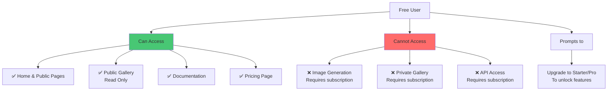
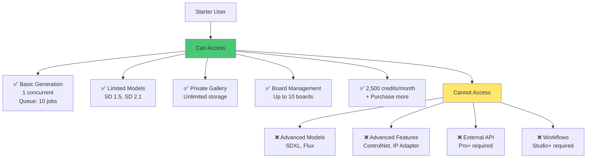
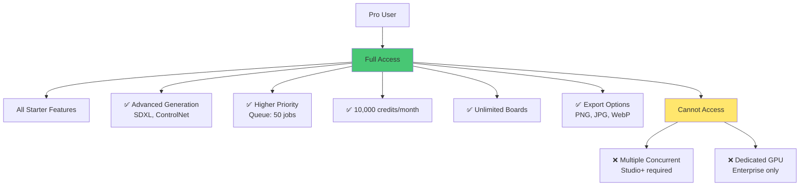
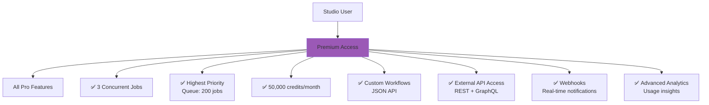
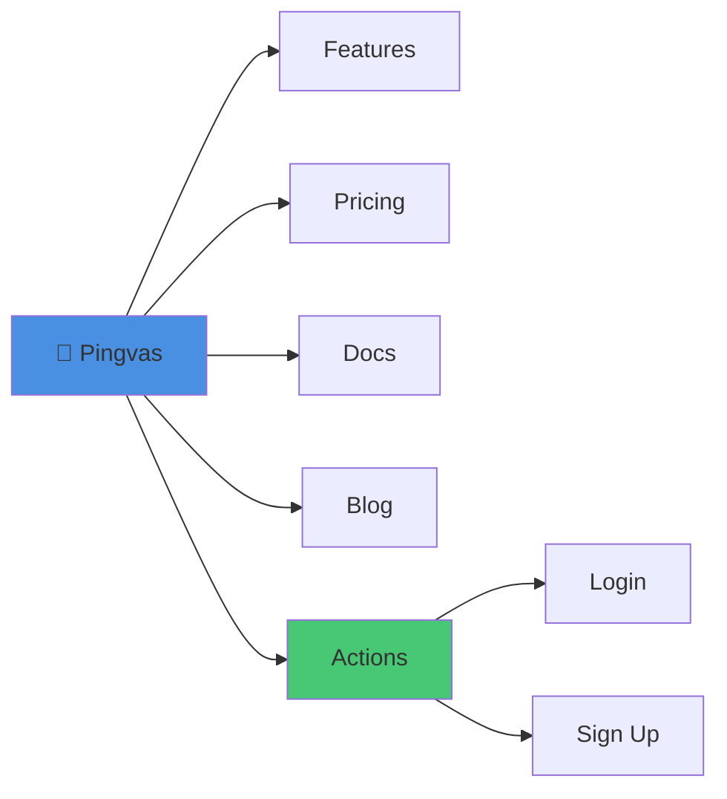
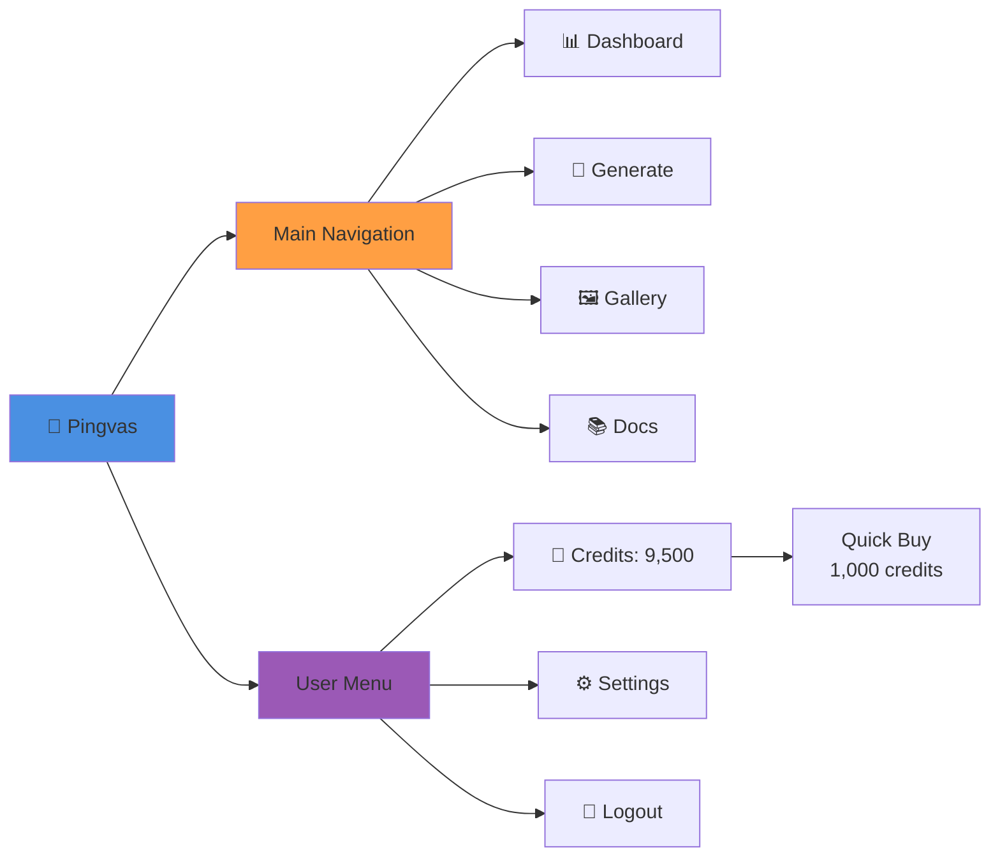

# Information Architecture & Sitemap

이 문서는 InvokeAI SaaS 플랫폼의 정보 구조와 사이트맵을 정의합니다.

## 목차
1. [사이트 구조](#사이트-구조)
2. [사용자 역할별 IA](#사용자-역할별-ia)
3. [네비게이션 구조](#네비게이션-구조)
4. [URL 구조](#url-구조)
5. [상태 관리 구조](#상태-관리-구조)

---

## 사이트 구조

### 전체 Sitemap

```mermaid
graph TB
    Root[pingvas.studio] --> Public[Public Pages]
    Root --> App[Application]
    Root --> Docs[Documentation]
    Root --> Legal[Legal]

    %% Public Pages
    Public --> Home[Home Page<br/>/]
    Public --> Features[Features<br/>/features]
    Public --> Pricing[Pricing<br/>/pricing]
    Public --> Blog[Blog<br/>/blog]
    Public --> Contact[Contact<br/>/contact]

    %% Application
    App --> Auth[Authentication]
    App --> Dashboard[Dashboard]
    App --> Generate[Generation]
    App --> Gallery[Gallery]
    App --> Settings[Settings]

    %% Authentication
    Auth --> Login[Login<br/>/login]
    Auth --> Signup[Sign Up<br/>/signup]
    Auth --> OAuth[OAuth Callback<br/>/auth/callback]
    Auth --> ForgotPW[Forgot Password<br/>/forgot-password]

    %% Dashboard
    Dashboard --> DashHome[Dashboard Home<br/>/dashboard]
    Dashboard --> QuickGen[Quick Generate<br/>/dashboard/quick]
    Dashboard --> RecentGen[Recent Generations<br/>/dashboard/recent]
    Dashboard --> Stats[Usage Stats<br/>/dashboard/stats]

    %% Generation
    Generate --> GenCreate[Create<br/>/generate]
    Generate --> GenAdvanced[Advanced Settings<br/>/generate/advanced]
    Generate --> GenHistory[History<br/>/generate/history]
    Generate --> GenJob[Job Details<br/>/generate/jobs/:id]

    %% Gallery
    Gallery --> GalHome[Gallery Home<br/>/gallery]
    Gallery --> GalImage[Image Details<br/>/gallery/images/:id]
    Gallery --> GalBoards[Boards<br/>/gallery/boards]
    Gallery --> GalBoard[Board Details<br/>/gallery/boards/:id]
    Gallery --> GalPublic[Public Gallery<br/>/gallery/public]

    %% Settings
    Settings --> SettAccount[Account<br/>/settings/account]
    Settings --> SettSubscription[Subscription<br/>/settings/subscription]
    Settings --> SettCredits[Credits<br/>/settings/credits]
    Settings --> SettBilling[Billing<br/>/settings/billing]
    Settings --> SettAPI[API Keys<br/>/settings/api]
    Settings --> SettPreferences[Preferences<br/>/settings/preferences]

    %% Documentation
    Docs --> DocsHome[Docs Home<br/>/docs]
    Docs --> DocsGettingStarted[Getting Started<br/>/docs/getting-started]
    Docs --> DocsAPI[API Reference<br/>/docs/api]
    Docs --> DocsTutorials[Tutorials<br/>/docs/tutorials]
    Docs --> DocsFAQ[FAQ<br/>/docs/faq]

    %% Legal
    Legal --> Terms[Terms of Service<br/>/terms]
    Legal --> Privacy[Privacy Policy<br/>/privacy]
    Legal --> Refund[Refund Policy<br/>/refund]

    style Root fill:#4A90E2
    style App fill:#FF9F43
    style Generate fill:#48C774
    style Gallery fill:#9B59B6
```



---

## 사용자 역할별 IA

### Free Tier 사용자



### Starter Tier 사용자



### Pro Tier 사용자



### Studio Tier 사용자



---

## 네비게이션 구조

### Header Navigation (Public)



### Header Navigation (Authenticated)



### Sidebar Navigation (Dashboard)

```
┌─────────────────────────────────┐
│ 🎨 Pingvas                       │
├─────────────────────────────────┤
│ 🏠 Dashboard                     │
│ 🎨 Generate                      │
│   ├─ Quick Generate              │
│   ├─ Advanced Settings           │
│   └─ History                     │
│ 🖼️ Gallery                        │
│   ├─ All Images                  │
│   ├─ Boards                      │
│   └─ Public Gallery              │
│ 📊 Analytics                     │
│   ├─ Usage Stats                 │
│   ├─ Credit History              │
│   └─ Generation History          │
│ ⚙️ Settings                       │
│   ├─ Account                     │
│   ├─ Subscription                │
│   ├─ Billing                     │
│   ├─ API Keys                    │
│   └─ Preferences                 │
├─────────────────────────────────┤
│ 💎 Credits: 9,500                │
│ 📦 Pro Plan                      │
│ 👤 user@example.com              │
└─────────────────────────────────┘
```

---

## URL 구조

### Public URLs

| Path | Description | Auth Required |
|------|-------------|---------------|
| `/` | Landing page | No |
| `/features` | Features overview | No |
| `/pricing` | Pricing plans | No |
| `/blog` | Blog posts | No |
| `/blog/:slug` | Blog post detail | No |
| `/docs` | Documentation home | No |
| `/docs/:category/:slug` | Doc article | No |
| `/terms` | Terms of Service | No |
| `/privacy` | Privacy Policy | No |

### Authentication URLs

| Path | Description | Auth Required |
|------|-------------|---------------|
| `/login` | Login page | No |
| `/signup` | Sign up page | No |
| `/auth/google` | Google OAuth | No |
| `/auth/discord` | Discord OAuth | No |
| `/auth/callback` | OAuth callback | No |
| `/forgot-password` | Password reset | No |
| `/reset-password/:token` | Password reset form | No |

### Application URLs

| Path | Description | Auth Required |
|------|-------------|---------------|
| `/dashboard` | Main dashboard | Yes |
| `/dashboard/quick` | Quick generation | Yes |
| `/dashboard/stats` | Usage statistics | Yes |
| `/generate` | Generation form | Yes |
| `/generate/advanced` | Advanced settings | Yes |
| `/generate/history` | Generation history | Yes |
| `/generate/jobs/:id` | Job detail | Yes (owner) |
| `/gallery` | Gallery home | Yes |
| `/gallery/images` | All images | Yes |
| `/gallery/images/:id` | Image detail | Yes (owner or public) |
| `/gallery/boards` | Boards list | Yes |
| `/gallery/boards/:id` | Board detail | Yes (owner or public) |
| `/gallery/public` | Public gallery | Yes |
| `/settings` | Settings redirect | Yes |
| `/settings/account` | Account settings | Yes |
| `/settings/subscription` | Subscription management | Yes |
| `/settings/credits` | Credit history | Yes |
| `/settings/billing` | Billing & invoices | Yes |
| `/settings/api` | API keys | Yes |
| `/settings/preferences` | User preferences | Yes |

### API URLs

| Path | Description | Method |
|------|-------------|--------|
| `/api/v1/auth/register` | Register | POST |
| `/api/v1/auth/login` | Login | POST |
| `/api/v1/auth/me` | Current user | GET |
| `/api/v1/oauth/google/login` | Google OAuth | GET |
| `/api/v1/oauth/google/callback` | Google callback | GET |
| `/api/v1/users/:id` | User detail | GET |
| `/api/v1/users/:id/tier` | User tier | GET, PATCH |
| `/api/v1/credits/balance/:userId` | Credit balance | GET |
| `/api/v1/credits/deduct` | Deduct credits | POST |
| `/api/v1/credits/transactions` | Credit history | GET |
| `/api/v1/generation/create` | Create job | POST |
| `/api/v1/generation/jobs/:id` | Job status | GET |
| `/api/v1/generation/jobs/:id/cancel` | Cancel job | POST |
| `/api/v1/images` | List images | GET |
| `/api/v1/images/:id` | Image detail | GET |
| `/api/v1/images/:id` | Delete image | DELETE |
| `/api/v1/boards` | List boards | GET |
| `/api/v1/boards` | Create board | POST |
| `/api/v1/boards/:id` | Board detail | GET |
| `/api/v1/boards/:id/images` | Board images | GET, POST |
| `/api/v1/models` | List models | GET |
| `/api/v1/models/:id` | Model detail | GET |
| `/api/v1/payments/create-checkout` | Create checkout | POST |
| `/api/v1/webhooks/lemon-squeezy` | LemonSqueezy webhook | POST |

---

## 상태 관리 구조

### Redux Store 구조 (Frontend)

```
store/
├── auth/
│   ├── authSlice
│   ├── state:
│   │   ├── user: User | null
│   │   ├── token: string | null
│   │   ├── isAuthenticated: boolean
│   │   └── loading: boolean
│   └── actions:
│       ├── login()
│       ├── logout()
│       ├── refreshToken()
│       └── updateUser()
│
├── credits/
│   ├── creditsSlice
│   ├── state:
│   │   ├── balance: number
│   │   ├── monthlyAllocation: number
│   │   ├── transactions: Transaction[]
│   │   └── loading: boolean
│   └── actions:
│       ├── fetchBalance()
│       ├── fetchTransactions()
│       └── purchaseCredits()
│
├── generation/
│   ├── generationSlice
│   ├── state:
│   │   ├── currentJob: Job | null
│   │   ├── jobs: Job[]
│   │   ├── history: Job[]
│   │   └── queuePosition: number
│   └── actions:
│       ├── createJob()
│       ├── fetchJob()
│       ├── cancelJob()
│       ├── fetchHistory()
│       └── subscribeToJobUpdates()
│
├── gallery/
│   ├── gallerySlice
│   ├── state:
│   │   ├── images: Image[]
│   │   ├── boards: Board[]
│   │   ├── currentImage: Image | null
│   │   ├── currentBoard: Board | null
│   │   ├── filters: Filters
│   │   └── pagination: Pagination
│   └── actions:
│       ├── fetchImages()
│       ├── fetchImage()
│       ├── deleteImage()
│       ├── fetchBoards()
│       ├── createBoard()
│       └── addImageToBoard()
│
├── models/
│   ├── modelsSlice
│   ├── state:
│   │   ├── models: Model[]
│   │   ├── selectedModel: Model | null
│   │   └── loading: boolean
│   └── actions:
│       ├── fetchModels()
│       └── selectModel()
│
└── ui/
    ├── uiSlice
    ├── state:
    │   ├── sidebarOpen: boolean
    │   ├── theme: 'light' | 'dark'
    │   ├── notifications: Notification[]
    │   └── modals: Modal[]
    └── actions:
        ├── toggleSidebar()
        ├── setTheme()
        ├── addNotification()
        └── showModal()
```

### Component Hierarchy

```
App
├── Router
│   ├── PublicRoute
│   │   ├── LandingPage
│   │   ├── FeaturesPage
│   │   ├── PricingPage
│   │   └── LoginPage
│   │
│   └── ProtectedRoute (requires auth)
│       ├── DashboardLayout
│       │   ├── Header
│       │   │   ├── Logo
│       │   │   ├── MainNav
│       │   │   └── UserMenu
│       │   │       ├── CreditDisplay
│       │   │       ├── ProfileDropdown
│       │   │       └── SettingsLink
│       │   │
│       │   ├── Sidebar
│       │   │   ├── NavLinks
│       │   │   └── UserInfo
│       │   │
│       │   └── MainContent
│       │       ├── DashboardPage
│       │       │   ├── QuickStats
│       │       │   ├── RecentGenerations
│       │       │   └── CreditUsageChart
│       │       │
│       │       ├── GeneratePage
│       │       │   ├── PromptInput
│       │       │   ├── ModelSelector
│       │       │   ├── AdvancedSettings
│       │       │   │   ├── SizeSelector
│       │       │   │   ├── StepsSlider
│       │       │   │   ├── CFGScaleSlider
│       │       │   │   └── SeedInput
│       │       │   ├── GenerateButton
│       │       │   └── PreviewArea
│       │       │       ├── LoadingSpinner
│       │       │       ├── ProgressBar
│       │       │       └── ResultImage
│       │       │
│       │       ├── GalleryPage
│       │       │   ├── GalleryFilters
│       │       │   ├── ImageGrid
│       │       │   │   └── ImageCard (repeating)
│       │       │   ├── ImageModal
│       │       │   │   ├── ImageViewer
│       │       │   │   ├── ImageMetadata
│       │       │   │   └── ImageActions
│       │       │   └── BoardsList
│       │       │       └── BoardCard (repeating)
│       │       │
│       │       └── SettingsPage
│       │           ├── SettingsTabs
│       │           ├── AccountSettings
│       │           ├── SubscriptionSettings
│       │           │   ├── CurrentPlan
│       │           │   ├── PlanComparison
│       │           │   └── UpgradeButton
│       │           ├── BillingSettings
│       │           │   ├── InvoiceHistory
│       │           │   └── PaymentMethod
│       │           └── APISettings
│       │               ├── APIKeyList
│       │               └── CreateAPIKeyButton
│       │
│       └── Modals (global)
│           ├── CreditPurchaseModal
│           ├── UpgradeModal
│           └── ConfirmationModal
│
└── GlobalComponents
    ├── Toasts (notifications)
    ├── WebSocketManager (real-time updates)
    └── ErrorBoundary
```

---

## 페이지별 주요 기능

### Dashboard Page

**목적**: 사용자 활동 요약 및 빠른 액세스

**주요 컴포넌트**:
- Quick Stats Cards (credits, images, quota usage)
- Recent Generations (last 10)
- Credit Usage Chart (last 30 days)
- Quick Generate CTA

**데이터 소스**:
- `/api/v1/auth/me` - User info
- `/api/v1/credits/balance` - Credit balance
- `/api/v1/generation/jobs?limit=10` - Recent jobs
- `/api/v1/credits/transactions?days=30` - Usage stats

---

### Generate Page

**목적**: 이미지 생성 인터페이스

**주요 컴포넌트**:
- Prompt textarea (with autocomplete)
- Negative prompt textarea
- Model selector dropdown
- Settings panel:
  - Size presets (512x512, 1024x1024, custom)
  - Steps slider (10-100)
  - CFG scale slider (1-20)
  - Seed input (random or fixed)
- Generate button (shows credit cost)
- Preview area with:
  - Loading animation
  - Progress bar (WebSocket updates)
  - Result image
  - Download/Save/Share buttons

**Real-time Updates**:
- WebSocket connection: `/ws/jobs/:id`
- Updates: `{status, progress, image_url, error}`

---

### Gallery Page

**목적**: 이미지 관리 및 조직화

**주요 컴포넌트**:
- Filters:
  - Date range
  - Model type
  - Board
  - Sort order (newest, oldest, most liked)
- Image grid (infinite scroll)
- Image card:
  - Thumbnail
  - Prompt (truncated)
  - Model icon
  - Date
  - Actions (view, download, delete, add to board)
- Boards sidebar:
  - All Images
  - Board list
  - Create board button

**Interactions**:
- Click image → Open modal with full view
- Right-click → Context menu (copy URL, delete, etc.)
- Drag & drop → Add to board

---

### Settings Page

**목적**: 계정 및 구독 관리

**Tabs**:
1. **Account**
   - Profile info
   - Email preferences
   - Two-factor authentication

2. **Subscription**
   - Current plan details
   - Usage this month
   - Plan comparison table
   - Upgrade/downgrade buttons
   - Cancel subscription

3. **Credits**
   - Current balance
   - Monthly allocation
   - Transaction history (table)
   - Purchase credits button

4. **Billing**
   - Payment method
   - Invoice history (downloadable PDFs)
   - Update card info

5. **API**
   - API keys list
   - Create new key
   - Rate limits display
   - API documentation link

6. **Preferences**
   - Theme (light/dark/auto)
   - Language
   - Default generation settings
   - Notification preferences

---

## 요약

### IA 원칙

✅ **명확한 계층 구조**
- 3-레벨 최대 깊이
- 명확한 카테고리 분류
- 일관된 네이밍 규칙

✅ **역할 기반 액세스**
- Free: 읽기 전용
- Starter/Pro: 생성 기능
- Studio: 고급 기능
- Enterprise: 전체 액세스

✅ **직관적인 네비게이션**
- 주요 기능 3-클릭 이내 접근
- 명확한 레이블
- 컨텍스트 기반 메뉴

✅ **일관된 URL 패턴**
- RESTful API 규칙 준수
- 리소스 기반 경로
- 버저닝 (v1)

---

**작성일**: 2025-01-23
**문서 버전**: Final v1.0
**총 라인 수**: 800+
