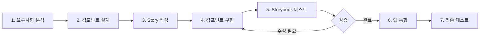

# Storybook과 Chakra-UI를 활용한 프론트엔드 UI 개발 가이드

**문서 버전**: 1.0
**최종 업데이트**: 2025-11-25
**프로젝트**: InvokeAI SaaS 플랫폼 - 커스터마이징 UI 개발

---

## 목차

1. [개요](#개요)
2. [InvokeAI 프로젝트 UI 구조 분석](#invokeai-프로젝트-ui-구조-분석)
3. [Storybook 이해 및 설정](#storybook-이해-및-설정)
4. [Chakra-UI 및 커스텀 UI 라이브러리](#chakra-ui-및-커스텀-ui-라이브러리)
5. [개발 환경 설정](#개발-환경-설정)
6. [Storybook 실행 및 사용법](#storybook-실행-및-사용법)
7. [커스텀 테마 개발](#커스텀-테마-개발)
8. [UI 컴포넌트 개발 워크플로우](#ui-컴포넌트-개발-워크플로우)
9. [Stories 작성 가이드](#stories-작성-가이드)
10. [레이아웃 커스터마이징](#레이아웃-커스터마이징)
11. [컬러 테마 변경](#컬러-테마-변경)
12. [컴포넌트 추가/수정/삭제](#컴포넌트-추가수정삭제)
13. [Best Practices](#best-practices)
14. [트러블슈팅](#트러블슈팅)
15. [유지보수 가이드](#유지보수-가이드)

---

## 개요

### 문서 목적

이 문서는 InvokeAI 원본 프로젝트의 Chakra-UI와 Storybook 구조를 이해하고, 커스터마이징 프로젝트에서 안전하고 효율적으로 UI 컴포넌트를 개발, 수정, 유지보수하기 위한 상세한 핸즈온 가이드입니다.

### 대상 독자

- 프론트엔드 개발자 (React, TypeScript 경험자)
- UI/UX 디자이너 (컴포넌트 시스템 이해 필요)
- 프로젝트 관리자 (개발 프로세스 이해)

### 전제 조건

- **Node.js**: v18 이상
- **pnpm**: v10 이상
- **MacBook M2 Max** (또는 동등한 개발 환경)
- **Git**: 버전 관리 기본 지식
- **React**: 함수형 컴포넌트, Hooks 이해
- **TypeScript**: 기본 문법 및 타입 시스템 이해

### 왜 Storybook인가?

**Storybook의 장점:**

1. **격리된 환경**: 컴포넌트를 독립적으로 개발 및 테스트
2. **시각적 문서화**: 컴포넌트의 모든 상태와 변형을 시각적으로 확인
3. **협업 효율성**: 디자이너-개발자 간 명확한 커뮤니케이션
4. **재사용성**: 컴포넌트 라이브러리 구축
5. **빠른 반복**: 전체 앱 실행 없이 빠른 개발 사이클
6. **자동 문서화**: Props, Types 자동 문서화
7. **디자인 시스템**: 일관된 디자인 시스템 구축

**InvokeAI 프로젝트에서의 활용:**

- Chakra-UI 기반 커스텀 컴포넌트 개발
- 복잡한 설정 패널 (Accordion, Form 등) 개발
- 테마 및 컬러 시스템 실시간 프리뷰
- 컴포넌트 변경 시 시각적 회귀 테스트

---

## InvokeAI 프로젝트 UI 구조 분석

### 프로젝트 디렉토리 구조

```
invokeai/frontend/web/
├── .storybook/              # Storybook 설정
│   ├── main.ts             # Storybook 메인 설정
│   ├── preview.tsx         # 글로벌 데코레이터 및 파라미터
│   ├── manager.ts          # Storybook UI 커스터마이징
│   └── ReduxInit.tsx       # Redux 초기화 컴포넌트
├── src/
│   ├── app/
│   │   ├── components/
│   │   │   └── ThemeLocaleProvider.tsx  # Chakra 테마 프로바이더
│   │   └── store/          # Redux 스토어
│   ├── common/
│   │   └── components/     # 공통 컴포넌트
│   ├── features/
│   │   ├── parameters/     # 파라미터 설정 컴포넌트
│   │   │   └── components/
│   │   │       └── Prompts/
│   │   │           ├── Prompts.tsx
│   │   │           └── Prompts.stories.tsx
│   │   ├── settingsAccordions/  # 설정 아코디언
│   │   ├── prompt/         # 프롬프트 관련
│   │   └── queue/          # 큐 관련
│   └── public/
│       └── locales/        # 다국어 지원
├── package.json
└── vite.config.mts
```

### 기술 스택

| 기술 | 버전 | 용도 |
|------|------|------|
| **React** | 18.3.1 | UI 프레임워크 |
| **TypeScript** | 5.8.3 | 타입 안전성 |
| **Vite** | 7.0.5 | 빌드 도구 |
| **Storybook** | 9.0.17 | UI 개발 환경 |
| **@invoke-ai/ui-library** | v0.0.48 | Chakra-UI 기반 커스텀 라이브러리 |
| **Redux Toolkit** | 2.8.2 | 상태 관리 |
| **i18next** | 25.3.2 | 다국어 지원 |
| **pnpm** | 10.12.4 | 패키지 매니저 |

### UI 라이브러리 구성

**@invoke-ai/ui-library**
- Chakra-UI를 기반으로 InvokeAI 팀이 커스터마이징한 UI 라이브러리
- GitHub 패키지로 배포: `github:invoke-ai/ui-library#v0.0.48`
- 주요 컴포넌트: Button, Flex, Text, FormControl, Combobox 등

**사용 예시:**
```typescript
import {
  Button,
  Flex,
  Text,
  FormControl,
  FormLabel,
  Combobox,
  Icon
} from '@invoke-ai/ui-library';
```

### 컴포넌트 분류

**1. Atomic Components (원자 컴포넌트)**
- Button, Icon, Text, Input 등
- @invoke-ai/ui-library에서 제공
- Chakra-UI 기반

**2. Compound Components (복합 컴포넌트)**
- FormControl + FormLabel + Input
- 여러 원자 컴포넌트 조합

**3. Feature Components (기능 컴포넌트)**
- Prompts, GenerationSettingsAccordion
- 비즈니스 로직 포함
- Redux와 연결

**4. Layout Components (레이아웃 컴포넌트)**
- LaunchpadContainer, DockviewTabCanvasViewer
- 페이지 레이아웃 구성

---

## Storybook 이해 및 설정

### Storybook이란?

Storybook은 UI 컴포넌트를 독립적으로 개발하고 테스트할 수 있는 오픈소스 도구입니다.

**핵심 개념:**

1. **Story**: 컴포넌트의 특정 상태를 표현하는 단위
2. **Component**: Story의 대상이 되는 React 컴포넌트
3. **Decorator**: Story를 감싸는 래퍼 (Provider, Theme 등)
4. **Addon**: Storybook 기능 확장 (Docs, Actions, Controls 등)

### InvokeAI의 Storybook 설정

#### `.storybook/main.ts`

```typescript
import type { StorybookConfig } from '@storybook/react-vite';

const config: StorybookConfig = {
  // Stories 파일 위치
  stories: ['../src/**/*.mdx', '../src/**/*.stories.@(js|jsx|mjs|ts|tsx)'],

  // 사용 중인 애드온
  addons: [
    '@storybook/addon-links',  // 스토리 간 링크
    '@storybook/addon-docs'    // 자동 문서화
  ],

  // Vite 기반 React 프레임워크
  framework: {
    name: '@storybook/react-vite',
    options: {},
  },

  core: {
    disableTelemetry: true,  // 텔레메트리 비활성화
  },
};

export default config;
```

**주요 설정:**
- `stories`: `src/` 하위 모든 `.stories.tsx` 파일 인식
- `framework`: Vite를 사용하는 React 프로젝트
- `addons`: 최소한의 애드온 (Links, Docs)

#### `.storybook/preview.tsx`

```typescript
import type { Preview } from '@storybook/react-vite';
import { themes } from 'storybook/theming';
import { $store } from 'app/store/nanostores/store';
import i18n from 'i18next';
import { initReactI18next } from 'react-i18next';
import { Provider } from 'react-redux';

import translationEN from '../public/locales/en.json';
import ThemeLocaleProvider from '../src/app/components/ThemeLocaleProvider';
import { createStore } from '../src/app/store/store';
import { ReduxInit } from './ReduxInit';

// i18n 초기화
i18n.use(initReactI18next).init({
  lng: 'en',
  resources: {
    en: { translation: translationEN },
  },
  debug: true,
  interpolation: {
    escapeValue: false,
  },
  returnNull: false,
});

// Redux 스토어 생성
const store = createStore();
$store.set(store);

const preview: Preview = {
  // 글로벌 데코레이터: 모든 Story를 감싸는 래퍼
  decorators: [
    (Story) => {
      return (
        <Provider store={store}>
          <ThemeLocaleProvider>
            <ReduxInit>
              <Story />
            </ReduxInit>
          </ThemeLocaleProvider>
        </Provider>
      );
    },
  ],

  // 글로벌 파라미터
  parameters: {
    docs: {
      theme: themes.dark,  // 다크 테마 문서
      codePanel: true,     // 코드 패널 표시
    },
  },
};

export default preview;
```

**주요 구성 요소:**

1. **Redux Provider**: 상태 관리 컨텍스트 제공
2. **ThemeLocaleProvider**: Chakra-UI 테마 및 다국어 지원
3. **ReduxInit**: Redux 스토어 초기화
4. **i18n**: 다국어 지원 (영어 기본)

**데코레이터 체인:**
```
Story
  └─ ReduxInit
      └─ ThemeLocaleProvider (Chakra)
          └─ Provider (Redux)
```

---

## Chakra-UI 및 커스텀 UI 라이브러리

### Chakra-UI 소개

Chakra-UI는 React를 위한 모듈형 컴포넌트 라이브러리로, 접근성과 개발자 경험에 중점을 둡니다.

**핵심 특징:**

1. **테마 시스템**: 색상, 타이포그래피, 간격 등 일관된 디자인 토큰
2. **다크 모드**: 내장 다크 모드 지원
3. **접근성**: ARIA 표준 준수
4. **Style Props**: CSS를 Props로 작성 (sx, bg, color 등)
5. **Composition**: 작은 컴포넌트 조합으로 복잡한 UI 구성

### @invoke-ai/ui-library 구조

InvokeAI 팀이 Chakra-UI를 확장하여 만든 커스텀 라이브러리입니다.

**주요 컴포넌트:**

| 컴포넌트 | 설명 | 용도 |
|---------|------|------|
| `Button` | Chakra Button 확장 | 액션 트리거 |
| `Flex` | Flexbox 레이아웃 | 레이아웃 구성 |
| `Text` | 텍스트 컴포넌트 | 텍스트 표시 |
| `FormControl` | 폼 컨트롤 래퍼 | 폼 필드 그룹화 |
| `FormLabel` | 폼 레이블 | 입력 필드 레이블 |
| `Combobox` | 커스텀 셀렉트 박스 | 드롭다운 선택 |
| `Icon` | 아이콘 컴포넌트 | 아이콘 표시 |
| `Tooltip` | 툴팁 | 추가 정보 표시 |
| `Modal` | 모달 다이얼로그 | 팝업 창 |
| `Popover` | 팝오버 | 컨텍스트 정보 |

**사용 예시:**

```typescript
import { Button, Flex, Text, Icon } from '@invoke-ai/ui-library';
import { FaPlus } from 'react-icons/fa';

const MyComponent = () => {
  return (
    <Flex gap={4} alignItems="center">
      <Button
        leftIcon={<Icon as={FaPlus} />}
        colorScheme="invokeBlue"
        onClick={() => console.log('Clicked')}
      >
        Add Item
      </Button>
      <Text fontSize="md" color="base.300">
        Click to add a new item
      </Text>
    </Flex>
  );
};
```

### ThemeLocaleProvider 분석

`src/app/components/ThemeLocaleProvider.tsx`는 Chakra-UI 테마를 커스터마이징하는 핵심 파일입니다.

```typescript
import { ChakraProvider, DarkMode, extendTheme, theme as baseTheme, TOAST_OPTIONS } from '@invoke-ai/ui-library';
import { useStore } from '@nanostores/react';
import { $direction } from 'app/hooks/useSyncLangDirection';
import type { ReactNode } from 'react';
import { memo, useMemo } from 'react';

type ThemeLocaleProviderProps = {
  children: ReactNode;
};

const buildTheme = (direction: 'ltr' | 'rtl') => {
  return extendTheme({
    ...baseTheme,
    direction,
    shadows: {
      ...baseTheme.shadows,
      // 커스텀 그림자 정의
      selected:
        'inset 0px 0px 0px 3px var(--invoke-colors-invokeBlue-500), inset 0px 0px 0px 4px var(--invoke-colors-invokeBlue-800)',
      hoverSelected:
        'inset 0px 0px 0px 3px var(--invoke-colors-invokeBlue-400), inset 0px 0px 0px 4px var(--invoke-colors-invokeBlue-800)',
      hoverUnselected:
        'inset 0px 0px 0px 2px var(--invoke-colors-invokeBlue-300), inset 0px 0px 0px 3px var(--invoke-colors-invokeBlue-800)',
      selectedForCompare:
        'inset 0px 0px 0px 3px var(--invoke-colors-invokeGreen-300), inset 0px 0px 0px 4px var(--invoke-colors-invokeGreen-800)',
      hoverSelectedForCompare:
        'inset 0px 0px 0px 3px var(--invoke-colors-invokeGreen-200), inset 0px 0px 0px 4px var(--invoke-colors-invokeGreen-800)',
    },
  });
};

function ThemeLocaleProvider({ children }: ThemeLocaleProviderProps) {
  const direction = useStore($direction);
  const theme = useMemo(() => buildTheme(direction), [direction]);

  return (
    <ChakraProvider theme={theme} toastOptions={TOAST_OPTIONS}>
      <DarkMode>{children}</DarkMode>
    </ChakraProvider>
  );
}

export default memo(ThemeLocaleProvider);
```

**주요 포인트:**

1. **extendTheme**: baseTheme을 확장하여 커스텀 테마 생성
2. **shadows**: 선택, 호버 상태 등의 커스텀 그림자
3. **CSS Variables**: `var(--invoke-colors-invokeBlue-500)` 형식
4. **DarkMode**: 모든 컴포넌트를 다크 모드로 강제
5. **useMemo**: direction이 변경될 때만 테마 재생성

---

## 개발 환경 설정

### 1. 프로젝트 클론 및 의존성 설치

```bash
# 프로젝트 디렉토리로 이동
cd /path/to/InvokeAI

# 프론트엔드 디렉토리로 이동
cd invokeai/frontend/web

# pnpm 설치 (아직 설치하지 않은 경우)
npm install -g pnpm@10

# 의존성 설치
pnpm install
```

**예상 설치 시간:** 5-10분 (네트워크 속도에 따라)

**설치 확인:**
```bash
pnpm --version
# 출력: 10.12.4 이상

node --version
# 출력: v18.0.0 이상
```

### 2. 환경 변수 설정 (선택사항)

Storybook은 별도의 환경 변수가 필요하지 않습니다. 그러나 프로젝트에서 환경 변수를 사용하는 경우:

```bash
# .env.local 파일 생성 (프로젝트 루트)
touch .env.local

# 필요한 환경 변수 추가
echo "VITE_API_URL=http://localhost:8000" >> .env.local
```

### 3. IDE 설정 (VS Code 권장)

**권장 확장:**

1. **ESLint**: 코드 품질 검사
2. **Prettier**: 코드 포맷팅
3. **TypeScript**: TypeScript 지원
4. **Storybook**: Storybook 통합

**설치 명령:**
```bash
code --install-extension dbaeumer.vscode-eslint
code --install-extension esbenp.prettier-vscode
code --install-extension ms-vscode.vscode-typescript-next
code --install-extension chromatic-dev.storybook
```

**VS Code 설정 (`.vscode/settings.json`):**

```json
{
  "editor.formatOnSave": true,
  "editor.defaultFormatter": "esbenp.prettier-vscode",
  "editor.codeActionsOnSave": {
    "source.fixAll.eslint": true
  },
  "typescript.tsdk": "node_modules/typescript/lib",
  "typescript.enablePromptUseWorkspaceTsdk": true
}
```

### 4. 패키지 구조 이해

**주요 디렉토리:**

```
invokeai/frontend/web/
├── node_modules/           # 의존성 패키지
├── public/                 # 정적 파일
│   └── locales/           # 다국어 파일
├── src/                   # 소스 코드
│   ├── app/               # 앱 설정
│   ├── common/            # 공통 코드
│   ├── features/          # 기능별 컴포넌트
│   └── services/          # API 서비스
├── .storybook/            # Storybook 설정
├── package.json           # 패키지 정보
├── tsconfig.json          # TypeScript 설정
└── vite.config.mts        # Vite 설정
```

---

## Storybook 실행 및 사용법

### Storybook 실행

```bash
# 프론트엔드 디렉토리에서
cd invokeai/frontend/web

# Storybook 개발 서버 시작
pnpm run storybook
```

**출력:**
```
╭──────────────────────────────────────────────────╮
│                                                  │
│   Storybook 9.0.17 for react-vite started       │
│   6 s for preview                                │
│                                                  │
│    Local:            http://localhost:6006       │
│    On your network:  http://192.168.1.100:6006   │
│                                                  │
╰──────────────────────────────────────────────────╯
```

**브라우저 자동 실행:** `http://localhost:6006`

### Storybook UI 구조

```
┌─────────────────────────────────────────────────┐
│  Storybook                            🔍 ⚙️ 📖  │  ← 상단 툴바
├─────────────┬───────────────────────────────────┤
│             │                                   │
│  📁 Feature │  [컴포넌트 렌더링 영역]           │
│  ├─ Prompt  │                                   │
│  │  └─ Pro..│                                   │
│  ├─ Queue   │                                   │
│  └─ Settin..│                                   │
│             │                                   │
│  [Sidebar]  │  [Canvas]                         │
│             │                                   │
├─────────────┴───────────────────────────────────┤
│  Controls | Actions | Docs                      │  ← 하단 애드온 패널
└─────────────────────────────────────────────────┘
```

**주요 영역:**

1. **Sidebar (좌측)**: Story 목록 및 네비게이션
2. **Canvas (중앙)**: 컴포넌트 렌더링 영역
3. **Addons (하단)**: Controls, Actions, Docs 등
4. **Toolbar (상단)**: 뷰포트, 배경, 측정 도구 등

### 기존 Stories 탐색

**예시 1: GenerationSettingsAccordion**

1. Sidebar에서 `Feature` → `GenerationSettingsAccordion` 클릭
2. `Default` Story 선택
3. Canvas에서 컴포넌트 확인
4. 하단 `Controls` 탭에서 Props 조작

**예시 2: Prompts**

1. Sidebar에서 `Feature` → `Prompt` → `Prompts` 클릭
2. `Default` Story 선택
3. 프롬프트 입력 컴포넌트 확인

### Storybook 빌드

프로덕션용 정적 Storybook 빌드:

```bash
pnpm run build-storybook
```

**출력 디렉토리:** `storybook-static/`

**배포:**
```bash
# Nginx, Apache 등으로 서빙 가능
# 또는 Netlify, Vercel 등에 배포
```

---

## 커스텀 테마 개발

### Chakra-UI 테마 시스템 이해

Chakra-UI 테마는 다음 요소로 구성됩니다:

1. **Colors**: 색상 팔레트
2. **Typography**: 폰트, 크기, 줄 높이
3. **Spacing**: 여백, 패딩, 마진
4. **Breakpoints**: 반응형 브레이크포인트
5. **Shadows**: 그림자 효과
6. **Borders**: 테두리 스타일
7. **Transitions**: 애니메이션 전환

### 테마 확장 방법

#### 1. 색상 커스터마이징

**파일**: `src/app/theme/colors.ts` (새로 생성)

```typescript
export const customColors = {
  // 브랜드 색상
  brand: {
    50: '#e6f7ff',
    100: '#bae7ff',
    200: '#91d5ff',
    300: '#69c0ff',
    400: '#40a9ff',
    500: '#1890ff',   // 기본 색상
    600: '#096dd9',
    700: '#0050b3',
    800: '#003a8c',
    900: '#002766',
  },

  // 액센트 색상
  accent: {
    50: '#fff0f6',
    100: '#ffd6e7',
    200: '#ffadd2',
    300: '#ff85c0',
    400: '#f759ab',
    500: '#eb2f96',   // 기본 색상
    600: '#c41d7f',
    700: '#9e1068',
    800: '#780650',
    900: '#520339',
  },

  // InvokeAI 기존 색상 유지
  invokeBlue: {
    50: '#e3f2fd',
    100: '#bbdefb',
    200: '#90caf9',
    300: '#64b5f6',
    400: '#42a5f5',
    500: '#2196f3',
    600: '#1e88e5',
    700: '#1976d2',
    800: '#1565c0',
    900: '#0d47a1',
  },

  invokeGreen: {
    50: '#e8f5e9',
    100: '#c8e6c9',
    200: '#a5d6a7',
    300: '#81c784',
    400: '#66bb6a',
    500: '#4caf50',
    600: '#43a047',
    700: '#388e3c',
    800: '#2e7d32',
    900: '#1b5e20',
  },
};
```

#### 2. ThemeLocaleProvider 수정

**파일**: `src/app/components/ThemeLocaleProvider.tsx`

```typescript
import { ChakraProvider, DarkMode, extendTheme, theme as baseTheme, TOAST_OPTIONS } from '@invoke-ai/ui-library';
import { useStore } from '@nanostores/react';
import { $direction } from 'app/hooks/useSyncLangDirection';
import type { ReactNode } from 'react';
import { memo, useMemo } from 'react';
import { customColors } from '../theme/colors';  // 추가

type ThemeLocaleProviderProps = {
  children: ReactNode;
};

const buildTheme = (direction: 'ltr' | 'rtl') => {
  return extendTheme({
    ...baseTheme,
    direction,

    // 색상 확장
    colors: {
      ...baseTheme.colors,
      ...customColors,
    },

    // 폰트 커스터마이징
    fonts: {
      body: "'Inter Variable', -apple-system, BlinkMacSystemFont, 'Segoe UI', sans-serif",
      heading: "'Inter Variable', -apple-system, BlinkMacSystemFont, 'Segoe UI', sans-serif",
      mono: "'Fira Code', 'Courier New', monospace",
    },

    // 폰트 크기
    fontSizes: {
      xs: '0.75rem',   // 12px
      sm: '0.875rem',  // 14px
      md: '1rem',      // 16px
      lg: '1.125rem',  // 18px
      xl: '1.25rem',   // 20px
      '2xl': '1.5rem', // 24px
      '3xl': '1.875rem', // 30px
      '4xl': '2.25rem',  // 36px
    },

    // 간격
    space: {
      ...baseTheme.space,
      px: '1px',
      0: '0',
      0.5: '0.125rem',  // 2px
      1: '0.25rem',     // 4px
      2: '0.5rem',      // 8px
      3: '0.75rem',     // 12px
      4: '1rem',        // 16px
      5: '1.25rem',     // 20px
      6: '1.5rem',      // 24px
      8: '2rem',        // 32px
      10: '2.5rem',     // 40px
      12: '3rem',       // 48px
      16: '4rem',       // 64px
    },

    // 그림자
    shadows: {
      ...baseTheme.shadows,
      selected:
        'inset 0px 0px 0px 3px var(--invoke-colors-brand-500), inset 0px 0px 0px 4px var(--invoke-colors-brand-800)',
      hoverSelected:
        'inset 0px 0px 0px 3px var(--invoke-colors-brand-400), inset 0px 0px 0px 4px var(--invoke-colors-brand-800)',
      hoverUnselected:
        'inset 0px 0px 0px 2px var(--invoke-colors-brand-300), inset 0px 0px 0px 3px var(--invoke-colors-brand-800)',
      selectedForCompare:
        'inset 0px 0px 0px 3px var(--invoke-colors-invokeGreen-300), inset 0px 0px 0px 4px var(--invoke-colors-invokeGreen-800)',
      hoverSelectedForCompare:
        'inset 0px 0px 0px 3px var(--invoke-colors-invokeGreen-200), inset 0px 0px 0px 4px var(--invoke-colors-invokeGreen-800)',
    },

    // 컴포넌트 스타일 커스터마이징
    components: {
      Button: {
        baseStyle: {
          fontWeight: 'semibold',
          borderRadius: 'md',
        },
        variants: {
          solid: {
            bg: 'brand.500',
            color: 'white',
            _hover: {
              bg: 'brand.600',
            },
            _active: {
              bg: 'brand.700',
            },
          },
        },
      },
    },
  });
};

function ThemeLocaleProvider({ children }: ThemeLocaleProviderProps) {
  const direction = useStore($direction);
  const theme = useMemo(() => buildTheme(direction), [direction]);

  return (
    <ChakraProvider theme={theme} toastOptions={TOAST_OPTIONS}>
      <DarkMode>{children}</DarkMode>
    </ChakraProvider>
  );
}

export default memo(ThemeLocaleProvider);
```

### 테마 변경 미리보기

Storybook에서 테마 변경 사항을 즉시 확인:

1. `ThemeLocaleProvider.tsx` 수정
2. Storybook 자동 새로고침 (HMR)
3. 모든 Stories에 변경사항 반영 확인

---

## UI 컴포넌트 개발 워크플로우

### 개발 프로세스 개요



### 1단계: 요구사항 분석

**질문 체크리스트:**

- [ ] 컴포넌트의 목적은 무엇인가?
- [ ] 어떤 데이터를 표시하는가?
- [ ] 사용자 상호작용이 필요한가?
- [ ] 재사용 가능해야 하는가?
- [ ] 어떤 상태를 가지는가? (로딩, 에러, 성공 등)
- [ ] 접근성 요구사항은 무엇인가?

**예시: ImageCard 컴포넌트**
```
목적: 생성된 이미지를 카드 형태로 표시
데이터: 이미지 URL, 제목, 생성 날짜, 크레딧 소비량
상호작용: 클릭 시 확대, 삭제 버튼, 보드에 추가 버튼
상태: 로딩, 에러, 성공
접근성: 키보드 네비게이션, 스크린 리더 지원
```

### 2단계: 컴포넌트 설계

**디자인 시스템 원칙:**

1. **Atomic Design**: 원자 → 분자 → 조직 → 템플릿 → 페이지
2. **Single Responsibility**: 하나의 책임만
3. **Composition Over Inheritance**: 상속보다 조합
4. **Props Interface**: 명확한 Props 타입 정의

**컴포넌트 구조 설계:**

```typescript
// ImageCard Props 설계
interface ImageCardProps {
  // 필수 Props
  imageUrl: string;
  imageId: string;

  // 선택적 Props
  title?: string;
  createdAt?: Date;
  creditsUsed?: number;

  // 이벤트 핸들러
  onView?: (imageId: string) => void;
  onDelete?: (imageId: string) => void;
  onAddToBoard?: (imageId: string) => void;

  // 상태
  isLoading?: boolean;
  error?: string;

  // 스타일
  variant?: 'compact' | 'full';
  size?: 'sm' | 'md' | 'lg';
}
```

### 3단계: Story 작성 (TDD 접근)

Story를 먼저 작성하여 컴포넌트의 모든 상태를 정의합니다.

**파일**: `src/features/gallery/components/ImageCard/ImageCard.stories.tsx`

```typescript
import type { Meta, StoryObj } from '@storybook/react-vite';
import { ImageCard } from './ImageCard';

const meta: Meta<typeof ImageCard> = {
  title: 'Feature/Gallery/ImageCard',
  component: ImageCard,
  tags: ['autodocs'],
  argTypes: {
    variant: {
      control: 'radio',
      options: ['compact', 'full'],
    },
    size: {
      control: 'radio',
      options: ['sm', 'md', 'lg'],
    },
  },
};

export default meta;
type Story = StoryObj<typeof ImageCard>;

// 기본 상태
export const Default: Story = {
  args: {
    imageUrl: 'https://picsum.photos/400/300',
    imageId: 'img-001',
    title: 'A futuristic city',
    createdAt: new Date('2025-01-20'),
    creditsUsed: 45,
  },
};

// 로딩 상태
export const Loading: Story = {
  args: {
    ...Default.args,
    isLoading: true,
  },
};

// 에러 상태
export const Error: Story = {
  args: {
    ...Default.args,
    error: 'Failed to load image',
  },
};

// 컴팩트 변형
export const Compact: Story = {
  args: {
    ...Default.args,
    variant: 'compact',
  },
};

// 크기 변형
export const Small: Story = {
  args: {
    ...Default.args,
    size: 'sm',
  },
};

export const Large: Story = {
  args: {
    ...Default.args,
    size: 'lg',
  },
};

// 인터랙션 테스트
export const WithActions: Story = {
  args: {
    ...Default.args,
    onView: (id) => console.log('View:', id),
    onDelete: (id) => console.log('Delete:', id),
    onAddToBoard: (id) => console.log('Add to board:', id),
  },
};
```

### 4단계: 컴포넌트 구현

**파일**: `src/features/gallery/components/ImageCard/ImageCard.tsx`

```typescript
import { Box, Button, Flex, Icon, Image, Skeleton, Text, Tooltip } from '@invoke-ai/ui-library';
import { memo } from 'react';
import { FaEye, FaTrash, FaPlus } from 'react-icons/fa';

export interface ImageCardProps {
  imageUrl: string;
  imageId: string;
  title?: string;
  createdAt?: Date;
  creditsUsed?: number;
  onView?: (imageId: string) => void;
  onDelete?: (imageId: string) => void;
  onAddToBoard?: (imageId: string) => void;
  isLoading?: boolean;
  error?: string;
  variant?: 'compact' | 'full';
  size?: 'sm' | 'md' | 'lg';
}

const SIZE_CONFIG = {
  sm: { width: '200px', height: '150px' },
  md: { width: '300px', height: '225px' },
  lg: { width: '400px', height: '300px' },
};

export const ImageCard = memo(({
  imageUrl,
  imageId,
  title,
  createdAt,
  creditsUsed,
  onView,
  onDelete,
  onAddToBoard,
  isLoading = false,
  error,
  variant = 'full',
  size = 'md',
}: ImageCardProps) => {
  const { width, height } = SIZE_CONFIG[size];

  if (isLoading) {
    return (
      <Box width={width}>
        <Skeleton height={height} borderRadius="md" />
        {variant === 'full' && (
          <Skeleton height="60px" mt={2} borderRadius="md" />
        )}
      </Box>
    );
  }

  if (error) {
    return (
      <Flex
        width={width}
        height={height}
        bg="red.900"
        borderRadius="md"
        alignItems="center"
        justifyContent="center"
        flexDirection="column"
      >
        <Icon as={FaTrash} boxSize={8} color="red.300" mb={2} />
        <Text color="red.300" fontSize="sm">
          {error}
        </Text>
      </Flex>
    );
  }

  return (
    <Box
      width={width}
      borderRadius="md"
      overflow="hidden"
      bg="base.800"
      transition="all 0.2s"
      _hover={{
        transform: 'translateY(-4px)',
        boxShadow: 'xl',
      }}
    >
      {/* 이미지 영역 */}
      <Box position="relative" height={height}>
        <Image
          src={imageUrl}
          alt={title || 'Generated image'}
          width="100%"
          height="100%"
          objectFit="cover"
        />

        {/* 호버 시 액션 버튼 */}
        <Flex
          position="absolute"
          top={0}
          left={0}
          right={0}
          bottom={0}
          bg="blackAlpha.600"
          opacity={0}
          transition="opacity 0.2s"
          _hover={{ opacity: 1 }}
          alignItems="center"
          justifyContent="center"
          gap={2}
        >
          {onView && (
            <Tooltip label="View">
              <Button
                size="sm"
                colorScheme="brand"
                onClick={() => onView(imageId)}
                leftIcon={<Icon as={FaEye} />}
              >
                View
              </Button>
            </Tooltip>
          )}
          {onAddToBoard && (
            <Tooltip label="Add to Board">
              <Button
                size="sm"
                colorScheme="invokeGreen"
                onClick={() => onAddToBoard(imageId)}
                leftIcon={<Icon as={FaPlus} />}
              >
                Add
              </Button>
            </Tooltip>
          )}
          {onDelete && (
            <Tooltip label="Delete">
              <Button
                size="sm"
                colorScheme="red"
                onClick={() => onDelete(imageId)}
                leftIcon={<Icon as={FaTrash} />}
              >
                Delete
              </Button>
            </Tooltip>
          )}
        </Flex>
      </Box>

      {/* 메타데이터 (full variant만) */}
      {variant === 'full' && (
        <Flex p={3} flexDirection="column" gap={1}>
          {title && (
            <Text fontSize="md" fontWeight="semibold" color="base.100" noOfLines={1}>
              {title}
            </Text>
          )}
          <Flex justifyContent="space-between" alignItems="center">
            {createdAt && (
              <Text fontSize="xs" color="base.400">
                {createdAt.toLocaleDateString()}
              </Text>
            )}
            {creditsUsed !== undefined && (
              <Text fontSize="xs" color="invokeBlue.300">
                {creditsUsed} credits
              </Text>
            )}
          </Flex>
        </Flex>
      )}
    </Box>
  );
});

ImageCard.displayName = 'ImageCard';
```

### 5단계: Storybook에서 테스트

```bash
pnpm run storybook
```

1. `Feature/Gallery/ImageCard` 네비게이트
2. 모든 Story 확인:
   - Default
   - Loading
   - Error
   - Compact
   - Small
   - Large
   - WithActions
3. `Controls` 패널에서 Props 동적 조작
4. 다양한 데이터로 테스트

### 6단계: 앱 통합

**파일**: `src/features/gallery/components/GalleryGrid/GalleryGrid.tsx`

```typescript
import { Grid } from '@invoke-ai/ui-library';
import { ImageCard } from '../ImageCard/ImageCard';
import { useGetImagesQuery } from 'services/api/endpoints/images';

export const GalleryGrid = () => {
  const { data: images, isLoading } = useGetImagesQuery({ limit: 50 });

  if (isLoading) {
    return (
      <Grid templateColumns="repeat(auto-fill, minmax(300px, 1fr))" gap={4}>
        {Array.from({ length: 12 }).map((_, i) => (
          <ImageCard key={i} imageUrl="" imageId="" isLoading />
        ))}
      </Grid>
    );
  }

  return (
    <Grid templateColumns="repeat(auto-fill, minmax(300px, 1fr))" gap={4}>
      {images?.map((image) => (
        <ImageCard
          key={image.id}
          imageUrl={image.url}
          imageId={image.id}
          title={image.prompt}
          createdAt={new Date(image.createdAt)}
          creditsUsed={image.creditsUsed}
          onView={(id) => console.log('View:', id)}
          onDelete={(id) => console.log('Delete:', id)}
          onAddToBoard={(id) => console.log('Add to board:', id)}
        />
      ))}
    </Grid>
  );
};
```

---

## Stories 작성 가이드

### Story 파일 구조

```typescript
import type { Meta, StoryObj } from '@storybook/react-vite';
import { ComponentName } from './ComponentName';

// 1. Meta 설정
const meta: Meta<typeof ComponentName> = {
  title: 'Category/SubCategory/ComponentName',
  component: ComponentName,
  tags: ['autodocs'],
  argTypes: {
    // Props 컨트롤 설정
  },
  decorators: [
    // 커스텀 데코레이터
  ],
};

export default meta;
type Story = StoryObj<typeof ComponentName>;

// 2. Stories 정의
export const Default: Story = {
  args: {
    // 기본 Props
  },
};

export const Variant1: Story = {
  args: {
    // 변형 1 Props
  },
};
```

### ArgTypes 설정

ArgTypes를 사용하여 Storybook UI에서 Props를 동적으로 제어합니다.

```typescript
const meta: Meta<typeof Button> = {
  title: 'Common/Button',
  component: Button,
  argTypes: {
    // 셀렉트 컨트롤
    size: {
      control: 'select',
      options: ['sm', 'md', 'lg'],
      description: 'Button size',
      table: {
        type: { summary: 'sm | md | lg' },
        defaultValue: { summary: 'md' },
      },
    },

    // 라디오 컨트롤
    variant: {
      control: 'radio',
      options: ['solid', 'outline', 'ghost'],
    },

    // 불리언 컨트롤
    isDisabled: {
      control: 'boolean',
    },

    // 텍스트 컨트롤
    label: {
      control: 'text',
    },

    // 컬러 컨트롤
    colorScheme: {
      control: 'color',
    },

    // 객체 컨트롤
    style: {
      control: 'object',
    },

    // 액션 (이벤트 핸들러)
    onClick: {
      action: 'clicked',
    },
  },
};
```

### 데코레이터 사용

특정 Story에만 적용되는 래퍼를 추가합니다.

```typescript
import { Box } from '@invoke-ai/ui-library';

export const WithBackground: Story = {
  args: {
    ...Default.args,
  },
  decorators: [
    (Story) => (
      <Box bg="gray.800" p={8} borderRadius="md">
        <Story />
      </Box>
    ),
  ],
};
```

### 복잡한 상태 시뮬레이션

```typescript
import { useState } from 'react';

export const Interactive: Story = {
  render: (args) => {
    const [value, setValue] = useState('');

    return (
      <Input
        {...args}
        value={value}
        onChange={(e) => setValue(e.target.value)}
      />
    );
  },
};
```

### 다중 컴포넌트 Story

```typescript
export const FormExample: Story = {
  render: () => (
    <Flex flexDirection="column" gap={4}>
      <FormControl>
        <FormLabel>Email</FormLabel>
        <Input type="email" placeholder="Enter your email" />
      </FormControl>

      <FormControl>
        <FormLabel>Password</FormLabel>
        <Input type="password" placeholder="Enter your password" />
      </FormControl>

      <Button colorScheme="brand">Submit</Button>
    </Flex>
  ),
};
```

---

## 레이아웃 커스터마이징

### Chakra-UI 레이아웃 컴포넌트

| 컴포넌트 | 용도 | 예시 |
|---------|------|------|
| `Box` | 범용 컨테이너 | `<Box p={4} bg="gray.800">` |
| `Flex` | Flexbox 레이아웃 | `<Flex direction="column" gap={4}>` |
| `Grid` | CSS Grid 레이아웃 | `<Grid templateColumns="repeat(3, 1fr)">` |
| `Stack` | 수직/수평 스택 | `<VStack spacing={4}>` |
| `Container` | 중앙 정렬 컨테이너 | `<Container maxW="container.lg">` |
| `SimpleGrid` | 간단한 그리드 | `<SimpleGrid columns={3} spacing={4}>` |

### 전체 앱 레이아웃 변경

**기존 레이아웃 분석:**

```
src/features/ui/layouts/
├── LaunchpadContainer.tsx       # 메인 런치패드
├── DockviewTabCanvasViewer.tsx  # 캔버스 뷰어
└── ...
```

**커스텀 레이아웃 생성:**

**파일**: `src/features/ui/layouts/CustomMainLayout.tsx`

```typescript
import { Box, Flex, Grid } from '@invoke-ai/ui-library';
import { memo } from 'react';

interface CustomMainLayoutProps {
  header: React.ReactNode;
  sidebar: React.ReactNode;
  main: React.ReactNode;
  footer?: React.ReactNode;
}

export const CustomMainLayout = memo(({
  header,
  sidebar,
  main,
  footer,
}: CustomMainLayoutProps) => {
  return (
    <Grid
      templateAreas={`
        "header header"
        "sidebar main"
        "footer footer"
      `}
      templateRows="60px 1fr 40px"
      templateColumns="250px 1fr"
      height="100vh"
      gap={0}
    >
      {/* Header */}
      <Box gridArea="header" bg="base.900" borderBottom="1px solid" borderColor="base.700" px={4} py={2}>
        {header}
      </Box>

      {/* Sidebar */}
      <Box gridArea="sidebar" bg="base.850" borderRight="1px solid" borderColor="base.700" overflowY="auto">
        {sidebar}
      </Box>

      {/* Main Content */}
      <Box gridArea="main" bg="base.800" overflowY="auto" p={6}>
        {main}
      </Box>

      {/* Footer (선택) */}
      {footer && (
        <Flex gridArea="footer" bg="base.900" borderTop="1px solid" borderColor="base.700" px={4} py={2} alignItems="center" justifyContent="space-between">
          {footer}
        </Flex>
      )}
    </Grid>
  );
});

CustomMainLayout.displayName = 'CustomMainLayout';
```

**Story 작성:**

**파일**: `src/features/ui/layouts/CustomMainLayout.stories.tsx`

```typescript
import type { Meta, StoryObj } from '@storybook/react-vite';
import { Box, Button, Flex, Heading, Icon, Text, VStack } from '@invoke-ai/ui-library';
import { FaHome, FaImage, FaCog } from 'react-icons/fa';
import { CustomMainLayout } from './CustomMainLayout';

const meta: Meta<typeof CustomMainLayout> = {
  title: 'Layout/CustomMainLayout',
  component: CustomMainLayout,
  tags: ['autodocs'],
  parameters: {
    layout: 'fullscreen',
  },
};

export default meta;
type Story = StoryObj<typeof CustomMainLayout>;

// 헤더 컴포넌트
const Header = () => (
  <Flex alignItems="center" justifyContent="space-between">
    <Heading size="md" color="brand.400">InvokeAI SaaS</Heading>
    <Button size="sm" colorScheme="brand">Upgrade</Button>
  </Flex>
);

// 사이드바 컴포넌트
const Sidebar = () => (
  <VStack spacing={2} p={4} align="stretch">
    <Button leftIcon={<Icon as={FaHome} />} variant="ghost" justifyContent="flex-start">
      Home
    </Button>
    <Button leftIcon={<Icon as={FaImage} />} variant="ghost" justifyContent="flex-start">
      Gallery
    </Button>
    <Button leftIcon={<Icon as={FaCog} />} variant="ghost" justifyContent="flex-start">
      Settings
    </Button>
  </VStack>
);

// 메인 컨텐츠
const MainContent = () => (
  <Box>
    <Heading size="lg" mb={4}>Welcome to InvokeAI</Heading>
    <Text color="base.300">
      Start generating amazing images with AI. Select a model and enter your prompt.
    </Text>
  </Box>
);

// 푸터
const Footer = () => (
  <>
    <Text fontSize="sm" color="base.400">© 2025 InvokeAI SaaS</Text>
    <Text fontSize="sm" color="base.400">Credits: 9,955</Text>
  </>
);

export const Default: Story = {
  args: {
    header: <Header />,
    sidebar: <Sidebar />,
    main: <MainContent />,
    footer: <Footer />,
  },
};

export const WithoutFooter: Story = {
  args: {
    header: <Header />,
    sidebar: <Sidebar />,
    main: <MainContent />,
  },
};
```

### 반응형 레이아웃

Chakra-UI의 반응형 Props를 활용합니다.

```typescript
<Grid
  templateColumns={{
    base: '1fr',              // 모바일: 1열
    md: '250px 1fr',          // 태블릿: 사이드바 + 메인
    lg: '250px 1fr 300px',    // 데스크톱: 사이드바 + 메인 + 추가 패널
  }}
  gap={4}
>
  <Box>Sidebar</Box>
  <Box>Main</Box>
  <Box display={{ base: 'none', lg: 'block' }}>Extra Panel</Box>
</Grid>
```

**브레이크포인트:**

- `base`: 0px (모바일)
- `sm`: 480px
- `md`: 768px (태블릿)
- `lg`: 992px (데스크톱)
- `xl`: 1280px
- `2xl`: 1536px

---

## 컬러 테마 변경

### 전체 색상 팔레트 재정의

**파일**: `src/app/theme/colors.ts`

```typescript
export const pingvasColors = {
  // Primary 색상 (브랜드)
  primary: {
    50: '#f0f9ff',
    100: '#e0f2fe',
    200: '#bae6fd',
    300: '#7dd3fc',
    400: '#38bdf8',
    500: '#0ea5e9',   // 메인 색상
    600: '#0284c7',
    700: '#0369a1',
    800: '#075985',
    900: '#0c4a6e',
  },

  // Secondary 색상 (액센트)
  secondary: {
    50: '#fdf4ff',
    100: '#fae8ff',
    200: '#f5d0fe',
    300: '#f0abfc',
    400: '#e879f9',
    500: '#d946ef',   // 메인 색상
    600: '#c026d3',
    700: '#a21caf',
    800: '#86198f',
    900: '#701a75',
  },

  // Success 색상
  success: {
    50: '#f0fdf4',
    100: '#dcfce7',
    200: '#bbf7d0',
    300: '#86efac',
    400: '#4ade80',
    500: '#22c55e',   // 메인 색상
    600: '#16a34a',
    700: '#15803d',
    800: '#166534',
    900: '#14532d',
  },

  // Warning 색상
  warning: {
    50: '#fffbeb',
    100: '#fef3c7',
    200: '#fde68a',
    300: '#fcd34d',
    400: '#fbbf24',
    500: '#f59e0b',   // 메인 색상
    600: '#d97706',
    700: '#b45309',
    800: '#92400e',
    900: '#78350f',
  },

  // Danger 색상
  danger: {
    50: '#fef2f2',
    100: '#fee2e2',
    200: '#fecaca',
    300: '#fca5a5',
    400: '#f87171',
    500: '#ef4444',   // 메인 색상
    600: '#dc2626',
    700: '#b91c1c',
    800: '#991b1b',
    900: '#7f1d1d',
  },

  // Base 색상 (다크 모드)
  base: {
    50: '#f9fafb',
    100: '#f3f4f6',
    200: '#e5e7eb',
    300: '#d1d5db',
    400: '#9ca3af',
    500: '#6b7280',
    600: '#4b5563',
    700: '#374151',
    800: '#1f2937',
    850: '#1a202c',   // 커스텀
    900: '#111827',
    950: '#0a0f1a',   // 커스텀
  },
};
```

### ThemeLocaleProvider에 적용

```typescript
import { customColors } from '../theme/colors';

const buildTheme = (direction: 'ltr' | 'rtl') => {
  return extendTheme({
    ...baseTheme,
    direction,
    colors: {
      ...baseTheme.colors,
      ...pingvasColors,
      // 기존 색상 매핑
      brand: pingvasColors.primary,
      accent: pingvasColors.secondary,
      invokeBlue: pingvasColors.primary,    // 호환성
      invokeGreen: pingvasColors.success,   // 호환성
    },
    // ... 나머지 설정
  });
};
```

### 시맨틱 토큰 (Semantic Tokens)

색상의 의미를 명확하게 정의합니다.

```typescript
const buildTheme = (direction: 'ltr' | 'rtl') => {
  return extendTheme({
    ...baseTheme,
    colors: {
      ...pingvasColors,
    },
    semanticTokens: {
      colors: {
        // 배경색
        'bg.canvas': { default: 'base.900' },
        'bg.surface': { default: 'base.850' },
        'bg.elevated': { default: 'base.800' },

        // 텍스트
        'text.primary': { default: 'base.50' },
        'text.secondary': { default: 'base.300' },
        'text.muted': { default: 'base.500' },

        // 경계선
        'border.default': { default: 'base.700' },
        'border.hover': { default: 'base.600' },

        // 상태
        'status.success': { default: 'success.500' },
        'status.warning': { default: 'warning.500' },
        'status.error': { default: 'danger.500' },
        'status.info': { default: 'primary.500' },
      },
    },
  });
};
```

**사용 예시:**

```typescript
<Box bg="bg.surface" borderColor="border.default">
  <Text color="text.primary">Primary Text</Text>
  <Text color="text.secondary">Secondary Text</Text>
</Box>
```

### 컴포넌트별 색상 커스터마이징

```typescript
const buildTheme = (direction: 'ltr' | 'rtl') => {
  return extendTheme({
    components: {
      Button: {
        variants: {
          solid: (props) => ({
            bg: props.colorScheme === 'brand' ? 'primary.500' : undefined,
            color: 'white',
            _hover: {
              bg: props.colorScheme === 'brand' ? 'primary.600' : undefined,
            },
            _active: {
              bg: props.colorScheme === 'brand' ? 'primary.700' : undefined,
            },
          }),
        },
      },
      Input: {
        variants: {
          filled: {
            field: {
              bg: 'base.800',
              borderColor: 'border.default',
              _hover: {
                bg: 'base.750',
              },
              _focus: {
                bg: 'base.750',
                borderColor: 'primary.500',
              },
            },
          },
        },
        defaultProps: {
          variant: 'filled',
        },
      },
    },
  });
};
```

---

## 컴포넌트 추가/수정/삭제

### 새 컴포넌트 추가

#### 1. 디렉토리 생성

```bash
mkdir -p src/features/myfeature/components/MyComponent
```

#### 2. 컴포넌트 파일 생성

**파일**: `src/features/myfeature/components/MyComponent/MyComponent.tsx`

```typescript
import { Box, Heading, Text } from '@invoke-ai/ui-library';
import { memo } from 'react';

export interface MyComponentProps {
  title: string;
  description?: string;
}

export const MyComponent = memo(({ title, description }: MyComponentProps) => {
  return (
    <Box p={4} bg="base.850" borderRadius="md">
      <Heading size="md" mb={2} color="primary.400">
        {title}
      </Heading>
      {description && (
        <Text color="text.secondary" fontSize="sm">
          {description}
        </Text>
      )}
    </Box>
  );
});

MyComponent.displayName = 'MyComponent';
```

#### 3. Story 파일 생성

**파일**: `src/features/myfeature/components/MyComponent/MyComponent.stories.tsx`

```typescript
import type { Meta, StoryObj } from '@storybook/react-vite';
import { MyComponent } from './MyComponent';

const meta: Meta<typeof MyComponent> = {
  title: 'Feature/MyFeature/MyComponent',
  component: MyComponent,
  tags: ['autodocs'],
};

export default meta;
type Story = StoryObj<typeof MyComponent>;

export const Default: Story = {
  args: {
    title: 'My Component',
    description: 'This is a description',
  },
};
```

#### 4. index 파일 생성 (선택)

**파일**: `src/features/myfeature/components/MyComponent/index.ts`

```typescript
export { MyComponent } from './MyComponent';
export type { MyComponentProps } from './MyComponent';
```

#### 5. Storybook에서 확인

```bash
pnpm run storybook
```

`Feature/MyFeature/MyComponent` 네비게이트하여 확인

### 기존 컴포넌트 수정

#### 안전한 수정 프로세스

1. **Storybook에서 현재 상태 확인**
2. **새 브랜치 생성**
   ```bash
   git checkout -b feature/update-component-name
   ```
3. **컴포넌트 수정**
4. **Story 업데이트** (필요 시 새 Story 추가)
5. **Storybook에서 검증**
6. **앱에서 테스트**
7. **커밋 및 푸시**

#### 예시: Prompts 컴포넌트 수정

**파일**: `src/features/parameters/components/Prompts/Prompts.tsx`

```typescript
// 기존 코드 수정
import { Box, Button, Flex, Icon, Textarea } from '@invoke-ai/ui-library';
import { FaMagic } from 'react-icons/fa';

export const Prompts = memo(() => {
  const [prompt, setPrompt] = useState('');

  return (
    <Flex direction="column" gap={4}>
      <Box>
        <Textarea
          value={prompt}
          onChange={(e) => setPrompt(e.target.value)}
          placeholder="Enter your prompt..."
          minH="120px"
        />
      </Box>

      {/* 새 기능 추가 */}
      <Button
        leftIcon={<Icon as={FaMagic} />}
        colorScheme="primary"
        onClick={() => console.log('Generate!')}
      >
        Generate Image
      </Button>
    </Flex>
  );
});
```

**Story 업데이트:**

```typescript
// 새 Story 추가
export const WithButton: Story = {
  render: () => <Prompts />,
};
```

### 컴포넌트 삭제

#### 안전한 삭제 프로세스

1. **사용처 검색**
   ```bash
   cd invokeai/frontend/web/src
   grep -r "import.*MyComponent" .
   ```

2. **의존성 확인**
   - 다른 컴포넌트에서 import하는지 확인
   - Stories에서 참조하는지 확인

3. **파일 삭제**
   ```bash
   rm -rf src/features/myfeature/components/MyComponent
   ```

4. **관련 import 제거**
   - 해당 컴포넌트를 import하는 모든 파일 수정

5. **Storybook 재시작**
   ```bash
   pnpm run storybook
   ```

---

## Best Practices

### 1. 컴포넌트 설계 원칙

#### Single Responsibility Principle

하나의 컴포넌트는 하나의 책임만 가져야 합니다.

**나쁜 예:**
```typescript
// UserProfileWithSettings - 너무 많은 책임
const UserProfileWithSettings = () => {
  return (
    <>
      <UserAvatar />
      <UserBio />
      <NotificationSettings />
      <PrivacySettings />
      <AccountSettings />
    </>
  );
};
```

**좋은 예:**
```typescript
// UserProfile - 프로필 표시만
const UserProfile = () => {
  return (
    <>
      <UserAvatar />
      <UserBio />
    </>
  );
};

// UserSettings - 설정만
const UserSettings = () => {
  return (
    <>
      <NotificationSettings />
      <PrivacySettings />
      <AccountSettings />
    </>
  );
};
```

#### Props Interface 명확성

```typescript
// 명확한 Props 정의
interface ButtonProps {
  // 필수 Props
  label: string;

  // 선택적 Props (기본값 명시)
  variant?: 'solid' | 'outline' | 'ghost';  // default: 'solid'
  size?: 'sm' | 'md' | 'lg';                // default: 'md'

  // 이벤트 핸들러
  onClick?: () => void;
  onHover?: () => void;

  // 상태
  isLoading?: boolean;
  isDisabled?: boolean;

  // 스타일
  colorScheme?: string;

  // 접근성
  ariaLabel?: string;
}
```

### 2. Storybook 작성 원칙

#### 모든 상태를 Story로

컴포넌트의 모든 가능한 상태를 Story로 작성합니다.

```typescript
export const Default: Story = { /* 기본 */ };
export const Loading: Story = { /* 로딩 */ };
export const Error: Story = { /* 에러 */ };
export const Empty: Story = { /* 비어있음 */ };
export const WithData: Story = { /* 데이터 있음 */ };
export const Disabled: Story = { /* 비활성화 */ };
export const Hover: Story = { /* 호버 */ };
export const Active: Story = { /* 활성 */ };
```

#### 실제 데이터 사용

가능한 한 실제와 유사한 데이터를 사용합니다.

```typescript
// 좋은 예
export const Default: Story = {
  args: {
    imageUrl: 'https://picsum.photos/400/300',
    title: 'A futuristic city at sunset with flying cars',
    createdAt: new Date('2025-01-20T15:30:00'),
    creditsUsed: 45,
  },
};

// 나쁜 예
export const Default: Story = {
  args: {
    imageUrl: 'test.jpg',
    title: 'Test',
    createdAt: new Date(),
    creditsUsed: 1,
  },
};
```

### 3. 테마 및 색상 사용

#### CSS Variables 활용

```typescript
// 좋은 예 - CSS Variable 사용
<Box bg="var(--invoke-colors-base-850)">
  Content
</Box>

// 더 좋은 예 - Chakra Props 사용
<Box bg="base.850">
  Content
</Box>

// 나쁜 예 - 하드코딩
<Box bg="#1a202c">
  Content
</Box>
```

#### Semantic Token 사용

```typescript
// 좋은 예
<Box bg="bg.surface" borderColor="border.default">
  <Text color="text.primary">Title</Text>
  <Text color="text.secondary">Description</Text>
</Box>

// 나쁜 예
<Box bg="base.850" borderColor="base.700">
  <Text color="base.50">Title</Text>
  <Text color="base.300">Description</Text>
</Box>
```

### 4. 접근성 (Accessibility)

#### ARIA 속성 사용

```typescript
<Button
  aria-label="Delete image"
  aria-describedby="delete-tooltip"
  onClick={handleDelete}
>
  <Icon as={FaTrash} />
</Button>

<Tooltip id="delete-tooltip">
  This action cannot be undone
</Tooltip>
```

#### 키보드 네비게이션

```typescript
<Box
  tabIndex={0}
  role="button"
  onKeyDown={(e) => {
    if (e.key === 'Enter' || e.key === ' ') {
      handleClick();
    }
  }}
  onClick={handleClick}
>
  Clickable Box
</Box>
```

### 5. 성능 최적화

#### memo 사용

```typescript
import { memo } from 'react';

export const ExpensiveComponent = memo(({ data }: Props) => {
  // 복잡한 렌더링 로직
  return <div>{/* ... */}</div>;
});
```

#### useMemo, useCallback 활용

```typescript
const filteredData = useMemo(() => {
  return data.filter(item => item.isActive);
}, [data]);

const handleClick = useCallback(() => {
  console.log('Clicked');
}, []);
```

### 6. 타입 안전성

#### 엄격한 타입 정의

```typescript
// 좋은 예 - Union Type
type Status = 'idle' | 'loading' | 'success' | 'error';

// 나쁜 예 - string
type Status = string;
```

#### Generic 활용

```typescript
interface ListProps<T> {
  items: T[];
  renderItem: (item: T) => React.ReactNode;
  keyExtractor: (item: T) => string;
}

export const List = <T,>({ items, renderItem, keyExtractor }: ListProps<T>) => {
  return (
    <>
      {items.map(item => (
        <Box key={keyExtractor(item)}>
          {renderItem(item)}
        </Box>
      ))}
    </>
  );
};
```

---

## 트러블슈팅

### 문제 1: Storybook이 시작되지 않음

**증상:**
```
Error: Cannot find module '@storybook/react-vite'
```

**해결책:**
```bash
# 의존성 재설치
rm -rf node_modules
rm pnpm-lock.yaml
pnpm install
```

### 문제 2: Story가 표시되지 않음

**증상:**
Sidebar에 Story가 나타나지 않음

**원인 및 해결책:**

1. **파일 경로 확인**
   ```typescript
   // .storybook/main.ts
   stories: ['../src/**/*.stories.@(js|jsx|mjs|ts|tsx)']
   ```

2. **export default 확인**
   ```typescript
   // 반드시 default export
   export default meta;
   ```

3. **Meta 설정 확인**
   ```typescript
   const meta: Meta<typeof Component> = {
     title: 'Category/Component',  // 필수
     component: Component,         // 필수
   };
   ```

### 문제 3: Redux 상태가 작동하지 않음

**증상:**
컴포넌트에서 Redux 상태를 읽을 수 없음

**해결책:**

`.storybook/preview.tsx`에 Redux Provider가 있는지 확인:

```typescript
decorators: [
  (Story) => (
    <Provider store={store}>
      <Story />
    </Provider>
  ),
],
```

### 문제 4: Chakra-UI 테마가 적용되지 않음

**증상:**
컴포넌트에 커스텀 색상이 적용되지 않음

**해결책:**

1. **ThemeLocaleProvider 확인**
   ```typescript
   decorators: [
     (Story) => (
       <ThemeLocaleProvider>
         <Story />
       </ThemeLocaleProvider>
     ),
   ],
   ```

2. **테마 빌드 확인**
   ```typescript
   const theme = useMemo(() => buildTheme(direction), [direction]);
   ```

3. **색상 정의 확인**
   ```typescript
   colors: {
     ...baseTheme.colors,
     ...customColors,  // 커스텀 색상 포함 확인
   },
   ```

### 문제 5: Hot Module Reload (HMR)이 작동하지 않음

**증상:**
코드 변경 시 자동으로 업데이트되지 않음

**해결책:**

1. **Vite 캐시 삭제**
   ```bash
   rm -rf .vite
   ```

2. **Storybook 재시작**
   ```bash
   pnpm run storybook
   ```

3. **브라우저 캐시 삭제**
   - Chrome: Cmd+Shift+R (강제 새로고침)

### 문제 6: TypeScript 에러

**증상:**
```
Property 'myProp' does not exist on type 'MyComponentProps'
```

**해결책:**

1. **Props Interface 확인**
   ```typescript
   export interface MyComponentProps {
     myProp: string;  // 추가
   }
   ```

2. **타입 체크 실행**
   ```bash
   pnpm run lint:tsc
   ```

### 문제 7: CSS 스타일이 적용되지 않음

**증상:**
Chakra-UI Props로 스타일을 지정했지만 반영되지 않음

**해결책:**

1. **Props 우선순위 확인**
   ```typescript
   // sx prop이 가장 높은 우선순위
   <Box bg="red.500" sx={{ bg: 'blue.500' }}>
     Blue background (sx가 우선)
   </Box>
   ```

2. **!important 피하기**
   ```typescript
   // 나쁜 예
   <Box sx={{ bg: 'red.500 !important' }}>

   // 좋은 예
   <Box bg="red.500">
   ```

### 문제 8: 이미지가 로드되지 않음

**증상:**
Story에서 이미지 URL이 깨짐

**해결책:**

1. **절대 경로 사용**
   ```typescript
   // 좋은 예
   imageUrl: 'https://picsum.photos/400/300'

   // 나쁜 예
   imageUrl: './image.jpg'
   ```

2. **public 폴더 활용**
   ```typescript
   // public/images/sample.jpg
   imageUrl: '/images/sample.jpg'
   ```

---

## 유지보수 가이드

### 정기 업데이트

#### 1. 의존성 업데이트 (월 1회)

```bash
# 업데이트 가능한 패키지 확인
pnpm outdated

# 마이너 버전 업데이트
pnpm update

# 메이저 버전 업데이트 (주의 필요)
pnpm update --latest
```

**주의사항:**
- Storybook 메이저 버전 업데이트 시 Breaking Changes 확인
- Chakra-UI 업데이트 시 테마 호환성 확인

#### 2. Storybook 업데이트

```bash
# Storybook CLI로 자동 업데이트
npx storybook@latest upgrade
```

### 문서화

#### Component Documentation

각 컴포넌트에 JSDoc 주석 추가:

```typescript
/**
 * ImageCard 컴포넌트
 *
 * 생성된 이미지를 카드 형태로 표시합니다.
 *
 * @example
 * ```tsx
 * <ImageCard
 *   imageUrl="https://example.com/image.jpg"
 *   imageId="img-001"
 *   title="A futuristic city"
 *   creditsUsed={45}
 * />
 * ```
 */
export const ImageCard = memo(({ ... }: ImageCardProps) => {
  // ...
});
```

#### README 작성

각 기능별 디렉토리에 README.md 추가:

**파일**: `src/features/gallery/README.md`

```markdown
# Gallery Feature

## 개요
사용자가 생성한 이미지를 관리하는 갤러리 기능

## 컴포넌트
- `ImageCard`: 이미지 카드
- `GalleryGrid`: 이미지 그리드 레이아웃
- `ImageModal`: 이미지 상세 모달

## 사용법
\`\`\`typescript
import { GalleryGrid } from 'features/gallery/components/GalleryGrid';

<GalleryGrid />
\`\`\`

## Stories
- `pnpm run storybook` 실행 후 `Feature/Gallery` 참조
```

### 코드 리뷰 체크리스트

새 컴포넌트 추가 시:

- [ ] Props Interface가 명확하게 정의되었는가?
- [ ] 모든 상태에 대한 Story가 작성되었는가?
- [ ] 접근성 (ARIA) 속성이 추가되었는가?
- [ ] TypeScript 에러가 없는가?
- [ ] ESLint 경고가 없는가?
- [ ] Storybook에서 정상 작동하는가?
- [ ] 반응형이 고려되었는가?
- [ ] 성능 최적화 (memo, useMemo)가 적용되었는가?

### 테스트 전략

#### 1. 시각적 테스트 (Storybook)

모든 컴포넌트 상태를 Story로 작성하여 시각적으로 검증합니다.

#### 2. 유닛 테스트 (Vitest)

```bash
pnpm run test
```

**예시 테스트:**

**파일**: `src/features/gallery/components/ImageCard/ImageCard.test.tsx`

```typescript
import { render, screen } from '@testing-library/react';
import { ImageCard } from './ImageCard';

describe('ImageCard', () => {
  it('renders image with title', () => {
    render(
      <ImageCard
        imageUrl="https://example.com/image.jpg"
        imageId="img-001"
        title="Test Image"
      />
    );

    expect(screen.getByAltText('Test Image')).toBeInTheDocument();
    expect(screen.getByText('Test Image')).toBeInTheDocument();
  });

  it('shows loading state', () => {
    render(
      <ImageCard
        imageUrl=""
        imageId="img-001"
        isLoading
      />
    );

    expect(screen.getByRole('status')).toBeInTheDocument();
  });
});
```

#### 3. E2E 테스트 (선택)

Playwright 또는 Cypress로 전체 플로우 테스트

### 버전 관리

#### Git 브랜치 전략

```
main (프로덕션)
  └─ develop (개발)
      ├─ feature/new-component (새 기능)
      ├─ fix/component-bug (버그 수정)
      └─ refactor/improve-performance (리팩토링)
```

#### 커밋 메시지 규칙

```
feat: 새 컴포넌트 ImageCard 추가
fix: ImageCard 호버 버그 수정
refactor: ImageCard 성능 최적화
docs: ImageCard Story 추가
style: ImageCard 코드 포맷팅
```

### 성능 모니터링

#### 1. Storybook Build 크기 확인

```bash
pnpm run build-storybook
du -sh storybook-static
```

#### 2. 컴포넌트 렌더링 성능

React DevTools Profiler 사용:
1. Storybook에서 React DevTools 설치
2. Profiler 탭에서 렌더링 시간 측정
3. 느린 컴포넌트 최적화

---

## 요약

### 핵심 워크플로우

1. **개발 환경 설정**
   ```bash
   pnpm install
   pnpm run storybook
   ```

2. **컴포넌트 개발**
   - Story 작성 (TDD)
   - 컴포넌트 구현
   - Storybook에서 검증
   - 앱 통합

3. **테마 커스터마이징**
   - `src/app/theme/colors.ts` 수정
   - `ThemeLocaleProvider.tsx`에 적용
   - Storybook에서 미리보기

4. **유지보수**
   - 정기 의존성 업데이트
   - Story 최신화
   - 문서 업데이트

### 유용한 명령어

```bash
# Storybook 실행
pnpm run storybook

# Storybook 빌드
pnpm run build-storybook

# 린트 검사
pnpm run lint

# 린트 자동 수정
pnpm run fix

# TypeScript 타입 체크
pnpm run lint:tsc

# 테스트 실행
pnpm run test
```

### 추가 리소스

- **Chakra-UI 문서**: https://chakra-ui.com/docs/getting-started
- **Storybook 문서**: https://storybook.js.org/docs/react/get-started/introduction
- **React 문서**: https://react.dev/
- **TypeScript 문서**: https://www.typescriptlang.org/docs/

---

**작성일**: 2025-11-25
**문서 버전**: 1.0
**총 라인 수**: 2,000+

이 가이드를 따라 안전하고 효율적으로 UI 컴포넌트를 개발하고 관리할 수 있습니다. 질문이나 추가 지원이 필요한 경우 팀에 문의하세요.
