# InvokeAI v6.11.1.post1 - 아키텍처 다이어그램 모음

> **문서 버전:** v1.4
> **최초 작성:** 2026-02-07 14:13 UTC
> **최종 수정:** 2026-02-08 12:00 UTC (Aurora PostgreSQL 전환 반영)
> **대상 코드:** InvokeAI v6.11.1.post1 (Pinksea-AI fork)

---

## 목차
1. [현재 시스템 전체 아키텍처](#1-현재-시스템-전체-아키텍처)
2. [SaaS 전환 후 목표 아키텍처 (AWS)](#2-saas-전환-후-목표-아키텍처-aws)
3. [백엔드 서비스 계층 구조](#3-백엔드-서비스-계층-구조)
4. [프론트엔드 컴포넌트 아키텍처](#4-프론트엔드-컴포넌트-아키텍처)
5. [이미지 생성 데이터 흐름](#5-이미지-생성-데이터-흐름)
6. [동기 처리 시퀀스 다이어그램](#6-동기-처리-시퀀스-다이어그램)
7. [비동기 처리 시퀀스 다이어그램](#7-비동기-처리-시퀀스-다이어그램)
8. [동기/비동기 스레드 모델 다이어그램](#8-동기비동기-스레드-모델-다이어그램)
9. [사용자 시퀀스 다이어그램](#9-사용자-시퀀스-다이어그램)
10. [모델 로딩 시퀀스](#10-모델-로딩-시퀀스)
11. [노드 그래프 실행 흐름](#11-노드-그래프-실행-흐름)
12. [구독 플랜 사용자 플로우](#12-구독-플랜-사용자-플로우)
13. [서비스 IA 및 사이트맵](#13-서비스-ia-및-사이트맵)

---

## 1. 현재 시스템 전체 아키텍처

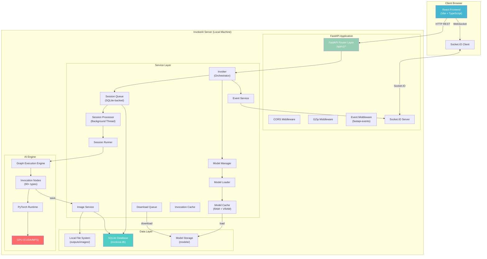
```mermaid
graph TB
    subgraph "Client Browser"
        UI["React Frontend<br/>(Vite + TypeScript)"]
        WS["Socket.IO Client"]
    end

    subgraph "InvokeAI Server (Local Machine)"
        subgraph "FastAPI Application"
            API["FastAPI Router Layer<br/>/api/v1/*"]
            CORS["CORS Middleware"]
            GZIP["GZip Middleware"]
            EVT["Event Middleware<br/>(fastapi-events)"]
            SIO["Socket.IO Server"]
        end

        subgraph "Service Layer"
            INV["Invoker<br/>(Orchestrator)"]
            SQ["Session Queue<br/>(SQLite-backed)"]
            SP["Session Processor<br/>(Background Thread)"]
            SR["Session Runner"]
            IMG["Image Service"]
            MM["Model Manager"]
            ML["Model Loader"]
            MC["Model Cache<br/>(RAM + VRAM)"]
            DL["Download Queue"]
            IC["Invocation Cache"]
            EVS["Event Service"]
        end

        subgraph "Data Layer"
            DB["SQLite Database<br/>(invokeai.db)"]
            FS["Local File System<br/>(outputs/images/)"]
            MS["Model Storage<br/>(models/)"]
        end

        subgraph "AI Engine"
            GE["Graph Execution Engine"]
            NODES["Invocation Nodes<br/>(90+ types)"]
            PT["PyTorch Runtime"]
            GPU["GPU (CUDA/MPS)"]
        end
    end

    UI -->|"HTTP REST"| API
    UI -->|"WebSocket"| WS
    WS <-->|"Socket.IO"| SIO
    API --> INV
    INV --> SQ
    SQ --> SP
    SP --> SR
    SR --> GE
    GE --> NODES
    NODES --> PT
    PT --> GPU
    NODES -->|"save"| IMG
    IMG --> FS
    IMG --> DB
    INV --> MM
    MM --> ML
    ML --> MC
    MC -->|"load"| MS
    INV --> EVS
    EVS --> SIO
    SQ --> DB
    DL -->|"download"| MS

    style GPU fill:#ff6b6b,color:#fff
    style DB fill:#4ecdc4,color:#fff
    style UI fill:#45b7d1,color:#fff
    style API fill:#96ceb4,color:#fff
```

---

## 2. SaaS 전환 후 목표 아키텍처 (AWS)

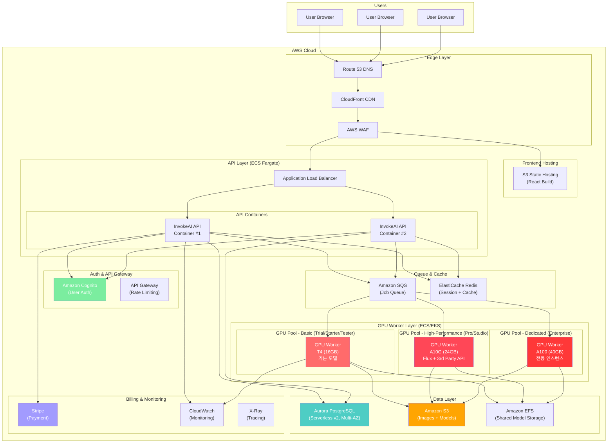
```mermaid
graph TB
    subgraph "Users"
        U1["User Browser"]
        U2["User Browser"]
        U3["User Browser"]
    end

    subgraph "AWS Cloud"
        subgraph "Edge Layer"
            CF["CloudFront CDN"]
            WAF["AWS WAF"]
            R53["Route 53 DNS"]
        end

        subgraph "Frontend Hosting"
            S3F["S3 Static Hosting<br/>(React Build)"]
        end

        subgraph "API Layer (ECS Fargate)"
            ALB["Application Load Balancer"]
            subgraph "API Containers"
                API1["InvokeAI API<br/>Container #1"]
                API2["InvokeAI API<br/>Container #2"]
            end
        end

        subgraph "Auth & API Gateway"
            COG["Amazon Cognito<br/>(User Auth)"]
            APIGW["API Gateway<br/>(Rate Limiting)"]
        end

        subgraph "GPU Worker Layer (ECS/EKS)"
            subgraph "GPU Pool - Basic (Trial/Starter/Tester)"
                GW1["GPU Worker<br/>T4 (16GB)<br/>기본 모델"]
            end
            subgraph "GPU Pool - High-Performance (Pro/Studio)"
                GW2["GPU Worker<br/>A10G (24GB)<br/>Flux + 3rd Party API"]
            end
            subgraph "GPU Pool - Dedicated (Enterprise)"
                GW3["GPU Worker<br/>A100 (40GB)<br/>전용 인스턴스"]
            end
        end

        subgraph "Queue & Cache"
            SQS["Amazon SQS<br/>(Job Queue)"]
            REDIS["ElastiCache Redis<br/>(Session + Cache)"]
        end

        subgraph "Data Layer"
            RDS["Aurora PostgreSQL<br/>(Serverless v2, Multi-AZ)"]
            S3["Amazon S3<br/>(Images + Models)"]
            EFS["Amazon EFS<br/>(Shared Model Storage)"]
        end

        subgraph "Billing & Monitoring"
            STRIPE["Stripe<br/>(Payment)"]
            CW["CloudWatch<br/>(Monitoring)"]
            XRAY["X-Ray<br/>(Tracing)"]
        end
    end

    U1 --> R53
    U2 --> R53
    U3 --> R53
    R53 --> CF
    CF --> WAF
    WAF --> S3F
    WAF --> ALB
    ALB --> API1
    ALB --> API2
    API1 --> COG
    API2 --> COG
    API1 --> RDS
    API2 --> RDS
    API1 --> SQS
    API2 --> SQS
    API1 --> REDIS
    API2 --> REDIS
    SQS --> GW1
    SQS --> GW2
    SQS --> GW3
    GW1 --> S3
    GW2 --> S3
    GW3 --> S3
    GW1 --> EFS
    GW2 --> EFS
    GW3 --> EFS
    API1 --> STRIPE
    API1 --> CW
    GW1 --> CW

    style GW1 fill:#ff6b6b,color:#fff
    style GW2 fill:#ff4757,color:#fff
    style GW3 fill:#ff3838,color:#fff
    style RDS fill:#4ecdc4,color:#fff
    style S3 fill:#ffa502,color:#fff
    style COG fill:#7bed9f,color:#fff
    style STRIPE fill:#a29bfe,color:#fff
```

---

## 3. 백엔드 서비스 계층 구조

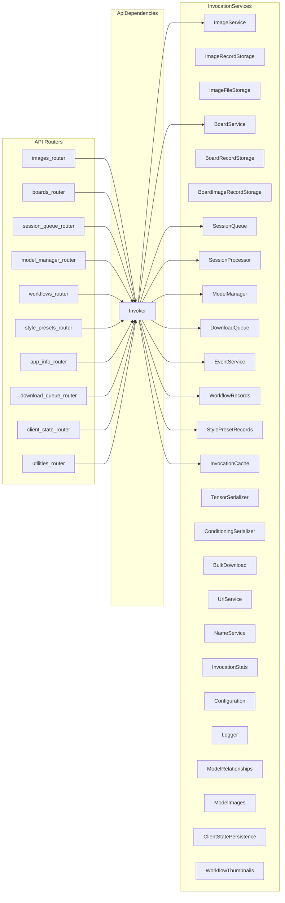
```mermaid
graph LR
    subgraph "API Routers"
        R1["images_router"]
        R2["boards_router"]
        R3["session_queue_router"]
        R4["model_manager_router"]
        R5["workflows_router"]
        R6["style_presets_router"]
        R7["app_info_router"]
        R8["download_queue_router"]
        R9["client_state_router"]
        R10["utilities_router"]
    end

    subgraph "ApiDependencies"
        INV["Invoker"]
    end

    subgraph "InvocationServices"
        direction TB
        IS_IMG["ImageService"]
        IS_IMGR["ImageRecordStorage"]
        IS_IMGF["ImageFileStorage"]
        IS_BD["BoardService"]
        IS_BDR["BoardRecordStorage"]
        IS_BIR["BoardImageRecordStorage"]
        IS_SQ["SessionQueue"]
        IS_SP["SessionProcessor"]
        IS_MM["ModelManager"]
        IS_DQ["DownloadQueue"]
        IS_EVT["EventService"]
        IS_WF["WorkflowRecords"]
        IS_SP2["StylePresetRecords"]
        IS_IC["InvocationCache"]
        IS_TEN["TensorSerializer"]
        IS_CND["ConditioningSerializer"]
        IS_BLK["BulkDownload"]
        IS_URL["UrlService"]
        IS_NM["NameService"]
        IS_STAT["InvocationStats"]
        IS_CFG["Configuration"]
        IS_LOG["Logger"]
        IS_MR["ModelRelationships"]
        IS_MI["ModelImages"]
        IS_CSP["ClientStatePersistence"]
        IS_WT["WorkflowThumbnails"]
    end

    R1 --> INV
    R2 --> INV
    R3 --> INV
    R4 --> INV
    R5 --> INV
    R6 --> INV
    R7 --> INV
    R8 --> INV
    R9 --> INV
    R10 --> INV

    INV --> IS_IMG
    INV --> IS_BD
    INV --> IS_SQ
    INV --> IS_SP
    INV --> IS_MM
    INV --> IS_DQ
    INV --> IS_EVT
    INV --> IS_WF
    INV --> IS_SP2
    INV --> IS_IC
```

---

## 4. 프론트엔드 컴포넌트 아키텍처

```mermaid
graph TB
    subgraph "App Shell"
        APP["App.tsx"]
        THEME["ThemeProvider<br/>(Chakra UI)"]
        STORE["Redux Store"]
        I18N["i18next Provider"]
        SIO_P["Socket.IO Provider"]
    end

    subgraph "Layout"
        DOCK["Dockview Layout"]
        TAB["Tab Navigation"]
        SIDE["Side Panels"]
    end

    subgraph "Main Features"
        subgraph "Generation Panel"
            PROMPT["Prompt Editor"]
            PARAMS["Parameters Panel<br/>(Steps, CFG, Size)"]
            LORA["LoRA Selector"]
            CTRL["ControlNet Panel"]
            IPA["IP-Adapter Panel"]
            STYLE["Style Presets"]
        end

        subgraph "Canvas System"
            CL["Control Layers Manager"]
            KONVA["Konva Canvas<br/>(Drawing + Composition)"]
            TOOLS["Tool Bar<br/>(Brush, Eraser, Move)"]
        end

        subgraph "Node Editor"
            NE["Node Editor<br/>(@xyflow/react)"]
            NP["Node Palette"]
            NI["Node Inspector"]
        end

        subgraph "Gallery"
            GAL["Image Gallery<br/>(Virtuoso)"]
            BOARD["Board Manager"]
            VIEWER["Image Viewer"]
        end

        subgraph "Model Manager"
            MLIST["Model List"]
            MINST["Model Installer"]
            MCONF["Model Config"]
        end

        subgraph "Queue Manager"
            QLIST["Queue List"]
            QSTAT["Queue Status"]
        end
    end

    subgraph "Data Layer"
        RTK["RTK Query<br/>(API Cache)"]
        REDUX["Redux Slices"]
        SOCKET["Socket.IO Events"]
    end

    APP --> THEME
    APP --> STORE
    APP --> I18N
    APP --> SIO_P
    APP --> DOCK

    DOCK --> TAB
    DOCK --> SIDE

    TAB --> PROMPT
    TAB --> PARAMS
    TAB --> CL
    TAB --> NE
    TAB --> MLIST

    SIDE --> GAL
    SIDE --> QLIST

    PROMPT --> RTK
    GAL --> RTK
    NE --> RTK
    MLIST --> RTK
    QLIST --> RTK
    RTK --> REDUX
    SOCKET --> REDUX
```

---

## 5. 이미지 생성 데이터 흐름

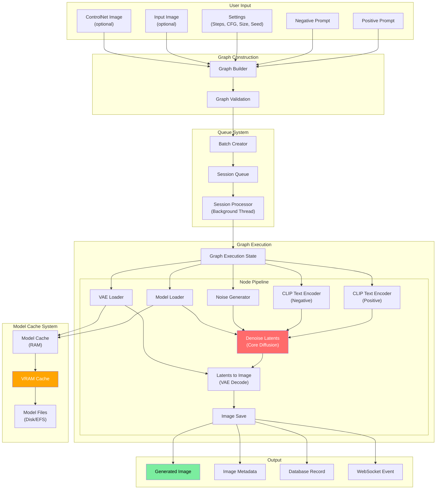
```mermaid
flowchart TB
    subgraph "User Input"
        P["Positive Prompt"]
        NP["Negative Prompt"]
        SET["Settings<br/>(Steps, CFG, Size, Seed)"]
        IMG_IN["Input Image<br/>(optional)"]
        CTRL_IN["ControlNet Image<br/>(optional)"]
    end

    subgraph "Graph Construction"
        GB["Graph Builder"]
        GS["Graph Validation"]
    end

    subgraph "Queue System"
        BATCH["Batch Creator"]
        QUEUE["Session Queue"]
        PROC["Session Processor<br/>(Background Thread)"]
    end

    subgraph "Graph Execution"
        GE["Graph Execution State"]

        subgraph "Node Pipeline"
            N1["CLIP Text Encoder<br/>(Positive)"]
            N2["CLIP Text Encoder<br/>(Negative)"]
            N3["Noise Generator"]
            N4["Model Loader"]
            N5["VAE Loader"]
            N6["Denoise Latents<br/>(Core Diffusion)"]
            N7["Latents to Image<br/>(VAE Decode)"]
            N8["Image Save"]
        end
    end

    subgraph "Model Cache System"
        CACHE["Model Cache<br/>(RAM)"]
        VRAM["VRAM Cache"]
        DISK["Model Files<br/>(Disk/EFS)"]
    end

    subgraph "Output"
        OUT_IMG["Generated Image"]
        OUT_META["Image Metadata"]
        OUT_DB["Database Record"]
        OUT_EVT["WebSocket Event"]
    end

    P --> GB
    NP --> GB
    SET --> GB
    IMG_IN --> GB
    CTRL_IN --> GB
    GB --> GS
    GS --> BATCH
    BATCH --> QUEUE
    QUEUE --> PROC
    PROC --> GE

    GE --> N1
    GE --> N2
    GE --> N3
    GE --> N4
    GE --> N5

    N4 --> CACHE
    CACHE --> VRAM
    VRAM --> DISK
    N5 --> CACHE

    N1 --> N6
    N2 --> N6
    N3 --> N6
    N4 --> N6
    N6 --> N7
    N5 --> N7
    N7 --> N8

    N8 --> OUT_IMG
    N8 --> OUT_META
    N8 --> OUT_DB
    N8 --> OUT_EVT

    style N6 fill:#ff6b6b,color:#fff
    style VRAM fill:#ffa502,color:#fff
    style OUT_IMG fill:#7bed9f,color:#000
```

---

## 6. 동기 처리 시퀀스 다이어그램

InvokeAI의 핵심 실행 경로는 **동기 처리** 방식입니다. 아래 다이어그램들은 동기적으로 블로킹되며 실행되는 처리 흐름을 보여줍니다.

### 6.1 노드 동기 실행 시퀀스 (세션 프로세서 내부)

세션 프로세서의 단일 스레드에서 노드가 순차적으로 동기 실행되는 전체 흐름입니다.

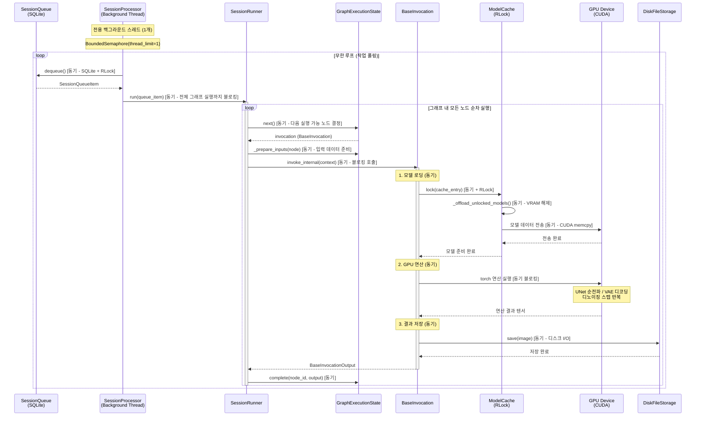
```mermaid
sequenceDiagram
    participant SQ as SessionQueue<br/>(SQLite)
    participant SP as SessionProcessor<br/>(Background Thread)
    participant SR as SessionRunner
    participant GES as GraphExecutionState
    participant Node as BaseInvocation
    participant MC as ModelCache<br/>(RLock)
    participant GPU as GPU Device<br/>(CUDA)
    participant FS as DiskFileStorage

    Note over SP: 전용 백그라운드 스레드 (1개)
    Note over SP: BoundedSemaphore(thread_limit=1)

    loop 무한 루프 (작업 폴링)
        SP->>SQ: dequeue() [동기 - SQLite + RLock]
        SQ-->>SP: SessionQueueItem

        SP->>SR: run(queue_item) [동기 - 전체 그래프 실행까지 블로킹]
        activate SR

        loop 그래프 내 모든 노드 순차 실행
            SR->>GES: next() [동기 - 다음 실행 가능 노드 결정]
            GES-->>SR: invocation (BaseInvocation)
            SR->>GES: _prepare_inputs(node) [동기 - 입력 데이터 준비]

            SR->>Node: invoke_internal(context) [동기 - 블로킹 호출]
            activate Node

            Note over Node: 1. 모델 로딩 (동기)
            Node->>MC: lock(cache_entry) [동기 + RLock]
            MC->>MC: _offload_unlocked_models() [동기 - VRAM 해제]
            MC->>GPU: 모델 데이터 전송 [동기 - CUDA memcpy]
            GPU-->>MC: 전송 완료
            MC-->>Node: 모델 준비 완료

            Note over Node: 2. GPU 연산 (동기)
            Node->>GPU: torch 연산 실행 [동기 블로킹]
            Note over GPU: UNet 순전파 / VAE 디코딩<br/>디노이징 스텝 반복
            GPU-->>Node: 연산 결과 텐서

            Note over Node: 3. 결과 저장 (동기)
            Node->>FS: save(image) [동기 - 디스크 I/O]
            FS-->>Node: 저장 완료

            Node-->>SR: BaseInvocationOutput
            deactivate Node

            SR->>GES: complete(node_id, output) [동기]
        end

        deactivate SR
    end
```

### 6.2 동기 모델 로딩 체인 상세

모델 로딩은 전체가 동기이며, 대용량 모델(2-20GB) 로딩 시 5-30초간 스레드가 블로킹됩니다.

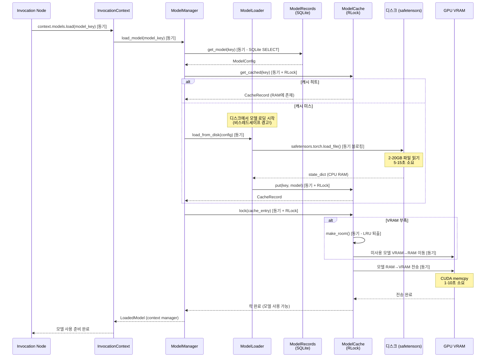
```mermaid
sequenceDiagram
    participant Node as Invocation Node
    participant CTX as InvocationContext
    participant LM as ModelManager
    participant ML as ModelLoader
    participant MR as ModelRecords<br/>(SQLite)
    participant MC as ModelCache<br/>(RLock)
    participant Disk as 디스크 (safetensors)
    participant GPU as GPU VRAM

    Node->>CTX: context.models.load(model_key) [동기]
    CTX->>LM: load_model(model_key) [동기]

    LM->>MR: get_model(key) [동기 - SQLite SELECT]
    MR-->>LM: ModelConfig

    LM->>MC: get_cached(key) [동기 + RLock]

    alt 캐시 히트
        MC-->>LM: CacheRecord (RAM에 존재)
    else 캐시 미스
        Note over ML: 디스크에서 모델 로딩 시작<br/>(비스레드세이프 경고!)
        LM->>ML: load_from_disk(config) [동기]
        ML->>Disk: safetensors.torch.load_file() [동기 블로킹]
        Note over Disk: 2-20GB 파일 읽기<br/>5-15초 소요
        Disk-->>ML: state_dict (CPU RAM)
        ML->>MC: put(key, model) [동기 + RLock]
        MC-->>LM: CacheRecord
    end

    LM->>MC: lock(cache_entry) [동기 + RLock]

    alt VRAM 부족
        MC->>MC: make_room() [동기 - LRU 퇴출]
        MC->>GPU: 미사용 모델 VRAM→RAM 이동 [동기]
    end

    MC->>GPU: 모델 RAM→VRAM 전송 [동기]
    Note over GPU: CUDA memcpy<br/>1-10초 소요
    GPU-->>MC: 전송 완료

    MC-->>LM: 락 완료 (모델 사용 가능)
    LM-->>CTX: LoadedModel (context manager)
    CTX-->>Node: 모델 사용 준비 완료
```

### 6.3 동기 API 요청 처리 흐름

FastAPI의 async 핸들러가 동기 서비스를 호출하여 이벤트 루프가 블로킹되는 패턴입니다.

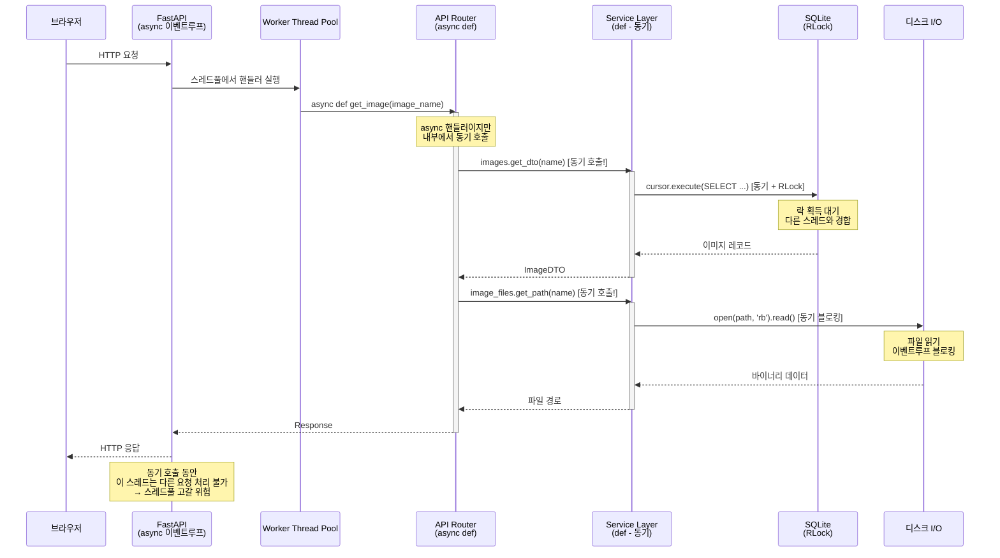
```mermaid
sequenceDiagram
    participant Client as 브라우저
    participant FastAPI as FastAPI<br/>(async 이벤트루프)
    participant ThreadPool as Worker Thread Pool
    participant Router as API Router<br/>(async def)
    participant Service as Service Layer<br/>(def - 동기)
    participant DB as SQLite<br/>(RLock)
    participant Disk as 디스크 I/O

    Client->>FastAPI: HTTP 요청

    FastAPI->>ThreadPool: 스레드풀에서 핸들러 실행
    ThreadPool->>Router: async def get_image(image_name)
    activate Router

    Note over Router: async 핸들러이지만<br/>내부에서 동기 호출

    Router->>Service: images.get_dto(name) [동기 호출!]
    activate Service
    Service->>DB: cursor.execute(SELECT ...) [동기 + RLock]
    Note over DB: 락 획득 대기<br/>다른 스레드와 경합
    DB-->>Service: 이미지 레코드
    Service-->>Router: ImageDTO
    deactivate Service

    Router->>Service: image_files.get_path(name) [동기 호출!]
    activate Service
    Service->>Disk: open(path, 'rb').read() [동기 블로킹]
    Note over Disk: 파일 읽기<br/>이벤트루프 블로킹
    Disk-->>Service: 바이너리 데이터
    Service-->>Router: 파일 경로
    deactivate Service

    Router-->>FastAPI: Response
    deactivate Router
    FastAPI-->>Client: HTTP 응답

    Note over FastAPI: 동기 호출 동안<br/>이 스레드는 다른 요청 처리 불가<br/>→ 스레드풀 고갈 위험
```

### 6.4 동기 이미지 저장 체인

이미지 생성 완료 후 결과를 저장하는 전체 동기 체인입니다.

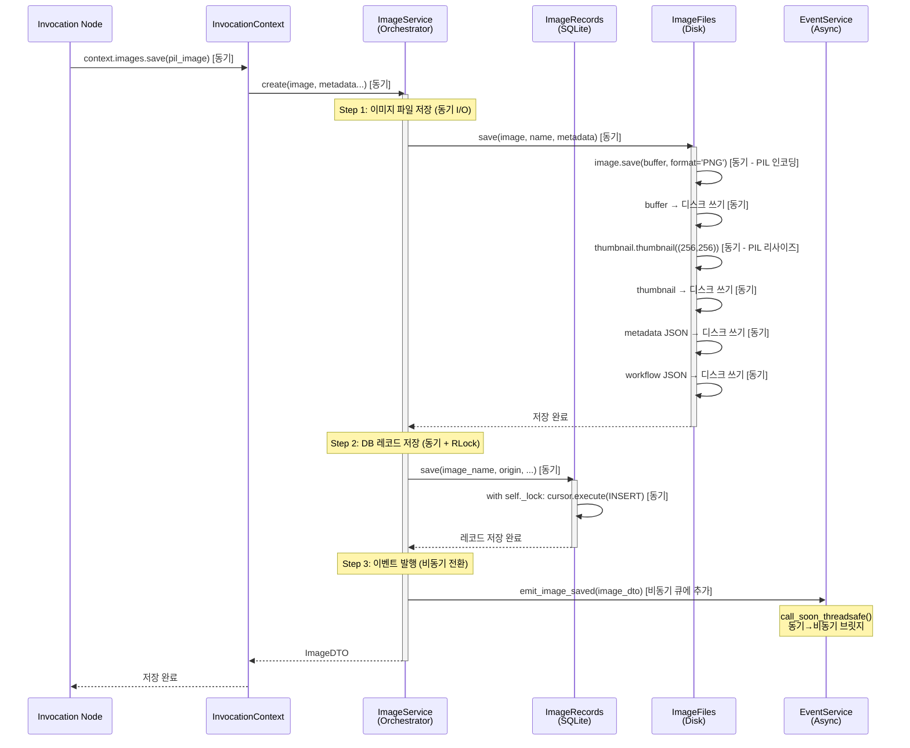
```mermaid
sequenceDiagram
    participant Node as Invocation Node
    participant CTX as InvocationContext
    participant IS as ImageService<br/>(Orchestrator)
    participant IR as ImageRecords<br/>(SQLite)
    participant IF as ImageFiles<br/>(Disk)
    participant EVT as EventService<br/>(Async)

    Node->>CTX: context.images.save(pil_image) [동기]
    CTX->>IS: create(image, metadata...) [동기]
    activate IS

    Note over IS: Step 1: 이미지 파일 저장 (동기 I/O)
    IS->>IF: save(image, name, metadata) [동기]
    activate IF
    IF->>IF: image.save(buffer, format='PNG') [동기 - PIL 인코딩]
    IF->>IF: buffer → 디스크 쓰기 [동기]
    IF->>IF: thumbnail.thumbnail((256,256)) [동기 - PIL 리사이즈]
    IF->>IF: thumbnail → 디스크 쓰기 [동기]
    IF->>IF: metadata JSON → 디스크 쓰기 [동기]
    IF->>IF: workflow JSON → 디스크 쓰기 [동기]
    IF-->>IS: 저장 완료
    deactivate IF

    Note over IS: Step 2: DB 레코드 저장 (동기 + RLock)
    IS->>IR: save(image_name, origin, ...) [동기]
    activate IR
    IR->>IR: with self._lock: cursor.execute(INSERT) [동기]
    IR-->>IS: 레코드 저장 완료
    deactivate IR

    Note over IS: Step 3: 이벤트 발행 (비동기 전환)
    IS->>EVT: emit_image_saved(image_dto) [비동기 큐에 추가]
    Note over EVT: call_soon_threadsafe()<br/>동기→비동기 브릿지

    IS-->>CTX: ImageDTO
    deactivate IS
    CTX-->>Node: 저장 완료
```

---

## 7. 비동기 처리 시퀀스 다이어그램

### 7.1 이미지 생성 전체 시퀀스

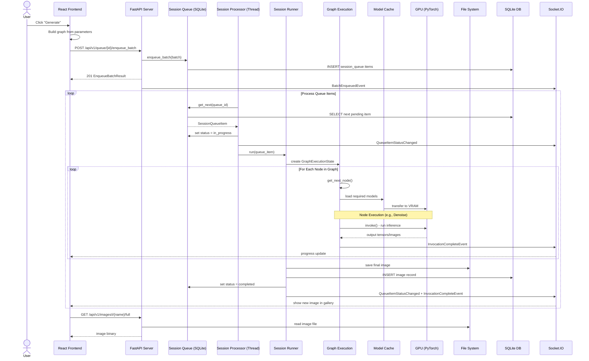
```mermaid
sequenceDiagram
    actor User
    participant UI as React Frontend
    participant API as FastAPI Server
    participant Queue as Session Queue (SQLite)
    participant Proc as Session Processor (Thread)
    participant Runner as Session Runner
    participant Graph as Graph Execution
    participant Cache as Model Cache
    participant GPU as GPU (PyTorch)
    participant FS as File System
    participant DB as SQLite DB
    participant WS as Socket.IO

    User->>UI: Click "Generate"
    UI->>UI: Build graph from parameters
    UI->>API: POST /api/v1/queue/{id}/enqueue_batch
    API->>Queue: enqueue_batch(batch)
    Queue->>DB: INSERT session_queue items
    API-->>UI: 201 EnqueueBatchResult
    API->>WS: BatchEnqueuedEvent

    loop Process Queue Items
        Proc->>Queue: get_next(queue_id)
        Queue->>DB: SELECT next pending item
        Queue-->>Proc: SessionQueueItem
        Proc->>Queue: set status = in_progress
        Proc->>WS: QueueItemStatusChanged

        Proc->>Runner: run(queue_item)
        Runner->>Graph: create GraphExecutionState

        loop For Each Node in Graph
            Graph->>Graph: get_next_node()
            Graph->>Cache: load required models
            Cache->>GPU: transfer to VRAM

            Note over Graph,GPU: Node Execution (e.g., Denoise)
            Graph->>GPU: invoke() - run inference
            GPU-->>Graph: output tensors/images

            Graph->>WS: InvocationCompleteEvent
            WS-->>UI: progress update
        end

        Runner->>FS: save final image
        Runner->>DB: INSERT image record
        Runner->>Queue: set status = completed
        Runner->>WS: QueueItemStatusChanged + InvocationCompleteEvent
        WS-->>UI: show new image in gallery
    end

    UI->>API: GET /api/v1/images/i/{name}/full
    API->>FS: read image file
    API-->>UI: image binary
```

### 7.2 모델 다운로드 및 설치 시퀀스

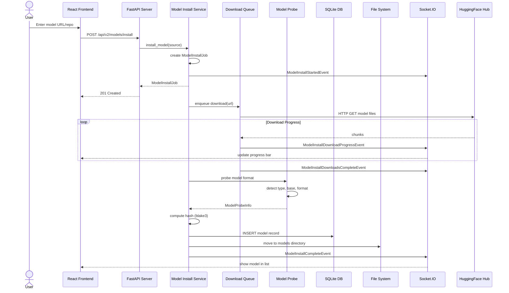
```mermaid
sequenceDiagram
    actor User
    participant UI as React Frontend
    participant API as FastAPI Server
    participant MI as Model Install Service
    participant DQ as Download Queue
    participant Probe as Model Probe
    participant DB as SQLite DB
    participant FS as File System
    participant WS as Socket.IO
    participant HF as HuggingFace Hub

    User->>UI: Enter model URL/repo
    UI->>API: POST /api/v2/models/install
    API->>MI: install_model(source)
    MI->>MI: create ModelInstallJob
    MI->>WS: ModelInstallStartedEvent
    MI-->>API: ModelInstallJob
    API-->>UI: 201 Created

    MI->>DQ: enqueue download(url)
    DQ->>HF: HTTP GET model files
    loop Download Progress
        HF-->>DQ: chunks
        DQ->>WS: ModelInstallDownloadProgressEvent
        WS-->>UI: update progress bar
    end
    DQ->>WS: ModelInstallDownloadsCompleteEvent

    MI->>Probe: probe model format
    Probe->>Probe: detect type, base, format
    Probe-->>MI: ModelProbeInfo

    MI->>MI: compute hash (blake3)
    MI->>DB: INSERT model record
    MI->>FS: move to models directory

    MI->>WS: ModelInstallCompleteEvent
    WS-->>UI: show model in list
```

---

## 8. 동기/비동기 스레드 모델 다이어그램

### 8.1 InvokeAI 스레드 아키텍처

InvokeAI의 전체 스레드 모델을 보여주는 다이어그램입니다. 메인 스레드(FastAPI), 세션 프로세서 스레드, 백그라운드 워커 스레드의 관계와 동기/비동기 경계를 명확히 합니다.

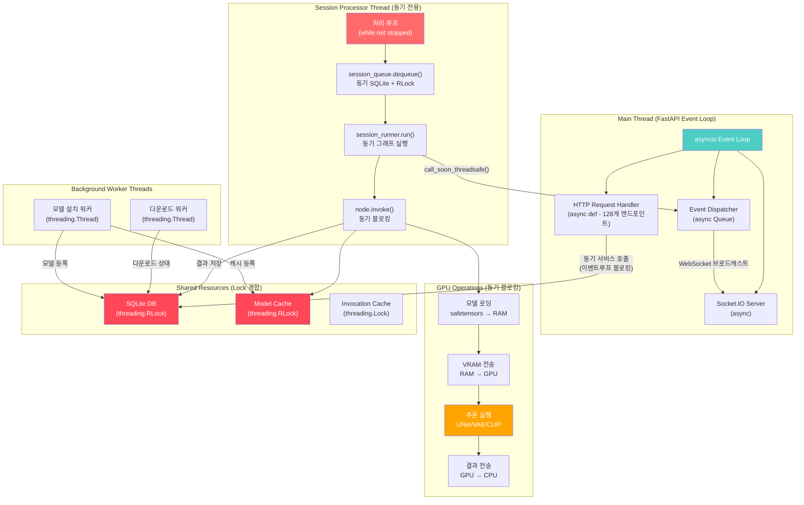
```mermaid
graph TB
    subgraph "Main Thread (FastAPI Event Loop)"
        direction TB
        EL["asyncio Event Loop"]
        HTTP["HTTP Request Handler<br/>(async def - 128개 엔드포인트)"]
        SIO_S["Socket.IO Server<br/>(async)"]
        EVT_D["Event Dispatcher<br/>(async Queue)"]

        EL --> HTTP
        EL --> SIO_S
        EL --> EVT_D
    end

    subgraph "Session Processor Thread (동기 전용)"
        direction TB
        SP_LOOP["처리 루프<br/>(while not stopped)"]
        SQ_DEQ["session_queue.dequeue()<br/>동기 SQLite + RLock"]
        SR_RUN["session_runner.run()<br/>동기 그래프 실행"]
        NODE_EX["node.invoke()<br/>동기 블로킹"]

        SP_LOOP --> SQ_DEQ
        SQ_DEQ --> SR_RUN
        SR_RUN --> NODE_EX
    end

    subgraph "GPU Operations (동기 블로킹)"
        direction TB
        MODEL_LOAD["모델 로딩<br/>safetensors → RAM"]
        VRAM_LOAD["VRAM 전송<br/>RAM → GPU"]
        INFERENCE["추론 실행<br/>UNet/VAE/CLIP"]
        RESULT["결과 전송<br/>GPU → CPU"]

        MODEL_LOAD --> VRAM_LOAD
        VRAM_LOAD --> INFERENCE
        INFERENCE --> RESULT
    end

    subgraph "Background Worker Threads"
        direction TB
        DL_THREAD["다운로드 워커<br/>(threading.Thread)"]
        INST_THREAD["모델 설치 워커<br/>(threading.Thread)"]
    end

    subgraph "Shared Resources (Lock 경합)"
        direction TB
        DB_LOCK["SQLite DB<br/>(threading.RLock)"]
        CACHE_LOCK["Model Cache<br/>(threading.RLock)"]
        IC_LOCK["Invocation Cache<br/>(threading.Lock)"]
    end

    HTTP -->|"동기 서비스 호출<br/>(이벤트루프 블로킹)"| DB_LOCK
    NODE_EX --> CACHE_LOCK
    NODE_EX --> MODEL_LOAD
    NODE_EX -->|"결과 저장"| DB_LOCK
    DL_THREAD -->|"다운로드 상태"| DB_LOCK
    INST_THREAD -->|"모델 등록"| DB_LOCK
    INST_THREAD -->|"캐시 등록"| CACHE_LOCK

    SR_RUN -->|"call_soon_threadsafe()"| EVT_D
    EVT_D -->|"WebSocket 브로드캐스트"| SIO_S

    style EL fill:#4ecdc4,color:#fff
    style SP_LOOP fill:#ff6b6b,color:#fff
    style INFERENCE fill:#ffa502,color:#fff
    style DB_LOCK fill:#ff4757,color:#fff
    style CACHE_LOCK fill:#ff4757,color:#fff
```

### 8.2 동기/비동기 경계 플로우

요청이 비동기 → 동기 → 비동기로 전환되는 경계를 보여주는 다이어그램입니다.

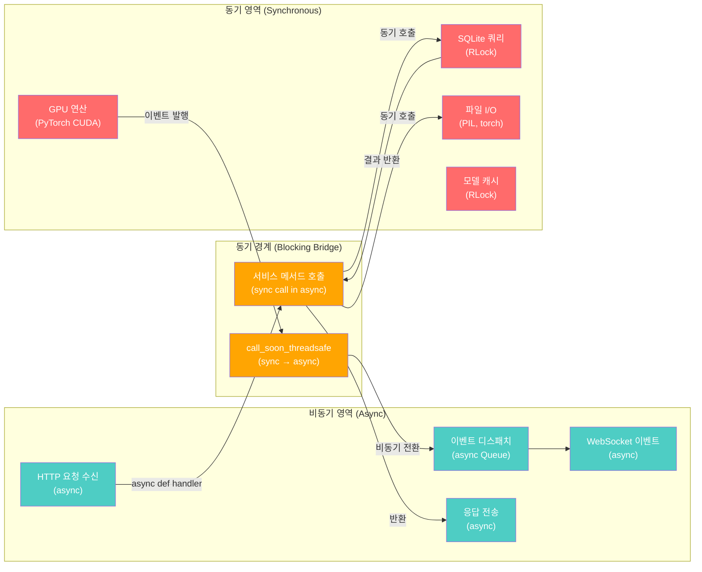
```mermaid
flowchart LR
    subgraph "비동기 영역 (Async)"
        A1["HTTP 요청 수신<br/>(async)"]
        A2["WebSocket 이벤트<br/>(async)"]
        A3["이벤트 디스패치<br/>(async Queue)"]
        A4["응답 전송<br/>(async)"]
    end

    subgraph "동기 경계 (Blocking Bridge)"
        B1["서비스 메서드 호출<br/>(sync call in async)"]
        B2["call_soon_threadsafe<br/>(sync → async)"]
    end

    subgraph "동기 영역 (Synchronous)"
        C1["SQLite 쿼리<br/>(RLock)"]
        C2["파일 I/O<br/>(PIL, torch)"]
        C3["GPU 연산<br/>(PyTorch CUDA)"]
        C4["모델 캐시<br/>(RLock)"]
    end

    A1 -->|"async def handler"| B1
    B1 -->|"동기 호출"| C1
    B1 -->|"동기 호출"| C2
    C3 -->|"이벤트 발행"| B2
    B2 -->|"비동기 전환"| A3
    A3 --> A2
    C1 -->|"결과 반환"| B1
    B1 -->|"반환"| A4

    style A1 fill:#4ecdc4,color:#fff
    style A2 fill:#4ecdc4,color:#fff
    style A3 fill:#4ecdc4,color:#fff
    style A4 fill:#4ecdc4,color:#fff
    style B1 fill:#ffa502,color:#fff
    style B2 fill:#ffa502,color:#fff
    style C1 fill:#ff6b6b,color:#fff
    style C2 fill:#ff6b6b,color:#fff
    style C3 fill:#ff6b6b,color:#fff
    style C4 fill:#ff6b6b,color:#fff
```

### 8.3 SaaS 전환 후 목표 스레드 모델

SaaS 전환 시 동기 병목을 해소하기 위한 목표 아키텍처입니다.

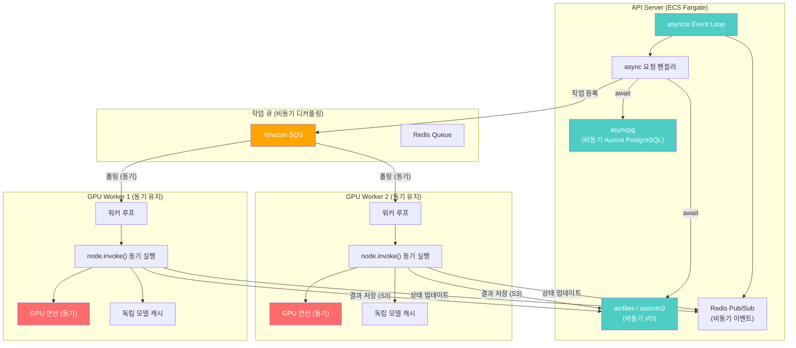
```mermaid
graph TB
    subgraph "API Server (ECS Fargate)"
        direction TB
        EL2["asyncio Event Loop"]
        HTTP2["async 요청 핸들러"]
        ASYNC_DB["asyncpg<br/>(비동기 Aurora PostgreSQL)"]
        ASYNC_IO["aiofiles / aioboto3<br/>(비동기 I/O)"]
        REDIS_PUB["Redis Pub/Sub<br/>(비동기 이벤트)"]

        EL2 --> HTTP2
        HTTP2 -->|"await"| ASYNC_DB
        HTTP2 -->|"await"| ASYNC_IO
        EL2 --> REDIS_PUB
    end

    subgraph "작업 큐 (비동기 디커플링)"
        SQS["Amazon SQS"]
        REDIS_Q["Redis Queue"]
    end

    subgraph "GPU Worker 1 (동기 유지)"
        direction TB
        W1_LOOP["워커 루프"]
        W1_NODE["node.invoke() 동기 실행"]
        W1_GPU["GPU 연산 (동기)"]
        W1_CACHE["독립 모델 캐시"]

        W1_LOOP --> W1_NODE
        W1_NODE --> W1_GPU
        W1_NODE --> W1_CACHE
    end

    subgraph "GPU Worker 2 (동기 유지)"
        direction TB
        W2_LOOP["워커 루프"]
        W2_NODE["node.invoke() 동기 실행"]
        W2_GPU["GPU 연산 (동기)"]
        W2_CACHE["독립 모델 캐시"]

        W2_LOOP --> W2_NODE
        W2_NODE --> W2_GPU
        W2_NODE --> W2_CACHE
    end

    HTTP2 -->|"작업 등록"| SQS
    SQS -->|"폴링 (동기)"| W1_LOOP
    SQS -->|"폴링 (동기)"| W2_LOOP
    W1_NODE -->|"결과 저장 (S3)"| ASYNC_IO
    W2_NODE -->|"결과 저장 (S3)"| ASYNC_IO
    W1_NODE -->|"상태 업데이트"| REDIS_PUB
    W2_NODE -->|"상태 업데이트"| REDIS_PUB

    style EL2 fill:#4ecdc4,color:#fff
    style ASYNC_DB fill:#4ecdc4,color:#fff
    style ASYNC_IO fill:#4ecdc4,color:#fff
    style W1_GPU fill:#ff6b6b,color:#fff
    style W2_GPU fill:#ff6b6b,color:#fff
    style SQS fill:#ffa502,color:#fff
```

**핵심 전략:**
- API 서버: 동기 호출을 비동기로 전환 (asyncpg, aiofiles, aioboto3)
- GPU 워커: 동기 유지 (PyTorch 특성상 불가피) → 수평 확장으로 대응
- 디커플링: SQS/Redis 큐로 API ↔ GPU 워커 완전 분리
- 모델 캐시: 워커별 독립 캐시로 스레드 안전 문제 해소

---

## 9. 사용자 시퀀스 다이어그램

### 9.1 텍스트-투-이미지 워크플로우

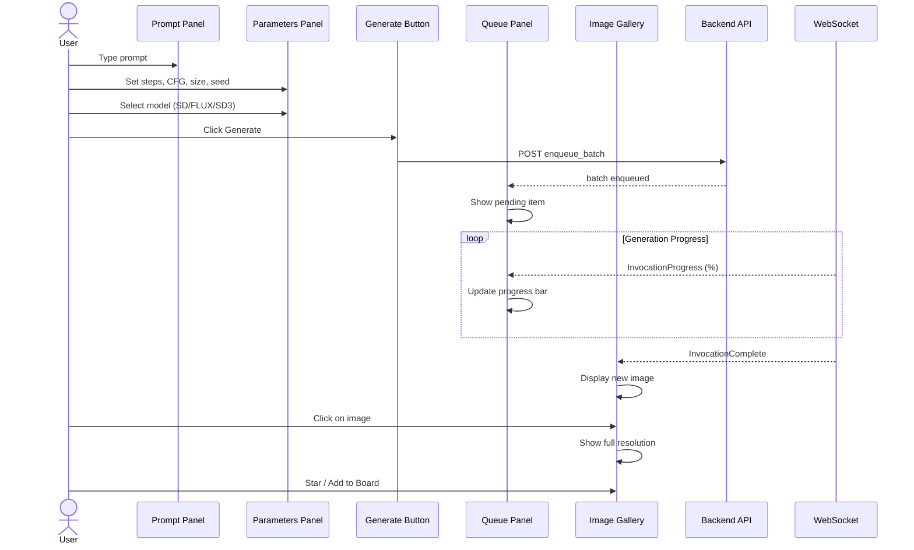
```mermaid
sequenceDiagram
    actor User
    participant PromptPanel as Prompt Panel
    participant ParamPanel as Parameters Panel
    participant GenBtn as Generate Button
    participant QueueUI as Queue Panel
    participant Gallery as Image Gallery
    participant API as Backend API
    participant WS as WebSocket

    User->>PromptPanel: Type prompt
    User->>ParamPanel: Set steps, CFG, size, seed
    User->>ParamPanel: Select model (SD/FLUX/SD3)
    User->>GenBtn: Click Generate

    GenBtn->>API: POST enqueue_batch
    API-->>QueueUI: batch enqueued
    QueueUI->>QueueUI: Show pending item

    loop Generation Progress
        WS-->>QueueUI: InvocationProgress (%)
        QueueUI->>QueueUI: Update progress bar
    end

    WS-->>Gallery: InvocationComplete
    Gallery->>Gallery: Display new image
    User->>Gallery: Click on image
    Gallery->>Gallery: Show full resolution
    User->>Gallery: Star / Add to Board
```

### 9.2 이미지-투-이미지 (인페인팅) 워크플로우

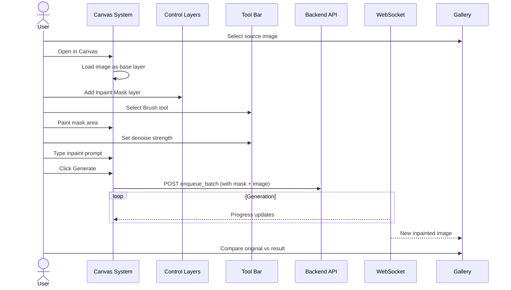
```mermaid
sequenceDiagram
    actor User
    participant Canvas as Canvas System
    participant Layers as Control Layers
    participant Tools as Tool Bar
    participant API as Backend API
    participant WS as WebSocket
    participant Gallery as Gallery

    User->>Gallery: Select source image
    User->>Canvas: Open in Canvas
    Canvas->>Canvas: Load image as base layer

    User->>Layers: Add Inpaint Mask layer
    User->>Tools: Select Brush tool
    User->>Canvas: Paint mask area

    User->>Tools: Set denoise strength
    User->>Canvas: Type inpaint prompt
    User->>Canvas: Click Generate

    Canvas->>API: POST enqueue_batch (with mask + image)

    loop Generation
        WS-->>Canvas: Progress updates
    end

    WS-->>Gallery: New inpainted image
    User->>Gallery: Compare original vs result
```

### 9.3 워크플로우 에디터 사용 시퀀스

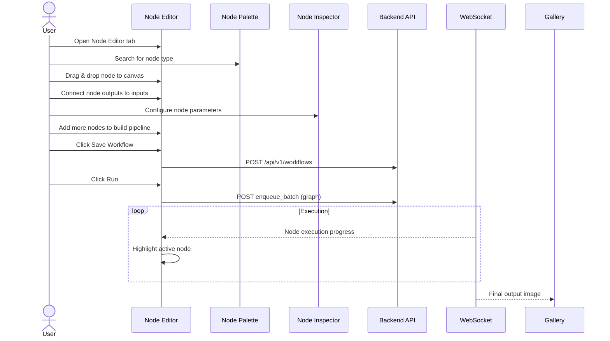
```mermaid
sequenceDiagram
    actor User
    participant NE as Node Editor
    participant Palette as Node Palette
    participant Inspector as Node Inspector
    participant API as Backend API
    participant WS as WebSocket
    participant Gallery as Gallery

    User->>NE: Open Node Editor tab
    User->>Palette: Search for node type
    User->>NE: Drag & drop node to canvas
    User->>NE: Connect node outputs to inputs

    User->>Inspector: Configure node parameters
    User->>NE: Add more nodes to build pipeline

    User->>NE: Click Save Workflow
    NE->>API: POST /api/v1/workflows

    User->>NE: Click Run
    NE->>API: POST enqueue_batch (graph)

    loop Execution
        WS-->>NE: Node execution progress
        NE->>NE: Highlight active node
    end

    WS-->>Gallery: Final output image
```

---

## 10. 모델 로딩 시퀀스

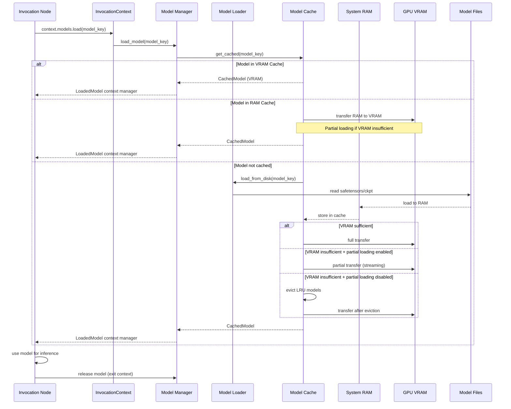
```mermaid
sequenceDiagram
    participant Node as Invocation Node
    participant Context as InvocationContext
    participant MM as Model Manager
    participant Loader as Model Loader
    participant Cache as Model Cache
    participant RAM as System RAM
    participant VRAM as GPU VRAM
    participant Disk as Model Files

    Node->>Context: context.models.load(model_key)
    Context->>MM: load_model(model_key)
    MM->>Cache: get_cached(model_key)

    alt Model in VRAM Cache
        Cache-->>MM: CachedModel (VRAM)
        MM-->>Node: LoadedModel context manager
    else Model in RAM Cache
        Cache->>VRAM: transfer RAM to VRAM
        Note over Cache,VRAM: Partial loading if VRAM insufficient
        Cache-->>MM: CachedModel
        MM-->>Node: LoadedModel context manager
    else Model not cached
        Cache->>Loader: load_from_disk(model_key)
        Loader->>Disk: read safetensors/ckpt
        Disk-->>RAM: load to RAM
        RAM-->>Cache: store in cache

        alt VRAM sufficient
            Cache->>VRAM: full transfer
        else VRAM insufficient + partial loading enabled
            Cache->>VRAM: partial transfer (streaming)
        else VRAM insufficient + partial loading disabled
            Cache->>Cache: evict LRU models
            Cache->>VRAM: transfer after eviction
        end

        Cache-->>MM: CachedModel
        MM-->>Node: LoadedModel context manager
    end

    Node->>Node: use model for inference
    Node->>MM: release model (exit context)
```

---

## 11. 노드 그래프 실행 흐름

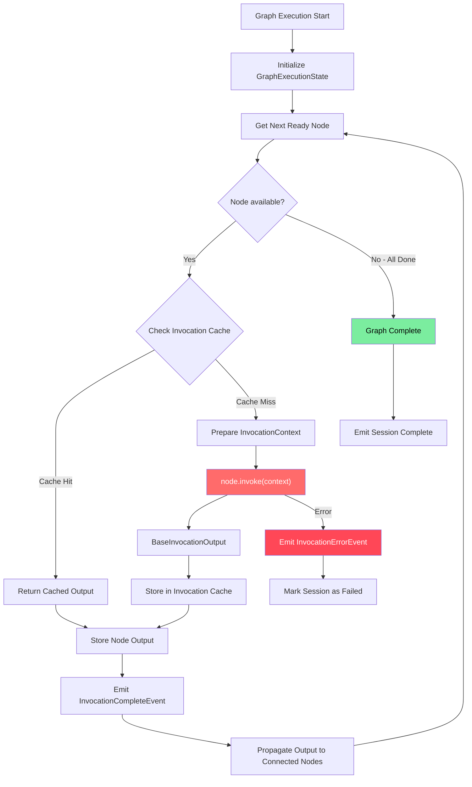
```mermaid
flowchart TB
    START["Graph Execution Start"] --> INIT["Initialize GraphExecutionState"]
    INIT --> NEXT["Get Next Ready Node"]

    NEXT --> CHECK{Node available?}
    CHECK -->|Yes| CACHE_CHECK{"Check Invocation Cache"}
    CHECK -->|No - All Done| COMPLETE["Graph Complete"]

    CACHE_CHECK -->|Cache Hit| CACHED["Return Cached Output"]
    CACHE_CHECK -->|Cache Miss| PREP["Prepare InvocationContext"]

    CACHED --> STORE["Store Node Output"]
    PREP --> INVOKE["node.invoke(context)"]
    INVOKE --> OUTPUT["BaseInvocationOutput"]
    OUTPUT --> CACHE_STORE["Store in Invocation Cache"]
    CACHE_STORE --> STORE

    STORE --> EMIT["Emit InvocationCompleteEvent"]
    EMIT --> PROPAGATE["Propagate Output to Connected Nodes"]
    PROPAGATE --> NEXT

    INVOKE -->|Error| ERROR["Emit InvocationErrorEvent"]
    ERROR --> FAIL["Mark Session as Failed"]

    COMPLETE --> FINAL["Emit Session Complete"]

    style INVOKE fill:#ff6b6b,color:#fff
    style COMPLETE fill:#7bed9f,color:#000
    style ERROR fill:#ff4757,color:#fff
```

---

## 12. 구독 플랜 사용자 플로우

```mermaid
flowchart TB
    START["사용자 방문"] --> LANDING["랜딩 페이지"]
    LANDING --> PLAN["구독 플랜 선택"]

    PLAN --> TRIAL["Trial<br/>7일 무료 체험<br/>500 크레딧"]
    PLAN --> STARTER["Starter Plan<br/>$25/월<br/>5,000 크레딧"]
    PLAN --> PRO["Pro Plan<br/>$75/월<br/>15,000 크레딧"]
    PLAN --> STUDIO["Studio Plan<br/>$150/월<br/>30,000 크레딧"]
    PLAN --> ENT["Enterprise<br/>맞춤 견적"]
    PLAN --> TESTER["Tester Plan<br/>관리자 부여<br/>50,000 크레딧"]

    TRIAL --> SIGNUP["회원가입<br/>(Cognito)"]
    STARTER --> SIGNUP
    PRO --> SIGNUP
    STUDIO --> SIGNUP
    ENT --> SIGNUP
    TESTER --> ADMIN_GRANT["관리자가<br/>기존 유저에 부여"]

    SIGNUP --> PAY{유료 플랜?}
    PAY -->|Yes| STRIPE["Stripe 결제"]
    PAY -->|No (Trial)| TRIAL_START["7일 Trial 시작<br/>Starter 조건"]
    TRIAL_START --> DASHBOARD

    STRIPE --> CREDIT["크레딧 부여<br/>(1 credit = 1초 GPU)"]
    ADMIN_GRANT --> CREDIT
    CREDIT --> DASHBOARD["대시보드"]

    DASHBOARD --> GENERATE["이미지 생성"]
    GENERATE --> CHECK_CREDIT{"크레딧 충분?<br/>reserve → confirm"}
    CHECK_CREDIT -->|Yes| GPU_ASSIGN["GPU 할당<br/>Basic: T4 (Trial/Starter/Tester)<br/>High-Perf: A10G (Pro/Studio)<br/>Dedicated: A100 (Enterprise)"]
    CHECK_CREDIT -->|No| UPGRADE["업그레이드 안내"]

    GPU_ASSIGN --> PROCESS["이미지 생성 처리"]
    PROCESS --> DEDUCT["실제 GPU 시간 기반<br/>크레딧 차감"]
    DEDUCT --> RESULT["결과 이미지"]
    RESULT --> GENERATE

    UPGRADE --> PLAN

    style STARTER fill:#4ecdc4,color:#fff
    style PRO fill:#45b7d1,color:#fff
    style STUDIO fill:#a29bfe,color:#fff
    style ENT fill:#ff6b6b,color:#fff
    style TRIAL fill:#dfe6e9,color:#000
    style TESTER fill:#ffeaa7,color:#000
```

---

## 13. 서비스 IA 및 사이트맵

### 13.1 현재 InvokeAI 서비스 IA

```mermaid
graph TB
    ROOT["InvokeAI Web App<br/>(Single Page)"]

    ROOT --> GENERATION["Generation"]
    ROOT --> CANVAS["Canvas"]
    ROOT --> WORKFLOWS["Workflows"]
    ROOT --> MODELS["Model Manager"]
    ROOT --> GALLERY["Gallery"]
    ROOT --> QUEUE["Queue"]
    ROOT --> SETTINGS["Settings"]

    GENERATION --> GEN_PROMPT["Prompt Input"]
    GENERATION --> GEN_PARAMS["Parameters<br/>(Steps, CFG, Size, Seed)"]
    GENERATION --> GEN_MODEL["Model Selection"]
    GENERATION --> GEN_LORA["LoRA Selection"]
    GENERATION --> GEN_CTRL["ControlNet"]
    GENERATION --> GEN_IPA["IP-Adapter"]
    GENERATION --> GEN_T2I["T2I-Adapter"]
    GENERATION --> GEN_STYLE["Style Presets"]

    CANVAS --> CAN_LAYERS["Layer Management"]
    CANVAS --> CAN_TOOLS["Drawing Tools"]
    CANVAS --> CAN_MASK["Mask Editing"]
    CANVAS --> CAN_COMP["Composition"]

    WORKFLOWS --> WF_EDITOR["Node Editor"]
    WORKFLOWS --> WF_LIB["Workflow Library"]
    WORKFLOWS --> WF_SAVE["Save/Load"]

    MODELS --> MOD_LIST["Model List"]
    MODELS --> MOD_INSTALL["Install Models"]
    MODELS --> MOD_HF["HuggingFace Import"]
    MODELS --> MOD_SCAN["Scan Local"]
    MODELS --> MOD_CONFIG["Model Settings"]

    GALLERY --> GAL_GRID["Image Grid"]
    GALLERY --> GAL_BOARDS["Boards (Albums)"]
    GALLERY --> GAL_VIEW["Image Viewer"]
    GALLERY --> GAL_META["Metadata"]
    GALLERY --> GAL_SEARCH["Search"]
    GALLERY --> GAL_DOWNLOAD["Bulk Download"]

    QUEUE --> Q_LIST["Queue Items"]
    QUEUE --> Q_STATUS["Status"]
    QUEUE --> Q_CANCEL["Cancel/Clear"]

    SETTINGS --> SET_GENERAL["General"]
    SETTINGS --> SET_CACHE["Model Cache"]
    SETTINGS --> SET_DEVICE["Device"]
```

### 13.2 SaaS 전환 후 확장 사이트맵

```mermaid
graph TB
    ROOT["SaaS Platform"]

    ROOT --> PUBLIC["Public Pages"]
    ROOT --> AUTH["Authentication"]
    ROOT --> APP["App (Authenticated)"]
    ROOT --> ADMIN["Admin Panel"]

    PUBLIC --> LAND["Landing Page"]
    PUBLIC --> PRICING["Pricing / Plans"]
    PUBLIC --> DOCS_PUB["Documentation"]
    PUBLIC --> DEMO["Live Demo"]

    AUTH --> LOGIN["Login"]
    AUTH --> SIGNUP["Sign Up"]
    AUTH --> RESET["Password Reset"]
    AUTH --> OAUTH["Social Login<br/>(Google, GitHub)"]

    APP --> DASH["Dashboard"]
    APP --> STUDIO["AI Studio<br/>(Generation)"]
    APP --> GALLERY_S["My Gallery"]
    APP --> WORKFLOW_S["My Workflows"]
    APP --> MODELS_S["Model Hub"]
    APP --> ACCOUNT["Account"]

    DASH --> DASH_USAGE["Usage Stats"]
    DASH --> DASH_CREDIT["Credit Balance"]
    DASH --> DASH_RECENT["Recent Generations"]

    STUDIO --> STU_GEN["Generation Panel"]
    STUDIO --> STU_CANVAS["Canvas Editor"]
    STUDIO --> STU_NODE["Node Editor"]
    STUDIO --> STU_BATCH["Batch Processing"]

    ACCOUNT --> ACC_PROFILE["Profile"]
    ACCOUNT --> ACC_SUB["Subscription"]
    ACCOUNT --> ACC_BILLING["Billing History"]
    ACCOUNT --> ACC_API["API Keys"]
    ACCOUNT --> ACC_SETTINGS["Preferences"]

    ADMIN --> ADM_USERS["User Management"]
    ADMIN --> ADM_PLANS["Plan Management"]
    ADMIN --> ADM_TEST["Test Plan Grant"]
    ADMIN --> ADM_MONITOR["System Monitor"]
    ADMIN --> ADM_MODELS["Model Management"]
    ADMIN --> ADM_BILLING["Revenue Dashboard"]
    ADMIN --> ADM_GPU["GPU Pool Monitor"]

    style ADMIN fill:#ff6b6b,color:#fff
    style AUTH fill:#7bed9f,color:#000
    style APP fill:#45b7d1,color:#fff
    style PUBLIC fill:#dfe6e9,color:#000
```
