# InvokeAI v6.11.1.post1 - 아키텍처 다이어그램 모음

## 목차
1. [현재 시스템 전체 아키텍처](#1-현재-시스템-전체-아키텍처)
2. [SaaS 전환 후 목표 아키텍처 (AWS)](#2-saas-전환-후-목표-아키텍처-aws)
3. [백엔드 서비스 계층 구조](#3-백엔드-서비스-계층-구조)
4. [프론트엔드 컴포넌트 아키텍처](#4-프론트엔드-컴포넌트-아키텍처)
5. [이미지 생성 데이터 흐름](#5-이미지-생성-데이터-흐름)
6. [비동기 처리 시퀀스 다이어그램](#6-비동기-처리-시퀀스-다이어그램)
7. [사용자 시퀀스 다이어그램](#7-사용자-시퀀스-다이어그램)
8. [모델 로딩 시퀀스](#8-모델-로딩-시퀀스)
9. [노드 그래프 실행 흐름](#9-노드-그래프-실행-흐름)
10. [구독 플랜 사용자 플로우](#10-구독-플랜-사용자-플로우)
11. [서비스 IA 및 사이트맵](#11-서비스-ia-및-사이트맵)

---

## 1. 현재 시스템 전체 아키텍처

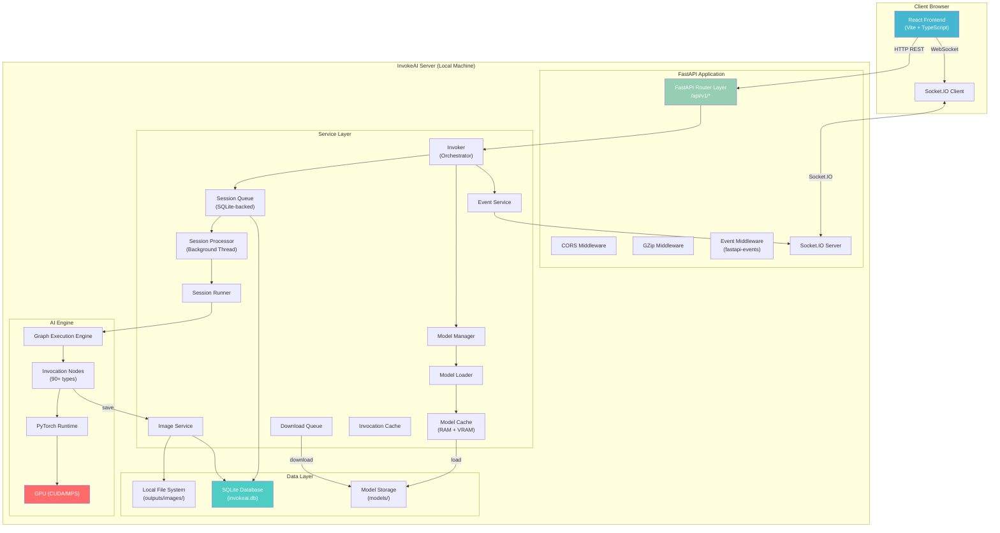

---

## 2. SaaS 전환 후 목표 아키텍처 (AWS)

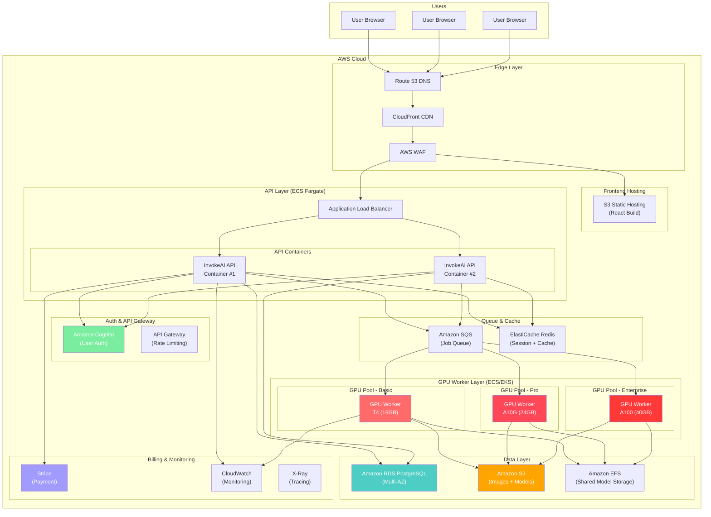

---

## 3. 백엔드 서비스 계층 구조

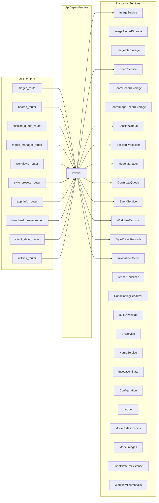

---

## 4. 프론트엔드 컴포넌트 아키텍처

```mermaid
graph TB
    subgraph "App Shell"
        APP["App.tsx"]
        THEME["ThemeProvider<br/>(Chakra UI)"]
        STORE["Redux Store"]
        I18N["i18next Provider"]
        SIO_P["Socket.IO Provider"]
    end

    subgraph "Layout"
        DOCK["Dockview Layout"]
        TAB["Tab Navigation"]
        SIDE["Side Panels"]
    end

    subgraph "Main Features"
        subgraph "Generation Panel"
            PROMPT["Prompt Editor"]
            PARAMS["Parameters Panel<br/>(Steps, CFG, Size)"]
            LORA["LoRA Selector"]
            CTRL["ControlNet Panel"]
            IPA["IP-Adapter Panel"]
            STYLE["Style Presets"]
        end

        subgraph "Canvas System"
            CL["Control Layers Manager"]
            KONVA["Konva Canvas<br/>(Drawing + Composition)"]
            TOOLS["Tool Bar<br/>(Brush, Eraser, Move)"]
        end

        subgraph "Node Editor"
            NE["Node Editor<br/>(@xyflow/react)"]
            NP["Node Palette"]
            NI["Node Inspector"]
        end

        subgraph "Gallery"
            GAL["Image Gallery<br/>(Virtuoso)"]
            BOARD["Board Manager"]
            VIEWER["Image Viewer"]
        end

        subgraph "Model Manager"
            MLIST["Model List"]
            MINST["Model Installer"]
            MCONF["Model Config"]
        end

        subgraph "Queue Manager"
            QLIST["Queue List"]
            QSTAT["Queue Status"]
        end
    end

    subgraph "Data Layer"
        RTK["RTK Query<br/>(API Cache)"]
        REDUX["Redux Slices"]
        SOCKET["Socket.IO Events"]
    end

    APP --> THEME
    APP --> STORE
    APP --> I18N
    APP --> SIO_P
    APP --> DOCK

    DOCK --> TAB
    DOCK --> SIDE

    TAB --> PROMPT
    TAB --> PARAMS
    TAB --> CL
    TAB --> NE
    TAB --> MLIST

    SIDE --> GAL
    SIDE --> QLIST

    PROMPT --> RTK
    GAL --> RTK
    NE --> RTK
    MLIST --> RTK
    QLIST --> RTK
    RTK --> REDUX
    SOCKET --> REDUX
```

---

## 5. 이미지 생성 데이터 흐름

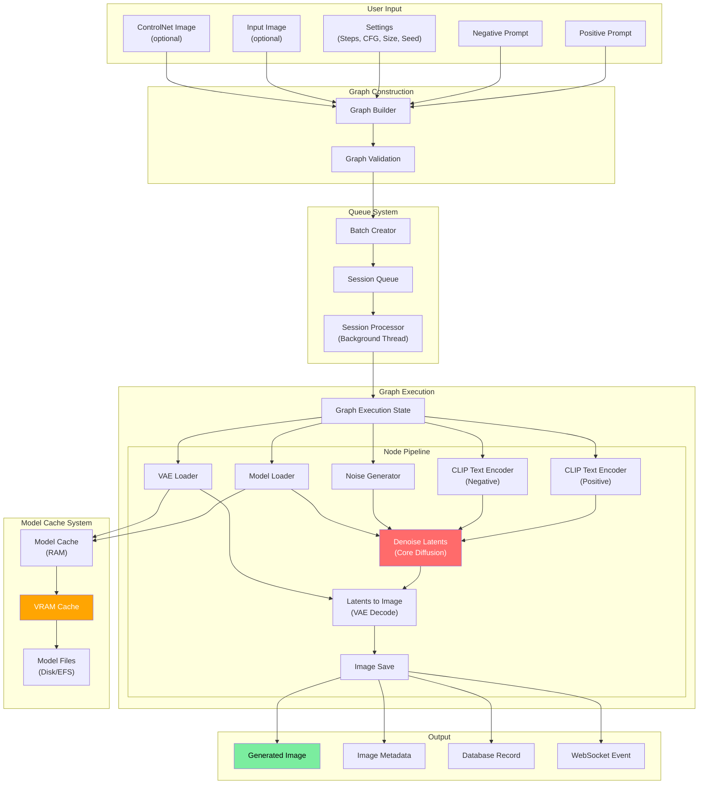

---

## 6. 비동기 처리 시퀀스 다이어그램

### 6.1 이미지 생성 전체 시퀀스

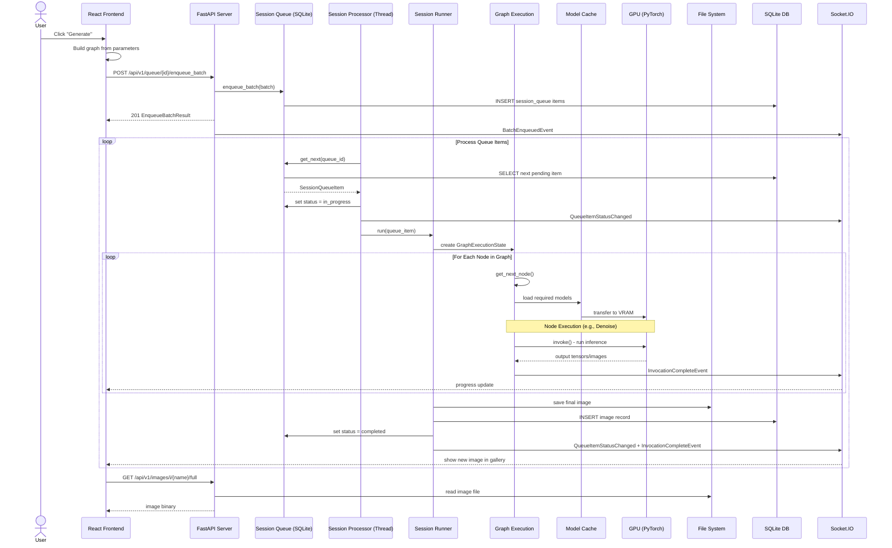

### 6.2 모델 다운로드 및 설치 시퀀스

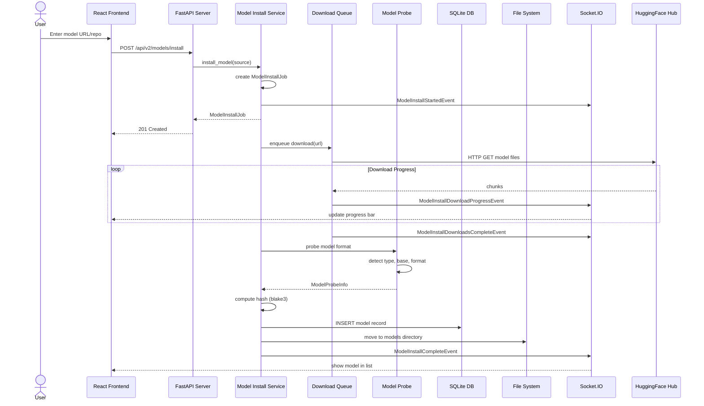

---

## 7. 사용자 시퀀스 다이어그램

### 7.1 텍스트-투-이미지 워크플로우

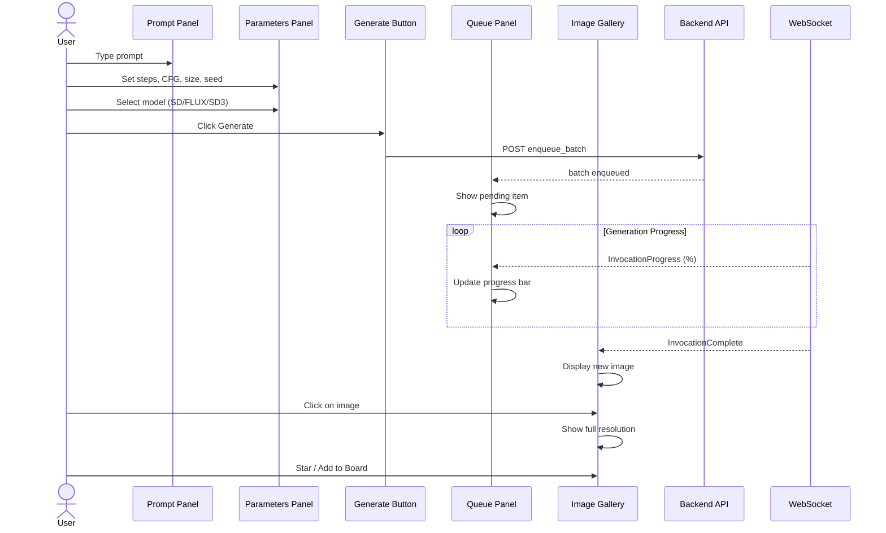

### 7.2 이미지-투-이미지 (인페인팅) 워크플로우

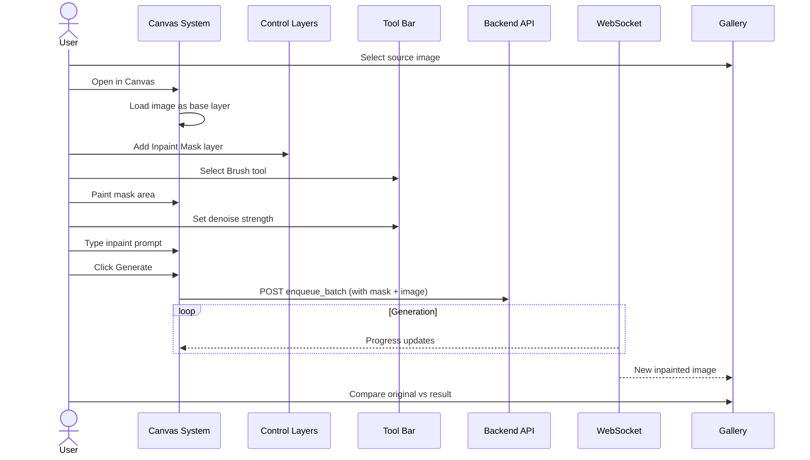

### 7.3 워크플로우 에디터 사용 시퀀스

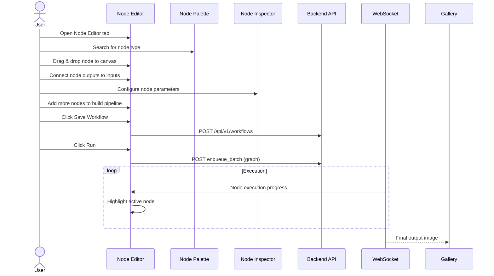

---

## 8. 모델 로딩 시퀀스

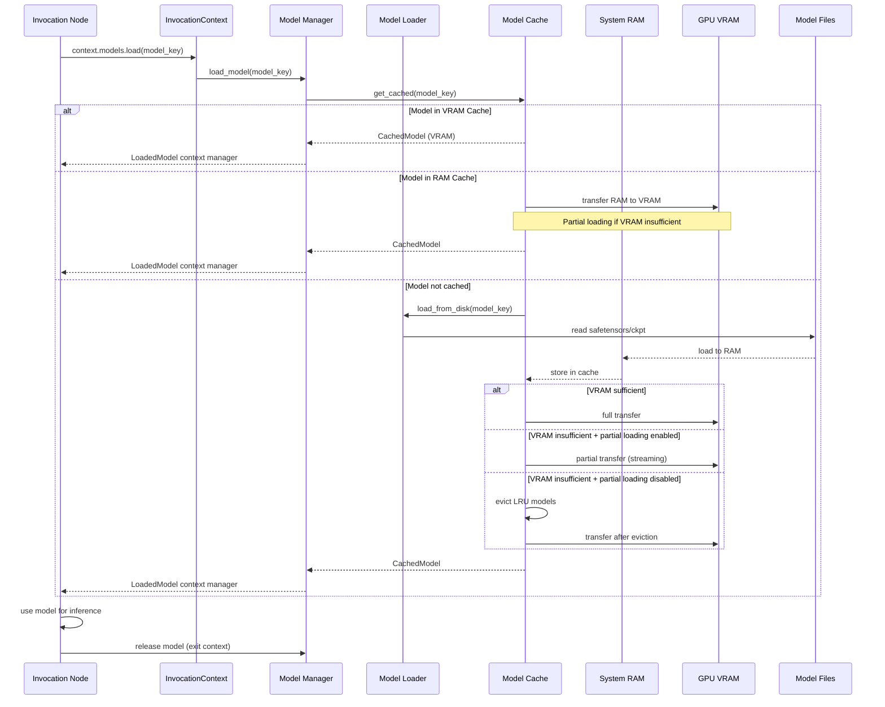

---

## 9. 노드 그래프 실행 흐름

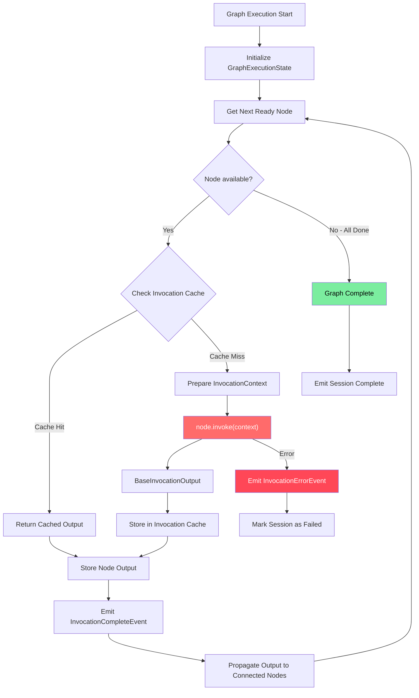

---

## 10. 구독 플랜 사용자 플로우 (SaaS 목표)

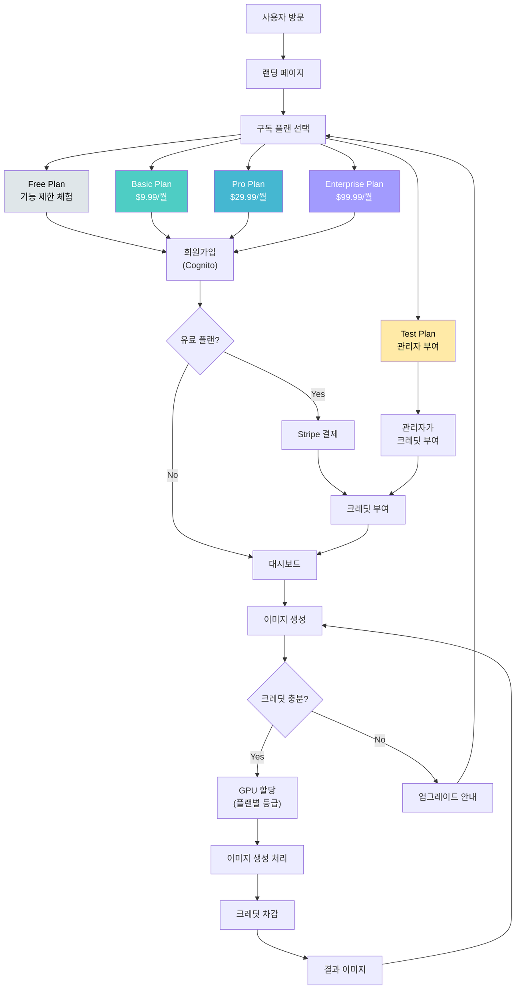

---

## 11. 서비스 IA 및 사이트맵

### 11.1 현재 InvokeAI 서비스 IA

```mermaid
graph TB
    ROOT["InvokeAI Web App<br/>(Single Page)"]

    ROOT --> GENERATION["Generation"]
    ROOT --> CANVAS["Canvas"]
    ROOT --> WORKFLOWS["Workflows"]
    ROOT --> MODELS["Model Manager"]
    ROOT --> GALLERY["Gallery"]
    ROOT --> QUEUE["Queue"]
    ROOT --> SETTINGS["Settings"]

    GENERATION --> GEN_PROMPT["Prompt Input"]
    GENERATION --> GEN_PARAMS["Parameters<br/>(Steps, CFG, Size, Seed)"]
    GENERATION --> GEN_MODEL["Model Selection"]
    GENERATION --> GEN_LORA["LoRA Selection"]
    GENERATION --> GEN_CTRL["ControlNet"]
    GENERATION --> GEN_IPA["IP-Adapter"]
    GENERATION --> GEN_T2I["T2I-Adapter"]
    GENERATION --> GEN_STYLE["Style Presets"]

    CANVAS --> CAN_LAYERS["Layer Management"]
    CANVAS --> CAN_TOOLS["Drawing Tools"]
    CANVAS --> CAN_MASK["Mask Editing"]
    CANVAS --> CAN_COMP["Composition"]

    WORKFLOWS --> WF_EDITOR["Node Editor"]
    WORKFLOWS --> WF_LIB["Workflow Library"]
    WORKFLOWS --> WF_SAVE["Save/Load"]

    MODELS --> MOD_LIST["Model List"]
    MODELS --> MOD_INSTALL["Install Models"]
    MODELS --> MOD_HF["HuggingFace Import"]
    MODELS --> MOD_SCAN["Scan Local"]
    MODELS --> MOD_CONFIG["Model Settings"]

    GALLERY --> GAL_GRID["Image Grid"]
    GALLERY --> GAL_BOARDS["Boards (Albums)"]
    GALLERY --> GAL_VIEW["Image Viewer"]
    GALLERY --> GAL_META["Metadata"]
    GALLERY --> GAL_SEARCH["Search"]
    GALLERY --> GAL_DOWNLOAD["Bulk Download"]

    QUEUE --> Q_LIST["Queue Items"]
    QUEUE --> Q_STATUS["Status"]
    QUEUE --> Q_CANCEL["Cancel/Clear"]

    SETTINGS --> SET_GENERAL["General"]
    SETTINGS --> SET_CACHE["Model Cache"]
    SETTINGS --> SET_DEVICE["Device"]
```

### 11.2 SaaS 전환 후 확장 사이트맵

```mermaid
graph TB
    ROOT["SaaS Platform"]

    ROOT --> PUBLIC["Public Pages"]
    ROOT --> AUTH["Authentication"]
    ROOT --> APP["App (Authenticated)"]
    ROOT --> ADMIN["Admin Panel"]

    PUBLIC --> LAND["Landing Page"]
    PUBLIC --> PRICING["Pricing / Plans"]
    PUBLIC --> DOCS_PUB["Documentation"]
    PUBLIC --> DEMO["Live Demo"]

    AUTH --> LOGIN["Login"]
    AUTH --> SIGNUP["Sign Up"]
    AUTH --> RESET["Password Reset"]
    AUTH --> OAUTH["Social Login<br/>(Google, GitHub)"]

    APP --> DASH["Dashboard"]
    APP --> STUDIO["AI Studio<br/>(Generation)"]
    APP --> GALLERY_S["My Gallery"]
    APP --> WORKFLOW_S["My Workflows"]
    APP --> MODELS_S["Model Hub"]
    APP --> ACCOUNT["Account"]

    DASH --> DASH_USAGE["Usage Stats"]
    DASH --> DASH_CREDIT["Credit Balance"]
    DASH --> DASH_RECENT["Recent Generations"]

    STUDIO --> STU_GEN["Generation Panel"]
    STUDIO --> STU_CANVAS["Canvas Editor"]
    STUDIO --> STU_NODE["Node Editor"]
    STUDIO --> STU_BATCH["Batch Processing"]

    ACCOUNT --> ACC_PROFILE["Profile"]
    ACCOUNT --> ACC_SUB["Subscription"]
    ACCOUNT --> ACC_BILLING["Billing History"]
    ACCOUNT --> ACC_API["API Keys"]
    ACCOUNT --> ACC_SETTINGS["Preferences"]

    ADMIN --> ADM_USERS["User Management"]
    ADMIN --> ADM_PLANS["Plan Management"]
    ADMIN --> ADM_TEST["Test Plan Grant"]
    ADMIN --> ADM_MONITOR["System Monitor"]
    ADMIN --> ADM_MODELS["Model Management"]
    ADMIN --> ADM_BILLING["Revenue Dashboard"]
    ADMIN --> ADM_GPU["GPU Pool Monitor"]

    style ADMIN fill:#ff6b6b,color:#fff
    style AUTH fill:#7bed9f,color:#000
    style APP fill:#45b7d1,color:#fff
    style PUBLIC fill:#dfe6e9,color:#000
```
