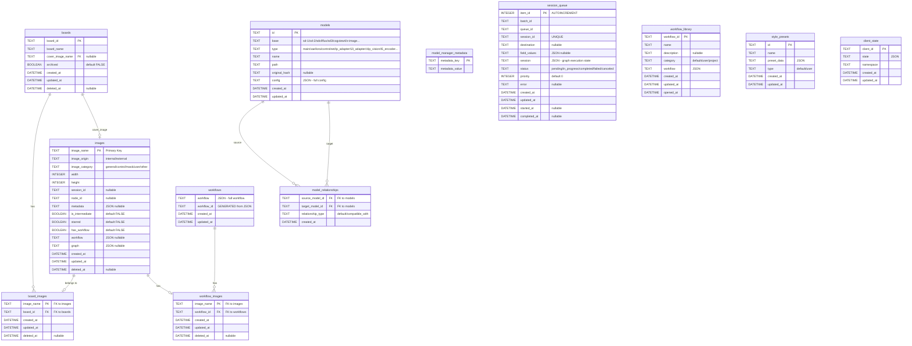

# InvokeAI v6.11.1.post1 - ERD, 테이블 명세서, API 명세서

> **문서 버전:** v1.3
> **최초 작성:** 2026-02-07 14:20 UTC
> **최종 수정:** 2026-02-08 07:35 UTC
> **대상 코드:** InvokeAI v6.11.1.post1 (Pinksea-AI fork)

---

## 목차
1. [현재 ERD (Entity Relationship Diagram)](#1-현재-erd)
2. [SaaS 확장 ERD](#2-saas-확장-erd)
3. [전체 테이블 명세서 (현재)](#3-전체-테이블-명세서-현재)
4. [SaaS 추가 테이블 명세서](#4-saas-추가-테이블-명세서)
5. [API 엔드포인트 동기/비동기 처리 분석](#5-api-엔드포인트-동기비동기-처리-분석)
6. [전체 API 명세서 (현재)](#6-전체-api-명세서-현재)
7. [SaaS 추가 API 명세서](#7-saas-추가-api-명세서)

---

## 1. 현재 ERD



---

## 2. SaaS 확장 ERD

```mermaid
erDiagram
    users {
        UUID id PK
        TEXT email "UNIQUE"
        TEXT name
        TEXT cognito_sub "UNIQUE - Cognito User ID"
        TEXT avatar_url "nullable"
        TEXT role "user/admin/super_admin"
        BOOLEAN is_active "default TRUE"
        DATETIME created_at
        DATETIME updated_at
        DATETIME last_login_at
    }

    subscription_plans {
        UUID id PK
        TEXT name "Starter/Pro/Studio/Enterprise/Tester/Trial"
        TEXT slug "UNIQUE"
        TEXT plan_type "paid/internal/trial"
        DECIMAL monthly_price
        DECIMAL annual_price "nullable"
        INTEGER monthly_credits "1 credit = 1 second GPU time"
        TEXT gpu_tier "basic/high_performance/dedicated"
        INTEGER max_queues "동시 실행 큐 수"
        INTEGER max_storage_gb
        TEXT model_access "sd_only/flux_included/full"
        BOOLEAN third_party_api_access "nano-banana 등 외부 API"
        BOOLEAN lora_training "LoRA 학습 (planned)"
        BOOLEAN collaboration "팀 협업 (planned)"
        BOOLEAN node_editor_access
        BOOLEAN api_access
        TEXT features "JSON - feature flags"
        BOOLEAN is_active "default TRUE"
        DATETIME created_at
        DATETIME updated_at
    }

    user_subscriptions {
        UUID id PK
        UUID user_id FK
        UUID plan_id FK
        TEXT stripe_subscription_id "nullable"
        TEXT stripe_customer_id
        TEXT status "active/canceled/past_due/trialing"
        DATETIME current_period_start
        DATETIME current_period_end
        DATETIME trial_end "nullable"
        BOOLEAN cancel_at_period_end "default FALSE"
        DATETIME created_at
        DATETIME updated_at
    }

    credits {
        UUID id PK
        UUID user_id FK
        INTEGER total_credits
        INTEGER used_credits "default 0"
        INTEGER remaining_credits "computed"
        TEXT source "subscription/purchase/admin_grant/promotion"
        DATETIME valid_from
        DATETIME valid_until
        DATETIME created_at
        DATETIME updated_at
    }

    credit_transactions {
        UUID id PK
        UUID user_id FK
        UUID credit_id FK
        INTEGER amount "positive=add, negative=deduct"
        TEXT transaction_type "generation/subscription_renewal/purchase/admin_grant/refund"
        TEXT description
        TEXT reference_id "nullable - job_id or payment_id"
        DATETIME created_at
    }

    usage_records {
        UUID id PK
        UUID user_id FK
        TEXT job_id FK "nullable"
        TEXT action_type "txt2img/img2img/inpaint/upscale/controlnet"
        TEXT model_used
        TEXT gpu_tier
        INTEGER steps
        INTEGER width
        INTEGER height
        INTEGER batch_size
        FLOAT compute_seconds
        INTEGER credits_consumed
        DATETIME created_at
    }

    payments {
        UUID id PK
        UUID user_id FK
        TEXT stripe_payment_intent_id "UNIQUE"
        DECIMAL amount
        TEXT currency "default USD"
        TEXT status "succeeded/pending/failed/refunded"
        TEXT description
        DATETIME created_at
    }

    test_plan_grants {
        UUID id PK
        UUID admin_user_id FK
        UUID target_user_id FK
        INTEGER credits_granted
        DATETIME valid_from
        DATETIME valid_until
        TEXT reason
        DATETIME created_at
    }

    api_keys {
        UUID id PK
        UUID user_id FK
        TEXT key_hash "hashed API key"
        TEXT key_prefix "first 8 chars for identification"
        TEXT name
        BOOLEAN is_active "default TRUE"
        DATETIME last_used_at "nullable"
        DATETIME expires_at "nullable"
        DATETIME created_at
    }

    images_saas {
        TEXT image_name PK
        UUID user_id FK
        TEXT image_origin
        TEXT image_category
        INTEGER width
        INTEGER height
        TEXT s3_key "S3 object key"
        TEXT s3_thumbnail_key
        TEXT metadata "JSON"
        BOOLEAN is_intermediate
        BOOLEAN starred
        TEXT job_id "nullable"
        BIGINT file_size_bytes
        DATETIME created_at
        DATETIME updated_at
    }

    gpu_instances {
        UUID id PK
        TEXT instance_id "AWS instance ID"
        TEXT instance_type "g5.xlarge/g5.2xlarge/p4d.24xlarge"
        TEXT gpu_tier "t4/a10g/a100"
        TEXT status "available/busy/draining/terminated"
        TEXT current_job_id "nullable"
        UUID current_user_id "nullable FK"
        INTEGER gpu_memory_mb
        FLOAT gpu_utilization
        DATETIME last_heartbeat
        DATETIME created_at
    }

    users ||--o{ user_subscriptions : "has"
    subscription_plans ||--o{ user_subscriptions : "provides"
    users ||--o{ credits : "has"
    users ||--o{ credit_transactions : "has"
    credits ||--o{ credit_transactions : "from"
    users ||--o{ usage_records : "generates"
    users ||--o{ payments : "makes"
    users ||--o{ api_keys : "owns"
    users ||--o{ images_saas : "creates"
    users ||--o{ test_plan_grants : "receives"
    users ||--o{ test_plan_grants : "grants"
```



---

## 3. 전체 테이블 명세서 (현재)

### 3.1 images 테이블

| 컬럼 | 타입 | 제약조건 | 설명 |
|------|------|----------|------|
| image_name | TEXT | PK | 이미지 고유 식별자 (예: `abc123def.png`) |
| image_origin | TEXT | NOT NULL | 이미지 출처 (`internal` / `external`) |
| image_category | TEXT | NOT NULL | 카테고리 (`general` / `control` / `mask` / `user` / `other`) |
| width | INTEGER | NOT NULL | 이미지 너비 (px) |
| height | INTEGER | NOT NULL | 이미지 높이 (px) |
| session_id | TEXT | nullable | 생성 세션 ID |
| node_id | TEXT | nullable | 생성 노드 ID |
| metadata | TEXT | nullable | JSON 형식 메타데이터 (프롬프트, 파라미터 등) |
| is_intermediate | BOOLEAN | DEFAULT FALSE | 중간 결과물 여부 |
| starred | BOOLEAN | DEFAULT FALSE | 즐겨찾기 여부 |
| has_workflow | BOOLEAN | DEFAULT FALSE | 워크플로우 포함 여부 |
| workflow | TEXT | nullable | JSON 형식 워크플로우 데이터 |
| graph | TEXT | nullable | JSON 형식 그래프 데이터 |
| created_at | DATETIME | NOT NULL | 생성 시각 |
| updated_at | DATETIME | NOT NULL | 수정 시각 (trigger) |
| deleted_at | DATETIME | nullable | 소프트 삭제 시각 |

**인덱스:**
- `idx_images_image_name` (UNIQUE)
- `idx_images_image_origin`
- `idx_images_image_category`
- `idx_images_created_at`
- `idx_images_starred`

### 3.2 boards 테이블

| 컬럼 | 타입 | 제약조건 | 설명 |
|------|------|----------|------|
| board_id | TEXT | PK | 보드 고유 ID |
| board_name | TEXT | NOT NULL | 보드 이름 |
| cover_image_name | TEXT | FK (images) | 커버 이미지 (nullable) |
| archived | BOOLEAN | DEFAULT FALSE | 보관 여부 |
| created_at | DATETIME | NOT NULL | 생성 시각 |
| updated_at | DATETIME | NOT NULL | 수정 시각 (trigger) |
| deleted_at | DATETIME | nullable | 소프트 삭제 시각 |

**인덱스:** `idx_boards_created_at`

### 3.3 board_images 테이블 (Junction)

| 컬럼 | 타입 | 제약조건 | 설명 |
|------|------|----------|------|
| image_name | TEXT | PK, FK (images) | 이미지 이름 |
| board_id | TEXT | FK (boards) | 보드 ID |
| created_at | DATETIME | NOT NULL | 생성 시각 |
| updated_at | DATETIME | NOT NULL | 수정 시각 (trigger) |
| deleted_at | DATETIME | nullable | 소프트 삭제 시각 |

**인덱스:**
- `idx_board_images_board_id`
- `idx_board_images_board_id_created_at`

### 3.4 models 테이블 (구 model_config)

| 컬럼 | 타입 | 제약조건 | 설명 |
|------|------|----------|------|
| id | TEXT | PK | 모델 고유 ID |
| base | TEXT | NOT NULL | 기반 모델 (sd-1, sd-2, sdxl, flux, sd3, cogview4, z-image 등) |
| type | TEXT | NOT NULL | 모델 타입 (main, vae, lora, controlnet, ip_adapter 등) |
| name | TEXT | NOT NULL | 모델 이름 |
| path | TEXT | NOT NULL, UNIQUE | 모델 파일 경로 |
| original_hash | TEXT | nullable | 원본 파일 해시 |
| config | TEXT | NOT NULL | JSON 형식 전체 설정 |
| created_at | DATETIME | NOT NULL | 생성 시각 |
| updated_at | DATETIME | NOT NULL | 수정 시각 (trigger) |

**UNIQUE 제약:** (name, base, type)
**인덱스:** base_index, type_index, name_index, path_index (UNIQUE)

### 3.5 model_relationships 테이블

| 컬럼 | 타입 | 제약조건 | 설명 |
|------|------|----------|------|
| source_model_id | TEXT | FK (models), NOT NULL | 소스 모델 ID |
| target_model_id | TEXT | FK (models), NOT NULL | 타겟 모델 ID |
| relationship_type | TEXT | NOT NULL | 관계 유형 (default, compatible_with) |
| created_at | DATETIME | NOT NULL | 생성 시각 |

**PK:** (source_model_id, target_model_id, relationship_type)

### 3.6 session_queue 테이블

| 컬럼 | 타입 | 제약조건 | 설명 |
|------|------|----------|------|
| item_id | INTEGER | PK AUTOINCREMENT | 큐 항목 ID |
| batch_id | TEXT | NOT NULL | 배치 ID |
| queue_id | TEXT | NOT NULL | 큐 ID |
| session_id | TEXT | NOT NULL, UNIQUE | 세션 ID |
| destination | TEXT | nullable | 대상 (프론트엔드 탭 등) |
| field_values | TEXT | nullable | JSON 형식 필드 값 |
| session | TEXT | NOT NULL | JSON 형식 그래프 실행 상태 |
| status | TEXT | NOT NULL, DEFAULT 'pending' | 상태 (pending/in_progress/completed/failed/canceled) |
| priority | INTEGER | NOT NULL, DEFAULT 0 | 우선순위 |
| error | TEXT | nullable | 에러 메시지 |
| created_at | DATETIME | NOT NULL | 생성 시각 |
| updated_at | DATETIME | NOT NULL | 수정 시각 (trigger) |
| started_at | DATETIME | nullable | 시작 시각 (trigger) |
| completed_at | DATETIME | nullable | 완료 시각 (trigger) |

**인덱스:**
- `idx_session_queue_item_id` (UNIQUE)
- `idx_session_queue_session_id` (UNIQUE)
- `idx_session_queue_batch_id`
- `idx_session_queue_created_priority`
- `idx_session_queue_created_status`

### 3.7 workflows 테이블

| 컬럼 | 타입 | 제약조건 | 설명 |
|------|------|----------|------|
| workflow | TEXT | NOT NULL | JSON 형식 워크플로우 |
| workflow_id | TEXT | GENERATED, UNIQUE | JSON에서 추출한 ID |
| created_at | DATETIME | NOT NULL | 생성 시각 |
| updated_at | DATETIME | NOT NULL | 수정 시각 (trigger) |

### 3.8 workflow_library 테이블

| 컬럼 | 타입 | 제약조건 | 설명 |
|------|------|----------|------|
| workflow_id | TEXT | PK | 워크플로우 ID |
| name | TEXT | NOT NULL | 워크플로우 이름 |
| description | TEXT | nullable | 설명 |
| category | TEXT | NOT NULL | 카테고리 (default/user/project) |
| workflow | TEXT | NOT NULL | JSON 형식 워크플로우 데이터 |
| created_at | DATETIME | NOT NULL | 생성 시각 |
| updated_at | DATETIME | NOT NULL | 수정 시각 |
| opened_at | DATETIME | NOT NULL | 마지막 열린 시각 |

### 3.9 style_presets 테이블

| 컬럼 | 타입 | 제약조건 | 설명 |
|------|------|----------|------|
| id | TEXT | PK | 프리셋 ID |
| name | TEXT | NOT NULL | 프리셋 이름 |
| preset_data | TEXT | NOT NULL | JSON 형식 프리셋 데이터 (positive/negative prompt) |
| type | TEXT | NOT NULL | 타입 (default/user) |
| created_at | DATETIME | NOT NULL | 생성 시각 |
| updated_at | DATETIME | NOT NULL | 수정 시각 |

### 3.10 client_state 테이블

| 컬럼 | 타입 | 제약조건 | 설명 |
|------|------|----------|------|
| client_id | TEXT | PK | 클라이언트 식별자 |
| state | TEXT | NOT NULL | JSON 형식 UI 상태 |
| namespace | TEXT | NOT NULL | 네임스페이스 |
| created_at | DATETIME | NOT NULL | 생성 시각 |
| updated_at | DATETIME | NOT NULL | 수정 시각 |

---

## 4. SaaS 추가 테이블 명세서

### 4.1 users 테이블

| 컬럼 | 타입 | 제약조건 | 설명 |
|------|------|----------|------|
| id | UUID | PK | 사용자 고유 ID |
| email | VARCHAR(255) | UNIQUE, NOT NULL | 이메일 |
| name | VARCHAR(100) | NOT NULL | 표시 이름 |
| cognito_sub | VARCHAR(255) | UNIQUE, NOT NULL | AWS Cognito User Pool Sub |
| avatar_url | TEXT | nullable | 프로필 이미지 URL |
| role | VARCHAR(20) | NOT NULL, DEFAULT 'user' | 역할 (user/admin/super_admin) |
| is_active | BOOLEAN | DEFAULT TRUE | 활성 상태 |
| created_at | TIMESTAMPTZ | NOT NULL | 가입 시각 |
| updated_at | TIMESTAMPTZ | NOT NULL | 수정 시각 |
| last_login_at | TIMESTAMPTZ | nullable | 마지막 로그인 |

### 4.2 subscription_plans 테이블

| 컬럼 | 타입 | 제약조건 | 설명 |
|------|------|----------|------|
| id | UUID | PK | 플랜 ID |
| name | VARCHAR(50) | NOT NULL | 플랜 이름 |
| slug | VARCHAR(50) | UNIQUE | URL-safe 슬러그 |
| plan_type | VARCHAR(20) | NOT NULL | 플랜 타입 (paid/internal/trial) |
| monthly_price | DECIMAL(10,2) | NOT NULL | 월 요금 (USD) |
| annual_price | DECIMAL(10,2) | nullable | 연간 요금 |
| monthly_credits | INTEGER | NOT NULL | 월 크레딧 (1 credit = 1 sec GPU time) |
| gpu_tier | VARCHAR(30) | NOT NULL | GPU 등급 (basic/high_performance/dedicated) |
| max_queues | INTEGER | NOT NULL, DEFAULT 1 | 동시 실행 큐 수 |
| max_storage_gb | INTEGER | NOT NULL | 최대 저장 용량 (GB) |
| model_access | VARCHAR(30) | NOT NULL | 모델 접근 범위 (sd_only/flux_included/full) |
| third_party_api_access | BOOLEAN | DEFAULT FALSE | 외부 API 접근 (nano-banana 등) |
| lora_training | BOOLEAN | DEFAULT FALSE | LoRA 학습 기능 (planned) |
| collaboration | BOOLEAN | DEFAULT FALSE | 팀 협업 기능 (planned) |
| node_editor_access | BOOLEAN | DEFAULT FALSE | 노드 에디터 접근 |
| api_access | BOOLEAN | DEFAULT FALSE | API 접근 |
| features | JSONB | nullable | 추가 기능 플래그 |
| is_active | BOOLEAN | DEFAULT TRUE | 활성 상태 |
| created_at | TIMESTAMPTZ | NOT NULL | 생성 시각 |
| updated_at | TIMESTAMPTZ | NOT NULL | 수정 시각 |

**기본 플랜 설정 (1 credit = 1초 GPU 시간, GPU 원가 $0.0014/s, 과금 $0.005/s):**

| 플랜 | 타입 | 월 요금 | 크레딧/월 | GPU 티어 | 큐 수 | 저장공간 | 모델 접근 | 3rd Party API | LoRA 학습 | 협업 |
|------|------|---------|-----------|----------|-------|---------|----------|--------------|----------|------|
| Starter | paid | $25 | 5,000 | Basic (T4) | 1 | 20GB | SD only | No | No | No |
| Pro | paid | $75 | 15,000 | High-Perf (A10G) | 1 | 100GB | Flux 포함 | Yes | No | No |
| Studio | paid | $150 | 30,000 | High-Perf (A10G) | 3 | 200GB | Flux 포함 | Yes | Planned | Planned |
| Enterprise | paid | Custom | Custom | Dedicated (A100) | Custom | Custom | Full | Yes | Yes | Yes |
| Tester | internal | $0 | 50,000 | Basic (T4) | 1 | 20GB | Flux 포함 | Yes | No | No |
| Trial | trial | $0 | 500 | Basic (T4) | 1 | 5GB | SD only | No | No | No |

**크레딧 경제학:**

| 플랜 | 월 매출 | GPU 원가 (크레딧×$0.0014) | 순이익 | 마진 |
|------|---------|--------------------------|--------|------|
| Starter | $25 | $7.00 | $18.00 | 72% |
| Pro | $75 | $21.00 | $54.00 | 72% |
| Studio | $150 | $42.00 | $108.00 | 72% |

**Trial 플랜 정책:**
- 기간: 7일
- 조건: Starter 플랜과 동일한 기능 제한
- 크레딧: 500 크레딧 (= 500초 GPU 시간)
- 만료 후: 유료 전환 안내, 데이터 30일 보관

**Tester 플랜 정책:**
- 부여 방식: 관리자가 기존 유저에게 수동 부여
- GPU 성능: Basic (Starter와 동일)
- 특별 권한: Flux 모델 + 3rd Party API 접근 (Pro 수준)

### 4.3 user_subscriptions 테이블

| 컬럼 | 타입 | 제약조건 | 설명 |
|------|------|----------|------|
| id | UUID | PK | 구독 ID |
| user_id | UUID | FK (users) | 사용자 ID |
| plan_id | UUID | FK (subscription_plans) | 플랜 ID |
| stripe_subscription_id | VARCHAR(255) | nullable | Stripe 구독 ID |
| stripe_customer_id | VARCHAR(255) | NOT NULL | Stripe 고객 ID |
| status | VARCHAR(20) | NOT NULL | 상태 (active/canceled/past_due/trialing) |
| current_period_start | TIMESTAMPTZ | NOT NULL | 현재 기간 시작 |
| current_period_end | TIMESTAMPTZ | NOT NULL | 현재 기간 종료 |
| trial_end | TIMESTAMPTZ | nullable | 트라이얼 종료 |
| cancel_at_period_end | BOOLEAN | DEFAULT FALSE | 기간 말 취소 예약 |
| created_at | TIMESTAMPTZ | NOT NULL | 생성 시각 |
| updated_at | TIMESTAMPTZ | NOT NULL | 수정 시각 |

### 4.4 credits 테이블

| 컬럼 | 타입 | 제약조건 | 설명 |
|------|------|----------|------|
| id | UUID | PK | 크레딧 ID |
| user_id | UUID | FK (users) | 사용자 ID |
| total_credits | INTEGER | NOT NULL | 부여된 총 크레딧 |
| used_credits | INTEGER | DEFAULT 0 | 사용한 크레딧 |
| source | VARCHAR(30) | NOT NULL | 출처 (subscription/purchase/admin_grant/promotion) |
| valid_from | TIMESTAMPTZ | NOT NULL | 유효 시작일 |
| valid_until | TIMESTAMPTZ | NOT NULL | 유효 종료일 |
| created_at | TIMESTAMPTZ | NOT NULL | 생성 시각 |
| updated_at | TIMESTAMPTZ | NOT NULL | 수정 시각 |

### 4.5 credit_transactions 테이블

| 컬럼 | 타입 | 제약조건 | 설명 |
|------|------|----------|------|
| id | UUID | PK | 트랜잭션 ID |
| user_id | UUID | FK (users) | 사용자 ID |
| credit_id | UUID | FK (credits) | 크레딧 ID |
| amount | INTEGER | NOT NULL | 금액 (+부여/-차감) |
| transaction_type | VARCHAR(30) | NOT NULL | 타입 (generation/renewal/purchase/admin_grant/refund) |
| description | TEXT | NOT NULL | 설명 |
| reference_id | VARCHAR(255) | nullable | 참조 ID (job_id, payment_id) |
| created_at | TIMESTAMPTZ | NOT NULL | 생성 시각 |

### 4.6 usage_records 테이블

| 컬럼 | 타입 | 제약조건 | 설명 |
|------|------|----------|------|
| id | UUID | PK | 레코드 ID |
| user_id | UUID | FK (users) | 사용자 ID |
| job_id | VARCHAR(255) | nullable | 작업 ID |
| action_type | VARCHAR(30) | NOT NULL | 작업 유형 (txt2img/img2img/inpaint/upscale/controlnet) |
| model_used | VARCHAR(255) | NOT NULL | 사용 모델 이름 |
| gpu_tier | VARCHAR(20) | NOT NULL | GPU 등급 |
| steps | INTEGER | NOT NULL | 스텝 수 |
| width | INTEGER | NOT NULL | 너비 |
| height | INTEGER | NOT NULL | 높이 |
| batch_size | INTEGER | NOT NULL | 배치 크기 |
| compute_seconds | FLOAT | NOT NULL | 연산 시간 (초) |
| credits_consumed | INTEGER | NOT NULL | 소비 크레딧 |
| created_at | TIMESTAMPTZ | NOT NULL | 생성 시각 |

### 4.7 payments 테이블

| 컬럼 | 타입 | 제약조건 | 설명 |
|------|------|----------|------|
| id | UUID | PK | 결제 ID |
| user_id | UUID | FK (users) | 사용자 ID |
| stripe_payment_intent_id | VARCHAR(255) | UNIQUE | Stripe 결제 인텐트 ID |
| amount | DECIMAL(10,2) | NOT NULL | 결제 금액 |
| currency | VARCHAR(3) | DEFAULT 'USD' | 통화 |
| status | VARCHAR(20) | NOT NULL | 상태 (succeeded/pending/failed/refunded) |
| description | TEXT | NOT NULL | 설명 |
| created_at | TIMESTAMPTZ | NOT NULL | 생성 시각 |

### 4.8 tester_plan_grants 테이블

Tester 플랜은 관리자가 기존 유저에게 수동으로 부여합니다. GPU는 Basic 티어(T4)이지만 Flux 모델 + 3rd Party API 접근이 가능합니다 (Pro 수준 기능).

| 컬럼 | 타입 | 제약조건 | 설명 |
|------|------|----------|------|
| id | UUID | PK | 부여 ID |
| admin_user_id | UUID | FK (users) | 부여한 관리자 ID |
| target_user_id | UUID | FK (users) | 대상 사용자 ID (기존 유저) |
| credits_granted | INTEGER | NOT NULL, DEFAULT 50000 | 부여 크레딧 (기본 50,000) |
| valid_from | TIMESTAMPTZ | NOT NULL | 유효 시작일 |
| valid_until | TIMESTAMPTZ | NOT NULL | 유효 종료일 |
| reason | TEXT | NOT NULL | 부여 사유 |
| revoked | BOOLEAN | DEFAULT FALSE | 회수 여부 |
| revoked_at | TIMESTAMPTZ | nullable | 회수 시각 |
| created_at | TIMESTAMPTZ | NOT NULL | 생성 시각 |

---

## 5. API 엔드포인트 동기/비동기 처리 분석

모든 128개 API 엔드포인트는 `async def`로 선언되어 있으나, 내부에서 **동기 블로킹 서비스 메서드**를 호출합니다. 아래 표는 각 라우터별 동기/비동기 처리 현황입니다.

### 5.1 라우터별 동기 블로킹 호출 현황

| 라우터 | 엔드포인트 수 | 핸들러 타입 | 동기 블로킹 호출 내용 | SaaS 전환 시 대응 |
|--------|-------------|-----------|---------------------|------------------|
| **images.py** | 26 | 전부 async def | SQLite SELECT/INSERT/UPDATE/DELETE + 파일 I/O (open/read/write) + PIL 이미지 디코딩 | asyncpg + S3 (aioboto3) |
| **model_manager.py** | 28 | 전부 async def | SQLite + 파일 I/O + HTTP 요청 (HuggingFace) + 모델 로딩 (GPU) | asyncpg + 모델 관리 분리 |
| **session_queue.py** | 21 | 전부 async def | SQLite (대부분) - `enqueue_batch()`만 `asyncio.to_thread()` 사용 | SQS + Redis |
| **workflows.py** | 12 | 전부 async def | SQLite + 파일 I/O (썸네일 저장/삭제) | asyncpg + S3 |
| **style_presets.py** | 8 | 전부 async def | SQLite + 파일 I/O (프리셋 이미지) | asyncpg + S3 |
| **boards.py** | 6 | 전부 async def | SQLite + 파일 I/O (보드 이미지 삭제) | asyncpg |
| **app_info.py** | 9 | 전부 async def | 캐시/로거 접근 (경량 동기) | 영향 낮음 |
| **board_images.py** | 4 | 전부 async def | SQLite SELECT/INSERT/DELETE | asyncpg |
| **model_relationships.py** | 4 | 전부 async def | SQLite SELECT/INSERT/DELETE | asyncpg |
| **client_state.py** | 3 | 전부 async def | SQLite SELECT/INSERT/UPDATE/DELETE | asyncpg |
| **download_queue.py** | 6 | 전부 async def | 인메모리 상태 접근 + 스레드 작업 관리 | 영향 낮음 |
| **utilities.py** | 1 | 전부 async def | CPU 바운드 프롬프트 파싱 | asyncio.to_thread() |

### 5.2 동기 블로킹 패턴 상세

**패턴 A: SQLite 동기 쿼리 (가장 빈번)**
```
# 모든 라우터에서 사용되는 패턴
async def get_image(image_name: str):       # async 핸들러
    result = services.images.get_dto(name)  # ← 동기! (SQLite + RLock)
    return result                            # 이벤트 루프 블로킹
```

**패턴 B: 파일 I/O 동기 블로킹**
```
# images.py, workflows.py, style_presets.py 등
async def get_image_full(image_name: str):
    path = services.images.get_path(name)          # 동기
    with open(path, "rb") as f: content = f.read() # ← 동기 I/O!
    return Response(content=content)
```

**패턴 C: 비동기 올바른 사용 (소수)**
```
# 파일 업로드만 비동기 사용
async def upload_image(file: UploadFile):
    contents = await file.read()  # ← 올바른 비동기
    pil_image = Image.open(...)   # ← 동기 (PIL)
    services.images.create(...)   # ← 동기 (SQLite + 파일 저장)
```

### 5.3 SaaS 전환 시 비동기 개선 전략

| 현재 동기 호출 | SaaS 비동기 전환 방식 | 사용 기술 |
|---------------|---------------------|----------|
| `cursor.execute(SQL)` | `await session.execute(SQL)` | asyncpg + SQLAlchemy async |
| `open(path).read()` | `await aiofiles.open(path)` 또는 S3 | aiofiles / aioboto3 |
| `Image.open(bytes)` | `await asyncio.to_thread(Image.open, bytes)` | asyncio.to_thread |
| `torch.load(path)` | GPU 워커에서 동기 유지 (분리) | SQS + 별도 프로세스 |
| `model_cache.lock()` | 워커별 독립 캐시 (동기 유지) | 프로세스 격리 |

---

## 6. 전체 API 명세서 (현재)

### 6.1 App Info APIs (`/api/v1/app`)

| Method | Endpoint | 설명 | Request | Response |
|--------|----------|------|---------|----------|
| GET | `/api/v1/app/version` | 앱 버전 조회 | - | `{ version: string }` |
| GET | `/api/v1/app/app_config` | 앱 설정 조회 | - | `AppConfig` |
| GET | `/api/v1/app/invocation_cache/status` | 캐시 상태 | - | `InvocationCacheStatus` |
| PUT | `/api/v1/app/invocation_cache/enable` | 캐시 활성화 | - | - |
| PUT | `/api/v1/app/invocation_cache/disable` | 캐시 비활성화 | - | - |
| DELETE | `/api/v1/app/invocation_cache` | 캐시 삭제 | - | - |
| GET | `/api/v1/app/logging` | 로그 레벨 조회 | - | `LogLevel` |
| POST | `/api/v1/app/logging` | 로그 레벨 설정 | `{ level }` | - |

### 6.2 Image APIs (`/api/v1/images`)

| Method | Endpoint | 설명 | Request | Response |
|--------|----------|------|---------|----------|
| POST | `/api/v1/images/upload` | 이미지 업로드 | `multipart/form-data` | `ImageDTO` |
| GET | `/api/v1/images/` | 이미지 목록 조회 | query: offset, limit, categories, board_id 등 | `OffsetPaginatedResults[ImageDTO]` |
| GET | `/api/v1/images/names` | 이미지 이름 목록 | query: filters | `ImageNamesResult` |
| POST | `/api/v1/images/images_by_names` | 이름으로 이미지 조회 | `{ image_names: string[] }` | `ImageDTO[]` |
| GET | `/api/v1/images/i/{image_name}` | 이미지 DTO 조회 | - | `ImageDTO` |
| PATCH | `/api/v1/images/i/{image_name}` | 이미지 수정 | `ImageRecordChanges` | `ImageDTO` |
| DELETE | `/api/v1/images/i/{image_name}` | 이미지 삭제 | - | `DeleteImagesResult` |
| GET | `/api/v1/images/i/{image_name}/metadata` | 메타데이터 조회 | - | `MetadataField` |
| GET | `/api/v1/images/i/{image_name}/workflow` | 워크플로우 조회 | - | `WorkflowAndGraphResponse` |
| GET | `/api/v1/images/i/{image_name}/full` | 원본 이미지 파일 | - | `image/png` |
| GET | `/api/v1/images/i/{image_name}/thumbnail` | 썸네일 | - | `image/webp` |
| GET | `/api/v1/images/i/{image_name}/urls` | 이미지 URL 조회 | - | `ImageUrlsDTO` |
| POST | `/api/v1/images/delete` | 다중 이미지 삭제 | `{ image_names: string[] }` | `DeleteImagesResult` |
| DELETE | `/api/v1/images/uncategorized` | 미분류 이미지 삭제 | - | `DeleteImagesResult` |
| POST | `/api/v1/images/star` | 이미지 즐겨찾기 | `{ image_names: string[] }` | `StarredImagesResult` |
| POST | `/api/v1/images/unstar` | 즐겨찾기 해제 | `{ image_names: string[] }` | `UnstarredImagesResult` |
| POST | `/api/v1/images/download` | 대량 다운로드 | `{ image_names, board_id }` | `ImagesDownloaded` |
| GET | `/api/v1/images/download/{name}` | 다운로드 ZIP | - | `application/zip` |
| GET | `/api/v1/images/intermediates` | 중간물 개수 | - | `int` |
| DELETE | `/api/v1/images/intermediates` | 중간물 삭제 | - | `int` |

### 6.3 Board APIs (`/api/v1/boards`)

| Method | Endpoint | 설명 | Request | Response |
|--------|----------|------|---------|----------|
| POST | `/api/v1/boards/` | 보드 생성 | `{ board_name }` | `BoardDTO` |
| GET | `/api/v1/boards/` | 보드 목록 | query: offset, limit | `OffsetPaginatedResults[BoardDTO]` |
| GET | `/api/v1/boards/{board_id}` | 보드 조회 | - | `BoardDTO` |
| PATCH | `/api/v1/boards/{board_id}` | 보드 수정 | `BoardChanges` | `BoardDTO` |
| DELETE | `/api/v1/boards/{board_id}` | 보드 삭제 | query: include_images | - |

### 6.4 Board Images APIs (`/api/v1/board_images`)

| Method | Endpoint | 설명 | Request | Response |
|--------|----------|------|---------|----------|
| POST | `/api/v1/board_images/` | 이미지-보드 연결 | `{ board_id, image_name }` | - |
| DELETE | `/api/v1/board_images/` | 연결 해제 | `{ board_id, image_name }` | - |

### 6.5 Session Queue APIs (`/api/v1/queue`)

| Method | Endpoint | 설명 | Request | Response |
|--------|----------|------|---------|----------|
| POST | `/api/v1/queue/{queue_id}/enqueue_batch` | 배치 큐잉 | `Batch` | `EnqueueBatchResult` |
| GET | `/api/v1/queue/{queue_id}/list_all` | 전체 큐 항목 | query: destination | `SessionQueueItem[]` |
| GET | `/api/v1/queue/{queue_id}/item_ids` | 큐 항목 ID 목록 | query: order_dir | `ItemIdsResult` |
| POST | `/api/v1/queue/{queue_id}/items_by_ids` | ID로 큐 항목 조회 | `{ item_ids: int[] }` | `SessionQueueItem[]` |
| GET | `/api/v1/queue/{queue_id}/status` | 큐 상태 | - | `SessionQueueAndProcessorStatus` |
| GET | `/api/v1/queue/{queue_id}/current` | 현재 실행 항목 | - | `SessionQueueItem` |
| GET | `/api/v1/queue/{queue_id}/next` | 다음 대기 항목 | - | `SessionQueueItem` |
| GET | `/api/v1/queue/{queue_id}/i/{item_id}` | 큐 항목 조회 | - | `SessionQueueItem` |
| DELETE | `/api/v1/queue/{queue_id}/i/{item_id}` | 큐 항목 삭제 | - | - |
| PUT | `/api/v1/queue/{queue_id}/i/{item_id}/cancel` | 항목 취소 | - | `SessionQueueItem` |
| PUT | `/api/v1/queue/{queue_id}/processor/resume` | 프로세서 재개 | - | `SessionProcessorStatus` |
| PUT | `/api/v1/queue/{queue_id}/processor/pause` | 프로세서 일시중지 | - | `SessionProcessorStatus` |
| PUT | `/api/v1/queue/{queue_id}/cancel_all_except_current` | 현재 외 전체 취소 | - | `CancelAllExceptCurrentResult` |
| PUT | `/api/v1/queue/{queue_id}/delete_all_except_current` | 현재 외 전체 삭제 | - | `DeleteAllExceptCurrentResult` |
| PUT | `/api/v1/queue/{queue_id}/cancel_by_batch_ids` | 배치별 취소 | `{ batch_ids }` | `CancelByBatchIDsResult` |
| PUT | `/api/v1/queue/{queue_id}/cancel_by_destination` | 대상별 취소 | query: destination | `CancelByDestinationResult` |
| PUT | `/api/v1/queue/{queue_id}/retry_items_by_id` | 항목 재시도 | `{ item_ids }` | `RetryItemsResult` |
| PUT | `/api/v1/queue/{queue_id}/clear` | 큐 초기화 | - | `ClearResult` |
| PUT | `/api/v1/queue/{queue_id}/prune` | 완료/실패 항목 정리 | - | `PruneResult` |
| GET | `/api/v1/queue/{queue_id}/b/{batch_id}/status` | 배치 상태 | - | `BatchStatus` |
| GET | `/api/v1/queue/{queue_id}/counts_by_destination` | 대상별 카운트 | query: destination | `SessionQueueCountsByDestination` |
| DELETE | `/api/v1/queue/{queue_id}/d/{destination}` | 대상별 삭제 | - | `DeleteByDestinationResult` |

### 6.6 Model Manager APIs (`/api/v2/models`)

| Method | Endpoint | 설명 | Request | Response |
|--------|----------|------|---------|----------|
| GET | `/api/v2/models/` | 모델 목록 | query: base_models, model_type, model_name, model_format | `ModelsList` |
| GET | `/api/v2/models/i/{key}` | 모델 조회 | - | `AnyModelConfig` |
| PATCH | `/api/v2/models/i/{key}` | 모델 수정 | `ModelRecordChanges` | `AnyModelConfig` |
| DELETE | `/api/v2/models/i/{key}` | 모델 삭제 | - | - |
| GET | `/api/v2/models/i/{key}/image` | 모델 이미지 | - | `image/*` |
| PATCH | `/api/v2/models/i/{key}/image` | 모델 이미지 설정 | `multipart/form-data` | - |
| DELETE | `/api/v2/models/i/{key}/image` | 모델 이미지 삭제 | - | - |
| GET | `/api/v2/models/tags` | 태그 목록 | - | `string[]` |
| GET | `/api/v2/models/tags/search` | 태그 검색 | query: query | `string[]` |
| GET | `/api/v2/models/scan_folder` | 폴더 스캔 | query: scan_path | `FoundModel[]` |
| PUT | `/api/v2/models/scan` | 모델 디렉토리 스캔 | - | - |
| PUT | `/api/v2/models/scan_and_delete_orphans` | 고아 모델 삭제 | - | - |
| GET | `/api/v2/models/get_by_attrs` | 속성별 조회 | query: name, base, type | `AnyModelConfig` |
| POST | `/api/v2/models/install` | 모델 설치 | query: source, config | `ModelInstallJob` |
| GET | `/api/v2/models/install` | 설치 작업 목록 | - | `ModelInstallJob[]` |
| GET | `/api/v2/models/install/{id}` | 설치 작업 상태 | - | `ModelInstallJob` |
| DELETE | `/api/v2/models/install/{id}` | 설치 취소 | - | - |
| GET | `/api/v2/models/hugging_face` | HuggingFace 검색 | query: hugging_face_id | `HuggingFaceModels` |
| PUT | `/api/v2/models/convert/{key}` | 모델 변환 | - | `AnyModelConfig` |

### 6.7 Workflow APIs (`/api/v1/workflows`)

| Method | Endpoint | 설명 | Request | Response |
|--------|----------|------|---------|----------|
| GET | `/api/v1/workflows/` | 워크플로우 목록 | query: page, per_page, query, category, order_by | `PaginatedResults[WorkflowRecordListItemDTO]` |
| GET | `/api/v1/workflows/i/{workflow_id}` | 워크플로우 조회 | - | `WorkflowRecordDTO` |
| POST | `/api/v1/workflows/` | 워크플로우 생성 | `Workflow` | `WorkflowRecordDTO` |
| PATCH | `/api/v1/workflows/i/{workflow_id}` | 워크플로우 수정 | `Workflow` | `WorkflowRecordDTO` |
| DELETE | `/api/v1/workflows/i/{workflow_id}` | 워크플로우 삭제 | - | - |
| GET | `/api/v1/workflows/i/{workflow_id}/thumbnail` | 썸네일 조회 | - | `image/*` |
| POST | `/api/v1/workflows/i/{workflow_id}/thumbnail` | 썸네일 설정 | `multipart/form-data` | - |

### 6.8 Style Preset APIs (`/api/v1/style_presets`)

| Method | Endpoint | 설명 | Request | Response |
|--------|----------|------|---------|----------|
| GET | `/api/v1/style_presets/` | 프리셋 목록 | - | `StylePresetRecordDTO[]` |
| GET | `/api/v1/style_presets/i/{id}` | 프리셋 조회 | - | `StylePresetRecordDTO` |
| POST | `/api/v1/style_presets/` | 프리셋 생성 | `multipart/form-data` | `StylePresetRecordDTO` |
| PATCH | `/api/v1/style_presets/i/{id}` | 프리셋 수정 | `multipart/form-data` | `StylePresetRecordDTO` |
| DELETE | `/api/v1/style_presets/i/{id}` | 프리셋 삭제 | - | - |
| GET | `/api/v1/style_presets/i/{id}/image` | 프리셋 이미지 | - | `image/*` |

### 6.9 Download Queue APIs (`/api/v1/download_queue`)

| Method | Endpoint | 설명 | Request | Response |
|--------|----------|------|---------|----------|
| GET | `/api/v1/download_queue/` | 다운로드 목록 | - | `DownloadJob[]` |
| PUT | `/api/v1/download_queue/{id}` | 다운로드 취소 | - | - |
| DELETE | `/api/v1/download_queue/` | 전체 정리 | - | - |

### 6.10 Client State APIs (`/api/v1/client_state`)

| Method | Endpoint | 설명 | Request | Response |
|--------|----------|------|---------|----------|
| GET | `/api/v1/client_state/{namespace}/{client_id}` | 상태 조회 | - | `ClientState` |
| PUT | `/api/v1/client_state/{namespace}/{client_id}` | 상태 저장 | `{ state }` | - |

### 6.11 Utilities APIs (`/api/v1/utilities`)

| Method | Endpoint | 설명 | Request | Response |
|--------|----------|------|---------|----------|
| POST | `/api/v1/utilities/dynamicprompts` | 동적 프롬프트 파싱 | `{ prompt, max_prompts }` | `DynamicPromptsResponse` |

### 6.12 WebSocket Events (Socket.IO)

| Event | Direction | 설명 | Payload |
|-------|-----------|------|---------|
| `invocation_started` | Server -> Client | 노드 실행 시작 | `{ queue_item, invocation }` |
| `invocation_progress` | Server -> Client | 노드 실행 진행 | `{ queue_item, invocation, message, percentage, image }` |
| `invocation_complete` | Server -> Client | 노드 실행 완료 | `{ queue_item, invocation, result }` |
| `invocation_error` | Server -> Client | 노드 실행 오류 | `{ queue_item, invocation, error }` |
| `queue_item_status_changed` | Server -> Client | 큐 항목 상태 변경 | `{ queue_item, batch_status, queue_status }` |
| `batch_enqueued` | Server -> Client | 배치 큐잉 완료 | `{ enqueue_result }` |
| `queue_cleared` | Server -> Client | 큐 초기화 | `{ queue_id }` |
| `download_started` | Server -> Client | 다운로드 시작 | `{ job }` |
| `download_progress` | Server -> Client | 다운로드 진행 | `{ job }` |
| `download_complete` | Server -> Client | 다운로드 완료 | `{ job }` |
| `download_error` | Server -> Client | 다운로드 오류 | `{ job }` |
| `model_load_started` | Server -> Client | 모델 로딩 시작 | `{ config, submodel_type }` |
| `model_load_complete` | Server -> Client | 모델 로딩 완료 | `{ config, submodel_type }` |
| `model_install_started` | Server -> Client | 모델 설치 시작 | `{ job }` |
| `model_install_download_progress` | Server -> Client | 설치 다운로드 진행 | `{ job }` |
| `model_install_complete` | Server -> Client | 모델 설치 완료 | `{ job }` |
| `model_install_error` | Server -> Client | 모델 설치 오류 | `{ job }` |
| `bulk_download_started` | Server -> Client | 대량 다운로드 시작 | `{ id, item_id, item_name }` |
| `bulk_download_complete` | Server -> Client | 대량 다운로드 완료 | `{ id, item_id, item_name }` |
| `bulk_download_error` | Server -> Client | 대량 다운로드 오류 | `{ id, item_id, item_name, error }` |

---

## 7. SaaS 추가 API 명세서

### 7.1 Authentication APIs (`/api/v1/auth`)

| Method | Endpoint | 설명 | Request | Response |
|--------|----------|------|---------|----------|
| POST | `/api/v1/auth/signup` | 회원가입 | `{ email, password, name }` | `{ user, tokens }` |
| POST | `/api/v1/auth/login` | 로그인 | `{ email, password }` | `{ access_token, refresh_token }` |
| POST | `/api/v1/auth/logout` | 로그아웃 | - | - |
| POST | `/api/v1/auth/refresh` | 토큰 갱신 | `{ refresh_token }` | `{ access_token }` |
| POST | `/api/v1/auth/forgot-password` | 비밀번호 재설정 요청 | `{ email }` | - |
| POST | `/api/v1/auth/reset-password` | 비밀번호 재설정 | `{ token, password }` | - |
| GET | `/api/v1/auth/me` | 내 정보 | - | `UserDTO` |
| PATCH | `/api/v1/auth/me` | 내 정보 수정 | `UserUpdateDTO` | `UserDTO` |

### 7.2 Subscription APIs (`/api/v1/subscriptions`)

| Method | Endpoint | 설명 | Request | Response |
|--------|----------|------|---------|----------|
| GET | `/api/v1/subscriptions/plans` | 플랜 목록 | - | `SubscriptionPlan[]` |
| GET | `/api/v1/subscriptions/my` | 내 구독 | - | `UserSubscription` |
| POST | `/api/v1/subscriptions/subscribe` | 구독 시작 | `{ plan_id, payment_method_id }` | `UserSubscription` |
| PUT | `/api/v1/subscriptions/change-plan` | 플랜 변경 | `{ plan_id }` | `UserSubscription` |
| POST | `/api/v1/subscriptions/cancel` | 구독 취소 | - | `UserSubscription` |
| POST | `/api/v1/subscriptions/reactivate` | 구독 재활성화 | - | `UserSubscription` |

### 7.3 Credit APIs (`/api/v1/credits`)

| Method | Endpoint | 설명 | Request | Response |
|--------|----------|------|---------|----------|
| GET | `/api/v1/credits/balance` | 크레딧 잔액 | - | `CreditBalance` |
| GET | `/api/v1/credits/transactions` | 거래 내역 | query: page, limit, type | `PaginatedResults[CreditTransaction]` |
| POST | `/api/v1/credits/purchase` | 크레딧 구매 | `{ amount, payment_method_id }` | `CreditPurchaseResult` |
| GET | `/api/v1/credits/usage` | 사용량 통계 | query: period, start_date, end_date | `UsageStats` |

### 7.4 Admin APIs (`/api/v1/admin`)

| Method | Endpoint | 설명 | Request | Response |
|--------|----------|------|---------|----------|
| GET | `/api/v1/admin/users` | 사용자 목록 | query: page, limit, search | `PaginatedResults[UserDTO]` |
| GET | `/api/v1/admin/users/{id}` | 사용자 상세 | - | `UserDetailDTO` |
| PATCH | `/api/v1/admin/users/{id}` | 사용자 수정 | `AdminUserUpdate` | `UserDTO` |
| POST | `/api/v1/admin/users/{id}/deactivate` | 사용자 비활성화 | - | - |
| POST | `/api/v1/admin/tester-plan/grant` | Tester 플랜 부여 | `{ user_id, credits(default:50000), duration_days, reason }` | `TesterPlanGrant` |
| DELETE | `/api/v1/admin/tester-plan/grant/{id}` | Tester 플랜 회수 | - | `TesterPlanGrant` |
| GET | `/api/v1/admin/tester-plan/grants` | Tester 부여 내역 | query: page, limit, active_only | `PaginatedResults[TesterPlanGrant]` |
| GET | `/api/v1/admin/dashboard/revenue` | 수익 대시보드 | query: period | `RevenueDashboard` |
| GET | `/api/v1/admin/dashboard/usage` | 사용량 대시보드 | query: period | `UsageDashboard` |
| GET | `/api/v1/admin/gpu/status` | GPU 풀 상태 | - | `GPUPoolStatus` |
| POST | `/api/v1/admin/plans` | 플랜 생성 | `SubscriptionPlanCreate` | `SubscriptionPlan` |
| PATCH | `/api/v1/admin/plans/{id}` | 플랜 수정 | `SubscriptionPlanUpdate` | `SubscriptionPlan` |

### 7.5 Stripe Webhook (`/api/v1/webhooks`)

| Method | Endpoint | 설명 | Request | Response |
|--------|----------|------|---------|----------|
| POST | `/api/v1/webhooks/stripe` | Stripe 웹훅 | Stripe Event | 200 OK |

**처리하는 이벤트:**
- `checkout.session.completed` - 결제 완료
- `customer.subscription.created` - 구독 생성
- `customer.subscription.updated` - 구독 변경
- `customer.subscription.deleted` - 구독 삭제
- `invoice.payment_succeeded` - 인보이스 결제 성공
- `invoice.payment_failed` - 인보이스 결제 실패
