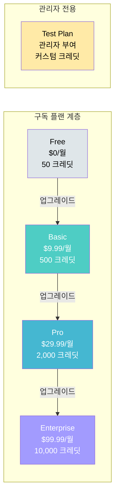
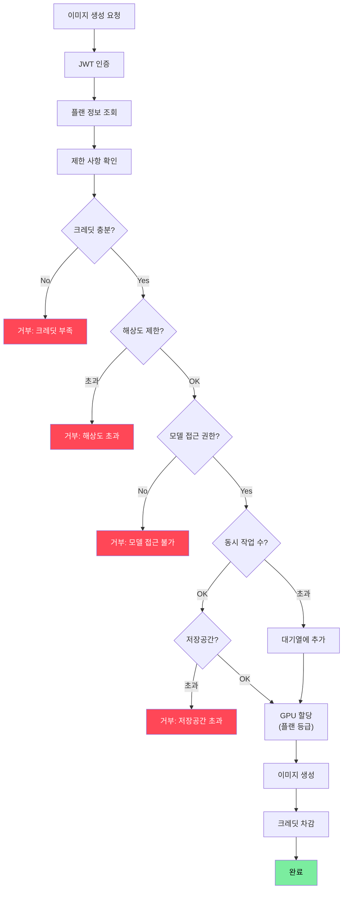
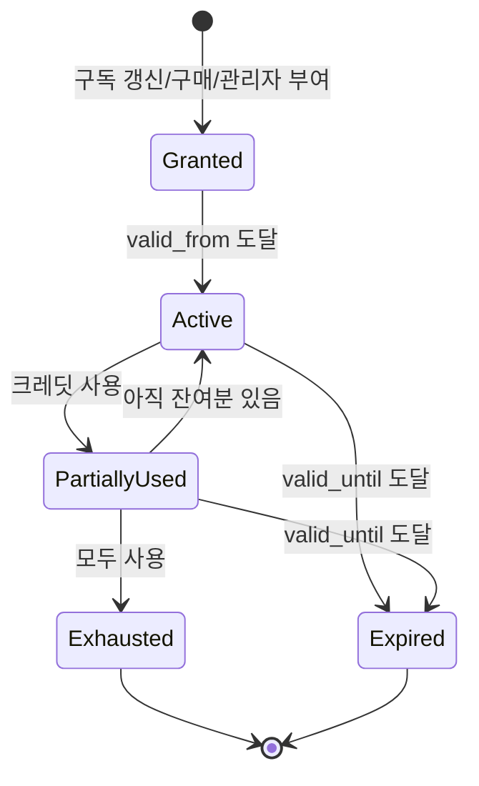
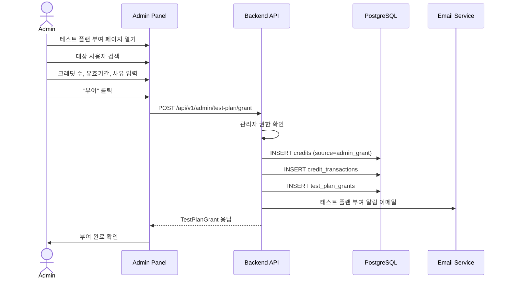
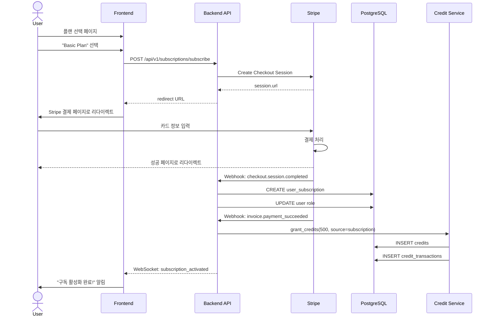
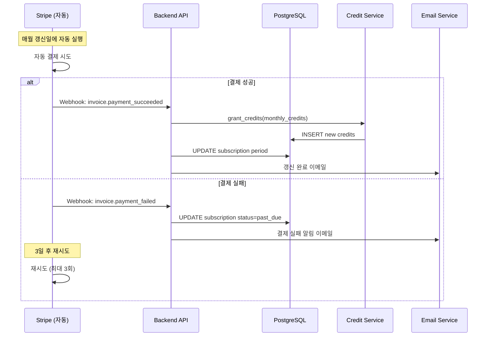
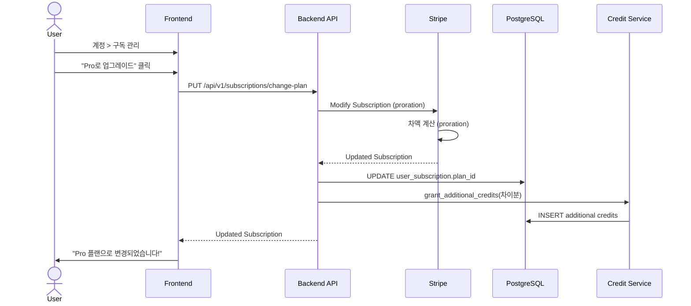
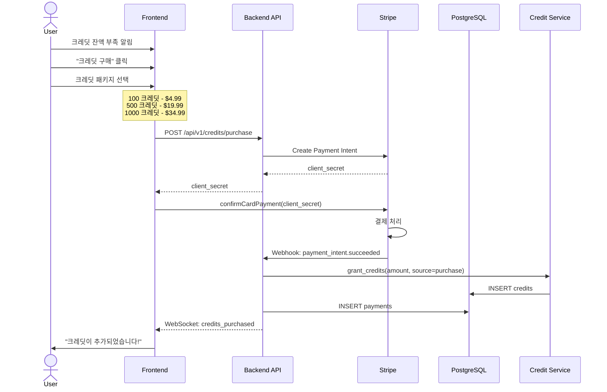

# InvokeAI SaaS - 구독 및 결제 시스템 설계

## 목차
1. [구독 플랜 상세 설계](#1-구독-플랜-상세-설계)
2. [크레딧 시스템 설계](#2-크레딧-시스템-설계)
3. [테스트 플랜 시스템](#3-테스트-플랜-시스템)
4. [Stripe 연동 상세 구현](#4-stripe-연동-상세-구현)
5. [크레딧 산정 공식](#5-크레딧-산정-공식)
6. [결제 플로우 다이어그램](#6-결제-플로우-다이어그램)

---

## 1. 구독 플랜 상세 설계

### 1.1 4가지 구독 플랜 + 테스트 플랜



### 1.2 플랜별 상세 스펙

| 기능 | Free | Basic ($9.99) | Pro ($29.99) | Enterprise ($99.99) | Test (관리자) |
|------|------|---------------|--------------|---------------------|--------------|
| **월 크레딧** | 50 | 500 | 2,000 | 10,000 | 관리자 설정 |
| **GPU 등급** | T4 (16GB) | T4 (16GB) | A10G (24GB) | A100 (40GB) | 관리자 설정 |
| **최대 해상도** | 1024x1024 | 1536x1536 | 2048x2048 | 4096x4096 | 관리자 설정 |
| **최대 배치** | 1 | 4 | 8 | 16 | 관리자 설정 |
| **동시 작업** | 1 | 2 | 4 | 8 | 관리자 설정 |
| **저장 공간** | 1GB | 10GB | 50GB | 200GB | 관리자 설정 |
| **노드 에디터** | X | X | O | O | 관리자 설정 |
| **API 접근** | X | X | O | O | 관리자 설정 |
| **우선 큐** | X | X | O | O | 관리자 설정 |
| **SD 1.x/2.x** | O | O | O | O | O |
| **SDXL** | O | O | O | O | O |
| **FLUX** | X | O | O | O | 관리자 설정 |
| **SD3** | X | X | O | O | 관리자 설정 |
| **CogView4** | X | X | O | O | 관리자 설정 |
| **Z-Image** | X | X | X | O | 관리자 설정 |
| **ControlNet** | 기본만 | 전체 | 전체 | 전체 | 관리자 설정 |
| **IP-Adapter** | X | O | O | O | 관리자 설정 |
| **업스케일** | 2x | 4x | 4x | 8x | 관리자 설정 |
| **커스텀 모델** | X | X | O | O | 관리자 설정 |
| **워터마크** | O (강제) | O (강제) | X (선택) | X (선택) | 관리자 설정 |
| **이메일 지원** | X | O | O | O | X |
| **우선 지원** | X | X | X | O | X |
| **유효기간** | 무제한 | 월 갱신 | 월 갱신 | 월 갱신 | 관리자 설정 |

### 1.3 플랜 제한 적용 포인트



---

## 2. 크레딧 시스템 설계

### 2.1 크레딧 생명주기



### 2.2 크레딧 차감 로직

```python
# invokeai/app/services/credits/credit_service.py
"""
크레딧 관리 서비스
"""
from datetime import datetime, timezone
from typing import Optional
from uuid import UUID

from sqlalchemy import select, update
from sqlalchemy.ext.asyncio import AsyncSession


class CreditService:
    def __init__(self, db_session_factory):
        self._session_factory = db_session_factory

    async def get_balance(self, user_id: UUID) -> dict:
        """사용자의 유효한 크레딧 잔액 조회"""
        async with self._session_factory() as session:
            now = datetime.now(timezone.utc)
            result = await session.execute(
                select(Credit)
                .where(
                    Credit.user_id == user_id,
                    Credit.valid_from <= now,
                    Credit.valid_until > now,
                )
            )
            credits = result.scalars().all()

            total = sum(c.total_credits for c in credits)
            used = sum(c.used_credits for c in credits)

            return {
                "total_credits": total,
                "used_credits": used,
                "remaining_credits": total - used,
            }

    async def deduct_credits(
        self,
        user_id: UUID,
        amount: int,
        transaction_type: str,
        description: str,
        reference_id: Optional[str] = None,
    ) -> bool:
        """크레딧 차감 (FIFO - 가장 오래된 크레딧부터 차감)"""
        async with self._session_factory() as session:
            now = datetime.now(timezone.utc)

            # 유효한 크레딧을 만료일 순으로 가져옴 (가장 빨리 만료되는 것부터)
            result = await session.execute(
                select(Credit)
                .where(
                    Credit.user_id == user_id,
                    Credit.valid_from <= now,
                    Credit.valid_until > now,
                    Credit.used_credits < Credit.total_credits,
                )
                .order_by(Credit.valid_until.asc())
                .with_for_update()  # 동시성 보장을 위한 행 잠금
            )
            credits = result.scalars().all()

            remaining_to_deduct = amount
            transactions = []

            for credit in credits:
                if remaining_to_deduct <= 0:
                    break

                available = credit.total_credits - credit.used_credits
                deduct = min(available, remaining_to_deduct)

                credit.used_credits += deduct
                remaining_to_deduct -= deduct

                transactions.append(CreditTransaction(
                    user_id=user_id,
                    credit_id=credit.id,
                    amount=-deduct,
                    transaction_type=transaction_type,
                    description=description,
                    reference_id=reference_id,
                ))

            if remaining_to_deduct > 0:
                # 크레딧 부족
                await session.rollback()
                return False

            session.add_all(transactions)
            await session.commit()
            return True

    async def grant_credits(
        self,
        user_id: UUID,
        amount: int,
        source: str,
        valid_from: datetime,
        valid_until: datetime,
        admin_user_id: Optional[UUID] = None,
    ) -> None:
        """크레딧 부여"""
        async with self._session_factory() as session:
            credit = Credit(
                user_id=user_id,
                total_credits=amount,
                used_credits=0,
                source=source,
                valid_from=valid_from,
                valid_until=valid_until,
            )
            session.add(credit)

            transaction = CreditTransaction(
                user_id=user_id,
                credit_id=credit.id,
                amount=amount,
                transaction_type="grant" if source == "admin_grant" else "subscription_renewal",
                description=f"Credit grant: {amount} credits from {source}",
            )
            session.add(transaction)

            # 테스트 플랜 부여 기록
            if source == "admin_grant" and admin_user_id:
                grant = TestPlanGrant(
                    admin_user_id=admin_user_id,
                    target_user_id=user_id,
                    credits_granted=amount,
                    valid_from=valid_from,
                    valid_until=valid_until,
                    reason="Admin test plan grant",
                )
                session.add(grant)

            await session.commit()
```

### 2.3 크레딧 잔액 확인 미들웨어

```python
# invokeai/app/api/middleware/credit_check.py
"""
크레딧 확인 미들웨어
이미지 생성 요청 전에 크레딧 잔액을 확인
"""
from fastapi import Depends, HTTPException

from invokeai.app.api.middleware.auth import get_current_user
from invokeai.app.services.credits.credit_service import CreditService


async def check_credits(
    estimated_cost: int,
    current_user: dict = Depends(get_current_user),
    credit_service: CreditService = Depends(get_credit_service),
) -> dict:
    """크레딧 충분한지 확인"""
    balance = await credit_service.get_balance(current_user["id"])
    if balance["remaining_credits"] < estimated_cost:
        raise HTTPException(
            status_code=402,
            detail={
                "error": "insufficient_credits",
                "remaining": balance["remaining_credits"],
                "required": estimated_cost,
                "message": "크레딧이 부족합니다. 플랜을 업그레이드하거나 크레딧을 구매하세요.",
            },
        )
    return current_user
```

---

## 3. 테스트 플랜 시스템

### 3.1 테스트 플랜 부여 플로우



### 3.2 테스트 플랜 관리 API

```python
# invokeai/app/api/routers/admin.py (테스트 플랜 관련 부분)

@admin_router.post("/test-plan/grant")
async def grant_test_plan(
    target_user_id: UUID = Body(...),
    credits: int = Body(..., gt=0),
    duration_days: int = Body(..., gt=0, le=365),
    reason: str = Body(..., min_length=10),
    gpu_tier: str = Body(default="t4"),
    max_resolution: int = Body(default=1024),
    current_user: dict = Depends(require_admin),
    credit_service: CreditService = Depends(),
) -> TestPlanGrant:
    """관리자가 사용자에게 테스트 크레딧 부여"""
    now = datetime.now(timezone.utc)
    valid_until = now + timedelta(days=duration_days)

    await credit_service.grant_credits(
        user_id=target_user_id,
        amount=credits,
        source="admin_grant",
        valid_from=now,
        valid_until=valid_until,
        admin_user_id=current_user["id"],
    )

    return TestPlanGrant(
        admin_user_id=current_user["id"],
        target_user_id=target_user_id,
        credits_granted=credits,
        valid_from=now,
        valid_until=valid_until,
        reason=reason,
    )
```

---

## 4. Stripe 연동 상세 구현

### 4.1 Stripe 설정

```python
# invokeai/app/services/billing/stripe_service.py
"""
Stripe 결제 서비스
"""
import stripe
from invokeai.app.services.config import get_config

config = get_config()
stripe.api_key = config.stripe_secret_key


class StripeService:
    @staticmethod
    async def create_customer(email: str, name: str) -> str:
        """Stripe 고객 생성"""
        customer = stripe.Customer.create(email=email, name=name)
        return customer.id

    @staticmethod
    async def create_checkout_session(
        customer_id: str,
        price_id: str,  # Stripe Price ID
        success_url: str,
        cancel_url: str,
    ) -> str:
        """결제 세션 생성"""
        session = stripe.checkout.Session.create(
            customer=customer_id,
            payment_method_types=["card"],
            line_items=[{"price": price_id, "quantity": 1}],
            mode="subscription",
            success_url=success_url,
            cancel_url=cancel_url,
        )
        return session.url

    @staticmethod
    async def cancel_subscription(subscription_id: str) -> None:
        """구독 취소 (기간 말에 취소)"""
        stripe.Subscription.modify(
            subscription_id,
            cancel_at_period_end=True,
        )

    @staticmethod
    async def change_plan(subscription_id: str, new_price_id: str) -> None:
        """플랜 변경"""
        subscription = stripe.Subscription.retrieve(subscription_id)
        stripe.Subscription.modify(
            subscription_id,
            items=[{
                "id": subscription["items"]["data"][0].id,
                "price": new_price_id,
            }],
            proration_behavior="create_prorations",
        )
```

### 4.2 Stripe Webhook 처리

```python
# invokeai/app/api/routers/webhooks.py
"""
Stripe 웹훅 처리
"""
import stripe
from fastapi import APIRouter, HTTPException, Request

from invokeai.app.services.billing.stripe_service import StripeService
from invokeai.app.services.credits.credit_service import CreditService

webhooks_router = APIRouter(prefix="/v1/webhooks", tags=["webhooks"])


@webhooks_router.post("/stripe")
async def stripe_webhook(request: Request):
    """Stripe 웹훅 엔드포인트"""
    payload = await request.body()
    sig_header = request.headers.get("stripe-signature")

    try:
        event = stripe.Webhook.construct_event(
            payload, sig_header, config.stripe_webhook_secret
        )
    except stripe.error.SignatureVerificationError:
        raise HTTPException(status_code=400, detail="Invalid signature")

    # 이벤트 유형별 처리
    if event["type"] == "checkout.session.completed":
        session = event["data"]["object"]
        await handle_checkout_completed(session)

    elif event["type"] == "invoice.payment_succeeded":
        invoice = event["data"]["object"]
        await handle_payment_succeeded(invoice)

    elif event["type"] == "invoice.payment_failed":
        invoice = event["data"]["object"]
        await handle_payment_failed(invoice)

    elif event["type"] == "customer.subscription.deleted":
        subscription = event["data"]["object"]
        await handle_subscription_deleted(subscription)

    return {"status": "ok"}


async def handle_payment_succeeded(invoice):
    """결제 성공 시 크레딧 부여"""
    customer_id = invoice["customer"]
    # customer_id로 사용자 찾기
    user = await get_user_by_stripe_customer(customer_id)
    plan = await get_user_plan(user.id)

    # 월 크레딧 부여
    now = datetime.now(timezone.utc)
    await credit_service.grant_credits(
        user_id=user.id,
        amount=plan.monthly_credits,
        source="subscription",
        valid_from=now,
        valid_until=now + timedelta(days=30),
    )
```

---

## 5. 크레딧 산정 공식

### 5.1 크레딧 소비 공식

```
크레딧 소비 = base_cost * resolution_multiplier * steps_multiplier * model_multiplier * batch_size

base_cost = 1 (기본 1 크레딧)

resolution_multiplier:
  - 512x512   = 1.0
  - 768x768   = 1.5
  - 1024x1024 = 2.0
  - 1536x1536 = 3.0
  - 2048x2048 = 4.0
  - 4096x4096 = 8.0

steps_multiplier:
  - 1-20 steps  = 1.0
  - 21-30 steps = 1.2
  - 31-50 steps = 1.5
  - 51+ steps   = 2.0

model_multiplier:
  - SD 1.x     = 1.0
  - SD 2.x     = 1.0
  - SDXL       = 1.5
  - FLUX       = 2.0
  - SD3        = 2.0
  - CogView4   = 2.5
  - Z-Image    = 3.0

추가 비용:
  - ControlNet  = +0.5
  - IP-Adapter  = +0.5
  - LoRA        = +0.2 (per LoRA)
  - 업스케일    = +1.0
```

### 5.2 크레딧 계산 예시

```python
# invokeai/app/services/credits/credit_calculator.py
"""
크레딧 소비량 계산기
"""


class CreditCalculator:
    RESOLUTION_MULTIPLIERS = {
        (0, 512 * 512): 1.0,
        (512 * 512, 768 * 768): 1.5,
        (768 * 768, 1024 * 1024): 2.0,
        (1024 * 1024, 1536 * 1536): 3.0,
        (1536 * 1536, 2048 * 2048): 4.0,
        (2048 * 2048, float("inf")): 8.0,
    }

    STEPS_MULTIPLIERS = {
        (0, 20): 1.0,
        (21, 30): 1.2,
        (31, 50): 1.5,
        (51, float("inf")): 2.0,
    }

    MODEL_MULTIPLIERS = {
        "sd-1": 1.0,
        "sd-2": 1.0,
        "sdxl": 1.5,
        "flux": 2.0,
        "sd3": 2.0,
        "cogview4": 2.5,
        "z-image": 3.0,
    }

    @classmethod
    def calculate(
        cls,
        width: int,
        height: int,
        steps: int,
        model_base: str,
        batch_size: int = 1,
        has_controlnet: bool = False,
        has_ip_adapter: bool = False,
        lora_count: int = 0,
        has_upscale: bool = False,
    ) -> int:
        """크레딧 소비량 계산"""
        base_cost = 1.0
        pixels = width * height

        # 해상도 배율
        res_mult = 1.0
        for (low, high), mult in cls.RESOLUTION_MULTIPLIERS.items():
            if low <= pixels < high:
                res_mult = mult
                break

        # 스텝 배율
        steps_mult = 1.0
        for (low, high), mult in cls.STEPS_MULTIPLIERS.items():
            if low <= steps <= high:
                steps_mult = mult
                break

        # 모델 배율
        model_mult = cls.MODEL_MULTIPLIERS.get(model_base, 1.0)

        # 총 크레딧
        total = base_cost * res_mult * steps_mult * model_mult * batch_size

        # 추가 비용
        if has_controlnet:
            total += 0.5 * batch_size
        if has_ip_adapter:
            total += 0.5 * batch_size
        total += 0.2 * lora_count * batch_size
        if has_upscale:
            total += 1.0 * batch_size

        return max(1, int(total))  # 최소 1 크레딧
```

---

## 6. 결제 플로우 다이어그램

### 6.1 신규 구독 결제 플로우



### 6.2 월 갱신 결제 플로우



### 6.3 플랜 변경 플로우



### 6.4 크레딧 추가 구매 플로우


