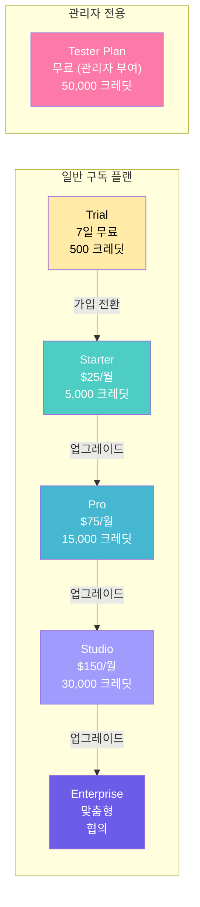
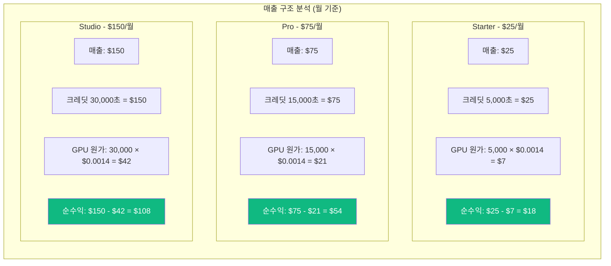
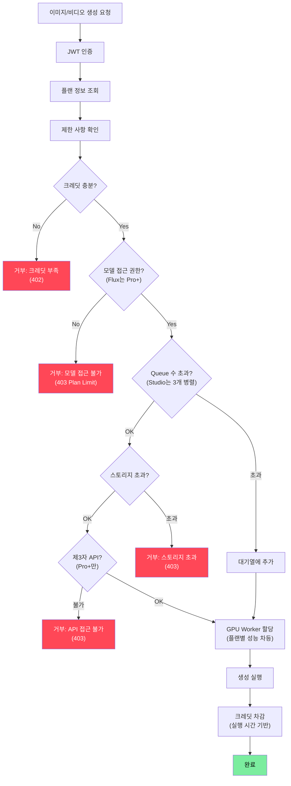
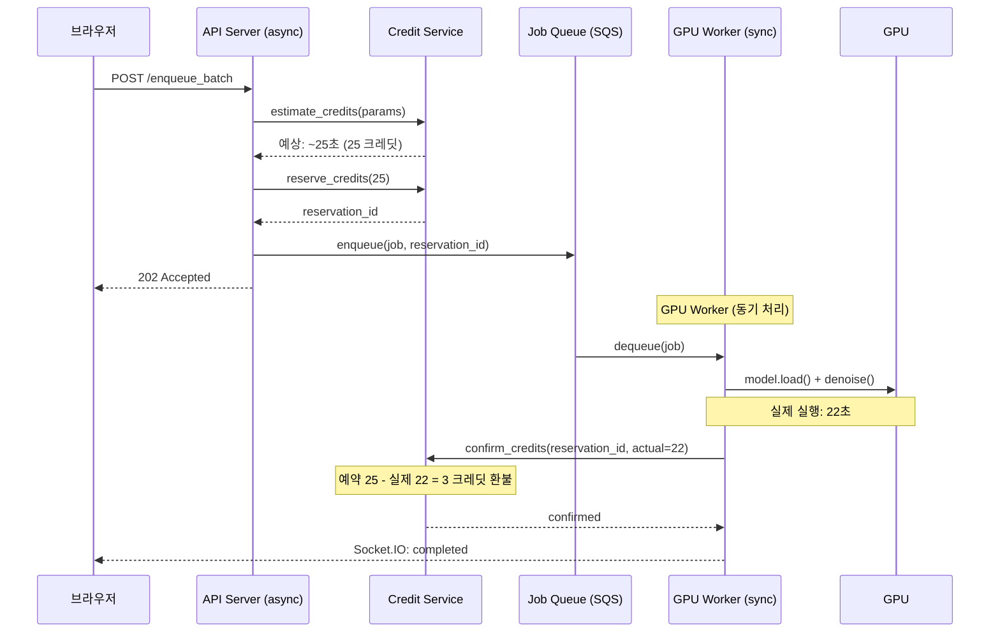
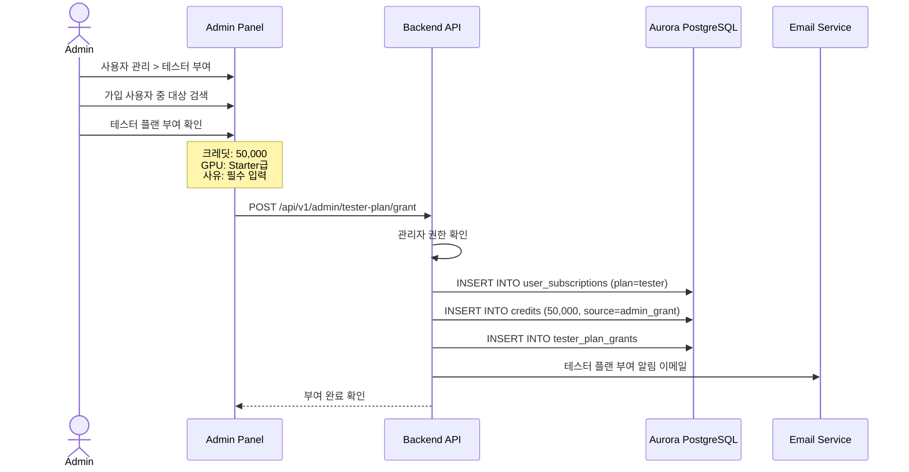
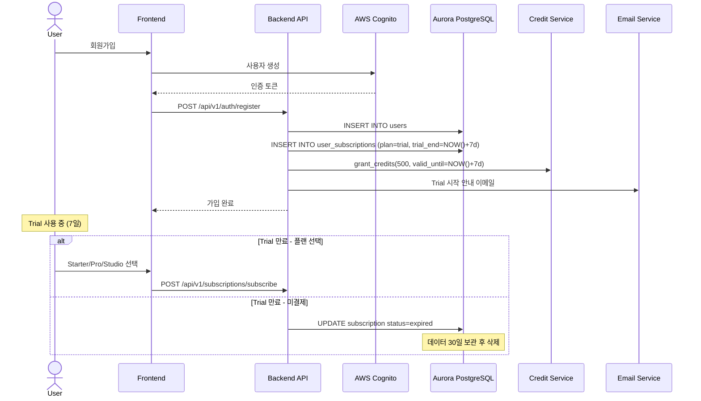
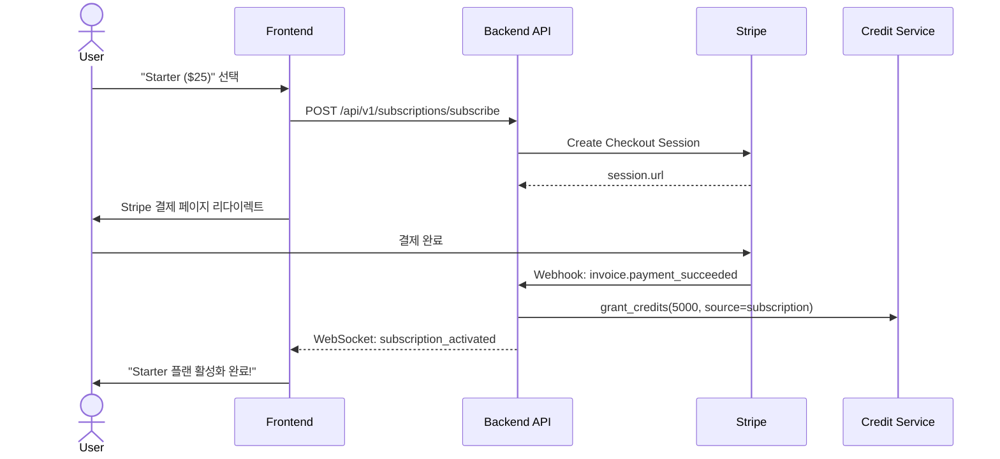
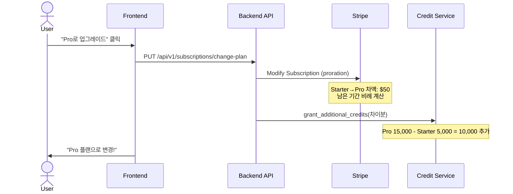
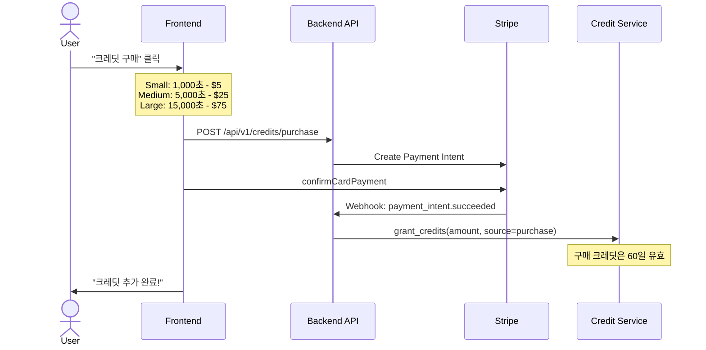
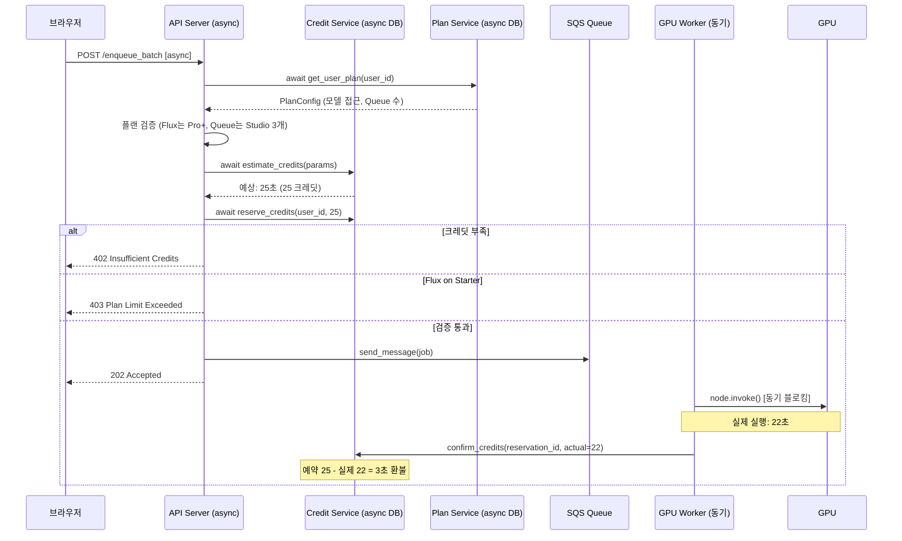

# InvokeAI SaaS - 구독 및 결제 시스템 설계

> **문서 버전:** v2.1
> **최초 작성:** 2026-02-07 14:26 UTC
> **최종 수정:** 2026-02-08 12:00 UTC (Aurora PostgreSQL 전환 반영)
> **대상 코드:** InvokeAI v6.11.1.post1 (Pinksea-AI fork)

---

## 목차
1. [구독 플랜 상세 설계](#1-구독-플랜-상세-설계)
2. [크레딧 시스템 설계](#2-크레딧-시스템-설계)
3. [테스터 플랜 시스템](#3-테스터-플랜-시스템)
4. [Trial 기간 설계](#4-trial-기간-설계)
5. [Stripe 연동 상세 구현](#5-stripe-연동-상세-구현)
6. [크레딧 산정 공식](#6-크레딧-산정-공식)
7. [결제 플로우 다이어그램](#7-결제-플로우-다이어그램)
8. [동기/비동기 플랜 검증 흐름](#8-동기비동기-플랜-검증-흐름)

---

## 1. 구독 플랜 상세 설계

### 1.1 매출 구조 및 과금 기본 원칙

STUDIO의 과금 체계는 **GPU 실행 시간 기반**입니다:

| 항목 | 값 | 설명 |
|------|---|------|
| **1 크레딧** | = 1초 GPU 시간 | 크레딧 소비의 기본 단위 |
| **GPU 원가** | $0.0014/초 | AWS GPU 인스턴스 실행 원가 |
| **STUDIO 과금** | $0.005/초 | 사용자 과금 단가 |
| **마진율** | ~72% | ($0.005 - $0.0014) / $0.005 |

### 1.2 5가지 구독 플랜 + Trial



### 1.3 플랜별 상세 스펙

| 기능 | Trial (7일) | Starter ($25) | Pro ($75) | Studio ($150) | Enterprise | Tester |
|------|-------------|---------------|-----------|---------------|------------|--------|
| **월 요금** | 무료 (7일) | $25 | $75 | $150 | 맞춤형 | 무료 |
| **기본 제공 크레딧** | 500 | 5,000 | 15,000 | 30,000 | 맞춤형 | 50,000 |
| **크레딧 원가** | - | $7 | $21 | $42 | - | - |
| **순수익** | - | $18 | $54 | $108 | - | - |
| **스토리지** | 20GB | 20GB | 100GB | 200GB | 맞춤형 | 20GB |
| **Queue 수** | 1 | 1 | 1 | 3 (병렬) | 맞춤형 | 1 |
| **GPU Worker 성능** | Starter급 | 기본 | 고성능 | 고성능 | 전용 | Starter급 |
| **SD (기본 AI 모델)** | O | O | O | O | O | O |
| **Flux (고급 모델)** | X | X | O | O | O | O |
| **제3자 API (nano-banana)** | X | X | O | O | O | O |
| **Generate** | O | O | O | O | O | O |
| **Canvas** | O | O | O | O | O | O |
| **Upscaling** | O | O | O | O | O | O |
| **Workflows** | O | O | O | O | O | O |
| **LoRA 커스텀 학습** | X | X | X | O (예정) | O | X |
| **공동 편집** | X | X | X | O (예정) | O | X |
| **전용 인프라/보안** | X | X | X | X | O | X |
| **SLA 지원** | X | X | X | X | O | X |

### 1.4 플랜별 수익 분석



### 1.5 플랜 제한 적용 포인트



### 1.6 GPU Worker 성능 차등

플랜에 따라 GPU Worker의 성능이 차별화됩니다:

| GPU Worker 등급 | 적용 플랜 | 설명 |
|----------------|----------|------|
| **기본 성능** | Trial, Starter, Tester | 표준 GPU 인스턴스, 기본 모델(SD) 전용 |
| **고성능** | Pro, Studio | 고성능 GPU 인스턴스, Flux 등 고급 모델 지원 |
| **전용 인프라** | Enterprise | 전용 GPU 클러스터, SLA 보장, 커스텀 설정 |

> **참고:** GPU Worker 성능 차등은 AWS 인스턴스 타입(g4dn vs g5 등)으로 구현합니다. 자세한 인스턴스 매핑은 문서 06 (AWS 배포 가이드) 섹션 4.1을 참조하세요.

---

## 2. 크레딧 시스템 설계

### 2.1 크레딧 = GPU 실행 시간

**1 크레딧 = 1초 GPU 실행 시간**으로 단순화합니다:

```
크레딧 소비 = GPU 실행 시간 (초)

예시:
- SD1.5 512×512 20 steps: ~5초 → 5 크레딧
- SDXL 1024×1024 30 steps: ~15초 → 15 크레딧
- Flux 1024×1024 20 steps: ~25초 → 25 크레딧
- Z-Image 1024×1024 20 steps: ~40초 → 40 크레딧

비용 환산:
- 5 크레딧 = $0.025 과금 / $0.007 원가
- 25 크레딧 = $0.125 과금 / $0.035 원가
```

### 2.2 크레딧 생명주기

```mermaid
stateDiagram-v2
    [*] --> Granted: 구독 갱신/구매/관리자 부여/Trial
    Granted --> Active: valid_from 도달
    Active --> PartiallyUsed: GPU 실행으로 크레딧 사용
    PartiallyUsed --> Active: 아직 잔여분 있음
    PartiallyUsed --> Exhausted: 모두 사용
    Active --> Expired: valid_until 도달 (구독 미갱신)
    PartiallyUsed --> Expired: valid_until 도달
    Exhausted --> [*]
    Expired --> [*]

    Note right of Active: Trial: 7일 유효<br/>Starter: 30일 유효<br/>Pro: 30일 유효<br/>Studio: 30일 유효<br/>Tester: 관리자 설정
```

### 2.3 실시간 크레딧 차감 메커니즘

이미지 생성은 2단계 크레딧 처리를 사용합니다:



### 2.4 크레딧 차감 서비스

```python
# invokeai/app/services/credits/credit_service.py
"""
시간 기반 크레딧 관리 서비스
1 크레딧 = 1초 GPU 실행 시간
"""
from datetime import datetime, timezone
from typing import Optional
from uuid import UUID, uuid4

from sqlalchemy import select
from sqlalchemy.ext.asyncio import AsyncSession


class CreditService:
    BILLING_RATE_PER_SECOND = 0.005   # $0.005/초
    GPU_COST_PER_SECOND = 0.0014      # $0.0014/초

    def __init__(self, db_session_factory):
        self._session_factory = db_session_factory

    async def get_balance(self, user_id: UUID) -> dict:
        """사용자의 유효한 크레딧(초) 잔액 조회"""
        async with self._session_factory() as session:
            now = datetime.now(timezone.utc)
            result = await session.execute(
                select(Credit).where(
                    Credit.user_id == user_id,
                    Credit.valid_from <= now,
                    Credit.valid_until > now,
                )
            )
            credits = result.scalars().all()
            total = sum(c.total_credits for c in credits)
            used = sum(c.used_credits for c in credits)

            return {
                "total_credits": total,
                "used_credits": used,
                "remaining_credits": total - used,
                "remaining_minutes": round((total - used) / 60, 1),
                "remaining_value_usd": round((total - used) * self.BILLING_RATE_PER_SECOND, 2),
            }

    async def reserve_credits(self, user_id: UUID, estimated_seconds: int) -> str:
        """크레딧 선점 (예약) - 생성 시작 전"""
        reservation_id = str(uuid4())
        async with self._session_factory() as session:
            balance = await self.get_balance(user_id)
            if balance["remaining_credits"] < estimated_seconds:
                raise InsufficientCreditsError(
                    remaining=balance["remaining_credits"],
                    required=estimated_seconds,
                )
            reservation = CreditReservation(
                id=reservation_id,
                user_id=user_id,
                estimated_credits=estimated_seconds,
                status="reserved",
            )
            session.add(reservation)
            await self._deduct_from_oldest(session, user_id, estimated_seconds)
            await session.commit()
        return reservation_id

    async def confirm_credits(self, reservation_id: str, actual_seconds: int) -> int:
        """실제 실행 시간으로 크레딧 확정"""
        async with self._session_factory() as session:
            reservation = await session.get(CreditReservation, reservation_id)
            diff = reservation.estimated_credits - actual_seconds
            if diff > 0:
                await self._refund_credits(session, reservation.user_id, diff)
            reservation.actual_credits = actual_seconds
            reservation.status = "confirmed"
            await session.commit()
            return diff

    async def release_reservation(self, reservation_id: str) -> int:
        """예약 전액 환불 - 생성 실패 시"""
        async with self._session_factory() as session:
            reservation = await session.get(CreditReservation, reservation_id)
            await self._refund_credits(
                session, reservation.user_id, reservation.estimated_credits
            )
            reservation.status = "refunded"
            await session.commit()
            return reservation.estimated_credits

    async def grant_credits(self, user_id: UUID, amount: int, source: str,
                             valid_from: datetime, valid_until: datetime,
                             admin_user_id: Optional[UUID] = None) -> None:
        """크레딧 부여"""
        async with self._session_factory() as session:
            credit = Credit(
                user_id=user_id, total_credits=amount, used_credits=0,
                source=source, valid_from=valid_from, valid_until=valid_until,
            )
            session.add(credit)
            transaction = CreditTransaction(
                user_id=user_id, credit_id=credit.id, amount=amount,
                transaction_type="grant" if source == "admin_grant" else "subscription_renewal",
                description=f"Credit grant: {amount} seconds from {source}",
            )
            session.add(transaction)
            if source == "admin_grant" and admin_user_id:
                grant = TesterPlanGrant(
                    admin_user_id=admin_user_id, target_user_id=user_id,
                    credits_granted=amount, valid_from=valid_from,
                    valid_until=valid_until, reason="Admin tester plan grant",
                )
                session.add(grant)
            await session.commit()

    async def _deduct_from_oldest(self, session: AsyncSession, user_id: UUID,
                                   amount: int) -> None:
        """FIFO 순서로 크레딧 차감"""
        now = datetime.now(timezone.utc)
        result = await session.execute(
            select(Credit).where(
                Credit.user_id == user_id, Credit.valid_from <= now,
                Credit.valid_until > now, Credit.used_credits < Credit.total_credits,
            ).order_by(Credit.valid_until.asc()).with_for_update()
        )
        credits = result.scalars().all()
        remaining = amount
        for credit in credits:
            if remaining <= 0:
                break
            available = credit.total_credits - credit.used_credits
            deduct = min(available, remaining)
            credit.used_credits += deduct
            remaining -= deduct
        if remaining > 0:
            raise InsufficientCreditsError(remaining=0, required=remaining)

    async def _refund_credits(self, session: AsyncSession, user_id: UUID,
                               amount: int) -> None:
        """크레딧 환불"""
        now = datetime.now(timezone.utc)
        result = await session.execute(
            select(Credit).where(
                Credit.user_id == user_id, Credit.valid_until > now, Credit.used_credits > 0,
            ).order_by(Credit.valid_until.desc()).with_for_update()
        )
        credits = result.scalars().all()
        remaining = amount
        for credit in credits:
            if remaining <= 0:
                break
            refund = min(credit.used_credits, remaining)
            credit.used_credits -= refund
            remaining -= refund


class InsufficientCreditsError(Exception):
    def __init__(self, remaining: int, required: int):
        self.remaining = remaining
        self.required = required
```

### 2.5 크레딧 잔액 확인 미들웨어

```python
# invokeai/app/api/middleware/credit_check.py
from fastapi import Depends, HTTPException

async def check_credits(
    estimated_seconds: int,
    current_user: dict = Depends(get_current_user),
    credit_service: CreditService = Depends(get_credit_service),
) -> dict:
    """크레딧(초) 충분한지 확인"""
    balance = await credit_service.get_balance(current_user["id"])
    if balance["remaining_credits"] < estimated_seconds:
        raise HTTPException(
            status_code=402,
            detail={
                "error": "insufficient_credits",
                "remaining_credits": balance["remaining_credits"],
                "remaining_minutes": balance["remaining_minutes"],
                "required_credits": estimated_seconds,
            },
        )
    return current_user
```

---

## 3. 테스터 플랜 시스템

### 3.1 테스터 플랜 개요

테스터(Tester) 플랜은 **관리자가 직접 가입 사용자 중 선택하여 부여**하는 특수 플랜입니다:

| 항목 | 테스터 플랜 스펙 |
|------|-----------------|
| 월 요금 | 무료 |
| 크레딧 | 50,000 (= 50,000초 = ~833분 GPU 시간) |
| 스토리지 | 20GB |
| 주요 기능 | Starter 기능 + Flux 고급 모델 잠금해제 + 제3자 API |
| GPU Worker 성능 | **Starter와 동일한 성능** (기본 GPU 인스턴스) |
| 부여 방식 | 관리자 Admin Panel에서 직접 선택/부여 |

### 3.2 테스터 플랜 부여 플로우



### 3.3 테스터 플랜 관리 API

```python
# invokeai/app/api/routers/admin.py

@admin_router.post("/tester-plan/grant")
async def grant_tester_plan(
    target_user_id: UUID = Body(...),
    duration_days: int = Body(..., gt=0, le=365),
    reason: str = Body(..., min_length=10),
    current_user: dict = Depends(require_admin),
    credit_service: CreditService = Depends(),
    subscription_service: SubscriptionService = Depends(),
) -> TesterPlanGrant:
    """관리자가 사용자에게 테스터 플랜 부여
    크레딧: 50,000 / 스토리지: 20GB / GPU: Starter급
    기능: Starter + Flux + 제3자 API
    """
    now = datetime.now(timezone.utc)
    valid_until = now + timedelta(days=duration_days)

    tester_plan = await subscription_service.get_plan_by_slug("tester")
    await subscription_service.assign_plan(
        user_id=target_user_id, plan_id=tester_plan.id, valid_until=valid_until,
    )
    await credit_service.grant_credits(
        user_id=target_user_id, amount=50_000,
        source="admin_grant", valid_from=now, valid_until=valid_until,
        admin_user_id=current_user["id"],
    )
    return TesterPlanGrant(
        admin_user_id=current_user["id"], target_user_id=target_user_id,
        credits_granted=50_000, valid_from=now, valid_until=valid_until, reason=reason,
    )
```

---

## 4. Trial 기간 설계

### 4.1 Trial 개요

가입 사용자에게 **7일간 Trial 기간**을 제공합니다:

| 항목 | Trial 스펙 |
|------|-----------|
| 기간 | 가입 후 7일 |
| 플랜 수준 | Starter와 동일 조건 |
| 크레딧 | 500 (= 500초 = ~8분 GPU 시간) |
| 스토리지 | 20GB |
| Flux 모델 | X (잠금) |
| Trial 종료 후 | 미결제 시 서비스 일시 중단, 데이터 30일 보관 |

### 4.2 Trial 플로우



### 4.3 Trial 관리 서비스

```python
# invokeai/app/services/subscription/trial_service.py
class TrialService:
    TRIAL_DURATION_DAYS = 7
    TRIAL_CREDITS = 500  # 500초 = ~8분

    async def create_trial(self, user_id: UUID) -> None:
        """신규 가입자에 Trial 생성"""
        now = datetime.now(timezone.utc)
        trial_end = now + timedelta(days=self.TRIAL_DURATION_DAYS)

        trial_plan = await self._get_plan("trial")
        await self._subscription_service.create_subscription(
            user_id=user_id, plan_id=trial_plan.id,
            trial_end=trial_end, status="trialing",
        )
        await self._credit_service.grant_credits(
            user_id=user_id, amount=self.TRIAL_CREDITS,
            source="trial", valid_from=now, valid_until=trial_end,
        )
```

---

## 5. Stripe 연동 상세 구현

### 5.1 Stripe Price ID 매핑

```python
# invokeai/app/services/billing/stripe_config.py
STRIPE_PRICE_MAP = {
    "starter": {"monthly": "price_starter_monthly_25", "credits": 5_000, "storage_gb": 20},
    "pro": {"monthly": "price_pro_monthly_75", "credits": 15_000, "storage_gb": 100},
    "studio": {"monthly": "price_studio_monthly_150", "credits": 30_000, "storage_gb": 200},
}

CREDIT_PACKAGES = {
    "small":  {"price_id": "price_credits_1000",  "credits": 1_000,  "price_usd": 5.00},
    "medium": {"price_id": "price_credits_5000",  "credits": 5_000,  "price_usd": 25.00},
    "large":  {"price_id": "price_credits_15000", "credits": 15_000, "price_usd": 75.00},
}
```

### 5.2 Stripe 결제 서비스

```python
# invokeai/app/services/billing/stripe_service.py
import stripe

class StripeService:
    @staticmethod
    async def create_checkout_session(customer_id: str, price_id: str,
                                       success_url: str, cancel_url: str) -> str:
        session = stripe.checkout.Session.create(
            customer=customer_id,
            payment_method_types=["card"],
            line_items=[{"price": price_id, "quantity": 1}],
            mode="subscription",
            success_url=success_url,
            cancel_url=cancel_url,
        )
        return session.url

    @staticmethod
    async def change_plan(subscription_id: str, new_price_id: str) -> None:
        subscription = stripe.Subscription.retrieve(subscription_id)
        stripe.Subscription.modify(
            subscription_id,
            items=[{"id": subscription["items"]["data"][0].id, "price": new_price_id}],
            proration_behavior="create_prorations",
        )
```

### 5.3 Stripe Webhook 처리

```python
# invokeai/app/api/routers/webhooks.py
@webhooks_router.post("/stripe")
async def stripe_webhook(request: Request):
    payload = await request.body()
    sig_header = request.headers.get("stripe-signature")
    event = stripe.Webhook.construct_event(payload, sig_header, config.stripe_webhook_secret)

    if event["type"] == "invoice.payment_succeeded":
        await handle_payment_succeeded(event["data"]["object"])
    elif event["type"] == "invoice.payment_failed":
        await handle_payment_failed(event["data"]["object"])
    elif event["type"] == "customer.subscription.deleted":
        await handle_subscription_deleted(event["data"]["object"])
    return {"status": "ok"}

async def handle_payment_succeeded(invoice):
    user = await get_user_by_stripe_customer(invoice["customer"])
    plan = await get_user_plan(user.id)
    now = datetime.now(timezone.utc)
    plan_credits = {"starter": 5_000, "pro": 15_000, "studio": 30_000}
    credits = plan_credits.get(plan.slug, 0)
    if credits > 0:
        await credit_service.grant_credits(
            user_id=user.id, amount=credits, source="subscription",
            valid_from=now, valid_until=now + timedelta(days=30),
        )
```

---

## 6. 크레딧 산정 공식

### 6.1 시간 기반 크레딧 소비

```
크레딧 소비 = GPU 실행 시간 (초)
과금 금액 = 크레딧 × $0.005/초

모델별 예상 실행 시간 (1024×1024, 20 steps, batch=1):
- SD 1.5        : ~5초   → 5 크레딧   → $0.025
- SDXL          : ~12초  → 12 크레딧  → $0.060
- Flux          : ~25초  → 25 크레딧  → $0.125
- Z-Image       : ~40초  → 40 크레딧  → $0.200
```

### 6.2 크레딧 소비 예측기

```python
# invokeai/app/services/credits/credit_estimator.py
class CreditEstimator:
    BASE_EXECUTION_TIMES = {
        "sd-1": 5, "sd-2": 6, "sdxl": 12, "sdxl-refiner": 8,
        "flux": 20, "flux2": 22, "sd-3": 18, "cogview4": 25, "z-image": 35,
    }

    @classmethod
    def estimate(cls, model_base: str, width: int, height: int,
                  steps: int, batch_size: int = 1, **kwargs) -> dict:
        base_time = cls.BASE_EXECUTION_TIMES.get(model_base, 10)
        pixel_ratio = (width * height) / (512 * 512)
        res_scale = max(1.0, pixel_ratio ** 0.7)
        step_scale = steps / 20.0
        total_time = int(base_time * res_scale * step_scale * (batch_size ** 0.7))
        estimated_credits = max(1, total_time)
        return {
            "estimated_credits": estimated_credits,
            "estimated_cost_usd": round(estimated_credits * 0.005, 3),
        }
```

### 6.3 플랜별 월간 사용 가능량

| 작업 | Trial (500s) | Starter (5,000s) | Pro (15,000s) | Studio (30,000s) | Tester (50,000s) |
|------|-------------|-----------------|---------------|------------------|------------------|
| SD 1.5 기본 (5s) | ~100장 | ~1,000장 | ~3,000장 | ~6,000장 | ~10,000장 |
| SDXL 고품질 (12s) | ~41장 | ~416장 | ~1,250장 | ~2,500장 | ~4,166장 |
| Flux (25s) | ~20장 | ~200장 | ~600장 | ~1,200장 | ~2,000장 |
| Z-Image (40s) | ~12장 | ~125장 | ~375장 | ~750장 | ~1,250장 |

---

## 7. 결제 플로우 다이어그램

### 7.1 신규 구독 결제 플로우



### 7.2 플랜 변경 플로우



### 7.3 크레딧 추가 구매 플로우



---

## 8. 동기/비동기 플랜 검증 흐름



**핵심:** 1 크레딧 = 1초 GPU 시간 기반으로, reserve(예상) → confirm(실제) 패턴으로 정확한 과금
