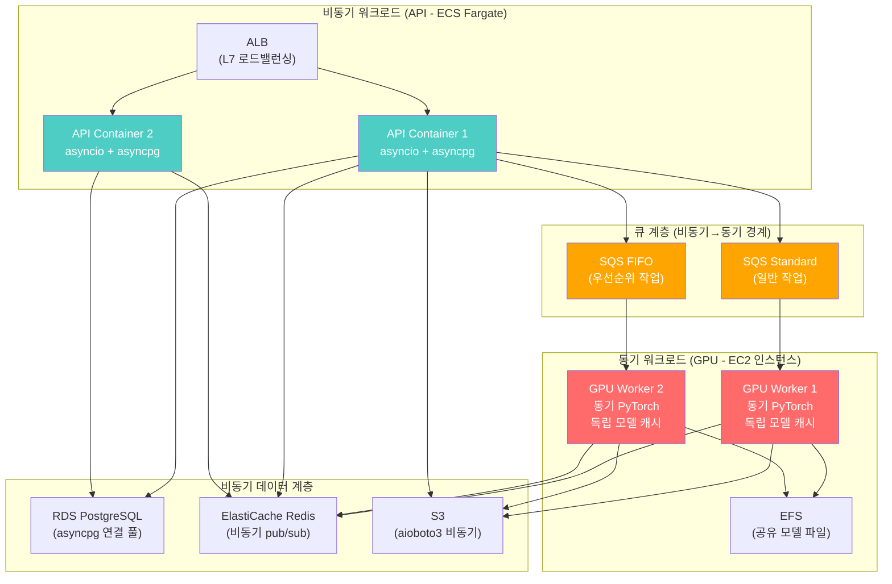

# InvokeAI SaaS - AWS 배포 및 운영 가이드

> **문서 버전:** v1.3
> **최초 작성:** 2026-02-07 14:26 UTC
> **최종 수정:** 2026-02-08 07:35 UTC
> **대상 코드:** InvokeAI v6.11.1.post1 (Pinksea-AI fork)

---

## 목차
1. [AWS 인프라 아키텍처 상세](#1-aws-인프라-아키텍처-상세)
2. [네트워크 구성 (VPC)](#2-네트워크-구성-vpc)
3. [컨테이너 오케스트레이션 (ECS)](#3-컨테이너-오케스트레이션-ecs)
4. [GPU 워커 배포 전략](#4-gpu-워커-배포-전략)
5. [데이터베이스 (RDS PostgreSQL)](#5-데이터베이스-rds-postgresql)
6. [캐시 및 세션 (ElastiCache)](#6-캐시-및-세션-elasticache)
7. [스토리지 (S3 + CloudFront)](#7-스토리지-s3--cloudfront)
8. [모니터링 및 로깅](#8-모니터링-및-로깅)
9. [CI/CD 파이프라인](#9-cicd-파이프라인)
10. [비용 예측 및 최적화](#10-비용-예측-및-최적화)
11. [Terraform IaC 핵심 코드](#11-terraform-iac-핵심-코드)

---

## 1. AWS 인프라 아키텍처 상세


---

## 2. 네트워크 구성 (VPC)

### 2.1 서브넷 설계

| 서브넷 | CIDR | 유형 | 용도 |
|--------|------|------|------|
| Public-A | 10.0.1.0/24 | Public | ALB, NAT Gateway |
| Public-B | 10.0.2.0/24 | Public | ALB, NAT Gateway |
| Private-A | 10.0.11.0/24 | Private | API Containers, GPU Workers |
| Private-B | 10.0.12.0/24 | Private | API Containers, GPU Workers |
| Data-A | 10.0.21.0/24 | Private | RDS, ElastiCache |
| Data-B | 10.0.22.0/24 | Private | RDS, ElastiCache |

### 2.2 보안 그룹

| 보안 그룹 | Inbound | Outbound | 용도 |
|-----------|---------|----------|------|
| sg-alb | 80, 443 from 0.0.0.0/0 | All | ALB |
| sg-api | 8080 from sg-alb | All | API 컨테이너 |
| sg-gpu | - | All | GPU 워커 (SQS polling) |
| sg-rds | 5432 from sg-api, sg-gpu | - | PostgreSQL |
| sg-redis | 6379 from sg-api, sg-gpu | - | Redis |
| sg-efs | 2049 from sg-gpu | - | EFS (NFS) |

### 2.3 동기/비동기 처리 분리와 네트워크 설계

InvokeAI의 **동기 처리 중심 아키텍처**를 SaaS로 전환할 때, 네트워크 수준에서 동기/비동기 워크로드를 분리해야 합니다.



**분리 설계 원칙:**

| 워크로드 | 처리 방식 | 인프라 | 스케일링 기준 |
|----------|----------|--------|-------------|
| API 요청 처리 | 비동기 (asyncio) | ECS Fargate | 동시 연결 수 |
| DB 쿼리 | 비동기 (asyncpg) | RDS PostgreSQL | 커넥션 수 |
| 파일 I/O | 비동기 (aioboto3) | S3 | 요청 수 |
| 이벤트 브로드캐스트 | 비동기 (Redis pub/sub) | ElastiCache | 메시지 수 |
| GPU 추론 | **동기** (PyTorch) | EC2 GPU | SQS 큐 깊이 |
| 모델 로딩 | **동기** (safetensors) | EFS + GPU VRAM | GPU 메모리 |
| 이미지 디코딩 | **동기** (PIL - CPU 바운드) | GPU Worker CPU | - |

---

## 3. 컨테이너 오케스트레이션 (ECS)

### 3.1 API 서비스 (ECS Fargate) - 비동기 최적화

> **중요**: 현재 InvokeAI API 서버는 async 핸들러 내에서 동기 SQLite 호출을 하여 이벤트 루프를 블로킹합니다. SaaS에서는 모든 DB/파일 I/O를 비동기로 전환하여 Fargate 인스턴스의 동시 처리 성능을 극대화해야 합니다.

```dockerfile
# docker/Dockerfile.api
FROM python:3.12-slim

WORKDIR /app

# 시스템 의존성
RUN apt-get update && apt-get install -y \
    libgl1-mesa-glx libglib2.0-0 \
    && rm -rf /var/lib/apt/lists/*

# Python 의존성 설치 (GPU 불필요)
COPY pyproject.toml uv.lock ./
RUN pip install uv && uv pip install --system ".[cpu]"

# 소스 코드 복사
COPY invokeai/ ./invokeai/

# 환경변수
ENV INVOKEAI_HOST=0.0.0.0
ENV INVOKEAI_PORT=8080
ENV INVOKEAI_DEVICE=cpu
ENV DEPLOYMENT_MODE=saas

# 헬스 체크
HEALTHCHECK --interval=30s --timeout=5s --retries=3 \
    CMD curl -f http://localhost:8080/api/v1/app/version || exit 1

EXPOSE 8080
CMD ["python", "-m", "invokeai.app.run_app"]
```

### 3.2 ECS Task Definition (API)

```json
{
  "family": "invokeai-api",
  "networkMode": "awsvpc",
  "requiresCompatibilities": ["FARGATE"],
  "cpu": "2048",
  "memory": "4096",
  "executionRoleArn": "arn:aws:iam::role/ecsTaskExecutionRole",
  "taskRoleArn": "arn:aws:iam::role/invokeaiApiTaskRole",
  "containerDefinitions": [
    {
      "name": "invokeai-api",
      "image": "ECR_REPO_URI:latest",
      "portMappings": [{"containerPort": 8080, "protocol": "tcp"}],
      "environment": [
        {"name": "DEPLOYMENT_MODE", "value": "saas"},
        {"name": "DATABASE_URL", "value": "from-secrets"},
        {"name": "REDIS_URL", "value": "from-secrets"},
        {"name": "SQS_QUEUE_URL", "value": "from-secrets"},
        {"name": "S3_BUCKET", "value": "invokeai-saas-images"},
        {"name": "AWS_REGION", "value": "ap-northeast-2"}
      ],
      "secrets": [
        {"name": "DATABASE_URL", "valueFrom": "arn:aws:secretsmanager:..."},
        {"name": "STRIPE_SECRET_KEY", "valueFrom": "arn:aws:secretsmanager:..."},
        {"name": "COGNITO_CLIENT_SECRET", "valueFrom": "arn:aws:secretsmanager:..."}
      ],
      "logConfiguration": {
        "logDriver": "awslogs",
        "options": {
          "awslogs-group": "/ecs/invokeai-api",
          "awslogs-region": "ap-northeast-2",
          "awslogs-stream-prefix": "api"
        }
      }
    }
  ]
}
```

---

## 4. GPU 워커 배포 전략

> **중요**: GPU 워커는 **동기 실행을 유지**합니다. PyTorch GPU 연산, 모델 로딩, 디노이징 루프는 본질적으로 동기적이며 비동기 전환이 불가능합니다. 대신 **프로세스 단위 수평 확장**으로 동시 처리를 달성합니다. 각 워커는 독립적인 모델 캐시를 갖고, SQS 큐에서 작업을 폴링하여 순차 실행합니다.

### 4.1 GPU 인스턴스 매핑

| GPU 티어 | 대상 플랜 | GPU 타입 | EC2 인스턴스 | GPU VRAM | 시간당 비용 | GPU 비용/초 |
|----------|----------|----------|-------------|----------|------------|------------|
| Basic | Trial / Starter / Tester | NVIDIA T4 | g4dn.xlarge | 16GB | ~$0.526/hr | ~$0.000146 |
| High-Performance | Pro / Studio | NVIDIA A10G | g5.xlarge | 24GB | ~$1.006/hr | ~$0.000279 |
| Dedicated | Enterprise | NVIDIA A100 | p4d.24xlarge | 40GB | ~$32.77/hr | ~$0.009103 |

**크레딧 경제학:**
- 1 크레딧 = 1초 GPU 시간
- GPU 원가: ~$0.0014/초 (T4 기준 가중 평균)
- 과금 단가: $0.005/초 (1 크레딧)
- 마진: ~72%

### 4.2 GPU 워커 Dockerfile

```dockerfile
# docker/Dockerfile.gpu-worker
FROM nvidia/cuda:12.8.0-runtime-ubuntu22.04

WORKDIR /app

# Python + 시스템 의존성
RUN apt-get update && apt-get install -y \
    python3.12 python3.12-venv python3-pip \
    libgl1-mesa-glx libglib2.0-0 \
    && rm -rf /var/lib/apt/lists/*

# PyTorch + InvokeAI 설치 (CUDA 포함)
COPY pyproject.toml uv.lock ./
RUN pip install uv && uv pip install --system ".[cuda]"

# 소스 코드
COPY invokeai/ ./invokeai/

# EFS 마운트 포인트 (공유 모델)
RUN mkdir -p /models

ENV NVIDIA_VISIBLE_DEVICES=all
ENV DEPLOYMENT_MODE=saas
ENV MODEL_DIR=/models

CMD ["python", "-m", "invokeai.worker.gpu_worker"]
```

### 4.3 오토스케일링 정책


**스케일링 규칙:**
- SQS 대기 메시지 > 10: +1 인스턴스 (5분 쿨다운)
- SQS 대기 메시지 > 50: +3 인스턴스 (3분 쿨다운)
- SQS 대기 메시지 < 3 (10분 유지): -1 인스턴스

---

## 5. 데이터베이스 (RDS PostgreSQL)

### 5.1 RDS 설정

| 설정 | 값 |
|------|-----|
| 엔진 | PostgreSQL 16 |
| 인스턴스 | db.r6g.large (2 vCPU, 16GB RAM) |
| 스토리지 | 100GB gp3 (IOPS: 3000) |
| Multi-AZ | Yes |
| 백업 보존 | 7일 |
| 암호화 | AWS KMS |
| Performance Insights | Enabled |

### 5.2 초기 스키마 마이그레이션 스크립트

```sql
-- 01_initial_schema.sql
-- 기존 SQLite 스키마를 PostgreSQL로 변환 + SaaS 확장

-- 사용자 테이블
CREATE TABLE users (
    id UUID PRIMARY KEY DEFAULT gen_random_uuid(),
    email VARCHAR(255) UNIQUE NOT NULL,
    name VARCHAR(100) NOT NULL,
    cognito_sub VARCHAR(255) UNIQUE NOT NULL,
    avatar_url TEXT,
    role VARCHAR(20) NOT NULL DEFAULT 'user',
    is_active BOOLEAN DEFAULT TRUE,
    created_at TIMESTAMPTZ NOT NULL DEFAULT NOW(),
    updated_at TIMESTAMPTZ NOT NULL DEFAULT NOW(),
    last_login_at TIMESTAMPTZ
);

CREATE INDEX idx_users_email ON users(email);
CREATE INDEX idx_users_cognito_sub ON users(cognito_sub);

-- 이미지 테이블 (기존 + user_id + S3)
CREATE TABLE images (
    image_name VARCHAR(255) PRIMARY KEY,
    user_id UUID NOT NULL REFERENCES users(id),
    image_origin VARCHAR(50) NOT NULL,
    image_category VARCHAR(50) NOT NULL,
    width INTEGER NOT NULL,
    height INTEGER NOT NULL,
    session_id VARCHAR(255),
    node_id VARCHAR(255),
    metadata JSONB,
    is_intermediate BOOLEAN DEFAULT FALSE,
    starred BOOLEAN DEFAULT FALSE,
    has_workflow BOOLEAN DEFAULT FALSE,
    workflow JSONB,
    graph JSONB,
    s3_key VARCHAR(512),
    s3_thumbnail_key VARCHAR(512),
    file_size_bytes BIGINT,
    created_at TIMESTAMPTZ NOT NULL DEFAULT NOW(),
    updated_at TIMESTAMPTZ NOT NULL DEFAULT NOW()
);

CREATE INDEX idx_images_user_id ON images(user_id);
CREATE INDEX idx_images_created_at ON images(created_at);
CREATE INDEX idx_images_category ON images(image_category);
CREATE INDEX idx_images_starred ON images(starred);

-- RLS 활성화
ALTER TABLE images ENABLE ROW LEVEL SECURITY;

-- 구독 플랜 테이블
CREATE TABLE subscription_plans (
    id UUID PRIMARY KEY DEFAULT gen_random_uuid(),
    name VARCHAR(50) NOT NULL,
    slug VARCHAR(50) UNIQUE NOT NULL,
    plan_type VARCHAR(20) NOT NULL DEFAULT 'paid',
    monthly_price DECIMAL(10,2) NOT NULL,
    annual_price DECIMAL(10,2),
    monthly_credits INTEGER NOT NULL,
    gpu_tier VARCHAR(30) NOT NULL,
    max_queues INTEGER NOT NULL DEFAULT 1,
    max_storage_gb INTEGER NOT NULL,
    model_access VARCHAR(30) NOT NULL DEFAULT 'sd_only',
    third_party_api_access BOOLEAN DEFAULT FALSE,
    lora_training BOOLEAN DEFAULT FALSE,
    collaboration BOOLEAN DEFAULT FALSE,
    node_editor_access BOOLEAN DEFAULT FALSE,
    api_access BOOLEAN DEFAULT FALSE,
    features JSONB,
    is_active BOOLEAN DEFAULT TRUE,
    created_at TIMESTAMPTZ NOT NULL DEFAULT NOW(),
    updated_at TIMESTAMPTZ NOT NULL DEFAULT NOW()
);

-- 기본 플랜 데이터 삽입 (1 credit = 1초 GPU 시간)
INSERT INTO subscription_plans (name, slug, plan_type, monthly_price, monthly_credits, gpu_tier, max_queues, max_storage_gb, model_access, third_party_api_access, lora_training, collaboration, node_editor_access, api_access) VALUES
('Starter', 'starter', 'paid', 25.00, 5000, 'basic', 1, 20, 'sd_only', FALSE, FALSE, FALSE, TRUE, FALSE),
('Pro', 'pro', 'paid', 75.00, 15000, 'high_performance', 1, 100, 'flux_included', TRUE, FALSE, FALSE, TRUE, TRUE),
('Studio', 'studio', 'paid', 150.00, 30000, 'high_performance', 3, 200, 'flux_included', TRUE, FALSE, FALSE, TRUE, TRUE),
('Enterprise', 'enterprise', 'paid', 0, 0, 'dedicated', 0, 0, 'full', TRUE, TRUE, TRUE, TRUE, TRUE),
('Tester', 'tester', 'internal', 0, 50000, 'basic', 1, 20, 'flux_included', TRUE, FALSE, FALSE, TRUE, TRUE),
('Trial', 'trial', 'trial', 0, 500, 'basic', 1, 5, 'sd_only', FALSE, FALSE, FALSE, TRUE, FALSE);

-- Note: Enterprise 플랜은 custom 설정이므로 관리자가 별도 설정
-- Note: Tester 플랜은 관리자가 기존 유저에게 수동 부여

-- 사용자 구독 테이블
CREATE TABLE user_subscriptions (
    id UUID PRIMARY KEY DEFAULT gen_random_uuid(),
    user_id UUID NOT NULL REFERENCES users(id),
    plan_id UUID NOT NULL REFERENCES subscription_plans(id),
    stripe_subscription_id VARCHAR(255),
    stripe_customer_id VARCHAR(255) NOT NULL,
    status VARCHAR(20) NOT NULL DEFAULT 'active',
    current_period_start TIMESTAMPTZ NOT NULL,
    current_period_end TIMESTAMPTZ NOT NULL,
    trial_end TIMESTAMPTZ,
    cancel_at_period_end BOOLEAN DEFAULT FALSE,
    created_at TIMESTAMPTZ NOT NULL DEFAULT NOW(),
    updated_at TIMESTAMPTZ NOT NULL DEFAULT NOW()
);

CREATE INDEX idx_user_subs_user_id ON user_subscriptions(user_id);

-- 크레딧 테이블
CREATE TABLE credits (
    id UUID PRIMARY KEY DEFAULT gen_random_uuid(),
    user_id UUID NOT NULL REFERENCES users(id),
    total_credits INTEGER NOT NULL,
    used_credits INTEGER NOT NULL DEFAULT 0,
    source VARCHAR(30) NOT NULL,
    valid_from TIMESTAMPTZ NOT NULL,
    valid_until TIMESTAMPTZ NOT NULL,
    created_at TIMESTAMPTZ NOT NULL DEFAULT NOW(),
    updated_at TIMESTAMPTZ NOT NULL DEFAULT NOW()
);

CREATE INDEX idx_credits_user_id ON credits(user_id);
CREATE INDEX idx_credits_valid ON credits(valid_from, valid_until);

-- 크레딧 거래 내역
CREATE TABLE credit_transactions (
    id UUID PRIMARY KEY DEFAULT gen_random_uuid(),
    user_id UUID NOT NULL REFERENCES users(id),
    credit_id UUID NOT NULL REFERENCES credits(id),
    amount INTEGER NOT NULL,
    transaction_type VARCHAR(30) NOT NULL,
    description TEXT NOT NULL,
    reference_id VARCHAR(255),
    created_at TIMESTAMPTZ NOT NULL DEFAULT NOW()
);

CREATE INDEX idx_credit_tx_user_id ON credit_transactions(user_id);
CREATE INDEX idx_credit_tx_created ON credit_transactions(created_at);

-- 사용 기록
CREATE TABLE usage_records (
    id UUID PRIMARY KEY DEFAULT gen_random_uuid(),
    user_id UUID NOT NULL REFERENCES users(id),
    job_id VARCHAR(255),
    action_type VARCHAR(30) NOT NULL,
    model_used VARCHAR(255) NOT NULL,
    gpu_tier VARCHAR(20) NOT NULL,
    steps INTEGER NOT NULL,
    width INTEGER NOT NULL,
    height INTEGER NOT NULL,
    batch_size INTEGER NOT NULL,
    compute_seconds FLOAT NOT NULL,
    credits_consumed INTEGER NOT NULL,
    created_at TIMESTAMPTZ NOT NULL DEFAULT NOW()
);

CREATE INDEX idx_usage_user_id ON usage_records(user_id);
CREATE INDEX idx_usage_created ON usage_records(created_at);

-- 결제
CREATE TABLE payments (
    id UUID PRIMARY KEY DEFAULT gen_random_uuid(),
    user_id UUID NOT NULL REFERENCES users(id),
    stripe_payment_intent_id VARCHAR(255) UNIQUE,
    amount DECIMAL(10,2) NOT NULL,
    currency VARCHAR(3) DEFAULT 'USD',
    status VARCHAR(20) NOT NULL,
    description TEXT NOT NULL,
    created_at TIMESTAMPTZ NOT NULL DEFAULT NOW()
);

-- 테스트 플랜 부여
CREATE TABLE test_plan_grants (
    id UUID PRIMARY KEY DEFAULT gen_random_uuid(),
    admin_user_id UUID NOT NULL REFERENCES users(id),
    target_user_id UUID NOT NULL REFERENCES users(id),
    credits_granted INTEGER NOT NULL,
    valid_from TIMESTAMPTZ NOT NULL,
    valid_until TIMESTAMPTZ NOT NULL,
    reason TEXT NOT NULL,
    created_at TIMESTAMPTZ NOT NULL DEFAULT NOW()
);

-- API 키
CREATE TABLE api_keys (
    id UUID PRIMARY KEY DEFAULT gen_random_uuid(),
    user_id UUID NOT NULL REFERENCES users(id),
    key_hash VARCHAR(255) NOT NULL,
    key_prefix VARCHAR(8) NOT NULL,
    name VARCHAR(100) NOT NULL,
    is_active BOOLEAN DEFAULT TRUE,
    last_used_at TIMESTAMPTZ,
    expires_at TIMESTAMPTZ,
    created_at TIMESTAMPTZ NOT NULL DEFAULT NOW()
);

CREATE INDEX idx_api_keys_user_id ON api_keys(user_id);
CREATE INDEX idx_api_keys_hash ON api_keys(key_hash);

-- updated_at 자동 갱신 함수
CREATE OR REPLACE FUNCTION update_updated_at()
RETURNS TRIGGER AS $$
BEGIN
    NEW.updated_at = NOW();
    RETURN NEW;
END;
$$ LANGUAGE plpgsql;

-- 각 테이블에 트리거 적용
CREATE TRIGGER trg_users_updated_at BEFORE UPDATE ON users FOR EACH ROW EXECUTE FUNCTION update_updated_at();
CREATE TRIGGER trg_images_updated_at BEFORE UPDATE ON images FOR EACH ROW EXECUTE FUNCTION update_updated_at();
CREATE TRIGGER trg_user_subs_updated_at BEFORE UPDATE ON user_subscriptions FOR EACH ROW EXECUTE FUNCTION update_updated_at();
CREATE TRIGGER trg_credits_updated_at BEFORE UPDATE ON credits FOR EACH ROW EXECUTE FUNCTION update_updated_at();
```

---

## 6. 캐시 및 세션 (ElastiCache)

### 6.1 Redis 용도

| 용도 | Key 패턴 | TTL | 설명 |
|------|---------|-----|------|
| 세션 토큰 | `session:{user_id}` | 1h | 사용자 세션 |
| 크레딧 캐시 | `credit_balance:{user_id}` | 5m | 크레딧 잔액 캐시 |
| 작업 상태 | `job:{job_id}:status` | 24h | GPU 작업 상태 |
| Rate Limit | `ratelimit:{user_id}:{endpoint}` | 1m | API 레이트 제한 |
| Socket.IO | `socketio:*` | - | Socket.IO Redis adapter |
| 모델 캐시 키 | `model_cache:{model_key}` | 1h | 모델 위치 캐시 |

### 6.2 Socket.IO Redis Adapter

```python
# Socket.IO를 여러 API 인스턴스 간 공유하기 위해 Redis adapter 사용
import socketio

# 기존 (단일 인스턴스):
# sio = socketio.AsyncServer(async_mode='asgi')

# SaaS (Redis adapter):
mgr = socketio.AsyncRedisManager(
    f"redis://{config.redis_host}:6379/0"
)
sio = socketio.AsyncServer(
    async_mode='asgi',
    client_manager=mgr,
)
```

---

## 7. 스토리지 (S3 + CloudFront)

### 7.1 S3 버킷 구조

```
invokeai-saas-images/
├── users/
│   ├── {user_id}/
│   │   ├── images/
│   │   │   ├── {image_name}.png
│   │   │   └── thumbnails/
│   │   │       └── {image_name}.webp
│   │   └── uploads/
│   │       └── {upload_id}.png
├── models/
│   ├── shared/              # 공용 기본 모델
│   │   ├── sd-1.5/
│   │   ├── sdxl/
│   │   └── flux/
│   └── users/               # 사용자 커스텀 모델
│       └── {user_id}/
└── system/
    ├── style_presets/
    └── default_workflows/
```

### 7.2 CloudFront 배포

```
CloudFront Distribution:
  - Origin 1: S3 (images) - /images/*
  - Origin 2: S3 (frontend) - /*
  - Origin 3: ALB (API) - /api/*

  Behaviors:
    /api/*:         -> ALB, no cache
    /images/*:      -> S3, cache 1 year (signed URLs)
    /static/*:      -> S3, cache 1 year
    /*:             -> S3 (frontend), cache 1 hour
```

---

## 8. 모니터링 및 로깅

### 8.1 CloudWatch 대시보드 구성


### 8.2 알람 설정

| 알람 | 조건 | 심각도 | 액션 |
|------|------|--------|------|
| API Error Rate | > 5% (5분) | Critical | SNS -> PagerDuty |
| API Latency | P99 > 5s | High | SNS -> Slack |
| GPU Queue Depth | > 100 | High | Auto Scale + SNS |
| RDS CPU | > 80% (10분) | High | SNS -> Slack |
| RDS Connections | > 80% max | Critical | SNS -> PagerDuty |
| Redis Memory | > 80% | Medium | SNS -> Slack |
| S3 Error Rate | > 1% | Medium | SNS -> Slack |
| Credit Balance Low | user credits < 10 | Info | Email to user |

---

## 9. CI/CD 파이프라인

### 9.1 GitHub Actions 워크플로우


---

## 10. 비용 예측 및 최적화

### 10.1 월간 비용 예측 (100 DAU 기준)

| 서비스 | 스펙 | 월 예상 비용 |
|--------|------|-------------|
| **ECS Fargate (API)** | 2x (2vCPU, 4GB) 24/7 | ~$150 |
| **EC2 GPU Basic (T4)** | 2x g4dn.xlarge (Trial/Starter/Tester, 평균 12h/day) | ~$380 |
| **EC2 GPU High-Perf (A10G)** | 1x g5.xlarge (Pro/Studio, 평균 8h/day) | ~$240 |
| **RDS PostgreSQL** | db.r6g.large Multi-AZ | ~$400 |
| **ElastiCache Redis** | cache.r6g.large | ~$200 |
| **S3** | 500GB + 전송 | ~$20 |
| **CloudFront** | 1TB 전송 | ~$85 |
| **EFS** | 200GB (모델) | ~$60 |
| **SQS** | ~100K messages/month | ~$1 |
| **Cognito** | 100 MAU (free tier) | $0 |
| **Route 53** | 1 hosted zone | ~$1 |
| **CloudWatch** | 기본 메트릭 + 로그 | ~$30 |
| **WAF** | Basic rules | ~$10 |
| **Secrets Manager** | 5 secrets | ~$3 |
| **합계** | | **~$1,580/월** |

### 10.2 비용 최적화 전략

1. **Spot 인스턴스**: GPU 워커에 Spot 활용 (최대 70% 절약)
2. **Reserved Instances**: RDS, Redis에 1년 예약 (30-40% 절약)
3. **Savings Plans**: Fargate Compute Savings Plans (최대 20% 절약)
4. **S3 Lifecycle**: 30일 이상 미접근 이미지 → S3 Infrequent Access
5. **GPU 스케일 다운**: 새벽 시간대 GPU 인스턴스 축소

---

## 11. Terraform IaC 핵심 코드

### 11.1 VPC 모듈

```hcl
# terraform/modules/vpc/main.tf
module "vpc" {
  source  = "terraform-aws-modules/vpc/aws"
  version = "~> 5.0"

  name = "invokeai-saas-vpc"
  cidr = "10.0.0.0/16"

  azs             = ["ap-northeast-2a", "ap-northeast-2b"]
  public_subnets  = ["10.0.1.0/24", "10.0.2.0/24"]
  private_subnets = ["10.0.11.0/24", "10.0.12.0/24"]
  database_subnets = ["10.0.21.0/24", "10.0.22.0/24"]

  enable_nat_gateway     = true
  single_nat_gateway     = false
  one_nat_gateway_per_az = true

  enable_dns_hostnames = true
  enable_dns_support   = true

  tags = {
    Environment = "production"
    Project     = "invokeai-saas"
  }
}
```

### 11.2 RDS 모듈

```hcl
# terraform/modules/rds/main.tf
resource "aws_db_instance" "invokeai" {
  identifier     = "invokeai-saas-db"
  engine         = "postgres"
  engine_version = "16.3"
  instance_class = "db.r6g.large"

  allocated_storage     = 100
  max_allocated_storage = 500
  storage_type          = "gp3"
  storage_encrypted     = true

  db_name  = "invokeai"
  username = "invokeai_admin"
  password = var.db_password

  multi_az               = true
  db_subnet_group_name   = aws_db_subnet_group.invokeai.name
  vpc_security_group_ids = [var.sg_rds_id]

  backup_retention_period = 7
  deletion_protection     = true

  performance_insights_enabled = true

  tags = {
    Environment = "production"
    Project     = "invokeai-saas"
  }
}
```
