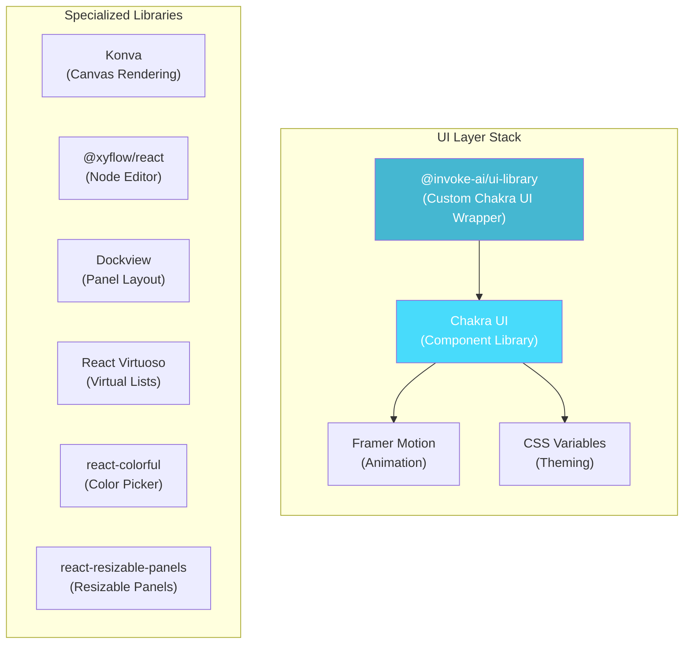
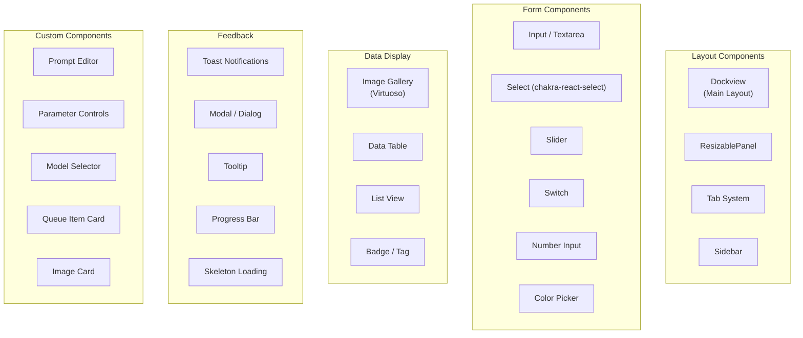
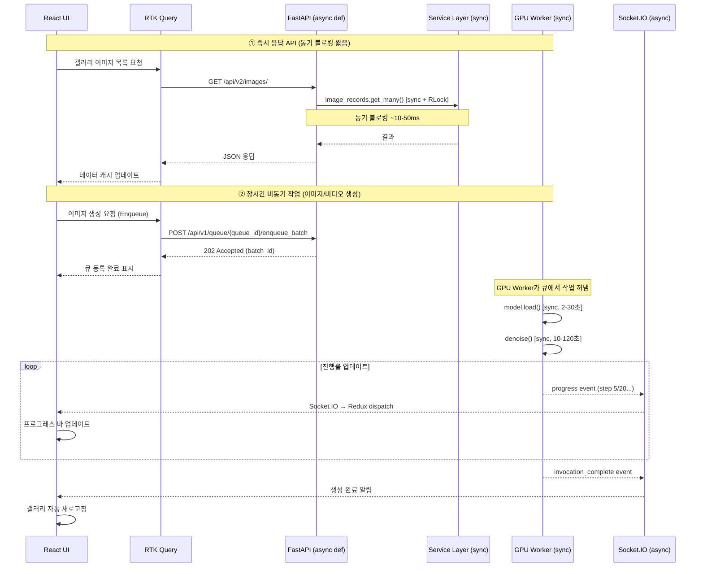
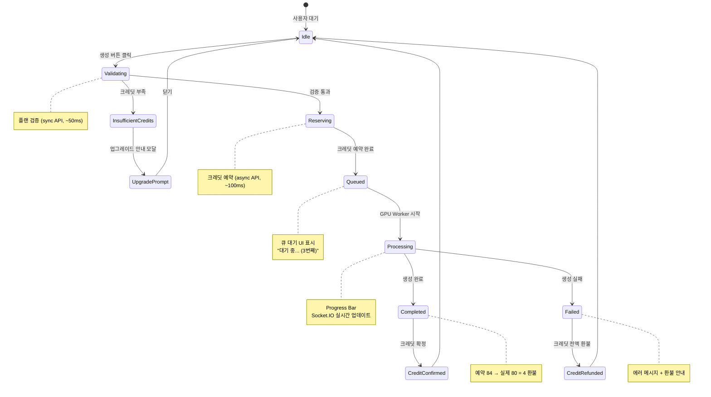
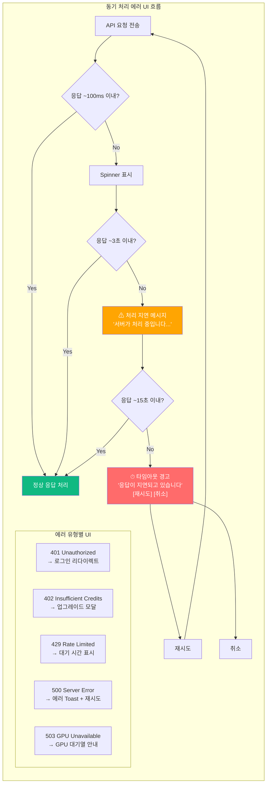
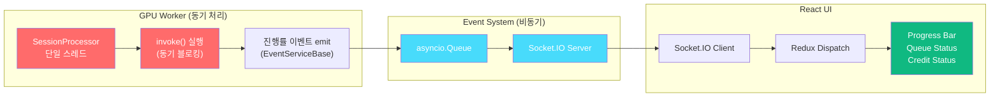
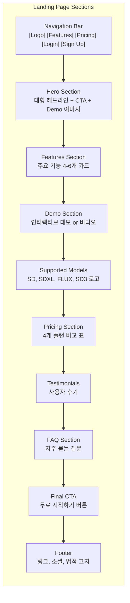

# InvokeAI SaaS - UI/UX 커스터마이징 가이드

## 목차
1. [현재 UI 시스템 분석](#1-현재-ui-시스템-분석)
2. [테마 커스터마이징 방법](#2-테마-커스터마이징-방법)
3. [UI 라이브러리 구조](#3-ui-라이브러리-구조)
4. [동기/비동기 처리 UI 패턴](#4-동기비동기-처리-ui-패턴)
5. [SaaS 신규 페이지 설계](#5-saas-신규-페이지-설계)
6. [랜딩 페이지 디자인 가이드](#6-랜딩-페이지-디자인-가이드)
7. [관리자 패널 설계](#7-관리자-패널-설계)
8. [반응형 디자인 전략](#8-반응형-디자인-전략)
9. [i18n 다국어 지원 확장](#9-i18n-다국어-지원-확장)

---

## 1. 현재 UI 시스템 분석

### 1.1 UI 프레임워크 스택

InvokeAI 프론트엔드는 다음 UI 라이브러리를 사용합니다:



### 1.2 현재 테마 구조

`@invoke-ai/ui-library`는 Chakra UI를 래핑한 커스텀 라이브러리입니다. 테마는 다크 모드 기반으로, CSS 변수로 제어됩니다.

```
invokeai/frontend/web/src/
├── theme.ts              # ★ Chakra UI 테마 오버라이드
└── app/
    └── components/
        └── ThemeLocaleProvider.tsx  # 테마 + 로케일 Provider
```

### 1.3 현재 디자인 특징

- **다크 모드 전용**: 밝은 배경 없음, 검정/진회색 기반
- **전문가 도구 UI**: 패널 기반 레이아웃, 밀도 높은 UI
- **고정 레이아웃**: SPA, 전체 뷰포트 사용
- **아이콘 중심**: React Icons (PiXxx 시리즈)
- **단일 페이지**: 라우팅 없이 탭으로 전환

---

## 2. 테마 커스터마이징 방법

### 2.1 Chakra UI 테마 오버라이드

**Step 1: 커스텀 테마 파일 생성**

```typescript
// src/theme/customTheme.ts
import { extendTheme, type ThemeConfig } from '@chakra-ui/react';

const config: ThemeConfig = {
  initialColorMode: 'dark',
  useSystemColorMode: false,
};

// SaaS 브랜드 색상 정의
const colors = {
  brand: {
    50: '#f0f4ff',
    100: '#d9e2ff',
    200: '#b3c5ff',
    300: '#8da8ff',
    400: '#668bff',
    500: '#4070ff',  // Primary
    600: '#335acc',
    700: '#264399',
    800: '#1a2d66',
    900: '#0d1633',
  },
  // InvokeAI의 기존 다크 테마를 기반으로 커스텀
  surface: {
    bg: '#0f1117',        // 메인 배경
    card: '#1a1d27',      // 카드 배경
    raised: '#252833',    // 상승된 요소
    overlay: '#2d3040',   // 오버레이
    border: '#3a3d4e',    // 테두리
  },
  accent: {
    primary: '#4070ff',   // 주 강조
    secondary: '#7c3aed', // 보조 강조
    success: '#10b981',   // 성공
    warning: '#f59e0b',   // 경고
    error: '#ef4444',     // 에러
    info: '#3b82f6',      // 정보
  },
};

const fonts = {
  heading: `'Inter Variable', -apple-system, sans-serif`,
  body: `'Inter Variable', -apple-system, sans-serif`,
  mono: `'JetBrains Mono', 'Fira Code', monospace`,
};

const styles = {
  global: {
    body: {
      bg: 'surface.bg',
      color: 'white',
    },
    // 스크롤바 커스텀
    '::-webkit-scrollbar': {
      width: '8px',
    },
    '::-webkit-scrollbar-track': {
      bg: 'surface.bg',
    },
    '::-webkit-scrollbar-thumb': {
      bg: 'surface.border',
      borderRadius: '4px',
    },
  },
};

const components = {
  Button: {
    baseStyle: {
      fontWeight: 500,
      borderRadius: 'md',
    },
    variants: {
      brand: {
        bg: 'brand.500',
        color: 'white',
        _hover: { bg: 'brand.600' },
        _active: { bg: 'brand.700' },
      },
      ghost: {
        _hover: { bg: 'surface.raised' },
      },
    },
    defaultProps: {
      variant: 'brand',
    },
  },
  Card: {
    baseStyle: {
      container: {
        bg: 'surface.card',
        borderRadius: 'lg',
        border: '1px solid',
        borderColor: 'surface.border',
      },
    },
  },
  Modal: {
    baseStyle: {
      dialog: {
        bg: 'surface.card',
        borderRadius: 'xl',
      },
      overlay: {
        bg: 'blackAlpha.700',
      },
    },
  },
  Input: {
    defaultProps: {
      variant: 'filled',
    },
    variants: {
      filled: {
        field: {
          bg: 'surface.raised',
          borderColor: 'surface.border',
          _hover: { bg: 'surface.overlay' },
          _focus: {
            bg: 'surface.overlay',
            borderColor: 'brand.500',
          },
        },
      },
    },
  },
};

export const customTheme = extendTheme({
  config,
  colors,
  fonts,
  styles,
  components,
});
```

**Step 2: 테마 적용**

```typescript
// src/app/components/ThemeLocaleProvider.tsx 수정
import { ChakraProvider } from '@chakra-ui/react';
import { customTheme } from '../../theme/customTheme';

export const ThemeLocaleProvider = ({ children }) => {
  return (
    <ChakraProvider theme={customTheme}>
      {children}
    </ChakraProvider>
  );
};
```

### 2.2 CSS 변수 기반 테마 스위칭

```css
/* src/theme/variables.css */
:root {
  /* 다크 테마 (기본) */
  --brand-primary: #4070ff;
  --brand-secondary: #7c3aed;
  --bg-main: #0f1117;
  --bg-card: #1a1d27;
  --bg-raised: #252833;
  --border-color: #3a3d4e;
  --text-primary: #ffffff;
  --text-secondary: #a0a5b8;
  --text-muted: #6b7280;
}

[data-theme='light'] {
  /* 라이트 테마 (선택사항) */
  --bg-main: #f8f9fa;
  --bg-card: #ffffff;
  --bg-raised: #f1f3f5;
  --border-color: #dee2e6;
  --text-primary: #212529;
  --text-secondary: #495057;
  --text-muted: #868e96;
}
```

### 2.3 @invoke-ai/ui-library 테마 오버라이드

`@invoke-ai/ui-library`는 GitHub에서 직접 설치됩니다. 이 라이브러리의 테마를 오버라이드하는 방법:

```typescript
// @invoke-ai/ui-library의 테마 토큰을 오버라이드
// 방법 1: Chakra UI extendTheme로 덮어쓰기
// 방법 2: CSS 변수 직접 오버라이드

// package.json에서 확인:
// "@invoke-ai/ui-library": "github:invoke-ai/ui-library#v0.0.48"
// 이 라이브러리를 fork하여 커스텀 버전 사용도 가능
```

---

## 3. UI 라이브러리 구조

### 3.1 공통 컴포넌트 맵



### 3.2 기존 컴포넌트 재사용 가이드

SaaS 전환 시 기존 InvokeAI 컴포넌트를 최대한 재사용합니다:

| 기존 컴포넌트 | 위치 | SaaS 재사용 |
|---------------|------|------------|
| Image Gallery | `features/gallery/` | 그대로 사용 (user_id 필터 추가) |
| Node Editor | `features/nodes/` | Pro/Enterprise만 접근 |
| Canvas System | `features/controlLayers/` | 그대로 사용 |
| Parameter Panel | `features/parameters/` | 플랜별 제한 UI 추가 |
| Model Manager | `features/modelManagerV2/` | 공유 모델 목록으로 변경 |
| Queue Manager | `features/queue/` | 사용자별 큐 필터링 |
| Prompt Editor | `features/prompt/` | 그대로 사용 |
| Style Presets | `features/stylePresets/` | 그대로 사용 |
| Toast System | `features/toast/` | 그대로 사용 |

---

## 4. 동기/비동기 처리 UI 패턴

InvokeAI의 백엔드는 동기 처리 중심 아키텍처입니다 (문서 01 섹션 9 참조). SaaS 전환 시 이 동기/비동기 경계가 UI/UX에 직접적인 영향을 미칩니다. 이 섹션에서는 동기 처리로 인한 UI 대기 상태, 에러 핸들링, 실시간 피드백 패턴을 다룹니다.

### 4.1 현재 동기/비동기 처리와 UI 관계



### 4.2 SaaS UI 로딩 상태 패턴

#### 4.2.1 API 요청별 로딩 상태 분류

| API 유형 | 백엔드 처리 | 예상 지연 | UI 패턴 |
|----------|------------|----------|---------|
| **갤러리/메타데이터 조회** | sync SQLite + RLock | 10~50ms | Skeleton Loading |
| **모델 목록 조회** | sync scan + RLock | 50~200ms | Skeleton Loading |
| **크레딧 잔액 조회** | sync DB 조회 | 10~30ms | Inline Spinner |
| **플랜 검증** | sync DB 조회 | 10~50ms | 버튼 비활성화 + Spinner |
| **이미지 생성 (큐 등록)** | async → 즉시 응답 | ~100ms | 즉시 큐 상태 표시 |
| **이미지 생성 (GPU 실행)** | sync GPU 처리 | 10~120초 | Progress Bar + Socket.IO |
| **모델 다운로드** | sync I/O 처리 | 수분~수시간 | Progress Bar + 취소 버튼 |
| **이미지 업로드** | sync 파일 저장 | 100ms~2초 | Upload Progress |

#### 4.2.2 로딩 상태 컴포넌트 설계

```typescript
// src/common/components/SyncLoadingWrapper.tsx
// 동기 블로킹 API 호출에 대한 통합 로딩 래퍼

import { Flex, Skeleton, Spinner, Text } from '@invoke-ai/ui-library';
import { useTranslation } from 'react-i18next';

type LoadingType = 'skeleton' | 'spinner' | 'progress' | 'overlay';

interface SyncLoadingWrapperProps {
  isLoading: boolean;
  loadingType: LoadingType;
  error?: string | null;
  // 동기 처리 타임아웃 경고 (기본 5초)
  syncTimeoutMs?: number;
  children: React.ReactNode;
}

export const SyncLoadingWrapper = ({
  isLoading,
  loadingType,
  error,
  syncTimeoutMs = 5000,
  children,
}: SyncLoadingWrapperProps) => {
  const { t } = useTranslation();
  const [showTimeoutWarning, setShowTimeoutWarning] = useState(false);

  useEffect(() => {
    if (!isLoading) {
      setShowTimeoutWarning(false);
      return;
    }
    const timer = setTimeout(() => setShowTimeoutWarning(true), syncTimeoutMs);
    return () => clearTimeout(timer);
  }, [isLoading, syncTimeoutMs]);

  if (error) {
    return <SyncErrorDisplay error={error} />;
  }

  if (isLoading) {
    return (
      <Flex direction="column" gap={2}>
        {loadingType === 'skeleton' && <Skeleton h="40px" />}
        {loadingType === 'spinner' && <Spinner size="sm" />}
        {showTimeoutWarning && (
          <Text fontSize="xs" color="accent.warning">
            {t('common.syncProcessingDelay')}
          </Text>
        )}
      </Flex>
    );
  }

  return <>{children}</>;
};
```

### 4.3 크레딧 예약→확인 UI 흐름

SaaS에서 이미지/비디오 생성 시 크레딧은 2단계로 처리됩니다 (문서 05 섹션 1.4 참조):
1. **예약 (Reserve)**: API 서버에서 비동기로 즉시 처리
2. **확인 (Confirm)**: GPU Worker에서 동기 처리 완료 후



#### 4.3.1 크레딧 UI 컴포넌트

```typescript
// src/features/credits/CreditReservationStatus.tsx
// 크레딧 예약→확인 과정의 실시간 UI

interface CreditStatusProps {
  status: 'idle' | 'reserving' | 'reserved' | 'processing' | 'confirmed' | 'refunded';
  estimatedCredits: number;
  actualCredits?: number;
  refundedCredits?: number;
}

export const CreditReservationStatus = ({
  status,
  estimatedCredits,
  actualCredits,
  refundedCredits,
}: CreditStatusProps) => {
  const { t } = useTranslation();

  return (
    <Flex direction="column" gap={1} fontSize="sm">
      {status === 'reserving' && (
        <HStack>
          <Spinner size="xs" />
          <Text>{t('credits.reserving', { count: estimatedCredits })}</Text>
        </HStack>
      )}
      {status === 'reserved' && (
        <HStack color="accent.info">
          <Text>{t('credits.reserved', { count: estimatedCredits })}</Text>
        </HStack>
      )}
      {status === 'processing' && (
        <HStack color="accent.warning">
          <Spinner size="xs" />
          <Text>{t('credits.processing')}</Text>
        </HStack>
      )}
      {status === 'confirmed' && (
        <HStack color="accent.success">
          <Text>{t('credits.confirmed', { count: actualCredits })}</Text>
          {refundedCredits && refundedCredits > 0 && (
            <Text color="accent.info">
              (+{refundedCredits} {t('credits.refunded')})
            </Text>
          )}
        </HStack>
      )}
      {status === 'refunded' && (
        <HStack color="accent.error">
          <Text>{t('credits.fullRefund', { count: estimatedCredits })}</Text>
        </HStack>
      )}
    </Flex>
  );
};
```

### 4.4 동기 처리 타임아웃 및 에러 UI

백엔드의 동기 처리가 지연되거나 실패할 때의 UI 패턴:



#### 4.4.1 동기 처리 에러 핸들러

```typescript
// src/features/system/hooks/useSyncApiErrorHandler.ts
// 동기 블로킹 API의 에러를 사용자 친화적으로 처리

export const useSyncApiErrorHandler = () => {
  const { t } = useTranslation();
  const toast = useToast();
  const navigate = useNavigate();

  const handleSyncError = useCallback((error: FetchBaseQueryError) => {
    const status = 'status' in error ? error.status : 0;

    switch (status) {
      case 401:
        // 동기 처리 중 인증 만료
        navigate('/login');
        break;

      case 402:
        // 크레딧 부족 (동기 플랜 검증 실패)
        openUpgradeModal();
        break;

      case 429:
        // 동기 처리 Rate Limit (RLock 경합 등)
        toast({
          title: t('errors.rateLimited'),
          description: t('errors.rateLimitedDesc'),
          status: 'warning',
        });
        break;

      case 500:
        // 동기 서비스 내부 에러 (SQLite lock timeout 등)
        toast({
          title: t('errors.serverError'),
          description: t('errors.syncProcessingFailed'),
          status: 'error',
        });
        break;

      case 503:
        // GPU Worker 불가 (동기 처리 대기열 초과)
        toast({
          title: t('errors.gpuUnavailable'),
          description: t('errors.gpuQueueFull'),
          status: 'warning',
        });
        break;
    }
  }, [t, toast, navigate]);

  return { handleSyncError };
};
```

### 4.5 Socket.IO 실시간 이벤트와 동기 처리 피드백

GPU Worker의 동기 처리 진행률은 Socket.IO를 통해 비동기로 UI에 전달됩니다:



#### 4.5.1 SaaS 이벤트 확장

```typescript
// 현재 InvokeAI Socket.IO 이벤트 + SaaS 확장 이벤트

// 기존 이벤트 (동기 GPU 처리 진행률)
type ExistingEvents = {
  invocation_started: { queue_item_id: string };
  invocation_complete: { queue_item_id: string; result: any };
  invocation_error: { queue_item_id: string; error: string };
  generator_progress: { queue_item_id: string; step: number; total_steps: number };
  queue_item_status_changed: { queue_item_id: string; status: string };
};

// SaaS 확장 이벤트 (크레딧/플랜 관련)
type SaaSExtensionEvents = {
  credit_reserved: {
    reservation_id: string;
    amount: number;
    remaining_balance: number;
  };
  credit_confirmed: {
    reservation_id: string;
    actual_amount: number;
    refunded: number;
    new_balance: number;
  };
  credit_refunded: {
    reservation_id: string;
    refunded_amount: number;
    reason: string;
    new_balance: number;
  };
  plan_limit_warning: {
    limit_type: 'credits' | 'resolution' | 'concurrent_jobs' | 'storage';
    current: number;
    max: number;
    message: string;
  };
  gpu_queue_position: {
    queue_item_id: string;
    position: number;
    estimated_wait_seconds: number;
  };
};
```

### 4.6 동기/비동기 처리 UI 설계 체크리스트

SaaS UI 개발 시 동기 처리 관련 확인 사항:

| # | 체크 항목 | 설명 |
|---|----------|------|
| 1 | 모든 API 호출에 로딩 상태 표시 | 동기 블로킹으로 인한 지연에 대비 |
| 2 | 타임아웃 경고 메시지 구현 | 동기 처리 3초+ 지연 시 사용자 안내 |
| 3 | 크레딧 예약/확인 상태 표시 | 2단계 크레딧 흐름의 각 단계를 시각화 |
| 4 | Socket.IO 연결 상태 표시 | 동기 처리 진행률 수신 가능 여부 |
| 5 | GPU 큐 대기 위치 표시 | 동기 처리 대기열에서의 현재 위치 |
| 6 | 에러별 차별화된 UI 제공 | 인증/크레딧/Rate Limit/서버에러 각각 다른 UI |
| 7 | 재시도 버튼 제공 | 동기 처리 타임아웃 시 재시도 옵션 |
| 8 | 낙관적 업데이트 사용 | 짧은 동기 API에 대해 즉시 UI 반영 |
| 9 | RTK Query 캐시 무효화 | 동기 처리 완료 후 관련 캐시 자동 새로고침 |
| 10 | 오프라인/연결 끊김 처리 | Socket.IO 연결 끊김 시 동기 처리 상태 불명 안내 |

---

## 5. SaaS 신규 페이지 설계

### 5.1 대시보드 페이지 와이어프레임

```
+----------------------------------------------------------+
|  [Logo] InvokeAI SaaS    [Credits: 1,845] [User Avatar]  |
+----------------------------------------------------------+
|                                                            |
|  Welcome back, User! Your Pro plan is active.              |
|                                                            |
|  +------------------+  +------------------+                |
|  | Credit Balance   |  | This Month Usage |                |
|  | 12,340 / 15,000  |  | 2,660 credits    |                |
|  | [=========-]     |  | [===-------]     |                |
|  | Renews in 15d    |  | 532 images gen'd |                |
|  +------------------+  +------------------+                |
|  (1 credit = 1초 GPU 시간)                                 |
|                                                            |
|  +------------------+  +------------------+                |
|  | Active Queue     |  | Storage Used     |                |
|  | 1 / 1 (Pro)      |  | 34.5 / 100 GB    |                |
|  +------------------+  +------------------+                |
|                                                            |
|  Recent Generations                                        |
|  +------+ +------+ +------+ +------+ +------+             |
|  |      | |      | |      | |      | |      |             |
|  | img1 | | img2 | | img3 | | img4 | | img5 |             |
|  |      | |      | |      | |      | |      |             |
|  +------+ +------+ +------+ +------+ +------+             |
|                                                            |
|  [Open AI Studio]  [View Gallery]  [Manage Workflows]      |
+----------------------------------------------------------+
```

### 5.2 구독 관리 페이지

```
+----------------------------------------------------------+
|  Account > Subscription                                    |
+----------------------------------------------------------+
|                                                            |
|  Current Plan: Pro ($75/month)                              |
|  Status: Active | Renews: Feb 28, 2025                    |
|  Credits: 12,340 / 15,000 remaining                        |
|                                                            |
|  +-------------------------------------------------------+|
|  | Plan Comparison (1 credit = 1초 GPU 시간)               ||
|  |                                                        ||
|  | Feature        | Starter | Pro*    | Studio  | Ent.   ||
|  |----------------|---------|---------|---------|--------||
|  | Monthly Price  | $25     | $75     | $150    | Custom ||
|  | Credits/month  | 5,000   | 15,000  | 30,000  | Custom ||
|  | GPU Tier       | Basic   | High    | High    | Dedic. ||
|  | Queues         | 1       | 1       | 3       | Custom ||
|  | Storage        | 20GB    | 100GB   | 200GB   | Custom ||
|  | Models         | SD only | +Flux   | +Flux   | Full   ||
|  | 3rd Party API  | No      | Yes     | Yes     | Yes    ||
|  | LoRA Training  | No      | No      | Planned | Yes    ||
|  | Collaboration  | No      | No      | Planned | Yes    ||
|  |                |[Select] | Current | [Select]| Contact||
|  +-------------------------------------------------------+|
|                                                            |
|  [Cancel Subscription]                                     |
|                                                            |
|  Billing History                                           |
|  | Date       | Amount  | Status    | Invoice |           |
|  |------------|---------|-----------|---------|           |
|  | 2025-01-28 | $75.00  | Paid      | [PDF]   |           |
|  | 2024-12-28 | $75.00  | Paid      | [PDF]   |           |
+----------------------------------------------------------+
```

### 5.3 AI Studio 페이지 (기존 InvokeAI + SaaS 래핑)

```
+----------------------------------------------------------+
|  [Logo] InvokeAI Studio   [Credits: 1,845] [User] [Menu]  |
+-------+--------------------------------------------------+
| Side  |                                                    |
| Panel |  +-----------+----------------------------------+ |
|       |  | Tab: Gen  |  Tab: Canvas | Tab: Nodes       | |
| Credit|  +-----------+----------------------------------+ |
| Status|  |                                              | |
|       |  |        [기존 InvokeAI UI 그대로]              | |
| Quick |  |                                              | |
| Links |  |        생성 패널 / 캔버스 / 노드 에디터      | |
|       |  |                                              | |
| Plan  |  |        (플랜별 기능 제한만 추가)              | |
| Info  |  |                                              | |
|       |  +----------------------------------------------+ |
|       |  |           Gallery (Right Panel)               | |
|       |  +----------------------------------------------+ |
+-------+--------------------------------------------------+
```

---

## 6. 랜딩 페이지 디자인 가이드

### 6.1 랜딩 페이지 구조



### 6.2 Hero Section 구현

```typescript
// src/features/landing/HeroSection.tsx
import { Box, Button, Container, Heading, Text, VStack, HStack } from '@chakra-ui/react';

export const HeroSection = () => {
  return (
    <Box
      as="section"
      py={20}
      bg="linear-gradient(135deg, #0f1117 0%, #1a1d27 50%, #0f1117 100%)"
      position="relative"
      overflow="hidden"
    >
      {/* 배경 그라디언트 효과 */}
      <Box
        position="absolute"
        top="50%"
        left="50%"
        transform="translate(-50%, -50%)"
        w="600px"
        h="600px"
        bg="brand.500"
        filter="blur(200px)"
        opacity={0.15}
        borderRadius="full"
      />

      <Container maxW="7xl" position="relative" zIndex={1}>
        <VStack spacing={8} textAlign="center">
          <Heading
            as="h1"
            size="3xl"
            fontWeight={800}
            lineHeight={1.1}
            bgGradient="linear(to-r, brand.400, accent.secondary)"
            bgClip="text"
          >
            Professional AI Image Generation
            <br />
            in Your Browser
          </Heading>

          <Text
            fontSize="xl"
            color="text.secondary"
            maxW="600px"
          >
            Powered by Stable Diffusion, FLUX, and more.
            Create stunning images with enterprise-grade GPU acceleration.
          </Text>

          <HStack spacing={4}>
            <Button
              size="lg"
              variant="brand"
              px={8}
              onClick={() => navigate('/signup')}
            >
              Start Free Trial
            </Button>
            <Button
              size="lg"
              variant="outline"
              borderColor="surface.border"
              px={8}
              onClick={() => navigate('/pricing')}
            >
              View Pricing
            </Button>
          </HStack>

          {/* 생성 예시 이미지 갤러리 */}
          <Box mt={12} w="full">
            {/* 예시 이미지 캐러셀 */}
          </Box>
        </VStack>
      </Container>
    </Box>
  );
};
```

---

## 7. 관리자 패널 설계

### 7.1 관리자 패널 구조

```
+----------------------------------------------------------+
|  [Logo] Admin Panel                      [Admin User] [↩] |
+----------+-----------------------------------------------+
|          |                                                |
| Sidebar  |  Dashboard Overview                            |
|          |                                                |
| Dashboard|  +----------+ +----------+ +----------+       |
| Users    |  | Active   | | Revenue  | | GPU Load |       |
| Plans    |  | Users    | | MRR      | | Avg      |       |
| Test Plan|  | 1,247    | | $12,450  | | 67%      |       |
| GPU Pool |  +----------+ +----------+ +----------+       |
| Revenue  |                                                |
| Models   |  Usage Charts (Last 30 Days)                   |
| Logs     |  +--------------------------------------------+|
| Settings |  |  [Chart: Daily Active Users]                ||
|          |  |  [Chart: Images Generated]                  ||
|          |  |  [Chart: Revenue Trend]                     ||
|          |  +--------------------------------------------+|
|          |                                                |
|          |  Recent Activity                               |
|          |  | Time  | User    | Action          |        |
|          |  |-------|---------|-----------------|        |
|          |  | 5m    | user@.. | Generated 4 img |        |
|          |  | 12m   | user@.. | Upgraded to Pro |        |
+----------+-----------------------------------------------+
```

### 7.2 테스트 플랜 관리 UI

```
+----------------------------------------------------------+
|  Admin > Test Plan Management                              |
+----------------------------------------------------------+
|                                                            |
|  Grant Test Credits                                        |
|  +-------------------------------------------------------+|
|  | User Email:  [search user...              ] [Search]  ||
|  | Credits:     [___50000___] (1 credit = 1초 GPU)       ||
|  | Duration:    [___30___] days                          ||
|  | GPU Tier:    Basic (Starter 동일)                     ||
|  | Model Access: Flux + 3rd Party API (Pro 수준)         ||
|  | Reason:      [Testing new features for...   ]        ||
|  |                                                        ||
|  |                            [Grant Test Credits]        ||
|  +-------------------------------------------------------+|
|                                                            |
|  Recent Grants                                             |
|  | Date       | Admin    | User     | Credits | Expires  ||
|  |------------|----------|----------|---------|----------|  |
|  | 2025-01-15 | admin@.. | test@..  | 200     | Feb 14   ||
|  | 2025-01-10 | admin@.. | demo@..  | 500     | Feb 09   ||
+----------------------------------------------------------+
```

---

## 8. 반응형 디자인 전략

### 8.1 브레이크포인트

```typescript
// Chakra UI 기본 브레이크포인트 활용
const breakpoints = {
  sm: '480px',   // 모바일
  md: '768px',   // 태블릿
  lg: '992px',   // 작은 데스크탑
  xl: '1280px',  // 데스크탑
  '2xl': '1536px', // 대형 데스크탑
};
```

### 8.2 반응형 전략

| 화면 크기 | 전략 |
|-----------|------|
| **모바일 (< 768px)** | 랜딩/대시보드/갤러리만 지원. AI Studio는 "데스크탑에서 사용" 안내 |
| **태블릿 (768-992px)** | 기본 생성 기능 + 갤러리. 캔버스/노드에디터는 제한적 |
| **데스크탑 (992px+)** | 전체 기능 사용 가능 |
| **대형 (1536px+)** | 멀티 패널 레이아웃 최적화 |

---

## 9. i18n 다국어 지원 확장

### 9.1 현재 지원 언어

InvokeAI는 이미 `i18next`로 20+ 언어를 지원합니다:

```
static/locales/
├── en.json    # 영어 (기본)
├── ko.json    # 한국어
├── ja.json    # 일본어
├── zh_CN.json # 중국어 간체
├── zh_Hant.json # 중국어 번체
├── de.json    # 독일어
├── fr.json    # 프랑스어
├── es.json    # 스페인어
├── it.json    # 이탈리아어
├── pt.json    # 포르투갈어
├── ru.json    # 러시아어
├── nl.json    # 네덜란드어
├── pl.json    # 폴란드어
├── tr.json    # 터키어
├── uk.json    # 우크라이나어
├── ar.json    # 아랍어
├── he.json    # 히브리어
└── ...
```

### 9.2 SaaS 번역 키 추가

```json
// static/locales/en.json에 추가할 SaaS 관련 키
{
  "auth": {
    "login": "Log In",
    "signup": "Sign Up",
    "logout": "Log Out",
    "forgotPassword": "Forgot Password?",
    "resetPassword": "Reset Password",
    "email": "Email",
    "password": "Password",
    "name": "Full Name"
  },
  "subscription": {
    "currentPlan": "Current Plan",
    "upgradePlan": "Upgrade Plan",
    "cancelSubscription": "Cancel Subscription",
    "billingHistory": "Billing History",
    "renewsOn": "Renews on {{date}}",
    "plans": {
      "trial": "Free Trial",
      "starter": "Starter",
      "pro": "Pro",
      "studio": "Studio",
      "enterprise": "Enterprise",
      "tester": "Tester"
    }
  },
  "credits": {
    "balance": "Credit Balance",
    "remaining": "{{count}} credits remaining",
    "used": "{{count}} credits used",
    "purchase": "Purchase Credits",
    "insufficient": "Insufficient credits. Please upgrade or purchase more.",
    "history": "Credit History"
  },
  "dashboard": {
    "welcome": "Welcome back, {{name}}!",
    "recentGenerations": "Recent Generations",
    "usageStats": "Usage Statistics",
    "activeJobs": "Active Jobs",
    "storageUsed": "Storage Used"
  },
  "admin": {
    "userManagement": "User Management",
    "planManagement": "Plan Management",
    "testPlanGrant": "Grant Test Plan",
    "gpuMonitor": "GPU Monitor",
    "revenue": "Revenue Dashboard"
  }
}
```

```json
// static/locales/ko.json에 추가할 한국어 키
{
  "auth": {
    "login": "로그인",
    "signup": "회원가입",
    "logout": "로그아웃",
    "forgotPassword": "비밀번호를 잊으셨나요?",
    "resetPassword": "비밀번호 재설정",
    "email": "이메일",
    "password": "비밀번호",
    "name": "이름"
  },
  "subscription": {
    "currentPlan": "현재 플랜",
    "upgradePlan": "플랜 업그레이드",
    "cancelSubscription": "구독 취소",
    "billingHistory": "결제 내역",
    "renewsOn": "{{date}}에 갱신",
    "plans": {
      "free": "무료",
      "basic": "베이직",
      "pro": "프로",
      "enterprise": "엔터프라이즈"
    }
  },
  "credits": {
    "balance": "크레딧 잔액",
    "remaining": "{{count}} 크레딧 남음",
    "used": "{{count}} 크레딧 사용",
    "purchase": "크레딧 구매",
    "insufficient": "크레딧이 부족합니다. 플랜을 업그레이드하거나 추가 구매하세요.",
    "history": "크레딧 내역"
  },
  "dashboard": {
    "welcome": "환영합니다, {{name}}님!",
    "recentGenerations": "최근 생성 이미지",
    "usageStats": "사용 통계",
    "activeJobs": "진행 중인 작업",
    "storageUsed": "사용 중인 저장공간"
  },
  "admin": {
    "userManagement": "사용자 관리",
    "planManagement": "플랜 관리",
    "testPlanGrant": "테스트 플랜 부여",
    "gpuMonitor": "GPU 모니터",
    "revenue": "수익 대시보드"
  }
}
```

### 9.3 번역 사용 예시

```typescript
// 컴포넌트에서 번역 사용
import { useTranslation } from 'react-i18next';

const CreditBalance = () => {
  const { t } = useTranslation();
  const { data: balance } = useGetCreditBalanceQuery();

  return (
    <Box>
      <Text fontWeight="bold">{t('credits.balance')}</Text>
      <Text>
        {t('credits.remaining', { count: balance?.remaining ?? 0 })}
      </Text>
    </Box>
  );
};
```
