# InvokeAI SaaS - 비디오 생성 기능 분석 및 재구현 가이드

## 목차
1. [분석 요약](#1-분석-요약)
2. [비디오 관련 흔적 상세 분석](#2-비디오-관련-흔적-상세-분석)
3. [Z-Image / VideoX-Fun 아키텍처 분석](#3-z-image--videox-fun-아키텍처-분석)
4. [비디오 생성 재구현 전략](#4-비디오-생성-재구현-전략)
5. [구현 로드맵](#5-구현-로드맵)
6. [SaaS 비디오 생성 크레딧 설계](#6-saas-비디오-생성-크레딧-설계)
7. [인프라 및 GPU 요구사항](#7-인프라-및-gpu-요구사항)

---

## 1. 분석 요약

### 1.1 핵심 결론

현재 InvokeAI v6.11.1 코드베이스에는 **실제 비디오 생성 기능이 구현되어 있지 않습니다.** 그러나 다음과 같은 중요한 아키텍처적 흔적이 발견되었습니다:

| 카테고리 | 발견 내용 | 비디오 생성 관련 | 중요도 |
|----------|-----------|-----------------|--------|
| Z-Image (VideoX-Fun 파생) | 백엔드 전체가 비디오 프레임워크에서 파생 | **높음** - 프레임 차원 하드코딩 | ★★★★★ |
| Hunyuan Video LoRA | OMI 스펙의 아키텍처 식별자 | 낮음 - 문자열 상수만 존재 | ★★☆☆☆ |
| "video Starting Frame Image" | 프론트엔드 타입 주석 | **중간** - 과거 계획 흔적 | ★★★☆☆ |
| 커뮤니티 Load Video Frame 노드 | 외부 써드파티 노드 문서화 | 외부 - InvokeAI 코어 아님 | ★★☆☆☆ |
| SAM2 VideoProcessor | docstring 타입 힌트 | 낮음 - 이미지 세그멘테이션 전용 | ★☆☆☆☆ |
| Tutorial Videos / "video card" | YouTube 링크, GPU 참조 | 무관 | ☆☆☆☆☆ |

### 1.2 Git 히스토리 분석

```
검색 결과:
- video/animate/AnimateDiff/motion 관련 커밋: 0건
- 삭제된 비디오 관련 파일: 0건
- 비디오 관련 브랜치: 0건
```

**결론:** 이 포크의 git 히스토리에는 비디오 생성 코드가 존재했다가 삭제된 흔적이 전혀 없습니다. 클라우드 버전의 비디오 기능은 별도 브랜치 또는 별도 레포지토리에서 개발되었을 가능성이 높습니다.

---

## 2. 비디오 관련 흔적 상세 분석

### 2.1 Z-Image 모듈: VideoX-Fun 기반 (가장 중요한 발견)

Z-Image 모듈은 Alibaba의 **VideoX-Fun** 비디오 생성 프레임워크에서 직접 파생되었습니다. 이것이 비디오 생성 재구현의 핵심 기반입니다.

**원본 출처 표기가 있는 파일:**

```python
# invokeai/backend/z_image/z_image_control_transformer.py (라인 1-3)
# Adapted from https://github.com/aigc-apps/VideoX-Fun/blob/main/videox_fun/models/z_image_transformer2d_control.py
# Copyright (c) Alibaba, Inc. and its affiliates.
# Apache License 2.0

# invokeai/backend/z_image/z_image_control_adapter.py (라인 1-3)
# Adapted from https://github.com/aigc-apps/VideoX-Fun/blob/main/videox_fun/models/z_image_transformer2d_control.py
# Copyright (c) Alibaba, Inc. and its affiliates.
# Apache License 2.0
```

**프레임 차원이 보존된 코드:**

```python
# invokeai/app/invocations/z_image_denoise.py (라인 471, 563, 679, 705)
# Add frame dimension: [B, C, H, W] -> [C, 1, H, W] (single image)
latent_model_input = latent_model_input.unsqueeze(2)  # Add frame dimension
noise_pred_cond = noise_pred_cond.squeeze(2)           # Remove frame dimension
```

```python
# invokeai/backend/z_image/z_image_patchify_utils.py (라인 37-51)
def patchify_control_context(
    all_image: List[torch.Tensor],
    patch_size: int,
    f_patch_size: int,        # ← Frame patch size (비디오 프레임 단위)
    cap_seq_len: int,
) -> Tuple[...]:
    """Patchify control images without embedding.
    Args:
        all_image: List of control image tensors [C, F, H, W]  # ← F = Frame 차원
        f_patch_size: Frame patch size                          # ← 현재 항상 1
    """
```

### 2.2 전체 Z-Image 파일 목록

**백엔드 모듈 (9개 파일):**

| 파일 | 역할 | 비디오 확장 가능성 |
|------|------|-------------------|
| `backend/z_image/__init__.py` | 패키지 초기화 | - |
| `backend/z_image/extensions/__init__.py` | 확장 패키지 | - |
| `backend/z_image/extensions/regional_prompting_extension.py` | 리전 프롬프팅 | 프레임별 리전 지원 필요 |
| `backend/z_image/text_conditioning.py` | 텍스트 조건화 | 시간축 조건화 추가 필요 |
| `backend/z_image/z_image_control_adapter.py` | 컨트롤 어댑터 | **f_patch_size > 1 지원 가능** |
| `backend/z_image/z_image_control_transformer.py` | 컨트롤 트랜스포머 | **f_patch_size > 1 지원 가능** |
| `backend/z_image/z_image_controlnet_extension.py` | ControlNet 확장 | 프레임별 제어 신호 |
| `backend/z_image/z_image_patchify_utils.py` | 패치화 유틸리티 | **핵심 - F 차원 이미 지원** |
| `backend/z_image/z_image_transformer_patch.py` | 트랜스포머 패치 | **f_patch_size 파라미터 존재** |

**인보케이션 노드 (8개 파일):**

| 파일 | 역할 | 비디오 확장 |
|------|------|------------|
| `app/invocations/z_image_control.py` | Z-Image 컨트롤 노드 | 프레임별 컨트롤 입력 |
| `app/invocations/z_image_denoise.py` | 디노이즈 노드 (핵심) | **unsqueeze(2)/squeeze(2) 이미 존재** |
| `app/invocations/z_image_image_to_latents.py` | 이미지→잠재공간 | 비디오 프레임→잠재공간 |
| `app/invocations/z_image_latents_to_image.py` | 잠재공간→이미지 | 잠재공간→비디오 프레임 |
| `app/invocations/z_image_lora_loader.py` | LoRA 로더 | 비디오 LoRA 로딩 |
| `app/invocations/z_image_model_loader.py` | 모델 로더 | 비디오 모델 로딩 |
| `app/invocations/z_image_seed_variance_enhancer.py` | 시드 변형 | 프레임별 시드 변형 |
| `app/invocations/z_image_text_encoder.py` | 텍스트 인코더 | 그대로 사용 가능 |

### 2.3 Hunyuan Video LoRA 아키텍처 식별자

```python
# invokeai/backend/model_manager/omi/vendor/model_spec/architecture.py (라인 29)
hunyuan_video_lora = "hunyuan-video/lora"
```

이것은 OMI(Open Model Initiative) 벤더 라이브러리의 모델 스펙 식별자입니다. Hunyuan Video LoRA 모델을 식별하기 위한 문자열 상수로, 실제 파이프라인 구현은 없습니다.

### 2.4 "video Starting Frame Image" 참조

```typescript
// invokeai/frontend/web/src/features/controlLayers/store/types.ts (라인 52-53)
// When we added cropping support to certain entities (e.g. Ref Images, video Starting Frame Image),
// we changed their schemas from using zImageWithDims to this new schema.
```

이 주석은 **"video Starting Frame Image"**라는 엔티티 타입이 과거에 존재했거나 계획되었음을 암시합니다. 비디오 워크플로우의 시작 프레임 이미지를 위한 UI 기능이 고려되었던 것으로 보이나, 실제 구현은 코드베이스 어디에도 없습니다.

### 2.5 커뮤니티 Load Video Frame 노드

```markdown
# docs/nodes/communityNodes.md (라인 382-389)
### Load Video Frame
**Description:** This is a video frame image provider + indexer/video creation nodes
for hooking up to iterators and ranges and ControlNets and such for invokeAI node
experimentation. Think animation + ControlNet outputs.
**Node Link:** https://github.com/helix4u/load_video_frame
```

외부 써드파티 커뮤니티 노드로, InvokeAI의 노드 시스템을 활용하여 비디오 프레임을 추출하고 ControlNet과 연동하는 실험적 기능입니다.

### 2.6 현재 모델 타입 체계 (비디오 타입 없음)

```python
# invokeai/backend/model_manager/taxonomy.py
class BaseModelType(str, Enum):
    Any = "any"
    StableDiffusion1 = "sd-1"
    StableDiffusion2 = "sd-2"
    StableDiffusion3 = "sd-3"
    StableDiffusionXL = "sdxl"
    StableDiffusionXLRefiner = "sdxl-refiner"
    Flux = "flux"
    Flux2 = "flux2"
    CogView4 = "cogview4"
    ZImage = "z-image"            # ← VideoX-Fun 기반이지만 이미지 전용
    Unknown = "unknown"
    # ❌ AnimateDiff, SVD, HunyuanVideo 등 비디오 모델 타입 없음
```

---

## 3. Z-Image / VideoX-Fun 아키텍처 분석

### 3.1 프레임 차원 아키텍처 흐름

Z-Image의 핵심은 VideoX-Fun에서 물려받은 **프레임 차원(F dimension)** 처리입니다. 현재는 `f_patch_size=1`로 하드코딩되어 단일 이미지만 처리하지만, 아키텍처적으로 다중 프레임을 지원할 수 있는 구조입니다.

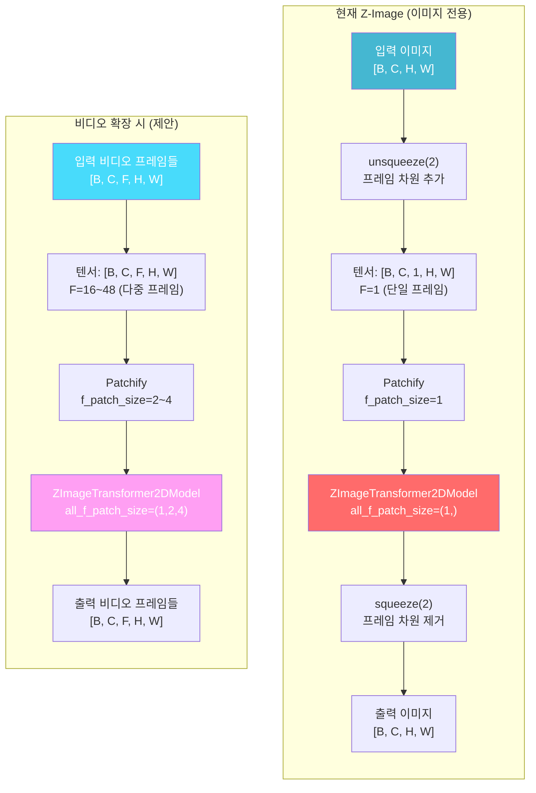

### 3.2 f_patch_size 확장 포인트

비디오 생성을 위해 변경이 필요한 하드코딩된 `f_patch_size=1` 위치:

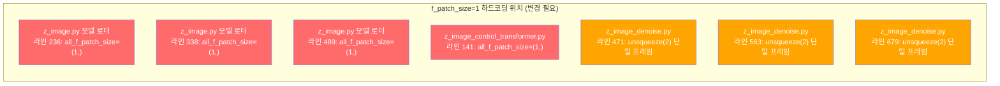

### 3.3 Patchify 프로세스 상세

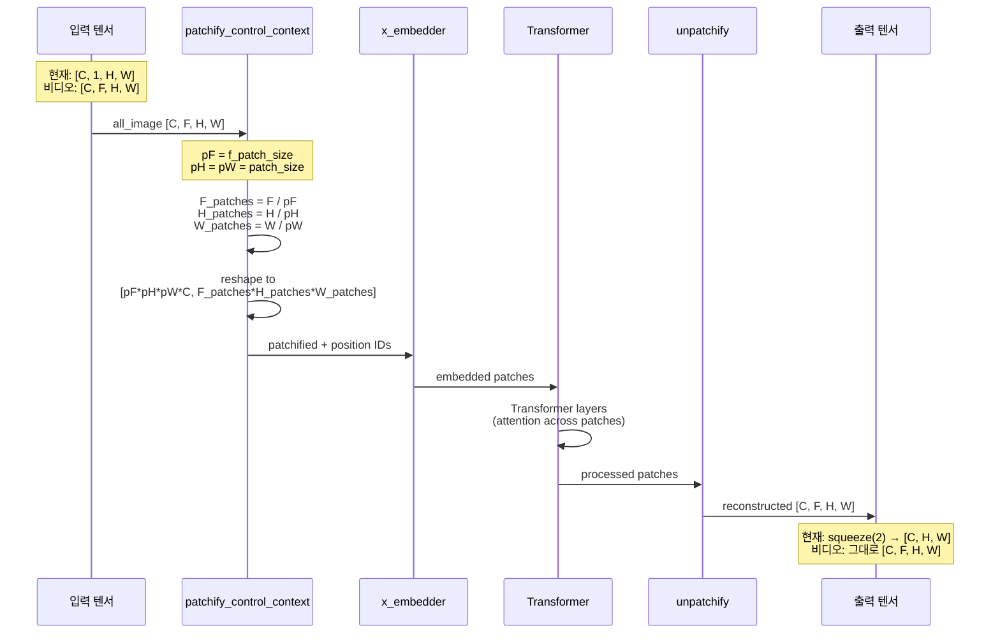

### 3.4 VideoX-Fun 원본과 InvokeAI 적응 비교

| 항목 | VideoX-Fun (원본) | InvokeAI Z-Image (현재) |
|------|-------------------|------------------------|
| **목적** | Text-to-Video / Image-to-Video | Text-to-Image / Image-to-Image |
| **프레임 수** | 16~128 프레임 | 1 프레임 (하드코딩) |
| **f_patch_size** | 1, 2, 4 (가변) | 1 (고정) |
| **텐서 형태** | [B, C, F, H, W] | [B, C, 1, H, W] |
| **Temporal Attention** | 프레임 간 어텐션 활성 | 단일 프레임이므로 무의미 |
| **모델 가중치** | 비디오 학습 가중치 | 이미지 학습 가중치 |
| **출력** | 비디오 프레임 시퀀스 | 단일 이미지 |
| **ControlNet** | 프레임별 제어 신호 | 단일 이미지 제어 |
| **VAE** | 3D VAE (시간축 포함) | 2D VAE |

---

## 4. 비디오 생성 재구현 전략

### 4.1 전략 개요

Z-Image의 VideoX-Fun 아키텍처 기반을 활용하여, **최소한의 코드 변경으로 비디오 생성을 활성화**하는 전략을 제안합니다.

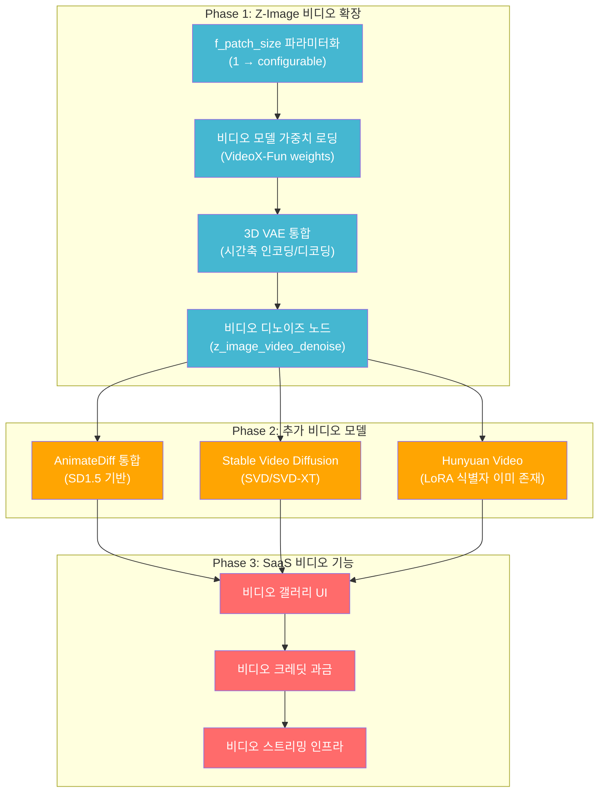

### 4.2 Phase 1: Z-Image 비디오 확장 (핵심)

#### 4.2.1 f_patch_size 파라미터화

**변경 대상:** `invokeai/backend/model_manager/load/model_loaders/z_image.py`

```python
# 현재 (라인 236, 338, 489):
all_f_patch_size=(1,),

# 변경 후:
all_f_patch_size=tuple(config.get("all_f_patch_size", (1,))),
# 비디오 모델은 (1, 2, 4) 등의 다중 프레임 패치 사이즈 지원
```

#### 4.2.2 비디오 디노이즈 노드 구현

**신규 파일:** `invokeai/app/invocations/z_image_video_denoise.py`

```python
@invocation(
    "z_image_video_denoise",
    title="Denoise Video - Z-Image",
    tags=["video", "z-image", "denoise"],
    category="z-image",
    classification=Classification.Beta,
)
class ZImageVideoDenoiseInvocation(BaseInvocation):
    """Z-Image 기반 비디오 디노이즈 노드.

    VideoX-Fun 아키텍처를 활용하여 다중 프레임 비디오를 생성합니다.
    f_patch_size > 1을 사용하여 시간축 패치화를 수행합니다.
    """
    num_frames: int = InputField(default=16, description="생성할 비디오 프레임 수")
    fps: int = InputField(default=8, description="출력 비디오 FPS")
    f_patch_size: int = InputField(default=2, description="프레임 패치 사이즈")
    # ... 기존 z_image_denoise 파라미터 상속 ...

    def invoke(self, context: InvocationContext) -> VideoOutput:
        # 1. 다중 프레임 잠재 공간 초기화
        # latents: [B, C, F, H, W] where F = num_frames
        latents = torch.randn(1, channels, self.num_frames, height, width)

        # 2. unsqueeze(2) 대신 다중 프레임 직접 전달
        # (기존: unsqueeze(2)로 F=1 추가 → 변경: F=num_frames 그대로)

        # 3. f_patch_size > 1로 시간축 패치화
        # patchify: [C, F, H, W] → [C*pF*pH*pW, F/pF * H/pH * W/pW]

        # 4. 프레임별 디코딩 및 비디오 어셈블리
        frames = []
        for f in range(self.num_frames):
            frame = vae_decode(latents[:, :, f, :, :])
            frames.append(frame)

        return VideoOutput(frames=frames, fps=self.fps)
```

#### 4.2.3 3D VAE 통합

VideoX-Fun의 비디오 생성에는 시간축을 포함하는 3D VAE가 필요합니다:

```python
# 신규 필요: 3D VAE 모델 로더
# VideoX-Fun의 VAE는 [B, C, F, H, W] → [B, Z, F/t, H/s, W/s] 인코딩 지원
# t = temporal downscale factor, s = spatial downscale factor

class Video3DVAE:
    """3D VAE for video encoding/decoding.

    Standard 2D VAE processes each frame independently:
      [B, C, F, H, W] → loop over F → [B, Z, F, H/8, W/8]

    3D VAE processes temporal dimension jointly:
      [B, C, F, H, W] → [B, Z, F/4, H/8, W/8]
      (temporal compression ratio: 4x)
    """
```

#### 4.2.4 비디오 모델 타입 추가

```python
# invokeai/backend/model_manager/taxonomy.py 변경
class BaseModelType(str, Enum):
    # ... 기존 타입들 ...
    ZImage = "z-image"
    ZImageVideo = "z-image-video"    # ← 신규: 비디오 생성 모델
    HunyuanVideo = "hunyuan-video"   # ← 신규: Hunyuan Video 모델

class ModelType(str, Enum):
    # ... 기존 타입들 ...
    VideoVAE = "video_vae"           # ← 신규: 3D VAE
    MotionModule = "motion_module"   # ← 신규: AnimateDiff용
```

### 4.3 Phase 2: 추가 비디오 모델 통합

#### 4.3.1 AnimateDiff (SD1.5 기반)

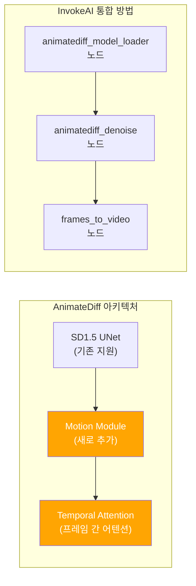

AnimateDiff는 SD1.5 UNet에 **Motion Module**을 삽입하여 시간축 어텐션을 추가합니다:

| 항목 | 설명 |
|------|------|
| **모델** | SD1.5 + Motion Module v2/v3 |
| **프레임 수** | 16~32 프레임 |
| **해상도** | 512×512 ~ 768×768 |
| **ControlNet** | 기존 SD1.5 ControlNet 호환 |
| **LoRA** | 기존 SD1.5 LoRA 호환 |
| **VRAM** | ~8GB (16프레임) |

#### 4.3.2 Stable Video Diffusion (SVD)

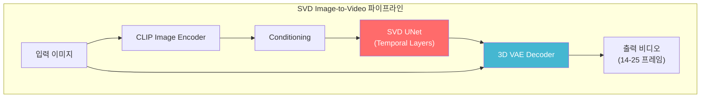

| 항목 | SVD | SVD-XT |
|------|-----|--------|
| **프레임 수** | 14 | 25 |
| **해상도** | 576×1024 | 576×1024 |
| **입력** | 이미지 (img2vid) | 이미지 (img2vid) |
| **VRAM** | ~12GB | ~16GB |
| **모델 크기** | ~5.2GB | ~5.2GB |

#### 4.3.3 Hunyuan Video

OMI 스펙에 이미 `hunyuan_video_lora` 식별자가 존재하므로 통합 기반이 있습니다:

| 항목 | 설명 |
|------|------|
| **모델** | Tencent Hunyuan Video |
| **기능** | Text-to-Video, Image-to-Video |
| **프레임 수** | 최대 129 프레임 (~5초) |
| **해상도** | 720p / 1280×720 |
| **VRAM** | ~24GB (A100 권장) |
| **LoRA** | OMI 스펙에 식별자 존재 |

### 4.4 Phase 3: 비디오 관련 프론트엔드 구현

#### 4.4.1 비디오 워크플로우 UI

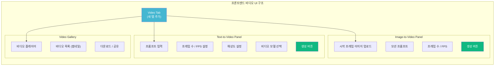

#### 4.4.2 "video Starting Frame Image" 기능 복원

프론트엔드 `types.ts`에 언급된 "video Starting Frame Image" 엔티티를 실제로 구현:

```typescript
// invokeai/frontend/web/src/features/controlLayers/store/types.ts
// 기존 주석에서 참조된 기능을 실제 구현

export const zVideoStartingFrameImage = zImageWithDimsCrop.extend({
  type: z.literal('video_starting_frame'),
  motionStrength: z.number().min(0).max(1).default(0.7),
  fps: z.number().int().min(1).max(60).default(8),
  numFrames: z.number().int().min(4).max(128).default(16),
});
```

---

## 5. 구현 로드맵

### 5.1 개발 일정

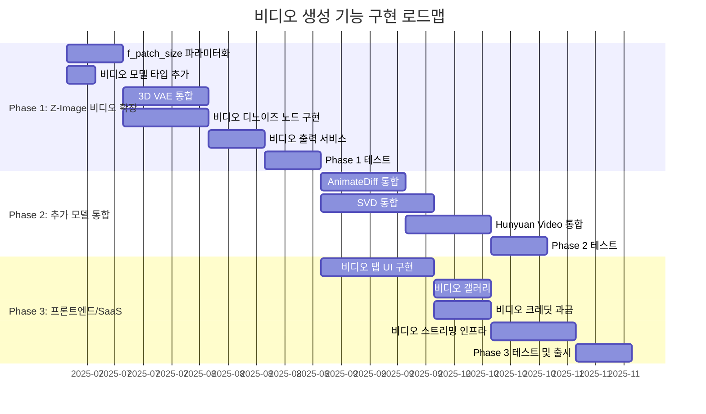

### 5.2 단계별 상세 작업

#### Phase 1 작업 목록 (8~10주)

| # | 작업 | 파일 | 변경 유형 | 난이도 |
|---|------|------|-----------|--------|
| 1 | `BaseModelType`에 `ZImageVideo` 추가 | `taxonomy.py` | 수정 | 낮음 |
| 2 | `ModelType`에 `VideoVAE`, `MotionModule` 추가 | `taxonomy.py` | 수정 | 낮음 |
| 3 | `f_patch_size` 하드코딩 제거 (3곳) | `z_image.py` (model loader) | 수정 | 중간 |
| 4 | 비디오 모델 config 스키마 생성 | `configs/` | 신규 | 중간 |
| 5 | 3D VAE 로더 구현 | `model_loaders/` | 신규 | 높음 |
| 6 | `z_image_video_denoise.py` 노드 구현 | `invocations/` | 신규 | 높음 |
| 7 | `z_image_video_to_frames.py` 노드 구현 | `invocations/` | 신규 | 중간 |
| 8 | `z_image_frames_to_video.py` 노드 구현 | `invocations/` | 신규 | 중간 |
| 9 | 비디오 파일 저장 서비스 | `services/` | 신규 | 중간 |
| 10 | 비디오 출력 API 엔드포인트 | `routers/` | 신규 | 중간 |

#### Phase 2 작업 목록 (8~10주)

| # | 작업 | 난이도 |
|---|------|--------|
| 1 | AnimateDiff Motion Module 로더 | 중간 |
| 2 | AnimateDiff SD1.5 UNet 패치 | 높음 |
| 3 | AnimateDiff 디노이즈 노드 | 높음 |
| 4 | SVD 파이프라인 통합 | 높음 |
| 5 | SVD Image-to-Video 노드 | 중간 |
| 6 | Hunyuan Video 모델 로더 | 높음 |
| 7 | Hunyuan Video 디노이즈 노드 | 높음 |
| 8 | 비디오 LoRA 지원 | 중간 |

#### Phase 3 작업 목록 (8~10주)

| # | 작업 | 난이도 |
|---|------|--------|
| 1 | 비디오 탭 UI 컴포넌트 | 중간 |
| 2 | 비디오 프레임/FPS 파라미터 패널 | 낮음 |
| 3 | 비디오 갤러리 (재생기 포함) | 높음 |
| 4 | 비디오 크레딧 과금 로직 | 중간 |
| 5 | 비디오 스트리밍 서비스 (HLS/DASH) | 높음 |
| 6 | 비디오 프리뷰 썸네일 생성 | 낮음 |
| 7 | 비디오 다운로드/공유 | 낮음 |

---

## 6. SaaS 비디오 생성 크레딧 설계

### 6.1 비디오 크레딧 계산 공식

비디오 생성은 이미지 생성보다 훨씬 많은 GPU 리소스를 사용합니다. 크레딧 계산 공식:

```
비디오 크레딧 = 기본_이미지_크레딧 × 프레임_수 × 해상도_배율 × 모델_배율

예시:
- 16프레임 512×512 AnimateDiff: 1 × 16 × 1.0 × 1.0 = 16 크레딧
- 25프레임 576×1024 SVD: 1 × 25 × 2.25 × 1.5 = 84 크레딧
- 48프레임 720p Z-Image Video: 1 × 48 × 3.0 × 2.0 = 288 크레딧
- 129프레임 720p Hunyuan Video: 1 × 129 × 3.0 × 3.0 = 1,161 크레딧
```

### 6.2 플랜별 비디오 생성 제한

| 항목 | Free | Basic | Pro | Enterprise |
|------|------|-------|-----|------------|
| **비디오 생성** | ❌ 불가 | 기본만 | 전체 | 전체 + 우선 |
| **최대 프레임 수** | - | 16 | 48 | 128 |
| **최대 해상도** | - | 512×512 | 720p | 1080p |
| **지원 모델** | - | AnimateDiff | AD + SVD + Z-Image | 전체 |
| **동시 비디오 작업** | - | 1 | 2 | 4 |
| **비디오 저장 용량** | - | 2GB | 10GB | 50GB |
| **비디오 보관 기간** | - | 7일 | 30일 | 무제한 |

### 6.3 비디오 크레딧 흐름

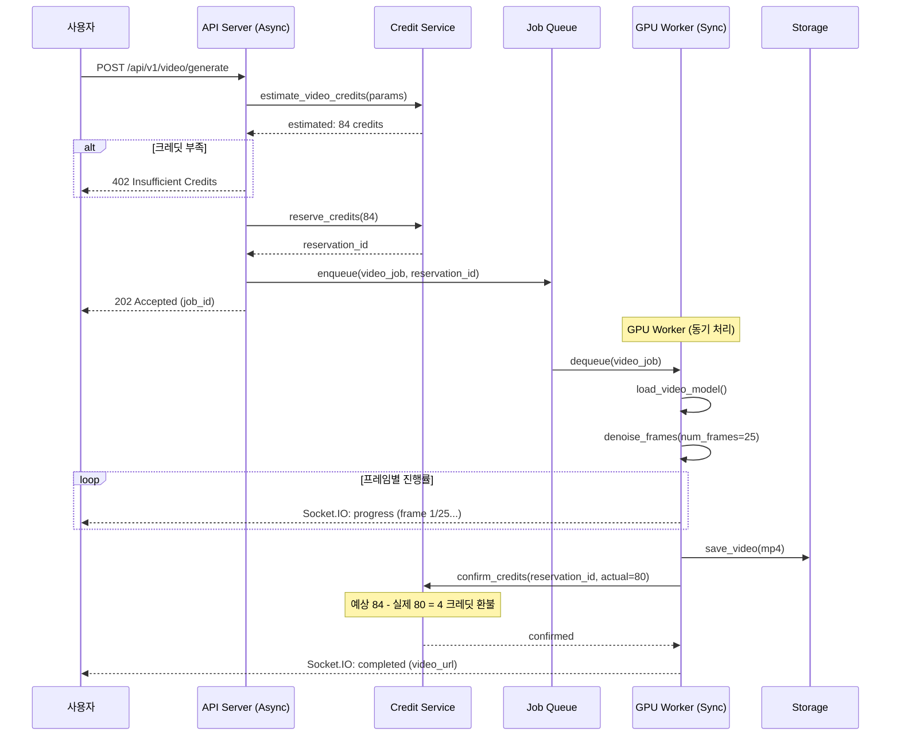

---

## 7. 인프라 및 GPU 요구사항

### 7.1 비디오 모델별 GPU 요구사항

| 모델 | 최소 VRAM | 권장 VRAM | 권장 GPU | 생성 시간 (16프레임) |
|------|----------|----------|---------|---------------------|
| AnimateDiff (SD1.5) | 8GB | 12GB | T4 / A10G | 30~60초 |
| SVD/SVD-XT | 12GB | 16GB | A10G | 60~120초 |
| Z-Image Video | 16GB | 24GB | A10G / A100 | 60~180초 |
| Hunyuan Video | 24GB | 40GB | A100 | 120~300초 |

### 7.2 AWS GPU 인스턴스 매핑

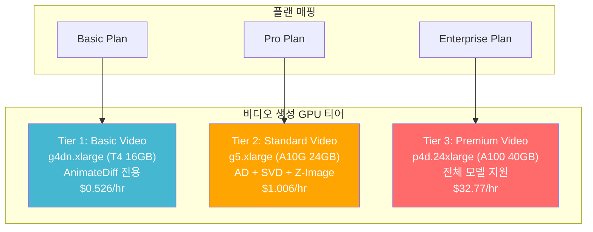

### 7.3 비디오 스토리지 및 전송

| 항목 | 설계 |
|------|------|
| **인코딩** | H.264 (MP4) for compatibility, H.265 optional |
| **스토리지** | S3 Standard → S3 IA (7일 후) → S3 Glacier (30일 후) |
| **스트리밍** | CloudFront CDN + HLS adaptive streaming |
| **썸네일** | Lambda로 첫 프레임 자동 추출 |
| **메타데이터** | DynamoDB: video_id, user_id, frames, fps, duration, model, prompt |

### 7.4 비디오 전용 아키텍처

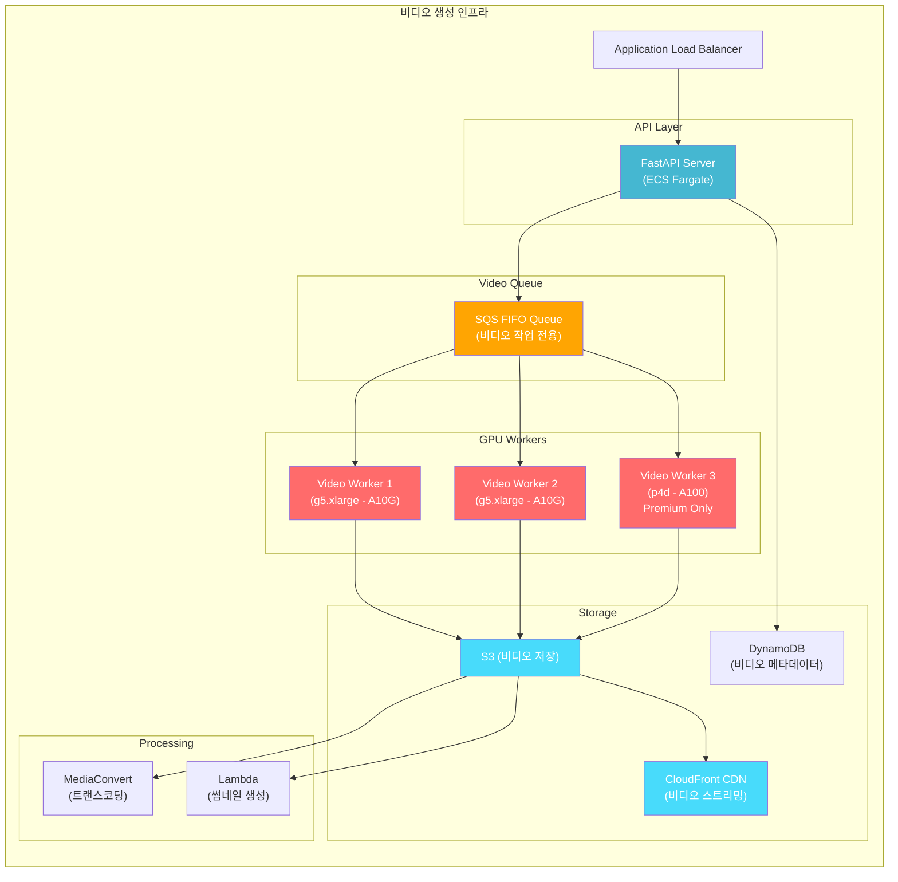

---

> **참고:** 이 문서는 InvokeAI v6.11.1.post1 코드베이스 분석을 기반으로 작성되었습니다. Z-Image 모듈의 VideoX-Fun 아키텍처 기반은 비디오 생성 재구현의 가장 유력한 경로이며, `f_patch_size` 파라미터화만으로도 기본적인 비디오 생성이 가능할 수 있습니다. 그러나 비디오 품질을 위해서는 비디오 전용으로 학습된 모델 가중치가 필수적입니다.
