# InvokeAI SaaS - 비디오 생성 기능 분석 및 재구현 가이드

> **문서 버전:** v2.1
> **최초 작성:** 2026-02-08 04:02 UTC
> **최종 수정:** 2026-02-08 12:00 UTC (Aurora PostgreSQL 전환 반영)
> **대상 코드:** InvokeAI v6.11.1.post1 (Pinksea-AI fork)

---

## 목차
1. [분석 요약](#1-분석-요약)
2. [비디오 관련 흔적 상세 분석](#2-비디오-관련-흔적-상세-분석)
3. [Z-Image / VideoX-Fun 아키텍처 분석](#3-z-image--videox-fun-아키텍처-분석)
4. [비디오 생성 재구현 전략](#4-비디오-생성-재구현-전략)
5. [구현 로드맵](#5-구현-로드맵)
6. [SaaS 비디오 생성 크레딧 설계](#6-saas-비디오-생성-크레딧-설계)
7. [인프라 및 GPU 요구사항](#7-인프라-및-gpu-요구사항)
8. [백엔드 핸즈온: AI 파이프라인 개발](#8-백엔드-핸즈온-ai-파이프라인-개발)
9. [백엔드 핸즈온: 서비스 및 API 개발](#9-백엔드-핸즈온-서비스-및-api-개발)
10. [프론트엔드 핸즈온: 비디오 UI 개발](#10-프론트엔드-핸즈온-비디오-ui-개발)
11. [SaaS 통합: 크레딧 및 플랜 연동](#11-saas-통합-크레딧-및-플랜-연동)
12. [테스트 및 품질 보증](#12-테스트-및-품질-보증)

---

## 1. 분석 요약

### 1.1 핵심 결론

현재 InvokeAI v6.11.1 코드베이스에는 **실제 비디오 생성 기능이 구현되어 있지 않습니다.** 그러나 다음과 같은 중요한 아키텍처적 흔적이 발견되었습니다:

| 카테고리 | 발견 내용 | 비디오 생성 관련 | 중요도 |
|----------|-----------|-----------------|--------|
| Z-Image (VideoX-Fun 파생) | 백엔드 전체가 비디오 프레임워크에서 파생 | **높음** - 프레임 차원 하드코딩 | ★★★★★ |
| Hunyuan Video LoRA | OMI 스펙의 아키텍처 식별자 | 낮음 - 문자열 상수만 존재 | ★★☆☆☆ |
| "video Starting Frame Image" | 프론트엔드 타입 주석 | **중간** - 과거 계획 흔적 | ★★★☆☆ |
| 커뮤니티 Load Video Frame 노드 | 외부 써드파티 노드 문서화 | 외부 - InvokeAI 코어 아님 | ★★☆☆☆ |
| SAM2 VideoProcessor | docstring 타입 힌트 | 낮음 - 이미지 세그멘테이션 전용 | ★☆☆☆☆ |
| Tutorial Videos / "video card" | YouTube 링크, GPU 참조 | 무관 | ☆☆☆☆☆ |

### 1.2 Git 히스토리 분석

```
검색 결과:
- video/animate/AnimateDiff/motion 관련 커밋: 0건
- 삭제된 비디오 관련 파일: 0건
- 비디오 관련 브랜치: 0건
```

**결론:** 이 포크의 git 히스토리에는 비디오 생성 코드가 존재했다가 삭제된 흔적이 전혀 없습니다. 클라우드 버전의 비디오 기능은 별도 브랜치 또는 별도 레포지토리에서 개발되었을 가능성이 높습니다.

---

## 2. 비디오 관련 흔적 상세 분석

### 2.1 Z-Image 모듈: VideoX-Fun 기반 (가장 중요한 발견)

Z-Image 모듈은 Alibaba의 **VideoX-Fun** 비디오 생성 프레임워크에서 직접 파생되었습니다. 이것이 비디오 생성 재구현의 핵심 기반입니다.

**원본 출처 표기가 있는 파일:**

```python
# invokeai/backend/z_image/z_image_control_transformer.py (라인 1-3)
# Adapted from https://github.com/aigc-apps/VideoX-Fun/blob/main/videox_fun/models/z_image_transformer2d_control.py
# Copyright (c) Alibaba, Inc. and its affiliates.
# Apache License 2.0

# invokeai/backend/z_image/z_image_control_adapter.py (라인 1-3)
# Adapted from https://github.com/aigc-apps/VideoX-Fun/blob/main/videox_fun/models/z_image_transformer2d_control.py
# Copyright (c) Alibaba, Inc. and its affiliates.
# Apache License 2.0
```

**프레임 차원이 보존된 코드:**

```python
# invokeai/app/invocations/z_image_denoise.py (라인 471, 563, 679, 705)
# Add frame dimension: [B, C, H, W] -> [C, 1, H, W] (single image)
latent_model_input = latent_model_input.unsqueeze(2)  # Add frame dimension
noise_pred_cond = noise_pred_cond.squeeze(2)           # Remove frame dimension
```

```python
# invokeai/backend/z_image/z_image_patchify_utils.py (라인 37-51)
def patchify_control_context(
    all_image: List[torch.Tensor],
    patch_size: int,
    f_patch_size: int,        # ← Frame patch size (비디오 프레임 단위)
    cap_seq_len: int,
) -> Tuple[...]:
    """Patchify control images without embedding.
    Args:
        all_image: List of control image tensors [C, F, H, W]  # ← F = Frame 차원
        f_patch_size: Frame patch size                          # ← 현재 항상 1
    """
```

### 2.2 전체 Z-Image 파일 목록

**백엔드 모듈 (9개 파일):**

| 파일 | 역할 | 비디오 확장 가능성 |
|------|------|-------------------|
| `backend/z_image/__init__.py` | 패키지 초기화 | - |
| `backend/z_image/extensions/__init__.py` | 확장 패키지 | - |
| `backend/z_image/extensions/regional_prompting_extension.py` | 리전 프롬프팅 | 프레임별 리전 지원 필요 |
| `backend/z_image/text_conditioning.py` | 텍스트 조건화 | 시간축 조건화 추가 필요 |
| `backend/z_image/z_image_control_adapter.py` | 컨트롤 어댑터 | **f_patch_size > 1 지원 가능** |
| `backend/z_image/z_image_control_transformer.py` | 컨트롤 트랜스포머 | **f_patch_size > 1 지원 가능** |
| `backend/z_image/z_image_controlnet_extension.py` | ControlNet 확장 | 프레임별 제어 신호 |
| `backend/z_image/z_image_patchify_utils.py` | 패치화 유틸리티 | **핵심 - F 차원 이미 지원** |
| `backend/z_image/z_image_transformer_patch.py` | 트랜스포머 패치 | **f_patch_size 파라미터 존재** |

**인보케이션 노드 (8개 파일):**

| 파일 | 역할 | 비디오 확장 |
|------|------|------------|
| `app/invocations/z_image_control.py` | Z-Image 컨트롤 노드 | 프레임별 컨트롤 입력 |
| `app/invocations/z_image_denoise.py` | 디노이즈 노드 (핵심) | **unsqueeze(2)/squeeze(2) 이미 존재** |
| `app/invocations/z_image_image_to_latents.py` | 이미지→잠재공간 | 비디오 프레임→잠재공간 |
| `app/invocations/z_image_latents_to_image.py` | 잠재공간→이미지 | 잠재공간→비디오 프레임 |
| `app/invocations/z_image_lora_loader.py` | LoRA 로더 | 비디오 LoRA 로딩 |
| `app/invocations/z_image_model_loader.py` | 모델 로더 | 비디오 모델 로딩 |
| `app/invocations/z_image_seed_variance_enhancer.py` | 시드 변형 | 프레임별 시드 변형 |
| `app/invocations/z_image_text_encoder.py` | 텍스트 인코더 | 그대로 사용 가능 |

### 2.3 Hunyuan Video LoRA 아키텍처 식별자

```python
# invokeai/backend/model_manager/omi/vendor/model_spec/architecture.py (라인 29)
hunyuan_video_lora = "hunyuan-video/lora"
```

이것은 OMI(Open Model Initiative) 벤더 라이브러리의 모델 스펙 식별자입니다. Hunyuan Video LoRA 모델을 식별하기 위한 문자열 상수로, 실제 파이프라인 구현은 없습니다.

### 2.4 "video Starting Frame Image" 참조

```typescript
// invokeai/frontend/web/src/features/controlLayers/store/types.ts (라인 52-53)
// When we added cropping support to certain entities (e.g. Ref Images, video Starting Frame Image),
// we changed their schemas from using zImageWithDims to this new schema.
```

이 주석은 **"video Starting Frame Image"**라는 엔티티 타입이 과거에 존재했거나 계획되었음을 암시합니다. 비디오 워크플로우의 시작 프레임 이미지를 위한 UI 기능이 고려되었던 것으로 보이나, 실제 구현은 코드베이스 어디에도 없습니다.

### 2.5 커뮤니티 Load Video Frame 노드

```markdown
# docs/nodes/communityNodes.md (라인 382-389)
### Load Video Frame
**Description:** This is a video frame image provider + indexer/video creation nodes
for hooking up to iterators and ranges and ControlNets and such for invokeAI node
experimentation. Think animation + ControlNet outputs.
**Node Link:** https://github.com/helix4u/load_video_frame
```

외부 써드파티 커뮤니티 노드로, InvokeAI의 노드 시스템을 활용하여 비디오 프레임을 추출하고 ControlNet과 연동하는 실험적 기능입니다.

### 2.6 현재 모델 타입 체계 (비디오 타입 없음)

```python
# invokeai/backend/model_manager/taxonomy.py
class BaseModelType(str, Enum):
    Any = "any"
    StableDiffusion1 = "sd-1"
    StableDiffusion2 = "sd-2"
    StableDiffusion3 = "sd-3"
    StableDiffusionXL = "sdxl"
    StableDiffusionXLRefiner = "sdxl-refiner"
    Flux = "flux"
    Flux2 = "flux2"
    CogView4 = "cogview4"
    ZImage = "z-image"            # ← VideoX-Fun 기반이지만 이미지 전용
    Unknown = "unknown"
    # ❌ AnimateDiff, SVD, HunyuanVideo 등 비디오 모델 타입 없음
```

---

## 3. Z-Image / VideoX-Fun 아키텍처 분석

### 3.1 프레임 차원 아키텍처 흐름

Z-Image의 핵심은 VideoX-Fun에서 물려받은 **프레임 차원(F dimension)** 처리입니다. 현재는 `f_patch_size=1`로 하드코딩되어 단일 이미지만 처리하지만, 아키텍처적으로 다중 프레임을 지원할 수 있는 구조입니다.

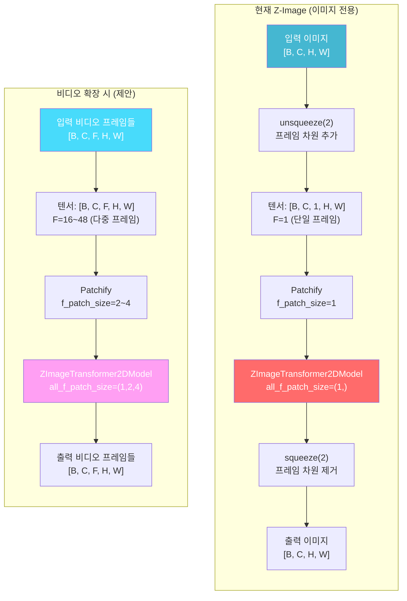

### 3.2 f_patch_size 확장 포인트

비디오 생성을 위해 변경이 필요한 하드코딩된 `f_patch_size=1` 위치:

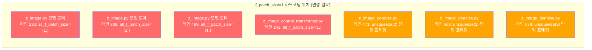

### 3.3 Patchify 프로세스 상세

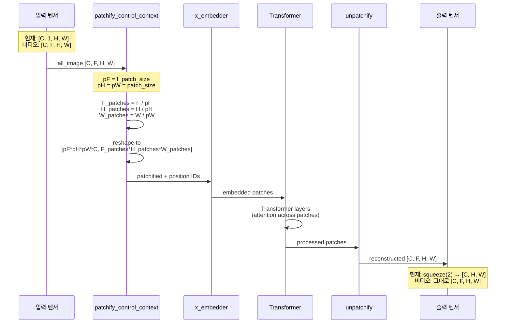

### 3.4 VideoX-Fun 원본과 InvokeAI 적응 비교

| 항목 | VideoX-Fun (원본) | InvokeAI Z-Image (현재) |
|------|-------------------|------------------------|
| **목적** | Text-to-Video / Image-to-Video | Text-to-Image / Image-to-Image |
| **프레임 수** | 16~128 프레임 | 1 프레임 (하드코딩) |
| **f_patch_size** | 1, 2, 4 (가변) | 1 (고정) |
| **텐서 형태** | [B, C, F, H, W] | [B, C, 1, H, W] |
| **Temporal Attention** | 프레임 간 어텐션 활성 | 단일 프레임이므로 무의미 |
| **모델 가중치** | 비디오 학습 가중치 | 이미지 학습 가중치 |
| **출력** | 비디오 프레임 시퀀스 | 단일 이미지 |
| **ControlNet** | 프레임별 제어 신호 | 단일 이미지 제어 |
| **VAE** | 3D VAE (시간축 포함) | 2D VAE |

---

## 4. 비디오 생성 재구현 전략

### 4.1 전략 개요

Z-Image의 VideoX-Fun 아키텍처 기반을 활용하여, **최소한의 코드 변경으로 비디오 생성을 활성화**하는 전략을 제안합니다.

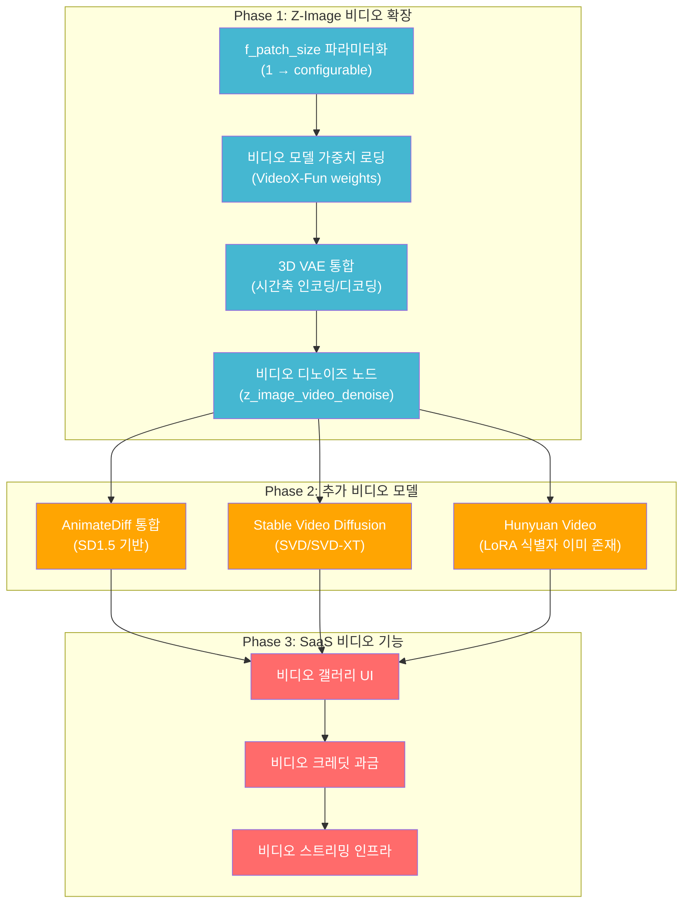

### 4.2 Phase 1: Z-Image 비디오 확장 (핵심)

#### 4.2.1 f_patch_size 파라미터화

**변경 대상:** `invokeai/backend/model_manager/load/model_loaders/z_image.py`

```python
# 현재 (라인 236, 338, 489):
all_f_patch_size=(1,),

# 변경 후:
all_f_patch_size=tuple(config.get("all_f_patch_size", (1,))),
# 비디오 모델은 (1, 2, 4) 등의 다중 프레임 패치 사이즈 지원
```

#### 4.2.2 비디오 디노이즈 노드 구현

**신규 파일:** `invokeai/app/invocations/z_image_video_denoise.py`

```python
@invocation(
    "z_image_video_denoise",
    title="Denoise Video - Z-Image",
    tags=["video", "z-image", "denoise"],
    category="z-image",
    classification=Classification.Beta,
)
class ZImageVideoDenoiseInvocation(BaseInvocation):
    """Z-Image 기반 비디오 디노이즈 노드.

    VideoX-Fun 아키텍처를 활용하여 다중 프레임 비디오를 생성합니다.
    f_patch_size > 1을 사용하여 시간축 패치화를 수행합니다.
    """
    num_frames: int = InputField(default=16, description="생성할 비디오 프레임 수")
    fps: int = InputField(default=8, description="출력 비디오 FPS")
    f_patch_size: int = InputField(default=2, description="프레임 패치 사이즈")
    # ... 기존 z_image_denoise 파라미터 상속 ...

    def invoke(self, context: InvocationContext) -> VideoOutput:
        # 1. 다중 프레임 잠재 공간 초기화
        # latents: [B, C, F, H, W] where F = num_frames
        latents = torch.randn(1, channels, self.num_frames, height, width)

        # 2. unsqueeze(2) 대신 다중 프레임 직접 전달
        # (기존: unsqueeze(2)로 F=1 추가 → 변경: F=num_frames 그대로)

        # 3. f_patch_size > 1로 시간축 패치화
        # patchify: [C, F, H, W] → [C*pF*pH*pW, F/pF * H/pH * W/pW]

        # 4. 프레임별 디코딩 및 비디오 어셈블리
        frames = []
        for f in range(self.num_frames):
            frame = vae_decode(latents[:, :, f, :, :])
            frames.append(frame)

        return VideoOutput(frames=frames, fps=self.fps)
```

#### 4.2.3 3D VAE 통합

VideoX-Fun의 비디오 생성에는 시간축을 포함하는 3D VAE가 필요합니다:

```python
# 신규 필요: 3D VAE 모델 로더
# VideoX-Fun의 VAE는 [B, C, F, H, W] → [B, Z, F/t, H/s, W/s] 인코딩 지원
# t = temporal downscale factor, s = spatial downscale factor

class Video3DVAE:
    """3D VAE for video encoding/decoding.

    Standard 2D VAE processes each frame independently:
      [B, C, F, H, W] → loop over F → [B, Z, F, H/8, W/8]

    3D VAE processes temporal dimension jointly:
      [B, C, F, H, W] → [B, Z, F/4, H/8, W/8]
      (temporal compression ratio: 4x)
    """
```

#### 4.2.4 비디오 모델 타입 추가

```python
# invokeai/backend/model_manager/taxonomy.py 변경
class BaseModelType(str, Enum):
    # ... 기존 타입들 ...
    ZImage = "z-image"
    ZImageVideo = "z-image-video"    # ← 신규: 비디오 생성 모델
    HunyuanVideo = "hunyuan-video"   # ← 신규: Hunyuan Video 모델

class ModelType(str, Enum):
    # ... 기존 타입들 ...
    VideoVAE = "video_vae"           # ← 신규: 3D VAE
    MotionModule = "motion_module"   # ← 신규: AnimateDiff용
```

### 4.3 Phase 2: 추가 비디오 모델 통합

#### 4.3.1 AnimateDiff (SD1.5 기반)

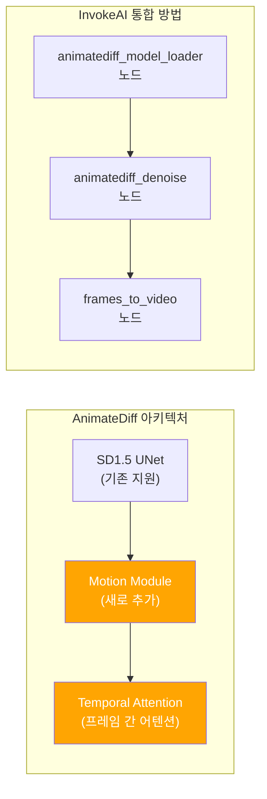

AnimateDiff는 SD1.5 UNet에 **Motion Module**을 삽입하여 시간축 어텐션을 추가합니다:

| 항목 | 설명 |
|------|------|
| **모델** | SD1.5 + Motion Module v2/v3 |
| **프레임 수** | 16~32 프레임 |
| **해상도** | 512×512 ~ 768×768 |
| **ControlNet** | 기존 SD1.5 ControlNet 호환 |
| **LoRA** | 기존 SD1.5 LoRA 호환 |
| **VRAM** | ~8GB (16프레임) |

#### 4.3.2 Stable Video Diffusion (SVD)

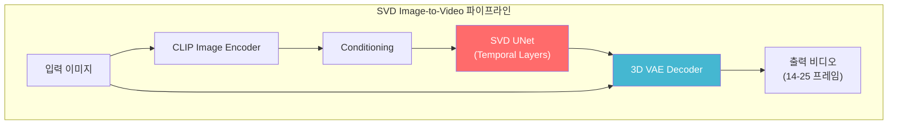

| 항목 | SVD | SVD-XT |
|------|-----|--------|
| **프레임 수** | 14 | 25 |
| **해상도** | 576×1024 | 576×1024 |
| **입력** | 이미지 (img2vid) | 이미지 (img2vid) |
| **VRAM** | ~12GB | ~16GB |
| **모델 크기** | ~5.2GB | ~5.2GB |

#### 4.3.3 Hunyuan Video

OMI 스펙에 이미 `hunyuan_video_lora` 식별자가 존재하므로 통합 기반이 있습니다:

| 항목 | 설명 |
|------|------|
| **모델** | Tencent Hunyuan Video |
| **기능** | Text-to-Video, Image-to-Video |
| **프레임 수** | 최대 129 프레임 (~5초) |
| **해상도** | 720p / 1280×720 |
| **VRAM** | ~24GB (A100 권장) |
| **LoRA** | OMI 스펙에 식별자 존재 |

### 4.4 Phase 3: 비디오 관련 프론트엔드 구현

#### 4.4.1 비디오 워크플로우 UI

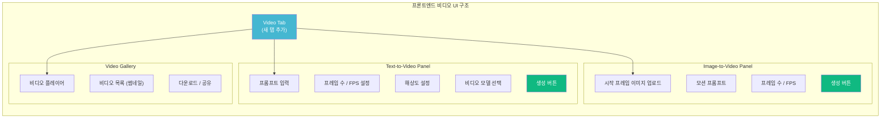

#### 4.4.2 "video Starting Frame Image" 기능 복원

프론트엔드 `types.ts`에 언급된 "video Starting Frame Image" 엔티티를 실제로 구현:

```typescript
// invokeai/frontend/web/src/features/controlLayers/store/types.ts
// 기존 주석에서 참조된 기능을 실제 구현

export const zVideoStartingFrameImage = zImageWithDimsCrop.extend({
  type: z.literal('video_starting_frame'),
  motionStrength: z.number().min(0).max(1).default(0.7),
  fps: z.number().int().min(1).max(60).default(8),
  numFrames: z.number().int().min(4).max(128).default(16),
});
```

---

## 5. 구현 로드맵

### 5.1 개발 일정

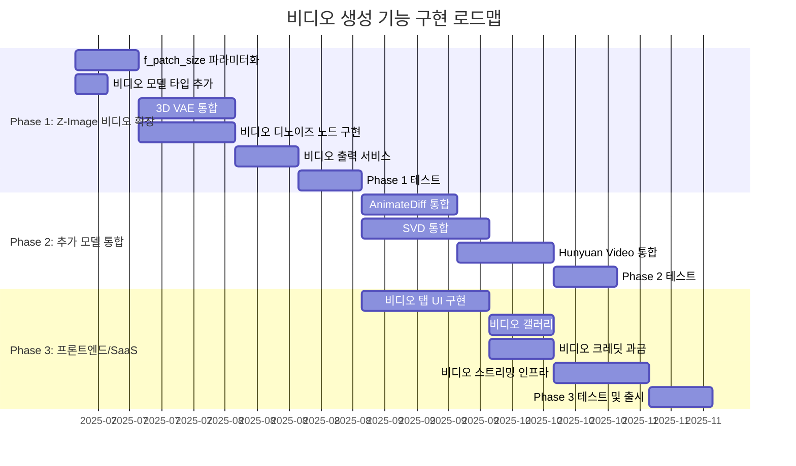

### 5.2 단계별 상세 작업

#### Phase 1 작업 목록 (8~10주)

| # | 작업 | 파일 | 변경 유형 | 난이도 |
|---|------|------|-----------|--------|
| 1 | `BaseModelType`에 `ZImageVideo` 추가 | `taxonomy.py` | 수정 | 낮음 |
| 2 | `ModelType`에 `VideoVAE`, `MotionModule` 추가 | `taxonomy.py` | 수정 | 낮음 |
| 3 | `f_patch_size` 하드코딩 제거 (3곳) | `z_image.py` (model loader) | 수정 | 중간 |
| 4 | 비디오 모델 config 스키마 생성 | `configs/` | 신규 | 중간 |
| 5 | 3D VAE 로더 구현 | `model_loaders/` | 신규 | 높음 |
| 6 | `z_image_video_denoise.py` 노드 구현 | `invocations/` | 신규 | 높음 |
| 7 | `z_image_video_to_frames.py` 노드 구현 | `invocations/` | 신규 | 중간 |
| 8 | `z_image_frames_to_video.py` 노드 구현 | `invocations/` | 신규 | 중간 |
| 9 | 비디오 파일 저장 서비스 | `services/` | 신규 | 중간 |
| 10 | 비디오 출력 API 엔드포인트 | `routers/` | 신규 | 중간 |

#### Phase 2 작업 목록 (8~10주)

| # | 작업 | 난이도 |
|---|------|--------|
| 1 | AnimateDiff Motion Module 로더 | 중간 |
| 2 | AnimateDiff SD1.5 UNet 패치 | 높음 |
| 3 | AnimateDiff 디노이즈 노드 | 높음 |
| 4 | SVD 파이프라인 통합 | 높음 |
| 5 | SVD Image-to-Video 노드 | 중간 |
| 6 | Hunyuan Video 모델 로더 | 높음 |
| 7 | Hunyuan Video 디노이즈 노드 | 높음 |
| 8 | 비디오 LoRA 지원 | 중간 |

#### Phase 3 작업 목록 (8~10주)

| # | 작업 | 난이도 |
|---|------|--------|
| 1 | 비디오 탭 UI 컴포넌트 | 중간 |
| 2 | 비디오 프레임/FPS 파라미터 패널 | 낮음 |
| 3 | 비디오 갤러리 (재생기 포함) | 높음 |
| 4 | 비디오 크레딧 과금 로직 | 중간 |
| 5 | 비디오 스트리밍 서비스 (HLS/DASH) | 높음 |
| 6 | 비디오 프리뷰 썸네일 생성 | 낮음 |
| 7 | 비디오 다운로드/공유 | 낮음 |

---

## 6. SaaS 비디오 생성 크레딧 설계

### 6.1 비디오 크레딧 계산 공식

비디오 생성은 이미지 생성보다 훨씬 많은 GPU 리소스를 사용합니다. 크레딧 계산 공식:

```
비디오 크레딧 = 기본_이미지_크레딧 × 프레임_수 × 해상도_배율 × 모델_배율

예시:
- 16프레임 512×512 AnimateDiff: 1 × 16 × 1.0 × 1.0 = 16 크레딧
- 25프레임 576×1024 SVD: 1 × 25 × 2.25 × 1.5 = 84 크레딧
- 48프레임 720p Z-Image Video: 1 × 48 × 3.0 × 2.0 = 288 크레딧
- 129프레임 720p Hunyuan Video: 1 × 129 × 3.0 × 3.0 = 1,161 크레딧
```

### 6.2 플랜별 비디오 생성 제한

| 항목 | Trial | Starter | Pro | Studio | Enterprise | Tester |
|------|-------|---------|-----|--------|------------|--------|
| **비디오 생성** | ❌ 불가 | 기본만 | 전체 | 전체 + 멀티큐 | 전체 + 우선 | 전체 |
| **최대 프레임 수** | - | 16 | 48 | 48 | 128 | 48 |
| **최대 해상도** | - | 512×512 | 720p | 720p | 1080p | 720p |
| **지원 모델** | - | AnimateDiff | AD + SVD + Z-Image | AD + SVD + Z-Image | 전체 | AD + SVD + Z-Image |
| **동시 비디오 작업** | - | 1 | 1 | 3 | Custom | 1 |
| **비디오 저장 용량** | - | 포함 (20GB 내) | 포함 (100GB 내) | 포함 (200GB 내) | Custom | 포함 (20GB 내) |
| **비디오 보관 기간** | - | 구독 유지 중 | 구독 유지 중 | 구독 유지 중 | 무제한 | 부여 기간 내 |

### 6.3 비디오 크레딧 흐름

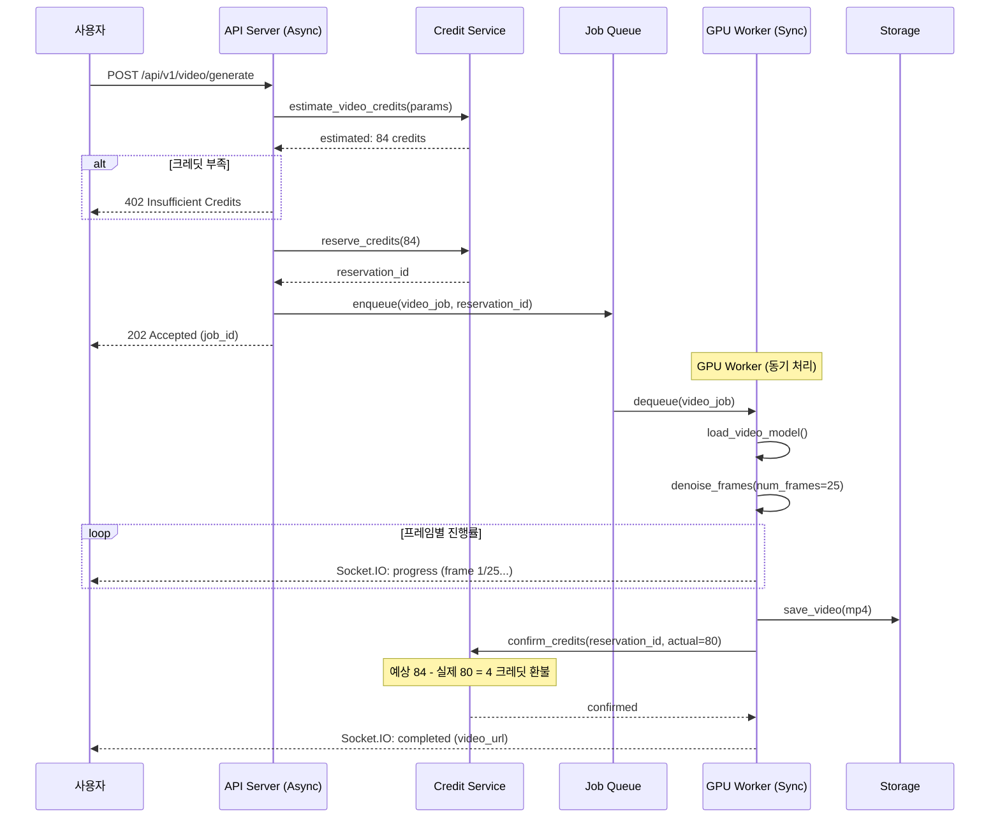

---

## 7. 인프라 및 GPU 요구사항

### 7.1 비디오 모델별 GPU 요구사항

| 모델 | 최소 VRAM | 권장 VRAM | 권장 GPU | 생성 시간 (16프레임) |
|------|----------|----------|---------|---------------------|
| AnimateDiff (SD1.5) | 8GB | 12GB | T4 / A10G | 30~60초 |
| SVD/SVD-XT | 12GB | 16GB | A10G | 60~120초 |
| Z-Image Video | 16GB | 24GB | A10G / A100 | 60~180초 |
| Hunyuan Video | 24GB | 40GB | A100 | 120~300초 |

### 7.2 AWS GPU 인스턴스 매핑

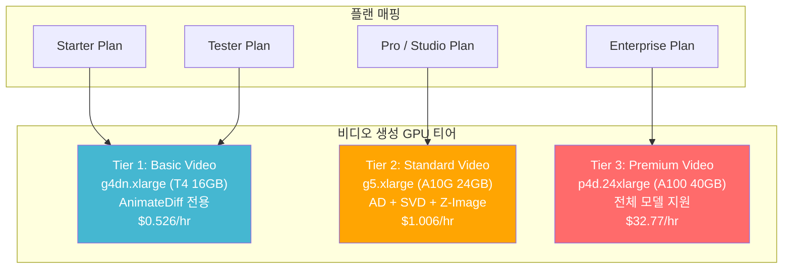

### 7.3 비디오 스토리지 및 전송

| 항목 | 설계 |
|------|------|
| **인코딩** | H.264 (MP4) for compatibility, H.265 optional |
| **스토리지** | S3 Standard → S3 IA (7일 후) → S3 Glacier (30일 후) |
| **스트리밍** | CloudFront CDN + HLS adaptive streaming |
| **썸네일** | Lambda로 첫 프레임 자동 추출 |
| **메타데이터** | DynamoDB: video_id, user_id, frames, fps, duration, model, prompt |

### 7.4 비디오 전용 아키텍처

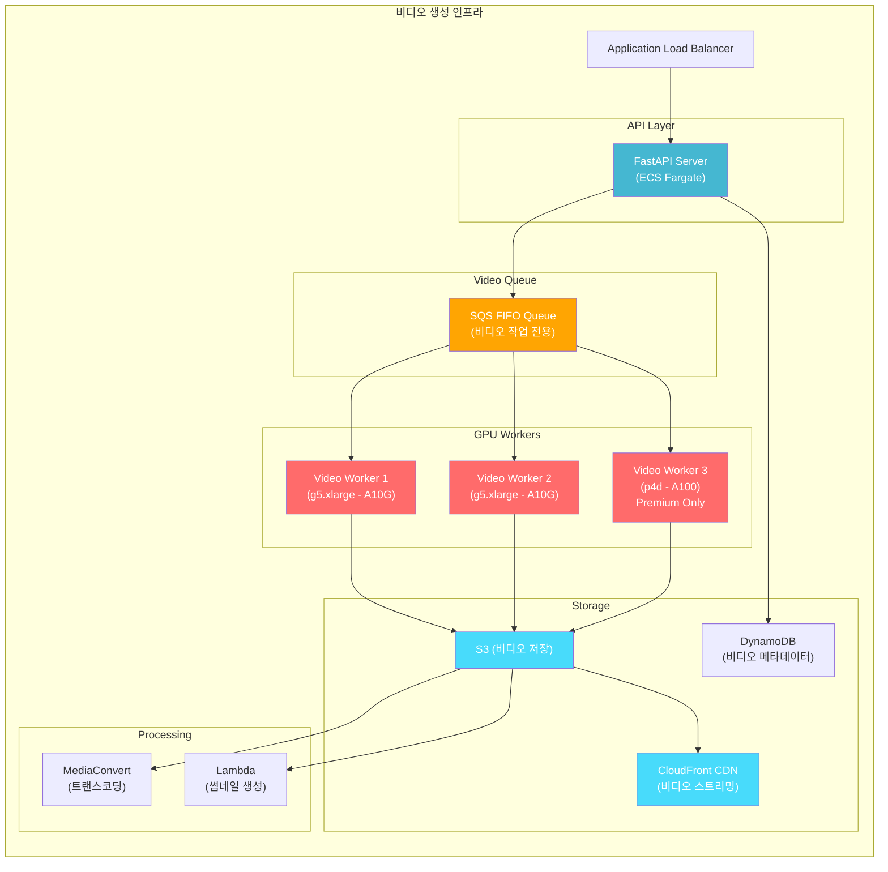

---

## 8. 백엔드 핸즈온: AI 파이프라인 개발

> 이 섹션은 실제 코드 수준에서 비디오 생성 기능을 구현하기 위한 핸즈온 가이드입니다. 현재 코드베이스의 정확한 클래스명, 메서드 시그니처, 라인 번호를 기반으로 작성되었습니다.

### 8.1 Step 1: 모델 타입 시스템 확장

**파일:** `invokeai/backend/model_manager/taxonomy.py`

현재 `BaseModelType`과 `ModelType` enum에 비디오 관련 타입을 추가합니다.

```python
# invokeai/backend/model_manager/taxonomy.py

class BaseModelType(str, Enum):
    Any = "any"
    StableDiffusion1 = "sd-1"
    StableDiffusion2 = "sd-2"
    StableDiffusion3 = "sd-3"
    StableDiffusionXL = "sdxl"
    StableDiffusionXLRefiner = "sdxl-refiner"
    Flux = "flux"
    Flux2 = "flux2"
    CogView4 = "cogview4"
    ZImage = "z-image"
    ZImageVideo = "z-image-video"        # ★ 신규: Z-Image 비디오 모델
    HunyuanVideo = "hunyuan-video"       # ★ 신규: Hunyuan Video
    Unknown = "unknown"

class ModelType(str, Enum):
    ONNX = "onnx"
    Main = "main"
    VAE = "vae"
    LoRA = "lora"
    ControlLoRa = "control_lora"
    ControlNet = "controlnet"
    TextualInversion = "embedding"
    IPAdapter = "ip_adapter"
    CLIPVision = "clip_vision"
    CLIPEmbed = "clip_embed"
    T2IAdapter = "t2i_adapter"
    T5Encoder = "t5_encoder"
    Qwen3Encoder = "qwen3_encoder"
    SpandrelImageToImage = "spandrel_image_to_image"
    SigLIP = "siglip"
    FluxRedux = "flux_redux"
    LlavaOnevision = "llava_onevision"
    VideoVAE = "video_vae"              # ★ 신규: 3D VAE (시간축 포함)
    MotionModule = "motion_module"      # ★ 신규: AnimateDiff용
    Unknown = "unknown"
```

### 8.2 Step 2: f_patch_size 파라미터화 (모델 로더)

**파일:** `invokeai/backend/model_manager/load/model_loaders/z_image.py`

현재 3곳에서 `all_f_patch_size=(1,)`이 하드코딩되어 있습니다. 이를 설정 기반으로 변경합니다.

```python
# z_image.py - ZImageCheckpointModel._load_model() (라인 235-236)
# 현재:
with accelerate.init_empty_weights():
    model = ZImageTransformer2DModel(
        all_patch_size=(2,),
        all_f_patch_size=(1,),       # ← 하드코딩
        in_channels=16,
        dim=3840,
        n_layers=30,
        n_refiner_layers=2,
        n_heads=30,
        n_kv_heads=30,
        norm_eps=1e-05,
        qk_norm=True,
        cap_feat_dim=2560,
        rope_theta=256.0,
        t_scale=1000.0,
        axes_dims=[32, 48, 48],
        axes_lens=[1024, 512, 512],
    )

# 변경 후:
def _get_f_patch_sizes(self, config: AnyModelConfig) -> tuple[int, ...]:
    """모델 설정에서 f_patch_size 목록을 가져옴. 비디오 모델은 다중 값."""
    if config.base == BaseModelType.ZImageVideo:
        return (1, 2, 4)  # 비디오: 시간축 다중 패치 지원
    return (1,)  # 이미지: 단일 프레임

with accelerate.init_empty_weights():
    model = ZImageTransformer2DModel(
        all_patch_size=(2,),
        all_f_patch_size=self._get_f_patch_sizes(config),  # ← 동적
        in_channels=16,
        # ... 나머지 동일
    )
```

동일한 변경을 **3곳**에 적용:
- `ZImageCheckpointModel._load_model()` (라인 ~236)
- `ZImageGGUFCheckpointModel._load_model()` (라인 ~338)
- `ZImageControlCheckpointModel._load_model()` (라인 ~489)

### 8.3 Step 3: 비디오 디노이즈 인보케이션 노드 구현

**신규 파일:** `invokeai/app/invocations/z_image_video_denoise.py`

기존 `ZImageDenoiseInvocation`(`z_image_denoise.py`)을 기반으로, `unsqueeze(2)`/`squeeze(2)` 단일 프레임 처리를 다중 프레임 처리로 확장합니다.

```python
# invokeai/app/invocations/z_image_video_denoise.py
"""
Z-Image 비디오 디노이즈 노드.
기존 ZImageDenoiseInvocation과 동일한 디노이징 파이프라인을 사용하되,
[B, C, 1, H, W] 대신 [B, C, F, H, W] 다중 프레임을 처리합니다.
"""
import torch
from typing import Optional, Union

from invokeai.app.invocations.baseinvocation import (
    BaseInvocation,
    Classification,
    invocation,
)
from invokeai.app.invocations.fields import (
    InputField,
    Input,
    FieldDescriptions,
)
from invokeai.app.invocations.primitives import LatentsOutput
from invokeai.app.services.shared.invocation_context import InvocationContext
from invokeai.backend.z_image.text_conditioning import ZImageTextConditioning
from invokeai.backend.z_image.z_image_transformer_patch import patch_transformer_for_regional_prompting
from invokeai.backend.z_image.z_image_controlnet_extension import (
    ZImageControlNetExtension,
    z_image_forward_with_control,
)


@invocation(
    "z_image_video_denoise",
    title="Denoise Video - Z-Image",
    tags=["video", "z-image", "denoise"],
    category="z-image",
    version="1.0.0",
    classification=Classification.Beta,
)
class ZImageVideoDenoiseInvocation(BaseInvocation):
    """Z-Image 기반 비디오 디노이즈 노드.

    VideoX-Fun 아키텍처를 활용하여 다중 프레임 비디오를 생성합니다.
    기존 z_image_denoise의 unsqueeze(2)/squeeze(2) 패턴 대신,
    [B, C, F, H, W] 텐서를 직접 처리합니다.
    """

    # === 비디오 전용 파라미터 ===
    num_frames: int = InputField(
        default=16, ge=4, le=128,
        description="생성할 비디오 프레임 수 (f_patch_size의 배수여야 함)",
    )
    fps: int = InputField(default=8, ge=1, le=60, description="출력 비디오 FPS")
    f_patch_size: int = InputField(
        default=2, ge=1, le=4,
        description="프레임 패치 사이즈 (시간축 압축 단위)",
    )

    # === 기존 z_image_denoise 파라미터 (동일) ===
    latents: Optional["LatentsField"] = InputField(default=None)
    denoising_start: float = InputField(default=0.0, ge=0, le=1)
    denoising_end: float = InputField(default=1.0, ge=0, le=1)
    add_noise: bool = InputField(default=True)
    transformer: "TransformerField" = InputField(description=FieldDescriptions.z_image_model)
    positive_conditioning: Union["ZImageConditioningField", list["ZImageConditioningField"]] = InputField()
    negative_conditioning: Optional[Union["ZImageConditioningField", list["ZImageConditioningField"]]] = InputField(default=None)
    guidance_scale: float = InputField(default=1.0, ge=1.0)
    width: int = InputField(default=512, multiple_of=16)
    height: int = InputField(default=512, multiple_of=16)
    steps: int = InputField(default=8, gt=0)
    seed: int = InputField(default=0)
    vae: Optional["VAEField"] = InputField(default=None)
    scheduler: str = InputField(default="euler")

    @torch.no_grad()
    def invoke(self, context: InvocationContext) -> LatentsOutput:
        # 프레임 수 검증: f_patch_size의 배수
        assert self.num_frames % self.f_patch_size == 0, (
            f"num_frames({self.num_frames}) must be divisible by f_patch_size({self.f_patch_size})"
        )

        latents = self._run_video_diffusion(context)
        latents = latents.detach().to("cpu")
        name = context.tensors.save(tensor=latents)
        return LatentsOutput.build(latents_name=name, latents=latents, seed=None)

    def _run_video_diffusion(self, context: InvocationContext) -> torch.Tensor:
        """비디오 디노이징 메인 루프.

        핵심 차이점 (기존 z_image_denoise vs 비디오):
        - 기존: latent [B, C, H, W] → unsqueeze(2) → [B, C, 1, H, W] → squeeze(2)
        - 비디오: latent [B, C, F, H, W] 직접 처리 (unsqueeze/squeeze 제거)
        """
        num_channels_latents = 16  # Z-Image는 16채널 잠재 공간
        device = self._get_device()

        # 1. 다중 프레임 잠재 공간 초기화
        # 기존: [B, C, H, W] → 비디오: [B, C, F, H, W]
        latent_height = self.height // 8  # VAE spatial downscale 8x
        latent_width = self.width // 8
        latents = torch.randn(
            1,                          # batch
            num_channels_latents,       # channels = 16
            self.num_frames,            # ★ 프레임 차원 (기존에는 없음)
            latent_height,
            latent_width,
            device=device,
            generator=torch.Generator(device=device).manual_seed(self.seed),
        )

        # 2. 스케줄러 설정 (기존과 동일)
        scheduler = self._setup_scheduler()
        timesteps = scheduler.timesteps

        # 3. 모델 로딩
        transformer_info = context.models.load(self.transformer.transformer)
        with transformer_info as transformer:
            # 4. 디노이징 루프
            for i, t in enumerate(timesteps):
                context.util.signal_progress(f"Denoising frame batch: step {i+1}/{len(timesteps)}")

                # ★ 핵심 변경: unsqueeze(2) 제거
                # 기존: latent_model_input = latents.unsqueeze(2)
                # 비디오: 이미 [B, C, F, H, W] 이므로 직접 전달

                # 배치 아이템을 리스트로 변환 (트랜스포머 입력 형식)
                # x: List[torch.Tensor] - 각 [C, F, H, W]
                x_list = [latents[b] for b in range(latents.shape[0])]

                # 트랜스포머 forward (f_patch_size > 1 사용)
                noise_pred_list, _ = transformer(
                    x=x_list,
                    t=torch.tensor([t], device=device),
                    cap_feats=self._get_conditioning(context),
                    patch_size=2,
                    f_patch_size=self.f_patch_size,  # ★ 기존 1 → 비디오용 2 or 4
                )

                # 리스트 → 텐서 변환
                noise_pred = torch.stack(noise_pred_list, dim=0)

                # ★ 핵심 변경: squeeze(2) 제거
                # 기존: noise_pred = noise_pred.squeeze(2)
                # 비디오: [B, C, F, H, W] 그대로 유지

                # CFG 적용 (기존과 동일한 로직)
                if self.guidance_scale > 1.0 and self.negative_conditioning is not None:
                    noise_pred = self._apply_cfg(noise_pred, ...)

                # 스케줄러 스텝
                latents = scheduler.step(noise_pred, t, latents).prev_sample

        return latents  # [B, C, F, H, W]

    def _get_device(self):
        from invokeai.backend.util.devices import TorchDevice
        return TorchDevice.choose_torch_device()

    def _setup_scheduler(self):
        """Euler 스케줄러 설정 (기존 z_image_denoise와 동일)"""
        # ... 스케줄러 초기화 로직
        pass

    def _get_conditioning(self, context):
        """텍스트 조건화 준비 (기존 z_image_denoise와 동일)"""
        # ... Qwen3 텍스트 인코딩 로직
        pass

    def _apply_cfg(self, noise_pred, ...):
        """Classifier-Free Guidance 적용"""
        # ... CFG 로직
        pass
```

### 8.4 Step 4: 비디오 프레임 디코딩 노드

**신규 파일:** `invokeai/app/invocations/z_image_video_decode.py`

잠재 공간 `[B, C, F, H, W]`를 개별 프레임 이미지로 디코딩합니다. 기존 `ZImageLatentsToImageInvocation`의 VAE 디코딩 패턴을 프레임별로 반복합니다.

```python
# invokeai/app/invocations/z_image_video_decode.py
"""
비디오 잠재 공간을 프레임별로 디코딩하여 비디오 파일로 출력.
기존 ZImageLatentsToImageInvocation (z_image_latents_to_image.py)의
VAE 디코딩 로직을 프레임 루프로 확장합니다.
"""
import io
import tempfile
from pathlib import Path
from typing import Optional, Union

import torch
from PIL import Image
from einops import rearrange

from invokeai.app.invocations.baseinvocation import (
    BaseInvocation, Classification, invocation,
)
from invokeai.app.invocations.fields import InputField
from invokeai.app.services.shared.invocation_context import InvocationContext


class VideoOutput(BaseInvocationOutput):
    """비디오 출력 타입"""
    video_name: str
    width: int
    height: int
    num_frames: int
    fps: int
    duration_seconds: float


@invocation(
    "z_image_video_decode",
    title="Video Decode - Z-Image",
    tags=["video", "z-image", "decode"],
    category="z-image",
    version="1.0.0",
    classification=Classification.Beta,
)
class ZImageVideoDecodeInvocation(BaseInvocation):
    """비디오 잠재 공간 → 프레임별 VAE 디코딩 → MP4 비디오 출력."""

    latents: "LatentsField" = InputField(description="비디오 잠재 공간 [B, C, F, H, W]")
    vae: "VAEField" = InputField(description="VAE 모델 (FLUX 16-channel VAE)")
    fps: int = InputField(default=8, ge=1, le=60, description="출력 비디오 FPS")

    @torch.no_grad()
    def invoke(self, context: InvocationContext) -> VideoOutput:
        latents = context.tensors.load(self.latents.latents_name)
        # latents shape: [B, C, F, H, W]
        assert latents.dim() == 5, f"Expected 5D tensor [B,C,F,H,W], got {latents.dim()}D"

        num_frames = latents.shape[2]
        vae_info = context.models.load(self.vae.vae)

        frames: list[Image.Image] = []

        with vae_info as vae:
            vae_dtype = next(iter(vae.parameters())).dtype
            device = next(iter(vae.parameters())).device

            for f_idx in range(num_frames):
                context.util.signal_progress(f"Decoding frame {f_idx+1}/{num_frames}")

                # 프레임별 잠재 공간 추출: [B, C, H, W]
                frame_latents = latents[:, :, f_idx, :, :].to(device=device, dtype=vae_dtype)

                # VAE 디코딩 (기존 ZImageLatentsToImageInvocation.invoke() 로직과 동일)
                # z_image_latents_to_image.py 라인 87-101 참조
                with torch.inference_mode():
                    from diffusers.models import AutoencoderKL
                    from invokeai.backend.flux.autoencoder import FluxAutoEncoder

                    if isinstance(vae, FluxAutoEncoder):
                        img = vae.decode(frame_latents)
                    else:
                        scaling_factor = vae.config.scaling_factor
                        shift_factor = getattr(vae.config, "shift_factor", None)
                        frame_latents = frame_latents / scaling_factor
                        if shift_factor is not None:
                            frame_latents = frame_latents + shift_factor
                        img = vae.decode(frame_latents, return_dict=False)[0]

                # 텐서 → PIL Image (z_image_latents_to_image.py 라인 103-105)
                img = img.clamp(-1, 1)
                img = rearrange(img[0], "c h w -> h w c")
                pil_frame = Image.fromarray((127.5 * (img + 1.0)).byte().cpu().numpy())
                frames.append(pil_frame)

        # 프레임들을 MP4 비디오로 인코딩
        video_name = self._encode_video(frames, self.fps, context)

        return VideoOutput(
            video_name=video_name,
            width=frames[0].width,
            height=frames[0].height,
            num_frames=num_frames,
            fps=self.fps,
            duration_seconds=num_frames / self.fps,
        )

    def _encode_video(
        self,
        frames: list[Image.Image],
        fps: int,
        context: InvocationContext,
    ) -> str:
        """PIL 프레임 리스트 → H.264 MP4 인코딩."""
        import subprocess
        import uuid

        video_id = str(uuid.uuid4())
        temp_dir = Path(tempfile.mkdtemp())

        # 프레임을 임시 PNG로 저장
        for i, frame in enumerate(frames):
            frame.save(temp_dir / f"frame_{i:06d}.png")

        # ffmpeg로 MP4 인코딩
        output_path = temp_dir / f"{video_id}.mp4"
        subprocess.run([
            "ffmpeg", "-y",
            "-framerate", str(fps),
            "-i", str(temp_dir / "frame_%06d.png"),
            "-c:v", "libx264",
            "-pix_fmt", "yuv420p",
            "-crf", "18",
            "-preset", "medium",
            str(output_path),
        ], check=True, capture_output=True)

        # 비디오 파일을 스토리지에 저장
        video_bytes = output_path.read_bytes()
        # context.videos.save(video_id, video_bytes) - 비디오 스토리지 서비스 필요
        return video_id
```

### 8.5 Step 5: 이미지-투-비디오 (Image-to-Video) 인코딩

**신규 파일:** `invokeai/app/invocations/z_image_video_encode.py`

시작 프레임 이미지를 잠재 공간으로 인코딩한 뒤 나머지 프레임에 노이즈를 추가합니다. 기존 `ZImageImageToLatentsInvocation`의 VAE 인코딩 패턴을 활용합니다.

```python
# invokeai/app/invocations/z_image_video_encode.py
"""
Image-to-Video: 시작 프레임을 VAE로 인코딩하고,
나머지 프레임은 노이즈로 채워 [B, C, F, H, W] 잠재 공간을 생성합니다.
기존 ZImageImageToLatentsInvocation (z_image_image_to_latents.py) 참조.
"""
import torch
import einops
from PIL import Image

from invokeai.app.invocations.baseinvocation import BaseInvocation, invocation, Classification
from invokeai.app.invocations.fields import InputField
from invokeai.app.invocations.primitives import LatentsOutput, ImageField
from invokeai.app.services.shared.invocation_context import InvocationContext


@invocation(
    "z_image_video_encode",
    title="Image to Video Latents - Z-Image",
    tags=["video", "z-image", "encode", "img2vid"],
    category="z-image",
    version="1.0.0",
    classification=Classification.Beta,
)
class ZImageVideoEncodeInvocation(BaseInvocation):
    """시작 프레임 이미지 → 비디오 잠재 공간 [B, C, F, H, W] 생성.

    Frame 0: VAE 인코딩된 시작 이미지 잠재값
    Frame 1~N: 가우시안 노이즈 (디노이저가 생성)
    """

    image: ImageField = InputField(description="시작 프레임 이미지")
    vae: "VAEField" = InputField(description="VAE 모델")
    num_frames: int = InputField(default=16, ge=4, le=128)
    noise_strength: float = InputField(
        default=0.8, ge=0.0, le=1.0,
        description="시작 프레임 이후 노이즈 강도 (1.0 = 완전 노이즈)",
    )
    seed: int = InputField(default=0)

    @torch.no_grad()
    def invoke(self, context: InvocationContext) -> LatentsOutput:
        from invokeai.app.invocations.z_image_image_to_latents import ZImageImageToLatentsInvocation
        from invokeai.app.util.images import image_resized_to_grid_as_tensor

        # 1. 시작 프레임을 VAE 인코딩 (기존 z_image_image_to_latents 로직 재사용)
        pil_image = context.images.get_pil(self.image.image_name)
        image_tensor = image_resized_to_grid_as_tensor(pil_image.convert("RGB"))
        if image_tensor.dim() == 3:
            image_tensor = einops.rearrange(image_tensor, "c h w -> 1 c h w")

        vae_info = context.models.load(self.vae.vae)
        # ZImageImageToLatentsInvocation.vae_encode() 정적 메서드 재사용
        first_frame_latents = ZImageImageToLatentsInvocation.vae_encode(
            vae_info=vae_info, image_tensor=image_tensor,
        )
        # first_frame_latents: [1, 16, H/8, W/8]

        # 2. 다중 프레임 잠재 공간 구성: [B, C, F, H, W]
        B, C, H, W = first_frame_latents.shape
        device = first_frame_latents.device
        generator = torch.Generator(device=device).manual_seed(self.seed)

        # 전체 프레임 노이즈 초기화
        video_latents = torch.randn(
            B, C, self.num_frames, H, W,
            device=device, generator=generator,
        )

        # Frame 0: 시작 이미지 잠재값으로 교체 (노이즈와 블렌딩)
        video_latents[:, :, 0, :, :] = (
            (1.0 - self.noise_strength) * first_frame_latents
            + self.noise_strength * video_latents[:, :, 0, :, :]
        )

        video_latents = video_latents.to("cpu")
        name = context.tensors.save(tensor=video_latents)
        return LatentsOutput.build(latents_name=name, latents=video_latents, seed=None)
```

### 8.6 Step 6: 비디오 모델 로더 노드

**신규 파일:** `invokeai/app/invocations/z_image_video_model_loader.py`

기존 `ZImageModelLoaderInvocation`(`z_image_model_loader.py`)을 확장하여 비디오 모델 전용 로더를 구현합니다.

```python
# invokeai/app/invocations/z_image_video_model_loader.py
"""
비디오 전용 모델 로더.
기존 ZImageModelLoaderInvocation과 동일한 패턴이나,
BaseModelType.ZImageVideo 모델을 로딩하고 비디오 메타데이터를 출력합니다.
"""
from invokeai.app.invocations.baseinvocation import (
    BaseInvocation, BaseInvocationOutput, invocation, invocation_output, Classification,
)
from invokeai.app.invocations.fields import InputField, OutputField, Input
from invokeai.app.invocations.model import TransformerField, VAEField
from invokeai.app.services.shared.invocation_context import InvocationContext
from invokeai.backend.model_manager.taxonomy import BaseModelType, ModelType, SubModelType, ModelFormat


@invocation_output("z_image_video_model_loader_output")
class ZImageVideoModelLoaderOutput(BaseInvocationOutput):
    """비디오 모델 로더 출력."""
    transformer: TransformerField = OutputField(description="비디오 트랜스포머")
    qwen3_encoder: "Qwen3EncoderField" = OutputField(description="텍스트 인코더")
    vae: VAEField = OutputField(description="VAE (FLUX 16-channel)")
    supported_f_patch_sizes: list[int] = OutputField(description="지원하는 f_patch_size 목록")
    max_frames: int = OutputField(description="최대 프레임 수")


@invocation(
    "z_image_video_model_loader",
    title="Load Video Model - Z-Image",
    tags=["video", "z-image", "model"],
    category="z-image",
    version="1.0.0",
    classification=Classification.Beta,
)
class ZImageVideoModelLoaderInvocation(BaseInvocation):
    """Z-Image 비디오 모델 로더. ZImageVideo 타입 모델을 로딩합니다."""

    model: "ModelIdentifierField" = InputField(
        description="비디오 생성 모델",
        input=Input.Direct,
        ui_model_base=BaseModelType.ZImageVideo,
        ui_model_type=ModelType.Main,
        title="Video Transformer",
    )
    vae_model: "ModelIdentifierField" = InputField(
        default=None,
        description="VAE (FLUX 16-channel VAE 사용)",
        input=Input.Direct,
        ui_model_base=BaseModelType.Flux,
        ui_model_type=ModelType.VAE,
        title="VAE",
    )

    def invoke(self, context: InvocationContext) -> ZImageVideoModelLoaderOutput:
        # 기존 ZImageModelLoaderInvocation.invoke() 패턴과 동일
        transformer = self.model.model_copy(update={"submodel_type": SubModelType.Transformer})

        # VAE 소스 결정
        vae = self.vae_model if self.vae_model else self.model.model_copy(
            update={"submodel_type": SubModelType.VAE}
        )

        # Qwen3 인코더
        qwen3_tokenizer = self.model.model_copy(update={"submodel_type": SubModelType.Tokenizer})
        qwen3_encoder = self.model.model_copy(update={"submodel_type": SubModelType.TextEncoder})

        return ZImageVideoModelLoaderOutput(
            transformer=TransformerField(transformer=transformer, loras=[]),
            qwen3_encoder={"tokenizer": qwen3_tokenizer, "text_encoder": qwen3_encoder},
            vae=VAEField(vae=vae),
            supported_f_patch_sizes=[1, 2, 4],
            max_frames=128,
        )
```

### 8.7 Step 7: 3D VAE 통합 (시간축 압축)

고품질 비디오를 위해서는 프레임별 2D VAE 대신 시간축을 포함한 3D VAE가 필요합니다.

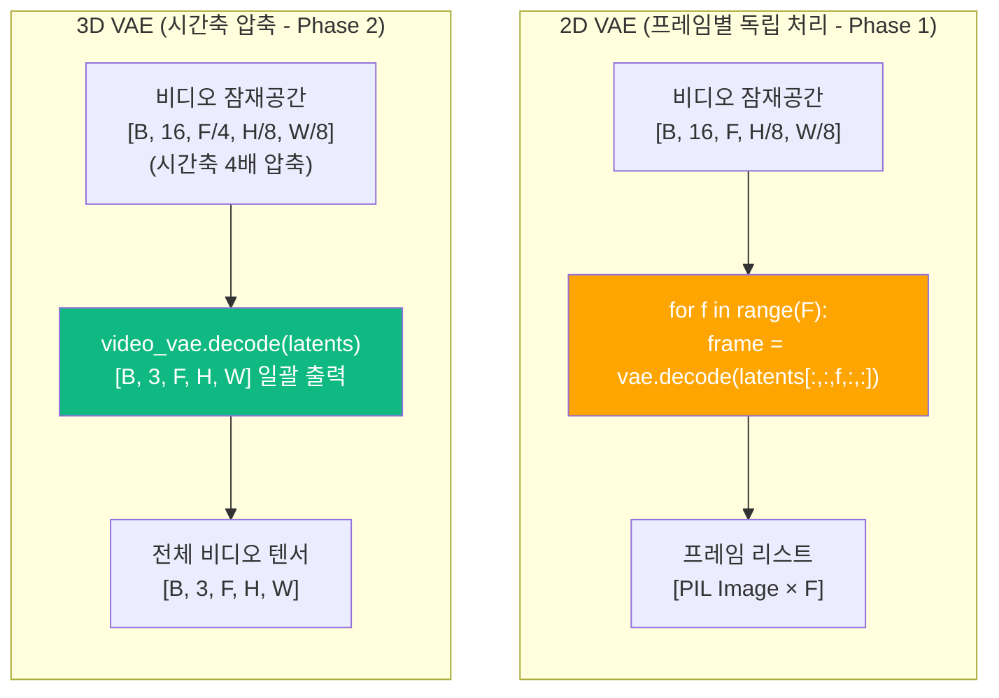

```python
# invokeai/backend/video/video_vae.py
"""
3D VAE 래퍼.
VideoX-Fun의 3D VAE를 InvokeAI의 모델 관리 시스템에 통합합니다.
시간축 압축 비율: 4x (16 프레임 → 4 잠재 프레임)
공간 압축 비율: 8x (512px → 64 잠재 픽셀)
"""
import torch
from typing import Optional


class VideoVAEWrapper:
    """3D VAE 래퍼 - VideoX-Fun CausalVAEModelWrapper 호환."""

    def __init__(self, vae_model, temporal_downsample: int = 4, spatial_downsample: int = 8):
        self._vae = vae_model
        self.temporal_downsample = temporal_downsample
        self.spatial_downsample = spatial_downsample

    def encode(self, video_tensor: torch.Tensor) -> torch.Tensor:
        """비디오 인코딩: [B, C, F, H, W] → [B, Z, F/4, H/8, W/8]"""
        with torch.inference_mode():
            latents = self._vae.encode(video_tensor).latent_dist.sample()
            # 스케일링 적용 (모델별 설정)
            scaling_factor = getattr(self._vae.config, "scaling_factor", 1.0)
            shift_factor = getattr(self._vae.config, "shift_factor", None)
            if shift_factor is not None:
                latents = latents - shift_factor
            latents = latents * scaling_factor
        return latents

    def decode(self, latents: torch.Tensor) -> torch.Tensor:
        """비디오 디코딩: [B, Z, F/4, H/8, W/8] → [B, C, F, H, W]"""
        with torch.inference_mode():
            scaling_factor = getattr(self._vae.config, "scaling_factor", 1.0)
            shift_factor = getattr(self._vae.config, "shift_factor", None)
            latents = latents / scaling_factor
            if shift_factor is not None:
                latents = latents + shift_factor
            video = self._vae.decode(latents, return_dict=False)[0]
        return video.clamp(-1, 1)

    def get_latent_shape(self, frames: int, height: int, width: int) -> tuple:
        """주어진 비디오 크기에 대한 잠재 공간 크기 계산."""
        return (
            16,  # Z-Image latent channels
            frames // self.temporal_downsample,
            height // self.spatial_downsample,
            width // self.spatial_downsample,
        )
```

---

## 9. 백엔드 핸즈온: 서비스 및 API 개발

### 9.1 비디오 스토리지 서비스

InvokeAI의 서비스 아키텍처 패턴(추상 베이스 + 구현)을 따라 비디오 스토리지를 구현합니다.

```python
# invokeai/app/services/video_files/video_files_base.py
"""비디오 파일 스토리지 인터페이스 (추상 베이스 클래스)."""
from abc import ABC, abstractmethod
from typing import Optional


class VideoFileStorageBase(ABC):
    """비디오 파일 저장/조회 인터페이스.
    DiskImageFileStorage / S3ImageFileStorage 패턴과 동일.
    """

    @abstractmethod
    def save(
        self,
        video_id: str,
        video_bytes: bytes,
        user_id: str,
        metadata: Optional[dict] = None,
    ) -> str:
        """비디오 파일 저장. 스토리지 키 반환."""
        ...

    @abstractmethod
    def get(self, video_id: str, user_id: str) -> bytes:
        """비디오 파일 조회."""
        ...

    @abstractmethod
    def get_url(self, video_id: str, user_id: str) -> str:
        """비디오 접근 URL 생성 (pre-signed URL 또는 CDN URL)."""
        ...

    @abstractmethod
    def get_thumbnail(self, video_id: str, user_id: str) -> bytes:
        """비디오 썸네일(첫 프레임) 조회."""
        ...

    @abstractmethod
    def delete(self, video_id: str, user_id: str) -> None:
        """비디오 삭제."""
        ...
```

```python
# invokeai/app/services/video_files/video_files_s3.py
"""S3 기반 비디오 파일 스토리지 구현."""
import io
import subprocess
import tempfile
from pathlib import Path
from typing import Optional

import boto3

from invokeai.app.services.video_files.video_files_base import VideoFileStorageBase


class S3VideoFileStorage(VideoFileStorageBase):
    """S3 + CloudFront 기반 비디오 스토리지.

    S3 버킷 구조:
        users/{user_id}/videos/{video_id}.mp4
        users/{user_id}/videos/thumbnails/{video_id}.webp
    """

    def __init__(self, bucket_name: str, cloudfront_domain: Optional[str] = None):
        self._s3 = boto3.client("s3")
        self._bucket = bucket_name
        self._cf_domain = cloudfront_domain

    def save(self, video_id: str, video_bytes: bytes, user_id: str, metadata: Optional[dict] = None) -> str:
        key = f"users/{user_id}/videos/{video_id}.mp4"
        self._s3.put_object(
            Bucket=self._bucket,
            Key=key,
            Body=video_bytes,
            ContentType="video/mp4",
            Metadata=metadata or {},
        )

        # 썸네일 자동 생성 (첫 프레임)
        self._generate_thumbnail(video_bytes, video_id, user_id)
        return key

    def get_url(self, video_id: str, user_id: str) -> str:
        key = f"users/{user_id}/videos/{video_id}.mp4"
        if self._cf_domain:
            return f"https://{self._cf_domain}/{key}"
        return self._s3.generate_presigned_url(
            "get_object",
            Params={"Bucket": self._bucket, "Key": key},
            ExpiresIn=3600,
        )

    def _generate_thumbnail(self, video_bytes: bytes, video_id: str, user_id: str) -> None:
        """ffmpeg로 첫 프레임을 추출하여 썸네일 생성."""
        with tempfile.NamedTemporaryFile(suffix=".mp4") as tmp_video:
            tmp_video.write(video_bytes)
            tmp_video.flush()

            thumb_path = Path(tempfile.mktemp(suffix=".webp"))
            subprocess.run([
                "ffmpeg", "-y",
                "-i", tmp_video.name,
                "-vframes", "1",
                "-vf", "scale=256:-1",
                str(thumb_path),
            ], check=True, capture_output=True)

            thumb_key = f"users/{user_id}/videos/thumbnails/{video_id}.webp"
            self._s3.put_object(
                Bucket=self._bucket,
                Key=thumb_key,
                Body=thumb_path.read_bytes(),
                ContentType="image/webp",
            )
            thumb_path.unlink(missing_ok=True)

    def get(self, video_id: str, user_id: str) -> bytes:
        key = f"users/{user_id}/videos/{video_id}.mp4"
        response = self._s3.get_object(Bucket=self._bucket, Key=key)
        return response["Body"].read()

    def get_thumbnail(self, video_id: str, user_id: str) -> bytes:
        key = f"users/{user_id}/videos/thumbnails/{video_id}.webp"
        response = self._s3.get_object(Bucket=self._bucket, Key=key)
        return response["Body"].read()

    def delete(self, video_id: str, user_id: str) -> None:
        self._s3.delete_object(Bucket=self._bucket, Key=f"users/{user_id}/videos/{video_id}.mp4")
        self._s3.delete_object(Bucket=self._bucket, Key=f"users/{user_id}/videos/thumbnails/{video_id}.webp")
```

### 9.2 비디오 API 라우터

**신규 파일:** `invokeai/app/api/routers/videos.py`

기존 `images.py` 라우터 패턴을 따르되, 비디오 전용 엔드포인트를 구현합니다.

```python
# invokeai/app/api/routers/videos.py
"""비디오 API 엔드포인트. 기존 images.py 라우터 패턴을 따름."""
from typing import Optional

from fastapi import APIRouter, Depends, HTTPException, Query
from pydantic import BaseModel, Field

from invokeai.app.api.dependencies import ApiDependencies


videos_router = APIRouter(prefix="/api/v1/videos", tags=["videos"])


# === Pydantic 모델 ===
class VideoGenerateRequest(BaseModel):
    """비디오 생성 요청."""
    prompt: str
    negative_prompt: Optional[str] = None
    model: str = Field(description="비디오 모델 ID")
    width: int = Field(default=512, ge=256, le=1280)
    height: int = Field(default=512, ge=256, le=720)
    num_frames: int = Field(default=16, ge=4, le=128)
    fps: int = Field(default=8, ge=1, le=60)
    steps: int = Field(default=8, ge=1, le=50)
    guidance_scale: float = Field(default=7.5, ge=1.0, le=20.0)
    seed: Optional[int] = None
    starting_image: Optional[str] = Field(default=None, description="시작 프레임 이미지 ID (img2vid)")


class VideoGenerateResponse(BaseModel):
    """비디오 생성 응답."""
    job_id: str
    estimated_credits: int
    estimated_seconds: float
    status: str = "queued"


class VideoDTO(BaseModel):
    """비디오 DTO."""
    video_id: str
    user_id: str
    video_url: str
    thumbnail_url: str
    width: int
    height: int
    num_frames: int
    fps: int
    duration_seconds: float
    model_used: str
    prompt: str
    credits_consumed: int
    created_at: str


# === 엔드포인트 ===
@videos_router.post("/generate", response_model=VideoGenerateResponse, status_code=202)
async def generate_video(
    request: VideoGenerateRequest,
    user: dict = Depends(get_current_user),
):
    """비디오 생성 작업을 큐에 등록합니다.

    1. 크레딧 예측 및 예약 (reserve → confirm 패턴)
    2. SQS 큐에 비디오 작업 등록
    3. 즉시 202 응답 (비동기 처리)
    """
    # 크레딧 예측
    estimated_credits = _estimate_video_credits(
        num_frames=request.num_frames,
        width=request.width,
        height=request.height,
        model=request.model,
    )

    # 크레딧 예약
    credit_service = ApiDependencies.invoker.services.credits
    reservation = await credit_service.reserve(
        user_id=user["id"],
        amount=estimated_credits,
        description=f"Video generation: {request.num_frames} frames",
    )

    # 큐에 작업 등록
    job_id = await _enqueue_video_job(request, user["id"], reservation.id)

    return VideoGenerateResponse(
        job_id=job_id,
        estimated_credits=estimated_credits,
        estimated_seconds=_estimate_generation_time(request),
    )


@videos_router.get("/{video_id}", response_model=VideoDTO)
async def get_video(video_id: str, user: dict = Depends(get_current_user)):
    """비디오 조회 (사용자 격리)."""
    video_service = ApiDependencies.invoker.services.videos
    video = await video_service.get(video_id=video_id, user_id=user["id"])
    if not video:
        raise HTTPException(status_code=404, detail="Video not found")
    return video


@videos_router.get("/", response_model=list[VideoDTO])
async def list_videos(
    user: dict = Depends(get_current_user),
    offset: int = Query(default=0, ge=0),
    limit: int = Query(default=20, ge=1, le=100),
):
    """사용자 비디오 목록 조회."""
    video_service = ApiDependencies.invoker.services.videos
    return await video_service.get_many(user_id=user["id"], offset=offset, limit=limit)


@videos_router.delete("/{video_id}", status_code=204)
async def delete_video(video_id: str, user: dict = Depends(get_current_user)):
    """비디오 삭제."""
    video_service = ApiDependencies.invoker.services.videos
    await video_service.delete(video_id=video_id, user_id=user["id"])


def _estimate_video_credits(num_frames: int, width: int, height: int, model: str) -> int:
    """비디오 크레딧 예측.
    1 credit = 1초 GPU 시간.
    비디오 생성 시간 = base_time × 프레임_수 × 해상도_배율 × 모델_배율
    """
    # 모델별 기준 시간 (1프레임당 초)
    MODEL_BASE_SECONDS = {
        "animatediff": 2.0,    # ~30초/16프레임
        "svd": 4.0,            # ~60초/16프레임
        "z-image-video": 6.0,  # ~90초/16프레임
        "hunyuan-video": 10.0, # ~160초/16프레임
    }

    base_time = MODEL_BASE_SECONDS.get(model, 4.0)
    resolution_factor = (width * height) / (512 * 512)
    total_seconds = base_time * num_frames * resolution_factor

    return max(1, int(total_seconds))  # 최소 1 크레딧


def _estimate_generation_time(request: VideoGenerateRequest) -> float:
    """예상 생성 시간(초) 반환."""
    return _estimate_video_credits(
        request.num_frames, request.width, request.height, request.model,
    ) * 1.2  # 약간의 오버헤드 포함
```

### 9.3 dependencies.py 서비스 등록

```python
# invokeai/app/api/dependencies.py - ApiDependencies.initialize() 에 추가
# 기존 패턴:
#   if config.deployment_mode == "saas":
#       image_files = S3ImageFileStorage(...)
#   else:
#       image_files = DiskImageFileStorage(...)

# 비디오 서비스 추가:
if config.deployment_mode == "saas":
    video_files = S3VideoFileStorage(
        bucket_name=config.s3_bucket_name,
        cloudfront_domain=config.cloudfront_domain,
    )
else:
    video_files = DiskVideoFileStorage(
        output_folder=f"{output_folder}/videos",
    )

# api_app.py에 라우터 등록:
from invokeai.app.api.routers.videos import videos_router
app.include_router(videos_router)
```

### 9.4 비디오 DB 테이블

```sql
-- 비디오 레코드 테이블 (Aurora PostgreSQL)
CREATE TABLE video_records (
    video_id VARCHAR(255) PRIMARY KEY,
    user_id UUID NOT NULL REFERENCES users(id),
    video_origin VARCHAR(50) NOT NULL DEFAULT 'generation',
    s3_key VARCHAR(512),
    s3_thumbnail_key VARCHAR(512),
    width INTEGER NOT NULL,
    height INTEGER NOT NULL,
    num_frames INTEGER NOT NULL,
    fps INTEGER NOT NULL,
    duration_seconds FLOAT NOT NULL,
    file_size_bytes BIGINT,
    model_used VARCHAR(255) NOT NULL,
    prompt TEXT,
    negative_prompt TEXT,
    generation_params JSONB,
    credits_consumed INTEGER NOT NULL DEFAULT 0,
    job_id VARCHAR(255),
    created_at TIMESTAMPTZ NOT NULL DEFAULT NOW(),
    updated_at TIMESTAMPTZ NOT NULL DEFAULT NOW()
);

CREATE INDEX idx_video_records_user_id ON video_records(user_id);
CREATE INDEX idx_video_records_created ON video_records(created_at);

-- RLS 활성화
ALTER TABLE video_records ENABLE ROW LEVEL SECURITY;
CREATE POLICY video_records_isolation ON video_records
  USING (user_id = current_setting('app.current_user_id')::uuid);
```

---

## 10. 프론트엔드 핸즈온: 비디오 UI 개발

### 10.1 비디오 생성 탭 구조

```
src/features/video/
├── components/
│   ├── VideoTab.tsx                 # 비디오 탭 메인 컴포넌트
│   ├── TextToVideoPanel.tsx         # Text-to-Video 파라미터 패널
│   ├── ImageToVideoPanel.tsx        # Image-to-Video 패널
│   ├── VideoParameterPanel.tsx      # 공통 비디오 파라미터 (프레임/FPS/해상도)
│   ├── VideoModelSelector.tsx       # 비디오 모델 선택 드롭다운
│   ├── VideoGenerateButton.tsx      # 생성 버튼 (크레딧 표시 포함)
│   ├── VideoProgressBar.tsx         # 프레임별 진행률 표시
│   ├── VideoPlayer.tsx              # 인라인 비디오 플레이어
│   ├── VideoGallery.tsx             # 비디오 갤러리 (썸네일 그리드)
│   └── VideoGalleryItem.tsx         # 갤러리 아이템 (썸네일 + 메타데이터)
├── store/
│   └── videoSlice.ts                # Redux 상태 관리
├── hooks/
│   ├── useVideoGeneration.ts        # 비디오 생성 훅
│   └── useVideoCredits.ts           # 비디오 크레딧 예측 훅
└── api/
    └── videoApi.ts                  # RTK Query API 엔드포인트
```

### 10.2 RTK Query API 엔드포인트

```typescript
// src/features/video/api/videoApi.ts
import { api } from 'services/api';

interface VideoGenerateRequest {
  prompt: string;
  negative_prompt?: string;
  model: string;
  width: number;
  height: number;
  num_frames: number;
  fps: number;
  steps: number;
  guidance_scale: number;
  seed?: number;
  starting_image?: string; // img2vid
}

interface VideoGenerateResponse {
  job_id: string;
  estimated_credits: number;
  estimated_seconds: number;
  status: string;
}

interface VideoDTO {
  video_id: string;
  video_url: string;
  thumbnail_url: string;
  width: number;
  height: number;
  num_frames: number;
  fps: number;
  duration_seconds: number;
  model_used: string;
  prompt: string;
  credits_consumed: number;
  created_at: string;
}

export const videoApi = api.injectEndpoints({
  endpoints: (build) => ({
    generateVideo: build.mutation<VideoGenerateResponse, VideoGenerateRequest>({
      query: (body) => ({
        url: '/api/v1/videos/generate',
        method: 'POST',
        body,
      }),
      invalidatesTags: ['CreditBalance'],
    }),

    listVideos: build.query<VideoDTO[], { offset?: number; limit?: number }>({
      query: ({ offset = 0, limit = 20 }) =>
        `/api/v1/videos?offset=${offset}&limit=${limit}`,
      providesTags: ['Videos'],
    }),

    getVideo: build.query<VideoDTO, string>({
      query: (videoId) => `/api/v1/videos/${videoId}`,
      providesTags: (result, error, id) => [{ type: 'Videos', id }],
    }),

    deleteVideo: build.mutation<void, string>({
      query: (videoId) => ({
        url: `/api/v1/videos/${videoId}`,
        method: 'DELETE',
      }),
      invalidatesTags: ['Videos'],
    }),
  }),
});

export const {
  useGenerateVideoMutation,
  useListVideosQuery,
  useGetVideoQuery,
  useDeleteVideoMutation,
} = videoApi;
```

### 10.3 Redux 상태 관리

```typescript
// src/features/video/store/videoSlice.ts
import { createSlice, PayloadAction } from '@reduxjs/toolkit';

interface VideoState {
  mode: 'text-to-video' | 'image-to-video';
  // 파라미터
  prompt: string;
  negativePrompt: string;
  model: string;
  width: number;
  height: number;
  numFrames: number;
  fps: number;
  steps: number;
  guidanceScale: number;
  seed: number;
  // img2vid
  startingImageId: string | null;
  noiseStrength: number;
  // 생성 상태
  isGenerating: boolean;
  currentJobId: string | null;
  progress: { currentFrame: number; totalFrames: number } | null;
  // 크레딧
  estimatedCredits: number;
}

const initialState: VideoState = {
  mode: 'text-to-video',
  prompt: '',
  negativePrompt: '',
  model: 'z-image-video',
  width: 512,
  height: 512,
  numFrames: 16,
  fps: 8,
  steps: 8,
  guidanceScale: 7.5,
  seed: 0,
  startingImageId: null,
  noiseStrength: 0.8,
  isGenerating: false,
  currentJobId: null,
  progress: null,
  estimatedCredits: 0,
};

export const videoSlice = createSlice({
  name: 'video',
  initialState,
  reducers: {
    setVideoMode: (state, action: PayloadAction<'text-to-video' | 'image-to-video'>) => {
      state.mode = action.payload;
    },
    setVideoPrompt: (state, action: PayloadAction<string>) => {
      state.prompt = action.payload;
    },
    setVideoModel: (state, action: PayloadAction<string>) => {
      state.model = action.payload;
    },
    setNumFrames: (state, action: PayloadAction<number>) => {
      state.numFrames = action.payload;
    },
    setVideoFps: (state, action: PayloadAction<number>) => {
      state.fps = action.payload;
    },
    setVideoResolution: (state, action: PayloadAction<{ width: number; height: number }>) => {
      state.width = action.payload.width;
      state.height = action.payload.height;
    },
    setStartingImage: (state, action: PayloadAction<string | null>) => {
      state.startingImageId = action.payload;
    },
    setVideoGenerating: (state, action: PayloadAction<{ jobId: string }>) => {
      state.isGenerating = true;
      state.currentJobId = action.payload.jobId;
      state.progress = { currentFrame: 0, totalFrames: state.numFrames };
    },
    updateVideoProgress: (state, action: PayloadAction<{ currentFrame: number }>) => {
      if (state.progress) {
        state.progress.currentFrame = action.payload.currentFrame;
      }
    },
    videoGenerationComplete: (state) => {
      state.isGenerating = false;
      state.currentJobId = null;
      state.progress = null;
    },
    setEstimatedCredits: (state, action: PayloadAction<number>) => {
      state.estimatedCredits = action.payload;
    },
  },
});
```

### 10.4 비디오 생성 버튼 컴포넌트

```typescript
// src/features/video/components/VideoGenerateButton.tsx
import { Button, Flex, Text, Tooltip } from '@chakra-ui/react';
import { useAppSelector, useAppDispatch } from 'app/store/storeHooks';
import { useGenerateVideoMutation } from '../api/videoApi';
import { useGetCreditBalanceQuery } from 'features/credits/api/creditsApi';

export const VideoGenerateButton = () => {
  const dispatch = useAppDispatch();
  const videoState = useAppSelector((s) => s.video);
  const { data: creditBalance } = useGetCreditBalanceQuery();
  const [generateVideo, { isLoading }] = useGenerateVideoMutation();

  const estimatedCredits = videoState.estimatedCredits;
  const hasEnoughCredits = (creditBalance?.remaining ?? 0) >= estimatedCredits;

  const handleGenerate = async () => {
    if (!hasEnoughCredits) return;

    const result = await generateVideo({
      prompt: videoState.prompt,
      negative_prompt: videoState.negativePrompt || undefined,
      model: videoState.model,
      width: videoState.width,
      height: videoState.height,
      num_frames: videoState.numFrames,
      fps: videoState.fps,
      steps: videoState.steps,
      guidance_scale: videoState.guidanceScale,
      seed: videoState.seed || undefined,
      starting_image: videoState.startingImageId || undefined,
    });

    if ('data' in result) {
      dispatch(videoSlice.actions.setVideoGenerating({ jobId: result.data.job_id }));
    }
  };

  return (
    <Tooltip
      label={!hasEnoughCredits ? '크레딧이 부족합니다. 업그레이드해주세요.' : ''}
      isDisabled={hasEnoughCredits}
    >
      <Flex direction="column" gap={1}>
        <Button
          variant="brand"
          size="lg"
          onClick={handleGenerate}
          isLoading={isLoading || videoState.isGenerating}
          isDisabled={!hasEnoughCredits || !videoState.prompt}
          loadingText={
            videoState.progress
              ? `프레임 ${videoState.progress.currentFrame}/${videoState.progress.totalFrames}`
              : '생성 중...'
          }
        >
          비디오 생성
        </Button>
        <Text fontSize="xs" color="text.secondary" textAlign="center">
          예상 {estimatedCredits} 크레딧 (≈ {estimatedCredits}초 GPU)
        </Text>
      </Flex>
    </Tooltip>
  );
};
```

### 10.5 비디오 플레이어 컴포넌트

```typescript
// src/features/video/components/VideoPlayer.tsx
import { Box, IconButton, Flex, Slider, SliderTrack, SliderFilledTrack, SliderThumb, Text } from '@chakra-ui/react';
import { useRef, useState, useCallback } from 'react';

interface VideoPlayerProps {
  videoUrl: string;
  width: number;
  height: number;
  fps: number;
  numFrames: number;
}

export const VideoPlayer = ({ videoUrl, width, height, fps, numFrames }: VideoPlayerProps) => {
  const videoRef = useRef<HTMLVideoElement>(null);
  const [isPlaying, setIsPlaying] = useState(false);
  const [currentTime, setCurrentTime] = useState(0);
  const duration = numFrames / fps;

  const togglePlay = useCallback(() => {
    if (!videoRef.current) return;
    if (isPlaying) {
      videoRef.current.pause();
    } else {
      videoRef.current.play();
    }
    setIsPlaying(!isPlaying);
  }, [isPlaying]);

  return (
    <Box borderRadius="lg" overflow="hidden" bg="surface.primary">
      <video
        ref={videoRef}
        src={videoUrl}
        width={width}
        height={height}
        loop
        onTimeUpdate={(e) => setCurrentTime(e.currentTarget.currentTime)}
        style={{ maxWidth: '100%', display: 'block' }}
      />
      <Flex p={2} gap={2} align="center">
        <IconButton
          aria-label={isPlaying ? 'Pause' : 'Play'}
          icon={isPlaying ? <PauseIcon /> : <PlayIcon />}
          size="sm"
          onClick={togglePlay}
        />
        <Slider
          value={currentTime}
          min={0}
          max={duration}
          step={0.01}
          onChange={(val) => {
            if (videoRef.current) videoRef.current.currentTime = val;
          }}
          flex={1}
        >
          <SliderTrack><SliderFilledTrack /></SliderTrack>
          <SliderThumb />
        </Slider>
        <Text fontSize="xs" color="text.secondary" minW="60px">
          {currentTime.toFixed(1)}s / {duration.toFixed(1)}s
        </Text>
      </Flex>
    </Box>
  );
};
```

### 10.6 Socket.IO 비디오 진행률 리스너

```typescript
// src/features/video/hooks/useVideoGeneration.ts
import { useEffect } from 'react';
import { useAppDispatch, useAppSelector } from 'app/store/storeHooks';
import { videoSlice } from '../store/videoSlice';

/**
 * Socket.IO를 통해 GPU 워커의 비디오 생성 진행률을 수신합니다.
 * 기존 이미지 생성의 Socket.IO 이벤트 패턴과 동일:
 * - invocation_progress → 비디오는 frame_progress 이벤트 추가
 */
export const useVideoGeneration = (socket: any) => {
  const dispatch = useAppDispatch();
  const currentJobId = useAppSelector((s) => s.video.currentJobId);

  useEffect(() => {
    if (!socket || !currentJobId) return;

    // 프레임별 진행률 이벤트
    const handleFrameProgress = (data: {
      job_id: string;
      current_frame: number;
      total_frames: number;
      current_step: number;
      total_steps: number;
    }) => {
      if (data.job_id !== currentJobId) return;
      dispatch(videoSlice.actions.updateVideoProgress({
        currentFrame: data.current_frame,
      }));
    };

    // 비디오 생성 완료 이벤트
    const handleVideoComplete = (data: {
      job_id: string;
      video_id: string;
      video_url: string;
      credits_consumed: number;
    }) => {
      if (data.job_id !== currentJobId) return;
      dispatch(videoSlice.actions.videoGenerationComplete());
      // 비디오 갤러리 및 크레딧 잔액 새로고침
      dispatch(videoApi.util.invalidateTags(['Videos']));
      dispatch(creditsApi.util.invalidateTags(['CreditBalance']));
    };

    socket.on('video_frame_progress', handleFrameProgress);
    socket.on('video_generation_complete', handleVideoComplete);

    return () => {
      socket.off('video_frame_progress', handleFrameProgress);
      socket.off('video_generation_complete', handleVideoComplete);
    };
  }, [socket, currentJobId, dispatch]);
};
```

---

## 11. SaaS 통합: 크레딧 및 플랜 연동

### 11.1 비디오 크레딧 시스템 통합

비디오 생성도 이미지와 동일한 **reserve → confirm** 크레딧 패턴을 사용합니다 (05_SUBSCRIPTION_BILLING_SYSTEM.md 참조).

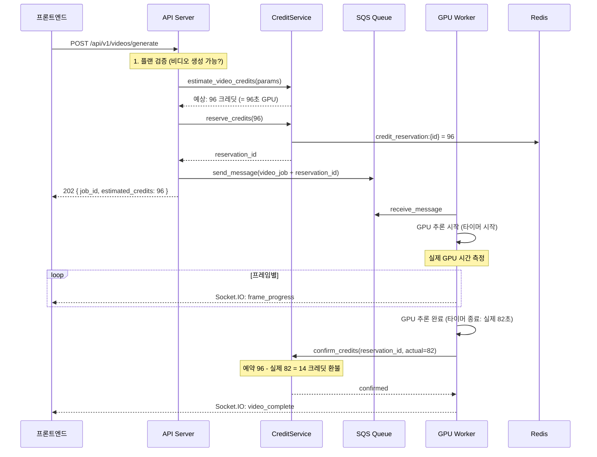

### 11.2 플랜별 비디오 기능 게이팅

```python
# invokeai/app/services/video/video_plan_validator.py
"""플랜별 비디오 생성 제한을 검증합니다."""
from dataclasses import dataclass


@dataclass
class VideoPlanLimits:
    """플랜별 비디오 제한 설정."""
    can_generate_video: bool
    max_frames: int
    max_width: int
    max_height: int
    allowed_models: list[str]
    max_concurrent_jobs: int


# 플랜별 비디오 제한 (doc 05 플랜 설계와 일치)
VIDEO_PLAN_LIMITS: dict[str, VideoPlanLimits] = {
    "trial": VideoPlanLimits(
        can_generate_video=False, max_frames=0, max_width=0, max_height=0,
        allowed_models=[], max_concurrent_jobs=0,
    ),
    "starter": VideoPlanLimits(
        can_generate_video=True, max_frames=16, max_width=512, max_height=512,
        allowed_models=["animatediff"], max_concurrent_jobs=1,
    ),
    "pro": VideoPlanLimits(
        can_generate_video=True, max_frames=48, max_width=1280, max_height=720,
        allowed_models=["animatediff", "svd", "z-image-video"], max_concurrent_jobs=1,
    ),
    "studio": VideoPlanLimits(
        can_generate_video=True, max_frames=48, max_width=1280, max_height=720,
        allowed_models=["animatediff", "svd", "z-image-video"], max_concurrent_jobs=3,
    ),
    "enterprise": VideoPlanLimits(
        can_generate_video=True, max_frames=128, max_width=1920, max_height=1080,
        allowed_models=["animatediff", "svd", "z-image-video", "hunyuan-video"],
        max_concurrent_jobs=10,
    ),
    "tester": VideoPlanLimits(
        can_generate_video=True, max_frames=48, max_width=1280, max_height=720,
        allowed_models=["animatediff", "svd", "z-image-video"], max_concurrent_jobs=1,
    ),
}


def validate_video_request(plan_slug: str, num_frames: int, width: int, height: int, model: str) -> None:
    """플랜별 비디오 생성 제한을 검증합니다. 위반 시 HTTPException."""
    from fastapi import HTTPException

    limits = VIDEO_PLAN_LIMITS.get(plan_slug)
    if not limits or not limits.can_generate_video:
        raise HTTPException(status_code=403, detail="현재 플랜에서는 비디오 생성이 불가합니다.")
    if num_frames > limits.max_frames:
        raise HTTPException(status_code=400, detail=f"최대 프레임 수 초과: {limits.max_frames}프레임까지 가능")
    if width > limits.max_width or height > limits.max_height:
        raise HTTPException(status_code=400, detail=f"최대 해상도 초과: {limits.max_width}x{limits.max_height}까지 가능")
    if model not in limits.allowed_models:
        raise HTTPException(status_code=403, detail=f"현재 플랜에서 사용 불가한 모델: {model}")
```

### 11.3 GPU 워커 비디오 크레딧 실시간 측정

```python
# invokeai/worker/video_credit_tracker.py
"""GPU 워커에서 비디오 생성 시 실제 GPU 시간을 측정합니다.
1 credit = 1초 GPU 시간."""
import time


class VideoCreditTracker:
    """비디오 생성 GPU 시간 추적기.

    사용법:
        tracker = VideoCreditTracker(reservation_id="res_xxx")
        tracker.start()
        # ... GPU 작업 ...
        tracker.stop()
        actual_credits = tracker.get_credits_used()
        credit_service.confirm(reservation_id, actual=actual_credits)
    """

    def __init__(self, reservation_id: str):
        self.reservation_id = reservation_id
        self._start_time: float = 0
        self._end_time: float = 0

    def start(self) -> None:
        """GPU 작업 시작 시점 기록."""
        self._start_time = time.monotonic()

    def stop(self) -> None:
        """GPU 작업 종료 시점 기록."""
        self._end_time = time.monotonic()

    def get_credits_used(self) -> int:
        """실제 사용 크레딧 반환 (= 초 단위 올림)."""
        import math
        elapsed = self._end_time - self._start_time
        return max(1, math.ceil(elapsed))

    def get_elapsed_seconds(self) -> float:
        """경과 시간(초) 반환."""
        if self._end_time == 0:
            return time.monotonic() - self._start_time
        return self._end_time - self._start_time
```

---

## 12. 테스트 및 품질 보증

### 12.1 테스트 전략

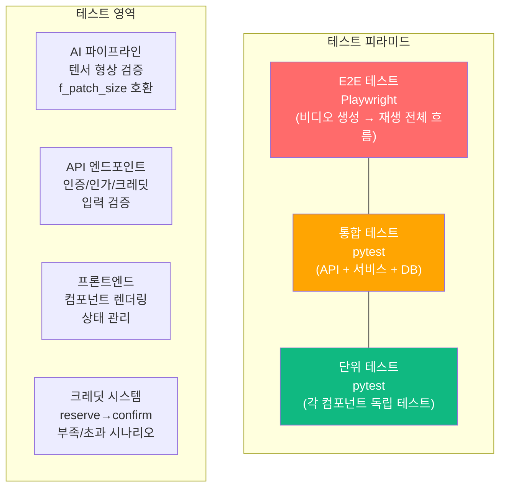

### 12.2 AI 파이프라인 단위 테스트

```python
# tests/backend/z_image/test_video_denoise.py
"""비디오 디노이즈 텐서 형상 및 f_patch_size 검증 테스트."""
import pytest
import torch


class TestVideoTensorShapes:
    """비디오 잠재 공간 텐서 형상 검증."""

    def test_video_latent_shape(self):
        """비디오 잠재 공간은 [B, C, F, H, W] 5D 텐서여야 함."""
        B, C, F, H, W = 1, 16, 16, 64, 64
        latents = torch.randn(B, C, F, H, W)
        assert latents.dim() == 5
        assert latents.shape == (1, 16, 16, 64, 64)

    def test_frame_divisible_by_f_patch_size(self):
        """프레임 수는 f_patch_size의 배수여야 함."""
        for f_patch_size in [1, 2, 4]:
            for num_frames in [4, 8, 16, 32, 48]:
                if num_frames % f_patch_size == 0:
                    # 유효한 조합
                    F_tokens = num_frames // f_patch_size
                    assert F_tokens > 0
                else:
                    # 무효한 조합 - 검증에서 거부되어야 함
                    with pytest.raises(AssertionError):
                        assert num_frames % f_patch_size == 0

    def test_no_unsqueeze_for_video(self):
        """비디오 모드에서는 unsqueeze(2)를 사용하지 않아야 함."""
        # 이미지 모드: [B, C, H, W] → unsqueeze(2) → [B, C, 1, H, W]
        image_latent = torch.randn(1, 16, 64, 64)
        image_5d = image_latent.unsqueeze(2)
        assert image_5d.shape == (1, 16, 1, 64, 64)

        # 비디오 모드: [B, C, F, H, W] 직접 사용 (unsqueeze 불필요)
        video_latent = torch.randn(1, 16, 16, 64, 64)
        assert video_latent.dim() == 5  # 이미 5D
        # unsqueeze(2) 하면 6D가 되므로 잘못됨
        assert video_latent.unsqueeze(2).dim() == 6  # 이것은 비디오에서 하면 안됨


class TestPatchifyVideoFrames:
    """프레임 패치화 검증."""

    def test_patchify_dimensions(self):
        """패치화 후 올바른 토큰 수가 생성되어야 함."""
        C, F, H, W = 16, 16, 64, 64
        patch_size = 2
        f_patch_size = 2

        F_tokens = F // f_patch_size    # 8
        H_tokens = H // patch_size      # 32
        W_tokens = W // patch_size      # 32

        total_tokens = F_tokens * H_tokens * W_tokens  # 8192
        patch_features = f_patch_size * patch_size * patch_size * C  # 2*2*2*16 = 128

        assert total_tokens == 8192
        assert patch_features == 128


class TestVideoCreditEstimation:
    """비디오 크레딧 예측 검증."""

    def test_credit_estimation_proportional_to_frames(self):
        """크레딧은 프레임 수에 비례해야 함."""
        from invokeai.app.api.routers.videos import _estimate_video_credits

        credits_16 = _estimate_video_credits(16, 512, 512, "animatediff")
        credits_32 = _estimate_video_credits(32, 512, 512, "animatediff")
        assert credits_32 == credits_16 * 2

    def test_credit_minimum_one(self):
        """최소 크레딧은 1이어야 함."""
        from invokeai.app.api.routers.videos import _estimate_video_credits

        credits = _estimate_video_credits(4, 256, 256, "animatediff")
        assert credits >= 1
```

### 12.3 API 통합 테스트

```python
# tests/api/test_video_api.py
"""비디오 API 엔드포인트 통합 테스트."""
import pytest
from httpx import AsyncClient


class TestVideoAPI:
    """비디오 생성 API 테스트."""

    @pytest.mark.asyncio
    async def test_generate_video_requires_auth(self, client: AsyncClient):
        """인증 없이 비디오 생성 요청 시 401."""
        response = await client.post("/api/v1/videos/generate", json={
            "prompt": "test", "model": "animatediff",
            "width": 512, "height": 512, "num_frames": 16, "fps": 8, "steps": 8,
            "guidance_scale": 7.5,
        })
        assert response.status_code == 401

    @pytest.mark.asyncio
    async def test_generate_video_checks_plan(self, auth_client: AsyncClient, trial_user):
        """Trial 플랜 사용자는 비디오 생성 불가 (403)."""
        response = await auth_client.post("/api/v1/videos/generate", json={
            "prompt": "test", "model": "animatediff",
            "width": 512, "height": 512, "num_frames": 16, "fps": 8, "steps": 8,
            "guidance_scale": 7.5,
        })
        assert response.status_code == 403

    @pytest.mark.asyncio
    async def test_generate_video_checks_credits(self, auth_client: AsyncClient, starter_user_no_credits):
        """크레딧 부족 시 402."""
        response = await auth_client.post("/api/v1/videos/generate", json={
            "prompt": "test", "model": "animatediff",
            "width": 512, "height": 512, "num_frames": 16, "fps": 8, "steps": 8,
            "guidance_scale": 7.5,
        })
        assert response.status_code == 402

    @pytest.mark.asyncio
    async def test_generate_video_exceeds_frame_limit(self, auth_client: AsyncClient, starter_user):
        """Starter 플랜은 최대 16프레임. 48프레임 요청 시 400."""
        response = await auth_client.post("/api/v1/videos/generate", json={
            "prompt": "test", "model": "animatediff",
            "width": 512, "height": 512, "num_frames": 48, "fps": 8, "steps": 8,
            "guidance_scale": 7.5,
        })
        assert response.status_code == 400

    @pytest.mark.asyncio
    async def test_generate_video_success(self, auth_client: AsyncClient, pro_user):
        """Pro 플랜에서 정상 비디오 생성 요청 → 202 Accepted."""
        response = await auth_client.post("/api/v1/videos/generate", json={
            "prompt": "A cat running in a meadow",
            "model": "z-image-video",
            "width": 512, "height": 512, "num_frames": 16, "fps": 8, "steps": 8,
            "guidance_scale": 7.5,
        })
        assert response.status_code == 202
        data = response.json()
        assert "job_id" in data
        assert data["estimated_credits"] > 0

    @pytest.mark.asyncio
    async def test_list_videos_isolation(self, auth_client_a, auth_client_b):
        """사용자 A의 비디오가 사용자 B에게 보이지 않아야 함 (멀티테넌시)."""
        videos_a = (await auth_client_a.get("/api/v1/videos")).json()
        videos_b = (await auth_client_b.get("/api/v1/videos")).json()
        ids_a = {v["video_id"] for v in videos_a}
        ids_b = {v["video_id"] for v in videos_b}
        assert ids_a.isdisjoint(ids_b)  # 겹치는 ID 없어야 함
```

---

> **참고:** 이 문서는 InvokeAI v6.11.1.post1 코드베이스 분석을 기반으로 작성되었습니다. Z-Image 모듈의 VideoX-Fun 아키텍처 기반은 비디오 생성 재구현의 가장 유력한 경로이며, `f_patch_size` 파라미터화만으로도 기본적인 비디오 생성이 가능할 수 있습니다. 그러나 비디오 품질을 위해서는 비디오 전용으로 학습된 모델 가중치가 필수적입니다. 섹션 8~12의 핸즈온 코드는 실제 구현 시 기존 코드베이스의 정확한 import 경로와 서비스 구조에 맞게 조정이 필요합니다.
