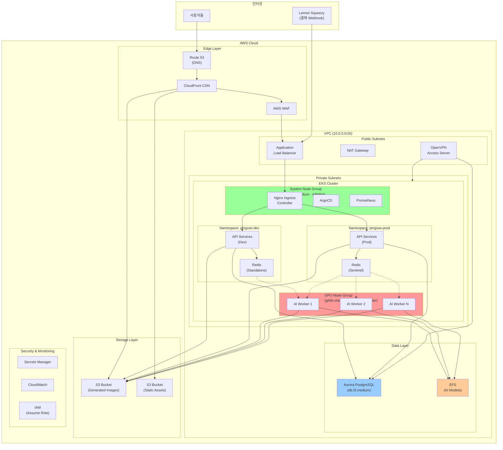

# AWS 전체 아키텍처 설계

## 개요

Pingvas Studio의 AWS 인프라는 비용 효율성과 성능을 동시에 달성하기 위해 설계되었습니다. EKS를 기반으로 하며, Karpenter를 통한 동적 노드 프로비저닝으로 GPU 리소스를 최적화합니다.

---

## 아키텍처 다이어그램 (Mermaid)



---

## 계층별 상세 설명

### 1. Edge Layer (엣지 계층)

| 서비스 | 용도 | 설정 |
|--------|------|------|
| **Route 53** | DNS 관리 | `studio.pingvas.com` 도메인 |
| **CloudFront** | CDN, 정적 자산 배포 | S3 오리진, 캐싱 정책 |
| **WAF** | 디도스 방어, 악성 요청 차단 | Rate Limiting, SQL Injection 방어 |

**CloudFront 배포 설정**:
- 오리진 1: ALB (API 요청)
- 오리진 2: S3 (정적 자산, 생성된 이미지)
- 캐시 동작: `/api/*` → ALB, `/*` → S3

### 2. Network Layer (네트워크 계층)

#### VPC 설계
```
VPC CIDR: 10.0.0.0/16

Public Subnets:
├── 10.0.1.0/24 (ap-northeast-2a) - ALB, NAT, OpenVPN
├── 10.0.2.0/24 (ap-northeast-2b) - ALB (Multi-AZ)
└── 10.0.3.0/24 (ap-northeast-2c) - ALB (Multi-AZ)

Private Subnets:
├── 10.0.11.0/24 (ap-northeast-2a) - EKS 노드
├── 10.0.12.0/24 (ap-northeast-2b) - EKS 노드
├── 10.0.13.0/24 (ap-northeast-2c) - EKS 노드
├── 10.0.21.0/24 (ap-northeast-2a) - Aurora Primary
├── 10.0.22.0/24 (ap-northeast-2b) - Aurora Replica
└── 10.0.23.0/24 (ap-northeast-2c) - Aurora Replica
```

#### OpenVPN Access Server
- **위치**: Public Subnet
- **용도**: 개발자 VPN 접근
- **허용 IP**: 화이트리스트 기반
- **인증**: IAM 기반 (MFA 필수)

### 3. Compute Layer (컴퓨팅 계층)

#### EKS 클러스터 구성

| 노드 그룹 | 인스턴스 타입 | 용도 | 스케일링 |
|-----------|--------------|------|----------|
| **System** | t4g.medium (ARM64) | API, ArgoCD, 모니터링 | 2-5 노드 |
| **GPU** | g4dn.xlarge (Spot) | AI 추론 | 0-10 노드 (Karpenter) |

#### Karpenter 설정
```yaml
apiVersion: karpenter.sh/v1
kind: NodePool
metadata:
  name: gpu-workers
spec:
  template:
    spec:
      requirements:
        - key: "node.kubernetes.io/instance-type"
          operator: In
          values: ["g4dn.xlarge", "g4dn.2xlarge", "g5.xlarge"]
        - key: "karpenter.sh/capacity-type"
          operator: In
          values: ["spot"]
        - key: "nvidia.com/gpu"
          operator: Exists
      nodeClassRef:
        group: karpenter.k8s.aws
        kind: EC2NodeClass
        name: gpu-nodeclass
  limits:
    cpu: 100
    memory: 400Gi
    nvidia.com/gpu: 20
  disruption:
    consolidationPolicy: WhenEmptyOrUnderutilized
    consolidateAfter: 30s
```

#### Spot Termination Handler
- AWS Node Termination Handler DaemonSet 배포
- 2분 전 경고 수신 시 파드 안전 대피 (Drain)

### 4. Application Layer (애플리케이션 계층)

#### 네임스페이스 구조
```
EKS Cluster
├── kube-system           # 시스템 컴포넌트
├── argocd                # ArgoCD
├── monitoring            # Prometheus, Grafana
├── ingress-nginx         # Nginx Ingress Controller
├── pingvas-dev           # 개발 환경
│   ├── user-service
│   ├── generation-service
│   ├── payment-service
│   ├── gallery-service
│   ├── ai-worker
│   └── redis-standalone
└── pingvas-prod          # 운영 환경
    ├── user-service
    ├── generation-service
    ├── payment-service
    ├── gallery-service
    ├── ai-worker
    └── redis-sentinel
```

#### 마이크로서비스 구성

| 서비스 | 역할 | 리소스 |
|--------|------|--------|
| **user-service** | 인증, 사용자 관리 | 0.5 CPU, 512Mi |
| **generation-service** | 생성 요청 처리, 큐 관리 | 1 CPU, 1Gi |
| **payment-service** | Lemon Squeezy 웹훅 처리 | 0.5 CPU, 512Mi |
| **gallery-service** | 이미지/메타데이터 관리 | 0.5 CPU, 512Mi |
| **ai-worker** | GPU 이미지 생성 | 4 CPU, 16Gi, 1 GPU |

### 5. Data Layer (데이터 계층)

#### Aurora PostgreSQL

| 항목 | 설정 |
|------|------|
| **엔진 버전** | PostgreSQL 17.4 호환 |
| **인스턴스** | db.t3.medium (시작) |
| **Multi-AZ** | 활성화 (Prod) |
| **스토리지** | 자동 확장 (10GB ~ 1TB) |
| **백업** | 자동 백업 7일 |

**스키마 분리 전략**:
```sql
-- 공유 데이터베이스, 스키마로 환경 분리
CREATE SCHEMA pingvas_dev;
CREATE SCHEMA pingvas_prod;

-- 개발 환경 테이블
CREATE TABLE pingvas_dev.users (...);
CREATE TABLE pingvas_dev.subscriptions (...);

-- 운영 환경 테이블
CREATE TABLE pingvas_prod.users (...);
CREATE TABLE pingvas_prod.subscriptions (...);
```

#### ElastiCache Redis

| 환경 | 구성 | 노드 타입 |
|------|------|----------|
| **Dev** | Standalone | cache.t3.micro |
| **Prod** | Sentinel (3 노드) | cache.r6g.large |

**Redis 용도**:
- 세션 저장
- API 응답 캐싱
- 작업 큐 (Celery/RQ)
- 실시간 이벤트 Pub/Sub

#### EFS (Elastic File System)

| 용도 | 경로 | 설정 |
|------|------|------|
| **AI 모델** | `/models` | Performance Mode: General |
| **공유 파일** | `/shared` | Throughput Mode: Elastic |

**액세스 포인트**:
```
/models/stable-diffusion/
/models/sdxl/
/models/flux/
/models/controlnet/
/models/lora/
/shared/workflows/
/shared/styles/
```

### 6. Storage Layer (스토리지 계층)

#### S3 버킷 구성

| 버킷 | 용도 | 수명 주기 |
|------|------|----------|
| `pingvas-images-{env}` | 생성된 이미지 | 90일 후 Glacier |
| `pingvas-assets` | 정적 자산 (JS, CSS) | 영구 보관 |
| `pingvas-backups` | DB 백업 | 30일 보관 |

**버킷 정책**:
- CloudFront OAI를 통한 접근만 허용
- 서버 측 암호화 (SSE-S3)
- 버전 관리 활성화

### 7. Security & Monitoring (보안 및 모니터링)

#### IAM 구성

**역할 구조**:
```
Account Owner (결제/관리)
    └── DevOps-AssumeRole
        ├── Developer-A
        └── Developer-B

Trust Policy:
{
  "Effect": "Allow",
  "Principal": {
    "AWS": "arn:aws:iam::ACCOUNT_ID:user/Developer-A"
  },
  "Action": "sts:AssumeRole",
  "Condition": {
    "IpAddress": {
      "aws:SourceIp": ["OpenVPN-IP/32"]
    }
  }
}
```

#### Secrets Manager

| 시크릿 | 용도 |
|--------|------|
| `pingvas/db-credentials` | Aurora 접속 정보 |
| `pingvas/redis-auth` | Redis AUTH 토큰 |
| `pingvas/lemon-squeezy` | API 키, Webhook 시크릿 |
| `pingvas/jwt-secret` | JWT 서명 키 |
| `pingvas/oauth-credentials` | Google/Discord OAuth |

#### CloudWatch 대시보드

**메트릭**:
- EKS 노드 CPU/메모리 사용률
- GPU 사용률 (NVIDIA DCGM)
- API 응답 시간 (P50, P95, P99)
- 큐 대기 시간
- 에러율

**알람**:
- CPU > 80% (5분 지속)
- Memory > 85% (5분 지속)
- API 에러율 > 1% (1분 지속)
- 큐 대기 시간 > 60초

---

## 비용 최적화 전략

### 1. GPU 노드 최적화
- **Spot 인스턴스**: 최대 90% 비용 절감
- **Scale-to-Zero**: 유휴 시간에 GPU 노드 0개 유지
- **Karpenter**: 워크로드에 최적화된 인스턴스 자동 선택

### 2. 컴퓨팅 최적화
- **Graviton3 (ARM64)**: x86 대비 20% 저렴
- **Savings Plans**: 예측 가능한 워크로드에 적용

### 3. 스토리지 최적화
- **S3 Intelligent-Tiering**: 접근 패턴에 따른 자동 티어링
- **EFS Infrequent Access**: 자주 사용하지 않는 모델 자동 이동

### 4. 네트워크 최적화
- **CloudFront**: 데이터 전송 비용 절감
- **VPC Endpoints**: S3/DynamoDB 트래픽 비용 절감

### 예상 월 비용 (초기)

| 서비스 | 예상 비용 |
|--------|----------|
| EKS Control Plane | $73 |
| EC2 (System Nodes) | $100 |
| EC2 (GPU Nodes - Spot) | $200 (가변) |
| Aurora PostgreSQL | $50 |
| ElastiCache Redis | $30 |
| EFS | $50 |
| S3 | $20 |
| CloudFront | $50 |
| NAT Gateway | $45 |
| Route 53 | $1 |
| **합계** | **~$620/월** |

*실제 비용은 사용량에 따라 변동됩니다.*

---

## 재해 복구 (DR) 전략

### RTO/RPO 목표
- **RTO** (Recovery Time Objective): 4시간
- **RPO** (Recovery Point Objective): 1시간

### 백업 전략
1. **Aurora**: 자동 백업 + 수동 스냅샷
2. **EFS**: AWS Backup 사용
3. **S3**: Cross-Region Replication (선택)
4. **EKS**: Velero로 클러스터 상태 백업

### 복구 절차
1. Terraform으로 인프라 재생성
2. Aurora 스냅샷 복원
3. EFS 백업 복원
4. ArgoCD로 애플리케이션 자동 배포

---

## 다이어그램 파일

상세 다이어그램은 다음 파일에서 확인할 수 있습니다:
- Mermaid: `../diagrams/aws-architecture.mmd`
- Draw.io: `../diagrams/aws-architecture.drawio`
- SVG: `../diagrams/aws-architecture.svg`

---

## 다음 단계

1. [Terraform IaC 가이드](../infrastructure/01-terraform-guide.md)를 따라 인프라를 구축합니다.
2. [마이크로서비스 설계](./02-microservices.md)를 확인합니다.
3. [데이터 흐름 설계](./03-data-flow.md)를 확인합니다.
