# 데이터 흐름 및 시퀀스 다이어그램

## 개요

이 문서는 Pingvas Studio의 주요 사용자 시나리오에 대한 데이터 흐름과 시퀀스 다이어그램을 제공합니다.

---

## 1. 사용자 인증 흐름

### 1.1 이메일 회원가입/로그인

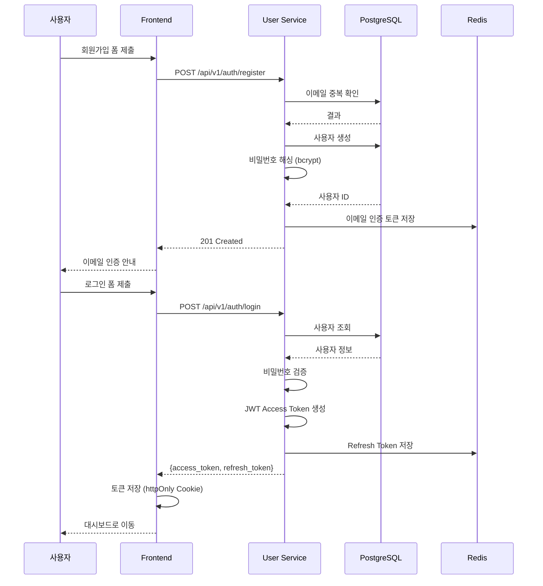

### 1.2 Google/Discord OAuth 로그인

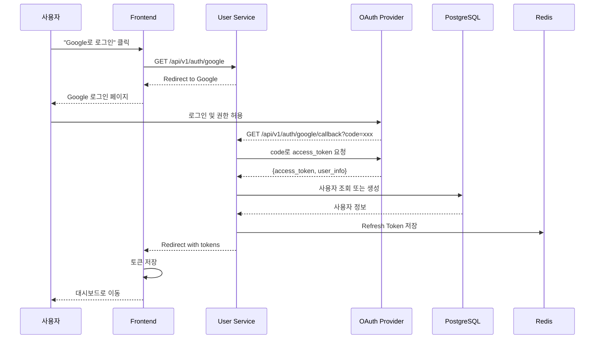

---

## 2. 이미지 생성 흐름

### 2.1 전체 생성 흐름

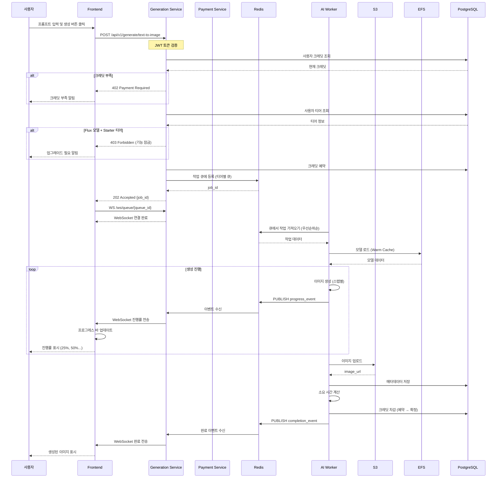

### 2.2 크레딧 차감 상세

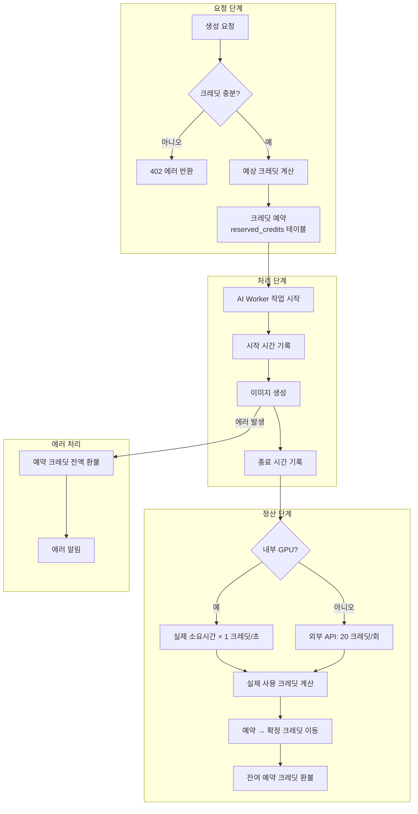

---

## 3. 결제/구독 흐름

### 3.1 신규 구독

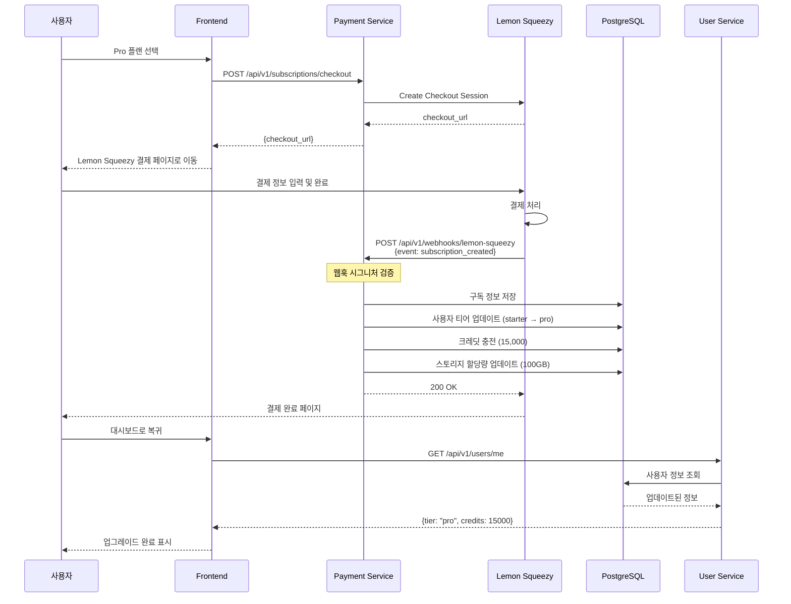

### 3.2 구독 업그레이드

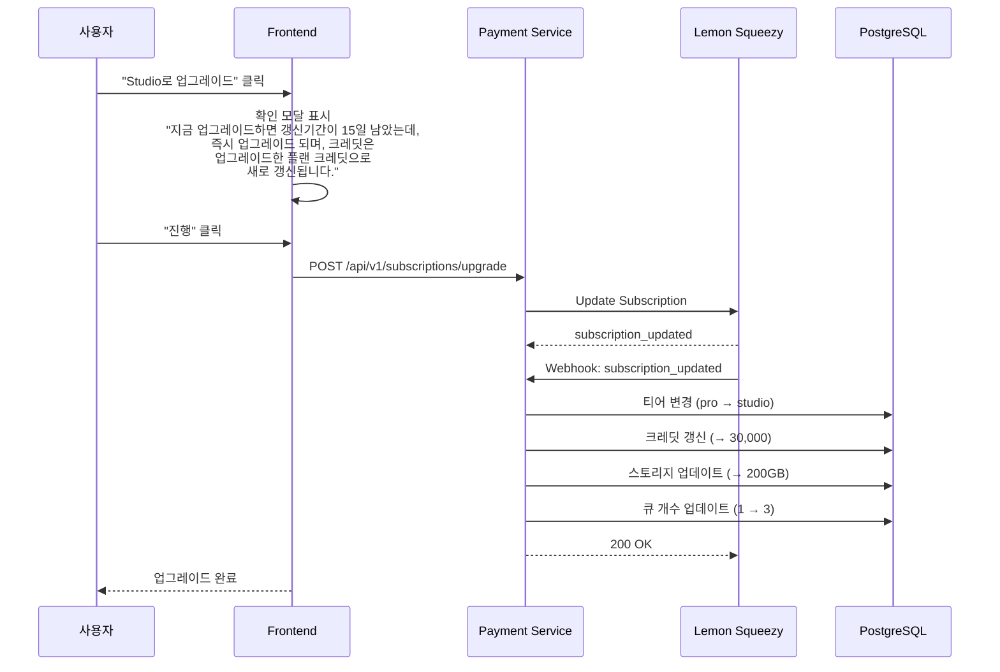

### 3.3 구독 취소 및 만료

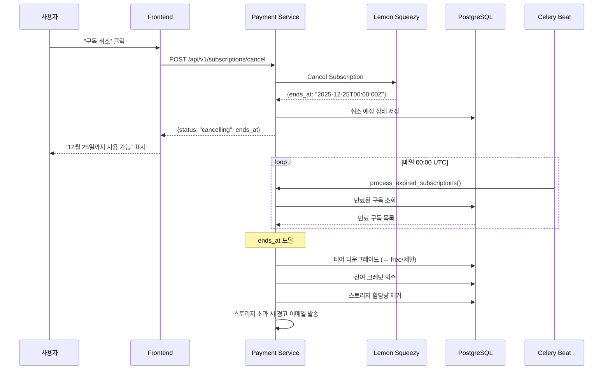

---

## 4. 티어별 기능 제한 흐름

### 4.1 Feature Flag 검증

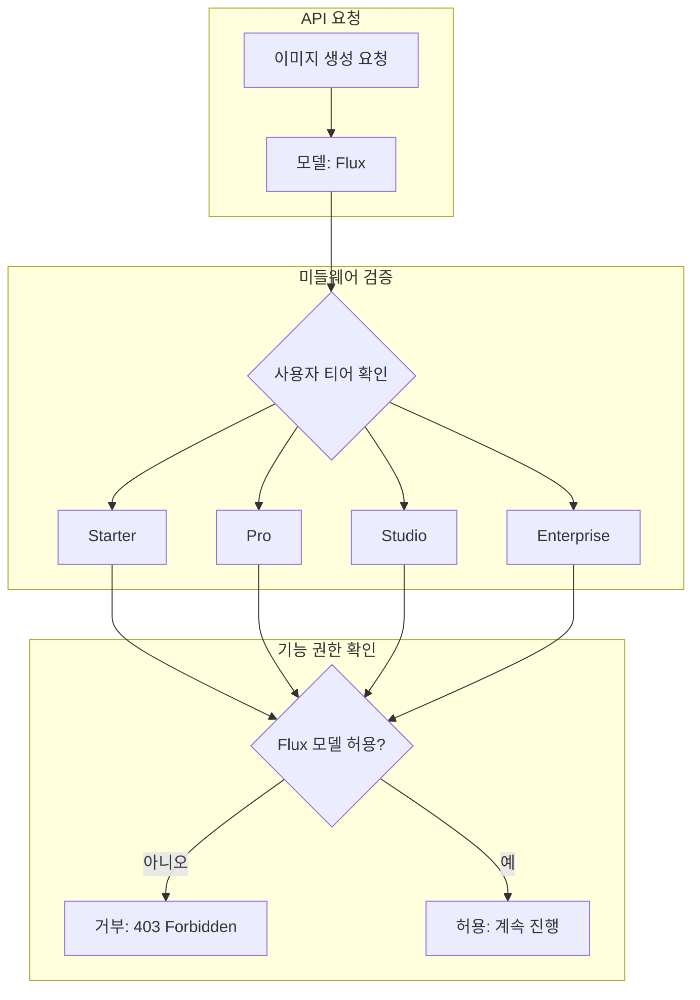

### 4.2 큐 우선순위 처리

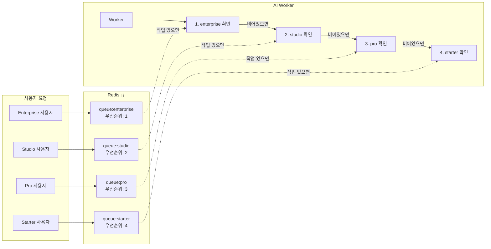

---

## 5. WebSocket 실시간 통신 흐름

### 5.1 연결 및 구독

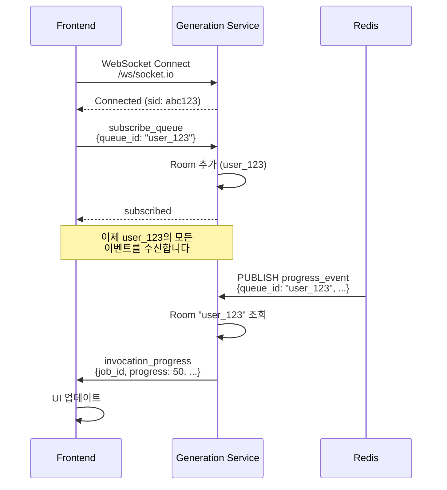

### 5.2 이벤트 타입

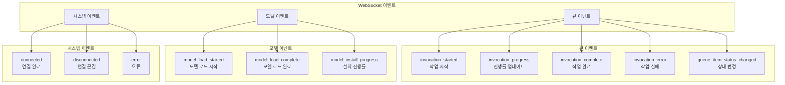

---

## 6. 논리적 데이터 흐름

### 6.1 전체 시스템 데이터 흐름

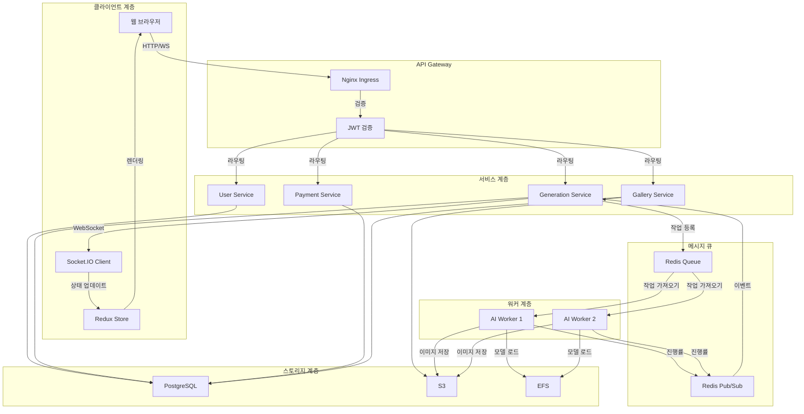

### 6.2 데이터 저장 위치

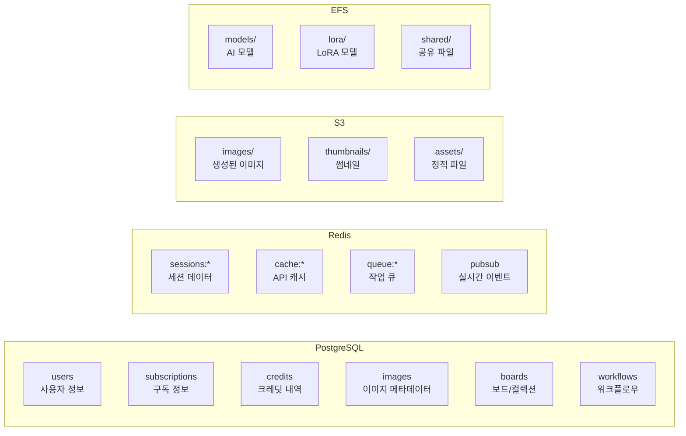

---

## 7. 에러 처리 흐름

### 7.1 API 에러 처리

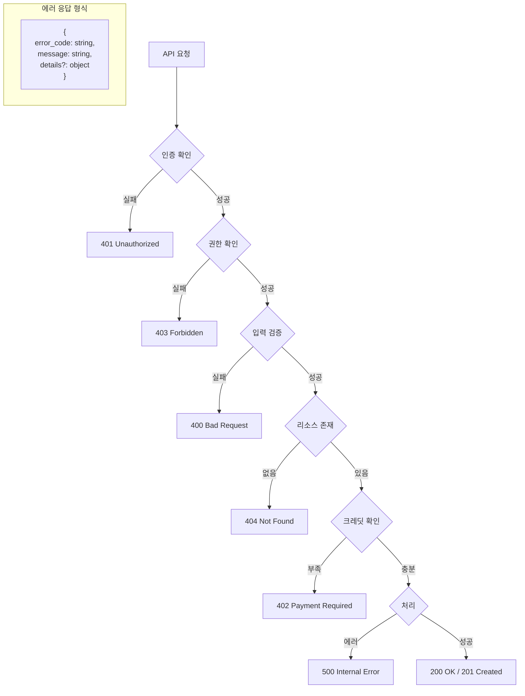

### 7.2 AI Worker 에러 복구

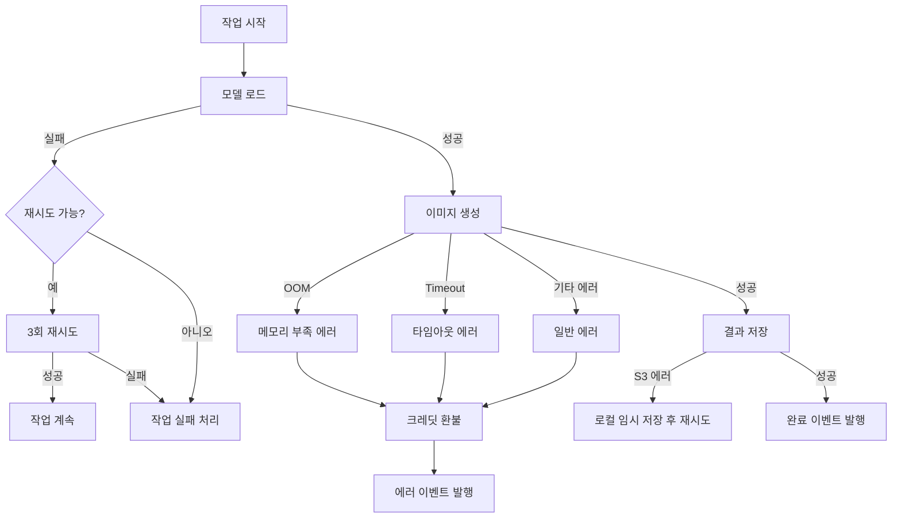

---

## 다이어그램 파일

상세 다이어그램은 다음 파일에서 확인할 수 있습니다:
- Mermaid: `../diagrams/data-flow.mmd`
- Draw.io: `../diagrams/data-flow.drawio`
- SVG: `../diagrams/sequence-diagrams.svg`

---

## 다음 단계

1. [DB 스키마 설계](../database/01-schema-design.md)에서 테이블 구조를 확인합니다.
2. [API 명세서](../api/01-api-specification.md)에서 상세 API를 확인합니다.
3. [WebSocket 이벤트 명세](../api/02-websocket-events.md)에서 이벤트 형식을 확인합니다.
