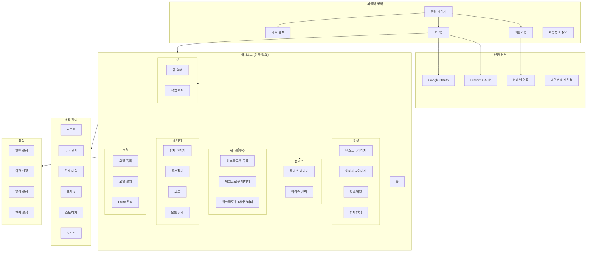
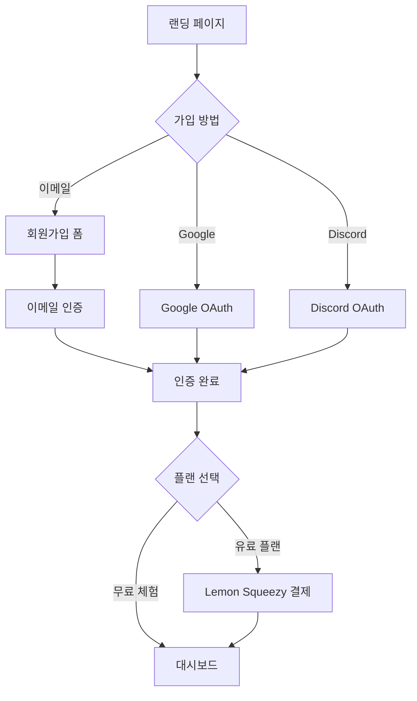
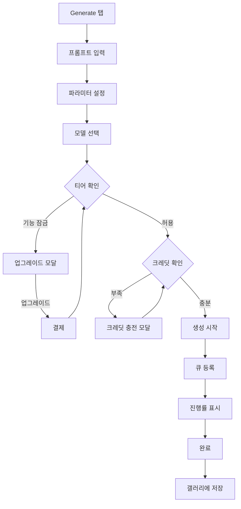
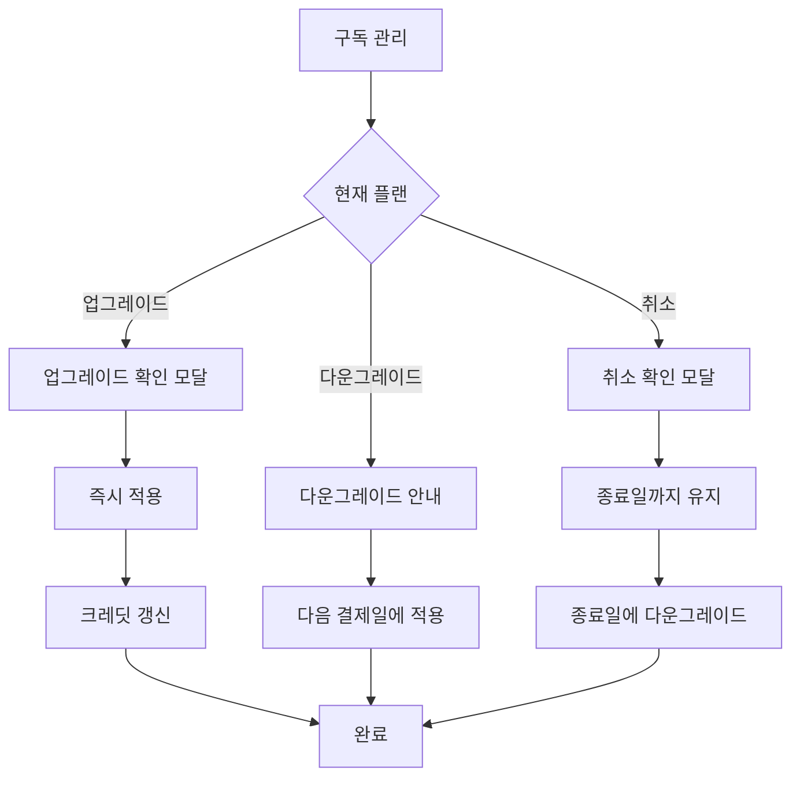

# IA(Information Architecture) 및 Sitemap

## 개요

이 문서는 Pingvas Studio의 정보 구조와 사이트맵을 정의합니다.

---

## 전체 IA 구조



---

## 상세 Sitemap

### 1. 퍼블릭 페이지

| 경로 | 페이지명 | 설명 |
|------|---------|------|
| `/` | 랜딩 페이지 | 서비스 소개, CTA |
| `/pricing` | 가격 정책 | 플랜 비교, 구독 버튼 |
| `/login` | 로그인 | 이메일/OAuth 로그인 |
| `/register` | 회원가입 | 이메일/OAuth 가입 |
| `/forgot-password` | 비밀번호 찾기 | 비밀번호 재설정 요청 |
| `/reset-password/:token` | 비밀번호 재설정 | 새 비밀번호 설정 |
| `/verify-email/:token` | 이메일 인증 | 이메일 인증 완료 |
| `/shared/:token` | 공유 이미지 | 공유된 이미지 뷰어 |

### 2. 대시보드 (인증 필요)

| 경로 | 페이지명 | 탭 | 설명 |
|------|---------|-----|------|
| `/app` | 대시보드 홈 | - | 개요, 최근 활동 |
| `/app/generate` | 생성 | generate | 텍스트→이미지 생성 |
| `/app/canvas` | 캔버스 | canvas | 캔버스 에디터 |
| `/app/upscaling` | 업스케일 | upscaling | 이미지 업스케일 |
| `/app/workflows` | 워크플로우 | workflows | 노드 에디터 |
| `/app/models` | 모델 | models | 모델 관리 |
| `/app/queue` | 큐 | queue | 작업 큐 관리 |

### 3. 갤러리

| 경로 | 페이지명 | 설명 |
|------|---------|------|
| `/app/gallery` | 전체 이미지 | 모든 생성 이미지 |
| `/app/gallery/starred` | 즐겨찾기 | 별표 이미지 |
| `/app/gallery/boards` | 보드 목록 | 컬렉션 관리 |
| `/app/gallery/boards/:id` | 보드 상세 | 보드 내 이미지 |
| `/app/gallery/image/:id` | 이미지 상세 | 메타데이터, 액션 |

### 4. 계정 관리

| 경로 | 페이지명 | 설명 |
|------|---------|------|
| `/app/account` | 계정 | 프로필 정보 |
| `/app/account/subscription` | 구독 관리 | 플랜, 업그레이드/취소 |
| `/app/account/billing` | 결제 내역 | 인보이스, 결제 방법 |
| `/app/account/credits` | 크레딧 | 잔액, 사용 내역 |
| `/app/account/storage` | 스토리지 | 사용량, 관리 |
| `/app/account/api-keys` | API 키 | API 키 관리 |

### 5. 설정

| 경로 | 페이지명 | 설명 |
|------|---------|------|
| `/app/settings` | 일반 설정 | 기본 설정 |
| `/app/settings/appearance` | 외관 | 테마, UI 설정 |
| `/app/settings/notifications` | 알림 | 알림 설정 |
| `/app/settings/language` | 언어 | 언어 설정 |

---

## 네비게이션 구조

### 메인 네비게이션 (사이드바)

```
┌─────────────────────────────────┐
│  🎨 Pingvas Studio              │
├─────────────────────────────────┤
│                                 │
│  📊 대시보드                    │
│                                 │
│  ── 생성 ──────────────────     │
│  🖼️ Generate                    │
│  🎨 Canvas                      │
│  📐 Upscaling                   │
│  🔗 Workflows                   │
│                                 │
│  ── 관리 ──────────────────     │
│  🏛️ Gallery                     │
│  🤖 Models                      │
│  📋 Queue                       │
│                                 │
├─────────────────────────────────┤
│  👤 프로필                      │
│     크레딧: 14,500              │
│     플랜: Pro                   │
│                                 │
│  ⚙️ 설정                        │
│  🚪 로그아웃                    │
└─────────────────────────────────┘
```

### 상단 헤더

```
┌────────────────────────────────────────────────────────────────┐
│  [탭명]          [검색]                    [알림] [프로필]     │
└────────────────────────────────────────────────────────────────┘
```

### 탭 네비게이션 (Dockview)

```
┌────────────────────────────────────────────────────────────────┐
│  Generate │ Canvas │ Upscaling │ Workflows │ Models │ Queue   │
└────────────────────────────────────────────────────────────────┘
```

---

## 페이지별 레이아웃

### 생성 페이지 (Generate)

```
┌──────────────────────────────────────────────────────────────────────┐
│ [Launchpad - 프롬프트 입력 & 생성 버튼]                             │
├────────────────┬─────────────────────────────┬───────────────────────┤
│                │                             │                       │
│   Left Panel   │      Center Panel           │    Right Panel        │
│                │                             │                       │
│   - 프롬프트   │      - 갤러리 뷰            │    - 이미지 상세      │
│   - 파라미터   │      - 생성 미리보기        │    - 메타데이터       │
│   - 모델 선택  │                             │    - 액션             │
│   - LoRA       │                             │                       │
│   - 고급 설정  │                             │                       │
│                │                             │                       │
└────────────────┴─────────────────────────────┴───────────────────────┘
```

### 캔버스 페이지 (Canvas)

```
┌──────────────────────────────────────────────────────────────────────┐
│ [Launchpad - 도구 바]                                               │
├────────────────┬─────────────────────────────┬───────────────────────┤
│                │                             │                       │
│   Left Panel   │      Canvas                 │    Right Panel        │
│                │                             │                       │
│   - 레이어     │      - Konva 캔버스        │    - 레이어 설정      │
│   - 브러시     │      - 그리드              │    - 생성 설정        │
│   - 도구       │                             │                       │
│                │                             │                       │
└────────────────┴─────────────────────────────┴───────────────────────┘
```

### 워크플로우 페이지 (Workflows)

```
┌──────────────────────────────────────────────────────────────────────┐
│ [Launchpad - 워크플로우 액션]                                        │
├────────────────┬─────────────────────────────┬───────────────────────┤
│                │                             │                       │
│   Left Panel   │      Node Editor            │    Right Panel        │
│                │                             │                       │
│   - 노드 목록  │      - ReactFlow 그래프    │    - 노드 속성        │
│   - 노드 검색  │      - 노드 연결           │    - 워크플로우 설정  │
│                │      - 미니맵              │                       │
│                │                             │                       │
└────────────────┴─────────────────────────────┴───────────────────────┘
```

### 갤러리 페이지 (Gallery)

```
┌──────────────────────────────────────────────────────────────────────┐
│ [필터 & 정렬 & 검색]                                                │
├────────────────┬─────────────────────────────────────────────────────┤
│                │                                                     │
│   Left Panel   │                   Image Grid                        │
│                │                                                     │
│   - 보드       │      ┌─────┐ ┌─────┐ ┌─────┐ ┌─────┐              │
│   - 필터       │      │     │ │     │ │     │ │     │              │
│   - 날짜       │      │ Img │ │ Img │ │ Img │ │ Img │              │
│                │      │     │ │     │ │     │ │     │              │
│                │      └─────┘ └─────┘ └─────┘ └─────┘              │
│                │                                                     │
│                │      ┌─────┐ ┌─────┐ ┌─────┐ ┌─────┐              │
│                │      │     │ │     │ │     │ │     │              │
│                │      │ Img │ │ Img │ │ Img │ │ Img │              │
│                │      │     │ │     │ │     │ │     │              │
│                │      └─────┘ └─────┘ └─────┘ └─────┘              │
│                │                                                     │
└────────────────┴─────────────────────────────────────────────────────┘
```

---

## 사용자 플로우

### 신규 가입 플로우



### 이미지 생성 플로우



### 구독 변경 플로우



---

## 접근성 고려사항

### 키보드 네비게이션

- `Tab`: 다음 요소로 이동
- `Shift + Tab`: 이전 요소로 이동
- `Enter/Space`: 버튼/링크 활성화
- `Escape`: 모달 닫기
- `Arrow Keys`: 갤러리 이미지 탐색

### 스크린 리더 지원

- 모든 이미지에 `alt` 텍스트
- 폼 필드에 `label` 연결
- 상태 변경 시 `aria-live` 알림
- 로딩 상태에 `aria-busy`

### 반응형 브레이크포인트

| 브레이크포인트 | 너비 | 레이아웃 |
|---------------|------|----------|
| Mobile | < 768px | 단일 컬럼, 하단 네비게이션 |
| Tablet | 768px - 1024px | 2컬럼, 사이드바 축소 |
| Desktop | > 1024px | 3컬럼, 전체 사이드바 |

---

## 다음 단계

1. [프론트엔드 개발 가이드](../frontend/01-storybook-guide.md)에서 컴포넌트를 구현합니다.
2. [API 명세서](../api/01-api-specification.md)와 연동합니다.
