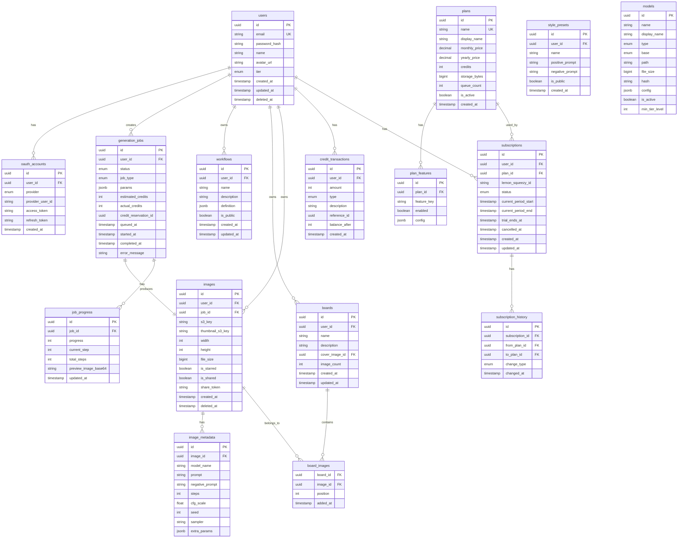

# 데이터베이스 스키마 설계

## 개요

Pingvas Studio는 Aurora PostgreSQL 17.4를 사용하며, 개발/운영 환경을 스키마로 분리합니다.

### 스키마 구조
```sql
-- 개발 환경
CREATE SCHEMA pingvas_dev;

-- 운영 환경
CREATE SCHEMA pingvas_prod;
```

---

## ERD (Entity Relationship Diagram)



---

## 테이블 상세 명세

### 1. users (사용자)

사용자 기본 정보를 저장합니다.

```sql
CREATE TABLE users (
    id UUID PRIMARY KEY DEFAULT gen_random_uuid(),
    email VARCHAR(255) NOT NULL UNIQUE,
    password_hash VARCHAR(255),  -- OAuth 전용 사용자는 NULL
    name VARCHAR(100) NOT NULL,
    avatar_url VARCHAR(500),
    tier VARCHAR(20) NOT NULL DEFAULT 'free',  -- free, starter, pro, studio, enterprise
    credits INT NOT NULL DEFAULT 0,
    storage_used BIGINT NOT NULL DEFAULT 0,  -- bytes
    storage_quota BIGINT NOT NULL DEFAULT 0,  -- bytes
    email_verified BOOLEAN NOT NULL DEFAULT FALSE,
    email_verification_token VARCHAR(255),
    password_reset_token VARCHAR(255),
    password_reset_expires TIMESTAMP,
    last_login_at TIMESTAMP,
    created_at TIMESTAMP NOT NULL DEFAULT NOW(),
    updated_at TIMESTAMP NOT NULL DEFAULT NOW(),
    deleted_at TIMESTAMP,  -- Soft delete

    CONSTRAINT chk_tier CHECK (tier IN ('free', 'starter', 'pro', 'studio', 'enterprise'))
);

CREATE INDEX idx_users_email ON users(email);
CREATE INDEX idx_users_tier ON users(tier);
CREATE INDEX idx_users_deleted_at ON users(deleted_at) WHERE deleted_at IS NULL;
```

### 2. oauth_accounts (OAuth 계정)

소셜 로그인 연동 정보를 저장합니다.

```sql
CREATE TABLE oauth_accounts (
    id UUID PRIMARY KEY DEFAULT gen_random_uuid(),
    user_id UUID NOT NULL REFERENCES users(id) ON DELETE CASCADE,
    provider VARCHAR(20) NOT NULL,  -- google, discord
    provider_user_id VARCHAR(255) NOT NULL,
    provider_email VARCHAR(255),
    access_token TEXT,
    refresh_token TEXT,
    token_expires_at TIMESTAMP,
    created_at TIMESTAMP NOT NULL DEFAULT NOW(),
    updated_at TIMESTAMP NOT NULL DEFAULT NOW(),

    UNIQUE(provider, provider_user_id)
);

CREATE INDEX idx_oauth_user ON oauth_accounts(user_id);
```

### 3. plans (구독 플랜)

구독 플랜 정의를 저장합니다.

```sql
CREATE TABLE plans (
    id UUID PRIMARY KEY DEFAULT gen_random_uuid(),
    name VARCHAR(50) NOT NULL UNIQUE,  -- starter, pro, studio, enterprise
    display_name VARCHAR(100) NOT NULL,
    description TEXT,
    monthly_price DECIMAL(10, 2) NOT NULL,
    yearly_price DECIMAL(10, 2) NOT NULL,
    credits INT NOT NULL,
    storage_bytes BIGINT NOT NULL,
    queue_count INT NOT NULL DEFAULT 1,
    tier_level INT NOT NULL,  -- 1: starter, 2: pro, 3: studio, 4: enterprise
    lemon_squeezy_variant_id_monthly VARCHAR(50),
    lemon_squeezy_variant_id_yearly VARCHAR(50),
    is_active BOOLEAN NOT NULL DEFAULT TRUE,
    created_at TIMESTAMP NOT NULL DEFAULT NOW(),
    updated_at TIMESTAMP NOT NULL DEFAULT NOW()
);

-- 초기 플랜 데이터
INSERT INTO plans (name, display_name, monthly_price, yearly_price, credits, storage_bytes, queue_count, tier_level) VALUES
('starter', 'Starter', 25.00, 250.00, 5000, 21474836480, 1, 1),      -- 20GB
('pro', 'Pro', 75.00, 750.00, 15000, 107374182400, 1, 2),             -- 100GB
('studio', 'Studio', 150.00, 1500.00, 30000, 214748364800, 3, 3),     -- 200GB
('enterprise', 'Enterprise', 0.00, 0.00, 0, 0, 0, 4);                 -- 맞춤형
```

### 4. plan_features (플랜별 기능)

플랜별 기능 활성화 상태를 저장합니다.

```sql
CREATE TABLE plan_features (
    id UUID PRIMARY KEY DEFAULT gen_random_uuid(),
    plan_id UUID NOT NULL REFERENCES plans(id) ON DELETE CASCADE,
    feature_key VARCHAR(50) NOT NULL,  -- flux_model, nano_banana_api, lora_training, etc.
    enabled BOOLEAN NOT NULL DEFAULT FALSE,
    config JSONB,  -- 추가 설정 (예: API 호출 제한)

    UNIQUE(plan_id, feature_key)
);

-- 초기 기능 데이터
INSERT INTO plan_features (plan_id, feature_key, enabled) VALUES
-- Starter
((SELECT id FROM plans WHERE name = 'starter'), 'sd_models', TRUE),
((SELECT id FROM plans WHERE name = 'starter'), 'flux_model', FALSE),
((SELECT id FROM plans WHERE name = 'starter'), 'nano_banana_api', FALSE),
((SELECT id FROM plans WHERE name = 'starter'), 'lora_training', FALSE),
-- Pro
((SELECT id FROM plans WHERE name = 'pro'), 'sd_models', TRUE),
((SELECT id FROM plans WHERE name = 'pro'), 'flux_model', TRUE),
((SELECT id FROM plans WHERE name = 'pro'), 'nano_banana_api', TRUE),
((SELECT id FROM plans WHERE name = 'pro'), 'lora_training', FALSE),
-- Studio
((SELECT id FROM plans WHERE name = 'studio'), 'sd_models', TRUE),
((SELECT id FROM plans WHERE name = 'studio'), 'flux_model', TRUE),
((SELECT id FROM plans WHERE name = 'studio'), 'nano_banana_api', TRUE),
((SELECT id FROM plans WHERE name = 'studio'), 'lora_training', TRUE);
```

### 5. subscriptions (구독)

사용자 구독 정보를 저장합니다.

```sql
CREATE TABLE subscriptions (
    id UUID PRIMARY KEY DEFAULT gen_random_uuid(),
    user_id UUID NOT NULL REFERENCES users(id) ON DELETE CASCADE,
    plan_id UUID NOT NULL REFERENCES plans(id),
    lemon_squeezy_subscription_id VARCHAR(100),
    lemon_squeezy_customer_id VARCHAR(100),
    billing_cycle VARCHAR(10) NOT NULL DEFAULT 'monthly',  -- monthly, yearly
    status VARCHAR(20) NOT NULL DEFAULT 'active',
    -- active, trialing, past_due, cancelled, expired
    current_period_start TIMESTAMP NOT NULL,
    current_period_end TIMESTAMP NOT NULL,
    trial_ends_at TIMESTAMP,
    cancelled_at TIMESTAMP,
    cancel_reason TEXT,
    created_at TIMESTAMP NOT NULL DEFAULT NOW(),
    updated_at TIMESTAMP NOT NULL DEFAULT NOW(),

    CONSTRAINT chk_status CHECK (status IN ('active', 'trialing', 'past_due', 'cancelled', 'expired')),
    CONSTRAINT chk_billing_cycle CHECK (billing_cycle IN ('monthly', 'yearly'))
);

CREATE INDEX idx_subscriptions_user ON subscriptions(user_id);
CREATE INDEX idx_subscriptions_status ON subscriptions(status);
CREATE INDEX idx_subscriptions_period_end ON subscriptions(current_period_end);
CREATE INDEX idx_subscriptions_lemon_squeezy ON subscriptions(lemon_squeezy_subscription_id);
```

### 6. subscription_history (구독 이력)

구독 변경 이력을 저장합니다.

```sql
CREATE TABLE subscription_history (
    id UUID PRIMARY KEY DEFAULT gen_random_uuid(),
    subscription_id UUID NOT NULL REFERENCES subscriptions(id) ON DELETE CASCADE,
    from_plan_id UUID REFERENCES plans(id),
    to_plan_id UUID REFERENCES plans(id),
    change_type VARCHAR(20) NOT NULL,
    -- created, upgraded, downgraded, cancelled, renewed, expired
    details JSONB,
    changed_at TIMESTAMP NOT NULL DEFAULT NOW()
);

CREATE INDEX idx_subscription_history_subscription ON subscription_history(subscription_id);
```

### 7. credit_transactions (크레딧 거래)

크레딧 충전/사용 내역을 저장합니다.

```sql
CREATE TABLE credit_transactions (
    id UUID PRIMARY KEY DEFAULT gen_random_uuid(),
    user_id UUID NOT NULL REFERENCES users(id) ON DELETE CASCADE,
    amount INT NOT NULL,  -- 양수: 충전, 음수: 사용
    type VARCHAR(30) NOT NULL,
    -- subscription_grant, subscription_renew, generation_use, api_use,
    -- refund, admin_adjustment, bonus
    description VARCHAR(500),
    reference_id UUID,  -- 관련 엔티티 ID (job_id, subscription_id 등)
    reference_type VARCHAR(50),  -- generation_job, subscription, etc.
    balance_after INT NOT NULL,
    created_at TIMESTAMP NOT NULL DEFAULT NOW()
);

CREATE INDEX idx_credit_transactions_user ON credit_transactions(user_id);
CREATE INDEX idx_credit_transactions_created ON credit_transactions(created_at);
CREATE INDEX idx_credit_transactions_type ON credit_transactions(type);
```

### 8. credit_reservations (크레딧 예약)

진행 중인 작업의 크레딧 예약을 저장합니다.

```sql
CREATE TABLE credit_reservations (
    id UUID PRIMARY KEY DEFAULT gen_random_uuid(),
    user_id UUID NOT NULL REFERENCES users(id) ON DELETE CASCADE,
    job_id UUID NOT NULL,
    reserved_amount INT NOT NULL,
    status VARCHAR(20) NOT NULL DEFAULT 'reserved',
    -- reserved, settled, refunded
    settled_amount INT,
    created_at TIMESTAMP NOT NULL DEFAULT NOW(),
    settled_at TIMESTAMP
);

CREATE INDEX idx_credit_reservations_user ON credit_reservations(user_id);
CREATE INDEX idx_credit_reservations_job ON credit_reservations(job_id);
CREATE INDEX idx_credit_reservations_status ON credit_reservations(status);
```

### 9. images (이미지)

생성된 이미지 정보를 저장합니다.

```sql
CREATE TABLE images (
    id UUID PRIMARY KEY DEFAULT gen_random_uuid(),
    user_id UUID NOT NULL REFERENCES users(id) ON DELETE CASCADE,
    job_id UUID,
    s3_key VARCHAR(500) NOT NULL,
    thumbnail_s3_key VARCHAR(500),
    original_filename VARCHAR(255),
    mime_type VARCHAR(50) NOT NULL DEFAULT 'image/png',
    width INT NOT NULL,
    height INT NOT NULL,
    file_size BIGINT NOT NULL,  -- bytes
    is_starred BOOLEAN NOT NULL DEFAULT FALSE,
    is_public BOOLEAN NOT NULL DEFAULT FALSE,
    share_token VARCHAR(100) UNIQUE,
    view_count INT NOT NULL DEFAULT 0,
    created_at TIMESTAMP NOT NULL DEFAULT NOW(),
    updated_at TIMESTAMP NOT NULL DEFAULT NOW(),
    deleted_at TIMESTAMP  -- Soft delete
);

CREATE INDEX idx_images_user ON images(user_id);
CREATE INDEX idx_images_starred ON images(user_id, is_starred) WHERE is_starred = TRUE;
CREATE INDEX idx_images_share_token ON images(share_token) WHERE share_token IS NOT NULL;
CREATE INDEX idx_images_created ON images(created_at DESC);
CREATE INDEX idx_images_deleted ON images(deleted_at) WHERE deleted_at IS NULL;
```

### 10. image_metadata (이미지 메타데이터)

이미지 생성 파라미터를 저장합니다.

```sql
CREATE TABLE image_metadata (
    id UUID PRIMARY KEY DEFAULT gen_random_uuid(),
    image_id UUID NOT NULL UNIQUE REFERENCES images(id) ON DELETE CASCADE,
    model_name VARCHAR(255),
    model_hash VARCHAR(64),
    prompt TEXT,
    negative_prompt TEXT,
    steps INT,
    cfg_scale DECIMAL(4, 2),
    seed BIGINT,
    sampler VARCHAR(50),
    scheduler VARCHAR(50),
    width INT,
    height INT,
    clip_skip INT,
    -- ControlNet/LoRA 정보
    controlnet_model VARCHAR(255),
    controlnet_weight DECIMAL(4, 2),
    lora_models JSONB,  -- [{name, weight}, ...]
    -- 기타 파라미터
    extra_params JSONB,
    -- 외부 API 사용 시
    external_api VARCHAR(50),  -- nano_banana, etc.
    api_request_id VARCHAR(100),
    created_at TIMESTAMP NOT NULL DEFAULT NOW()
);

CREATE INDEX idx_image_metadata_model ON image_metadata(model_name);
```

### 11. boards (보드/컬렉션)

이미지 컬렉션을 저장합니다.

```sql
CREATE TABLE boards (
    id UUID PRIMARY KEY DEFAULT gen_random_uuid(),
    user_id UUID NOT NULL REFERENCES users(id) ON DELETE CASCADE,
    name VARCHAR(100) NOT NULL,
    description TEXT,
    cover_image_id UUID REFERENCES images(id) ON DELETE SET NULL,
    image_count INT NOT NULL DEFAULT 0,
    is_public BOOLEAN NOT NULL DEFAULT FALSE,
    share_token VARCHAR(100) UNIQUE,
    created_at TIMESTAMP NOT NULL DEFAULT NOW(),
    updated_at TIMESTAMP NOT NULL DEFAULT NOW(),
    deleted_at TIMESTAMP
);

CREATE INDEX idx_boards_user ON boards(user_id);
CREATE INDEX idx_boards_deleted ON boards(deleted_at) WHERE deleted_at IS NULL;
```

### 12. board_images (보드-이미지 연결)

보드와 이미지의 다대다 관계를 저장합니다.

```sql
CREATE TABLE board_images (
    board_id UUID NOT NULL REFERENCES boards(id) ON DELETE CASCADE,
    image_id UUID NOT NULL REFERENCES images(id) ON DELETE CASCADE,
    position INT NOT NULL DEFAULT 0,
    added_at TIMESTAMP NOT NULL DEFAULT NOW(),

    PRIMARY KEY (board_id, image_id)
);

CREATE INDEX idx_board_images_board ON board_images(board_id);
CREATE INDEX idx_board_images_image ON board_images(image_id);
```

### 13. workflows (워크플로우)

사용자 정의 워크플로우를 저장합니다.

```sql
CREATE TABLE workflows (
    id UUID PRIMARY KEY DEFAULT gen_random_uuid(),
    user_id UUID NOT NULL REFERENCES users(id) ON DELETE CASCADE,
    name VARCHAR(200) NOT NULL,
    description TEXT,
    definition JSONB NOT NULL,  -- InvokeAI 워크플로우 JSON
    thumbnail_s3_key VARCHAR(500),
    is_public BOOLEAN NOT NULL DEFAULT FALSE,
    share_token VARCHAR(100) UNIQUE,
    use_count INT NOT NULL DEFAULT 0,
    created_at TIMESTAMP NOT NULL DEFAULT NOW(),
    updated_at TIMESTAMP NOT NULL DEFAULT NOW(),
    deleted_at TIMESTAMP
);

CREATE INDEX idx_workflows_user ON workflows(user_id);
CREATE INDEX idx_workflows_public ON workflows(is_public) WHERE is_public = TRUE;
```

### 14. generation_jobs (생성 작업)

이미지 생성 작업 정보를 저장합니다.

```sql
CREATE TABLE generation_jobs (
    id UUID PRIMARY KEY DEFAULT gen_random_uuid(),
    user_id UUID NOT NULL REFERENCES users(id) ON DELETE CASCADE,
    queue_name VARCHAR(50) NOT NULL,  -- queue:starter, queue:pro, etc.
    status VARCHAR(20) NOT NULL DEFAULT 'queued',
    -- queued, processing, completed, failed, cancelled
    job_type VARCHAR(30) NOT NULL,
    -- text_to_image, image_to_image, upscale, inpaint, workflow
    params JSONB NOT NULL,
    estimated_credits INT NOT NULL,
    actual_credits INT,
    reservation_id UUID REFERENCES credit_reservations(id),
    result_image_id UUID REFERENCES images(id),
    error_code VARCHAR(50),
    error_message TEXT,
    worker_id VARCHAR(100),
    queued_at TIMESTAMP NOT NULL DEFAULT NOW(),
    started_at TIMESTAMP,
    completed_at TIMESTAMP,

    CONSTRAINT chk_job_status CHECK (status IN ('queued', 'processing', 'completed', 'failed', 'cancelled'))
);

CREATE INDEX idx_jobs_user ON generation_jobs(user_id);
CREATE INDEX idx_jobs_status ON generation_jobs(status);
CREATE INDEX idx_jobs_queue ON generation_jobs(queue_name, queued_at);
```

### 15. job_progress (작업 진행률)

작업 진행률을 저장합니다 (실시간 업데이트용).

```sql
CREATE TABLE job_progress (
    id UUID PRIMARY KEY DEFAULT gen_random_uuid(),
    job_id UUID NOT NULL UNIQUE REFERENCES generation_jobs(id) ON DELETE CASCADE,
    progress INT NOT NULL DEFAULT 0,  -- 0-100
    current_step INT NOT NULL DEFAULT 0,
    total_steps INT NOT NULL DEFAULT 0,
    preview_image_base64 TEXT,  -- 작은 미리보기 이미지
    stage VARCHAR(50),  -- loading_model, generating, post_processing, etc.
    updated_at TIMESTAMP NOT NULL DEFAULT NOW()
);

CREATE INDEX idx_job_progress_job ON job_progress(job_id);
```

### 16. style_presets (스타일 프리셋)

재사용 가능한 프롬프트 프리셋을 저장합니다.

```sql
CREATE TABLE style_presets (
    id UUID PRIMARY KEY DEFAULT gen_random_uuid(),
    user_id UUID REFERENCES users(id) ON DELETE CASCADE,  -- NULL = 시스템 프리셋
    name VARCHAR(100) NOT NULL,
    description TEXT,
    positive_prompt TEXT NOT NULL,
    negative_prompt TEXT,
    thumbnail_s3_key VARCHAR(500),
    is_public BOOLEAN NOT NULL DEFAULT FALSE,
    use_count INT NOT NULL DEFAULT 0,
    created_at TIMESTAMP NOT NULL DEFAULT NOW(),
    updated_at TIMESTAMP NOT NULL DEFAULT NOW()
);

CREATE INDEX idx_style_presets_user ON style_presets(user_id);
CREATE INDEX idx_style_presets_public ON style_presets(is_public) WHERE is_public = TRUE;
```

### 17. models (AI 모델)

사용 가능한 AI 모델 정보를 저장합니다.

```sql
CREATE TABLE models (
    id UUID PRIMARY KEY DEFAULT gen_random_uuid(),
    name VARCHAR(100) NOT NULL UNIQUE,  -- 내부 이름
    display_name VARCHAR(200) NOT NULL,  -- 표시 이름
    description TEXT,
    type VARCHAR(30) NOT NULL,
    -- main, vae, lora, controlnet, ip_adapter, embedding
    base VARCHAR(30) NOT NULL,
    -- sd-1, sd-2, sdxl, flux
    path VARCHAR(500) NOT NULL,  -- EFS 경로
    file_size BIGINT,
    hash VARCHAR(64),
    thumbnail_url VARCHAR(500),
    config JSONB,
    min_tier_level INT NOT NULL DEFAULT 1,  -- 최소 티어 레벨
    is_active BOOLEAN NOT NULL DEFAULT TRUE,
    created_at TIMESTAMP NOT NULL DEFAULT NOW(),
    updated_at TIMESTAMP NOT NULL DEFAULT NOW()
);

CREATE INDEX idx_models_type ON models(type);
CREATE INDEX idx_models_base ON models(base);
CREATE INDEX idx_models_active ON models(is_active) WHERE is_active = TRUE;
```

### 18. webhook_events (웹훅 이벤트)

Lemon Squeezy 웹훅 이벤트 로그를 저장합니다.

```sql
CREATE TABLE webhook_events (
    id UUID PRIMARY KEY DEFAULT gen_random_uuid(),
    source VARCHAR(50) NOT NULL,  -- lemon_squeezy
    event_type VARCHAR(50) NOT NULL,
    event_id VARCHAR(100),
    payload JSONB NOT NULL,
    status VARCHAR(20) NOT NULL DEFAULT 'received',
    -- received, processed, failed
    error_message TEXT,
    processed_at TIMESTAMP,
    created_at TIMESTAMP NOT NULL DEFAULT NOW()
);

CREATE INDEX idx_webhook_events_source ON webhook_events(source);
CREATE INDEX idx_webhook_events_status ON webhook_events(status);
CREATE INDEX idx_webhook_events_created ON webhook_events(created_at);
```

### 19. audit_logs (감사 로그)

중요 작업의 감사 로그를 저장합니다.

```sql
CREATE TABLE audit_logs (
    id UUID PRIMARY KEY DEFAULT gen_random_uuid(),
    user_id UUID REFERENCES users(id) ON DELETE SET NULL,
    action VARCHAR(100) NOT NULL,
    entity_type VARCHAR(50),
    entity_id UUID,
    old_value JSONB,
    new_value JSONB,
    ip_address INET,
    user_agent TEXT,
    created_at TIMESTAMP NOT NULL DEFAULT NOW()
);

CREATE INDEX idx_audit_logs_user ON audit_logs(user_id);
CREATE INDEX idx_audit_logs_action ON audit_logs(action);
CREATE INDEX idx_audit_logs_entity ON audit_logs(entity_type, entity_id);
CREATE INDEX idx_audit_logs_created ON audit_logs(created_at);
```

---

## 데이터베이스 마이그레이션

### Alembic 설정

```python
# alembic/env.py
from alembic import context
from sqlalchemy import engine_from_config, pool
from app.models import Base
from app.config import settings

def run_migrations_online():
    configuration = config.get_section(config.config_ini_section)
    configuration["sqlalchemy.url"] = settings.database_url

    connectable = engine_from_config(
        configuration,
        prefix="sqlalchemy.",
        poolclass=pool.NullPool,
    )

    with connectable.connect() as connection:
        context.configure(
            connection=connection,
            target_metadata=Base.metadata,
            compare_type=True,
            compare_server_default=True,
        )

        with context.begin_transaction():
            context.run_migrations()
```

### 마이그레이션 명령어

```bash
# 새 마이그레이션 생성
alembic revision --autogenerate -m "Add users table"

# 마이그레이션 실행
alembic upgrade head

# 롤백
alembic downgrade -1

# 특정 버전으로 이동
alembic upgrade <revision_id>

# 현재 상태 확인
alembic current

# 이력 확인
alembic history
```

---

## 인덱스 전략

### 복합 인덱스

```sql
-- 사용자별 이미지 목록 (최신순)
CREATE INDEX idx_images_user_created ON images(user_id, created_at DESC)
WHERE deleted_at IS NULL;

-- 사용자별 크레딧 거래 내역 (최신순)
CREATE INDEX idx_credit_transactions_user_created
ON credit_transactions(user_id, created_at DESC);

-- 큐별 대기 작업 (FIFO)
CREATE INDEX idx_jobs_queue_status_queued
ON generation_jobs(queue_name, queued_at)
WHERE status = 'queued';
```

### 부분 인덱스

```sql
-- 활성 구독만 인덱싱
CREATE INDEX idx_subscriptions_active
ON subscriptions(user_id)
WHERE status IN ('active', 'trialing');

-- 공개 워크플로우만 인덱싱
CREATE INDEX idx_workflows_public_created
ON workflows(created_at DESC)
WHERE is_public = TRUE AND deleted_at IS NULL;
```

---

## 트리거 및 함수

### 타임스탬프 자동 업데이트

```sql
CREATE OR REPLACE FUNCTION update_updated_at()
RETURNS TRIGGER AS $$
BEGIN
    NEW.updated_at = NOW();
    RETURN NEW;
END;
$$ LANGUAGE plpgsql;

-- 모든 테이블에 적용
CREATE TRIGGER trg_users_updated_at
    BEFORE UPDATE ON users
    FOR EACH ROW
    EXECUTE FUNCTION update_updated_at();

-- (다른 테이블에도 동일하게 적용)
```

### 보드 이미지 카운트 동기화

```sql
CREATE OR REPLACE FUNCTION sync_board_image_count()
RETURNS TRIGGER AS $$
BEGIN
    IF TG_OP = 'INSERT' THEN
        UPDATE boards SET image_count = image_count + 1
        WHERE id = NEW.board_id;
    ELSIF TG_OP = 'DELETE' THEN
        UPDATE boards SET image_count = image_count - 1
        WHERE id = OLD.board_id;
    END IF;
    RETURN NULL;
END;
$$ LANGUAGE plpgsql;

CREATE TRIGGER trg_board_images_count
    AFTER INSERT OR DELETE ON board_images
    FOR EACH ROW
    EXECUTE FUNCTION sync_board_image_count();
```

### 스토리지 사용량 동기화

```sql
CREATE OR REPLACE FUNCTION sync_user_storage()
RETURNS TRIGGER AS $$
BEGIN
    IF TG_OP = 'INSERT' THEN
        UPDATE users SET storage_used = storage_used + NEW.file_size
        WHERE id = NEW.user_id;
    ELSIF TG_OP = 'DELETE' OR (TG_OP = 'UPDATE' AND NEW.deleted_at IS NOT NULL) THEN
        UPDATE users SET storage_used = storage_used - COALESCE(OLD.file_size, NEW.file_size)
        WHERE id = COALESCE(OLD.user_id, NEW.user_id);
    END IF;
    RETURN NULL;
END;
$$ LANGUAGE plpgsql;

CREATE TRIGGER trg_images_storage
    AFTER INSERT OR DELETE OR UPDATE OF deleted_at ON images
    FOR EACH ROW
    EXECUTE FUNCTION sync_user_storage();
```

---

## 성능 최적화

### 커넥션 풀링 설정

```python
# SQLAlchemy 엔진 설정
from sqlalchemy import create_engine
from sqlalchemy.pool import QueuePool

engine = create_engine(
    DATABASE_URL,
    poolclass=QueuePool,
    pool_size=5,           # 기본 커넥션 수
    max_overflow=10,       # 최대 추가 커넥션
    pool_timeout=30,       # 커넥션 대기 타임아웃
    pool_recycle=1800,     # 커넥션 재활용 주기 (초)
    pool_pre_ping=True,    # 커넥션 유효성 검사
)
```

### 쿼리 최적화 팁

1. **N+1 문제 방지**: `selectinload`, `joinedload` 사용
2. **불필요한 컬럼 제외**: 필요한 컬럼만 SELECT
3. **페이지네이션**: OFFSET 대신 커서 기반 페이지네이션
4. **벌크 연산**: 대량 INSERT/UPDATE 시 `execute_many` 사용

---

## 다음 단계

1. [ERD 다이어그램](./02-erd.md)에서 시각화된 ERD를 확인합니다.
2. [API 명세서](../api/01-api-specification.md)에서 API 설계를 확인합니다.
3. [Terraform 가이드](../infrastructure/01-terraform-guide.md)에서 Aurora 설정을 확인합니다.
