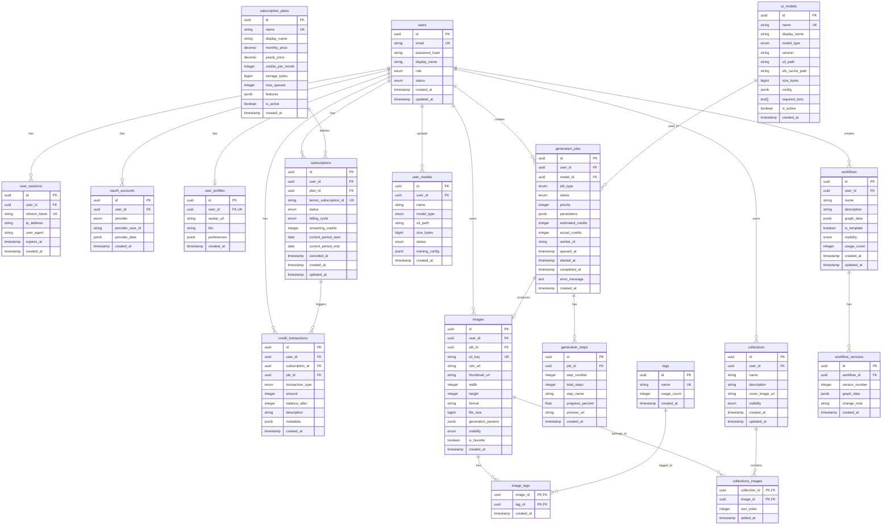
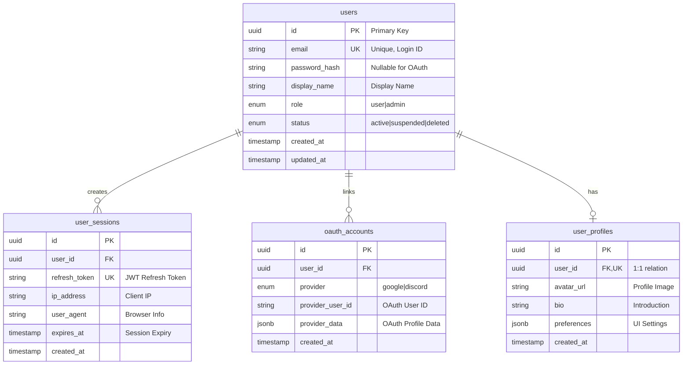
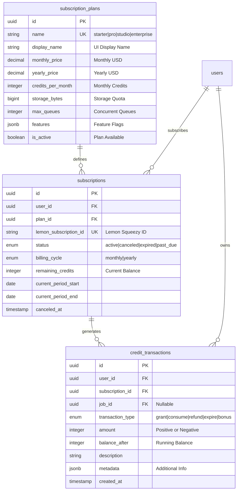
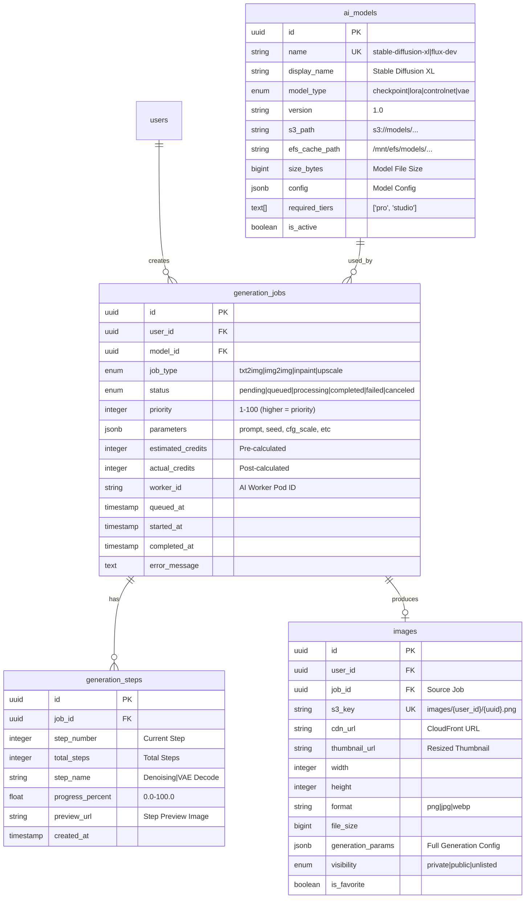
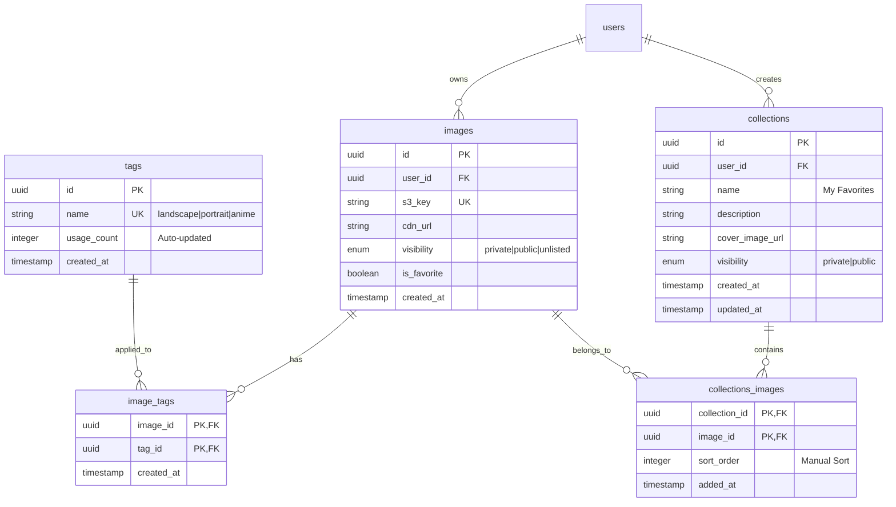
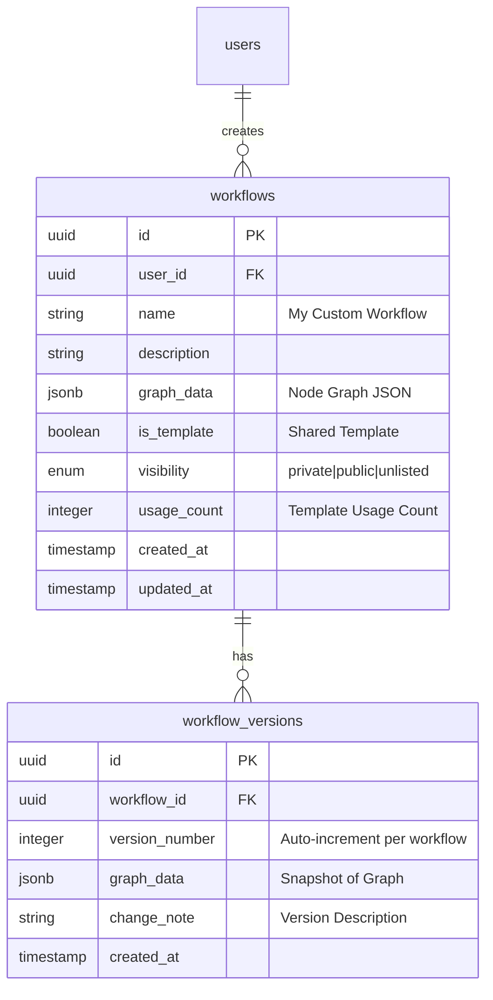

# Pingvas Studio ERD (Entity Relationship Diagram)

## 개요

이 문서는 Pingvas Studio의 데이터베이스 ERD를 시각적으로 표현합니다. 전체 스키마 설계는 [01-schema-design.md](./01-schema-design.md)를 참조하세요.

---

## ERD 다이어그램

### 전체 ERD (Mermaid)



---

## 도메인별 ERD

### 1. 사용자 인증 도메인



**관계 설명:**
- `users` : `user_profiles` = 1:1 (사용자당 하나의 프로필)
- `users` : `user_sessions` = 1:N (다중 디바이스 로그인)
- `users` : `oauth_accounts` = 1:N (여러 OAuth 제공자 연결 가능)

---

### 2. 구독 및 결제 도메인



**크레딧 트랜잭션 타입:**
| 타입 | 설명 | amount |
|------|------|--------|
| `grant` | 월간 크레딧 지급 | + |
| `consume` | 생성 작업 소모 | - |
| `refund` | 실패 작업 환불 | + |
| `expire` | 기간 만료 소멸 | - |
| `bonus` | 프로모션 지급 | + |

---

### 3. 이미지 생성 도메인



**작업 상태 흐름:**
```
pending → queued → processing → completed
                 ↘ failed
                 ↘ canceled
```

---

### 4. 갤러리 및 컬렉션 도메인



**N:M 관계:**
- `images` ↔ `tags` : 하나의 이미지에 여러 태그, 하나의 태그에 여러 이미지
- `collections` ↔ `images` : 하나의 컬렉션에 여러 이미지, 하나의 이미지가 여러 컬렉션에 포함 가능

---

### 5. 워크플로우 도메인



**워크플로우 그래프 데이터 예시:**
```json
{
  "nodes": [
    {"id": "1", "type": "text_to_image", "position": {"x": 100, "y": 100}},
    {"id": "2", "type": "upscale", "position": {"x": 300, "y": 100}}
  ],
  "edges": [
    {"source": "1", "target": "2", "sourceHandle": "image", "targetHandle": "input"}
  ]
}
```

---

## 인덱스 전략

### Primary Key 인덱스
모든 테이블의 `id` 컬럼에 자동 생성

### Unique 인덱스
| 테이블 | 컬럼 | 용도 |
|--------|------|------|
| `users` | `email` | 로그인 조회 |
| `images` | `s3_key` | 중복 방지 |
| `tags` | `name` | 태그 조회 |
| `subscriptions` | `lemon_subscription_id` | Webhook 처리 |

### Foreign Key 인덱스
모든 FK 컬럼에 인덱스 자동 생성 (PostgreSQL)

### 복합 인덱스
```sql
-- 사용자별 이미지 목록 조회 최적화
CREATE INDEX idx_images_user_created ON images(user_id, created_at DESC);

-- 작업 큐 조회 최적화
CREATE INDEX idx_jobs_status_priority ON generation_jobs(status, priority DESC, queued_at);

-- 태그 검색 최적화
CREATE INDEX idx_image_tags_tag ON image_tags(tag_id);
```

---

## 데이터 무결성 제약조건

### CASCADE 삭제 규칙
```
users 삭제 시:
├── user_profiles → CASCADE DELETE
├── user_sessions → CASCADE DELETE
├── oauth_accounts → CASCADE DELETE
├── subscriptions → SET NULL (히스토리 보존)
├── credit_transactions → SET NULL (히스토리 보존)
├── generation_jobs → SET NULL (히스토리 보존)
├── images → CASCADE DELETE
├── collections → CASCADE DELETE
└── workflows → CASCADE DELETE

images 삭제 시:
├── image_tags → CASCADE DELETE
└── collections_images → CASCADE DELETE
```

### CHECK 제약조건
```sql
-- 크레딧 잔액 음수 방지
ALTER TABLE subscriptions ADD CONSTRAINT chk_credits_positive
  CHECK (remaining_credits >= 0);

-- 진행률 범위 검증
ALTER TABLE generation_steps ADD CONSTRAINT chk_progress_range
  CHECK (progress_percent >= 0 AND progress_percent <= 100);
```

---

## 다음 단계

- [API 명세서](../api/01-api-specification.md)에서 이 스키마를 사용하는 API 확인
- [WebSocket 이벤트](../api/02-websocket-events.md)에서 실시간 데이터 흐름 확인
