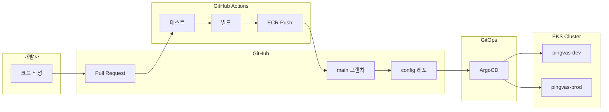

# GitOps 및 CI/CD 파이프라인 가이드

## 개요

이 문서는 Pingvas Studio의 GitOps 기반 배포 및 CI/CD 파이프라인 구성을 안내합니다.

---

## 아키텍처 개요



---

## 1단계: 레포지토리 구조

### 애플리케이션 레포지토리

```
pingvas-studio/
├── services/
│   ├── user-service/
│   │   ├── app/
│   │   ├── tests/
│   │   ├── Dockerfile
│   │   └── pyproject.toml
│   ├── generation-service/
│   ├── payment-service/
│   ├── gallery-service/
│   └── ai-worker/
├── invokeai/
│   └── frontend/
│       └── web/
├── .github/
│   └── workflows/
│       ├── ci.yml
│       ├── build-push.yml
│       └── deploy.yml
└── docker-compose.yml
```

### GitOps 설정 레포지토리

```
pingvas-gitops/
├── base/
│   ├── user-service/
│   │   ├── deployment.yaml
│   │   ├── service.yaml
│   │   └── kustomization.yaml
│   ├── generation-service/
│   ├── payment-service/
│   ├── gallery-service/
│   └── ai-worker/
├── overlays/
│   ├── dev/
│   │   ├── kustomization.yaml
│   │   └── patches/
│   └── prod/
│       ├── kustomization.yaml
│       └── patches/
├── argocd/
│   ├── applications/
│   │   ├── dev.yaml
│   │   └── prod.yaml
│   └── projects/
│       └── pingvas.yaml
└── README.md
```

---

## 2단계: CI/CD 파이프라인

### 2.1 CI 워크플로우 (테스트)

```yaml
# .github/workflows/ci.yml

name: CI

on:
  pull_request:
    branches: [develop, main]
  push:
    branches: [develop]

jobs:
  # 백엔드 테스트
  backend-test:
    runs-on: ubuntu-latest
    strategy:
      matrix:
        service: [user-service, generation-service, payment-service, gallery-service]

    steps:
      - uses: actions/checkout@v4

      - name: Set up Python
        uses: actions/setup-python@v5
        with:
          python-version: '3.12'

      - name: Install uv
        run: curl -LsSf https://astral.sh/uv/install.sh | sh

      - name: Install dependencies
        working-directory: services/${{ matrix.service }}
        run: |
          uv venv
          source .venv/bin/activate
          uv pip install -e ".[dev,test]"

      - name: Run tests
        working-directory: services/${{ matrix.service }}
        run: |
          source .venv/bin/activate
          pytest tests/ -v --cov=app --cov-report=xml

      - name: Upload coverage
        uses: codecov/codecov-action@v4
        with:
          files: services/${{ matrix.service }}/coverage.xml
          flags: ${{ matrix.service }}

  # 프론트엔드 테스트
  frontend-test:
    runs-on: ubuntu-latest

    steps:
      - uses: actions/checkout@v4

      - name: Setup Node.js
        uses: actions/setup-node@v4
        with:
          node-version: '22'

      - name: Install pnpm
        uses: pnpm/action-setup@v2
        with:
          version: 10

      - name: Install dependencies
        working-directory: invokeai/frontend/web
        run: pnpm install

      - name: Run lint
        working-directory: invokeai/frontend/web
        run: pnpm lint

      - name: Run type check
        working-directory: invokeai/frontend/web
        run: pnpm typecheck

      - name: Run tests
        working-directory: invokeai/frontend/web
        run: pnpm test

  # 코드 품질 검사
  code-quality:
    runs-on: ubuntu-latest

    steps:
      - uses: actions/checkout@v4

      - name: Set up Python
        uses: actions/setup-python@v5
        with:
          python-version: '3.12'

      - name: Install ruff
        run: pip install ruff

      - name: Run ruff
        run: ruff check services/
```

### 2.2 빌드 및 푸시 워크플로우

```yaml
# .github/workflows/build-push.yml

name: Build and Push

on:
  push:
    branches: [main]
    paths:
      - 'services/**'
      - 'invokeai/frontend/**'

env:
  AWS_REGION: ap-northeast-2
  ECR_REGISTRY: ${{ secrets.AWS_ACCOUNT_ID }}.dkr.ecr.ap-northeast-2.amazonaws.com

jobs:
  # 변경된 서비스 감지
  detect-changes:
    runs-on: ubuntu-latest
    outputs:
      services: ${{ steps.changes.outputs.services }}

    steps:
      - uses: actions/checkout@v4
        with:
          fetch-depth: 2

      - name: Detect changes
        id: changes
        run: |
          CHANGED_SERVICES=()

          if git diff --name-only HEAD~1 | grep -q "services/user-service/"; then
            CHANGED_SERVICES+=("user-service")
          fi
          if git diff --name-only HEAD~1 | grep -q "services/generation-service/"; then
            CHANGED_SERVICES+=("generation-service")
          fi
          if git diff --name-only HEAD~1 | grep -q "services/payment-service/"; then
            CHANGED_SERVICES+=("payment-service")
          fi
          if git diff --name-only HEAD~1 | grep -q "services/gallery-service/"; then
            CHANGED_SERVICES+=("gallery-service")
          fi
          if git diff --name-only HEAD~1 | grep -q "services/ai-worker/"; then
            CHANGED_SERVICES+=("ai-worker")
          fi
          if git diff --name-only HEAD~1 | grep -q "invokeai/frontend/"; then
            CHANGED_SERVICES+=("frontend")
          fi

          echo "services=$(jq -c -n '$ARGS.positional' --args "${CHANGED_SERVICES[@]}")" >> $GITHUB_OUTPUT

  # 이미지 빌드 및 푸시
  build-push:
    needs: detect-changes
    if: needs.detect-changes.outputs.services != '[]'
    runs-on: ubuntu-latest
    strategy:
      matrix:
        service: ${{ fromJson(needs.detect-changes.outputs.services) }}

    steps:
      - uses: actions/checkout@v4

      - name: Configure AWS credentials
        uses: aws-actions/configure-aws-credentials@v4
        with:
          aws-access-key-id: ${{ secrets.AWS_ACCESS_KEY_ID }}
          aws-secret-access-key: ${{ secrets.AWS_SECRET_ACCESS_KEY }}
          aws-region: ${{ env.AWS_REGION }}

      - name: Login to Amazon ECR
        id: login-ecr
        uses: aws-actions/amazon-ecr-login@v2

      - name: Set up Docker Buildx
        uses: docker/setup-buildx-action@v3

      - name: Build and push (Backend Services)
        if: matrix.service != 'frontend'
        uses: docker/build-push-action@v5
        with:
          context: services/${{ matrix.service }}
          push: true
          tags: |
            ${{ env.ECR_REGISTRY }}/pingvas-${{ matrix.service }}:${{ github.sha }}
            ${{ env.ECR_REGISTRY }}/pingvas-${{ matrix.service }}:latest
          cache-from: type=gha
          cache-to: type=gha,mode=max

      - name: Build and push (Frontend)
        if: matrix.service == 'frontend'
        uses: docker/build-push-action@v5
        with:
          context: invokeai/frontend/web
          push: true
          tags: |
            ${{ env.ECR_REGISTRY }}/pingvas-frontend:${{ github.sha }}
            ${{ env.ECR_REGISTRY }}/pingvas-frontend:latest
          cache-from: type=gha
          cache-to: type=gha,mode=max

  # GitOps 레포 업데이트
  update-gitops:
    needs: build-push
    runs-on: ubuntu-latest

    steps:
      - name: Checkout GitOps repo
        uses: actions/checkout@v4
        with:
          repository: Pinksea-AI/pingvas-gitops
          token: ${{ secrets.GITOPS_PAT }}
          path: gitops

      - name: Update image tags
        run: |
          cd gitops
          for SERVICE in ${{ join(fromJson(needs.detect-changes.outputs.services), ' ') }}; do
            if [ "$SERVICE" == "frontend" ]; then
              yq -i ".images[0].newTag = \"${{ github.sha }}\"" overlays/dev/kustomization.yaml
            else
              # kustomization.yaml의 이미지 태그 업데이트
              yq -i "(.images[] | select(.name == \"pingvas-$SERVICE\") | .newTag) = \"${{ github.sha }}\"" overlays/dev/kustomization.yaml
            fi
          done

      - name: Commit and push
        run: |
          cd gitops
          git config user.name "GitHub Actions"
          git config user.email "actions@github.com"
          git add .
          git commit -m "Update images to ${{ github.sha }}"
          git push
```

---

## 3단계: ArgoCD 설정

### 3.1 ArgoCD 설치

```bash
# ArgoCD 설치
kubectl create namespace argocd
kubectl apply -n argocd -f https://raw.githubusercontent.com/argoproj/argo-cd/stable/manifests/install.yaml

# ArgoCD CLI 설치 (Mac)
brew install argocd

# 초기 비밀번호 확인
kubectl -n argocd get secret argocd-initial-admin-secret -o jsonpath="{.data.password}" | base64 -d

# 포트포워딩으로 접속
kubectl port-forward svc/argocd-server -n argocd 8080:443

# 로그인
argocd login localhost:8080
```

### 3.2 ArgoCD 프로젝트 설정

```yaml
# pingvas-gitops/argocd/projects/pingvas.yaml

apiVersion: argoproj.io/v1alpha1
kind: AppProject
metadata:
  name: pingvas
  namespace: argocd
spec:
  description: Pingvas Studio Project

  sourceRepos:
    - https://github.com/Pinksea-AI/pingvas-gitops.git

  destinations:
    - namespace: pingvas-dev
      server: https://kubernetes.default.svc
    - namespace: pingvas-prod
      server: https://kubernetes.default.svc

  clusterResourceWhitelist:
    - group: ''
      kind: Namespace
    - group: rbac.authorization.k8s.io
      kind: ClusterRole
    - group: rbac.authorization.k8s.io
      kind: ClusterRoleBinding

  namespaceResourceWhitelist:
    - group: '*'
      kind: '*'

  roles:
    - name: admin
      description: Admin role
      policies:
        - p, proj:pingvas:admin, applications, *, pingvas/*, allow
      groups:
        - pingvas-admins
```

### 3.3 애플리케이션 정의

```yaml
# pingvas-gitops/argocd/applications/dev.yaml

apiVersion: argoproj.io/v1alpha1
kind: Application
metadata:
  name: pingvas-dev
  namespace: argocd
spec:
  project: pingvas

  source:
    repoURL: https://github.com/Pinksea-AI/pingvas-gitops.git
    targetRevision: HEAD
    path: overlays/dev

  destination:
    server: https://kubernetes.default.svc
    namespace: pingvas-dev

  syncPolicy:
    automated:
      prune: true
      selfHeal: true
      allowEmpty: false
    syncOptions:
      - CreateNamespace=true
      - PrunePropagationPolicy=foreground
      - PruneLast=true
    retry:
      limit: 5
      backoff:
        duration: 5s
        factor: 2
        maxDuration: 3m

  ignoreDifferences:
    - group: apps
      kind: Deployment
      jsonPointers:
        - /spec/replicas
```

```yaml
# pingvas-gitops/argocd/applications/prod.yaml

apiVersion: argoproj.io/v1alpha1
kind: Application
metadata:
  name: pingvas-prod
  namespace: argocd
spec:
  project: pingvas

  source:
    repoURL: https://github.com/Pinksea-AI/pingvas-gitops.git
    targetRevision: HEAD
    path: overlays/prod

  destination:
    server: https://kubernetes.default.svc
    namespace: pingvas-prod

  syncPolicy:
    # 운영 환경은 수동 배포
    automated: null
    syncOptions:
      - CreateNamespace=true
```

---

## 4단계: Kubernetes 매니페스트

### 4.1 Base 설정

```yaml
# pingvas-gitops/base/user-service/deployment.yaml

apiVersion: apps/v1
kind: Deployment
metadata:
  name: user-service
spec:
  replicas: 2
  selector:
    matchLabels:
      app: user-service
  template:
    metadata:
      labels:
        app: user-service
    spec:
      containers:
        - name: user-service
          image: pingvas-user-service
          ports:
            - containerPort: 8000
          resources:
            requests:
              cpu: "250m"
              memory: "256Mi"
            limits:
              cpu: "500m"
              memory: "512Mi"
          envFrom:
            - configMapRef:
                name: user-service-config
            - secretRef:
                name: user-service-secrets
          livenessProbe:
            httpGet:
              path: /health
              port: 8000
            initialDelaySeconds: 10
            periodSeconds: 30
          readinessProbe:
            httpGet:
              path: /ready
              port: 8000
            initialDelaySeconds: 5
            periodSeconds: 10
```

```yaml
# pingvas-gitops/base/user-service/service.yaml

apiVersion: v1
kind: Service
metadata:
  name: user-service
spec:
  selector:
    app: user-service
  ports:
    - port: 8000
      targetPort: 8000
```

```yaml
# pingvas-gitops/base/user-service/kustomization.yaml

apiVersion: kustomize.config.k8s.io/v1beta1
kind: Kustomization

resources:
  - deployment.yaml
  - service.yaml
```

### 4.2 개발 환경 오버레이

```yaml
# pingvas-gitops/overlays/dev/kustomization.yaml

apiVersion: kustomize.config.k8s.io/v1beta1
kind: Kustomization

namespace: pingvas-dev

resources:
  - ../../base/user-service
  - ../../base/generation-service
  - ../../base/payment-service
  - ../../base/gallery-service
  - ../../base/ai-worker
  - configmap.yaml
  - secrets.yaml

images:
  - name: pingvas-user-service
    newName: 123456789.dkr.ecr.ap-northeast-2.amazonaws.com/pingvas-user-service
    newTag: latest
  - name: pingvas-generation-service
    newName: 123456789.dkr.ecr.ap-northeast-2.amazonaws.com/pingvas-generation-service
    newTag: latest
  - name: pingvas-payment-service
    newName: 123456789.dkr.ecr.ap-northeast-2.amazonaws.com/pingvas-payment-service
    newTag: latest
  - name: pingvas-gallery-service
    newName: 123456789.dkr.ecr.ap-northeast-2.amazonaws.com/pingvas-gallery-service
    newTag: latest
  - name: pingvas-ai-worker
    newName: 123456789.dkr.ecr.ap-northeast-2.amazonaws.com/pingvas-ai-worker
    newTag: latest

patches:
  - path: patches/deployment-replicas.yaml
```

```yaml
# pingvas-gitops/overlays/dev/patches/deployment-replicas.yaml

apiVersion: apps/v1
kind: Deployment
metadata:
  name: user-service
spec:
  replicas: 1

---
apiVersion: apps/v1
kind: Deployment
metadata:
  name: generation-service
spec:
  replicas: 1

---
apiVersion: apps/v1
kind: Deployment
metadata:
  name: ai-worker
spec:
  replicas: 0  # 요청 시에만 Karpenter가 스케일업
```

### 4.3 운영 환경 오버레이

```yaml
# pingvas-gitops/overlays/prod/kustomization.yaml

apiVersion: kustomize.config.k8s.io/v1beta1
kind: Kustomization

namespace: pingvas-prod

resources:
  - ../../base/user-service
  - ../../base/generation-service
  - ../../base/payment-service
  - ../../base/gallery-service
  - ../../base/ai-worker
  - configmap.yaml
  - secrets.yaml
  - hpa.yaml
  - pdb.yaml

images:
  - name: pingvas-user-service
    newName: 123456789.dkr.ecr.ap-northeast-2.amazonaws.com/pingvas-user-service
    newTag: v1.0.0
  # ... 기타 서비스

patches:
  - path: patches/deployment-prod.yaml
```

```yaml
# pingvas-gitops/overlays/prod/hpa.yaml

apiVersion: autoscaling/v2
kind: HorizontalPodAutoscaler
metadata:
  name: user-service-hpa
spec:
  scaleTargetRef:
    apiVersion: apps/v1
    kind: Deployment
    name: user-service
  minReplicas: 2
  maxReplicas: 10
  metrics:
    - type: Resource
      resource:
        name: cpu
        target:
          type: Utilization
          averageUtilization: 70
```

```yaml
# pingvas-gitops/overlays/prod/pdb.yaml

apiVersion: policy/v1
kind: PodDisruptionBudget
metadata:
  name: user-service-pdb
spec:
  minAvailable: 1
  selector:
    matchLabels:
      app: user-service
```

---

## 5단계: 배포 프로세스

### 5.1 개발 환경 자동 배포

```
코드 푸시 → GitHub Actions → ECR 푸시 → GitOps 레포 업데이트 → ArgoCD 자동 동기화
```

### 5.2 운영 환경 수동 배포

```bash
# 운영 배포 시 이미지 태그 업데이트
cd pingvas-gitops
git checkout main

# 이미지 태그 변경
yq -i '(.images[] | select(.name == "pingvas-user-service") | .newTag) = "v1.0.1"' overlays/prod/kustomization.yaml

# 커밋 및 푸시
git add .
git commit -m "Release v1.0.1 to production"
git push

# ArgoCD에서 수동 동기화
argocd app sync pingvas-prod
```

### 5.3 롤백

```bash
# ArgoCD를 통한 롤백
argocd app rollback pingvas-prod

# 또는 Git 히스토리에서 이전 버전으로 복원
git revert HEAD
git push
```

---

## 6단계: 모니터링 및 알림

### 6.1 Slack 알림 설정

```yaml
# ArgoCD Notifications 설정
apiVersion: v1
kind: ConfigMap
metadata:
  name: argocd-notifications-cm
  namespace: argocd
data:
  service.slack: |
    token: $slack-token

  template.app-deployed: |
    message: |
      {{if eq .serviceType "slack"}}:white_check_mark:{{end}} Application {{.app.metadata.name}} is now running new version of deployments manifests.

  trigger.on-deployed: |
    - description: Application is synced and healthy. Triggered once per commit.
      oncePer: app.status.sync.revision
      send:
      - app-deployed
      when: app.status.operationState.phase in ['Succeeded'] and app.status.health.status == 'Healthy'
```

---

## 체크리스트

- [ ] GitHub Actions 워크플로우 설정됨
- [ ] ECR 레포지토리 생성됨
- [ ] GitOps 레포지토리 구성됨
- [ ] ArgoCD 설치됨
- [ ] ArgoCD 프로젝트 생성됨
- [ ] 개발 환경 애플리케이션 배포됨
- [ ] 운영 환경 애플리케이션 배포됨
- [ ] Slack 알림 설정됨

---

## 다음 단계

1. [모니터링 가이드](./03-monitoring.md)에서 관측성 설정을 확인합니다.
2. [Terraform 가이드](../infrastructure/01-terraform-guide.md)에서 인프라 구축을 확인합니다.
